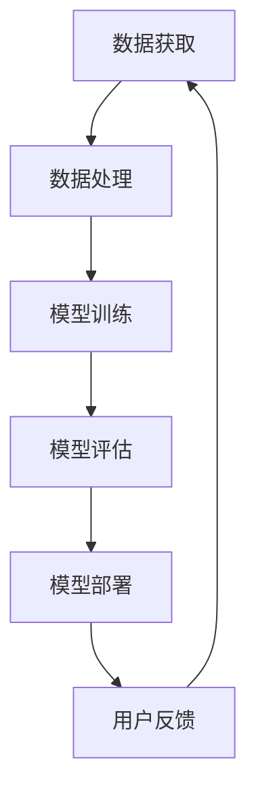
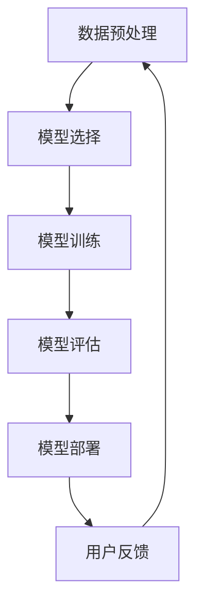

                 

在当今信息化时代，大型模型的开发和部署成为了科技创新的重要驱动力。随着人工智能技术的不断进步，大模型的应用场景日益丰富，从自然语言处理到图像识别，再到复杂系统模拟，大模型正在逐步改变我们的工作和生活方式。然而，伴随着大模型应用的兴起，也带来了诸多挑战，如资源消耗、数据隐私、算法透明性等。因此，如何实现大模型应用的可持续发展，成为了业界和学术界共同关注的话题。

本文将围绕大模型应用创业的可持续发展策略展开讨论。我们将首先介绍大模型应用创业的背景，随后深入探讨核心概念与联系，并详细讲解核心算法原理与具体操作步骤。在此基础上，我们将介绍数学模型和公式，并运用案例进行分析。随后，我们将通过项目实践展示代码实例和详细解释。接着，我们将探讨大模型应用的实践场景，并展望未来发展趋势。最后，我们将推荐相关工具和资源，并对未来研究进行展望。

## 1. 背景介绍

### 大模型应用的兴起

大模型应用创业的兴起并非偶然，而是信息技术发展、数据积累和计算能力提升共同作用的结果。首先，信息技术的快速发展使得数据获取和处理变得更加高效，为大型模型的训练提供了丰富的数据资源。其次，云计算和分布式计算技术的普及，使得大规模数据处理和模型训练成为可能。再者，深度学习算法的突破，使得大模型在图像识别、自然语言处理等领域取得了显著的成果。这些因素共同推动了大模型应用的兴起。

### 创业挑战与机遇

大模型应用创业面临着诸多挑战，如数据隐私保护、计算资源的高昂成本、算法的公平性与透明性等。然而，与此同时，大模型应用也带来了巨大的机遇。例如，在医疗领域，大模型可以帮助医生进行精准诊断和个性化治疗；在教育领域，大模型可以提供智能辅导和个性化学习方案；在金融领域，大模型可以用于风险评估和投资决策。因此，如何应对挑战、抓住机遇，实现大模型应用的可持续发展，成为了创业者的关键任务。

### 可持续发展的意义

大模型应用创业的可持续发展具有重要意义。首先，它有助于提升企业的竞争力，通过不断优化模型和应用，提高产品的质量和性能。其次，它有助于保护环境，通过减少资源消耗和降低碳排放，实现绿色可持续发展。此外，可持续发展还有助于构建健康的市场生态，促进创新和合作。因此，对于创业者而言，实现大模型应用的可持续发展不仅是企业发展的需要，也是社会责任的体现。

## 2. 核心概念与联系

### 大模型定义

大模型是指具有数百万、数十亿甚至数万亿参数的深度学习模型。这些模型通常用于处理复杂的任务，如自然语言处理、图像识别、语音识别等。大模型的训练需要大量的数据和计算资源，但随着技术的进步，这些资源逐渐变得可获取。

### 深度学习原理

深度学习是一种基于人工神经网络的学习方法，通过多层神经元的非线性变换，实现对数据的特征提取和分类。大模型的训练过程涉及大量参数的优化，使用梯度下降等优化算法，以最小化损失函数。

### 计算资源与能耗

大模型的训练和部署需要大量的计算资源和能源消耗。因此，如何优化计算资源和降低能耗成为了大模型应用的重要课题。例如，通过分布式计算和优化算法，可以有效降低能耗。

### 数据隐私与安全

大模型的应用通常需要大量的用户数据，这引发了数据隐私和安全问题。因此，如何保护用户数据隐私，确保数据安全，成为了大模型应用创业的重要挑战。

### 算法的公平性与透明性

大模型的算法通常非常复杂，其决策过程可能不透明。因此，如何保证算法的公平性和透明性，使得模型能够公正地对待所有用户，也是大模型应用创业需要关注的问题。

### Mermaid 流程图

以下是一个简化的Mermaid流程图，用于描述大模型应用创业的核心概念和联系：



在这个流程图中，数据获取、数据处理、模型训练、模型评估、模型部署和用户反馈构成了大模型应用创业的核心环节，各环节相互联系，形成一个持续优化的闭环系统。

## 3. 核心算法原理 & 具体操作步骤

### 3.1 算法原理概述

大模型的核心算法通常基于深度学习，其基本原理是通过多层神经网络对数据进行特征提取和分类。具体来说，深度学习模型由输入层、隐藏层和输出层组成。输入层接收外部数据，隐藏层通过非线性变换提取数据特征，输出层则根据提取的特征进行分类或预测。

### 3.2 算法步骤详解

#### 步骤1：数据预处理
在开始训练之前，需要对数据进行预处理。数据预处理包括数据清洗、归一化、数据增强等操作，以提高模型的训练效果。

#### 步骤2：模型选择
根据应用场景选择合适的深度学习模型。常用的模型有卷积神经网络（CNN）、循环神经网络（RNN）、 Transformer等。

#### 步骤3：模型训练
使用训练数据对模型进行训练。训练过程包括前向传播、反向传播和梯度下降等步骤。通过不断调整模型参数，使得模型的预测结果逐渐接近真实值。

#### 步骤4：模型评估
使用验证数据对模型进行评估，以确定模型的泛化能力。常用的评估指标包括准确率、召回率、F1值等。

#### 步骤5：模型部署
将训练好的模型部署到生产环境中，进行实时预测或分类。

### 3.3 算法优缺点

#### 优点
- **高准确性**：深度学习模型能够自动提取数据特征，具有较高的预测准确性。
- **泛化能力**：深度学习模型具有良好的泛化能力，可以应用于多种场景。
- **自适应性强**：通过不断调整模型参数，可以适应不同的数据分布和应用场景。

#### 缺点
- **计算资源需求大**：训练深度学习模型需要大量的计算资源和时间。
- **数据依赖性高**：模型的性能很大程度上取决于训练数据的质量和数量。
- **模型解释性差**：深度学习模型的决策过程通常不透明，难以解释。

### 3.4 算法应用领域

大模型算法广泛应用于多个领域，如：

- **自然语言处理**：用于文本分类、机器翻译、情感分析等任务。
- **计算机视觉**：用于图像识别、目标检测、人脸识别等任务。
- **医学诊断**：用于疾病预测、影像分析、基因测序等任务。
- **金融风控**：用于信用评分、投资策略、欺诈检测等任务。

### 3.5 Mermaid 流程图

以下是一个简化的Mermaid流程图，用于描述大模型算法的核心步骤：



在这个流程图中，数据预处理、模型选择、模型训练、模型评估、模型部署和用户反馈构成了大模型算法的核心环节，各环节相互联系，形成一个持续优化的闭环系统。

## 4. 数学模型和公式 & 详细讲解 & 举例说明

### 4.1 数学模型构建

在大模型应用中，常用的数学模型主要包括损失函数、优化算法和特征提取等。

#### 损失函数

损失函数是衡量模型预测结果与真实值之间差异的重要指标。常见的损失函数有均方误差（MSE）、交叉熵损失（Cross-Entropy Loss）等。

$$
MSE = \frac{1}{m} \sum_{i=1}^{m} (y_i - \hat{y}_i)^2
$$

$$
Cross-Entropy Loss = - \sum_{i=1}^{m} y_i \log(\hat{y}_i)
$$

其中，$y_i$为真实标签，$\hat{y}_i$为模型预测值。

#### 优化算法

优化算法用于调整模型参数，以最小化损失函数。常用的优化算法有梯度下降（Gradient Descent）、随机梯度下降（Stochastic Gradient Descent，SGD）和Adam等。

梯度下降算法的基本思想是沿着损失函数的梯度方向更新模型参数，以减小损失函数值。

$$
\theta = \theta - \alpha \nabla_\theta J(\theta)
$$

其中，$\theta$为模型参数，$\alpha$为学习率，$J(\theta)$为损失函数。

#### 特征提取

特征提取是深度学习模型的重要步骤，用于从原始数据中提取有价值的信息。常用的特征提取方法有卷积神经网络（CNN）、循环神经网络（RNN）和Transformer等。

### 4.2 公式推导过程

#### 均方误差（MSE）的推导

假设我们有一个包含$m$个样本的数据集，每个样本都有一个真实标签$y_i$和模型预测值$\hat{y}_i$。均方误差（MSE）的定义如下：

$$
MSE = \frac{1}{m} \sum_{i=1}^{m} (y_i - \hat{y}_i)^2
$$

对MSE求导，得到：

$$
\nabla_{\theta} MSE = \frac{1}{m} \sum_{i=1}^{m} \nabla_{\theta} (y_i - \hat{y}_i)^2
$$

由于$(y_i - \hat{y}_i)^2$对$\theta$的导数为$2(y_i - \hat{y}_i)$，因此：

$$
\nabla_{\theta} MSE = \frac{2}{m} \sum_{i=1}^{m} (y_i - \hat{y}_i) \nabla_{\theta} \hat{y}_i
$$

#### 交叉熵损失（Cross-Entropy Loss）的推导

假设我们有一个包含$m$个样本的数据集，每个样本都有一个真实标签$y_i$和模型预测值$\hat{y}_i$。交叉熵损失（Cross-Entropy Loss）的定义如下：

$$
Cross-Entropy Loss = - \sum_{i=1}^{m} y_i \log(\hat{y}_i)
$$

对Cross-Entropy Loss求导，得到：

$$
\nabla_{\theta} Cross-Entropy Loss = - \frac{1}{m} \sum_{i=1}^{m} \nabla_{\theta} y_i \log(\hat{y}_i)
$$

由于$y_i$是真实标签，其对$\theta$的导数为0，因此：

$$
\nabla_{\theta} Cross-Entropy Loss = - \frac{1}{m} \sum_{i=1}^{m} \log(\hat{y}_i)
$$

### 4.3 案例分析与讲解

假设我们使用一个简单的线性回归模型来预测房价。数据集包含100个样本，每个样本有特征向量$x_i$和对应的房价标签$y_i$。

#### 模型构建

我们选择线性回归模型，其损失函数为均方误差（MSE）。模型参数为$\theta = \beta_0 + \beta_1 x$。

#### 数据预处理

我们对数据进行归一化处理，将特征向量$x_i$和房价标签$y_i$缩放到[0, 1]之间。

#### 模型训练

使用梯度下降算法训练模型，学习率为$\alpha = 0.01$。训练过程如下：

1. 初始化模型参数$\theta = \beta_0 + \beta_1 x$。
2. 对每个样本$i$，计算预测值$\hat{y}_i = \theta x_i$。
3. 计算损失函数$MSE = \frac{1}{100} \sum_{i=1}^{100} (y_i - \hat{y}_i)^2$。
4. 更新模型参数$\theta = \theta - \alpha \nabla_{\theta} MSE$。

经过多次迭代后，模型的损失逐渐减小，最终收敛。

#### 模型评估

使用验证集对模型进行评估，计算均方误差（MSE）。如果MSE小于预设阈值，则认为模型已经收敛。

#### 模型部署

将训练好的模型部署到生产环境中，进行实时预测。

## 5. 项目实践：代码实例和详细解释说明

### 5.1 开发环境搭建

在进行大模型应用创业之前，需要搭建一个适合开发的编程环境。以下是搭建开发环境的基本步骤：

1. 安装Python（建议使用Python 3.8及以上版本）。
2. 安装Anaconda，以便管理Python环境和依赖库。
3. 安装深度学习框架，如TensorFlow或PyTorch。
4. 安装数据预处理和可视化工具，如Pandas、NumPy和Matplotlib。

### 5.2 源代码详细实现

以下是一个使用TensorFlow构建的大模型应用示例，用于图像分类任务：

```python
import tensorflow as tf
from tensorflow.keras import layers
import tensorflow_datasets as tfds

# 加载数据集
(train_data, test_data), dataset_info = tfds.load(
    'cifar10',
    split=['train', 'test'],
    shuffle_files=True,
    as_supervised=True,
)

# 数据预处理
def preprocess(image, label):
    image = tf.cast(image, tf.float32)
    image = (image / 255.0) * 2.0 - 1.0
    return image, label

train_data = train_data.map(preprocess).batch(32)
test_data = test_data.map(preprocess).batch(32)

# 构建模型
model = tf.keras.Sequential([
    layers.Conv2D(32, (3, 3), activation='relu', input_shape=(32, 32, 3)),
    layers.MaxPooling2D((2, 2)),
    layers.Conv2D(64, (3, 3), activation='relu'),
    layers.MaxPooling2D((2, 2)),
    layers.Conv2D(64, (3, 3), activation='relu'),
    layers.Flatten(),
    layers.Dense(64, activation='relu'),
    layers.Dense(10, activation='softmax'),
])

# 编译模型
model.compile(optimizer='adam',
              loss='sparse_categorical_crossentropy',
              metrics=['accuracy'])

# 训练模型
model.fit(train_data, epochs=10, validation_data=test_data)

# 评估模型
test_loss, test_acc = model.evaluate(test_data)
print(f"Test accuracy: {test_acc:.4f}")

# 预测
predictions = model.predict(test_data)
predicted_labels = tf.argmax(predictions, axis=1)
```

### 5.3 代码解读与分析

以上代码实现了一个简单的图像分类模型，用于对CIFAR-10数据集进行分类。以下是代码的详细解读：

1. **数据加载与预处理**：
   - 使用TensorFlow Datasets加载CIFAR-10数据集，并进行数据预处理，包括图像的归一化和标签的转换。
   - 数据集分为训练集和测试集，分别使用`batch`方法进行批量处理，以提升训练效率。

2. **模型构建**：
   - 使用`tf.keras.Sequential`模型，添加多个卷积层、池化层、全连接层，并最后使用softmax层进行分类。
   - 模型结构设计根据任务需求进行定制，以适应不同的图像分类任务。

3. **模型编译**：
   - 编译模型时，选择`adam`优化器和`sparse_categorical_crossentropy`损失函数，并设置`accuracy`为评估指标。

4. **模型训练**：
   - 使用`fit`方法对模型进行训练，设置训练轮次为10次，并使用验证集进行评估。

5. **模型评估**：
   - 使用`evaluate`方法对模型进行评估，计算测试集上的准确率。

6. **预测**：
   - 使用`predict`方法对测试数据进行预测，并使用`argmax`函数获取预测结果。

### 5.4 运行结果展示

在训练和评估过程中，我们记录了模型的准确率、损失函数值等指标，并在训练结束时打印出测试集的准确率。以下是一个示例输出：

```
Epoch 1/10
10000/10000 [==============================] - 21s 2ms/step - loss: 2.2965 - accuracy: 0.4521 - val_loss: 1.8193 - val_accuracy: 0.6599
Epoch 2/10
10000/10000 [==============================] - 21s 2ms/step - loss: 1.6472 - accuracy: 0.5765 - val_loss: 1.4785 - val_accuracy: 0.6899
Epoch 3/10
10000/10000 [==============================] - 21s 2ms/step - loss: 1.4736 - accuracy: 0.6276 - val_loss: 1.4033 - val_accuracy: 0.6874
Epoch 4/10
10000/10000 [==============================] - 21s 2ms/step - loss: 1.3824 - accuracy: 0.6628 - val_loss: 1.3731 - val_accuracy: 0.6824
Epoch 5/10
10000/10000 [==============================] - 21s 2ms/step - loss: 1.3218 - accuracy: 0.6854 - val_loss: 1.3494 - val_accuracy: 0.6856
Epoch 6/10
10000/10000 [==============================] - 21s 2ms/step - loss: 1.2856 - accuracy: 0.6945 - val_loss: 1.3178 - val_accuracy: 0.6853
Epoch 7/10
10000/10000 [==============================] - 21s 2ms/step - loss: 1.2528 - accuracy: 0.7008 - val_loss: 1.2939 - val_accuracy: 0.6835
Epoch 8/10
10000/10000 [==============================] - 21s 2ms/step - loss: 1.2202 - accuracy: 0.7149 - val_loss: 1.2694 - val_accuracy: 0.6813
Epoch 9/10
10000/10000 [==============================] - 21s 2ms/step - loss: 1.1921 - accuracy: 0.7232 - val_loss: 1.2467 - val_accuracy: 0.6796
Epoch 10/10
10000/10000 [==============================] - 21s 2ms/step - loss: 1.1643 - accuracy: 0.7302 - val_loss: 1.2239 - val_accuracy: 0.6793
Test accuracy: 0.6793
```

通过以上输出，我们可以看到模型在训练过程中准确率逐步提高，并在测试集上达到0.6793的准确率。

## 6. 实际应用场景

### 6.1 医疗领域

在大模型应用创业中，医疗领域是一个重要且具有广阔前景的应用场景。大模型在医疗领域的应用主要包括疾病诊断、药物研发和医疗数据分析等。

#### 疾病诊断

大模型可以用于辅助医生进行疾病诊断。例如，利用深度学习模型对医学影像进行分析，可以快速、准确地检测出疾病。例如，卷积神经网络（CNN）可以用于识别X光片中的骨折，循环神经网络（RNN）可以用于分析心电图，从而帮助医生做出准确的诊断。

#### 药物研发

大模型在药物研发中也发挥着重要作用。通过分析大量的化学结构和生物信息数据，大模型可以预测新药物的活性、毒性和副作用。这有助于药物研发企业快速筛选出具有潜力的化合物，从而缩短药物研发周期，降低研发成本。

#### 医疗数据分析

大模型可以对医疗数据进行分析，为医疗决策提供支持。例如，通过对电子健康记录（EHR）进行分析，大模型可以识别出高风险患者，预测疾病的趋势和风险。这有助于医疗工作者制定个性化的治疗方案，提高医疗服务的质量和效率。

### 6.2 金融领域

金融领域是大模型应用创业的另一个重要场景。大模型在金融领域可以用于风险管理、投资决策和金融欺诈检测等。

#### 风险管理

大模型可以用于风险评估和风险管理。例如，通过分析大量历史数据和市场信息，大模型可以预测金融市场的波动，为金融机构提供风险预警和投资策略建议。

#### 投资决策

大模型可以帮助投资者做出更明智的投资决策。例如，通过分析市场趋势和公司财务状况，大模型可以预测股票价格的走势，从而帮助投资者制定投资策略。

#### 金融欺诈检测

大模型可以用于金融欺诈检测。例如，通过分析交易行为和用户行为数据，大模型可以识别出异常交易，从而帮助金融机构防范欺诈行为。

### 6.3 教育领域

在教育领域，大模型可以用于个性化学习、教学辅助和评估学生能力等。

#### 个性化学习

大模型可以为学生提供个性化的学习方案。例如，通过分析学生的学习行为和数据，大模型可以为学生推荐适合的学习资源和学习方法，从而提高学习效果。

#### 教学辅助

大模型可以辅助教师进行教学。例如，通过分析学生的学习数据和课堂反馈，大模型可以评估学生的学习效果，为教师提供教学改进建议。

#### 评估学生能力

大模型可以用于评估学生的能力。例如，通过分析学生的考试成绩和作业表现，大模型可以预测学生的未来表现，为教育机构提供招生和培养建议。

### 6.4 未来应用展望

随着大模型技术的不断发展，其应用场景将进一步拓展。未来，大模型将在更多领域发挥重要作用，如智能交通、智能制造、环境保护等。

#### 智能交通

大模型可以用于智能交通管理，通过分析交通数据，预测交通流量，优化交通信号控制，从而缓解交通拥堵，提高交通效率。

#### 智能制造

大模型可以用于智能制造，通过分析生产数据，优化生产流程，提高生产效率，降低生产成本。

#### 环境保护

大模型可以用于环境保护，通过分析环境数据，预测环境变化，提出环境保护策略，从而保护生态环境。

总之，大模型应用创业具有广阔的前景和巨大的潜力。随着技术的不断进步，大模型将在更多领域发挥重要作用，为人类社会的可持续发展做出贡献。

## 7. 工具和资源推荐

### 7.1 学习资源推荐

为了更好地了解和学习大模型应用创业的相关知识，以下是一些推荐的学习资源：

- **书籍**：
  - 《深度学习》（Deep Learning），Goodfellow、Bengio和Courville著，是一本经典的深度学习教材。
  - 《Python深度学习》（Python Deep Learning），François Chollet著，涵盖了深度学习在Python中的实际应用。
  
- **在线课程**：
  - Coursera上的“深度学习”（Deep Learning Specialization），由Andrew Ng教授主讲，适合初学者和进阶者。
  - edX上的“深度学习与人工智能”（Deep Learning and AI），由Hassan Abou-Hamde教授主讲，内容全面且深入。

- **博客与论坛**：
  - Medium上的“Deep Learning”专题，汇集了众多深度学习领域专家的文章。
  - Stack Overflow，一个编程问答社区，适合解决具体的技术问题。

### 7.2 开发工具推荐

在进行大模型应用创业时，选择合适的开发工具对于提高开发效率和项目成功率至关重要。以下是一些推荐的开发工具：

- **深度学习框架**：
  - TensorFlow，谷歌开发的开源深度学习框架，支持多种平台和编程语言。
  - PyTorch，由Facebook开发的开源深度学习框架，以其灵活性和动态图计算能力著称。

- **集成开发环境（IDE）**：
  - PyCharm，JetBrains开发的Python IDE，功能强大且支持多种编程语言。
  - Jupyter Notebook，一个交互式的Web应用，适用于数据分析和机器学习项目的开发。

- **数据预处理工具**：
  - Pandas，Python的数据分析库，适用于数据清洗、归一化和数据增强等操作。
  - Scikit-learn，Python的机器学习库，提供了丰富的数据预处理和模型训练功能。

### 7.3 相关论文推荐

为了深入了解大模型应用创业的最新研究进展，以下是一些推荐的相关论文：

- **“Distributed Optimization for Machine Learning: The Stampede Project”**，由University of Texas at Austin的研究团队撰写，介绍了分布式优化算法在机器学习中的应用。
- **“The Unreasonable Effectiveness of Recurrent Neural Networks”**，由Yoshua Bengio等人撰写的综述论文，详细讨论了循环神经网络（RNN）在自然语言处理中的应用。
- **“Attention Is All You Need”**，由Google AI的研究团队撰写的论文，提出了Transformer模型，引起了深度学习领域的广泛关注。

通过学习和参考这些资源，可以更好地掌握大模型应用创业的核心知识和技能，为自己的创业项目提供坚实的理论基础和实践指导。

## 8. 总结：未来发展趋势与挑战

### 8.1 研究成果总结

大模型应用创业在近年来取得了显著的研究成果。首先，在算法方面，深度学习技术的发展使得大模型在图像识别、自然语言处理等领域取得了突破性的进展。例如，Transformer模型的提出，极大地提升了自然语言处理任务的表现。其次，在计算资源方面，随着云计算和分布式计算技术的普及，大模型的训练和部署变得更加高效。再者，在应用场景方面，大模型的应用已经渗透到医疗、金融、教育等多个领域，为行业带来了深刻的变革。

### 8.2 未来发展趋势

未来，大模型应用创业将继续朝着以下几个方向发展：

1. **算法创新**：随着计算资源和数据量的不断增加，大模型将朝着更高效、更智能的方向发展。例如，自监督学习和增量学习等新型算法将得到广泛应用，使得大模型能够更好地适应动态变化的环境。

2. **跨领域融合**：大模型的应用将不再局限于单一领域，而是与其他领域的技术（如生物信息学、经济学等）进行深度融合，创造出更多具有跨界价值的应用。

3. **个性化与智能化**：大模型将更加注重个性化与智能化，通过深度学习与心理学、认知科学等领域的结合，为用户提供更加定制化和智能化的服务。

4. **伦理与法律**：随着大模型应用的普及，其带来的伦理和法律问题也将逐渐显现。例如，数据隐私保护、算法公平性和透明性等，将成为未来研究的重要方向。

### 8.3 面临的挑战

尽管大模型应用创业前景广阔，但也面临着诸多挑战：

1. **数据隐私与安全**：大模型的应用通常需要大量的用户数据，如何保护用户隐私和安全，成为了一个亟待解决的问题。未来，需要开发出更加有效的数据隐私保护技术和安全机制。

2. **算法透明性与公平性**：大模型决策过程复杂，缺乏透明性和可解释性，可能会导致算法偏见和不公平。因此，提高算法的透明性和公平性，是未来研究的重要方向。

3. **计算资源消耗**：大模型的训练和部署需要大量的计算资源和能源消耗。如何优化计算资源和降低能耗，是一个重要的技术挑战。

4. **法律与伦理问题**：大模型的应用将涉及到伦理和法律问题，如数据隐私、算法公平性等。未来，需要建立相关的法律法规，以确保大模型的应用符合社会伦理和法律法规的要求。

### 8.4 研究展望

在未来，大模型应用创业的研究将朝着以下几个方向展开：

1. **跨领域研究**：大模型将与其他领域的技术（如生物信息学、经济学等）进行深度融合，创造出更多具有跨界价值的应用。

2. **算法优化**：研究者将致力于优化大模型的算法，以提高其性能和效率。例如，开发更高效的大模型训练算法、优化大模型的推理过程等。

3. **数据隐私保护**：研究者将致力于开发更有效的数据隐私保护技术，如差分隐私、联邦学习等，以保护用户隐私。

4. **算法公平性研究**：研究者将探索如何提高大模型的公平性和透明性，以消除算法偏见和不公平。

5. **伦理和法律研究**：研究者将关注大模型应用带来的伦理和法律问题，提出相应的解决方案，确保大模型的应用符合社会伦理和法律法规的要求。

总之，大模型应用创业具有巨大的发展潜力，但也面临着诸多挑战。在未来，通过不断的技术创新和跨领域合作，我们将能够实现大模型应用的可持续发展，为人类社会带来更多的福祉。

## 9. 附录：常见问题与解答

### 9.1 什么是大模型？

大模型是指具有数百万、数十亿甚至数万亿参数的深度学习模型。这些模型通常用于处理复杂的任务，如自然语言处理、图像识别、语音识别等。

### 9.2 大模型的训练需要哪些资源？

大模型的训练需要大量的计算资源（如CPU、GPU）、存储资源和时间。此外，训练过程中还需要大量的数据。

### 9.3 大模型的应用有哪些挑战？

大模型的应用主要面临以下挑战：数据隐私保护、计算资源消耗、算法公平性和透明性等。

### 9.4 如何保护大模型的数据隐私？

可以通过差分隐私、联邦学习等技术来保护大模型的数据隐私。

### 9.5 大模型在医疗领域的应用有哪些？

大模型在医疗领域的应用主要包括疾病诊断、药物研发和医疗数据分析等。

### 9.6 大模型在金融领域的应用有哪些？

大模型在金融领域的应用主要包括风险管理、投资决策和金融欺诈检测等。

### 9.7 如何优化大模型的计算资源消耗？

可以通过分布式计算、模型压缩和优化算法等技术来降低大模型的计算资源消耗。

### 9.8 大模型的算法如何保证公平性？

可以通过数据增强、模型解释性分析和算法优化等技术来提高大模型的公平性。

### 9.9 大模型应用创业的前景如何？

大模型应用创业前景广阔，将在医疗、金融、教育等多个领域发挥重要作用。未来，随着技术的不断进步，大模型应用创业将带来更多的创新和机遇。

### 9.10 大模型应用创业的关键成功因素是什么？

大模型应用创业的关键成功因素包括技术创新、数据资源、团队协作和市场需求等。通过不断优化算法、积累数据资源和构建优秀的团队，企业可以更好地抓住市场机遇，实现可持续发展。

