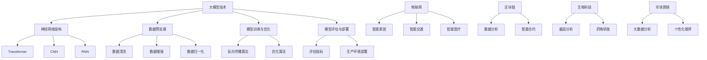

                 

关键词：大模型应用、创业、跨界合作、人工智能、商业模式创新、技术整合、行业应用、协同效应

> 摘要：本文将探讨大模型应用在创业中的跨界合作机会。通过分析大模型技术的发展趋势和行业应用现状，我们将探索大模型与其他领域技术、行业和商业模式相结合的创新路径，从而为创业者提供有价值的参考。

## 1. 背景介绍

随着人工智能技术的快速发展，大模型（如GPT、BERT等）在自然语言处理、计算机视觉、语音识别等领域取得了显著的突破。这些大模型具有强大的数据分析和处理能力，能够从海量数据中提取出有价值的信息，为各行各业提供智能化解决方案。然而，大模型的应用并非孤立的，它需要与其他领域技术、行业和商业模式进行跨界合作，才能实现更大的价值。

创业者在面对日益激烈的市场竞争时，如何把握大模型应用的跨界合作机会，创新商业模式，提升企业竞争力，成为亟待解决的问题。本文将围绕这一主题展开讨论。

## 2. 核心概念与联系

### 2.1 大模型技术概述

大模型技术是基于深度学习的人工智能技术，通过训练大规模神经网络模型，使其具备从数据中学习、推理和生成的能力。大模型技术主要包括以下几个方面：

1. **神经网络架构**：如Transformer、CNN、RNN等，用于构建大规模神经网络模型。
2. **数据预处理**：包括数据清洗、数据增强、数据归一化等，以保证模型训练的质量和效率。
3. **模型训练与优化**：通过反向传播算法、优化算法（如Adam、SGD等）等，对模型进行训练和优化。
4. **模型评估与部署**：使用各种评估指标（如准确率、召回率等）对模型性能进行评估，并将模型部署到生产环境中。

### 2.2 跨界合作的概念

跨界合作是指不同领域的企业、组织或个人，通过整合各自的优势资源，共同开展合作，实现互利共赢的过程。在创业领域，跨界合作可以帮助企业突破原有的行业限制，拓展新的业务领域，提升核心竞争力。

### 2.3 大模型应用与跨界合作的联系

大模型技术的快速发展为各行业带来了巨大的变革，也为创业者的跨界合作提供了新的机遇。以下是几个典型的跨界合作场景：

1. **大模型与物联网（IoT）**：通过将大模型技术应用于物联网设备，可以实现智能家居、智能交通、智能医疗等领域的智能化解决方案。
2. **大模型与区块链**：大模型技术可以用于区块链数据分析和智能合约执行，提高区块链系统的透明度和安全性。
3. **大模型与生物科技**：大模型在基因分析、药物研发等生物科技领域具有广泛的应用潜力，可以帮助生物科技企业加速创新进程。
4. **大模型与市场营销**：通过大数据分析和个性化推荐，大模型可以为企业提供精准的市场营销策略，提高客户满意度和转化率。

### 2.4 Mermaid 流程图

下面是一个描述大模型应用与跨界合作关系的 Mermaid 流程图：



## 3. 核心算法原理 & 具体操作步骤

### 3.1 算法原理概述

大模型技术主要基于深度学习理论，通过多层神经网络结构对数据进行学习、提取和建模。核心算法包括以下几个方面：

1. **神经网络架构**：包括卷积神经网络（CNN）、循环神经网络（RNN）和变换器架构（Transformer）等。
2. **模型训练与优化**：使用梯度下降算法、Adam优化器等对模型进行训练和优化。
3. **模型评估与部署**：通过准确率、召回率等评估指标对模型性能进行评估，并将模型部署到生产环境中。

### 3.2 算法步骤详解

1. **数据预处理**：对原始数据进行清洗、增强和归一化处理，以提高模型训练的质量和效率。
2. **模型架构设计**：根据应用场景选择合适的神经网络架构，并设计模型的层次结构和参数设置。
3. **模型训练**：使用训练数据对模型进行训练，通过反向传播算法和优化算法更新模型参数。
4. **模型评估**：使用验证数据对模型性能进行评估，根据评估结果调整模型参数和架构。
5. **模型部署**：将训练好的模型部署到生产环境中，实现实际应用。

### 3.3 算法优缺点

1. **优点**：
   - **强大的数据处理能力**：大模型能够处理大规模、多样化的数据，提取出有价值的信息。
   - **自适应性强**：大模型可以根据不同的应用场景进行调整和优化，实现灵活的应用。
   - **高精度**：大模型在图像识别、自然语言处理等领域取得了较高的准确率。

2. **缺点**：
   - **计算资源需求大**：大模型训练和部署需要大量的计算资源，对硬件设备有较高要求。
   - **数据隐私和安全问题**：大模型训练过程中需要处理海量数据，涉及数据隐私和安全问题。
   - **对数据质量和标注依赖性强**：大模型训练效果依赖于数据质量和标注质量，对数据预处理和标注有较高要求。

### 3.4 算法应用领域

大模型技术在各个领域都有广泛的应用，以下是几个典型的应用领域：

1. **自然语言处理**：包括文本分类、机器翻译、情感分析等。
2. **计算机视觉**：包括图像识别、目标检测、图像生成等。
3. **语音识别**：包括语音识别、语音合成等。
4. **医疗健康**：包括疾病诊断、药物研发、医疗数据分析等。
5. **金融科技**：包括风险管理、智能投顾、金融数据分析等。

## 4. 数学模型和公式 & 详细讲解 & 举例说明

### 4.1 数学模型构建

大模型技术的核心在于构建大规模的神经网络模型，其中涉及到多个数学模型和公式。以下是几个关键的数学模型：

1. **线性回归**：用于预测连续值变量。
   $$ y = \beta_0 + \beta_1x $$
2. **逻辑回归**：用于预测二元分类结果。
   $$ P(y=1) = \frac{1}{1 + e^{-(\beta_0 + \beta_1x)}} $$
3. **卷积神经网络（CNN）**：用于图像识别和处理。
   $$ \text{CNN}(x) = f(\text{ReLU}((W_1 \cdot x) + b_1)) $$
4. **循环神经网络（RNN）**：用于序列数据处理。
   $$ h_t = \text{ReLU}((W_h \cdot h_{t-1}) + (W_x \cdot x_t) + b_h) $$

### 4.2 公式推导过程

以卷积神经网络（CNN）为例，我们简要介绍卷积操作的推导过程：

1. **卷积操作定义**：
   $$ (f * g)(t) = \sum_{k=-\infty}^{\infty} f(t-k) \cdot g(k) $$
2. **一维卷积**：
   $$ (f * g)(t) = \sum_{k=0}^{N-1} f(t-k) \cdot g(k) $$
3. **二维卷积**：
   $$ (f * g)(t) = \sum_{i=0}^{M-1} \sum_{j=0}^{N-1} f(t-i-j) \cdot g(i,j) $$

### 4.3 案例分析与讲解

以下是一个使用卷积神经网络进行图像分类的案例：

**案例背景**：给定一个包含1000个类别的图像数据集，使用卷积神经网络进行图像分类。

**模型架构**：卷积神经网络包含5个卷积层、3个池化层和2个全连接层。

**训练过程**：使用10000张训练图像和1000张验证图像进行模型训练。

**评估指标**：准确率、召回率和F1分数。

**模型部署**：将训练好的模型部署到生产环境中，对用户上传的图像进行分类。

通过这个案例，我们可以看到大模型技术在图像分类领域的应用，以及如何构建和训练一个卷积神经网络模型。

## 5. 项目实践：代码实例和详细解释说明

### 5.1 开发环境搭建

**环境要求**：
- Python 3.8及以上版本
- TensorFlow 2.6及以上版本
- CUDA 11.0及以上版本（如使用GPU训练）

**安装步骤**：

1. 安装Python和pip：
   ```bash
   sudo apt-get install python3 python3-pip
   ```
2. 安装TensorFlow：
   ```bash
   pip3 install tensorflow==2.6
   ```
3. 安装CUDA：
   ```bash
   sudo apt-get install cuda
   ```

### 5.2 源代码详细实现

以下是一个简单的卷积神经网络（CNN）模型实现，用于图像分类。

```python
import tensorflow as tf
from tensorflow.keras import layers

def create_cnn_model(input_shape):
    model = tf.keras.Sequential([
        layers.Conv2D(32, (3, 3), activation='relu', input_shape=input_shape),
        layers.MaxPooling2D((2, 2)),
        layers.Conv2D(64, (3, 3), activation='relu'),
        layers.MaxPooling2D((2, 2)),
        layers.Conv2D(128, (3, 3), activation='relu'),
        layers.Flatten(),
        layers.Dense(128, activation='relu'),
        layers.Dense(10, activation='softmax')
    ])
    return model

# 示例：输入图像尺寸为(28, 28, 3)
input_shape = (28, 28, 3)
model = create_cnn_model(input_shape)
```

### 5.3 代码解读与分析

1. **模型定义**：使用`tf.keras.Sequential`定义一个顺序模型，依次添加层。
2. **卷积层**：使用`layers.Conv2D`添加卷积层，设置卷积核大小、激活函数和输入形状。
3. **池化层**：使用`layers.MaxPooling2D`添加池化层，用于减小特征图的尺寸。
4. **全连接层**：使用`layers.Dense`添加全连接层，用于分类和回归任务。
5. **模型编译**：使用`model.compile`设置优化器和损失函数。

### 5.4 运行结果展示

**训练过程**：

```python
model.compile(optimizer='adam', loss='categorical_crossentropy', metrics=['accuracy'])
model.fit(x_train, y_train, batch_size=64, epochs=10, validation_data=(x_val, y_val))
```

**评估结果**：

```python
test_loss, test_acc = model.evaluate(x_test, y_test, verbose=2)
print(f"Test accuracy: {test_acc}")
```

## 6. 实际应用场景

大模型技术在各行各业都有广泛的应用，以下是几个典型的实际应用场景：

1. **金融行业**：大模型可以用于风险管理、信用评估、量化交易等。例如，通过构建金融模型，预测市场走势，为投资者提供决策参考。
2. **医疗行业**：大模型可以用于疾病诊断、药物研发、医疗数据分析等。例如，通过分析医疗数据，为患者提供个性化的治疗方案。
3. **零售行业**：大模型可以用于商品推荐、客户画像、销售预测等。例如，通过分析用户行为数据，为商家提供精准的营销策略。
4. **教育行业**：大模型可以用于智能教育、在线教育、学习分析等。例如，通过分析学生的学习数据，为教师提供个性化的教学建议。

## 7. 未来应用展望

随着大模型技术的不断发展和应用，未来将出现更多跨领域的创新和应用。以下是一些未来应用展望：

1. **跨领域数据融合**：大模型技术可以融合来自不同领域的数据，为企业和行业提供更全面的解决方案。
2. **智能化城市**：大模型技术可以应用于智慧城市建设，实现城市管理的智能化和高效化。
3. **智能制造**：大模型技术可以用于工业生产、供应链管理等领域，提升制造业的智能化水平。
4. **个性化医疗**：大模型技术可以用于个性化医疗，为患者提供更加精准和高效的医疗服务。

## 8. 工具和资源推荐

### 8.1 学习资源推荐

1. **《深度学习》（Goodfellow, Bengio, Courville著）**：一本经典的深度学习教材，全面介绍了深度学习的基本原理和方法。
2. **吴恩达的深度学习课程**：在Coursera上提供的免费课程，涵盖了深度学习的各个领域，适合初学者和进阶者。

### 8.2 开发工具推荐

1. **TensorFlow**：一款开源的深度学习框架，支持多种神经网络结构和模型训练。
2. **PyTorch**：另一款流行的深度学习框架，具有灵活的动态计算图和强大的社区支持。

### 8.3 相关论文推荐

1. **《Attention Is All You Need》**：一篇关于变换器架构（Transformer）的论文，揭示了变换器在自然语言处理领域的突破性应用。
2. **《ImageNet Classification with Deep Convolutional Neural Networks》**：一篇关于卷积神经网络（CNN）在图像识别领域应用的经典论文。

## 9. 总结：未来发展趋势与挑战

### 9.1 研究成果总结

大模型技术在人工智能领域取得了显著的突破，为各行各业提供了创新的解决方案。未来，大模型技术将继续发展，并在更多领域实现应用。

### 9.2 未来发展趋势

1. **模型压缩与优化**：为了降低大模型的计算资源和存储需求，模型压缩与优化将成为研究热点。
2. **跨领域数据融合**：大模型技术将应用于跨领域数据融合，为企业和行业提供更全面的解决方案。
3. **人工智能伦理**：随着人工智能技术的应用日益广泛，伦理和隐私问题将受到更多关注。

### 9.3 面临的挑战

1. **计算资源需求**：大模型训练和部署需要大量的计算资源，如何高效利用计算资源将成为挑战。
2. **数据质量和标注**：大模型训练效果依赖于数据质量和标注质量，如何提高数据质量和标注效率是重要问题。
3. **人工智能伦理**：随着人工智能技术的应用日益广泛，伦理和隐私问题将受到更多关注。

### 9.4 研究展望

未来，大模型技术将继续发展，并在更多领域实现应用。同时，如何解决计算资源需求、数据质量和标注、人工智能伦理等问题，将成为重要研究方向。

## 附录：常见问题与解答

### 1. 大模型训练需要多少计算资源？

大模型训练需要大量的计算资源，特别是GPU或TPU等专用硬件设备。具体计算资源需求取决于模型的规模和应用场景。

### 2. 如何提高大模型训练的效率？

提高大模型训练效率的方法包括：

1. **模型压缩与优化**：通过剪枝、量化等方法减小模型规模，降低计算资源需求。
2. **分布式训练**：将训练任务分布在多台设备上，提高训练速度。
3. **数据预处理**：通过数据增强、数据并行等方法提高训练数据利用效率。

### 3. 大模型在哪些领域有广泛应用？

大模型在自然语言处理、计算机视觉、语音识别、医疗健康、金融科技等领域有广泛应用。未来，大模型技术将在更多领域实现应用。

### 4. 如何保护大模型训练中的数据隐私？

为了保护大模型训练中的数据隐私，可以采取以下措施：

1. **数据脱敏**：对训练数据进行脱敏处理，去除敏感信息。
2. **数据加密**：对训练数据加密，确保数据在传输和存储过程中的安全性。
3. **联邦学习**：通过联邦学习技术，在本地设备上进行模型训练，减少数据传输和共享。

作者：禅与计算机程序设计艺术 / Zen and the Art of Computer Programming
----------------------------------------------------------------

### 后记
本文旨在探讨大模型应用创业中的跨界合作机会。通过对大模型技术、跨界合作和实际应用场景的分析，我们展示了大模型技术在各领域的创新潜力。然而，大模型技术的应用仍面临诸多挑战，如计算资源需求、数据质量和标注、人工智能伦理等。未来，随着大模型技术的不断发展，创业者可以积极探索跨界合作，实现业务创新和价值提升。希望本文能为创业者提供有价值的参考。

