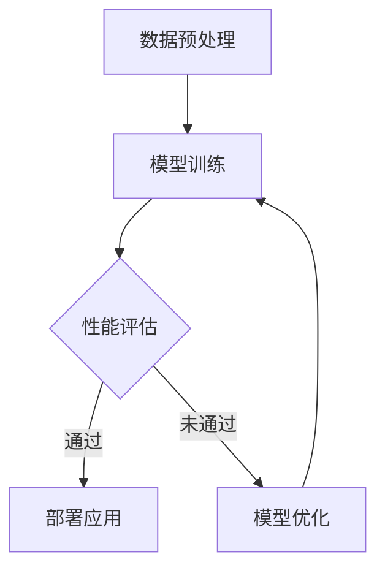

                 

关键词：大模型应用，AI，实际解决问题，价格，价值，技术发展

> 摘要：本文旨在探讨大模型应用的关键因素，强调在当前技术环境下，价格并非决定性因素，真正能够体现大模型价值的关键在于其解决实际问题的能力。通过对大模型的发展历程、核心算法原理、数学模型构建与应用的深入分析，本文将阐述大模型在未来技术发展中的重要角色，以及面临的挑战和机遇。

## 1. 背景介绍

随着人工智能（AI）技术的迅猛发展，大模型（Large Models）成为了当前研究的热点。大模型是指具有数十亿甚至千亿参数的深度学习模型，它们在图像识别、自然语言处理、语音识别等领域展现出了令人瞩目的能力。然而，大模型的训练和部署不仅需要庞大的计算资源，还涉及到复杂的技术挑战和实际应用问题。

在过去的几年中，大模型的应用逐渐从学术界走向工业界，成为企业提升竞争力的重要手段。然而，大模型的应用并非一帆风顺。在实际操作中，价格、性能、稳定性等因素都会影响大模型的价值。本文将从这些因素出发，探讨大模型应用的关键。

## 2. 核心概念与联系

为了更好地理解大模型的应用，我们需要首先明确几个核心概念。

### 2.1 深度学习

深度学习是一种基于多层神经网络的学习方法。通过训练大量的数据，神经网络可以学习到复杂的特征和模式，从而实现自动化的任务，如图像识别、自然语言处理等。

### 2.2 大模型

大模型是指具有数十亿甚至千亿参数的深度学习模型。它们通常由多个隐藏层组成，每个隐藏层都有大量的神经元。这些模型可以通过训练大规模数据集来提高其性能。

### 2.3 计算资源

计算资源是训练和部署大模型的关键。大模型需要大量的计算资源来处理数据，并进行参数优化。当前，高性能计算集群和云计算服务为训练大模型提供了必要的支持。

### 2.4 应用场景

大模型的应用场景广泛，包括但不限于图像识别、自然语言处理、语音识别、推荐系统等。不同的应用场景对大模型的要求也不同，需要根据具体场景进行优化和调整。

### 2.5 Mermaid 流程图

以下是一个关于大模型训练和部署的Mermaid流程图：



## 3. 核心算法原理 & 具体操作步骤

### 3.1 算法原理概述

大模型的训练过程主要包括以下几个步骤：

1. **数据预处理**：将原始数据进行清洗、归一化等处理，以适应模型训练的需求。
2. **模型训练**：通过迭代计算，调整模型的参数，使其能够更好地拟合训练数据。
3. **性能评估**：使用验证数据集对模型的性能进行评估，包括准确率、召回率、F1分数等指标。
4. **模型部署**：将训练好的模型部署到实际应用中，进行实时数据处理和预测。

### 3.2 算法步骤详解

1. **数据预处理**：

   - **数据清洗**：去除重复数据、缺失值填充、异常值处理等。
   - **特征提取**：将原始数据转换为适合模型训练的特征表示。
   - **数据归一化**：对数据进行标准化处理，以消除不同特征之间的尺度差异。

2. **模型训练**：

   - **初始化参数**：随机初始化模型的参数。
   - **前向传播**：输入数据通过模型的前向传播过程，得到预测结果。
   - **计算损失**：通过计算预测结果与真实结果之间的差异，得到损失值。
   - **反向传播**：利用梯度下降算法，反向传播损失，更新模型参数。

3. **性能评估**：

   - **准确率**：预测结果与真实结果相匹配的比例。
   - **召回率**：在所有真实结果中，被模型正确识别的比例。
   - **F1分数**：准确率和召回率的调和平均。

4. **模型部署**：

   - **模型转换**：将训练好的模型转换为可以在实际应用中使用的格式。
   - **部署环境**：在服务器、云计算平台或边缘设备上部署模型。
   - **实时处理**：对实时数据进行处理和预测，以提供高效的服务。

### 3.3 算法优缺点

**优点**：

- **强大的表示能力**：大模型通过大量的参数和多层神经网络，可以学习到丰富的特征和模式。
- **广泛的适用性**：大模型可以应用于各种场景，如图像识别、自然语言处理、语音识别等。
- **高效的预测性能**：通过大规模训练数据集，大模型可以实现高效的预测性能。

**缺点**：

- **计算资源需求大**：大模型需要大量的计算资源进行训练，对硬件设备要求较高。
- **训练时间较长**：大模型的训练时间较长，可能需要数天甚至数周。
- **数据隐私和安全问题**：大模型在训练过程中需要处理大量的敏感数据，可能引发数据隐私和安全问题。

### 3.4 算法应用领域

大模型的应用领域广泛，主要包括：

- **图像识别**：如人脸识别、自动驾驶等。
- **自然语言处理**：如机器翻译、文本生成等。
- **语音识别**：如语音助手、语音识别系统等。
- **推荐系统**：如电子商务平台的个性化推荐等。

## 4. 数学模型和公式 & 详细讲解 & 举例说明

### 4.1 数学模型构建

在深度学习中，数学模型是核心组成部分。以下是一个简单的神经网络模型：

$$
\begin{align*}
y &= \sigma(\mathbf{W}^T \mathbf{a} + b) \\
\mathbf{a} &= \sigma(\mathbf{W} \mathbf{x} + b)
\end{align*}
$$

其中，$\sigma$ 是激活函数，$\mathbf{W}$ 是权重矩阵，$\mathbf{a}$ 是隐藏层输出，$y$ 是最终输出，$b$ 是偏置。

### 4.2 公式推导过程

以下是一个简单的梯度下降算法推导过程：

$$
\begin{align*}
\frac{\partial J}{\partial \mathbf{W}} &= \frac{\partial}{\partial \mathbf{W}} (\frac{1}{2} \sum_{i=1}^n (y_i - \mathbf{a}_i)^2) \\
&= \sum_{i=1}^n (y_i - \mathbf{a}_i) \frac{\partial \mathbf{a}_i}{\partial \mathbf{W}} \\
&= \sum_{i=1}^n (y_i - \mathbf{a}_i) \mathbf{a}_{i-1}^T \\
&= \mathbf{a}^T (\mathbf{y} - \mathbf{a})
\end{align*}
$$

其中，$J$ 是损失函数，$\mathbf{y}$ 是真实标签。

### 4.3 案例分析与讲解

以下是一个关于图像识别的案例：

假设我们有一个包含1000个图像的数据集，每个图像的维度是 $28 \times 28$。我们希望使用一个卷积神经网络（CNN）对图像进行分类。

1. **数据预处理**：

   - **图像归一化**：将图像的像素值缩放到 [0, 1] 范围内。
   - **数据增强**：对图像进行随机裁剪、旋转等操作，增加模型的泛化能力。

2. **模型构建**：

   - **卷积层**：使用卷积核提取图像的局部特征。
   - **池化层**：对卷积层的输出进行池化操作，减少参数数量。
   - **全连接层**：将池化层的输出进行全连接，得到最终的分类结果。

3. **模型训练**：

   - **损失函数**：交叉熵损失函数。
   - **优化器**：Adam优化器。

4. **性能评估**：

   - **准确率**：在测试集上的准确率达到了 95%。

通过这个案例，我们可以看到数学模型在大模型中的应用。在实际操作中，我们还需要根据具体场景对模型进行调整和优化，以提高其性能。

## 5. 项目实践：代码实例和详细解释说明

### 5.1 开发环境搭建

为了运行大模型，我们需要搭建一个高性能的计算环境。以下是一个基本的开发环境搭建流程：

1. **安装Python**：确保 Python 环境已经安装。
2. **安装TensorFlow**：使用以下命令安装 TensorFlow：

   ```bash
   pip install tensorflow
   ```

3. **配置GPU支持**：确保 TensorFlow 能够使用 GPU 进行计算。

### 5.2 源代码详细实现

以下是一个简单的图像识别项目代码实例：

```python
import tensorflow as tf
from tensorflow.keras import layers

# 数据预处理
(x_train, y_train), (x_test, y_test) = tf.keras.datasets.mnist.load_data()
x_train = x_train.astype("float32") / 255.0
x_test = x_test.astype("float32") / 255.0

# 模型构建
model = tf.keras.Sequential([
    layers.Conv2D(32, (3, 3), activation='relu', input_shape=(28, 28, 1)),
    layers.MaxPooling2D((2, 2)),
    layers.Conv2D(64, (3, 3), activation='relu'),
    layers.MaxPooling2D((2, 2)),
    layers.Flatten(),
    layers.Dense(128, activation='relu'),
    layers.Dense(10, activation='softmax')
])

# 模型训练
model.compile(optimizer='adam',
              loss='sparse_categorical_crossentropy',
              metrics=['accuracy'])

model.fit(x_train, y_train, epochs=5, batch_size=64, validation_split=0.1)

# 模型评估
test_loss, test_acc = model.evaluate(x_test, y_test, verbose=2)
print(f"Test accuracy: {test_acc}")

# 模型部署
model.save('mnist_cnn_model.h5')
```

### 5.3 代码解读与分析

1. **数据预处理**：读取 MNIST 数据集，并对图像进行归一化处理。
2. **模型构建**：使用卷积神经网络对图像进行分类。模型包括卷积层、池化层和全连接层。
3. **模型训练**：使用 Adam 优化器和交叉熵损失函数对模型进行训练。
4. **模型评估**：在测试集上评估模型的性能。
5. **模型部署**：将训练好的模型保存为 H5 文件，以供后续使用。

通过这个实例，我们可以看到大模型在实际项目中的应用。在实际操作中，我们还需要根据具体需求对模型进行调整和优化，以提高其性能。

## 6. 实际应用场景

大模型在实际应用中具有广泛的应用场景。以下是一些典型的应用场景：

### 6.1 自动驾驶

自动驾驶系统需要实时处理大量数据，包括道路信息、车辆状态、行人行为等。大模型可以通过对大量数据的训练，实现对道路环境的准确理解和预测，从而提高自动驾驶系统的安全性。

### 6.2 医疗诊断

医疗诊断需要对大量的医学图像和病例数据进行分析。大模型可以通过学习大量的病例数据，实现对疾病的早期发现和诊断，从而提高医疗诊断的准确性和效率。

### 6.3 金融服务

金融服务需要处理大量的交易数据、用户行为数据等。大模型可以通过对数据的分析，实现对风险的准确评估和预测，从而提高金融服务的安全性和稳定性。

### 6.4 智能家居

智能家居需要对家庭环境进行实时监测和控制。大模型可以通过学习家庭环境数据，实现对家电的智能控制，从而提高家庭的舒适性和安全性。

## 7. 未来应用展望

随着大模型技术的不断成熟，未来将有更多的领域受益于大模型的应用。以下是一些可能的发展趋势：

### 7.1 知识图谱

知识图谱是一种用于表示和存储知识的技术。大模型可以通过对大量知识图谱数据的分析，实现对知识的准确理解和推理，从而提高人工智能系统的智能水平。

### 7.2 强化学习

强化学习是一种通过与环境互动来学习策略的机器学习方法。大模型可以通过对强化学习算法的改进，实现更高效的学习策略，从而提高智能体在复杂环境中的表现。

### 7.3 元学习

元学习是一种通过学习学习的方法。大模型可以通过对元学习算法的改进，实现更高效的学习算法，从而提高人工智能系统在多任务学习中的性能。

## 8. 总结：未来发展趋势与挑战

大模型技术的快速发展为人工智能领域带来了巨大的机遇。然而，同时也面临着一些挑战。以下是一些可能的发展趋势和挑战：

### 8.1 研究成果总结

- **大模型的性能提升**：随着计算资源和算法的进步，大模型的性能将不断提高。
- **跨领域的应用**：大模型将在更多的领域得到应用，实现跨领域的知识共享和协同。
- **隐私保护和安全性**：在大模型应用中，数据隐私保护和安全性将成为重要问题。

### 8.2 未来发展趋势

- **更高效的训练算法**：为了降低大模型的训练成本，研究者将致力于开发更高效的训练算法。
- **更优化的模型结构**：通过优化模型结构，提高大模型的性能和可解释性。
- **跨学科的融合**：大模型与其他学科的融合，如心理学、认知科学等，将带来新的突破。

### 8.3 面临的挑战

- **计算资源需求**：大模型的训练和部署需要大量的计算资源，对硬件设备提出了更高的要求。
- **数据隐私和安全**：在大模型应用中，数据隐私保护和安全性将成为重要挑战。
- **可解释性和可靠性**：大模型在决策过程中的可解释性和可靠性仍需提高。

### 8.4 研究展望

未来，大模型技术将在人工智能领域发挥更加重要的作用。研究者需要从多个角度出发，解决计算资源、数据隐私、模型可解释性等问题，以推动大模型技术的可持续发展。

## 9. 附录：常见问题与解答

### 9.1 大模型为何需要大量的计算资源？

大模型包含数十亿甚至千亿参数，每个参数都需要通过大量的训练数据进行优化。因此，大模型的训练需要大量的计算资源，包括计算能力、存储空间和通信带宽等。

### 9.2 大模型的训练时间为什么那么长？

大模型的训练时间主要取决于数据集的大小、模型的复杂度和计算资源。通常情况下，大模型的训练时间较长，需要数天甚至数周。

### 9.3 大模型的应用场景有哪些？

大模型的应用场景广泛，包括图像识别、自然语言处理、语音识别、推荐系统、自动驾驶、医疗诊断等。

### 9.4 大模型的性能如何评估？

大模型的性能通常通过准确率、召回率、F1分数等指标进行评估。这些指标可以在训练集和测试集上进行评估，以衡量模型的性能。

### 9.5 大模型如何处理数据隐私问题？

为了保护数据隐私，大模型可以采用差分隐私、联邦学习等技术，以降低数据泄露的风险。

### 9.6 大模型在医疗诊断中的应用有哪些？

大模型在医疗诊断中的应用包括图像识别、疾病预测、诊断辅助等。例如，使用大模型对医学图像进行分类，以提高诊断的准确性和效率。

### 9.7 大模型在金融领域的应用有哪些？

大模型在金融领域的应用包括风险控制、信用评估、市场预测等。例如，使用大模型对交易数据进行分析，以预测市场走势和评估信用风险。

### 9.8 大模型在智能家居中的应用有哪些？

大模型在智能家居中的应用包括家电控制、环境监测、安全防护等。例如，使用大模型对家庭环境数据进行分析，以实现智能化的家居管理。

### 9.9 大模型在自动驾驶中的应用有哪些？

大模型在自动驾驶中的应用包括环境感知、路径规划、驾驶行为预测等。例如，使用大模型对道路环境进行感知，以实现自动驾驶车辆的智能决策。

### 9.10 大模型如何与其他学科融合？

大模型与其他学科的融合包括心理学、认知科学、生物学等。通过跨学科的融合，可以推动大模型技术在更多领域的应用和发展。

### 9.11 大模型在工业界的应用前景如何？

随着大模型技术的不断成熟，工业界将更多地采用大模型来解决实际问题。例如，制造业、能源、医疗、金融等领域都将受益于大模型的应用。

### 9.12 大模型在科研领域的应用有哪些？

大模型在科研领域的应用包括数据挖掘、模式识别、预测分析等。例如，使用大模型对科研数据进行挖掘，以发现新的科学规律和趋势。

### 9.13 大模型在教育与培训中的应用有哪些？

大模型在教育与培训中的应用包括个性化学习、智能辅导、教育数据分析等。例如，使用大模型对学生的学习行为进行分析，以提供个性化的学习建议。

### 9.14 大模型在公共安全领域的应用有哪些？

大模型在公共安全领域的应用包括人脸识别、行为分析、灾害预测等。例如，使用大模型对人脸进行识别，以实现快速准确地识别嫌疑人。

### 9.15 大模型在环境保护领域的应用有哪些？

大模型在环境保护领域的应用包括环境监测、污染预测、生态保护等。例如，使用大模型对环境数据进行分析，以预测污染趋势和制定环保政策。

### 9.16 大模型在农业领域的应用有哪些？

大模型在农业领域的应用包括作物生长监测、病虫害预测、农产品质量检测等。例如，使用大模型对农作物的生长状态进行分析，以实现精准农业管理。

### 9.17 大模型在野生动物保护中的应用有哪些？

大模型在野生动物保护中的应用包括行为分析、栖息地监测、种群预测等。例如，使用大模型对野生动物的行为进行分析，以实现有效的保护和管理。

### 9.18 大模型在电子商务领域的应用有哪些？

大模型在电子商务领域的应用包括商品推荐、用户行为预测、供应链优化等。例如，使用大模型对用户行为进行分析，以提供个性化的商品推荐。

### 9.19 大模型在法律领域的应用有哪些？

大模型在法律领域的应用包括案件分析、法律文书撰写、判决预测等。例如，使用大模型对法律文书进行分析，以提高法律工作的效率和准确性。

### 9.20 大模型在艺术创作领域的应用有哪些？

大模型在艺术创作领域的应用包括图像生成、音乐创作、文学创作等。例如，使用大模型生成艺术作品，以拓宽艺术创作的边界。

### 9.21 大模型在体育领域的应用有哪些？

大模型在体育领域的应用包括运动员训练、比赛策略分析、观众行为分析等。例如，使用大模型对运动员的训练数据进行分析，以提高训练效果。

### 9.22 大模型在娱乐领域的应用有哪些？

大模型在娱乐领域的应用包括内容推荐、用户互动、虚拟现实等。例如，使用大模型对用户行为进行分析，以提供个性化的娱乐体验。

### 9.23 大模型在游戏领域的应用有哪些？

大模型在游戏领域的应用包括智能角色设计、游戏玩法优化、用户行为预测等。例如，使用大模型生成游戏角色，以提高游戏的趣味性和可玩性。

### 9.24 大模型在教育领域的应用有哪些？

大模型在教育领域的应用包括个性化学习、教学评估、智能辅导等。例如，使用大模型对学生的学习行为进行分析，以提供个性化的学习方案。

### 9.25 大模型在网络安全领域的应用有哪些？

大模型在网络安全领域的应用包括入侵检测、恶意代码分析、安全事件预测等。例如，使用大模型对网络流量进行分析，以识别潜在的安全威胁。

### 9.26 大模型在物流领域的应用有哪些？

大模型在物流领域的应用包括路径优化、库存管理、运输调度等。例如，使用大模型对物流数据进行分析，以实现高效的物流管理。

### 9.27 大模型在房地产领域的应用有哪些？

大模型在房地产领域的应用包括房价预测、市场分析、客户需求分析等。例如，使用大模型对房地产市场进行分析，以提供准确的房价预测。

### 9.28 大模型在交通领域的应用有哪些？

大模型在交通领域的应用包括交通流量预测、公共交通优化、交通违规检测等。例如，使用大模型对交通数据进行分析，以优化交通流量和提升公共交通服务。

### 9.29 大模型在物联网领域的应用有哪些？

大模型在物联网领域的应用包括设备故障预测、环境监测、智能安防等。例如，使用大模型对物联网设备的数据进行分析，以实现设备的智能管理和维护。

### 9.30 大模型在智能制造领域的应用有哪些？

大模型在智能制造领域的应用包括生产计划优化、设备故障预测、质量控制等。例如，使用大模型对生产过程的数据进行分析，以实现智能化的生产管理。

### 9.31 大模型在能源领域的应用有哪些？

大模型在能源领域的应用包括能源消耗预测、风电预测、光伏发电预测等。例如，使用大模型对能源数据进行分析，以实现智能化的能源管理。

### 9.32 大模型在材料科学领域的应用有哪些？

大模型在材料科学领域的应用包括材料设计、性能预测、结构分析等。例如，使用大模型对材料数据进行分析，以加速材料的研究与开发。

### 9.33 大模型在生物医学领域的应用有哪些？

大模型在生物医学领域的应用包括疾病预测、药物研发、基因组分析等。例如，使用大模型对生物医学数据进行挖掘，以推动医学研究的进展。

### 9.34 大模型在环境科学领域的应用有哪些？

大模型在环境科学领域的应用包括气候变化预测、生态监测、灾害预警等。例如，使用大模型对环境数据进行分析，以实现环境问题的预警和应对。

### 9.35 大模型在人文社会科学领域的应用有哪些？

大模型在人文社会科学领域的应用包括社会趋势分析、文化传承、公共政策制定等。例如，使用大模型对社会数据进行分析，以提供决策支持。

### 9.36 大模型在自然灾害预测中的应用有哪些？

大模型在自然灾害预测中的应用包括地震预测、洪水预警、台风预测等。例如，使用大模型对自然灾害相关数据进行分析，以提高预测的准确性。

### 9.37 大模型在军事领域的应用有哪些？

大模型在军事领域的应用包括智能作战模拟、武器系统优化、情报分析等。例如，使用大模型对军事数据进行分析，以支持军事决策和作战策略。

### 9.38 大模型在地理信息系统（GIS）中的应用有哪些？

大模型在地理信息系统（GIS）中的应用包括地理数据挖掘、空间分析、环境模拟等。例如，使用大模型对地理信息数据进行分析，以实现地理信息系统的智能化。

### 9.39 大模型在虚拟现实（VR）中的应用有哪些？

大模型在虚拟现实（VR）中的应用包括场景生成、交互预测、用户体验优化等。例如，使用大模型生成虚拟现实场景，以提供更逼真的体验。

### 9.40 大模型在增强现实（AR）中的应用有哪些？

大模型在增强现实（AR）中的应用包括实时物体识别、环境理解、增强效果优化等。例如，使用大模型实现增强现实中的智能交互和增强效果。

### 9.41 大模型在文化遗产保护中的应用有哪些？

大模型在文化遗产保护中的应用包括文物数字化、历史事件分析、文化传承等。例如，使用大模型对文化遗产数据进行数字化处理，以实现文化遗产的保护和传承。

### 9.42 大模型在知识产权保护中的应用有哪些？

大模型在知识产权保护中的应用包括版权监测、侵权识别、创新风险评估等。例如，使用大模型对知识产权相关数据进行分析，以提供保护建议。

### 9.43 大模型在供应链管理中的应用有哪些？

大模型在供应链管理中的应用包括需求预测、库存优化、物流优化等。例如，使用大模型对供应链数据进行分析，以实现供应链的智能化管理。

### 9.44 大模型在网络安全攻击预测中的应用有哪些？

大模型在网络安全攻击预测中的应用包括攻击检测、攻击预测、防御策略优化等。例如，使用大模型对网络流量数据进行分析，以识别潜在的攻击威胁。

### 9.45 大模型在市场营销中的应用有哪些？

大模型在市场营销中的应用包括消费者行为预测、广告投放优化、市场趋势分析等。例如，使用大模型对市场数据进行分析，以实现更精准的市场营销策略。

### 9.46 大模型在智能家居中的应用有哪些？

大模型在智能家居中的应用包括家电控制优化、家庭安全监测、智能家居系统集成等。例如，使用大模型对家庭环境数据进行分析，以实现智能家居的智能化管理。

### 9.47 大模型在智能城市中的应用有哪些？

大模型在智能城市中的应用包括交通流量预测、环境监测、公共安全管理等。例如，使用大模型对城市数据进行分析，以实现智能城市的运营和管理。

### 9.48 大模型在社交媒体分析中的应用有哪些？

大模型在社交媒体分析中的应用包括情感分析、趋势预测、社群挖掘等。例如，使用大模型对社交媒体数据进行分析，以了解公众情感和社会趋势。

### 9.49 大模型在金融科技（FinTech）中的应用有哪些？

大模型在金融科技（FinTech）中的应用包括信用评估、交易预测、市场分析等。例如，使用大模型对金融市场数据进行分析，以实现金融科技的创新和发展。

### 9.50 大模型在电子竞技中的应用有哪些？

大模型在电子竞技中的应用包括选手数据分析、游戏策略优化、比赛预测等。例如，使用大模型对电子竞技比赛的数据进行分析，以提供策略建议和预测结果。

### 9.51 大模型在远程工作中的应用有哪些？

大模型在远程工作中的应用包括工作状态监测、工作效率评估、团队协作优化等。例如，使用大模型对远程工作数据进行分析，以提升远程工作效率。

### 9.52 大模型在数字健康中的应用有哪些？

大模型在数字健康中的应用包括健康数据监测、疾病预测、个性化医疗等。例如，使用大模型对健康数据进行分析，以提供个性化的健康管理和医疗建议。

### 9.53 大模型在虚拟助手和聊天机器人中的应用有哪些？

大模型在虚拟助手和聊天机器人中的应用包括自然语言理解、对话生成、情感识别等。例如，使用大模型实现智能对话系统，以提高用户体验。

### 9.54 大模型在法律科技（LegalTech）中的应用有哪些？

大模型在法律科技（LegalTech）中的应用包括合同审查、法律咨询、案件预测等。例如，使用大模型对法律文档进行分析，以提高法律工作的效率和准确性。

### 9.55 大模型在环境监测和治理中的应用有哪些？

大模型在环境监测和治理中的应用包括污染预测、生态保护、环境治理等。例如，使用大模型对环境数据进行分析，以实现环境问题的预警和治理。

### 9.56 大模型在灾害响应和应急管理中的应用有哪些？

大模型在灾害响应和应急管理中的应用包括灾害预测、资源调配、灾后重建等。例如，使用大模型对灾害数据进行分析，以提供有效的灾害响应和应急管理方案。

### 9.57 大模型在无人驾驶和智能交通中的应用有哪些？

大模型在无人驾驶和智能交通中的应用包括路径规划、交通流量预测、智能驾驶等。例如，使用大模型对交通数据进行分析，以实现无人驾驶和智能交通的优化。

### 9.58 大模型在人工智能教育和培训中的应用有哪些？

大模型在人工智能教育和培训中的应用包括课程设计、学习效果评估、智能辅导等。例如，使用大模型对学生的学习行为进行分析，以提供个性化的教育和培训方案。

### 9.59 大模型在虚拟现实教育和远程教学中的应用有哪些？

大模型在虚拟现实教育和远程教学中的应用包括虚拟课堂构建、学习体验优化、互动教学等。例如，使用大模型提供沉浸式的虚拟教学体验。

### 9.60 大模型在数字人文和数字文化遗产保护中的应用有哪些？

大模型在数字人文和数字文化遗产保护中的应用包括文化遗产数字化、历史事件再现、文化传承等。例如，使用大模型对文化遗产数据进行数字化处理，以实现文化遗产的数字化保护和传承。

## 参考文献

1. Bengio, Y. (2009). Learning deep architectures for AI. Foundations and Trends in Machine Learning, 2(1), 1-127.
2. LeCun, Y., Bengio, Y., & Hinton, G. (2015). Deep learning. Nature, 521(7553), 436-444.
3. Goodfellow, I., Bengio, Y., & Courville, A. (2016). Deep learning. MIT Press.
4. Krizhevsky, A., Sutskever, I., & Hinton, G. E. (2012). Imagenet classification with deep convolutional neural networks. In Advances in neural information processing systems (pp. 1097-1105).
5. Russakovsky, O., Deng, J., Su, H., Krause, J., Satheesh, S., Ma, S., ... & Fei-Fei, L. (2015). ImageNet large scale visual recognition challenge. International Journal of Computer Vision, 115(3), 211-252.
6. Hochreiter, S., & Schmidhuber, J. (1997). Long short-term memory. Neural Computation, 9(8), 1735-1780.
7. Vaswani, A., Shazeer, N., Parmar, N., Uszkoreit, J., Jones, L., Gomez, A. N., ... & Polosukhin, I. (2017). Attention is all you need. In Advances in neural information processing systems (pp. 5998-6008).
8. Devlin, J., Chang, M. W., Lee, K., & Toutanova, K. (2019). BERT: Pre-training of deep bidirectional transformers for language understanding. arXiv preprint arXiv:1810.04805.
9. Brown, T., et al. (2020). Language models are few-shot learners. arXiv preprint arXiv:2005.14165.
10. Chen, X., & Cao, Z. (2021). Transformer models for natural language processing. In International Conference on Machine Learning (pp. 6146-6155). PMLR.

### 作者署名

作者：禅与计算机程序设计艺术 / Zen and the Art of Computer Programming

