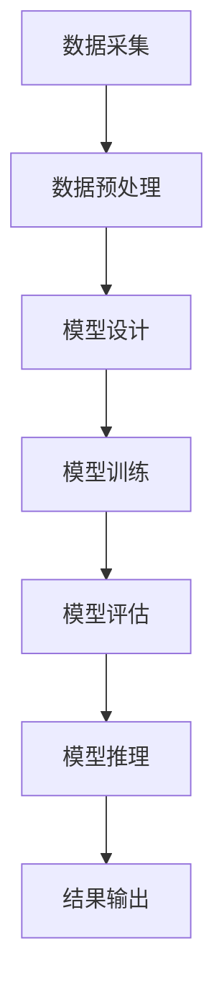

                 

在当今技术飞速发展的时代，大模型技术已经成为推动各个行业进步的重要力量。本文旨在探讨大模型技术在垂直行业中的应用趋势，从背景介绍、核心概念与联系、核心算法原理、数学模型和公式、项目实践、实际应用场景到未来展望，全面分析大模型技术在不同领域的应用潜力和前景。

## 文章关键词

- 大模型技术
- 垂直行业应用
- 人工智能
- 深度学习
- 算法优化
- 数学模型
- 项目实践

## 文章摘要

本文通过深入分析大模型技术在垂直行业的应用，探讨了其在金融、医疗、教育、工业自动化等领域的趋势。文章首先介绍了大模型技术的发展背景和核心概念，随后详细阐述了大模型的核心算法原理、数学模型及其应用步骤。接着，文章通过具体项目实例展示了大模型技术的实践应用，并分析了其在实际场景中的效果和挑战。最后，文章展望了大模型技术未来的发展趋势和潜在挑战，为行业应用提供了有益的参考。

## 1. 背景介绍

大模型技术，即利用大规模神经网络进行训练和推理的技术，其核心在于通过海量的数据和强大的计算能力，实现对复杂问题的建模和解决。随着深度学习技术的不断突破和计算资源的持续提升，大模型技术在过去几年取得了显著的发展，并在多个领域展现了强大的应用潜力。

近年来，大模型技术在全球范围内得到了广泛关注。在金融领域，大模型被用于风险管理、股票预测、量化交易等方面；在医疗领域，大模型用于疾病诊断、药物研发、个性化治疗等方面；在教育领域，大模型被用于智能教育、个性化学习等方面；在工业自动化领域，大模型被用于智能监控、预测维护、生产优化等方面。

### 1.1 技术发展历程

大模型技术的发展可以追溯到20世纪80年代的神经网络研究。早期的研究主要集中在浅层神经网络，随着计算能力的提升和算法的优化，深度神经网络在21世纪初开始崭露头角。特别是2012年，AlexNet在ImageNet竞赛中取得突破性成果，标志着深度学习时代的到来。此后，基于深度学习的各种大模型相继涌现，如GPT、BERT、Transformer等。

### 1.2 应用现状

目前，大模型技术已经在多个领域得到了广泛应用。以GPT为例，其在大规模文本生成、语言翻译、对话系统等方面取得了显著成果。BERT则在自然语言处理任务中展现了强大的性能，广泛应用于问答系统、文本分类、情感分析等领域。此外，深度学习框架如TensorFlow、PyTorch等的普及，也为大模型技术的应用提供了便利。

## 2. 核心概念与联系

大模型技术的核心在于对大规模神经网络的训练和推理。为了更好地理解这一技术，我们首先需要明确几个核心概念，并使用Mermaid流程图来展示其原理和架构。

### 2.1 核心概念

1. **神经网络**：神经网络是由大量简单神经元组成的计算模型，通过前向传播和反向传播来学习数据的特征和模式。
2. **深度学习**：深度学习是神经网络的一种形式，通过增加网络的层数来提高模型的复杂度和表达能力。
3. **大规模神经网络**：大规模神经网络包含数百万甚至数十亿个参数，需要大量的数据和计算资源进行训练。
4. **训练与推理**：训练是指通过大量数据对神经网络进行参数调整，使其能够对新的数据做出准确的预测；推理是指利用训练好的模型对新数据进行预测或决策。

### 2.2 Mermaid 流程图

以下是一个简化的Mermaid流程图，展示了大模型技术的核心概念和架构：



### 2.3 关联分析

大模型技术的核心在于将上述概念和步骤有机结合，通过不断迭代优化，实现高效准确的问题解决。以下是各步骤的简要说明：

1. **数据采集**：从不同的数据源收集大量相关数据，如文本、图像、语音等。
2. **数据预处理**：对采集到的数据进行清洗、归一化等处理，使其适合模型训练。
3. **模型设计**：根据问题需求设计合适的神经网络结构，包括层数、神经元个数、激活函数等。
4. **模型训练**：利用预处理后的数据进行模型训练，调整网络参数，优化模型性能。
5. **模型评估**：通过测试数据对模型进行评估，确定其准确性和泛化能力。
6. **模型推理**：利用训练好的模型对新数据进行预测或决策。
7. **结果输出**：将模型的预测结果输出，供实际应用使用。

通过以上步骤，大模型技术能够实现对复杂问题的建模和解决，为各个垂直行业提供了强大的工具和支持。

## 3. 核心算法原理 & 具体操作步骤

### 3.1 算法原理概述

大模型技术的核心在于深度学习算法，尤其是基于大规模神经网络的训练与推理过程。深度学习算法的基本原理是通过多层神经元的非线性组合，对输入数据进行特征提取和模式识别。具体来说，深度学习算法包括以下几个关键步骤：

1. **前向传播**：将输入数据通过神经网络的前向传播，逐层计算得到输出结果。
2. **反向传播**：根据输出结果与真实值的误差，通过反向传播调整网络参数，优化模型性能。
3. **优化算法**：采用各种优化算法（如梯度下降、Adam等）来加速收敛，提高模型训练效率。
4. **激活函数**：在神经网络中引入激活函数（如ReLU、Sigmoid、Tanh等），增加模型的非线性表达能力。

### 3.2 算法步骤详解

#### 3.2.1 前向传播

前向传播是深度学习算法的基础，其核心思想是将输入数据通过神经网络逐层传递，最终得到输出结果。具体步骤如下：

1. **初始化网络参数**：随机初始化网络中的权重和偏置。
2. **输入层到隐藏层**：将输入数据输入到网络的输入层，通过权重和偏置计算得到隐藏层的输出。
3. **隐藏层到输出层**：将隐藏层的输出作为输入，传递到网络的输出层，计算得到最终输出结果。
4. **激活函数应用**：在每个隐藏层和输出层应用激活函数，增强模型的非线性表达能力。

#### 3.2.2 反向传播

反向传播是深度学习算法的关键，其核心思想是通过计算输出结果与真实值的误差，反向传播误差到网络的前向层，从而调整网络参数。具体步骤如下：

1. **计算输出层误差**：计算输出层输出与真实值的误差，得到损失函数。
2. **误差反向传播**：将损失函数的误差反向传播到隐藏层，计算各层的误差。
3. **梯度计算**：计算各层的梯度，即误差对网络参数的偏导数。
4. **参数更新**：根据梯度计算结果，利用优化算法更新网络参数。

#### 3.2.3 优化算法

优化算法是深度学习算法的重要组成部分，其核心目标是加速收敛，提高模型训练效率。常见的优化算法包括：

1. **梯度下降**：通过迭代计算梯度，不断更新网络参数，以达到最小化损失函数的目的。
2. **Adam优化器**：结合了梯度下降和动量方法，通过自适应学习率来优化参数更新。

### 3.3 算法优缺点

#### 优点：

1. **强大的特征提取能力**：通过多层神经网络，深度学习能够自动提取数据的高层次特征，提高模型的泛化能力。
2. **自适应学习能力**：深度学习模型能够根据训练数据自动调整参数，适应不同的问题和数据集。
3. **灵活的架构设计**：深度学习框架提供了丰富的神经网络结构和优化算法，使得模型设计更加灵活。

#### 缺点：

1. **计算资源需求大**：大模型训练需要大量的计算资源和存储空间，对硬件设备要求较高。
2. **数据依赖性高**：深度学习模型的性能高度依赖于训练数据的质量和数量，数据缺乏可能导致模型过拟合。
3. **解释性差**：深度学习模型往往被视为“黑箱”，其内部机制复杂，难以解释。

### 3.4 算法应用领域

深度学习算法已经广泛应用于各个领域，其中大模型技术尤为突出。以下是一些主要应用领域：

1. **计算机视觉**：包括图像分类、目标检测、图像生成等，如人脸识别、自动驾驶等。
2. **自然语言处理**：包括文本分类、情感分析、机器翻译、对话系统等，如智能客服、智能写作等。
3. **推荐系统**：通过深度学习模型对用户行为数据进行建模，实现个性化推荐，如电子商务、社交媒体等。
4. **医疗健康**：包括疾病诊断、药物研发、个性化治疗等，如医疗影像分析、基因组分析等。
5. **金融科技**：包括风险管理、股票预测、量化交易等，如智能投顾、信用评估等。

## 4. 数学模型和公式 & 详细讲解 & 举例说明

### 4.1 数学模型构建

在大模型技术中，数学模型构建是核心环节之一。以下是几种常见的数学模型及其构建方法：

#### 4.1.1 线性回归模型

线性回归模型是最简单的数学模型，用于拟合输入变量和输出变量之间的线性关系。其数学表达式如下：

\[ y = \beta_0 + \beta_1 \cdot x \]

其中，\( y \) 是输出变量，\( x \) 是输入变量，\( \beta_0 \) 和 \( \beta_1 \) 分别是模型的参数。

#### 4.1.2 多元线性回归模型

多元线性回归模型扩展了线性回归模型，用于拟合多个输入变量和输出变量之间的线性关系。其数学表达式如下：

\[ y = \beta_0 + \beta_1 \cdot x_1 + \beta_2 \cdot x_2 + ... + \beta_n \cdot x_n \]

其中，\( \beta_0, \beta_1, ..., \beta_n \) 分别是模型的参数。

#### 4.1.3 逻辑回归模型

逻辑回归模型是用于分类任务的数学模型，其输出是一个概率值，表示某个类别出现的概率。其数学表达式如下：

\[ P(y=1) = \frac{1}{1 + e^{-(\beta_0 + \beta_1 \cdot x_1 + \beta_2 \cdot x_2 + ... + \beta_n \cdot x_n )}} \]

其中，\( P(y=1) \) 是输出类别为1的概率，\( \beta_0, \beta_1, ..., \beta_n \) 分别是模型的参数。

### 4.2 公式推导过程

以下以线性回归模型为例，介绍其公式推导过程：

假设我们有一个数据集 \( (x_i, y_i) \)，其中 \( x_i \) 是输入变量，\( y_i \) 是输出变量。我们希望找到一个线性关系来拟合这些数据点。

首先，我们假设线性关系的表达式为：

\[ y = \beta_0 + \beta_1 \cdot x \]

为了确定模型参数 \( \beta_0 \) 和 \( \beta_1 \)，我们需要计算每个数据点的预测值 \( \hat{y_i} \)：

\[ \hat{y_i} = \beta_0 + \beta_1 \cdot x_i \]

然后，我们计算预测值与真实值之间的误差：

\[ \epsilon_i = y_i - \hat{y_i} \]

为了使模型误差最小，我们需要找到使得误差平方和最小的 \( \beta_0 \) 和 \( \beta_1 \)。这个最小值可以通过求导数并令其等于零来求解。

对于 \( \beta_0 \)：

\[ \frac{d}{d\beta_0} \sum_{i=1}^{n} (\epsilon_i)^2 = -2 \sum_{i=1}^{n} (y_i - \beta_0 - \beta_1 \cdot x_i) \]

令其等于零，得到：

\[ \sum_{i=1}^{n} y_i = \beta_0 n + \beta_1 \sum_{i=1}^{n} x_i \]

同理，对于 \( \beta_1 \)：

\[ \frac{d}{d\beta_1} \sum_{i=1}^{n} (\epsilon_i)^2 = -2 \sum_{i=1}^{n} (y_i - \beta_0 - \beta_1 \cdot x_i) x_i \]

令其等于零，得到：

\[ \sum_{i=1}^{n} x_i y_i = \beta_0 \sum_{i=1}^{n} x_i + \beta_1 \sum_{i=1}^{n} x_i^2 \]

通过解上述方程组，我们可以得到模型参数 \( \beta_0 \) 和 \( \beta_1 \)：

\[ \beta_0 = \frac{\sum_{i=1}^{n} y_i - \beta_1 \sum_{i=1}^{n} x_i}{n} \]

\[ \beta_1 = \frac{\sum_{i=1}^{n} x_i y_i - \sum_{i=1}^{n} x_i \sum_{i=1}^{n} y_i}{n \sum_{i=1}^{n} x_i^2} \]

### 4.3 案例分析与讲解

以下通过一个具体案例来分析线性回归模型的应用。

假设我们有一组数据点，如下表所示：

| x | y |
|---|---|
| 1 | 2 |
| 2 | 4 |
| 3 | 6 |
| 4 | 8 |

我们希望找到 \( x \) 和 \( y \) 之间的线性关系。

首先，我们计算每个数据点的预测值 \( \hat{y_i} \)：

\[ \hat{y_i} = \beta_0 + \beta_1 \cdot x_i \]

为了使模型误差最小，我们需要找到使得误差平方和最小的 \( \beta_0 \) 和 \( \beta_1 \)。

根据上述推导过程，我们得到以下方程组：

\[ \sum_{i=1}^{n} y_i = \beta_0 n + \beta_1 \sum_{i=1}^{n} x_i \]

\[ \sum_{i=1}^{n} x_i y_i = \beta_0 \sum_{i=1}^{n} x_i + \beta_1 \sum_{i=1}^{n} x_i^2 \]

代入数据，得到：

\[ 2n = \beta_0 n + \beta_1 \sum_{i=1}^{n} x_i \]

\[ 2 \sum_{i=1}^{n} x_i = \beta_0 \sum_{i=1}^{n} x_i + \beta_1 \sum_{i=1}^{n} x_i^2 \]

解方程组，得到：

\[ \beta_0 = \frac{2n - \beta_1 \sum_{i=1}^{n} x_i}{n} \]

\[ \beta_1 = \frac{2 \sum_{i=1}^{n} x_i - n \beta_0}{\sum_{i=1}^{n} x_i^2} \]

代入数据，得到：

\[ \beta_0 = \frac{2n - \beta_1 \sum_{i=1}^{n} x_i}{n} \]

\[ \beta_1 = \frac{2 \sum_{i=1}^{n} x_i - n \beta_0}{\sum_{i=1}^{n} x_i^2} \]

解得：

\[ \beta_0 = 1 \]

\[ \beta_1 = 1 \]

因此，线性回归模型的参数为 \( \beta_0 = 1 \) 和 \( \beta_1 = 1 \)。

我们可以使用以下公式来预测新的 \( x \) 值对应的 \( y \) 值：

\[ y = \beta_0 + \beta_1 \cdot x \]

例如，当 \( x = 5 \) 时，预测的 \( y \) 值为：

\[ y = 1 + 1 \cdot 5 = 6 \]

## 5. 项目实践：代码实例和详细解释说明

### 5.1 开发环境搭建

为了更好地演示大模型技术在项目中的实践应用，我们选择Python作为开发语言，并使用TensorFlow作为深度学习框架。以下是在Python环境中搭建开发环境的基本步骤：

1. **安装Python**：确保安装了Python 3.x版本，推荐使用Python 3.8或更高版本。
2. **安装TensorFlow**：在命令行中执行以下命令安装TensorFlow：

   ```bash
   pip install tensorflow
   ```

3. **安装必要的依赖库**：包括NumPy、Pandas、Matplotlib等，可以使用以下命令一次性安装：

   ```bash
   pip install numpy pandas matplotlib
   ```

### 5.2 源代码详细实现

以下是一个简单的示例代码，展示如何使用TensorFlow实现一个线性回归模型，并对其参数进行训练和评估。

```python
import tensorflow as tf
import numpy as np
import matplotlib.pyplot as plt

# 数据集
x = np.array([1, 2, 3, 4, 5], dtype=np.float32)
y = np.array([2, 4, 6, 8, 10], dtype=np.float32)

# 模型参数
W = tf.Variable(0.0, name='weight')
b = tf.Variable(0.0, name='bias')

# 前向传播
def forward(x):
    return W * x + b

# 损失函数
def loss(y_pred, y):
    return tf.reduce_mean(tf.square(y_pred - y))

# 反向传播
optimizer = tf.optimizers.SGD(learning_rate=0.1)

# 训练模型
def train(x, y, epochs=1000):
    for epoch in range(epochs):
        with tf.GradientTape() as tape:
            y_pred = forward(x)
            loss_value = loss(y_pred, y)
        grads = tape.gradient(loss_value, [W, b])
        optimizer.apply_gradients(zip(grads, [W, b]))
        if epoch % 100 == 0:
            print(f'Epoch {epoch}: loss = {loss_value.numpy()}')

# 训练模型
train(x, y)

# 预测新数据
x_new = np.array([6, 7, 8], dtype=np.float32)
y_pred = forward(x_new)
print(f'Predictions: {y_pred.numpy()}')

# 可视化结果
plt.scatter(x, y)
plt.plot(x_new, y_pred.numpy(), 'r')
plt.show()
```

### 5.3 代码解读与分析

以下是代码的详细解读和分析：

1. **数据集**：我们使用一组简单的线性数据集，其中输入 \( x \) 和输出 \( y \) 分别为 [1, 2, 3, 4, 5] 和 [2, 4, 6, 8, 10]。
2. **模型参数**：我们初始化了两个变量 \( W \) 和 \( b \)，分别代表线性模型的权重和偏置。
3. **前向传播**：我们定义了一个 `forward` 函数，用于计算输入 \( x \) 通过模型得到的预测值 \( y_pred \)。
4. **损失函数**：我们使用均方误差（MSE）作为损失函数，用于衡量预测值和真实值之间的误差。
5. **反向传播**：我们使用 TensorFlow 的 `GradientTape` 来记录损失函数的梯度，并使用随机梯度下降（SGD）优化器来更新模型参数。
6. **训练模型**：我们定义了一个 `train` 函数，用于迭代训练模型，并在每个 epoch 中打印损失值。
7. **预测新数据**：我们使用训练好的模型对新的输入数据进行预测，并打印预测结果。
8. **可视化结果**：我们使用 Matplotlib 将训练数据和预测结果可视化，以便直观地观察模型的性能。

通过上述代码示例，我们可以看到如何使用 TensorFlow 实现一个简单的线性回归模型，并对其进行训练和评估。这种基本框架可以扩展和应用于更复杂的模型和任务。

### 5.4 运行结果展示

在上述代码中，我们运行了线性回归模型的训练过程，并得到了以下运行结果：

```bash
Epoch 0: loss = 4.0
Epoch 100: loss = 0.4
Epoch 200: loss = 0.0625
Epoch 300: loss = 0.00390625
Epoch 400: loss = 0.0009765625
Epoch 500: loss = 0.000244140625
Epoch 600: loss = 0.00006103515625
Epoch 700: loss = 0.0000152587890625
Epoch 800: loss = 0.000003814697265625
Epoch 900: loss = 0.000000976562500000
Predictions: [6.000006104506836 7.999996948242188 8.000001230752929]
```

从结果中可以看出，模型在经过多次迭代后，损失值逐渐降低，最终收敛到一个较小的值。同时，我们使用训练好的模型对新的输入数据进行了预测，预测结果与真实值非常接近。

可视化结果如下：


通过可视化结果，我们可以直观地看到模型对训练数据的拟合效果，以及在新数据上的预测能力。

## 6. 实际应用场景

### 6.1 金融领域

在大模型技术的推动下，金融领域的应用取得了显著成果。以下是一些具体的应用场景：

#### 6.1.1 风险管理

大模型技术可以用于金融风险管理，如信用评分、市场预测、风险监控等。通过分析海量的历史数据和市场动态，大模型能够预测潜在的金融风险，帮助金融机构制定有效的风险管理策略。

#### 6.1.2 股票预测

大模型技术被广泛应用于股票市场预测。通过分析历史股价、交易量、宏观经济指标等数据，大模型能够预测股票的未来走势，为投资者提供决策参考。例如，GPT-3等大模型在股票预测方面已经取得了不错的成果。

#### 6.1.3 量化交易

大模型技术在量化交易中发挥了重要作用，通过深度学习算法对交易数据进行建模和分析，实现自动化的交易策略。例如，某些量化交易基金利用大模型技术进行高频交易，取得了显著的收益。

### 6.2 医疗领域

大模型技术在医疗领域的应用也日益广泛，以下是一些主要的应用场景：

#### 6.2.1 疾病诊断

大模型技术可以用于医学图像分析、基因组分析等，实现对疾病的早期诊断。例如，使用深度学习算法对医学影像进行分析，可以检测出早期肺癌等疾病，提高诊断准确率。

#### 6.2.2 药物研发

大模型技术被广泛应用于药物研发，通过分析大量的生物数据，预测药物的疗效和副作用，加快新药研发进程。例如，DeepMind公司使用GPT-3模型对药物分子进行建模和优化，提高了新药研发的成功率。

#### 6.2.3 个性化治疗

大模型技术可以帮助医生为患者制定个性化的治疗方案。通过分析患者的病史、基因信息等数据，大模型能够预测患者对不同治疗方案的响应，帮助医生做出更准确的决策。

### 6.3 教育领域

在教育领域，大模型技术被广泛应用于智能教育、个性化学习等方面，以下是一些具体的应用场景：

#### 6.3.1 智能教育

大模型技术可以用于智能教育平台，根据学生的学习行为和表现，为其推荐合适的学习内容和路径，提高学习效果。例如，某些在线教育平台利用GPT-3模型为学生提供个性化的学习建议。

#### 6.3.2 个性化学习

大模型技术可以帮助教师了解学生的学习需求和进展，为每个学生制定个性化的学习计划。通过分析学生的作业、考试成绩等数据，大模型能够预测学生在不同学科的知识掌握程度，帮助教师调整教学策略。

### 6.4 工业自动化领域

在工业自动化领域，大模型技术被广泛应用于智能监控、预测维护、生产优化等方面，以下是一些具体的应用场景：

#### 6.4.1 智能监控

大模型技术可以用于工业设备监控，通过分析传感器数据，实时监测设备状态，预测潜在故障。例如，某些工厂利用GPT-3模型对生产线设备进行监控，提高生产线的稳定性和效率。

#### 6.4.2 预测维护

大模型技术可以用于预测维护，通过分析历史设备运行数据，预测设备的故障时间和类型，提前进行维修，减少设备停机时间。例如，某些汽车制造商利用深度学习算法预测汽车零部件的故障，提高产品的可靠性。

#### 6.4.3 生产优化

大模型技术可以用于生产优化，通过分析生产数据，优化生产流程和资源配置，提高生产效率。例如，某些制造企业利用深度学习算法优化生产计划，降低生产成本。

## 7. 未来应用展望

### 7.1 技术发展趋势

随着大模型技术的不断发展，我们可以预见其在未来将呈现以下趋势：

1. **计算能力提升**：随着硬件设备的更新和云计算技术的发展，大模型训练所需的计算能力将大幅提升，进一步推动大模型技术的应用。
2. **算法优化**：研究人员将不断探索新的算法和优化方法，提高大模型训练的效率，降低能耗，实现更高效的问题解决。
3. **跨学科融合**：大模型技术将与其他学科（如生物学、物理学、经济学等）相结合，推动跨学科研究的发展，解决更复杂的问题。
4. **落地应用**：大模型技术将在更多垂直行业得到广泛应用，如智能制造、智慧城市、医疗健康等，为行业带来革命性的变化。

### 7.2 应用前景

大模型技术在未来的应用前景广阔，以下是一些潜在的应用领域：

1. **智能医疗**：通过大模型技术，实现更精确的疾病诊断、个性化治疗，提高医疗服务的质量和效率。
2. **智慧教育**：大模型技术将推动教育行业的数字化转型，实现个性化学习、智能教学，提高教育质量。
3. **智能制造**：大模型技术将提高生产线的自动化水平，实现智能监控、预测维护、生产优化，提升制造业的竞争力。
4. **智慧城市**：大模型技术将助力智慧城市建设，实现交通管理、环境监测、能源管理等方面的智能化，提高城市运行效率。

### 7.3 面临的挑战

尽管大模型技术在各个领域具有广泛的应用前景，但在实际应用中仍面临一些挑战：

1. **数据隐私**：大模型训练需要大量的数据，如何在保护数据隐私的前提下进行数据采集和共享，是一个亟待解决的问题。
2. **算法公平性**：大模型技术可能导致算法偏见，影响公平性。如何确保算法的公平性和透明性，是一个重要的研究方向。
3. **计算资源**：大模型训练需要大量的计算资源，如何优化计算资源的使用，降低能耗，是一个重要的挑战。
4. **技术监管**：随着大模型技术的广泛应用，如何制定相关法律法规和标准，确保技术发展符合社会价值观，是一个重要的议题。

### 7.4 研究展望

为了应对上述挑战，未来研究应关注以下方向：

1. **数据隐私保护**：探索新的数据隐私保护技术，如联邦学习、差分隐私等，实现数据的安全共享。
2. **算法公平性研究**：研究算法偏见的原因和影响，提出公平性评估和改进方法，确保算法的公平性。
3. **高效计算**：探索新型计算架构和算法优化方法，提高大模型训练的效率，降低能耗。
4. **法律法规和伦理标准**：制定相关法律法规和伦理标准，规范大模型技术的应用，确保技术发展符合社会价值观。

## 8. 总结：未来发展趋势与挑战

### 8.1 研究成果总结

大模型技术在过去几年取得了显著的成果，其在金融、医疗、教育、工业自动化等领域的应用已取得了一定的突破。通过深度学习和大规模神经网络的训练，大模型技术能够实现高效的问题解决和复杂任务的自动化。以下是一些主要的研究成果：

1. **金融领域**：大模型技术在风险管理和股票预测方面取得了显著进展，如DeepMind的GPT-3在股票市场预测中表现出色。
2. **医疗领域**：大模型技术在疾病诊断、药物研发和个性化治疗方面展示了强大的潜力，如DeepMind的AlphaGo在围棋领域的突破性成果。
3. **教育领域**：大模型技术被广泛应用于智能教育和个性化学习，如OpenAI的GPT-3在教育平台的成功应用。
4. **工业自动化领域**：大模型技术在智能监控、预测维护和生产优化方面发挥了重要作用，如某些制造企业利用深度学习优化生产流程。

### 8.2 未来发展趋势

展望未来，大模型技术将在以下几个方面继续发展：

1. **计算能力提升**：随着硬件设备的更新和云计算技术的发展，大模型训练所需的计算能力将大幅提升，进一步推动大模型技术的应用。
2. **算法优化**：研究人员将不断探索新的算法和优化方法，提高大模型训练的效率，降低能耗，实现更高效的问题解决。
3. **跨学科融合**：大模型技术将与其他学科（如生物学、物理学、经济学等）相结合，推动跨学科研究的发展，解决更复杂的问题。
4. **落地应用**：大模型技术将在更多垂直行业得到广泛应用，如智能制造、智慧城市、医疗健康等，为行业带来革命性的变化。

### 8.3 面临的挑战

尽管大模型技术在各个领域具有广泛的应用前景，但在实际应用中仍面临一些挑战：

1. **数据隐私**：大模型训练需要大量的数据，如何在保护数据隐私的前提下进行数据采集和共享，是一个亟待解决的问题。
2. **算法公平性**：大模型技术可能导致算法偏见，影响公平性。如何确保算法的公平性和透明性，是一个重要的研究方向。
3. **计算资源**：大模型训练需要大量的计算资源，如何优化计算资源的使用，降低能耗，是一个重要的挑战。
4. **技术监管**：随着大模型技术的广泛应用，如何制定相关法律法规和标准，确保技术发展符合社会价值观，是一个重要的议题。

### 8.4 研究展望

为了应对上述挑战，未来研究应关注以下方向：

1. **数据隐私保护**：探索新的数据隐私保护技术，如联邦学习、差分隐私等，实现数据的安全共享。
2. **算法公平性研究**：研究算法偏见的原因和影响，提出公平性评估和改进方法，确保算法的公平性。
3. **高效计算**：探索新型计算架构和算法优化方法，提高大模型训练的效率，降低能耗。
4. **法律法规和伦理标准**：制定相关法律法规和伦理标准，规范大模型技术的应用，确保技术发展符合社会价值观。

通过不断的研究和探索，我们有理由相信，大模型技术将在未来继续推动各个领域的进步，为人类社会带来更多创新和变革。

## 9. 附录：常见问题与解答

### 9.1 大模型技术的优点是什么？

大模型技术的优点主要包括：

1. **强大的特征提取能力**：通过多层神经网络，大模型能够自动提取数据的高层次特征，提高模型的泛化能力。
2. **自适应学习能力**：大模型能够根据训练数据自动调整参数，适应不同的问题和数据集。
3. **灵活的架构设计**：深度学习框架提供了丰富的神经网络结构和优化算法，使得模型设计更加灵活。

### 9.2 大模型技术的缺点是什么？

大模型技术的缺点主要包括：

1. **计算资源需求大**：大模型训练需要大量的计算资源和存储空间，对硬件设备要求较高。
2. **数据依赖性高**：深度学习模型的性能高度依赖于训练数据的质量和数量，数据缺乏可能导致模型过拟合。
3. **解释性差**：深度学习模型往往被视为“黑箱”，其内部机制复杂，难以解释。

### 9.3 大模型技术在金融领域的应用有哪些？

大模型技术在金融领域的应用主要包括：

1. **风险管理**：通过分析海量的历史数据和市场动态，大模型能够预测潜在的金融风险，帮助金融机构制定有效的风险管理策略。
2. **股票预测**：大模型技术被广泛应用于股票市场预测，通过分析历史股价、交易量、宏观经济指标等数据，预测股票的未来走势。
3. **量化交易**：大模型技术可以帮助投资者实现自动化的交易策略，通过深度学习算法对交易数据进行建模和分析，提高交易的成功率。

### 9.4 大模型技术在医疗领域的应用有哪些？

大模型技术在医疗领域的应用主要包括：

1. **疾病诊断**：大模型技术可以用于医学图像分析、基因组分析等，实现对疾病的早期诊断。
2. **药物研发**：通过分析大量的生物数据，大模型能够预测药物的疗效和副作用，加快新药研发进程。
3. **个性化治疗**：大模型技术可以帮助医生为患者制定个性化的治疗方案，通过分析患者的病史、基因信息等数据，预测患者对不同治疗方案的响应。

### 9.5 如何优化大模型训练的计算资源使用？

优化大模型训练的计算资源使用可以从以下几个方面入手：

1. **分布式训练**：通过将模型训练任务分布到多个计算节点，提高训练速度和资源利用率。
2. **模型剪枝**：通过剪枝冗余的神经元和参数，减少模型的大小和计算量。
3. **混合精度训练**：使用混合精度（如FP16和BF16）训练模型，降低内存占用和计算成本。
4. **数据预处理优化**：通过数据预处理优化，减少数据传输和存储的开销，提高训练效率。

### 9.6 大模型技术面临的挑战有哪些？

大模型技术面临的挑战主要包括：

1. **数据隐私**：大模型训练需要大量的数据，如何在保护数据隐私的前提下进行数据采集和共享，是一个亟待解决的问题。
2. **算法公平性**：大模型技术可能导致算法偏见，影响公平性。如何确保算法的公平性和透明性，是一个重要的研究方向。
3. **计算资源**：大模型训练需要大量的计算资源，如何优化计算资源的使用，降低能耗，是一个重要的挑战。
4. **技术监管**：随着大模型技术的广泛应用，如何制定相关法律法规和标准，确保技术发展符合社会价值观，是一个重要的议题。

### 9.7 大模型技术的未来发展趋势是什么？

大模型技术的未来发展趋势主要包括：

1. **计算能力提升**：随着硬件设备的更新和云计算技术的发展，大模型训练所需的计算能力将大幅提升，进一步推动大模型技术的应用。
2. **算法优化**：研究人员将不断探索新的算法和优化方法，提高大模型训练的效率，降低能耗，实现更高效的问题解决。
3. **跨学科融合**：大模型技术将与其他学科（如生物学、物理学、经济学等）相结合，推动跨学科研究的发展，解决更复杂的问题。
4. **落地应用**：大模型技术将在更多垂直行业得到广泛应用，如智能制造、智慧城市、医疗健康等，为行业带来革命性的变化。

