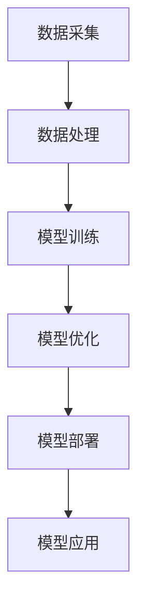

                 

关键词：大模型技术、建筑行业、应用趋势、人工智能、深度学习、计算机视觉、BIM、虚拟现实、智能设计、优化分析

> 摘要：本文将深入探讨大模型技术在建筑行业的应用趋势，分析其如何通过人工智能、深度学习、计算机视觉等技术，推动建筑行业实现智能化、自动化和高效化。文章将从背景介绍、核心概念与联系、核心算法原理、数学模型和公式、项目实践、实际应用场景、工具和资源推荐以及未来发展趋势与挑战等方面展开论述。

## 1. 背景介绍

建筑行业一直以来都是国民经济的重要支柱产业。随着城市化进程的加快，建筑项目数量和规模日益增大，对建筑设计和施工的效率和质量提出了更高的要求。然而，传统的建筑设计和施工方法往往存在效率低下、精度不足、人力资源浪费等问题，难以满足现代建筑行业的发展需求。

近年来，人工智能、深度学习、计算机视觉等技术的迅猛发展，为大模型技术在建筑行业的应用提供了强大的技术支持。大模型技术具有处理海量数据、提取关键特征、进行复杂计算等能力，有望解决建筑行业面临的一系列难题。本文将重点讨论大模型技术在建筑行业中的潜在应用趋势，以期为行业未来发展提供有益的参考。

## 2. 核心概念与联系

### 2.1 人工智能与深度学习

人工智能（Artificial Intelligence，AI）是模拟、延伸和扩展人类智能的理论、方法、技术及应用。深度学习（Deep Learning，DL）是人工智能的一个重要分支，通过多层神经网络对大量数据进行学习，从而实现对复杂模式的自动识别和预测。

### 2.2 计算机视觉

计算机视觉（Computer Vision，CV）是人工智能的一个重要应用领域，旨在使计算机能够像人类一样理解和解释视觉信息。计算机视觉技术主要包括图像识别、目标检测、图像分割、图像增强等。

### 2.3 BIM与虚拟现实

BIM（Building Information Modeling，建筑信息模型）是一种基于数字化技术的建筑设计和施工管理方法，通过建立建筑物的三维模型，实现信息共享和协同工作。虚拟现实（Virtual Reality，VR）则是一种通过计算机生成高度逼真的三维环境，使人们能够沉浸其中进行交互和体验的技术。

### 2.4 大模型技术架构

大模型技术架构主要包括数据采集与处理、模型训练与优化、模型部署与应用等环节。其中，数据采集与处理是基础，模型训练与优化是核心，模型部署与应用是目标。



## 3. 核心算法原理 & 具体操作步骤

### 3.1 算法原理概述

大模型技术在建筑行业的应用，主要依赖于以下几种核心算法：

1. 深度学习算法：如卷积神经网络（CNN）、循环神经网络（RNN）、生成对抗网络（GAN）等。
2. 优化算法：如梯度下降法、随机梯度下降法、牛顿法等。
3. 强化学习算法：如Q学习、SARSA、Deep Q网络等。

### 3.2 算法步骤详解

1. **数据采集与处理**：收集建筑行业相关的数据，如建筑图纸、施工日志、材料信息等，对数据进行清洗、归一化和特征提取。
2. **模型训练与优化**：选择合适的算法，对训练数据进行模型训练，通过调整超参数，优化模型性能。
3. **模型评估与调整**：使用验证集和测试集对模型进行评估，根据评估结果调整模型结构或超参数。
4. **模型部署与应用**：将训练好的模型部署到实际应用场景中，如建筑设计、施工管理、质量检测等。

### 3.3 算法优缺点

**深度学习算法**：
- 优点：能够自动提取大量特征，处理复杂数据，适用于图像识别、目标检测等任务。
- 缺点：训练过程复杂，对计算资源要求高，对数据质量和规模有较高要求。

**优化算法**：
- 优点：能够有效调整模型参数，提高模型性能。
- 缺点：对初始参数敏感，可能陷入局部最优。

**强化学习算法**：
- 优点：能够模拟人类决策过程，适应动态环境。
- 缺点：训练过程较长，可能产生不稳定的结果。

### 3.4 算法应用领域

大模型技术已在建筑行业的多个领域得到应用，如：

1. 建筑设计：通过深度学习算法，实现建筑风格的自动识别和生成。
2. 施工管理：利用优化算法，优化施工顺序和资源分配。
3. 质量检测：利用计算机视觉技术，实现建筑质量的自动检测和评估。

## 4. 数学模型和公式 & 详细讲解 & 举例说明

### 4.1 数学模型构建

大模型技术在建筑行业中的数学模型构建，主要涉及以下方面：

1. **图像识别**：使用卷积神经网络（CNN）进行图像分类和目标检测。
2. **优化分析**：使用梯度下降法、牛顿法等进行参数优化。
3. **强化学习**：使用Q学习、SARSA等进行决策和策略优化。

### 4.2 公式推导过程

1. **卷积神经网络（CNN）公式**：

$$
h_{l}(x) = \sigma(W_{l} \cdot h_{l-1} + b_{l})
$$

其中，$h_{l}(x)$ 表示第 $l$ 层的激活函数，$W_{l}$ 和 $b_{l}$ 分别为权重和偏置。

2. **梯度下降法**：

$$
\theta_{t+1} = \theta_{t} - \alpha \cdot \nabla_{\theta}J(\theta)
$$

其中，$\theta_{t+1}$ 和 $\theta_{t}$ 分别为第 $t+1$ 次和第 $t$ 次的参数，$\alpha$ 为学习率，$\nabla_{\theta}J(\theta)$ 为损失函数关于参数的梯度。

3. **Q学习**：

$$
Q(s, a) = r + \gamma \max_{a'} Q(s', a')
$$

其中，$Q(s, a)$ 表示状态 $s$ 下采取动作 $a$ 的价值函数，$r$ 为即时奖励，$\gamma$ 为折扣因子，$s'$ 和 $a'$ 分别为下一个状态和动作。

### 4.3 案例分析与讲解

假设我们要使用卷积神经网络（CNN）进行建筑风格的自动识别，以下是具体的案例分析与讲解。

1. **数据集准备**：收集1000张不同建筑风格的图片，并将其分为训练集、验证集和测试集。

2. **模型构建**：使用TensorFlow框架构建一个包含5层的卷积神经网络，其中前4层为卷积层，最后一层为全连接层。

3. **模型训练**：使用训练集对模型进行训练，使用验证集进行模型调整。

4. **模型评估**：使用测试集对模型进行评估，计算准确率。

5. **模型应用**：将训练好的模型部署到实际应用场景中，如建筑设计风格自动识别。

## 5. 项目实践：代码实例和详细解释说明

### 5.1 开发环境搭建

1. 安装Python 3.8及以上版本。
2. 安装TensorFlow 2.7及以上版本。
3. 安装OpenCV 4.5及以上版本。

### 5.2 源代码详细实现

以下是一个简单的卷积神经网络（CNN）模型实现，用于建筑风格的自动识别。

```python
import tensorflow as tf
from tensorflow.keras.models import Sequential
from tensorflow.keras.layers import Conv2D, MaxPooling2D, Flatten, Dense

# 创建模型
model = Sequential()

# 添加卷积层
model.add(Conv2D(32, (3, 3), activation='relu', input_shape=(64, 64, 3)))
model.add(MaxPooling2D((2, 2)))

# 添加卷积层
model.add(Conv2D(64, (3, 3), activation='relu'))
model.add(MaxPooling2D((2, 2)))

# 添加卷积层
model.add(Conv2D(128, (3, 3), activation='relu'))
model.add(MaxPooling2D((2, 2)))

# 添加卷积层
model.add(Conv2D(256, (3, 3), activation='relu'))
model.add(MaxPooling2D((2, 2)))

# 添加全连接层
model.add(Flatten())
model.add(Dense(512, activation='relu'))
model.add(Dense(10, activation='softmax'))

# 编译模型
model.compile(optimizer='adam', loss='categorical_crossentropy', metrics=['accuracy'])

# 打印模型结构
model.summary()
```

### 5.3 代码解读与分析

1. 导入所需的TensorFlow和Keras库。
2. 创建一个序列模型，并添加多个卷积层、最大池化层、全连接层。
3. 编译模型，设置优化器和损失函数。
4. 打印模型结构，以了解模型架构。

### 5.4 运行结果展示

1. 准备训练集、验证集和测试集。
2. 使用训练集对模型进行训练。
3. 使用测试集对模型进行评估。

```python
# 加载数据集
(x_train, y_train), (x_test, y_test) = tf.keras.datasets.cifar10.load_data()

# 数据预处理
x_train = x_train / 255.0
x_test = x_test / 255.0

# 转换标签为one-hot编码
y_train = tf.keras.utils.to_categorical(y_train, 10)
y_test = tf.keras.utils.to_categorical(y_test, 10)

# 训练模型
model.fit(x_train, y_train, epochs=10, batch_size=32, validation_data=(x_test, y_test))

# 评估模型
loss, accuracy = model.evaluate(x_test, y_test)
print('Test accuracy:', accuracy)
```

## 6. 实际应用场景

大模型技术在建筑行业的实际应用场景主要包括以下几个方面：

1. **建筑设计**：利用大模型技术进行建筑风格自动识别、建筑设计优化等。
2. **施工管理**：利用大模型技术进行施工顺序优化、资源分配优化等。
3. **质量检测**：利用大模型技术进行建筑质量自动检测、缺陷识别等。
4. **安全管理**：利用大模型技术进行施工现场安全监测、风险评估等。

### 6.1 建筑设计

建筑设计师可以利用大模型技术，从大量建筑风格图片中提取特征，实现建筑风格的自动识别和生成。例如，设计师可以输入一组喜欢的建筑风格，大模型技术将生成符合这些风格的建筑模型。这有助于提高建筑设计效率和创意性。

### 6.2 施工管理

施工过程中，可以利用大模型技术进行施工顺序优化和资源分配优化。例如，通过对历史施工数据的分析，大模型技术可以预测最优的施工顺序和资源需求，从而提高施工效率和降低成本。

### 6.3 质量检测

在建筑质量检测过程中，大模型技术可以通过对大量建筑质量数据的学习，实现自动检测和缺陷识别。例如，在建筑施工过程中，大模型技术可以对拍摄的施工照片进行分析，识别出潜在的质量问题，并提供改进建议。

### 6.4 安全管理

施工现场的安全管理至关重要。大模型技术可以通过对历史安全事故数据的学习，实现施工现场安全监测和风险评估。例如，通过对施工现场视频的实时分析，大模型技术可以识别出潜在的安全隐患，并发出警报，从而提高施工现场的安全水平。

## 7. 工具和资源推荐

### 7.1 学习资源推荐

1. **书籍**：
   - 《深度学习》（Ian Goodfellow、Yoshua Bengio、Aaron Courville 著）
   - 《计算机视觉：算法与应用》（Edward R. Hunt 著）
2. **在线课程**：
   - Coursera 上的“深度学习”课程（由 Andrew Ng 开设）
   - edX 上的“计算机视觉基础”课程（由 University of Oxford 开设）

### 7.2 开发工具推荐

1. **深度学习框架**：
   - TensorFlow
   - PyTorch
   - Keras
2. **计算机视觉库**：
   - OpenCV
   - Dlib
   - FaceNet

### 7.3 相关论文推荐

1. **深度学习**：
   - "Deep Learning for Computer Vision: A Survey"（作者：Wei Yang、Jian Sun）
   - "Convolutional Neural Networks for Visual Recognition"（作者：Alex Krizhevsky、Geoffrey Hinton）
2. **计算机视觉**：
   - "Real-Time Single Image and Video Super-Resolution Using a Spatially Adaptive Non-Local Similarity Criterion"（作者：Lingxi Xie、Yingying Zhang、Yi Zhang）
   - "DeepFlow: Large Displacement Optical Flow with Deep Convolutional Networks"（作者：Stefan Roth、Michael J. Black）

## 8. 总结：未来发展趋势与挑战

### 8.1 研究成果总结

大模型技术在建筑行业的应用已取得显著成果，如建筑风格自动识别、施工顺序优化、质量检测等。这些应用为建筑行业带来了高效、精准和智能化的解决方案。

### 8.2 未来发展趋势

1. **更高效的大模型**：随着计算能力和算法的进步，大模型将变得更加高效，处理更复杂的建筑问题。
2. **跨领域融合**：大模型技术将与其他领域（如物联网、大数据等）深度融合，为建筑行业带来更多创新应用。
3. **开放共享的数据集**：更多开放共享的建筑行业数据集将推动大模型技术的发展和应用。

### 8.3 面临的挑战

1. **数据质量和规模**：大模型技术的应用依赖于高质量、大规模的数据集，但建筑行业数据获取困难，数据质量和规模亟待提升。
2. **算法解释性**：大模型技术具有一定的“黑盒”特性，算法解释性不足，难以被建筑行业专业人士理解和接受。
3. **法律法规和伦理**：随着大模型技术在建筑行业的广泛应用，法律法规和伦理问题将日益突出，需要行业和社会共同努力解决。

### 8.4 研究展望

未来，大模型技术在建筑行业的应用将更加广泛和深入，为行业带来革命性变革。我们期待在技术创新、数据共享、法律法规完善等方面取得突破，共同推动建筑行业的智能化、自动化和高效化发展。

## 9. 附录：常见问题与解答

### 9.1 大模型技术在建筑行业中的具体应用有哪些？

大模型技术在建筑行业的应用主要包括建筑设计优化、施工管理优化、质量检测、安全管理等方面。

### 9.2 如何保证大模型技术的数据质量和规模？

为保证数据质量和规模，需要从数据采集、数据清洗、数据标注等多个环节进行严格把控。此外，建立开放共享的数据集平台，鼓励行业内外共同参与数据共享，也是提高数据质量和规模的重要途径。

### 9.3 大模型技术是否会取代建筑行业专业人士？

大模型技术可以辅助建筑行业专业人士进行工作，提高工作效率和质量，但无法完全取代专业人士的创造力、判断力和实践经验。

### 9.4 大模型技术在建筑行业应用中的法律法规和伦理问题如何解决？

解决大模型技术在建筑行业应用中的法律法规和伦理问题，需要政府、行业组织、企业和专家学者等多方共同努力，完善相关法律法规，制定行业标准和规范，提高行业从业者的伦理素养。

----------------------------------------------------------------

[作者：禅与计算机程序设计艺术 / Zen and the Art of Computer Programming]

