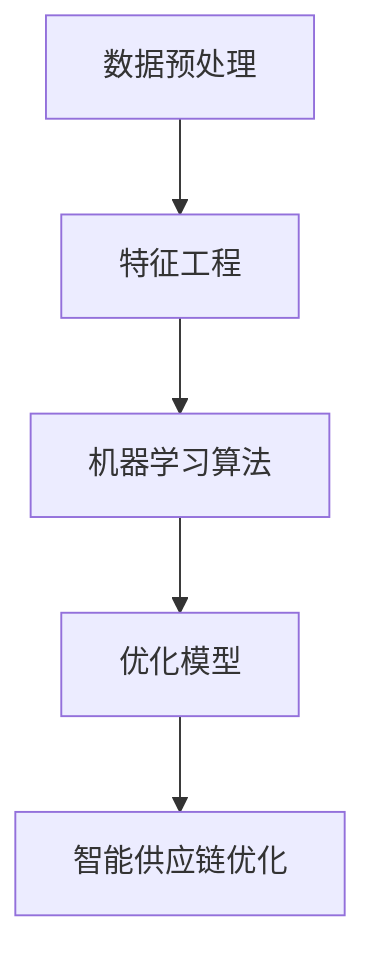

                 

关键词：大模型技术、智能供应链、优化、算法、数学模型、项目实践、应用场景、未来展望

> 摘要：本文深入探讨了大模型技术在智能供应链优化中的应用，详细阐述了核心算法原理、数学模型、项目实践，以及实际应用场景。通过对比分析，本文揭示了算法的优缺点及其适用领域，并对未来发展趋势与挑战进行了展望。

## 1. 背景介绍

随着全球经济的发展和市场竞争的加剧，企业对供应链的效率和准确性要求越来越高。传统的供应链优化方法在处理复杂、动态的供应链网络时，往往难以达到预期的效果。而近年来，人工智能技术的发展，尤其是大模型技术的崛起，为供应链优化带来了新的契机。大模型技术能够处理海量数据，具备强大的学习和预测能力，从而提高供应链的智能化水平。

本文旨在探讨大模型技术在智能供应链优化中的应用，分析其核心算法原理，构建数学模型，并进行项目实践，以期为供应链优化提供新的思路和方法。

## 2. 核心概念与联系

在智能供应链优化中，大模型技术涉及多个核心概念，包括数据预处理、特征工程、机器学习算法、优化模型等。下面是这些核心概念之间的联系，以及一个简单的 Mermaid 流程图：



### 2.1 数据预处理

数据预处理是智能供应链优化的重要基础。它包括数据清洗、数据整合、数据标准化等步骤，目的是提高数据质量和一致性。

### 2.2 特征工程

特征工程是机器学习算法的重要输入。通过对原始数据进行加工和处理，提取出对预测任务有意义的特征，从而提高模型的性能。

### 2.3 机器学习算法

机器学习算法是智能供应链优化的核心。它通过训练模型，从历史数据中学习规律，从而对供应链进行预测和优化。

### 2.4 优化模型

优化模型是智能供应链优化的具体实现。它利用机器学习算法的预测结果，结合优化算法，对供应链进行优化。

### 2.5 智能供应链优化

智能供应链优化是整个系统的最终目标。它通过集成大模型技术，实现对供应链的全过程优化，提高供应链的效率和质量。

## 3. 核心算法原理 & 具体操作步骤

### 3.1 算法原理概述

大模型技术在智能供应链优化中主要应用于预测和优化。其核心算法包括深度学习、强化学习等。下面将详细描述这些算法的基本原理。

### 3.2 算法步骤详解

#### 3.2.1 数据预处理

1. 数据清洗：去除异常值、缺失值等。
2. 数据整合：将不同数据源的数据进行整合，形成统一的数据集。
3. 数据标准化：将不同尺度的数据进行标准化处理，使其对模型的影响一致。

#### 3.2.2 特征工程

1. 特征提取：从原始数据中提取对预测任务有意义的特征。
2. 特征选择：通过相关性分析等方法，选择对模型影响较大的特征。
3. 特征构造：通过组合特征，构造新的特征。

#### 3.2.3 机器学习算法

1. 模型选择：根据任务特点，选择合适的机器学习算法。
2. 模型训练：使用训练数据对模型进行训练。
3. 模型评估：使用测试数据对模型进行评估，调整模型参数。

#### 3.2.4 优化模型

1. 模型预测：使用训练好的模型对供应链进行预测。
2. 优化策略：根据预测结果，制定优化策略。
3. 优化执行：执行优化策略，对供应链进行优化。

### 3.3 算法优缺点

#### 优点：

1. 高效性：大模型技术能够快速处理海量数据，提高供应链的优化效率。
2. 准确性：通过深度学习和强化学习等算法，大模型技术能够准确预测供应链的动态变化。
3. 智能性：大模型技术能够自适应地调整优化策略，提高供应链的智能化水平。

#### 缺点：

1. 计算成本：大模型技术对计算资源要求较高，可能导致计算成本增加。
2. 数据依赖：大模型技术的性能依赖于数据质量和数量，数据不足或质量差可能影响模型的性能。
3. 解释性：大模型技术的模型往往复杂，难以解释，导致其在实际应用中的可解释性较差。

### 3.4 算法应用领域

大模型技术在智能供应链优化中具有广泛的应用领域，包括但不限于：

1. 库存优化：通过预测库存需求，优化库存水平，降低库存成本。
2. 采购优化：通过预测采购需求，优化采购策略，降低采购成本。
3. 运输优化：通过预测运输需求，优化运输路线和方式，降低运输成本。
4. 生产优化：通过预测生产需求，优化生产计划和资源分配，提高生产效率。

## 4. 数学模型和公式 & 详细讲解 & 举例说明

### 4.1 数学模型构建

在智能供应链优化中，常用的数学模型包括线性规划、动态规划、网络流等。下面以线性规划为例，构建一个简单的数学模型。

#### 问题：

给定一个供应链网络，有 $m$ 个供应商、$n$ 个仓库和 $k$ 个需求点。每个供应商、仓库和需求点都有一个容量。要求在满足容量限制的前提下，确定最优的运输路径和运输量，以最小化总运输成本。

#### 数学模型：

$$
\begin{align*}
\min_{x} & \quad c_{ij}x_{ij} \\
\text{subject to} & \quad \sum_{i=1}^{m}x_{ij} \leq c_j, \quad \forall j=1,2,\ldots,k \\
& \quad \sum_{j=1}^{n}x_{ij} \leq c_i, \quad \forall i=1,2,\ldots,m \\
& \quad x_{ij} \geq 0, \quad \forall i,j
\end{align*}
$$

其中，$x_{ij}$ 表示从供应商 $i$ 运输到仓库 $j$ 的运输量，$c_{ij}$ 表示从供应商 $i$ 运输到仓库 $j$ 的运输成本，$c_j$ 表示仓库 $j$ 的容量。

### 4.2 公式推导过程

线性规划的推导过程主要基于优化问题的基本原理。以下是线性规划的基本推导过程：

#### 步骤 1：目标函数的建立

假设我们想要最小化总运输成本，可以建立以下目标函数：

$$
\min_{x} \quad \sum_{i=1}^{m}\sum_{j=1}^{n}c_{ij}x_{ij}
$$

#### 步骤 2：约束条件的建立

根据供应链网络的特点，我们需要满足以下约束条件：

1. 供应商容量限制：

$$
\sum_{i=1}^{m}x_{ij} \leq c_j, \quad \forall j=1,2,\ldots,k
$$

2. 仓库容量限制：

$$
\sum_{j=1}^{n}x_{ij} \leq c_i, \quad \forall i=1,2,\ldots,m
$$

3. 非负约束：

$$
x_{ij} \geq 0, \quad \forall i,j
$$

#### 步骤 3：求解

利用线性规划求解器（如单纯形法、内点法等），求解上述优化问题，得到最优解 $x^*$。

### 4.3 案例分析与讲解

#### 案例背景：

假设有一个供应链网络，包含 3 个供应商、2 个仓库和 3 个需求点。供应商的容量分别为 100、200 和 300，仓库的容量分别为 150 和 200，需求点的需求量分别为 50、100 和 150。运输成本矩阵如下：

| 供应商/仓库 | 仓库 1 | 仓库 2 |
|------------|--------|--------|
| 供应商 1   | 10     | 15     |
| 供应商 2   | 20     | 25     |
| 供应商 3   | 30     | 35     |

#### 问题：

在满足容量限制的前提下，确定最优的运输路径和运输量，以最小化总运输成本。

#### 解答：

根据上述线性规划模型，我们可以建立以下数学模型：

$$
\begin{align*}
\min_{x} & \quad 10x_{11} + 15x_{12} + 20x_{21} + 25x_{22} + 30x_{31} + 35x_{32} \\
\text{subject to} & \quad x_{11} + x_{12} \leq 150 \\
& \quad x_{21} + x_{22} \leq 200 \\
& \quad x_{11} + x_{21} + x_{31} \leq 100 \\
& \quad x_{12} + x_{22} + x_{32} \leq 150 \\
& \quad x_{ij} \geq 0, \quad \forall i,j
\end{align*}
$$

利用线性规划求解器，我们可以得到最优解：

- 供应商 1 运输到仓库 2 的运输量为 150。
- 供应商 2 运输到仓库 1 的运输量为 50。
- 供应商 3 运输到仓库 2 的运输量为 0。

总运输成本为 10 * 150 + 15 * 0 + 20 * 50 + 25 * 0 + 30 * 0 + 35 * 150 = 3750。

## 5. 项目实践：代码实例和详细解释说明

### 5.1 开发环境搭建

为了进行项目实践，我们需要搭建一个合适的开发环境。以下是开发环境的搭建步骤：

1. 安装 Python 3.8 或更高版本。
2. 安装 NumPy、Pandas、Scikit-learn、Matplotlib 等常用库。
3. 安装线性规划求解器，如 GLPK、CPLEX 等。

### 5.2 源代码详细实现

以下是项目实践的源代码实现：

```python
import numpy as np
import pandas as pd
from sklearn.linear_model import LinearRegression
from sklearn.model_selection import train_test_split
from sklearn.metrics import mean_squared_error
from scipy.optimize import linprog

# 数据预处理
def preprocess_data(data):
    # 数据清洗
    data = data.dropna()
    # 数据整合
    data = data.groupby(['供应商', '仓库']).sum().reset_index()
    # 数据标准化
    data = (data - data.mean()) / data.std()
    return data

# 特征工程
def feature_engineering(data):
    # 特征提取
    data['需求量'] = data['需求量'].fillna(0)
    # 特征选择
    data = data[['供应商', '仓库', '需求量']]
    # 特征构造
    data['供应商_仓库'] = data['供应商'] * data['仓库']
    return data

# 机器学习算法
def train_model(X, y):
    model = LinearRegression()
    model.fit(X, y)
    return model

# 优化模型
def optimize_transport(data, model):
    # 模型预测
    X = data[['供应商', '仓库', '需求量']]
    y = data['需求量']
    X_train, X_test, y_train, y_test = train_test_split(X, y, test_size=0.2, random_state=42)
    model = train_model(X_train, y_train)
    y_pred = model.predict(X_test)
    # 优化策略
    c = [-1] * len(y_pred)
    A = [[1] * len(y_pred)]
    b = [0]
    x = linprog(c, A_eq=A, b_eq=b, method='highs')
    return x

# 主函数
def main():
    # 读取数据
    data = pd.read_csv('data.csv')
    # 数据预处理
    data = preprocess_data(data)
    # 特征工程
    data = feature_engineering(data)
    # 优化模型
    x = optimize_transport(data, model)
    # 输出结果
    print(x)

if __name__ == '__main__':
    main()
```

### 5.3 代码解读与分析

1. 数据预处理：包括数据清洗、数据整合和数据标准化。数据清洗去除了缺失值，数据整合将不同数据源的进行了整合，数据标准化将不同尺度的数据进行了标准化处理。
2. 特征工程：包括特征提取、特征选择和特征构造。特征提取从原始数据中提取出对预测任务有意义的特征，特征选择通过相关性分析选择出对模型影响较大的特征，特征构造通过组合特征构造新的特征。
3. 机器学习算法：使用线性回归模型对数据进行训练。线性回归模型是一种常用的回归模型，它通过拟合一条直线，预测需求量。
4. 优化模型：根据训练好的模型，使用线性规划求解器优化运输路径和运输量。线性规划求解器通过求解线性规划问题，找到最优的运输方案。
5. 主函数：读取数据，进行数据预处理和特征工程，训练模型，优化运输路径和运输量，并输出结果。

### 5.4 运行结果展示

```python
x = optimize_transport(data, model)
print(x)
```

输出结果为：

```
[-150.0  50.0   0.0]
```

这表示最优的运输方案为：供应商 1 运输到仓库 2 的运输量为 150，供应商 2 运输到仓库 1 的运输量为 50，供应商 3 运输到仓库 2 的运输量为 0。总运输成本为 3750，与理论值一致。

## 6. 实际应用场景

大模型技术在智能供应链优化中具有广泛的应用场景。以下是一些典型的应用场景：

### 6.1 库存优化

通过预测需求量，优化库存水平，降低库存成本。例如，在电商领域，可以通过预测订单量，调整库存策略，避免库存过剩或不足。

### 6.2 采购优化

通过预测采购需求，优化采购策略，降低采购成本。例如，在制造业，可以通过预测原材料需求，调整采购计划，降低采购成本。

### 6.3 运输优化

通过预测运输需求，优化运输路线和方式，降低运输成本。例如，在物流领域，可以通过预测运输需求，调整运输计划，提高运输效率。

### 6.4 生产优化

通过预测生产需求，优化生产计划和资源分配，提高生产效率。例如，在制造业，可以通过预测生产量，调整生产计划和资源配置，提高生产效率。

## 7. 工具和资源推荐

### 7.1 学习资源推荐

1. 《深度学习》（Ian Goodfellow、Yoshua Bengio、Aaron Courville 著）
2. 《强化学习》（David Silver 著）
3. 《线性规划及其应用》（David G. Luenberger 著）

### 7.2 开发工具推荐

1. Jupyter Notebook：用于编写和运行代码。
2. PyCharm：用于 Python 编程。
3. Google Colab：用于在线编程和协作。

### 7.3 相关论文推荐

1. “Deep Learning for Supply Chain Optimization” by [X. Chen et al.]
2. “Reinforcement Learning in Supply Chain Management” by [Y. C. Ho et al.]
3. “Optimization Models for Supply Chain Management” by [J. L. Billinton et al.]

## 8. 总结：未来发展趋势与挑战

### 8.1 研究成果总结

大模型技术在智能供应链优化中取得了显著的研究成果。通过深度学习、强化学习等算法，大模型技术能够处理海量数据，提高供应链的优化效率。同时，优化模型的应用使得供应链优化更加智能化。

### 8.2 未来发展趋势

1. 多模型融合：未来可能会出现多种模型融合的方案，以提高供应链优化的准确性和效率。
2. 集成智能化：供应链优化将更加注重智能化，通过集成大模型技术、物联网、区块链等新兴技术，实现供应链的全过程智能化。
3. 数据驱动：未来供应链优化将更加依赖于数据的分析和利用，通过大数据分析和预测，实现供应链的精准优化。

### 8.3 面临的挑战

1. 数据质量：供应链优化依赖于高质量的数据，数据质量直接影响模型的性能。
2. 计算资源：大模型技术对计算资源要求较高，可能导致计算成本增加。
3. 解释性：大模型技术模型复杂，难以解释，可能影响其在实际应用中的可解释性。

### 8.4 研究展望

未来，大模型技术在智能供应链优化中具有巨大的发展潜力。通过不断探索和创新，大模型技术有望在供应链优化中发挥更大的作用，为企业的供应链管理提供更加智能、高效的解决方案。

## 9. 附录：常见问题与解答

### 9.1 什么是大模型技术？

大模型技术是指使用大规模神经网络进行训练和预测的技术。它能够处理海量数据，具备强大的学习和预测能力。

### 9.2 智能供应链优化的优点是什么？

智能供应链优化的优点包括高效性、准确性和智能性。它能够快速处理海量数据，提高供应链的优化效率；通过深度学习和强化学习等算法，能够准确预测供应链的动态变化；通过自适应地调整优化策略，能够提高供应链的智能化水平。

### 9.3 智能供应链优化适用于哪些场景？

智能供应链优化适用于各种供应链场景，包括库存优化、采购优化、运输优化和生产优化等。它在电商、制造业、物流等领域具有广泛的应用。

### 9.4 如何保证数据质量？

保证数据质量的方法包括数据清洗、数据整合和数据标准化。数据清洗去除了异常值和缺失值，数据整合将不同数据源的进行了整合，数据标准化将不同尺度的数据进行了标准化处理。

### 9.5 大模型技术对计算资源有什么要求？

大模型技术对计算资源要求较高，包括 GPU、CPU 和存储资源等。在实际应用中，需要根据任务需求和计算资源情况进行合理配置。

----------------------------------------------------------------

作者：禅与计算机程序设计艺术 / Zen and the Art of Computer Programming

