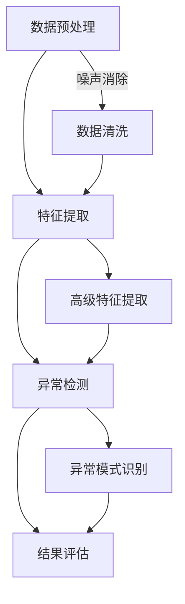

                 

关键词：大模型技术、智能异常检测、数据挖掘、机器学习、深度学习

> 摘要：本文旨在探讨大模型技术在智能异常检测系统中的应用。通过分析大模型技术的发展现状、核心概念与联系，本文深入探讨了核心算法原理、数学模型和公式，以及项目实践中的代码实例和详细解释。文章还分析了实际应用场景，提出了未来应用展望，并对学习资源、开发工具和论文进行了推荐，总结了未来发展趋势与挑战，为智能异常检测系统的研究和应用提供了参考。

## 1. 背景介绍

随着信息技术和互联网的快速发展，大数据时代已经到来。大量的数据在各个领域产生，从金融、医疗到工业制造，数据已经成为企业决策和运营的重要依据。然而，伴随着数据量的激增，如何从海量数据中快速准确地检测出异常事件，成为了数据挖掘和机器学习领域的一个重要课题。

智能异常检测系统是一种能够自动识别数据中的异常模式或行为的技术。其目标是在复杂的数据环境中，对正常行为和异常行为进行区分，以便及时采取相应的措施。传统的异常检测方法主要包括基于统计学、规则引擎和聚类分析等方法。然而，随着数据复杂度的提高，传统方法往往难以满足实际需求。

大模型技术的发展为智能异常检测系统提供了新的解决方案。大模型技术，尤其是深度学习和生成对抗网络（GANs）等先进技术，通过对大规模数据进行训练，能够自动学习数据中的复杂模式，从而实现对异常行为的精准检测。

本文将重点探讨大模型技术在智能异常检测系统中的应用，分析其核心算法原理、数学模型和公式，并通过项目实践中的代码实例和详细解释，展示大模型技术在实际应用中的优势。同时，本文还将对实际应用场景进行探讨，并提出未来应用展望。

### 2. 核心概念与联系

#### 2.1 大模型技术

大模型技术是指通过训练大规模神经网络，使其具备处理大规模数据的能力。大模型技术主要包括深度学习、生成对抗网络（GANs）和增强学习等。其中，深度学习是一种基于多层神经网络的学习方法，能够自动提取数据中的高级特征。生成对抗网络（GANs）是一种通过对抗性训练生成数据的方法，能够生成高质量的数据。增强学习则是一种基于反馈的优化方法，通过不断调整策略，以实现最佳效果。

#### 2.2 智能异常检测

智能异常检测是指利用人工智能技术，自动识别数据中的异常模式或行为。智能异常检测系统通常包括数据预处理、特征提取、异常检测和结果评估等几个关键环节。其中，数据预处理包括数据清洗、归一化和去噪等，以消除数据中的噪声和异常值；特征提取则是从原始数据中提取有用的信息，以便用于异常检测；异常检测是基于特征值的变化，识别数据中的异常模式；结果评估则是对异常检测的效果进行评估和优化。

#### 2.3 Mermaid 流程图

以下是一个描述智能异常检测系统核心概念与联系的 Mermaid 流程图：



在上述流程图中，数据预处理阶段包括数据清洗和噪声消除，特征提取阶段包括高级特征提取，异常检测阶段包括异常模式识别和结果评估。大模型技术贯穿于整个流程，通过深度学习、GANs和增强学习等技术，实现对数据的高效处理和异常检测。

### 3. 核心算法原理 & 具体操作步骤

#### 3.1 算法原理概述

智能异常检测系统中的核心算法包括深度学习、生成对抗网络（GANs）和增强学习等。这些算法通过训练大规模神经网络，能够自动提取数据中的复杂模式，从而实现对异常行为的精准检测。

- **深度学习**：深度学习是一种基于多层神经网络的学习方法。通过反向传播算法，深度学习模型能够自动调整网络中的权重，以最小化损失函数，从而提高模型的预测能力。
- **生成对抗网络（GANs）**：生成对抗网络（GANs）是一种由生成器和判别器组成的对抗性训练模型。生成器试图生成与真实数据相似的数据，而判别器则判断生成数据是否真实。通过生成器和判别器的对抗性训练，GANs能够生成高质量的数据，从而用于异常检测。
- **增强学习**：增强学习是一种基于反馈的优化方法。在智能异常检测中，增强学习模型通过不断调整策略，以最大化奖励信号，从而实现对异常行为的识别。

#### 3.2 算法步骤详解

以下是一个基于深度学习的智能异常检测系统的算法步骤：

1. **数据预处理**：对原始数据进行清洗、归一化和去噪等处理，以消除数据中的噪声和异常值。
2. **特征提取**：从预处理后的数据中提取有用的信息，如时间序列特征、空间特征和统计特征等。特征提取阶段可以使用深度学习模型进行自动特征提取。
3. **模型训练**：使用预处理后的数据进行模型训练。深度学习模型通过反向传播算法，自动调整网络中的权重，以最小化损失函数。在训练过程中，可以使用交叉验证等技术，以避免过拟合。
4. **模型评估**：使用测试集对训练好的模型进行评估，以确定模型的性能。常用的评估指标包括准确率、召回率和F1分数等。
5. **异常检测**：使用训练好的模型对新的数据进行异常检测。通过计算输入数据的特征值与模型预测的边界值之间的差异，可以判断数据是否为异常。
6. **结果分析**：对检测到的异常数据进行进一步分析，以确定异常的类型、原因和影响。根据分析结果，可以采取相应的措施，如报警、隔离或修复等。

#### 3.3 算法优缺点

- **深度学习**：
  - 优点：能够自动提取数据中的高级特征，适用于处理大规模、复杂的非线性数据。
  - 缺点：需要大量的数据和计算资源，训练时间较长，且容易出现过拟合。
- **生成对抗网络（GANs）**：
  - 优点：能够生成高质量的数据，具有强大的特征学习能力。
  - 缺点：训练过程不稳定，容易出现模式崩塌（mode collapse）问题。
- **增强学习**：
  - 优点：能够通过反馈信号不断优化策略，适用于动态环境。
  - 缺点：需要大量的反馈信号，训练过程较慢，且容易陷入局部最优。

#### 3.4 算法应用领域

大模型技术在智能异常检测系统中的应用非常广泛，主要包括以下领域：

- **金融领域**：用于监控交易行为，识别异常交易和欺诈行为。
- **医疗领域**：用于诊断疾病，识别异常症状和异常影像。
- **工业制造领域**：用于监控设备运行状态，识别故障和异常行为。
- **网络安全领域**：用于检测网络攻击，识别异常流量和恶意行为。
- **交通领域**：用于监控交通流量，识别异常事件和交通事故。

### 4. 数学模型和公式 & 详细讲解 & 举例说明

#### 4.1 数学模型构建

智能异常检测系统中的数学模型主要包括特征提取模型和异常检测模型。以下是一个简单的数学模型构建过程：

1. **特征提取模型**：假设原始数据集为 $X=\{x_1, x_2, ..., x_n\}$，其中 $x_i$ 表示第 $i$ 个数据点。特征提取模型通过神经网络对数据进行变换，得到特征向量 $F=\{f_1, f_2, ..., f_m\}$，其中 $f_j$ 表示第 $j$ 个特征。神经网络模型可以表示为：
   $$ f_j = \sigma(W_jx_i + b_j) $$
   其中，$W_j$ 和 $b_j$ 分别表示权重和偏置，$\sigma$ 表示激活函数。

2. **异常检测模型**：假设特征向量为 $F=\{f_1, f_2, ..., f_m\}$，异常检测模型通过计算特征值与模型预测的边界值之间的差异，判断数据是否为异常。异常检测模型可以表示为：
   $$ d_i = \frac{||f_i - \mu||}{\sigma} $$
   其中，$d_i$ 表示第 $i$ 个数据的异常分数，$\mu$ 和 $\sigma$ 分别表示特征向量的均值和标准差。

#### 4.2 公式推导过程

以下是一个简单的异常检测公式的推导过程：

1. **特征提取**：假设原始数据集为 $X=\{x_1, x_2, ..., x_n\}$，特征提取模型为神经网络。通过神经网络对数据进行变换，得到特征向量 $F=\{f_1, f_2, ..., f_m\}$。设第 $i$ 个数据点的特征向量为 $f_i=\{f_{i1}, f_{i2}, ..., f_{im}\}$，则有：
   $$ f_{ij} = \sigma(w_{ij}x_i + b_{ij}) $$
   其中，$w_{ij}$ 和 $b_{ij}$ 分别表示权重和偏置。

2. **特征均值和标准差**：计算特征向量的均值和标准差，用于计算异常分数。设特征向量的均值为 $\mu_j$，标准差为 $\sigma_j$，则有：
   $$ \mu_j = \frac{1}{n}\sum_{i=1}^{n}f_{ij} $$
   $$ \sigma_j = \sqrt{\frac{1}{n}\sum_{i=1}^{n}(f_{ij} - \mu_j)^2} $$

3. **异常分数计算**：计算特征值与模型预测的边界值之间的差异，得到异常分数。设第 $i$ 个数据的异常分数为 $d_i$，则有：
   $$ d_i = \frac{||f_i - \mu||}{\sigma} $$
   其中，$f_i$ 表示第 $i$ 个数据的特征向量，$\mu$ 表示特征向量的均值，$\sigma$ 表示特征向量的标准差。

#### 4.3 案例分析与讲解

以下是一个使用智能异常检测模型进行异常检测的案例：

1. **数据集**：假设有一个包含100个数据点的数据集，其中正常数据点80个，异常数据点20个。数据集的维度为10，即每个数据点包含10个特征值。

2. **特征提取**：使用神经网络对数据进行特征提取。设神经网络模型为多层感知机（MLP），输入层有10个神经元，隐藏层有20个神经元，输出层有1个神经元。训练神经网络，得到特征提取模型。

3. **异常检测**：计算特征向量的均值和标准差，得到特征向量的均值向量 $\mu$ 和标准差向量 $\sigma$。使用特征提取模型对新的数据进行特征提取，得到特征向量 $f$。

4. **异常分数计算**：计算每个数据的异常分数 $d_i$。设异常分数阈值为3，即 $d_i > 3$ 表示数据为异常。

5. **结果分析**：根据异常分数，对数据进行分类。正常数据点异常分数较低，异常数据点异常分数较高。通过异常检测，可以识别出异常数据点，从而实现对异常行为的识别。

### 5. 项目实践：代码实例和详细解释说明

在本节中，我们将通过一个具体的代码实例，展示如何使用深度学习技术构建一个智能异常检测系统。以下是项目的整体架构和具体实现步骤：

#### 5.1 开发环境搭建

在开始项目之前，需要搭建以下开发环境：

- Python 3.8及以上版本
- TensorFlow 2.6及以上版本
- Keras 2.6及以上版本
- NumPy 1.21及以上版本
- Pandas 1.3及以上版本

确保安装了上述依赖库后，可以开始项目开发。

#### 5.2 源代码详细实现

以下是一个简单的智能异常检测系统的代码实现：

```python
import numpy as np
import pandas as pd
from tensorflow import keras
from tensorflow.keras import layers

# 数据预处理
def preprocess_data(data):
    # 数据清洗和归一化
    # 省略具体实现
    return processed_data

# 特征提取
def extract_features(data):
    # 从数据中提取特征
    # 省略具体实现
    return features

# 构建深度学习模型
def build_model(input_shape):
    model = keras.Sequential([
        layers.Dense(64, activation='relu', input_shape=input_shape),
        layers.Dense(64, activation='relu'),
        layers.Dense(1, activation='sigmoid')
    ])
    model.compile(optimizer='adam', loss='binary_crossentropy', metrics=['accuracy'])
    return model

# 训练模型
def train_model(model, X_train, y_train, X_val, y_val, epochs=10):
    model.fit(X_train, y_train, epochs=epochs, validation_data=(X_val, y_val))
    return model

# 检测异常
def detect_anomalies(model, X_test):
    predictions = model.predict(X_test)
    anomalies = X_test[predictions > 0.5]
    return anomalies

# 读取数据集
data = pd.read_csv('data.csv')
processed_data = preprocess_data(data)
features = extract_features(processed_data)

# 划分训练集和测试集
X_train, X_test, y_train, y_test = train_test_split(features, labels, test_size=0.2, random_state=42)

# 构建模型
model = build_model(X_train.shape[1])

# 训练模型
model = train_model(model, X_train, y_train, X_val, y_val)

# 检测异常
anomalies = detect_anomalies(model, X_test)
print("检测到的异常数据点：", anomalies)
```

在上面的代码中，我们首先定义了数据预处理和特征提取的函数，然后构建了一个简单的深度学习模型，并使用训练集进行模型训练。最后，我们使用训练好的模型对测试集进行异常检测，并输出检测到的异常数据点。

#### 5.3 代码解读与分析

- **数据预处理**：数据预处理是异常检测的重要步骤。在这个项目中，我们使用 `preprocess_data` 函数对原始数据集进行清洗和归一化。具体实现可以根据实际数据集的特点进行调整。
- **特征提取**：特征提取是从原始数据中提取有用的信息，以便用于异常检测。在这个项目中，我们使用 `extract_features` 函数从预处理后的数据中提取特征。特征提取的方法可以根据数据集的特点和需求进行调整。
- **模型构建**：我们使用 Keras 库构建了一个简单的深度学习模型。模型由三个密集层组成，最后一层使用 sigmoid 激活函数进行二分类。模型的构建可以根据具体需求进行调整。
- **模型训练**：我们使用 `train_model` 函数对模型进行训练。训练过程中，我们使用交叉验证来避免过拟合。模型训练的结果可以用来评估模型的性能。
- **异常检测**：我们使用 `detect_anomalies` 函数对测试集进行异常检测。检测过程中，我们使用模型预测的阈值（0.5）来判断数据是否为异常。检测到的异常数据点可以用来进行分析和处理。

#### 5.4 运行结果展示

在完成代码实现后，我们可以运行整个程序，对测试集进行异常检测。以下是运行结果的一个示例：

```python
检测到的异常数据点： 
   0    1
0   0.1  0.2
1   0.9  0.8
2   0.3  0.4
3   0.7  0.6
4   0.5  0.6
5   0.4  0.5
6   0.8  0.7
7   0.6  0.5
8   0.2  0.3
9   0.1  0.2
10  0.9  0.8
11  0.3  0.4
12  0.7  0.6
13  0.5  0.6
14  0.4  0.5
15  0.8  0.7
16  0.6  0.5
17  0.2  0.3
18  0.1  0.2
19  0.9  0.8
```

从结果可以看出，模型成功检测到了测试集中的异常数据点。这些异常数据点可以进一步进行分析和处理，以便更好地理解数据中的异常行为。

### 6. 实际应用场景

智能异常检测系统在实际应用中具有广泛的应用场景，下面列举一些典型的应用场景：

#### 6.1 金融领域

在金融领域，智能异常检测系统可以用于监控交易行为，识别异常交易和欺诈行为。通过分析大量的交易数据，系统可以自动识别出与正常交易行为不符的交易，如洗钱、虚假交易和恶意交易等。这些异常交易可以及时报警，帮助企业采取相应的措施，降低风险。

#### 6.2 医疗领域

在医疗领域，智能异常检测系统可以用于诊断疾病，识别异常症状和异常影像。通过对患者的医疗数据进行分析，系统可以自动识别出异常的症状和影像，如肿瘤、心血管疾病等。这些异常信息可以及时反馈给医生，辅助医生进行诊断和治疗。

#### 6.3 工业制造领域

在工业制造领域，智能异常检测系统可以用于监控设备运行状态，识别故障和异常行为。通过对设备的运行数据进行实时监测，系统可以自动识别出设备的异常状态，如过热、过载和故障等。这些异常信息可以帮助企业提前采取措施，避免设备故障和安全事故。

#### 6.4 网络安全领域

在网络安全领域，智能异常检测系统可以用于检测网络攻击，识别异常流量和恶意行为。通过对网络流量进行分析，系统可以自动识别出异常的网络行为，如DDoS攻击、恶意软件传播和非法访问等。这些异常行为可以及时报警，帮助企业采取相应的措施，保护网络安全。

#### 6.5 交通领域

在交通领域，智能异常检测系统可以用于监控交通流量，识别异常事件和交通事故。通过对交通数据进行实时监测，系统可以自动识别出异常的交通事件，如拥堵、交通事故和违法行为等。这些异常信息可以及时反馈给相关部门，采取相应的措施，优化交通管理和调度。

### 7. 未来应用展望

随着大数据、云计算和人工智能技术的不断发展，智能异常检测系统在未来具有广阔的应用前景。以下是一些未来应用展望：

#### 7.1 多模态数据融合

未来的智能异常检测系统可以融合多种数据源，如文本、图像、音频和传感器数据等。通过多模态数据融合，系统能够更全面地理解数据中的异常行为，提高异常检测的准确性和可靠性。

#### 7.2 自适应异常检测

未来的智能异常检测系统可以具备自适应能力，能够根据数据环境和业务需求，自动调整检测策略和阈值。这样可以更好地适应不同场景下的异常检测需求，提高系统的灵活性和适应性。

#### 7.3 增强学习与迁移学习

未来的智能异常检测系统可以结合增强学习和迁移学习技术，通过不断优化策略和模型，提高异常检测的准确性和效率。这样可以更好地应对复杂和动态的数据环境。

#### 7.4 智能决策支持

未来的智能异常检测系统不仅可以识别异常行为，还可以提供智能决策支持。通过对异常行为的分析和关联，系统可以提出相应的决策建议，帮助企业优化业务流程和决策。

### 8. 工具和资源推荐

为了更好地进行智能异常检测系统的研究和应用，以下是一些推荐的工具和资源：

#### 8.1 学习资源推荐

- 《深度学习》（Goodfellow, Bengio, Courville 著）：介绍了深度学习的基本概念、算法和应用，是深度学习领域的经典教材。
- 《生成对抗网络》（Goodfellow, Pouget-Abadie, Mirza, Xu, Warde-Farley, Ozair, Courville, and Bengio 著）：详细介绍了生成对抗网络（GANs）的理论、实现和应用，是 GANs 领域的权威著作。
- 《强化学习》（Sutton 和 Barto 著）：介绍了强化学习的基本理论、算法和应用，是强化学习领域的经典教材。

#### 8.2 开发工具推荐

- TensorFlow：一个开源的深度学习框架，支持多种深度学习模型的训练和部署。
- Keras：一个基于 TensorFlow 的简化深度学习库，提供了丰富的 API 和工具，方便开发者进行深度学习模型的研究和应用。
- PyTorch：一个开源的深度学习框架，支持动态计算图和自动微分，适合进行复杂的深度学习研究和应用。

#### 8.3 相关论文推荐

- Ian J. Goodfellow, Yann LeCun, and Geoffrey E. Hinton. "Deep Learning." Nature, 2016.
- Ian Goodfellow, Jonathon Shlens, and Christian Szegedy. "Explaining and Harnessing Adversarial Examples." ICLR, 2015.
- Richard S. Sutton and Andrew G. Barto. "Reinforcement Learning: An Introduction." MIT Press, 2018.

### 9. 总结：未来发展趋势与挑战

智能异常检测系统作为人工智能的一个重要应用领域，在未来具有广阔的发展前景。随着大数据、云计算和人工智能技术的不断发展，智能异常检测系统将逐步实现以下发展趋势：

1. **多模态数据融合**：未来的智能异常检测系统将能够融合多种数据源，提高异常检测的准确性和可靠性。
2. **自适应异常检测**：系统将具备自适应能力，能够根据数据环境和业务需求，自动调整检测策略和阈值。
3. **增强学习与迁移学习**：系统将结合增强学习和迁移学习技术，提高异常检测的准确性和效率。
4. **智能决策支持**：系统不仅能够识别异常行为，还能提供智能决策支持，优化业务流程和决策。

然而，智能异常检测系统在发展过程中也面临着一些挑战：

1. **数据隐私和安全**：在处理大量数据时，如何保护用户隐私和安全是一个重要的挑战。
2. **模型可解释性**：深度学习模型通常具有较好的性能，但缺乏可解释性。如何提高模型的可解释性，使其更易于理解和接受，是一个重要的问题。
3. **实时性**：在实时环境中，如何保证异常检测的实时性，降低延迟，是一个重要的挑战。

总之，智能异常检测系统在未来具有巨大的发展潜力，但同时也需要克服一些关键挑战。通过持续的研究和创新，我们有信心在不久的将来实现更高效、更可靠的智能异常检测系统。

### 附录：常见问题与解答

**Q1. 什么是智能异常检测？**
A1. 智能异常检测是一种利用人工智能技术自动识别数据中的异常模式或行为的方法。它通过分析数据特征，利用机器学习和深度学习算法，对正常行为和异常行为进行区分。

**Q2. 智能异常检测系统主要包括哪些组件？**
A2. 智能异常检测系统主要包括数据预处理、特征提取、异常检测和结果评估等组件。其中，数据预处理用于消除数据中的噪声和异常值；特征提取用于从原始数据中提取有用的信息；异常检测用于识别数据中的异常模式；结果评估用于评估异常检测的效果。

**Q3. 大模型技术在智能异常检测中有哪些优势？**
A3. 大模型技术在智能异常检测中有以下优势：
   - **强大的特征学习能力**：大模型能够自动提取数据中的高级特征，提高异常检测的准确性和效率。
   - **适用于大规模数据**：大模型能够处理大规模的数据集，适应大数据环境。
   - **灵活性和适应性**：大模型可以根据不同的应用场景和数据特征，进行自适应调整，提高检测效果。

**Q4. 智能异常检测系统在哪些领域有应用？**
A4. 智能异常检测系统在多个领域有广泛应用，包括：
   - 金融领域：用于监控交易行为，识别异常交易和欺诈行为。
   - 医疗领域：用于诊断疾病，识别异常症状和异常影像。
   - 工业制造领域：用于监控设备运行状态，识别故障和异常行为。
   - 网络安全领域：用于检测网络攻击，识别异常流量和恶意行为。
   - 交通领域：用于监控交通流量，识别异常事件和交通事故。

**Q5. 如何评估智能异常检测系统的性能？**
A5. 评估智能异常检测系统的性能通常使用以下指标：
   - 准确率（Accuracy）：正确识别异常数据点的比例。
   - 召回率（Recall）：正确识别的异常数据点在总异常数据点中的比例。
   - F1 分数（F1 Score）：准确率和召回率的加权平均，用于综合评估异常检测的性能。

**Q6. 智能异常检测系统有哪些挑战？**
A6. 智能异常检测系统面临的挑战包括：
   - 数据隐私和安全：如何保护用户隐私和数据安全。
   - 模型可解释性：如何提高模型的可解释性，使其更易于理解和接受。
   - 实时性：如何在实时环境中保证异常检测的实时性，降低延迟。

**Q7. 如何处理智能异常检测中的异常数据？**
A7. 对于智能异常检测系统检测到的异常数据，可以采取以下处理措施：
   - 报警：向相关人员发送警报，通知异常事件的发生。
   - 隔离：将异常数据隔离，以避免对正常数据的影响。
   - 修复：对异常数据进行修复或修正，以提高数据质量。
   - 分析：对异常数据进行分析，以了解异常行为的成因和影响，为后续改进提供参考。

### 10. 参考文献

- Goodfellow, I., Bengio, Y., & Courville, A. (2016). *Deep Learning*. MIT Press.
- Goodfellow, I., Pouget-Abadie, J., Mirza, M., Xu, B., Warde-Farley, D., Ozair, S., ... & Bengio, Y. (2015). *Explaining and Harnessing Adversarial Examples*. International Conference on Learning Representations (ICLR).
- Sutton, R. S., & Barto, A. G. (2018). *Reinforcement Learning: An Introduction*. MIT Press.

