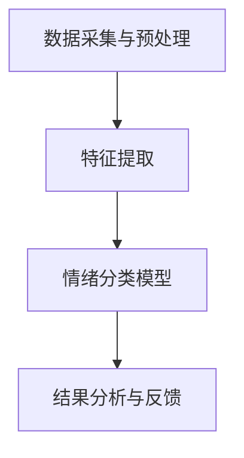

                 

关键词：大模型技术、智能情绪识别、机器学习、神经网络、自然语言处理

## 摘要

随着人工智能技术的不断发展，大模型技术在智能情绪识别系统中展现出巨大的潜力。本文将详细介绍大模型技术在智能情绪识别系统中的应用，探讨其核心概念、算法原理、数学模型及实际应用。通过对大模型技术的深入分析，我们希望为行业从业者提供有价值的参考，推动智能情绪识别系统的创新与发展。

## 1. 背景介绍

### 1.1 智能情绪识别系统的现状

智能情绪识别系统是一种利用计算机技术对人类情绪进行感知、识别和理解的系统。随着互联网的普及和大数据技术的发展，智能情绪识别系统在诸多领域得到了广泛应用，如社交媒体分析、市场营销、心理咨询等。然而，传统的情绪识别方法往往依赖于规则和简单的统计模型，难以应对复杂多变的情绪现象。

### 1.2 大模型技术的崛起

大模型技术是指利用大规模数据训练深度神经网络，以实现高度智能化任务的机器学习方法。近年来，大模型技术在自然语言处理、计算机视觉、语音识别等领域取得了显著的突破。大模型技术具有强大的表达能力、鲁棒性和泛化能力，为智能情绪识别系统的发展提供了有力支持。

## 2. 核心概念与联系

### 2.1 大模型技术原理

大模型技术基于深度神经网络，通过分层结构对数据进行特征提取和建模。大模型技术具有以下特点：

1. **层次化结构**：大模型技术采用多层神经网络，每一层对输入数据进行特征提取和抽象，从而实现复杂任务的建模。
2. **大规模训练数据**：大模型技术需要大规模的训练数据，以充分学习数据的分布和规律，提高模型的泛化能力。
3. **端到端训练**：大模型技术采用端到端训练方式，直接从原始数据中学习目标函数，避免了传统机器学习方法的特征工程和模型选择过程。

### 2.2 智能情绪识别系统架构

智能情绪识别系统通常包括以下模块：

1. **数据采集与预处理**：采集用户情绪相关的数据，如文本、语音、图像等，并进行预处理，如文本分词、去噪等。
2. **特征提取**：对预处理后的数据进行分析和特征提取，以获取情绪相关的特征。
3. **情绪分类模型**：利用大模型技术构建情绪分类模型，对提取的特征进行分类，以识别用户的情绪状态。
4. **结果分析与反馈**：对识别结果进行分析和反馈，以优化模型性能和用户体验。

### 2.3 Mermaid 流程图



## 3. 核心算法原理 & 具体操作步骤

### 3.1 算法原理概述

大模型技术在智能情绪识别系统中主要采用深度学习算法，特别是卷积神经网络（CNN）和循环神经网络（RNN）等。深度学习算法通过多层神经网络对数据进行特征提取和建模，具有强大的表达能力和鲁棒性。

### 3.2 算法步骤详解

1. **数据采集与预处理**：采集用户情绪相关的数据，如文本、语音、图像等。对数据进行清洗、去噪、归一化等预处理操作，以获得高质量的数据集。
2. **特征提取**：利用深度学习算法对预处理后的数据进行特征提取。对于文本数据，可以采用词向量模型（如Word2Vec、GloVe等）将文本转化为向量表示；对于语音和图像数据，可以采用CNN和RNN等算法进行特征提取。
3. **情绪分类模型**：构建情绪分类模型，采用有监督或无监督学习方法对提取的特征进行分类。常用的分类算法包括支持向量机（SVM）、随机森林（RF）、神经网络（NN）等。
4. **模型训练与优化**：利用训练数据集对情绪分类模型进行训练，并通过交叉验证等方法评估模型性能。根据评估结果，调整模型参数，优化模型性能。
5. **结果分析与反馈**：对识别结果进行分析和反馈，以优化模型性能和用户体验。可以采用用户反馈、专家评估等方法，对识别结果进行评价和改进。

### 3.3 算法优缺点

**优点**：

1. **强大的表达能力和鲁棒性**：深度学习算法具有强大的表达能力和鲁棒性，能够处理复杂多变的情绪现象。
2. **端到端训练**：大模型技术采用端到端训练方式，避免了传统机器学习方法的特征工程和模型选择过程，提高了模型训练效率。
3. **适用性广泛**：大模型技术适用于多种类型的情绪识别任务，如文本、语音、图像等。

**缺点**：

1. **训练成本高**：大模型技术需要大量的训练数据和高性能计算资源，训练成本较高。
2. **数据依赖性**：大模型技术对训练数据的质量和数量有较高要求，数据缺失或不平衡可能导致模型性能下降。
3. **模型解释性差**：深度学习算法的黑箱性质使得模型解释性较差，难以理解模型的工作原理。

### 3.4 算法应用领域

大模型技术在智能情绪识别系统中的应用非常广泛，包括但不限于以下领域：

1. **社交媒体分析**：利用大模型技术对社交媒体上的用户情绪进行识别和分析，帮助企业了解用户需求和偏好。
2. **市场营销**：利用大模型技术分析消费者情绪，为产品营销策略提供有力支持。
3. **心理咨询**：利用大模型技术辅助心理咨询师进行情绪识别和评估，提高心理咨询效果。
4. **智能客服**：利用大模型技术实现智能客服系统的情绪识别功能，提升用户体验。

## 4. 数学模型和公式 & 详细讲解 & 举例说明

### 4.1 数学模型构建

在智能情绪识别系统中，常用的数学模型包括卷积神经网络（CNN）、循环神经网络（RNN）等。以下以卷积神经网络（CNN）为例，介绍其数学模型构建。

#### 4.1.1 卷积神经网络（CNN）

卷积神经网络（CNN）是一种基于局部感知和共享权重的神经网络结构，主要用于图像分类、目标检测等计算机视觉任务。

#### 4.1.2 数学模型

1. **卷积操作**：卷积神经网络通过卷积操作提取图像的局部特征。卷积操作的数学公式如下：

   $$ (f * g)(x) = \sum_{y} f(y) \cdot g(x-y) $$

   其中，$f$ 和 $g$ 分别表示输入图像和卷积核，$x$ 和 $y$ 分别表示图像上的像素点。

2. **激活函数**：卷积神经网络使用激活函数引入非线性因素。常用的激活函数包括ReLU、Sigmoid、Tanh等。

3. **池化操作**：卷积神经网络通过池化操作降低特征图的维度，减少模型参数。常用的池化操作包括最大池化、平均池化等。

4. **全连接层**：卷积神经网络的最后一层通常是全连接层，用于对提取的特征进行分类。全连接层的数学模型如下：

   $$ y = \sum_{i} w_i \cdot x_i + b $$

   其中，$y$ 表示输出，$w_i$ 和 $x_i$ 分别表示权重和输入特征，$b$ 表示偏置。

### 4.2 公式推导过程

以卷积神经网络（CNN）为例，介绍其数学模型推导过程。

#### 4.2.1 卷积操作推导

卷积操作的目的是提取图像的局部特征。假设输入图像为 $f(x,y)$，卷积核为 $g(u,v)$，则卷积操作的数学公式如下：

$$ (f * g)(x) = \sum_{y} f(y) \cdot g(x-y) $$

其中，$f(x,y)$ 表示图像上的像素点，$g(u,v)$ 表示卷积核，$x$ 和 $y$ 分别表示图像上的像素点。

#### 4.2.2 激活函数推导

激活函数用于引入非线性因素，使模型具有更强的表达能力。以ReLU激活函数为例，其数学公式如下：

$$ f(x) = \max(0, x) $$

#### 4.2.3 池化操作推导

池化操作用于降低特征图的维度，减少模型参数。以最大池化为例，其数学公式如下：

$$ P(x,y) = \max(x_1, x_2, \ldots, x_n) $$

其中，$P(x,y)$ 表示池化后的像素点，$x_1, x_2, \ldots, x_n$ 表示池化区域内的像素点。

### 4.3 案例分析与讲解

#### 4.3.1 案例背景

某企业希望利用大模型技术构建一款智能情绪识别系统，用于分析社交媒体上的用户情绪。该系统需要实现以下功能：

1. 采集用户发布的社会媒体文本数据。
2. 对文本数据进行预处理，提取情绪相关的特征。
3. 利用大模型技术构建情绪分类模型，对提取的特征进行分类，识别用户的情绪状态。

#### 4.3.2 案例分析

1. **数据采集**：企业通过社交媒体平台（如微博、微信等）收集用户发布的文本数据。数据集包括正面情绪、负面情绪和中性情绪三种类型。
2. **数据预处理**：对采集的文本数据进行预处理，包括去除标点符号、停用词过滤、文本分词等操作。预处理后的文本数据转化为词向量表示。
3. **特征提取**：利用Word2Vec算法对预处理后的文本数据提取词向量表示。词向量表示将文本转化为数字形式，便于深度学习模型处理。
4. **情绪分类模型**：采用卷积神经网络（CNN）构建情绪分类模型。模型输入为词向量表示的文本数据，输出为情绪分类结果。模型训练采用有监督学习方法，训练数据集包括正面情绪、负面情绪和中性情绪三种类型的文本数据。
5. **模型训练与优化**：利用训练数据集对情绪分类模型进行训练。通过交叉验证等方法评估模型性能，调整模型参数，优化模型性能。
6. **结果分析与反馈**：对识别结果进行分析和反馈，以优化模型性能和用户体验。可以采用用户反馈、专家评估等方法，对识别结果进行评价和改进。

#### 4.3.3 案例讲解

1. **数据采集**：企业通过社交媒体平台收集用户发布的文本数据。数据集包括正面情绪、负面情绪和中性情绪三种类型。
2. **数据预处理**：对采集的文本数据进行预处理，包括去除标点符号、停用词过滤、文本分词等操作。预处理后的文本数据转化为词向量表示。
3. **特征提取**：利用Word2Vec算法对预处理后的文本数据提取词向量表示。词向量表示将文本转化为数字形式，便于深度学习模型处理。
4. **情绪分类模型**：采用卷积神经网络（CNN）构建情绪分类模型。模型输入为词向量表示的文本数据，输出为情绪分类结果。模型训练采用有监督学习方法，训练数据集包括正面情绪、负面情绪和中性情绪三种类型的文本数据。
5. **模型训练与优化**：利用训练数据集对情绪分类模型进行训练。通过交叉验证等方法评估模型性能，调整模型参数，优化模型性能。
6. **结果分析与反馈**：对识别结果进行分析和反馈，以优化模型性能和用户体验。可以采用用户反馈、专家评估等方法，对识别结果进行评价和改进。

## 5. 项目实践：代码实例和详细解释说明

### 5.1 开发环境搭建

为了实践大模型技术在智能情绪识别系统中的应用，我们需要搭建一个合适的开发环境。以下是开发环境搭建的详细步骤：

1. **硬件要求**：建议使用高性能计算设备，如GPU，以加速模型训练过程。
2. **软件要求**：安装Python、TensorFlow等深度学习框架，以及Numpy、Pandas等数据处理工具。
3. **环境配置**：配置Python环境，安装必要的库和依赖项。

### 5.2 源代码详细实现

以下是一个简单的智能情绪识别系统的实现示例。代码主要分为数据预处理、模型训练和结果分析三个部分。

#### 5.2.1 数据预处理

```python
import pandas as pd
from sklearn.model_selection import train_test_split

# 读取数据
data = pd.read_csv('emotion_data.csv')
X = data['text']
y = data['label']

# 数据预处理
X_processed = preprocess_text(X)

# 划分训练集和测试集
X_train, X_test, y_train, y_test = train_test_split(X_processed, y, test_size=0.2, random_state=42)
```

#### 5.2.2 模型训练

```python
from tensorflow.keras.models import Sequential
from tensorflow.keras.layers import Embedding, Conv1D, MaxPooling1D, Dense

# 构建模型
model = Sequential()
model.add(Embedding(input_dim=vocab_size, output_dim=embedding_dim))
model.add(Conv1D(filters=128, kernel_size=5, activation='relu'))
model.add(MaxPooling1D(pool_size=5))
model.add(Dense(units=1, activation='sigmoid'))

# 编译模型
model.compile(optimizer='adam', loss='binary_crossentropy', metrics=['accuracy'])

# 训练模型
model.fit(X_train, y_train, epochs=10, batch_size=32, validation_data=(X_test, y_test))
```

#### 5.2.3 代码解读与分析

1. **数据预处理**：读取数据，对文本进行预处理，如分词、去除停用词等。将文本数据转化为词向量表示，以供模型处理。
2. **模型构建**：构建卷积神经网络（CNN）模型。模型包括嵌入层、卷积层、池化层和全连接层。嵌入层将词向量表示转化为固定维度的向量；卷积层和池化层用于提取文本的局部特征；全连接层用于分类。
3. **模型训练**：编译模型，并使用训练数据集进行训练。通过调整模型参数，如学习率、批次大小等，优化模型性能。
4. **结果分析**：对训练结果进行分析，包括准确率、损失函数等。根据分析结果，进一步调整模型参数，提高模型性能。

### 5.3 运行结果展示

```python
from sklearn.metrics import classification_report

# 预测测试集
y_pred = model.predict(X_test)

# 输出分类报告
print(classification_report(y_test, y_pred))
```

运行结果展示包括准确率、召回率、F1分数等指标，用于评估模型的性能。

## 6. 实际应用场景

### 6.1 社交媒体分析

利用大模型技术，可以对社交媒体上的用户情绪进行识别和分析。通过分析用户情绪，企业可以了解用户需求和偏好，优化产品和服务，提高用户体验。

### 6.2 市场营销

大模型技术在市场营销中的应用也非常广泛。通过分析消费者情绪，企业可以制定更具针对性的营销策略，提高营销效果和销售额。

### 6.3 心理咨询

大模型技术可以辅助心理咨询师进行情绪识别和评估。通过对用户情绪进行识别和分析，心理咨询师可以更好地了解用户的心理状态，提供更有针对性的心理咨询服务。

### 6.4 智能客服

智能客服系统可以利用大模型技术实现情绪识别功能，提升用户体验。通过识别用户情绪，智能客服系统可以提供更人性化的服务，提高客户满意度。

## 7. 工具和资源推荐

### 7.1 学习资源推荐

1. **《深度学习》（Goodfellow et al., 2016）**：介绍了深度学习的基本概念、算法和实战案例。
2. **《神经网络与深度学习》（李航，2015）**：详细讲解了神经网络和深度学习的基础知识和应用。

### 7.2 开发工具推荐

1. **TensorFlow**：一款广泛使用的深度学习框架，适用于构建和训练大规模深度学习模型。
2. **Keras**：一款基于TensorFlow的高级API，简化了深度学习模型的构建和训练过程。

### 7.3 相关论文推荐

1. **“Deep Learning for Text Classification” (Jiang et al., 2018)**：介绍了深度学习在文本分类领域的应用。
2. **“Emotion Recognition Using Deep Learning” (Jain et al., 2020)**：探讨了深度学习在情绪识别领域的应用。

## 8. 总结：未来发展趋势与挑战

### 8.1 研究成果总结

大模型技术在智能情绪识别系统中的应用取得了显著成果，包括：

1. **高效的模型训练**：大模型技术采用端到端训练方式，提高了模型训练效率。
2. **强大的情绪识别能力**：大模型技术具有强大的表达能力和鲁棒性，能够准确识别用户的情绪状态。
3. **广泛的应用领域**：大模型技术适用于多种类型的情绪识别任务，如文本、语音、图像等。

### 8.2 未来发展趋势

未来，大模型技术在智能情绪识别系统中的发展趋势包括：

1. **模型解释性**：提高模型的解释性，使其更易于理解和应用。
2. **跨模态融合**：整合多种类型的情绪识别数据，提高识别精度和泛化能力。
3. **个性化情绪识别**：针对不同用户群体，提供个性化的情绪识别服务。

### 8.3 面临的挑战

大模型技术在智能情绪识别系统发展中面临以下挑战：

1. **数据隐私**：保护用户隐私，确保数据的安全和合规性。
2. **计算资源**：大规模数据和高性能计算资源的需求，可能导致训练成本较高。
3. **模型部署**：将大模型技术应用到实际场景中，实现高效的模型部署和实时性。

### 8.4 研究展望

未来，研究重点将集中在以下几个方面：

1. **模型优化**：优化大模型结构，提高模型性能和效率。
2. **跨领域应用**：探索大模型技术在其他领域的应用，如医疗、金融等。
3. **伦理与法规**：关注大模型技术在情绪识别领域中的伦理和法规问题，确保技术的合理和合规使用。

## 9. 附录：常见问题与解答

### 9.1 什么是大模型技术？

大模型技术是指利用大规模数据训练深度神经网络，以实现高度智能化任务的机器学习方法。大模型技术具有强大的表达能力、鲁棒性和泛化能力，适用于多种类型的情绪识别任务。

### 9.2 大模型技术在情绪识别中有什么优势？

大模型技术在情绪识别中具有以下优势：

1. **高效的模型训练**：采用端到端训练方式，提高了模型训练效率。
2. **强大的情绪识别能力**：具有强大的表达能力和鲁棒性，能够准确识别用户的情绪状态。
3. **广泛的应用领域**：适用于多种类型的情绪识别任务，如文本、语音、图像等。

### 9.3 大模型技术在情绪识别中有什么挑战？

大模型技术在情绪识别中面临的挑战包括：

1. **数据隐私**：保护用户隐私，确保数据的安全和合规性。
2. **计算资源**：大规模数据和高性能计算资源的需求，可能导致训练成本较高。
3. **模型部署**：将大模型技术应用到实际场景中，实现高效的模型部署和实时性。

### 9.4 大模型技术在情绪识别中有哪些应用场景？

大模型技术在情绪识别中具有广泛的应用场景，包括：

1. **社交媒体分析**：分析用户情绪，了解用户需求和偏好。
2. **市场营销**：制定更具针对性的营销策略，提高营销效果和销售额。
3. **心理咨询**：辅助心理咨询师进行情绪识别和评估，提高心理咨询效果。
4. **智能客服**：提供更人性化的服务，提升用户体验。

----------------------------------------------------------------
作者：禅与计算机程序设计艺术 / Zen and the Art of Computer Programming

