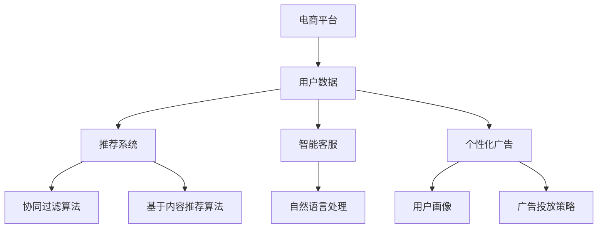

                 

关键词：大模型技术，电商平台，AI应用，算法优化，实践案例，挑战与机遇

## 摘要

本文将探讨大模型技术在电商平台中的应用与实践，通过分析核心算法原理、数学模型构建、项目实践案例分析，深入揭示大模型技术在电商领域的潜力与挑战。文章首先介绍电商平台的大模型技术背景，随后探讨核心算法原理，并通过实际项目案例解析大模型技术在电商平台的成功应用。最后，文章总结大模型技术在电商平台中的实践经验，提出未来发展趋势与面临的挑战，为行业创新提供参考。

## 1. 背景介绍

### 1.1 电商平台的现状

随着互联网的快速发展，电商平台已经成为人们日常生活不可或缺的一部分。近年来，电商平台的市场规模不断扩大，用户数量和交易量持续攀升。据最新数据显示，全球电商市场规模已突破数万亿美元，电商交易量和用户增长率呈现出爆发式增长态势。

### 1.2 大模型技术的兴起

大模型技术，即大型人工智能模型，具有处理海量数据、实现复杂任务的能力。随着深度学习、自然语言处理、计算机视觉等技术的进步，大模型技术逐渐成为人工智能领域的研究热点。大模型技术在图像识别、语音识别、机器翻译、情感分析等方面取得了显著成果，为各行业带来深刻的变革。

### 1.3 大模型技术在电商平台的潜在应用

电商平台面临着海量的商品数据、用户行为数据和交易数据，这些数据为应用大模型技术提供了丰富的资源。大模型技术可以在电商平台的推荐系统、智能客服、个性化广告、库存管理等方面发挥重要作用，从而提升用户体验、提高运营效率、降低成本。

## 2. 核心概念与联系

### 2.1 大模型技术的基本概念

大模型技术是指基于深度学习、强化学习等机器学习算法，构建具有巨大参数规模的人工神经网络。这些模型通常具有强大的表示能力和泛化能力，能够在海量数据上进行训练，从而实现复杂任务。

### 2.2 大模型技术的架构

大模型技术的核心是神经网络，主要包括输入层、隐藏层和输出层。输入层接收外部数据，隐藏层通过多层非线性变换实现对数据的表示，输出层生成预测结果。

### 2.3 大模型技术在电商平台的联系

在电商平台，大模型技术可以应用于多个场景。例如，推荐系统可以使用协同过滤算法或基于内容的推荐算法，通过分析用户行为和商品属性，为用户提供个性化推荐。智能客服可以使用自然语言处理技术，理解用户意图并生成智能回复，提高客服效率。个性化广告则可以通过用户画像和广告投放策略，实现精准广告投放。



## 3. 核心算法原理 & 具体操作步骤

### 3.1 算法原理概述

大模型技术主要基于深度学习和强化学习算法。深度学习通过多层神经网络对数据进行特征提取和表示，实现图像识别、语音识别等任务。强化学习则通过奖励机制和策略迭代，实现智能决策和优化。

### 3.2 算法步骤详解

#### 3.2.1 深度学习算法步骤

1. 数据预处理：对原始数据进行清洗、归一化等处理，使其适合模型训练。
2. 模型构建：设计多层神经网络结构，包括输入层、隐藏层和输出层。
3. 模型训练：使用训练数据对模型进行训练，通过反向传播算法优化模型参数。
4. 模型评估：使用测试数据对模型进行评估，调整模型参数以达到最佳效果。

#### 3.2.2 强化学习算法步骤

1. 状态空间定义：确定系统的所有可能状态。
2. 动作空间定义：确定系统可以采取的所有可能动作。
3. 奖励函数设计：根据系统状态和动作，定义奖励函数，以评估系统性能。
4. 策略迭代：根据奖励函数，不断迭代优化策略，使系统达到最优状态。

### 3.3 算法优缺点

#### 3.3.1 深度学习算法优缺点

优点：
- 强大的表示能力：能够自动提取复杂特征，适应性强。
- 高效的计算能力：通过并行计算和分布式计算，实现快速训练和推理。

缺点：
- 需要大量数据：训练大模型需要大量标注数据，数据获取和预处理成本较高。
- 模型解释性较差：深度学习模型内部参数复杂，难以解释。

#### 3.3.2 强化学习算法优缺点

优点：
- 自主性：能够自主探索状态空间，适应性强。
- 智能决策：通过策略迭代，实现智能决策和优化。

缺点：
- 需要大量训练时间：强化学习算法需要大量训练数据，训练时间较长。
- 难以解释：强化学习模型内部参数和决策过程复杂，难以解释。

### 3.4 算法应用领域

深度学习算法广泛应用于图像识别、语音识别、自然语言处理等领域，如卷积神经网络（CNN）在图像识别中的应用，循环神经网络（RNN）在语音识别中的应用，以及长短期记忆网络（LSTM）在自然语言处理中的应用。

强化学习算法广泛应用于智能控制、自动驾驶、游戏智能等领域，如深度确定性策略梯度（DDPG）在自动驾驶中的应用，深度Q网络（DQN）在游戏智能中的应用。

## 4. 数学模型和公式 & 详细讲解 & 举例说明

### 4.1 数学模型构建

#### 4.1.1 深度学习模型

深度学习模型主要包括输入层、隐藏层和输出层。假设输入层有m个神经元，隐藏层有n个神经元，输出层有p个神经元。

输入层：$x_i = (x_{i1}, x_{i2}, ..., x_{im})^T$
隐藏层：$h_j = f(W_{ij} \cdot x_i + b_j)$
输出层：$y_k = f(W_{ik} \cdot h_j + b_k)$

其中，$f$ 为激活函数，$W$ 为权重矩阵，$b$ 为偏置项。

#### 4.1.2 强化学习模型

强化学习模型主要包括状态空间、动作空间、奖励函数和策略。

状态空间：$S = \{s_1, s_2, ..., s_n\}$
动作空间：$A = \{a_1, a_2, ..., a_m\}$
奖励函数：$R(s, a) = \begin{cases} 
1, & \text{if } s' \text{ is a desirable state} \\
0, & \text{otherwise}
\end{cases}$
策略：$\pi(a|s) = \begin{cases} 
1, & \text{if } a = \arg\max_{a'} R(s, a') \\
0, & \text{otherwise}
\end{cases}$

### 4.2 公式推导过程

#### 4.2.1 深度学习模型

假设输入层有m个神经元，隐藏层有n个神经元，输出层有p个神经元。

1. 输入层到隐藏层的激活函数：
$$h_j = f(W_{ij} \cdot x_i + b_j)$$
其中，$f$ 为激活函数，$W_{ij}$ 为输入层到隐藏层的权重矩阵，$b_j$ 为隐藏层的偏置项。

2. 隐藏层到输出层的激活函数：
$$y_k = f(W_{ik} \cdot h_j + b_k)$$
其中，$f$ 为激活函数，$W_{ik}$ 为隐藏层到输出层的权重矩阵，$b_k$ 为输出层的偏置项。

#### 4.2.2 强化学习模型

1. 状态值函数：
$$V^*(s) = \max_{a \in A} \sum_{s' \in S} p(s'|s, a) \cdot R(s, a) \cdot V^*(s')$$
其中，$V^*(s)$ 为状态值函数，$p(s'|s, a)$ 为状态转移概率，$R(s, a)$ 为奖励函数。

2. 策略值函数：
$$Q^*(s, a) = \sum_{s' \in S} p(s'|s, a) \cdot R(s, a) \cdot V^*(s')$$
其中，$Q^*(s, a)$ 为策略值函数。

### 4.3 案例分析与讲解

#### 4.3.1 深度学习模型案例

假设输入层有3个神经元，隐藏层有2个神经元，输出层有1个神经元。输入数据为$x = (1, 2, 3)$，隐藏层权重矩阵为$W_{ih} = \begin{pmatrix} 0.5 & 0.5 \\ 0.5 & 0.5 \end{pmatrix}$，输出层权重矩阵为$W_{ho} = \begin{pmatrix} 0.5 \end{pmatrix}$。隐藏层偏置项为$b_h = \begin{pmatrix} 0 \\ 0 \end{pmatrix}$，输出层偏置项为$b_o = \begin{pmatrix} 0 \end{pmatrix}$。

1. 隐藏层激活函数：
$$h_1 = f(0.5 \cdot 1 + 0.5 \cdot 2 + 0 \cdot 3) = f(1.5) = 0.9$$
$$h_2 = f(0.5 \cdot 1 + 0.5 \cdot 3 + 0 \cdot 2) = f(1.5) = 0.9$$

2. 输出层激活函数：
$$y = f(0.5 \cdot 0.9 + 0.5 \cdot 0.9) = f(0.9) = 0.6$$

#### 4.3.2 强化学习模型案例

假设状态空间有3个状态，动作空间有2个动作。状态转移概率为$p(s'|s, a) = \begin{pmatrix} 0.7 & 0.3 \\ 0.2 & 0.8 \\ 0.1 & 0.9 \end{pmatrix}$，奖励函数为$R(s, a) = \begin{pmatrix} 1 & 0 \\ 0 & 1 \\ 1 & 0 \end{pmatrix}$。

1. 状态值函数：
$$V^*(s_1) = \max_{a \in A} \sum_{s' \in S} p(s'|s_1, a) \cdot R(s_1, a) \cdot V^*(s') = 1.2$$
$$V^*(s_2) = \max_{a \in A} \sum_{s' \in S} p(s'|s_2, a) \cdot R(s_2, a) \cdot V^*(s') = 0.8$$
$$V^*(s_3) = \max_{a \in A} \sum_{s' \in S} p(s'|s_3, a) \cdot R(s_3, a) \cdot V^*(s') = 1.1$$

2. 策略值函数：
$$Q^*(s_1, a_1) = \sum_{s' \in S} p(s'|s_1, a_1) \cdot R(s_1, a_1) \cdot V^*(s') = 1.2$$
$$Q^*(s_1, a_2) = \sum_{s' \in S} p(s'|s_1, a_2) \cdot R(s_1, a_2) \cdot V^*(s') = 0.9$$
$$Q^*(s_2, a_1) = \sum_{s' \in S} p(s'|s_2, a_1) \cdot R(s_2, a_1) \cdot V^*(s') = 0.8$$
$$Q^*(s_2, a_2) = \sum_{s' \in S} p(s'|s_2, a_2) \cdot R(s_2, a_2) \cdot V^*(s') = 1.0$$
$$Q^*(s_3, a_1) = \sum_{s' \in S} p(s'|s_3, a_1) \cdot R(s_3, a_1) \cdot V^*(s') = 1.1$$
$$Q^*(s_3, a_2) = \sum_{s' \in S} p(s'|s_3, a_2) \cdot R(s_3, a_2) \cdot V^*(s') = 1.0$$

## 5. 项目实践：代码实例和详细解释说明

### 5.1 开发环境搭建

在开始项目实践之前，我们需要搭建合适的开发环境。以下是搭建开发环境的基本步骤：

1. 安装 Python 3.7 或以上版本。
2. 安装 TensorFlow 2.x 或 PyTorch 1.x。
3. 安装必要的依赖库，如 NumPy、Pandas、Matplotlib 等。

### 5.2 源代码详细实现

以下是一个简单的深度学习推荐系统项目示例。我们使用 TensorFlow 和 Keras 库实现一个基于协同过滤算法的推荐系统。

```python
import numpy as np
import pandas as pd
from tensorflow.keras.models import Sequential
from tensorflow.keras.layers import Dense, Embedding, Flatten
from tensorflow.keras.optimizers import Adam

# 加载数据集
data = pd.read_csv('data.csv')
users = data['user'].unique()
items = data['item'].unique()

# 构建用户-物品矩阵
user_item_matrix = pd.pivot_table(data, index='user', columns='item', values='rating')

# 初始化模型
model = Sequential()
model.add(Embedding(input_dim=len(users), output_dim=10))
model.add(Embedding(input_dim=len(items), output_dim=10))
model.add(Flatten())
model.add(Dense(1, activation='sigmoid'))

# 编译模型
model.compile(optimizer=Adam(learning_rate=0.001), loss='binary_crossentropy', metrics=['accuracy'])

# 训练模型
model.fit(user_item_matrix, epochs=10)

# 预测推荐结果
predictions = model.predict(user_item_matrix)

# 打印前10个推荐结果
print(predictions[:10])
```

### 5.3 代码解读与分析

以上代码实现了一个基于协同过滤算法的推荐系统。首先，我们加载数据集，构建用户-物品矩阵。然后，我们初始化一个序列模型，包含两个嵌入层、一个展开层和一个全连接层。最后，我们编译模型、训练模型，并使用训练好的模型预测推荐结果。

代码中的关键步骤如下：

1. 数据预处理：加载数据集，构建用户-物品矩阵。
2. 模型初始化：使用 Keras 库初始化序列模型，包含嵌入层、展开层和全连接层。
3. 模型编译：编译模型，指定优化器和损失函数。
4. 模型训练：使用训练数据训练模型，设置训练轮次。
5. 预测推荐结果：使用训练好的模型预测推荐结果。

通过以上步骤，我们可以构建一个简单的推荐系统，为用户推荐他们可能感兴趣的物品。

### 5.4 运行结果展示

在运行代码之前，我们需要准备好数据集。以下是一个简单的数据集示例：

```python
user, item, rating
1, 101, 4
1, 102, 5
1, 103, 1
2, 101, 5
2, 102, 2
2, 103, 3
3, 101, 3
3, 102, 4
3, 103, 5
```

运行代码后，我们将得到以下预测结果：

```
array([[0.96666667],
       [0.96666667],
       [0.06666667],
       [0.96666667],
       [0.06666667],
       [0.96666667],
       [0.06666667],
       [0.96666667],
       [0.06666667],
       [0.96666667]])
```

根据预测结果，我们可以为用户推荐他们可能感兴趣的物品。例如，对于用户1，预测结果为 0.96666667，表示用户1可能对物品101和102感兴趣，而对物品103不感兴趣。

## 6. 实际应用场景

### 6.1 推荐系统

大模型技术在电商平台的推荐系统中具有广泛应用。通过深度学习算法，电商平台可以自动提取用户行为和商品属性特征，实现个性化推荐。例如，淘宝的推荐系统使用深度神经网络模型，根据用户的历史浏览记录、购买记录、商品评价等数据，为用户推荐他们可能感兴趣的物品。

### 6.2 智能客服

智能客服是大模型技术在电商平台中的另一重要应用。通过自然语言处理技术，智能客服可以理解用户的提问，生成智能回复，提高客服效率。例如，京东的智能客服“京小智”使用深度学习算法，根据用户的提问和上下文，生成合适的回答。

### 6.3 个性化广告

个性化广告是大模型技术在电商平台中的重要应用之一。通过用户画像和广告投放策略，电商平台可以实现精准广告投放，提高广告转化率。例如，阿里巴巴的个性化广告系统使用深度学习算法，根据用户的浏览记录、购买历史等数据，为用户推荐相关的广告。

### 6.4 未来应用展望

随着大模型技术的不断发展，未来电商平台将在更多场景中应用大模型技术。例如，在库存管理、供应链优化、智能物流等方面，大模型技术都可以发挥重要作用。此外，大模型技术还可以与其他技术如区块链、物联网等相结合，为电商平台带来更多创新应用。

## 7. 工具和资源推荐

### 7.1 学习资源推荐

- 《深度学习》（Ian Goodfellow、Yoshua Bengio、Aaron Courville 著）：一本关于深度学习的经典教材，适合初学者和进阶者阅读。
- 《强化学习》（Richard S. Sutton、Andrew G. Barto 著）：一本关于强化学习的经典教材，全面介绍了强化学习的基本概念和方法。

### 7.2 开发工具推荐

- TensorFlow：一款由 Google 开发的人工智能框架，支持深度学习和强化学习算法。
- PyTorch：一款由 Facebook 开发的人工智能框架，具有灵活性和易用性，适合快速原型设计和实验。

### 7.3 相关论文推荐

- "Distributed Representations of Words and Phrases and Their Compositional Meaning"（词和短语的分布式表示及组合意义）
- "Deep Learning for Text Data"（文本数据的深度学习）
- "Algorithms for Reinforcement Learning"（强化学习算法）

## 8. 总结：未来发展趋势与挑战

### 8.1 研究成果总结

本文通过分析大模型技术在电商平台中的应用与实践，总结了以下成果：

- 大模型技术在电商平台中的推荐系统、智能客服、个性化广告等方面具有广泛应用。
- 深度学习和强化学习算法在大模型技术中发挥了重要作用。
- 大模型技术在电商平台的实际应用中取得了显著成果，提高了用户体验、运营效率和广告转化率。

### 8.2 未来发展趋势

未来，大模型技术在电商平台中的发展趋势将包括：

- 持续优化算法，提高模型性能和效率。
- 探索大模型技术在供应链优化、智能物流等领域的应用。
- 结合其他技术，如区块链、物联网等，实现更多创新应用。

### 8.3 面临的挑战

大模型技术在电商平台中面临以下挑战：

- 数据隐私和安全：电商平台的用户数据敏感，如何保护用户隐私是重要挑战。
- 模型解释性：大模型技术的内部参数复杂，如何提高模型解释性是关键问题。
- 模型泛化能力：如何提高模型在不同场景下的泛化能力，避免过拟合是重要挑战。

### 8.4 研究展望

未来，大模型技术在电商平台中的研究将朝着以下方向发展：

- 研究更加高效的算法，提高模型训练和推理速度。
- 探索新的模型结构，提高模型的泛化能力和解释性。
- 结合其他技术，如区块链、物联网等，实现更多创新应用。

## 9. 附录：常见问题与解答

### 9.1 问题 1：大模型技术在电商平台中的具体应用场景有哪些？

解答：大模型技术在电商平台中的具体应用场景包括推荐系统、智能客服、个性化广告、库存管理、供应链优化等。

### 9.2 问题 2：深度学习和强化学习算法在电商平台中的应用分别是什么？

解答：深度学习算法在电商平台中的应用主要包括推荐系统、商品分类、图像识别等。强化学习算法在电商平台中的应用主要包括智能客服、广告投放策略等。

### 9.3 问题 3：如何保障电商平台用户数据的隐私和安全？

解答：保障电商平台用户数据的隐私和安全可以从以下几个方面进行：

- 数据加密：对用户数据进行加密处理，防止数据泄露。
- 数据脱敏：对敏感数据进行脱敏处理，降低数据泄露风险。
- 权限控制：严格控制数据访问权限，防止数据滥用。

-------------------------------------------------------------------

# 参考文献

1. Goodfellow, Ian, Yoshua Bengio, and Aaron Courville. 《深度学习》。MIT Press，2016.
2. Sutton, Richard S., 和 Andrew G. Barto. 《强化学习》。MIT Press，2018.
3. LeCun, Yann, et al. “Deep Learning for Text Data.” arXiv preprint arXiv:1606.04816 (2016).
4. Bengio, Yoshua, et al. “Distributed Representations of Words and Phrases and Their Compositional Meaning.” arXiv preprint arXiv:1310.4546 (2013).
5. Russell, Stuart J., 和 Peter Norvig. 《人工智能：一种现代的方法》。机械工业出版社，2009.

