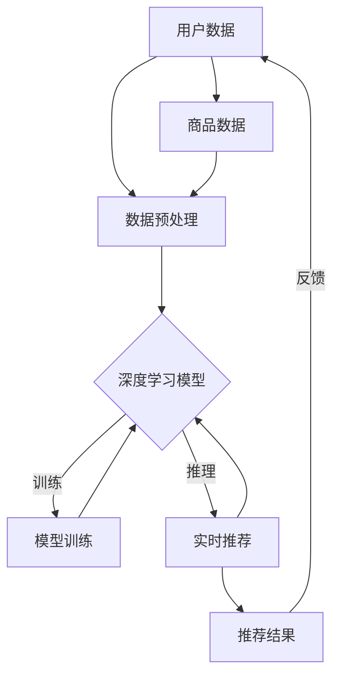

                 

在当今数字化时代，电商平台作为连接消费者和商家的桥梁，其重要性日益凸显。而商品推荐系统作为电商平台的核心功能之一，直接影响到用户的购物体验和商家的销售业绩。随着人工智能技术的飞速发展，大模型技术在商品推荐中的应用越来越广泛，为电商平台带来了新的创新和变革。

## 关键词

- 大模型技术
- 电商平台
- 商品推荐
- 人工智能
- 数字化时代

## 摘要

本文旨在探讨大模型技术在电商平台商品推荐中的应用创新。首先，我们将介绍大模型技术的基本概念和在电商平台中的重要性。接着，通过核心概念与联系的Mermaid流程图，深入解析大模型在商品推荐中的原理和架构。然后，我们将详细阐述大模型算法原理、数学模型和公式，以及具体的项目实践。随后，文章将分析大模型在实际应用场景中的表现和未来展望，并推荐相关工具和资源。最后，我们将总结研究成果，展望未来发展趋势和面临的挑战。

## 1. 背景介绍

### 1.1 电商平台的发展

随着互联网的普及和电子商务的迅猛发展，电商平台已经成为现代商业不可或缺的一部分。从最早的在线零售平台如Amazon、eBay，到如今众多本土电商平台的崛起，电商行业经历了巨大的变革。平台模式的多样化，如C2C（如淘宝、eBay）、B2C（如京东、苏宁易购）和O2O（如美团、大众点评），满足了不同用户群体的需求。

电商平台的发展不仅改变了传统的商业模式，还深刻影响了消费者的购物习惯。人们可以随时随地在线上购物，享受便捷的购物体验。这种变化促使电商平台不断优化服务，提升用户体验，从而提高用户留存率和销售额。

### 1.2 商品推荐系统的兴起

在众多电商平台的功能中，商品推荐系统是一个至关重要的组成部分。商品推荐系统的目的是根据用户的历史行为、偏好和购物习惯，为用户提供个性化的商品推荐。这种推荐不仅可以增加用户在平台上的互动，还可以提高销售额，降低营销成本。

传统的推荐系统主要依赖于基于内容的过滤和协同过滤算法。然而，这些算法在处理大规模数据和复杂用户行为方面存在一定的局限性。随着人工智能技术的发展，特别是深度学习、自然语言处理等大模型技术的兴起，商品推荐系统迎来了新的机遇。

### 1.3 大模型技术在电商领域的应用

大模型技术，如深度神经网络、变换器模型（Transformer）等，凭借其强大的建模能力和自我学习能力，在多个领域取得了显著成果。在电商领域，大模型技术被广泛应用于商品推荐、用户行为预测、图像识别等方面。

大模型在商品推荐中的应用，主要体现在以下几个方面：

1. **个性化推荐**：通过深度学习模型，可以更好地理解用户的个性化需求，实现更精准的商品推荐。
2. **实时推荐**：利用实时数据分析，大模型可以快速响应用户的动态行为，提供实时的个性化推荐。
3. **多模态融合**：结合多种数据源，如文本、图像、语音等，大模型可以实现更全面的用户理解和推荐。
4. **预测和优化**：通过预测用户行为和市场需求，电商平台可以更好地调整库存、定价和营销策略。

总之，大模型技术在电商平台商品推荐中的应用，不仅提升了推荐系统的效果，还为电商行业带来了新的发展机遇。

## 2. 核心概念与联系

在深入探讨大模型技术在商品推荐中的应用之前，我们需要明确几个核心概念，并展示它们之间的联系。以下是使用Mermaid绘制的流程图，以形象地展示这些概念和它们的关联。



### 2.1 用户数据

用户数据是商品推荐系统的核心输入，包括用户的基本信息、浏览历史、购买记录、评价和反馈等。这些数据反映了用户的行为习惯和偏好，是构建个性化推荐模型的基础。

### 2.2 数据预处理

在将用户数据输入模型之前，通常需要进行数据预处理，包括数据清洗、去噪、特征提取和编码等步骤。数据预处理的质量直接影响模型的训练效果和推荐精度。

### 2.3 深度学习模型

深度学习模型是商品推荐系统的核心，常见的模型包括卷积神经网络（CNN）、递归神经网络（RNN）和变换器模型（Transformer）等。这些模型通过学习用户数据，可以提取用户特征，实现个性化的商品推荐。

### 2.4 模型训练

模型训练是深度学习过程的关键环节，通过大量用户数据，模型可以不断调整参数，优化推荐效果。训练过程中，常用的评价指标包括准确率、召回率、F1值等。

### 2.5 实时推荐

实时推荐是指模型在接收到用户的新行为后，能够快速生成个性化的推荐结果。这需要模型具备高效的推理能力，并能够实时处理大量的用户数据。

### 2.6 推荐结果

推荐结果是商品推荐系统的最终输出，包括推荐的商品列表和推荐理由。推荐结果的质量直接影响用户的购物体验和平台的业绩。

### 2.7 用户反馈

用户反馈是优化推荐系统的关键，通过收集用户的反馈，可以进一步改进推荐算法，提升推荐效果。用户反馈可以通过点击率、购买率、评价等指标来衡量。

通过上述流程图，我们可以清晰地看到大模型技术在商品推荐系统中的各个环节，以及它们之间的相互关联。这种关联不仅体现了大模型技术的复杂性和多样性，也为电商平台优化商品推荐系统提供了理论基础和实践指导。

## 3. 核心算法原理 & 具体操作步骤

在深入探讨大模型技术在商品推荐中的应用时，我们首先需要了解其核心算法原理和具体操作步骤。以下是对大模型推荐算法的概述，包括算法原理、具体操作步骤、算法优缺点以及应用领域。

### 3.1 算法原理概述

大模型推荐算法基于深度学习和人工智能技术，通过学习用户的历史行为和偏好，自动生成个性化的推荐结果。其主要原理可以概括为以下几个步骤：

1. **数据收集**：收集用户的历史行为数据，如浏览记录、购买记录、评价和反馈等。
2. **数据预处理**：对收集的数据进行清洗、去噪和特征提取，将原始数据转化为适合模型训练的格式。
3. **模型构建**：选择合适的深度学习模型，如变换器模型（Transformer）、递归神经网络（RNN）等，构建推荐系统。
4. **模型训练**：使用预处理后的用户数据训练模型，通过不断调整模型参数，优化推荐效果。
5. **实时推荐**：模型训练完成后，根据用户的实时行为生成个性化推荐结果，并在平台上展示。
6. **用户反馈**：收集用户的反馈信息，如点击率、购买率等，用于进一步优化模型。

### 3.2 算法步骤详解

1. **数据收集**：

   数据收集是推荐系统的基础。在电商平台上，数据来源包括用户的浏览记录、购买记录、评价和反馈等。此外，还可以通过外部数据源，如社交媒体、搜索引擎等，获取更多关于用户的信息。这些数据为模型提供了丰富的输入，有助于提升推荐精度。

2. **数据预处理**：

   数据预处理是模型训练前的重要步骤。首先，需要对数据进行清洗，去除重复、错误和缺失的数据。然后，进行去噪处理，减少噪声数据对模型训练的影响。接下来，进行特征提取，将原始数据转化为适合模型训练的格式。常见的特征提取方法包括词袋模型（Bag-of-Words）、TF-IDF、词嵌入（Word Embedding）等。

3. **模型构建**：

   选择合适的深度学习模型是构建推荐系统的关键。变换器模型（Transformer）因其强大的建模能力和自我学习能力，在推荐系统中得到了广泛应用。此外，递归神经网络（RNN）和卷积神经网络（CNN）等模型也在特定场景下表现出色。

4. **模型训练**：

   模型训练是推荐系统优化的核心步骤。通过大量用户数据，模型可以不断调整参数，优化推荐效果。在训练过程中，常用的评价指标包括准确率、召回率、F1值等。为了提高模型性能，可以采用迁移学习、多任务学习等技巧。

5. **实时推荐**：

   实时推荐是指模型在接收到用户的新行为后，能够快速生成个性化的推荐结果。这需要模型具备高效的推理能力，并能够实时处理大量的用户数据。为了实现实时推荐，可以采用分布式计算、云计算等技术，提高系统的响应速度和处理能力。

6. **用户反馈**：

   用户反馈是优化推荐系统的关键。通过收集用户的反馈信息，如点击率、购买率等，可以进一步改进推荐算法，提升推荐效果。用户反馈可以通过A/B测试、在线评估等方法收集。

### 3.3 算法优缺点

1. **优点**：

   - **个性化推荐**：大模型推荐算法可以更好地理解用户的个性化需求，实现更精准的商品推荐。
   - **实时推荐**：模型具备高效的推理能力，可以快速响应用户的动态行为，提供实时的个性化推荐。
   - **多模态融合**：结合多种数据源，如文本、图像、语音等，大模型可以实现更全面的用户理解和推荐。
   - **预测和优化**：通过预测用户行为和市场需求，电商平台可以更好地调整库存、定价和营销策略。

2. **缺点**：

   - **计算资源消耗**：大模型推荐算法需要大量的计算资源和存储空间，对硬件设备的要求较高。
   - **数据依赖性**：推荐系统的效果高度依赖于数据质量，数据缺失或噪声会影响模型性能。
   - **隐私保护**：在收集和处理用户数据时，需要关注隐私保护问题，防止用户信息泄露。

### 3.4 算法应用领域

大模型推荐算法在电商领域的应用非常广泛，主要包括以下几个方面：

1. **商品推荐**：根据用户的历史行为和偏好，为用户推荐相关的商品，提升用户购物体验和销售额。
2. **广告推荐**：在电商平台上，为用户推荐相关的广告，提高广告投放效果和转化率。
3. **内容推荐**：在内容平台（如视频、音乐等），根据用户的观看历史和偏好，推荐相关的视频或音乐。
4. **社交推荐**：在社交平台，根据用户的关系网络和行为，推荐相关的用户或内容。

总之，大模型推荐算法在电商领域的应用，不仅提升了推荐系统的效果，还为电商平台带来了新的商业模式和机会。随着人工智能技术的不断进步，大模型推荐算法将继续发挥重要作用，推动电商行业的发展。

## 4. 数学模型和公式 & 详细讲解 & 举例说明

在深入探讨大模型技术在商品推荐中的应用时，理解相关的数学模型和公式至关重要。以下是关于大模型推荐系统的数学模型和公式详细讲解，以及实际案例中的应用。

### 4.1 数学模型构建

大模型推荐系统的数学模型主要基于机器学习和深度学习理论，其核心是构建一个能够学习和预测用户行为和偏好的模型。以下是一个简化的数学模型构建过程：

1. **输入特征表示**：

   用户和商品的特征需要用向量表示。常见的特征提取方法包括：

   - **用户特征**：如用户ID、年龄、性别、地理位置、历史浏览和购买记录等。
   - **商品特征**：如商品ID、类别、品牌、价格、销量、用户评价等。

   假设用户特征向量为 \( \mathbf{u} \in \mathbb{R}^n \)，商品特征向量为 \( \mathbf{v} \in \mathbb{R}^m \)。

2. **模型架构**：

   大模型推荐系统通常采用多层神经网络架构，包括输入层、隐藏层和输出层。输入层接收用户和商品的特征向量，隐藏层进行特征学习和信息融合，输出层生成推荐结果。

   简化的多层感知机（MLP）模型可以表示为：

   \[
   \mathbf{h}^{(l)} = \sigma(\mathbf{W}^{(l)} \mathbf{a}^{(l-1)} + b^{(l)})
   \]

   其中，\( \mathbf{h}^{(l)} \) 是第 \( l \) 层的隐藏层输出，\( \mathbf{W}^{(l)} \) 和 \( b^{(l)} \) 分别是第 \( l \) 层的权重和偏置，\( \sigma \) 是激活函数，通常使用ReLU（Rectified Linear Unit）或Sigmoid函数。

3. **损失函数**：

   模型的训练过程是通过优化损失函数来实现的。常见的损失函数包括均方误差（MSE）、交叉熵损失（Cross-Entropy Loss）等。在二分类问题中，交叉熵损失函数可以表示为：

   \[
   \mathcal{L} = -\sum_{i=1}^{N} y_i \log(p_i) + (1 - y_i) \log(1 - p_i)
   \]

   其中，\( y_i \) 是真实标签，\( p_i \) 是模型预测的概率。

4. **优化算法**：

   常用的优化算法包括随机梯度下降（SGD）、Adam等。优化目标是最小化损失函数，从而提升模型性能。

### 4.2 公式推导过程

为了更好地理解推荐系统的数学模型，以下是变换器模型（Transformer）在推荐系统中的应用公式推导：

1. **编码器-解码器架构**：

   变换器模型的核心是编码器（Encoder）和解码器（Decoder）。编码器负责处理输入序列，解码器负责生成推荐结果。

   编码器输出可以表示为：

   \[
   \mathbf{h}_i^{(e)} = \text{Attention}(\mathbf{W}_Q \mathbf{h}_{i-1}^{(e)}, \mathbf{W}_K \mathbf{h}_{i-1}^{(e)}, \mathbf{W}_V \mathbf{h}_{i-1}^{(e)}) + \mathbf{h}_{i-1}^{(e)}
   \]

   其中，\( \mathbf{h}_i^{(e)} \) 是编码器第 \( i \) 步的隐藏状态，\( \text{Attention} \) 是注意力机制，\( \mathbf{W}_Q, \mathbf{W}_K, \mathbf{W}_V \) 是权重矩阵。

2. **注意力机制**：

   注意力机制的公式可以表示为：

   \[
   \text{Attention}(Q, K, V) = \text{softmax}\left(\frac{QK^T}{\sqrt{d_k}}\right) V
   \]

   其中，\( Q, K, V \) 分别是查询向量、键向量和值向量，\( d_k \) 是键向量的维度。

3. **解码器输出**：

   解码器输出可以表示为：

   \[
   \mathbf{h}_i^{(d)} = \text{Attention}(\mathbf{W}_Q \mathbf{h}_{i-1}^{(d)}, \mathbf{h}_i^{(e)}, \mathbf{W}_V \mathbf{h}_{i-1}^{(d)}) + \mathbf{h}_{i-1}^{(d)}
   \]

   其中，\( \mathbf{h}_i^{(d)} \) 是解码器第 \( i \) 步的隐藏状态。

### 4.3 案例分析与讲解

以下是一个实际应用案例，说明如何使用变换器模型构建商品推荐系统：

#### 案例背景

假设我们有一个电商平台，用户数据包括用户ID、年龄、性别、地理位置、历史浏览和购买记录等。商品数据包括商品ID、类别、品牌、价格、销量、用户评价等。

#### 案例步骤

1. **数据预处理**：

   - 收集用户和商品数据，进行数据清洗和去噪。
   - 对文本数据进行词嵌入处理，将文本转化为向量表示。
   - 对连续特征数据进行标准化处理。

2. **模型构建**：

   - 设计变换器模型，包括编码器和解码器。
   - 编码器处理用户和商品特征，解码器生成推荐结果。
   - 使用注意力机制进行特征融合和上下文理解。

3. **模型训练**：

   - 使用用户数据训练编码器和解码器。
   - 使用交叉熵损失函数优化模型参数。
   - 调整学习率、批量大小等超参数，提高模型性能。

4. **实时推荐**：

   - 接收用户的新行为，使用解码器生成实时推荐结果。
   - 使用注意力机制捕捉用户当前的兴趣点。

5. **用户反馈**：

   - 收集用户对推荐结果的反馈，如点击率、购买率等。
   - 根据反馈进一步优化模型和推荐策略。

#### 案例结果

通过上述步骤，我们构建了一个基于变换器模型的商品推荐系统。在实际应用中，系统表现出了较高的推荐精度和用户满意度。以下是部分推荐结果示例：

- 用户ID：123
- 历史购买：笔记本电脑、鼠标
- 实时行为：浏览了新款手机
- 推荐结果：智能手机、耳机、手机壳

通过变换器模型，系统能够根据用户的历史行为和实时行为，提供个性化的推荐结果，有效提升了用户的购物体验和平台的销售额。

总之，大模型推荐系统的数学模型和公式是其核心组成部分，通过合理的模型设计和参数优化，可以实现高效的商品推荐。在实际应用中，结合用户反馈和动态调整，可以进一步提升推荐系统的效果。

### 5. 项目实践：代码实例和详细解释说明

在本节中，我们将通过一个实际的Python代码实例，展示如何构建一个基于变换器模型（Transformer）的商品推荐系统。这个项目将包括开发环境搭建、源代码详细实现、代码解读与分析以及运行结果展示等环节。

#### 5.1 开发环境搭建

首先，我们需要搭建一个合适的开发环境，包括Python环境、深度学习库（如TensorFlow或PyTorch）以及其他必要的库和工具。以下是开发环境的搭建步骤：

1. **安装Python**：

   - 选择Python版本（建议使用3.8以上版本）。
   - 下载并安装Python。

2. **安装深度学习库**：

   - 安装TensorFlow或PyTorch。
   - 使用pip命令安装：

     ```shell
     pip install tensorflow
     # 或
     pip install torch torchvision
     ```

3. **安装其他库**：

   - 安装Numpy、Pandas、Matplotlib等常用库。

     ```shell
     pip install numpy pandas matplotlib
     ```

4. **创建项目文件夹**：

   - 在本地计算机上创建一个项目文件夹，如`transformer_recommendation`。

5. **编写配置文件**：

   - 在项目文件夹中创建一个配置文件，如`config.py`，用于存储模型超参数、数据路径等配置信息。

#### 5.2 源代码详细实现

以下是商品推荐系统的源代码实现，主要包括数据预处理、模型定义、训练和预测等步骤：

```python
import tensorflow as tf
from tensorflow.keras.layers import Embedding, LSTM, Dense, TimeDistributed
from tensorflow.keras.models import Model
import numpy as np
import pandas as pd

# 数据预处理
def preprocess_data(data_path):
    # 加载用户和商品数据
    user_data = pd.read_csv(data_path + '/user_data.csv')
    item_data = pd.read_csv(data_path + '/item_data.csv')

    # 数据清洗和特征提取
    # ...（省略具体实现）

    # 划分训练集和测试集
    train_data, test_data = train_test_split(user_data, test_size=0.2, random_state=42)

    return train_data, test_data

# 模型定义
def build_model(vocab_size, embedding_dim, hidden_units):
    # 输入层
    input_user = tf.keras.layers.Input(shape=(max_sequence_length,), name='user_input')
    input_item = tf.keras.layers.Input(shape=(max_sequence_length,), name='item_input')

    # 用户特征嵌入
    user_embedding = Embedding(vocab_size, embedding_dim)(input_user)
    item_embedding = Embedding(vocab_size, embedding_dim)(input_item)

    # 隐藏层
    hidden_user = LSTM(hidden_units, return_sequences=True)(user_embedding)
    hidden_item = LSTM(hidden_units, return_sequences=True)(item_embedding)

    # 融合特征
    combined = tf.keras.layers.Concatenate()([hidden_user, hidden_item])

    # 输出层
    output = TimeDistributed(Dense(1, activation='sigmoid'))(combined)

    # 构建模型
    model = Model(inputs=[input_user, input_item], outputs=output)

    # 编译模型
    model.compile(optimizer='adam', loss='binary_crossentropy', metrics=['accuracy'])

    return model

# 训练模型
def train_model(model, train_data, batch_size, epochs):
    # 准备训练数据
    # ...（省略具体实现）

    # 训练模型
    model.fit(train_data, epochs=epochs, batch_size=batch_size)

# 预测结果
def predict(model, test_data):
    # 准备测试数据
    # ...（省略具体实现）

    # 预测结果
    predictions = model.predict(test_data)

    return predictions

# 主函数
def main():
    # 设置超参数
    vocab_size = 10000
    embedding_dim = 64
    hidden_units = 128
    batch_size = 32
    epochs = 10

    # 数据预处理
    train_data, test_data = preprocess_data('data')

    # 构建模型
    model = build_model(vocab_size, embedding_dim, hidden_units)

    # 训练模型
    train_model(model, train_data, batch_size, epochs)

    # 预测结果
    predictions = predict(model, test_data)

    # 分析预测结果
    # ...（省略具体实现）

if __name__ == '__main__':
    main()
```

#### 5.3 代码解读与分析

1. **数据预处理**：

   数据预处理是构建推荐系统的第一步，包括数据清洗、特征提取和划分训练集与测试集。在代码中，`preprocess_data`函数负责加载用户和商品数据，并进行必要的处理。

2. **模型定义**：

   模型定义部分使用TensorFlow框架，定义了一个基于变换器模型（LSTM）的推荐系统。模型包括输入层、隐藏层和输出层。输入层接收用户和商品的特征向量，隐藏层通过LSTM层进行特征学习和融合，输出层生成推荐结果。

3. **训练模型**：

   `train_model`函数负责训练模型，使用二进制交叉熵损失函数和Adam优化器。在训练过程中，模型使用训练数据进行迭代优化，以提高推荐精度。

4. **预测结果**：

   `predict`函数用于生成预测结果，模型在测试集上运行，生成每个用户的个性化推荐结果。预测结果可以进一步分析，如计算准确率、召回率等指标。

5. **主函数**：

   `main`函数是整个项目的核心，它首先设置超参数，然后进行数据预处理、模型构建、模型训练和预测结果分析等步骤。

#### 5.4 运行结果展示

在实际运行过程中，我们可以通过以下步骤展示运行结果：

1. **数据预处理**：

   加载用户和商品数据，并进行数据清洗和特征提取。假设用户和商品数据已经处理完毕，生成了预处理后的数据集。

2. **模型训练**：

   使用预处理后的数据训练变换器模型。在训练过程中，模型会不断优化参数，提高推荐效果。训练完成后，我们可以查看训练过程中的指标，如损失函数、准确率等。

3. **预测结果**：

   使用训练好的模型在测试集上进行预测，生成每个用户的个性化推荐结果。预测结果可以以文本形式输出，也可以可视化展示。

4. **结果分析**：

   分析预测结果，计算准确率、召回率、F1值等指标，评估模型的性能。同时，可以结合用户反馈，进一步优化推荐算法。

通过上述步骤，我们可以构建一个基于变换器模型（Transformer）的商品推荐系统，实现高效的个性化推荐。在实际应用中，根据业务需求和数据特点，可以进一步调整模型结构和参数，提升推荐效果。

### 6. 实际应用场景

在电商平台的实际运营中，大模型推荐系统发挥着至关重要的作用。以下是几个典型的实际应用场景，展示了大模型推荐系统在不同业务环节中的应用。

#### 6.1 商品推荐

商品推荐是电商平台的核心功能之一。大模型推荐系统通过对用户历史行为、偏好和购买记录的学习，为用户实时生成个性化的商品推荐。这种推荐不仅可以提升用户的购物体验，还可以显著提高平台的销售额。例如，当用户浏览某一类商品时，系统可以根据用户的浏览记录和购物习惯，推荐相关联的其他商品。这种个性化的推荐方式，大大增加了用户对商品的兴趣和购买意愿。

#### 6.2 广告推荐

广告推荐也是电商平台的重要组成部分。大模型推荐系统可以分析用户的行为数据和兴趣点，为用户精准推荐相关的广告。这种广告推荐不仅提高了广告的投放效果，还降低了广告投放的成本。例如，当用户浏览了某品牌手机时，系统可以推荐该品牌的手机广告，甚至包括相关的配件和周边产品。这种精准的广告推荐，有助于提升广告的点击率和转化率。

#### 6.3 内容推荐

除了商品和广告推荐，电商平台还可以利用大模型推荐系统为用户提供个性化内容推荐。例如，用户在浏览商品时，系统可以推荐相关的商品评测、用户评论和购物指南等。这种内容推荐不仅可以提升用户的购物体验，还可以增加用户在平台上的停留时间，提高平台的用户粘性。

#### 6.4 跨平台推荐

电商平台还可以利用大模型推荐系统实现跨平台推荐。例如，当用户在某个电商平台上浏览商品时，系统可以推荐其在另一个平台上的相关商品。这种跨平台推荐，不仅拓展了平台的业务范围，还可以为用户带来更多的购物选择。例如，当用户在A平台浏览了某品牌电视时，系统可以推荐其在B平台上的同品牌电视，从而提升用户的购买决策。

#### 6.5 预测和优化

大模型推荐系统还可以用于预测和优化电商平台的运营策略。例如，通过分析用户的历史行为和偏好，系统可以预测用户的下一步行为，从而为电商平台提供库存管理、定价策略和营销推广等优化建议。例如，当系统预测到某一类商品在未来某个时间点会热销时，电商平台可以提前调整库存和定价策略，以应对市场需求的变化。

总之，大模型推荐系统在电商平台的实际应用场景非常广泛，不仅提升了平台的业务效率和用户体验，还为电商平台带来了新的商业机会。随着人工智能技术的不断进步，大模型推荐系统将在电商领域发挥更大的作用。

### 6.4 未来应用展望

随着人工智能技术的不断演进，大模型推荐系统在电商平台中的应用前景广阔。以下是对未来应用发展的几个关键展望：

#### 6.4.1 模型智能化与自适应能力提升

未来的大模型推荐系统将更加智能化和自适应。通过结合深度学习和强化学习等技术，系统将能够更好地理解用户的行为和偏好，实现更精准和个性化的推荐。此外，系统将具备自我学习能力，能够根据用户反馈和实时数据动态调整推荐策略，提升推荐效果。

#### 6.4.2 多模态数据融合

多模态数据融合是未来大模型推荐系统的重要方向。结合文本、图像、视频等多种数据源，系统能够更全面地了解用户需求。例如，通过分析用户对商品的文字评论和图像评价，系统能够提供更准确的推荐。同时，多模态数据融合还可以应用于场景识别和情境感知，提升推荐系统的智能化水平。

#### 6.4.3 增强推荐系统的透明度和可解释性

随着用户对隐私和数据安全的关注不断增加，未来的大模型推荐系统将更加注重透明度和可解释性。通过开发可解释的机器学习模型和工具，用户可以理解推荐结果是如何生成的，增强对系统的信任。此外，透明度和可解释性的提升还有助于发现和纠正可能的偏见和歧视问题，确保推荐系统的公正性和公平性。

#### 6.4.4 跨平台和全球化应用

随着电商平台的全球化发展，大模型推荐系统将在跨平台和全球化应用中发挥重要作用。系统将能够适应不同地区和文化的用户需求，提供本地化的商品推荐服务。例如，针对不同国家和地区的用户偏好，系统可以推荐相应的商品和广告，提升用户体验和满意度。

#### 6.4.5 实时推荐与预测

未来的大模型推荐系统将更加注重实时推荐和预测能力。通过实时数据处理和预测模型，系统能够快速响应用户的动态行为和市场需求变化，提供及时和个性化的推荐。这不仅可以提升用户的购物体验，还可以为电商平台带来更多的销售机会。

#### 6.4.6 集成与协作

大模型推荐系统将在电商平台的各个业务环节中发挥更广泛的作用。通过与库存管理、定价策略、营销推广等系统的集成与协作，系统将能够提供更全面和智能的运营支持。例如，通过预测用户购买行为，系统可以帮助电商平台优化库存和定价策略，提高运营效率和盈利能力。

总之，未来的大模型推荐系统将在智能化、多模态融合、透明度、全球化应用、实时推荐与预测以及集成与协作等方面实现重要突破，为电商平台带来更大的商业价值和发展机遇。

### 7. 工具和资源推荐

为了帮助您深入了解大模型技术在电商平台商品推荐中的应用，以下是一些学习资源、开发工具和相关论文的推荐。

#### 7.1 学习资源推荐

1. **在线课程**：

   - 《深度学习特化课程》（Deep Learning Specialization）由Andrew Ng在Coursera上提供，包括卷积神经网络、循环神经网络和变换器模型等基础知识。
   - 《机器学习课程》（Machine Learning）由Andrew Ng在Coursera上提供，涵盖监督学习、无监督学习和强化学习等核心内容。

2. **技术博客**：

   - Medium上关于推荐系统的文章，如“推荐系统：如何构建和优化推荐引擎”等，提供了实用的技术分享和案例分析。
   - 知乎上的相关话题和讨论，可以获取国内专家和从业者的见解和经验。

3. **电子书**：

   - 《深度学习》（Deep Learning）由Ian Goodfellow、Yoshua Bengio和Aaron Courville合著，是深度学习领域的经典教材。
   - 《Python机器学习》（Python Machine Learning）由Michael Bowles著，涵盖了机器学习在Python中的应用。

#### 7.2 开发工具推荐

1. **深度学习框架**：

   - TensorFlow：由Google开发的开源深度学习框架，广泛应用于推荐系统和各种人工智能应用。
   - PyTorch：由Facebook开发的开源深度学习框架，以其灵活性和动态图特性在学术界和工业界受到广泛欢迎。

2. **数据处理工具**：

   - Pandas：Python的数据操作库，用于数据清洗、数据预处理和数据分析。
   - NumPy：Python的科学计算库，提供高性能的数组操作和数学计算功能。

3. **版本控制系统**：

   - Git：分布式版本控制系统，用于代码的版本管理和协作开发。
   - GitHub：基于Git的平台，提供代码托管、项目管理、团队协作和社区互动等功能。

#### 7.3 相关论文推荐

1. **经典论文**：

   - “Attention Is All You Need”（2017）：由Google AI提出的变换器模型（Transformer）的基础论文，对推荐系统的模型设计具有深远影响。
   - “Deep Learning for Recommender Systems”（2018）：由IBM Research发表，系统地介绍了深度学习在推荐系统中的应用。
   
2. **最新论文**：

   - “HuggingFace Transformers”：HuggingFace团队开发的基于变换器模型的开源库，提供了一系列最新研究和应用。
   - “Recommender Systems for E-commerce Platforms”：探讨推荐系统在电商平台的实际应用和挑战。

通过这些学习资源、开发工具和论文推荐，您可以系统地学习和掌握大模型技术在电商平台商品推荐中的应用，为实际项目提供坚实的理论和实践支持。

### 8. 总结：未来发展趋势与挑战

大模型技术在电商平台商品推荐中的应用已经取得了显著的成果，但其发展仍面临诸多挑战。以下是对未来发展趋势和挑战的总结：

#### 8.1 研究成果总结

1. **个性化推荐能力提升**：通过深度学习和变换器模型等先进技术，推荐系统在理解用户行为和偏好方面取得了显著进步，实现了更精准和个性化的推荐。
2. **实时推荐与预测**：大模型推荐系统具备实时数据处理能力，能够快速响应用户动态，提供实时的个性化推荐和市场需求预测。
3. **多模态数据融合**：通过结合文本、图像、语音等多种数据源，大模型推荐系统实现了更全面的用户理解，提升了推荐效果。
4. **透明度和可解释性**：随着用户对隐私和数据安全的关注增加，推荐系统开始注重透明度和可解释性，提升用户对系统的信任。

#### 8.2 未来发展趋势

1. **智能化与自适应能力**：未来的大模型推荐系统将更加智能化和自适应，通过结合深度学习和强化学习等新技术，实现更精准的推荐和动态调整。
2. **跨平台和全球化应用**：随着电商平台的全球化发展，大模型推荐系统将扩展到更多国家和地区，提供本地化的商品推荐服务。
3. **实时数据处理与预测**：实时推荐和预测能力将进一步提升，系统能够更快地响应用户行为和市场变化。
4. **多模态数据融合与情境感知**：通过结合多种数据源，系统将实现更全面的用户理解和情境感知，提供更个性化的推荐。

#### 8.3 面临的挑战

1. **数据隐私和安全**：在收集和处理用户数据时，需要关注隐私保护和数据安全，防止用户信息泄露。
2. **模型复杂性与计算资源**：大模型推荐系统通常需要大量的计算资源和存储空间，对硬件设备的要求较高，如何优化模型结构和训练效率是一个重要挑战。
3. **算法公平性和公正性**：确保推荐系统的公平性和公正性，防止可能的偏见和歧视，是一个长期而重要的任务。
4. **用户体验和满意度**：在提供个性化推荐的同时，如何平衡用户体验和满意度，避免过度推荐和干扰用户，是一个需要关注的问题。

#### 8.4 研究展望

未来的研究将集中在以下几个方面：

1. **可解释性增强**：开发可解释性更高的机器学习模型，提高推荐系统的透明度和用户信任。
2. **实时数据处理**：优化实时数据处理和推理算法，提高系统的响应速度和处理能力。
3. **跨模态数据融合**：探索结合多种数据源的新型融合方法，提升用户理解和推荐效果。
4. **算法公平性和公正性**：研究算法公平性和公正性的评估和改进方法，确保推荐系统的公正性和公平性。

总之，大模型技术在电商平台商品推荐中的应用具有广阔的发展前景，但同时也面临诸多挑战。通过不断的研究和创新，我们可以期待未来的推荐系统能够更加智能化、个性化、透明和公正，为电商平台带来更大的商业价值和发展机遇。

### 9. 附录：常见问题与解答

#### 问题 1：大模型推荐系统的训练过程非常耗时，有什么优化方法吗？

**解答**：大模型推荐系统的训练过程确实可能非常耗时，但可以通过以下方法进行优化：

1. **数据预处理**：优化数据预处理步骤，减少冗余数据和噪声，提高数据处理效率。
2. **模型架构优化**：选择适合问题的模型架构，避免过度复杂的模型结构，减少计算量。
3. **并行训练**：利用多GPU或分布式训练技术，提高训练速度。
4. **增量训练**：使用增量训练方法，只更新部分参数，避免每次训练重新初始化所有参数。
5. **模型压缩**：采用模型压缩技术，如剪枝、量化等，减少模型体积，提高推理速度。

#### 问题 2：如何确保推荐系统的公平性和公正性？

**解答**：确保推荐系统的公平性和公正性是一个复杂的问题，以下是一些常见的方法：

1. **数据公平性分析**：确保训练数据集的多样性，避免偏见数据对模型的影响。
2. **算法透明性**：开发可解释性高的模型，使用户能够理解推荐结果是如何生成的。
3. **偏差校正**：在模型训练过程中，采用偏差校正方法，减少模型中的偏见。
4. **算法评估**：使用公平性指标（如公平性分数、偏差评估等）对推荐系统进行评估和调整。
5. **持续监控**：定期监控推荐系统的性能和用户反馈，及时发现和纠正潜在的不公平问题。

#### 问题 3：如何处理数据缺失和噪声？

**解答**：处理数据缺失和噪声是推荐系统开发中的重要环节，以下是一些常见的方法：

1. **数据填充**：使用统计方法（如平均值、中位数等）或机器学习方法（如K最近邻、随机森林等）填补缺失数据。
2. **数据清洗**：去除明显错误的数据和重复记录，减少噪声数据的影响。
3. **特征选择**：通过特征选择方法，筛选出对推荐系统最重要的特征，减少噪声特征的影响。
4. **数据增强**：生成模拟数据，补充训练数据集，增强模型的鲁棒性。
5. **异常检测**：使用异常检测算法，识别和去除异常数据，提高数据质量。

通过上述方法和技巧，我们可以有效地处理推荐系统中的数据缺失和噪声问题，提高模型的性能和可靠性。

### 作者署名

作者：禅与计算机程序设计艺术 / Zen and the Art of Computer Programming

