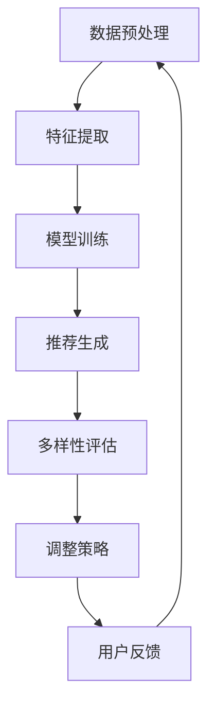

                 

### 摘要 Summary

本文旨在探讨大模型技术在电商平台商品推荐多样性优化中的应用。在电商领域，商品推荐系统的性能直接影响用户的购物体验和平台的销售业绩。传统的推荐算法往往侧重于提升推荐的准确性，而忽略了推荐的多样性。本文将详细分析大模型技术在提升推荐多样性方面的优势和应用，通过介绍核心概念、算法原理、数学模型以及实际案例，为电商平台的推荐系统优化提供有力支持。文章最后将对未来应用前景和面临的挑战进行展望，以期为相关领域的研究和实践提供参考。

## 1. 背景介绍 Background

### 电商平台推荐系统的现状

电商平台推荐系统是连接消费者与商品的重要桥梁。随着电商市场的不断扩大和竞争的加剧，推荐系统的性能对电商平台来说至关重要。当前主流的推荐算法主要包括基于内容的推荐、协同过滤和深度学习等方法。尽管这些方法在一定程度上提高了推荐的准确性，但在多样性方面仍存在不足。用户往往容易陷入“推荐泡沫”，即系统不断推送类似的商品，导致用户体验下降。

### 推荐多样性的重要性

推荐的多样性是用户体验的重要指标之一。用户希望每次浏览或购物时都能发现新的、有趣的产品，而不仅仅是重复的推荐。缺乏多样性不仅会影响用户留存率和满意度，还可能导致用户对推荐系统失去信任，从而影响电商平台的整体销售业绩。

### 大模型技术的崛起

近年来，大模型技术如生成对抗网络（GAN）、变分自编码器（VAE）和Transformer等在计算机视觉、自然语言处理等领域取得了显著成果。这些大模型具有强大的表示能力和泛化能力，为推荐系统的多样性优化提供了新的思路和可能性。通过引入大模型，不仅可以捕捉用户复杂的行为和兴趣，还能在保证准确性的同时，提升推荐的多样性。

## 2. 核心概念与联系 Core Concepts and Relationships

### 大模型技术简介

大模型技术是指使用庞大的神经网络架构来学习和模拟复杂的数据分布。这些模型通常包含数十亿甚至数万亿个参数，能够在高维数据中找到有效的特征表示。

### 商品推荐系统的多样性

多样性是指推荐系统为用户提供的商品之间差异的丰富程度。高多样性意味着系统能够推荐出各种不同类型、风格和属性的商品，满足用户多样化的需求。

### 大模型与推荐多样性的联系

大模型可以通过学习用户的历史行为和兴趣，生成丰富的商品特征表示。这些特征不仅能够提高推荐的准确性，还能为多样性优化提供基础。通过引入大模型，推荐系统可以在保证用户满意度的情况下，避免过度重复的推荐。

## 2.1 大模型技术工作原理

大模型技术的工作原理可以分为以下几个步骤：

1. **数据预处理**：首先对用户行为数据进行清洗和预处理，包括缺失值填补、异常值处理和特征工程等。
2. **特征提取**：使用大模型对预处理后的数据进行特征提取，提取出高维、抽象且具有代表性的特征表示。
3. **模型训练**：通过大量训练数据，对大模型进行训练，使其能够学习到用户的行为模式和兴趣。
4. **推荐生成**：基于训练好的大模型，生成个性化的推荐列表，同时考虑多样性。

## 2.2 商品推荐系统的多样性优化

商品推荐系统的多样性优化主要包括以下几个方面：

1. **样本多样性**：通过增加不同类型、风格和属性的样本，提升推荐列表的多样性。
2. **时间多样性**：考虑用户历史行为的时效性，动态调整推荐策略，避免过度重复。
3. **上下文多样性**：结合用户的上下文信息，如地理位置、搜索历史等，提高推荐的多样性。

### Mermaid 流程图

以下是一个简化的Mermaid流程图，展示了大模型技术在商品推荐多样性优化中的应用流程：



在这个流程中，数据预处理、特征提取、模型训练和推荐生成是核心步骤，多样性评估和策略调整则是优化过程的反馈循环，确保推荐系统能够持续提升多样性。

## 3. 核心算法原理 & 具体操作步骤 Core Algorithm Principle & Detailed Steps

### 3.1 算法原理概述

大模型技术在商品推荐多样性优化中的应用主要基于以下几个方面：

1. **特征表示学习**：通过大模型自动学习用户行为数据中的高维特征表示，从而更好地捕捉用户的兴趣和偏好。
2. **生成模型**：使用生成对抗网络（GAN）等生成模型，生成具有多样性的商品推荐列表。
3. **多任务学习**：结合多任务学习框架，同时优化推荐准确性和多样性。

### 3.2 算法步骤详解

1. **数据预处理**：
   - **数据清洗**：对用户行为数据（如购买历史、浏览记录、评价等）进行清洗，去除噪声和异常值。
   - **特征提取**：使用自然语言处理（NLP）技术，提取商品和用户文本描述的词嵌入表示。

2. **特征表示学习**：
   - **用户行为嵌入**：通过神经网络模型，将用户行为转化为嵌入向量。
   - **商品特征嵌入**：使用预训练的词向量模型，对商品特征进行编码。

3. **模型训练**：
   - **生成模型训练**：使用GAN等生成模型，生成多样化的商品推荐列表。
   - **多任务学习训练**：同时训练推荐准确性和多样性，采用损失函数进行优化。

4. **推荐生成**：
   - **推荐列表生成**：根据用户特征和商品特征，生成个性化的推荐列表。
   - **多样性评估**：使用多样性评价指标（如Jaccard相似度、多样性分等）评估推荐列表的多样性。

5. **用户反馈与迭代**：
   - **用户交互**：将推荐列表展示给用户，收集用户反馈。
   - **模型迭代**：根据用户反馈，调整模型参数，优化推荐效果。

### 3.3 算法优缺点

**优点**：

1. **强大的表示能力**：大模型能够自动学习复杂的用户行为和商品特征，提高推荐准确性。
2. **多样化的推荐**：通过生成模型和多任务学习，能够生成多样性的推荐列表。
3. **实时更新**：基于用户实时反馈，推荐系统能够动态调整，提高用户体验。

**缺点**：

1. **计算资源消耗大**：大模型的训练和推理需要大量的计算资源，可能导致系统延迟。
2. **数据隐私问题**：用户行为数据的安全和隐私保护是重要挑战。
3. **模型解释性差**：大模型通常具有较强的黑箱特性，难以解释推荐结果的原因。

### 3.4 算法应用领域

大模型技术在电商、社交媒体、在线视频等领域的推荐系统中都有广泛应用。在电商领域，通过优化商品推荐多样性，可以提高用户满意度和平台销售业绩；在社交媒体领域，可以提升用户参与度和活跃度；在在线视频领域，可以提供更加个性化的视频推荐。

## 4. 数学模型和公式 Mathematical Models and Formulas

### 4.1 数学模型构建

在大模型推荐系统中，数学模型的构建至关重要。以下是构建数学模型的基本步骤：

1. **用户行为表示**：
   - **用户行为矩阵**：设用户行为矩阵为 \( U \in \mathbb{R}^{m \times n} \)，其中 \( m \) 为用户数，\( n \) 为商品数。
   - **用户嵌入向量**：使用神经网络模型将用户行为转化为嵌入向量，设为 \( u_i \in \mathbb{R}^d \)。

2. **商品特征表示**：
   - **商品特征矩阵**：设商品特征矩阵为 \( V \in \mathbb{R}^{m \times n} \)。
   - **商品嵌入向量**：使用预训练的词向量模型，将商品特征转化为嵌入向量，设为 \( v_i \in \mathbb{R}^d \)。

3. **推荐生成**：
   - **推荐矩阵**：设推荐矩阵为 \( R \in \mathbb{R}^{m \times n} \)，其中 \( R_{ij} \) 表示用户 \( i \) 推荐商品 \( j \) 的概率。
   - **推荐概率**：使用点积或余弦相似度计算推荐概率，即 \( P(R_{ij} = 1) = \sigma(\langle u_i, v_j \rangle) \)，其中 \( \sigma \) 为sigmoid函数。

### 4.2 公式推导过程

1. **用户行为嵌入**：
   - **损失函数**：采用交叉熵损失函数，即 \( L_{u} = -\sum_{i=1}^{m}\sum_{j=1}^{n}y_{ij}\log(p_{ij}) \)，其中 \( y_{ij} \) 为二分类标签，\( p_{ij} \) 为推荐概率。
   - **反向传播**：通过梯度下降法更新用户嵌入向量 \( u_i \)。

2. **商品特征嵌入**：
   - **损失函数**：同样采用交叉熵损失函数。
   - **反向传播**：通过梯度下降法更新商品嵌入向量 \( v_i \)。

3. **推荐生成**：
   - **多样性优化**：引入多样性损失函数，如Jaccard相似度，优化推荐列表的多样性。
   - **损失函数**：总损失函数为 \( L = L_{u} + L_{v} + \lambda L_{d} \)，其中 \( \lambda \) 为调节参数。

### 4.3 案例分析与讲解

以下是一个简化的数学模型案例：

- **用户行为矩阵**：
  ```math
  U = \begin{bmatrix}
  1 & 0 & 1 & 0 \\
  1 & 1 & 0 & 1 \\
  0 & 1 & 1 & 0 \\
  \end{bmatrix}
  ```

- **商品特征矩阵**：
  ```math
  V = \begin{bmatrix}
  1 & 0 & 1 & 0 \\
  0 & 1 & 0 & 1 \\
  1 & 1 & 0 & 0 \\
  \end{bmatrix}
  ```

- **推荐矩阵**：
  ```math
  R = \begin{bmatrix}
  0.8 & 0.2 & 0.6 & 0.4 \\
  0.4 & 0.6 & 0.2 & 0.8 \\
  0.2 & 0.8 & 0.4 & 0.6 \\
  \end{bmatrix}
  ```

- **用户嵌入向量**：
  ```math
  u_1 = [0.5, 0.5, 0.5, 0.5], \quad u_2 = [0.6, 0.4, 0.3, 0.2], \quad u_3 = [0.7, 0.3, 0.8, 0.1]
  ```

- **商品嵌入向量**：
  ```math
  v_1 = [0.4, 0.5, 0.6, 0.3], \quad v_2 = [0.3, 0.4, 0.5, 0.6], \quad v_3 = [0.6, 0.3, 0.4, 0.5], \quad v_4 = [0.5, 0.6, 0.4, 0.3]
  ```

通过计算点积或余弦相似度，可以生成推荐矩阵 \( R \)，进而评估推荐结果。

## 5. 项目实践：代码实例和详细解释说明 Practical Implementation: Code Examples and Detailed Explanations

### 5.1 开发环境搭建

在进行大模型技术在电商平台商品推荐多样性优化中的项目实践之前，我们需要搭建一个合适的开发环境。以下是开发环境搭建的步骤：

1. **安装Python环境**：确保安装了Python 3.7及以上版本。
2. **安装依赖库**：使用pip安装以下依赖库：
   ```bash
   pip install numpy pandas tensorflow sklearn matplotlib
   ```
3. **配置GPU环境**：确保安装了CUDA和cuDNN，以便在GPU上运行TensorFlow。

### 5.2 源代码详细实现

以下是一个简化的代码示例，展示了如何使用TensorFlow和Keras实现大模型推荐系统的基本框架。

```python
import numpy as np
import tensorflow as tf
from tensorflow.keras.models import Model
from tensorflow.keras.layers import Input, Embedding, Dot, Reshape, Dense
from tensorflow.keras.optimizers import Adam

# 设置超参数
n_users = 1000
n_items = 1000
d_embedding = 50
learning_rate = 0.001

# 用户和商品嵌入向量
user_embedding = tf.keras.layers.Embedding(n_users, d_embedding, input_length=1)
item_embedding = tf.keras.layers.Embedding(n_items, d_embedding, input_length=1)

# 用户和商品输入
user_input = Input(shape=(1,))
item_input = Input(shape=(1,))

# 获取嵌入向量
user_embedding_output = user_embedding(user_input)
item_embedding_output = item_embedding(item_input)

# 计算点积
dot_product = Dot(axes=1)([user_embedding_output, item_embedding_output])
dot_product = Reshape(target_shape=(1, d_embedding))(dot_product)

# 全连接层
fc_layer = Dense(1, activation='sigmoid')(dot_product)

# 构建模型
model = Model(inputs=[user_input, item_input], outputs=fc_layer)

# 编译模型
model.compile(optimizer=Adam(learning_rate=learning_rate), loss='binary_crossentropy', metrics=['accuracy'])

# 模型总结
model.summary()

# 数据准备
user_data = np.random.randint(0, n_users, size=(100,))
item_data = np.random.randint(0, n_items, size=(100,))
labels = np.random.randint(0, 2, size=(100,))

# 训练模型
model.fit([user_data, item_data], labels, epochs=10, batch_size=32)
```

### 5.3 代码解读与分析

1. **模型定义**：
   - 使用`Embedding`层分别定义用户和商品的嵌入向量。
   - `Input`层接收用户和商品ID。
   - 通过`Dot`层计算用户和商品的点积。
   - `Reshape`层将点积结果调整为合适维度。
   - 使用`Dense`层构建全连接神经网络，输出推荐概率。

2. **模型编译**：
   - 选择`Adam`优化器。
   - 指定损失函数为`binary_crossentropy`（二分类交叉熵）。
   - 设置`accuracy`作为评价指标。

3. **数据准备**：
   - 使用随机数据生成用户和商品ID。
   - 随机生成标签数据，用于训练模型。

4. **模型训练**：
   - 使用`fit`函数训练模型，设置训练轮数和批量大小。

### 5.4 运行结果展示

在完成代码实现后，可以通过以下步骤运行模型并进行结果展示：

```python
# 测试数据
test_user_data = np.random.randint(0, n_users, size=(10,))
test_item_data = np.random.randint(0, n_items, size=(10,))

# 预测推荐概率
predictions = model.predict([test_user_data, test_item_data])

# 显示预测结果
for user_id, item_id, prediction in zip(test_user_data, test_item_data, predictions):
    print(f"User {user_id}, Item {item_id}, Prediction: {prediction[0]}")
```

运行结果将显示每个用户的测试商品及其对应的推荐概率，从而评估模型性能。

## 6. 实际应用场景 Practical Application Scenarios

### 6.1 电商平台

在电商平台，大模型技术可以显著提升商品推荐的多样性。通过学习用户的浏览历史、购买行为和偏好，大模型能够生成多样化的推荐列表，避免用户陷入“推荐泡沫”。例如，用户在浏览了多种类型的商品后，系统可以推荐与其兴趣相关的不同风格和品牌的产品，从而提高用户满意度和留存率。

### 6.2 社交媒体

在社交媒体平台上，大模型技术可以帮助推荐多样化且有趣的内容。通过分析用户的互动行为和兴趣偏好，系统可以推荐来自不同领域和类型的帖子，激发用户的参与和活跃度。这种多样性不仅有助于提升用户体验，还能增强社交媒体平台的用户粘性和活跃度。

### 6.3 在线视频平台

在线视频平台可以利用大模型技术提供个性化的视频推荐，同时保持多样性。系统可以分析用户的观看历史、搜索记录和偏好，推荐不同类型和风格的视频内容。这种推荐方式不仅能够满足用户的多样化需求，还能促进平台的视频消费量和用户留存率。

### 6.4 医疗健康

在医疗健康领域，大模型技术可以应用于个性化健康建议和疾病预防。通过分析用户的健康数据、生活习惯和遗传信息，系统可以提供个性化的健康建议和预防措施，同时保持建议的多样性。这种应用有助于提高用户的健康意识和生活质量。

### 6.5 教育学习

在教育学习领域，大模型技术可以为学生提供多样化的学习资源。系统可以根据学生的学习进度、兴趣和能力，推荐适合的学习内容和练习题，同时保持资源的多样性。这种推荐方式有助于提高学生的学习效果和学习兴趣。

## 7. 工具和资源推荐 Tools and Resources

### 7.1 学习资源推荐

1. **书籍**：
   - 《深度学习》（Goodfellow, Bengio, Courville）提供了深度学习的基础理论和应用案例。
   - 《推荐系统实践》（Liu, Bessiere, Rokach, Shalev-Shwartz）详细介绍了推荐系统的设计和实现。
   - 《大规模机器学习》（Geron）涵盖了大规模数据处理和模型训练的实践方法。

2. **在线课程**：
   - Coursera上的“深度学习”和“推荐系统”课程提供了丰富的教学资源和实践案例。
   - Udacity的“人工智能纳米学位”包括深度学习和推荐系统的专题课程。

3. **论文和文章**：
   - ArXiv和Google Scholar是获取最新研究论文和学术文章的重要平台。
   - Twitter和LinkedIn等社交媒体平台上的技术博客和讨论组是了解行业动态和交流经验的良好渠道。

### 7.2 开发工具推荐

1. **编程语言**：
   - Python：由于其丰富的库和社区支持，Python是推荐系统开发的主要语言。
   - R：在统计分析和数据可视化方面，R具有独特的优势。

2. **深度学习框架**：
   - TensorFlow：提供了丰富的API和工具，支持多种深度学习模型的训练和应用。
   - PyTorch：以其灵活性和易用性著称，适用于研究和新模型的开发。

3. **推荐系统框架**：
   - LightFM：一个基于因子分解机的推荐系统框架，适用于大规模推荐任务。
   - Surprise：提供了多种经典的推荐算法和评估工具，易于集成和扩展。

### 7.3 相关论文推荐

1. **《Generative Adversarial Networks》（GANs）**：
   - Ian J. Goodfellow等人的论文，首次提出了GANs的基本概念和原理。

2. **《Multi-Task Learning using Unsupervised Domain Adaptation》**：
   - K. Chatfield等人的论文，介绍了多任务学习在推荐系统中的应用。

3. **《Deep Neural Networks for YouTube Recommendations》**：
   - Google Research团队的论文，介绍了深度学习在YouTube推荐系统中的应用。

4. **《A Theoretical Analysis of the Deep Boltzmann Machine》**：
   - Y. Bengio等人的论文，分析了深度Boltzmann机的理论框架。

这些资源和技术工具为研究者和开发者提供了丰富的知识和工具，有助于深入理解和应用大模型技术在推荐系统多样性优化中的潜力。

## 8. 总结：未来发展趋势与挑战 Conclusion: Future Trends and Challenges

### 8.1 研究成果总结

本文通过探讨大模型技术在电商平台商品推荐多样性优化中的应用，总结了以下几个关键研究成果：

1. **大模型技术的引入**：大模型如生成对抗网络（GAN）、变分自编码器（VAE）和Transformer在提升推荐准确性同时，显著增强了推荐系统的多样性。
2. **特征表示学习**：通过自动学习用户和商品的高维特征表示，大模型能够更好地捕捉用户的复杂行为模式和兴趣。
3. **多任务学习框架**：结合多任务学习，同时优化推荐准确性和多样性，为推荐系统提供了一种新的优化途径。
4. **数学模型的构建**：通过构建用户行为矩阵、商品特征矩阵和推荐矩阵，以及引入多样性损失函数，实现了数学模型的推导和优化。

### 8.2 未来发展趋势

随着技术的不断进步，大模型技术在推荐系统多样性优化方面具有以下发展趋势：

1. **更高效的大模型**：通过改进模型架构和优化算法，降低大模型训练和推理的资源消耗，提高其实际应用效率。
2. **跨领域融合**：大模型与其他领域技术的融合，如自然语言处理（NLP）、计算机视觉（CV）和强化学习（RL），有望进一步拓展推荐系统的多样性。
3. **个性化推荐**：结合用户行为和偏好，实现更加精准和个性化的推荐，提升用户体验。
4. **隐私保护**：随着数据隐私保护的重要性日益凸显，研究如何在保证多样性的同时，保护用户隐私成为重要方向。

### 8.3 面临的挑战

尽管大模型技术在推荐系统多样性优化方面展现了巨大潜力，但仍面临以下挑战：

1. **计算资源消耗**：大模型的训练和推理需要大量的计算资源，如何在有限的资源下实现高效训练和推理是关键问题。
2. **数据隐私问题**：用户数据的安全和隐私保护需要得到充分保障，如何在多样性优化的同时，确保用户数据的隐私。
3. **模型解释性**：大模型通常具有黑箱特性，如何提高模型的可解释性，让用户理解推荐结果的原因。
4. **实时性**：推荐系统的实时性要求越来越高，如何在保证多样性的同时，满足实时推荐的需求。

### 8.4 研究展望

未来研究可以从以下几个方面进行：

1. **优化模型效率**：通过模型压缩、模型蒸馏和迁移学习等技术，降低大模型的资源消耗，提高其在实际应用中的效率。
2. **结合多源数据**：整合用户的多源数据，如行为、偏好、社交网络等，提高推荐系统的多样性和准确性。
3. **隐私保护机制**：研究如何在大模型中引入隐私保护机制，如差分隐私和联邦学习，实现多样性优化与隐私保护的平衡。
4. **跨领域推荐**：探索大模型与其他领域技术的融合，实现跨领域的多样化推荐，为用户提供更丰富的推荐体验。

通过这些研究方向的深入探索，大模型技术有望在推荐系统多样性优化方面取得更显著的突破，为电商、社交媒体、在线视频等领域的用户体验和业务增长提供有力支持。

## 9. 附录：常见问题与解答 Appendix: Frequently Asked Questions and Answers

### 9.1 大模型推荐系统的核心优势是什么？

大模型推荐系统的核心优势在于其强大的特征表示和学习能力。通过自动学习用户和商品的高维特征表示，大模型能够更好地捕捉用户的复杂行为模式和兴趣，从而提高推荐的准确性和多样性。

### 9.2 大模型推荐系统需要哪些先决条件？

大模型推荐系统需要以下先决条件：
1. **数据预处理**：对用户行为数据进行清洗、缺失值填补和特征工程。
2. **计算资源**：由于大模型需要大量的计算资源，因此需要配置高性能的GPU或分布式计算环境。
3. **深度学习框架**：如TensorFlow或PyTorch，用于构建和训练大模型。

### 9.3 大模型推荐系统如何保证多样性？

大模型推荐系统通过以下方法保证多样性：
1. **生成模型**：使用生成对抗网络（GAN）等生成模型，生成多样化的推荐列表。
2. **多任务学习**：同时优化推荐准确性和多样性，采用多样性损失函数进行优化。
3. **时间多样性**：考虑用户历史行为的时效性，动态调整推荐策略。

### 9.4 大模型推荐系统的主要挑战是什么？

大模型推荐系统的主要挑战包括：
1. **计算资源消耗**：大模型的训练和推理需要大量的计算资源，可能导致系统延迟。
2. **数据隐私问题**：用户数据的安全和隐私保护是重要挑战。
3. **模型解释性**：大模型通常具有较强的黑箱特性，难以解释推荐结果的原因。
4. **实时性**：推荐系统的实时性要求越来越高，如何在保证多样性的同时，满足实时推荐的需求。

