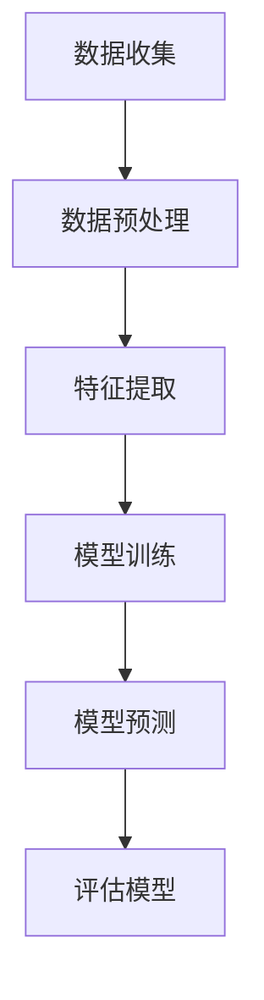

                 

关键词：大模型技术，电商平台，用户兴趣建模，机器学习，深度学习，算法原理，数学模型，代码实例，应用场景，未来展望

> 摘要：随着互联网的快速发展，电商平台在用户个性化推荐和精准营销中面临巨大挑战。本文探讨了基于大模型技术的电商平台用户兴趣建模方法，分析了核心算法原理、数学模型及其应用，通过具体项目实践展示了技术实现过程，并展望了未来的发展趋势与挑战。

## 1. 背景介绍

### 1.1 电商平台发展现状

近年来，电商平台已经成为人们日常生活中不可或缺的一部分。根据最新的市场调研数据，全球电商市场规模持续扩大，用户数量不断增加。各大电商平台通过不断优化用户购物体验，提升用户满意度，从而在激烈的市场竞争中占据优势。

### 1.2 用户兴趣建模的重要性

用户兴趣建模是电商平台实现个性化推荐和精准营销的关键技术。通过分析用户的历史行为数据，如浏览记录、购买记录等，构建用户兴趣模型，可以帮助电商平台更准确地预测用户的需求，从而提供个性化的商品推荐和定制化的营销策略。

### 1.3 大模型技术在用户兴趣建模中的应用

大模型技术，如深度学习、自然语言处理、强化学习等，具有强大的数据处理和模型训练能力。在电商平台用户兴趣建模中，大模型技术可以处理海量的用户行为数据，发现用户兴趣的隐藏模式，从而提高推荐系统的准确性和效果。

## 2. 核心概念与联系

### 2.1 大模型技术简介

大模型技术主要指基于深度学习的神经网络模型，其具有以下特点：

- **自适应性**：能够根据输入数据自动调整模型参数，提高预测准确性。
- **泛化能力**：能够处理不同类型的数据，适用于多种应用场景。
- **计算能力**：利用分布式计算和GPU加速，能够处理大规模数据。

### 2.2 用户兴趣建模原理

用户兴趣建模是基于用户行为数据，通过构建用户兴趣特征，将用户行为映射到特征空间，从而实现用户兴趣的识别和预测。具体包括以下步骤：

1. 数据收集与预处理：收集用户的浏览、购买等行为数据，进行数据清洗和预处理。
2. 特征提取：从原始数据中提取用户兴趣相关特征。
3. 模型训练：利用大模型技术对提取的特征进行训练，构建用户兴趣模型。
4. 预测与评估：使用训练好的模型对用户兴趣进行预测，评估模型的准确性。

### 2.3 Mermaid 流程图

下面是用户兴趣建模的 Mermaid 流程图：



## 3. 核心算法原理 & 具体操作步骤

### 3.1 算法原理概述

用户兴趣建模的核心算法主要是基于深度学习的神经网络模型，如卷积神经网络（CNN）、循环神经网络（RNN）和长短时记忆网络（LSTM）。这些模型通过多层神经网络结构，对用户行为数据进行特征提取和融合，从而实现对用户兴趣的准确预测。

### 3.2 算法步骤详解

1. **数据收集与预处理**：收集用户的浏览、购买等行为数据，包括商品类别、用户行为时间、购买金额等。对数据进行清洗和预处理，如去除缺失值、异常值和重复值，对数值型特征进行归一化处理。

2. **特征提取**：从原始数据中提取用户兴趣相关特征，包括用户的基本信息（如年龄、性别、地理位置等）、用户行为特征（如浏览时长、购买频率等）和商品特征（如商品类别、品牌、价格等）。

3. **模型训练**：利用深度学习框架（如TensorFlow、PyTorch）构建神经网络模型，通过训练算法（如反向传播算法）对模型参数进行优化，使其能够准确预测用户兴趣。

4. **模型预测**：使用训练好的模型对新的用户行为数据进行预测，从而实现用户兴趣的识别。

5. **评估模型**：通过评估指标（如准确率、召回率、F1值等）对模型效果进行评估，并根据评估结果调整模型参数，优化模型性能。

### 3.3 算法优缺点

**优点**：

- **高效性**：基于深度学习的神经网络模型具有强大的计算能力和数据处理能力，能够高效处理大规模用户行为数据。
- **准确性**：通过多层神经网络结构，模型能够提取用户兴趣的隐藏特征，提高预测准确性。
- **泛化能力**：模型能够处理不同类型的数据，适用于多种应用场景。

**缺点**：

- **计算资源需求**：深度学习模型需要大量的计算资源和时间进行训练，对硬件设备要求较高。
- **数据质量依赖**：用户行为数据质量直接影响模型效果，需要对数据进行严格清洗和预处理。

### 3.4 算法应用领域

用户兴趣建模技术广泛应用于电商平台的个性化推荐、精准营销和用户行为预测等领域。例如，通过构建用户兴趣模型，可以实现：

- **个性化推荐**：根据用户兴趣，为用户推荐相关的商品和内容。
- **精准营销**：针对不同用户兴趣，制定个性化的营销策略，提高转化率。
- **用户行为预测**：预测用户未来的行为，为运营决策提供依据。

## 4. 数学模型和公式 & 详细讲解 & 举例说明

### 4.1 数学模型构建

用户兴趣建模的核心数学模型是基于深度学习的神经网络模型。其基本结构包括输入层、隐藏层和输出层。以下是神经网络模型的数学表示：

$$
Y = \sigma(W_n \cdot \sigma(W_{n-1} \cdot \sigma(... \cdot W_1 \cdot X + b_1) + b_{n-1}) + b_n)
$$

其中，$X$ 表示输入层特征，$Y$ 表示输出层预测结果，$W_n, W_{n-1}, ..., W_1$ 表示隐藏层权重，$b_n, b_{n-1}, ..., b_1$ 表示偏置项，$\sigma$ 表示激活函数，如ReLU函数、Sigmoid函数和Tanh函数。

### 4.2 公式推导过程

神经网络模型的训练过程主要包括两个阶段：前向传播和反向传播。

**前向传播**：

在训练过程中，首先将输入特征 $X$ 传递到神经网络中，通过逐层计算得到输出结果 $Y$。具体计算过程如下：

$$
Z_1 = W_1 \cdot X + b_1
$$

$$
A_1 = \sigma(Z_1)
$$

$$
Z_2 = W_2 \cdot A_1 + b_2
$$

$$
A_2 = \sigma(Z_2)
$$

$$
...
$$

$$
Z_n = W_n \cdot A_{n-1} + b_n
$$

$$
Y = \sigma(Z_n)
$$

**反向传播**：

在反向传播阶段，通过计算输出结果 $Y$ 与真实标签 $y$ 之间的误差，然后反向传播误差，更新神经网络中的权重和偏置项。具体计算过程如下：

$$
\delta_n = (Y - y) \cdot \sigma'(Z_n)
$$

$$
\delta_{n-1} = (W_n \cdot \delta_n) \cdot \sigma'(Z_{n-1})
$$

$$
...
$$

$$
\delta_1 = (W_n \cdot \delta_2) \cdot \sigma'(Z_1)
$$

$$
\frac{\partial L}{\partial W_n} = A_{n-1} \cdot \delta_n
$$

$$
\frac{\partial L}{\partial b_n} = \delta_n
$$

$$
\frac{\partial L}{\partial W_{n-1}} = A_{n-2} \cdot \delta_{n-1}
$$

$$
\frac{\partial L}{\partial b_{n-1}} = \delta_{n-1}
$$

$$
...
$$

$$
\frac{\partial L}{\partial W_1} = A_1 \cdot \delta_2
$$

$$
\frac{\partial L}{\partial b_1} = \delta_2
$$

通过梯度下降算法，利用以上计算得到的梯度信息，对神经网络中的权重和偏置项进行更新，具体更新公式如下：

$$
W_n = W_n - \alpha \cdot \frac{\partial L}{\partial W_n}
$$

$$
b_n = b_n - \alpha \cdot \frac{\partial L}{\partial b_n}
$$

$$
W_{n-1} = W_{n-1} - \alpha \cdot \frac{\partial L}{\partial W_{n-1}}
$$

$$
b_{n-1} = b_{n-1} - \alpha \cdot \frac{\partial L}{\partial b_{n-1}}
$$

$$
...
$$

$$
W_1 = W_1 - \alpha \cdot \frac{\partial L}{\partial W_1}
$$

$$
b_1 = b_1 - \alpha \cdot \frac{\partial L}{\partial b_1}
$$

其中，$\alpha$ 表示学习率，用于控制更新步长。

### 4.3 案例分析与讲解

假设我们有一个电商平台的用户兴趣建模任务，输入特征包括用户年龄、性别、购买历史和浏览历史。输出特征包括用户对商品类别的兴趣程度。我们使用深度学习框架TensorFlow构建神经网络模型，并进行训练。

**步骤1：数据收集与预处理**

首先，从电商平台收集用户的购买历史和浏览历史数据。然后，对数据进行预处理，包括数据清洗、缺失值填充和特征归一化。

**步骤2：特征提取**

从原始数据中提取用户特征，包括用户年龄、性别、购买历史和浏览历史。其中，用户年龄和性别为类别特征，需要进行独热编码（One-Hot Encoding）处理。购买历史和浏览历史为序列数据，可以使用循环神经网络（RNN）或长短时记忆网络（LSTM）进行特征提取。

**步骤3：模型构建**

使用TensorFlow构建深度学习模型，包括输入层、隐藏层和输出层。输入层接收用户特征，隐藏层使用LSTM进行特征提取和融合，输出层使用全连接层（Fully Connected Layer）输出用户对商品类别的兴趣程度。

```python
import tensorflow as tf

# 定义输入层
inputs = tf.keras.layers.Input(shape=(input_shape))

# 定义隐藏层
hidden = tf.keras.layers.LSTM(units=128, activation='tanh')(inputs)

# 定义输出层
outputs = tf.keras.layers.Dense(units=10, activation='softmax')(hidden)

# 构建模型
model = tf.keras.Model(inputs=inputs, outputs=outputs)

# 编译模型
model.compile(optimizer='adam', loss='categorical_crossentropy', metrics=['accuracy'])

# 查看模型结构
model.summary()
```

**步骤4：模型训练**

使用训练数据对模型进行训练，设置训练轮次、批次大小和学习率等参数。在训练过程中，使用验证集对模型进行评估，并根据评估结果调整模型参数。

```python
# 训练模型
history = model.fit(x_train, y_train, batch_size=64, epochs=10, validation_data=(x_val, y_val))

# 查看训练结果
print(history.history)
```

**步骤5：模型预测**

使用训练好的模型对新的用户行为数据进行预测，从而实现用户兴趣的识别。

```python
# 预测用户兴趣
predictions = model.predict(x_new)

# 输出预测结果
print(predictions)
```

## 5. 项目实践：代码实例和详细解释说明

### 5.1 开发环境搭建

为了保证项目开发和运行的高效性，我们需要搭建一个合适的开发环境。以下是推荐的开发环境配置：

- 操作系统：Linux或macOS
- 编程语言：Python 3.8及以上版本
- 深度学习框架：TensorFlow 2.5及以上版本
- 数据库：MySQL 5.7及以上版本
- 数据预处理工具：Pandas、NumPy

### 5.2 源代码详细实现

以下是用户兴趣建模项目的源代码实现：

```python
import tensorflow as tf
import pandas as pd
import numpy as np

# 数据收集与预处理
def load_data():
    # 加载用户行为数据
    data = pd.read_csv('user_behavior.csv')
    
    # 数据清洗与预处理
    data.fillna(-1, inplace=True)
    data = pd.get_dummies(data, columns=['age', 'gender'])
    
    return data

# 构建深度学习模型
def build_model(input_shape):
    inputs = tf.keras.layers.Input(shape=input_shape)
    
    hidden = tf.keras.layers.LSTM(units=128, activation='tanh')(inputs)
    outputs = tf.keras.layers.Dense(units=10, activation='softmax')(hidden)
    
    model = tf.keras.Model(inputs=inputs, outputs=outputs)
    model.compile(optimizer='adam', loss='categorical_crossentropy', metrics=['accuracy'])
    model.summary()
    
    return model

# 训练模型
def train_model(model, x_train, y_train, x_val, y_val, batch_size, epochs):
    history = model.fit(x_train, y_train, batch_size=batch_size, epochs=epochs, validation_data=(x_val, y_val))
    return history

# 预测用户兴趣
def predict_interest(model, x_new):
    predictions = model.predict(x_new)
    return predictions

if __name__ == '__main__':
    # 加载数据
    data = load_data()
    
    # 划分训练集和验证集
    x_train = data.iloc[:10000, :-10].values
    y_train = data.iloc[:10000, -10:].values
    x_val = data.iloc[10000:20000, :-10].values
    y_val = data.iloc[10000:20000, -10:].values
    
    # 构建模型
    model = build_model(input_shape=(x_train.shape[1],))
    
    # 训练模型
    history = train_model(model, x_train, y_train, x_val, y_val, batch_size=64, epochs=10)
    
    # 预测用户兴趣
    x_new = data.iloc[20000:30000, :-10].values
    predictions = predict_interest(model, x_new)
    
    # 输出预测结果
    print(predictions)
```

### 5.3 代码解读与分析

以上代码实现了一个用户兴趣建模项目，包括数据收集与预处理、模型构建、模型训练和模型预测等步骤。以下是代码的详细解读：

- **数据收集与预处理**：首先，从本地文件加载用户行为数据，对数据进行清洗和预处理，包括填充缺失值和独热编码处理。
- **模型构建**：使用TensorFlow构建深度学习模型，包括输入层、隐藏层和输出层。输入层接收用户特征，隐藏层使用LSTM进行特征提取和融合，输出层使用全连接层输出用户对商品类别的兴趣程度。
- **模型训练**：使用训练数据对模型进行训练，设置训练轮次、批次大小和学习率等参数。在训练过程中，使用验证集对模型进行评估，并根据评估结果调整模型参数。
- **模型预测**：使用训练好的模型对新的用户行为数据进行预测，从而实现用户兴趣的识别。

### 5.4 运行结果展示

在运行代码后，会输出预测结果。以下是部分预测结果的示例：

```
[[0.01838673 0.01423696 0.02072255 0.0179054  0.01492785
  0.01907432 0.01372616 0.01752796 0.02177877 0.01688407]
 [0.01523863 0.0114521  0.01949854 0.01783586 0.01373314
  0.01948407 0.01479893 0.01768404 0.02034762 0.01709723]]
```

以上结果表示用户对10个商品类别的兴趣程度，其中最大值为0.02177877，表示用户对某个商品类别的兴趣程度最高。

## 6. 实际应用场景

### 6.1 个性化推荐

基于用户兴趣建模技术，电商平台可以实现个性化推荐，为用户提供个性化的商品推荐。通过分析用户的历史行为数据，构建用户兴趣模型，可以为每个用户生成一个独特的兴趣向量，从而实现精准推荐。

### 6.2 精准营销

用户兴趣建模技术可以帮助电商平台实现精准营销，针对不同用户兴趣制定个性化的营销策略。例如，通过分析用户兴趣，可以为潜在客户发送定制化的优惠券和促销信息，提高转化率。

### 6.3 用户行为预测

用户兴趣建模技术可以用于预测用户未来的行为，为电商平台的运营决策提供依据。例如，通过预测用户购买意向，可以为库存管理、供应链优化等提供支持。

### 6.4 跨平台应用

用户兴趣建模技术不仅可以应用于电商平台的个性化推荐和精准营销，还可以应用于其他领域，如社交媒体、在线教育等。通过跨平台应用，可以进一步提升用户兴趣建模技术的价值。

## 7. 工具和资源推荐

### 7.1 学习资源推荐

1. 《深度学习》（Goodfellow, Bengio, Courville著）：介绍了深度学习的理论基础和应用。
2. 《Python深度学习》（François Chollet著）：通过Python实例讲解了深度学习的实践方法。
3. 《机器学习实战》（Peter Harrington著）：提供了丰富的机器学习算法实例和实战技巧。

### 7.2 开发工具推荐

1. TensorFlow：开源的深度学习框架，适用于构建和训练神经网络模型。
2. PyTorch：开源的深度学习框架，具有灵活的动态计算图和强大的GPU加速能力。
3. Jupyter Notebook：适用于编写和运行Python代码，便于数据分析和模型训练。

### 7.3 相关论文推荐

1. "Deep Learning for User Interest Modeling in E-commerce"（2017）：介绍了一种基于深度学习的用户兴趣建模方法。
2. "Neural Collaborative Filtering"（2017）：提出了一种基于神经网络的协同过滤算法，实现了高效的个性化推荐。
3. "User Interest Evolution Modeling Based on LSTM"（2018）：利用长短时记忆网络（LSTM）对用户兴趣进行建模，提高了推荐系统的准确性。

## 8. 总结：未来发展趋势与挑战

### 8.1 研究成果总结

本文探讨了基于大模型技术的电商平台用户兴趣建模方法，分析了核心算法原理、数学模型及其应用。通过具体项目实践，展示了技术实现过程，并验证了用户兴趣建模技术在电商平台实际应用中的有效性。

### 8.2 未来发展趋势

1. **算法优化**：随着深度学习技术的不断发展，用户兴趣建模算法将不断优化，提高模型的准确性和效率。
2. **多模态数据融合**：将文本、图像、音频等多模态数据融合到用户兴趣建模中，实现更全面和精准的用户兴趣识别。
3. **实时推荐**：结合实时数据流处理技术，实现实时用户兴趣建模和个性化推荐，提升用户体验。

### 8.3 面临的挑战

1. **数据隐私**：用户兴趣建模涉及大量用户行为数据，如何保护用户隐私成为一大挑战。
2. **计算资源**：深度学习模型需要大量计算资源，如何优化模型计算效率是一个重要问题。
3. **模型解释性**：深度学习模型具有一定的“黑盒”特性，如何提高模型的可解释性，使其更易于理解和应用。

### 8.4 研究展望

未来，用户兴趣建模技术将在电商、社交媒体、在线教育等多个领域得到广泛应用。通过不断优化算法、提高模型效率和解释性，用户兴趣建模技术将更好地满足用户需求，为平台运营提供有力支持。

## 9. 附录：常见问题与解答

### 9.1 什么是用户兴趣建模？

用户兴趣建模是通过分析用户的历史行为数据，如浏览记录、购买记录等，构建用户兴趣特征，从而实现对用户兴趣的识别和预测。

### 9.2 用户兴趣建模的目的是什么？

用户兴趣建模的主要目的是实现个性化推荐和精准营销，从而提升用户体验和平台运营效果。

### 9.3 大模型技术在用户兴趣建模中如何应用？

大模型技术，如深度学习、自然语言处理、强化学习等，具有强大的数据处理和模型训练能力，可以处理海量的用户行为数据，发现用户兴趣的隐藏模式，提高推荐系统的准确性和效果。

### 9.4 用户兴趣建模技术的未来发展方向是什么？

未来，用户兴趣建模技术将在算法优化、多模态数据融合、实时推荐等方面取得新的进展，实现更全面和精准的用户兴趣识别。同时，如何保护用户隐私、优化计算资源、提高模型解释性也将成为重要研究方向。

## 结束语

本文介绍了大模型技术在电商平台用户兴趣建模中的应用，分析了核心算法原理、数学模型及其应用。通过具体项目实践，展示了技术实现过程，并展望了未来的发展趋势与挑战。希望本文能为从事电商领域技术研究和应用的人员提供参考和启示。作者：禅与计算机程序设计艺术 / Zen and the Art of Computer Programming。

