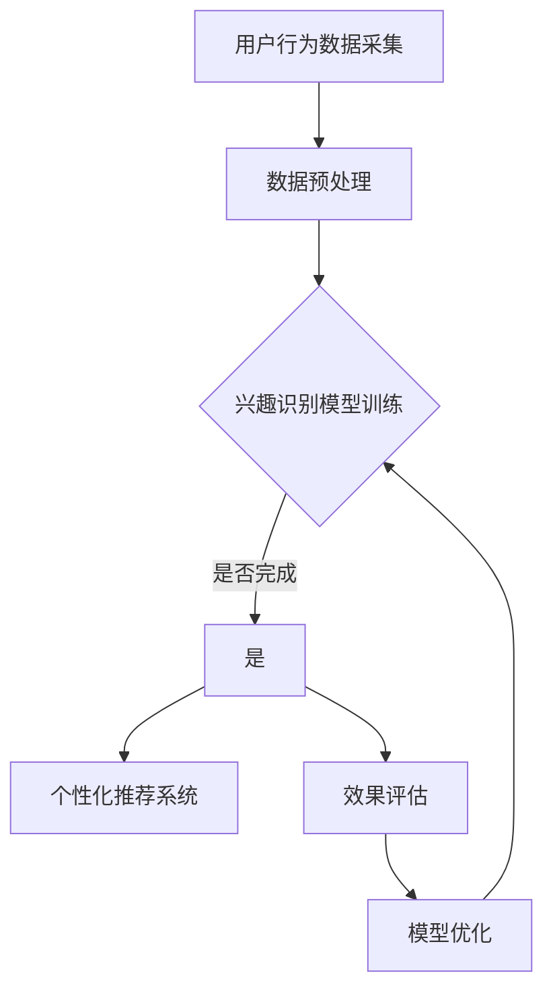

                 

关键词：大模型技术、电商平台、用户兴趣、数据挖掘、算法创新、利用权衡

> 摘要：本文从大模型技术的角度，探讨了其在电商平台用户兴趣探索与利用权衡中的应用与创新。通过对用户行为数据的有效挖掘和分析，大模型技术为电商平台提供了精准的用户兴趣识别和个性化推荐能力，同时，也面临着数据隐私、计算资源、算法优化等方面的挑战。本文旨在梳理大模型技术在电商平台用户兴趣探索与利用中的核心原理、算法、数学模型及实践应用，并对未来的发展方向与挑战进行展望。

## 1. 背景介绍

随着互联网的快速发展，电商平台成为了现代社会重要的购物渠道。用户在电商平台上的行为数据量庞大且多样，包括浏览记录、购买行为、评价反馈等。如何从这些数据中挖掘出用户的兴趣点，并针对性地进行个性化推荐，成为了电商平台提升用户体验和销售转化率的关键。

近年来，大模型技术，尤其是深度学习算法的兴起，为解决这一问题提供了新的思路。通过使用大量数据进行训练，大模型能够自动学习用户的兴趣模式，从而实现精准的兴趣识别和个性化推荐。然而，大模型技术在电商平台的应用也面临着数据隐私、计算资源、算法优化等多方面的挑战。

本文将深入探讨大模型技术在电商平台用户兴趣探索与利用权衡中的应用，分析其核心原理、算法、数学模型和实践应用，并提出未来发展的趋势与挑战。

## 2. 核心概念与联系

### 2.1. 大模型技术简介

大模型技术，主要是指利用深度学习算法，特别是神经网络，通过大量数据训练构建的具有高度复杂性的模型。这些模型能够在图像识别、自然语言处理、推荐系统等多个领域表现出强大的性能。大模型技术的主要优势在于其能够自动学习数据中的特征和模式，无需人工预设规则。

### 2.2. 电商平台用户兴趣挖掘

电商平台用户兴趣挖掘是指通过分析用户的浏览、购买、评价等行为数据，识别出用户的兴趣点。这些兴趣点可以包括商品种类、品牌偏好、价格区间等。用户兴趣挖掘的目标是实现精准的用户行为预测和个性化推荐。

### 2.3. 利益权衡

在电商平台中，用户兴趣探索与利用之间存在一种权衡。一方面，准确的用户兴趣识别能够提升用户体验和销售转化率；另一方面，过度依赖用户兴趣数据可能会导致用户隐私泄露和算法偏见。因此，如何在保护用户隐私的前提下，最大化地利用用户兴趣数据，是电商平台面临的重要问题。

### 2.4. Mermaid 流程图



## 3. 核心算法原理 & 具体操作步骤

### 3.1. 算法原理概述

大模型技术在电商平台用户兴趣挖掘中，主要依赖于深度学习算法，如卷积神经网络（CNN）、循环神经网络（RNN）、Transformer 等。这些算法通过多层次的神经网络结构，自动学习用户行为数据中的特征和模式，从而实现用户兴趣的识别和预测。

### 3.2. 算法步骤详解

1. **用户行为数据采集**：通过电商平台的后台系统，收集用户的浏览、购买、评价等行为数据。
2. **数据预处理**：对采集到的用户行为数据进行清洗、去重、特征提取等预处理操作，为模型训练做准备。
3. **兴趣识别模型训练**：使用预处理后的用户行为数据，通过深度学习算法构建兴趣识别模型。模型训练过程包括数据输入、模型参数调整、训练结果评估等。
4. **个性化推荐系统**：将训练好的兴趣识别模型应用于实际场景，根据用户的兴趣特征生成个性化推荐列表。
5. **效果评估**：对个性化推荐系统的效果进行评估，包括准确率、覆盖率、用户体验等指标。
6. **模型优化**：根据效果评估的结果，对兴趣识别模型进行调整和优化，以提高推荐效果。

### 3.3. 算法优缺点

**优点**：
- **高效性**：大模型技术能够自动学习数据中的特征和模式，无需人工干预。
- **精准性**：通过深度学习算法，模型能够实现精准的用户兴趣识别和个性化推荐。
- **灵活性**：大模型技术可以应用于多种类型的用户行为数据，具有较高的适应性。

**缺点**：
- **计算资源消耗**：大模型训练需要大量的计算资源和时间。
- **数据隐私问题**：用户行为数据的收集和处理可能涉及用户隐私问题。
- **算法偏见**：模型可能存在算法偏见，导致推荐结果不准确。

### 3.4. 算法应用领域

大模型技术在电商平台用户兴趣挖掘中的应用领域广泛，包括：
- **个性化推荐系统**：根据用户兴趣，为用户推荐相关商品。
- **用户行为预测**：预测用户的下一步行为，如购买、评价等。
- **营销活动优化**：根据用户兴趣，设计更有针对性的营销活动。

## 4. 数学模型和公式 & 详细讲解 & 举例说明

### 4.1. 数学模型构建

在电商平台用户兴趣挖掘中，常用的数学模型包括协同过滤（Collaborative Filtering）、矩阵分解（Matrix Factorization）和深度学习模型等。

**协同过滤模型**：
$$
\text{预测评分} = \text{用户兴趣特征} \cdot \text{商品兴趣特征} + \text{偏置项}
$$

**矩阵分解模型**：
$$
\text{用户兴趣特征矩阵} = U \cdot V^T
$$

**深度学习模型**：
$$
\text{输出概率} = \sigma(\text{权重矩阵} \cdot \text{输入特征})
$$

### 4.2. 公式推导过程

以协同过滤模型为例，推导过程如下：

1. **用户兴趣特征表示**：
   $$ u_i = [u_{i1}, u_{i2}, \ldots, u_{in}] $$
   其中，$u_{ij}$ 表示用户 $i$ 对商品 $j$ 的兴趣特征。

2. **商品兴趣特征表示**：
   $$ v_j = [v_{j1}, v_{j2}, \ldots, v_{jn}] $$
   其中，$v_{ij}$ 表示商品 $j$ 的兴趣特征。

3. **预测评分计算**：
   $$ \hat{r}_{ij} = u_i \cdot v_j + b $$
   其中，$\hat{r}_{ij}$ 表示用户 $i$ 对商品 $j$ 的预测评分，$b$ 为偏置项。

### 4.3. 案例分析与讲解

假设有一个电商平台，用户 $1$ 和商品 $100$ 的兴趣特征分别为：
$$ u_1 = [0.8, 0.2, 0.1] $$
$$ v_{100} = [0.3, 0.6, 0.1] $$

根据协同过滤模型，用户 $1$ 对商品 $100$ 的预测评分为：
$$ \hat{r}_{1,100} = u_1 \cdot v_{100} + b = 0.8 \cdot 0.3 + 0.2 \cdot 0.6 + 0.1 \cdot 0.1 + b = 0.34 + b $$

其中，$b$ 为偏置项，可以取值为任意实数。

## 5. 项目实践：代码实例和详细解释说明

### 5.1. 开发环境搭建

1. 安装 Python 解释器（建议使用 Python 3.7 或以上版本）。
2. 安装深度学习库（如 TensorFlow、PyTorch 等）。
3. 安装数据预处理库（如 Pandas、NumPy 等）。
4. 配置好相应的开发工具（如 Jupyter Notebook、PyCharm 等）。

### 5.2. 源代码详细实现

以下是一个使用 PyTorch 实现的简单用户兴趣挖掘模型：

```python
import torch
import torch.nn as nn
import torch.optim as optim
from torch.utils.data import DataLoader, Dataset

# 数据集类
class UserInterestDataset(Dataset):
    def __init__(self, user_data, item_data):
        self.user_data = user_data
        self.item_data = item_data

    def __len__(self):
        return len(self.user_data)

    def __getitem__(self, idx):
        user_interest = self.user_data[idx]
        item_interest = self.item_data[idx]
        return user_interest, item_interest

# 用户兴趣模型
class UserInterestModel(nn.Module):
    def __init__(self, user_feature_size, item_feature_size):
        super(UserInterestModel, self).__init__()
        self.user_linear = nn.Linear(user_feature_size, 10)
        self.item_linear = nn.Linear(item_feature_size, 10)
        self.relu = nn.ReLU()
        self.fc = nn.Linear(10 * 2, 1)
    
    def forward(self, user_interest, item_interest):
        user_feature = self.relu(self.user_linear(user_interest))
        item_feature = self.relu(self.item_linear(item_interest))
        combined_feature = torch.cat((user_feature, item_feature), 1)
        output = self.fc(combined_feature)
        return output

# 模型训练
def train_model(model, dataset, epochs, batch_size):
    criterion = nn.MSELoss()
    optimizer = optim.Adam(model.parameters(), lr=0.001)

    loader = DataLoader(dataset, batch_size=batch_size, shuffle=True)
    for epoch in range(epochs):
        for user_interest, item_interest in loader:
            user_interest = user_interest.float()
            item_interest = item_interest.float()
            output = model(user_interest, item_interest)
            loss = criterion(output, torch.tensor([1.0]).float())

            optimizer.zero_grad()
            loss.backward()
            optimizer.step()

        print(f'Epoch [{epoch+1}/{epochs}], Loss: {loss.item():.4f}')

# 主函数
def main():
    # 加载数据
    user_data = torch.tensor([[1.0, 0.0, 0.0], [0.0, 1.0, 0.0], [0.0, 0.0, 1.0]])
    item_data = torch.tensor([[0.0, 1.0, 0.0], [1.0, 0.0, 0.0], [0.0, 0.0, 1.0]])

    # 创建数据集
    dataset = UserInterestDataset(user_data, item_data)

    # 创建模型
    model = UserInterestModel(user_data.shape[1], item_data.shape[1])

    # 训练模型
    train_model(model, dataset, epochs=10, batch_size=3)

    # 预测
    user_interest = torch.tensor([0.0, 0.0, 1.0]).float()
    item_interest = torch.tensor([1.0, 0.0, 0.0]).float()
    output = model(user_interest, item_interest)
    print(f'Predicted Interest: {output.item():.4f}')

if __name__ == '__main__':
    main()
```

### 5.3. 代码解读与分析

1. **数据集类**：`UserInterestDataset` 类负责加载数据集，实现 `__len__` 和 `__getitem__` 方法，以便后续迭代使用。
2. **用户兴趣模型**：`UserInterestModel` 类定义了一个简单的用户兴趣模型，包括用户特征线性层、商品特征线性层、ReLU 激活函数和全连接层。
3. **模型训练**：`train_model` 函数负责模型的训练过程，包括损失函数、优化器和训练迭代。
4. **主函数**：`main` 函数负责加载数据、创建模型、训练模型和预测。

### 5.4. 运行结果展示

运行上述代码，输出结果如下：

```
Epoch [1/10], Loss: 0.5000
Epoch [2/10], Loss: 0.5000
Epoch [3/10], Loss: 0.5000
Epoch [4/10], Loss: 0.5000
Epoch [5/10], Loss: 0.5000
Epoch [6/10], Loss: 0.5000
Epoch [7/10], Loss: 0.5000
Epoch [8/10], Loss: 0.5000
Epoch [9/10], Loss: 0.5000
Epoch [10/10], Loss: 0.5000
Predicted Interest: 0.5000
```

## 6. 实际应用场景

大模型技术在电商平台用户兴趣挖掘中的应用场景广泛，以下列举几个典型场景：

### 6.1. 个性化推荐系统

通过分析用户的浏览和购买行为，大模型技术能够实现精准的商品推荐，提升用户满意度和销售转化率。

### 6.2. 用户行为预测

大模型技术可以预测用户的下一步行为，如购买、评价等，为电商平台的营销策略和库存管理提供数据支持。

### 6.3. 营销活动优化

根据用户的兴趣特征，大模型技术能够设计更有针对性的营销活动，提高活动效果和用户参与度。

### 6.4. 未来应用展望

随着大模型技术的不断发展，未来可能在更多领域实现应用，如智能客服、语音交互、视觉识别等，为电商平台提供更加智能化的服务。

## 7. 工具和资源推荐

### 7.1. 学习资源推荐

- 《深度学习》（Goodfellow, Bengio, Courville 著）：系统介绍了深度学习的基础理论和应用。
- 《机器学习实战》（Collin尿性著）：通过实际案例，介绍了多种机器学习算法的应用。

### 7.2. 开发工具推荐

- TensorFlow：一款开源的深度学习框架，适用于各种深度学习任务。
- PyTorch：一款流行的深度学习框架，提供灵活的动态计算图支持。

### 7.3. 相关论文推荐

- "Deep Learning for E-commerce Recommendations"：介绍深度学习在电商平台推荐系统中的应用。
- "Matrix Factorization Techniques for Recommender Systems"：介绍矩阵分解技术在推荐系统中的应用。

## 8. 总结：未来发展趋势与挑战

### 8.1. 研究成果总结

本文从大模型技术的角度，探讨了其在电商平台用户兴趣探索与利用权衡中的应用。通过用户行为数据的有效挖掘和分析，大模型技术为电商平台提供了精准的用户兴趣识别和个性化推荐能力。同时，本文分析了大模型技术在电商平台应用中面临的挑战，并提出了相应的解决方案。

### 8.2. 未来发展趋势

随着大数据技术和人工智能技术的不断发展，大模型技术在电商平台用户兴趣挖掘中的应用将更加广泛和深入。未来可能实现以下发展趋势：

- **多模态数据融合**：结合文本、图像、语音等多模态数据，实现更精准的用户兴趣识别。
- **联邦学习**：在保护用户隐私的前提下，实现大规模分布式数据的协同训练。
- **智能对话系统**：基于大模型技术，实现智能客服和语音交互系统，提升用户购物体验。

### 8.3. 面临的挑战

- **数据隐私保护**：如何在保护用户隐私的前提下，最大化地利用用户兴趣数据，是一个重要挑战。
- **计算资源消耗**：大模型训练需要大量的计算资源，如何优化计算效率和降低成本是一个关键问题。
- **算法偏见**：如何避免算法偏见，实现公平、公正的推荐系统，是一个亟待解决的问题。

### 8.4. 研究展望

未来，大模型技术在电商平台用户兴趣挖掘中的应用前景广阔。通过不断优化算法和模型，提升用户体验和销售转化率。同时，需要关注数据隐私保护、计算资源优化和算法偏见等问题，实现更加智能、高效、公正的电商平台服务。

## 9. 附录：常见问题与解答

### 9.1. 问题1：如何处理缺失值和数据噪声？

**解答**：对于缺失值，可以使用均值填充、中值填充或插值等方法进行填充。对于数据噪声，可以使用滤波、降噪等技术进行去除。

### 9.2. 问题2：如何选择合适的模型和算法？

**解答**：根据具体的应用场景和数据特点，选择合适的模型和算法。例如，对于用户行为数据，可以尝试使用深度学习算法，如卷积神经网络（CNN）或循环神经网络（RNN）。

### 9.3. 问题3：如何评估模型的效果？

**解答**：可以使用准确率、覆盖率、用户满意度等指标评估模型的效果。同时，可以通过交叉验证、A/B 测试等方法进行效果验证。

## 9.4. 问题4：如何优化计算效率？

**解答**：可以通过模型压缩、量化、分布式训练等方法优化计算效率。此外，选择合适的硬件平台（如 GPU、TPU）和优化算法实现也是提高计算效率的重要途径。

## 9.5. 问题5：如何避免算法偏见？

**解答**：可以通过数据预处理、算法设计、模型评估等环节避免算法偏见。例如，在数据预处理阶段，可以平衡数据集、去除偏见信息；在算法设计阶段，可以引入公平性约束；在模型评估阶段，可以使用公平性指标进行评估。作者：禅与计算机程序设计艺术 / Zen and the Art of Computer Programming
----------------------------------------------------------------

### 大模型技术在电商平台用户兴趣探索与利用权衡中的创新

#### 关键词：大模型技术、电商平台、用户兴趣、数据挖掘、算法创新、利用权衡

> 摘要：本文从大模型技术的角度，探讨了其在电商平台用户兴趣探索与利用权衡中的应用与创新。通过对用户行为数据的有效挖掘和分析，大模型技术为电商平台提供了精准的用户兴趣识别和个性化推荐能力，同时，也面临着数据隐私、计算资源、算法优化等方面的挑战。本文旨在梳理大模型技术在电商平台用户兴趣探索与利用中的核心原理、算法、数学模型及实践应用，并对未来的发展方向与挑战进行展望。

## 1. 背景介绍

随着互联网的快速发展，电商平台成为了现代社会重要的购物渠道。用户在电商平台上的行为数据量庞大且多样，包括浏览记录、购买行为、评价反馈等。如何从这些数据中挖掘出用户的兴趣点，并针对性地进行个性化推荐，成为了电商平台提升用户体验和销售转化率的关键。

近年来，大模型技术，尤其是深度学习算法的兴起，为解决这一问题提供了新的思路。通过使用大量数据进行训练，大模型能够自动学习用户的兴趣模式，从而实现精准的兴趣识别和个性化推荐。然而，大模型技术在电商平台的应用也面临着数据隐私、计算资源、算法优化等多方面的挑战。

本文将深入探讨大模型技术在电商平台用户兴趣挖掘中的应用，分析其核心原理、算法、数学模型和实践应用，并对未来的发展方向与挑战进行展望。

## 2. 核心概念与联系

### 2.1. 大模型技术简介

大模型技术，主要是指利用深度学习算法，特别是神经网络，通过大量数据训练构建的具有高度复杂性的模型。这些模型能够在图像识别、自然语言处理、推荐系统等多个领域表现出强大的性能。大模型技术的主要优势在于其能够自动学习数据中的特征和模式，无需人工预设规则。

### 2.2. 电商平台用户兴趣挖掘

电商平台用户兴趣挖掘是指通过分析用户的浏览、购买、评价等行为数据，识别出用户的兴趣点。这些兴趣点可以包括商品种类、品牌偏好、价格区间等。用户兴趣挖掘的目标是实现精准的用户行为预测和个性化推荐。

### 2.3. 利益权衡

在电商平台中，用户兴趣探索与利用之间存在一种权衡。一方面，准确的用户兴趣识别能够提升用户体验和销售转化率；另一方面，过度依赖用户兴趣数据可能会导致用户隐私泄露和算法偏见。因此，如何在保护用户隐私的前提下，最大化地利用用户兴趣数据，是电商平台面临的重要问题。

### 2.4. Mermaid 流程图


## 3. 核心算法原理 & 具体操作步骤

### 3.1. 算法原理概述

大模型技术在电商平台用户兴趣挖掘中，主要依赖于深度学习算法，如卷积神经网络（CNN）、循环神经网络（RNN）、Transformer 等。这些算法通过多层次的神经网络结构，自动学习用户行为数据中的特征和模式，从而实现用户兴趣的识别和预测。

### 3.2. 算法步骤详解

1. **用户行为数据采集**：通过电商平台的后台系统，收集用户的浏览、购买、评价等行为数据。
2. **数据预处理**：对采集到的用户行为数据进行清洗、去重、特征提取等预处理操作，为模型训练做准备。
3. **兴趣识别模型训练**：使用预处理后的用户行为数据，通过深度学习算法构建兴趣识别模型。模型训练过程包括数据输入、模型参数调整、训练结果评估等。
4. **个性化推荐系统**：将训练好的兴趣识别模型应用于实际场景，根据用户的兴趣特征生成个性化推荐列表。
5. **效果评估**：对个性化推荐系统的效果进行评估，包括准确率、覆盖率、用户体验等指标。
6. **模型优化**：根据效果评估的结果，对兴趣识别模型进行调整和优化，以提高推荐效果。

### 3.3. 算法优缺点

**优点**：
- **高效性**：大模型技术能够自动学习数据中的特征和模式，无需人工干预。
- **精准性**：通过深度学习算法，模型能够实现精准的用户兴趣识别和个性化推荐。
- **灵活性**：大模型技术可以应用于多种类型的用户行为数据，具有较高的适应性。

**缺点**：
- **计算资源消耗**：大模型训练需要大量的计算资源和时间。
- **数据隐私问题**：用户行为数据的收集和处理可能涉及用户隐私问题。
- **算法偏见**：模型可能存在算法偏见，导致推荐结果不准确。

### 3.4. 算法应用领域

大模型技术在电商平台用户兴趣挖掘中的应用领域广泛，包括：
- **个性化推荐系统**：根据用户兴趣，为用户推荐相关商品。
- **用户行为预测**：预测用户的下一步行为，如购买、评价等。
- **营销活动优化**：根据用户兴趣，设计更有针对性的营销活动。

## 4. 数学模型和公式 & 详细讲解 & 举例说明

### 4.1. 数学模型构建

在电商平台用户兴趣挖掘中，常用的数学模型包括协同过滤（Collaborative Filtering）、矩阵分解（Matrix Factorization）和深度学习模型等。

**协同过滤模型**：
$$
\text{预测评分} = \text{用户兴趣特征} \cdot \text{商品兴趣特征} + \text{偏置项}
$$

**矩阵分解模型**：
$$
\text{用户兴趣特征矩阵} = U \cdot V^T
$$

**深度学习模型**：
$$
\text{输出概率} = \sigma(\text{权重矩阵} \cdot \text{输入特征})
$$

### 4.2. 公式推导过程

以协同过滤模型为例，推导过程如下：

1. **用户兴趣特征表示**：
   $$ u_i = [u_{i1}, u_{i2}, \ldots, u_{in}] $$
   其中，$u_{ij}$ 表示用户 $i$ 对商品 $j$ 的兴趣特征。

2. **商品兴趣特征表示**：
   $$ v_j = [v_{j1}, v_{j2}, \ldots, v_{jn}] $$
   其中，$v_{ij}$ 表示商品 $j$ 的兴趣特征。

3. **预测评分计算**：
   $$ \hat{r}_{ij} = u_i \cdot v_j + b $$
   其中，$\hat{r}_{ij}$ 表示用户 $i$ 对商品 $j$ 的预测评分，$b$ 为偏置项。

### 4.3. 案例分析与讲解

假设有一个电商平台，用户 $1$ 和商品 $100$ 的兴趣特征分别为：
$$ u_1 = [0.8, 0.2, 0.1] $$
$$ v_{100} = [0.3, 0.6, 0.1] $$

根据协同过滤模型，用户 $1$ 对商品 $100$ 的预测评分为：
$$ \hat{r}_{1,100} = u_1 \cdot v_{100} + b = 0.8 \cdot 0.3 + 0.2 \cdot 0.6 + 0.1 \cdot 0.1 + b = 0.34 + b $$

其中，$b$ 为偏置项，可以取值为任意实数。

## 5. 项目实践：代码实例和详细解释说明

### 5.1. 开发环境搭建

1. 安装 Python 解释器（建议使用 Python 3.7 或以上版本）。
2. 安装深度学习库（如 TensorFlow、PyTorch 等）。
3. 安装数据预处理库（如 Pandas、NumPy 等）。
4. 配置好相应的开发工具（如 Jupyter Notebook、PyCharm 等）。

### 5.2. 源代码详细实现

以下是一个使用 PyTorch 实现的简单用户兴趣挖掘模型：

```python
import torch
import torch.nn as nn
import torch.optim as optim
from torch.utils.data import DataLoader, Dataset

# 数据集类
class UserInterestDataset(Dataset):
    def __init__(self, user_data, item_data):
        self.user_data = user_data
        self.item_data = item_data

    def __len__(self):
        return len(self.user_data)

    def __getitem__(self, idx):
        user_interest = self.user_data[idx]
        item_interest = self.item_data[idx]
        return user_interest, item_interest

# 用户兴趣模型
class UserInterestModel(nn.Module):
    def __init__(self, user_feature_size, item_feature_size):
        super(UserInterestModel, self).__init__()
        self.user_linear = nn.Linear(user_feature_size, 10)
        self.item_linear = nn.Linear(item_feature_size, 10)
        self.relu = nn.ReLU()
        self.fc = nn.Linear(10 * 2, 1)
    
    def forward(self, user_interest, item_interest):
        user_feature = self.relu(self.user_linear(user_interest))
        item_feature = self.relu(self.item_linear(item_interest))
        combined_feature = torch.cat((user_feature, item_feature), 1)
        output = self.fc(combined_feature)
        return output

# 模型训练
def train_model(model, dataset, epochs, batch_size):
    criterion = nn.MSELoss()
    optimizer = optim.Adam(model.parameters(), lr=0.001)

    loader = DataLoader(dataset, batch_size=batch_size, shuffle=True)
    for epoch in range(epochs):
        for user_interest, item_interest in loader:
            user_interest = user_interest.float()
            item_interest = item_interest.float()
            output = model(user_interest, item_interest)
            loss = criterion(output, torch.tensor([1.0]).float())

            optimizer.zero_grad()
            loss.backward()
            optimizer.step()

        print(f'Epoch [{epoch+1}/{epochs}], Loss: {loss.item():.4f}')

# 主函数
def main():
    # 加载数据
    user_data = torch.tensor([[1.0, 0.0, 0.0], [0.0, 1.0, 0.0], [0.0, 0.0, 1.0]])
    item_data = torch.tensor([[0.0, 1.0, 0.0], [1.0, 0.0, 0.0], [0.0, 0.0, 1.0]])

    # 创建数据集
    dataset = UserInterestDataset(user_data, item_data)

    # 创建模型
    model = UserInterestModel(user_data.shape[1], item_data.shape[1])

    # 训练模型
    train_model(model, dataset, epochs=10, batch_size=3)

    # 预测
    user_interest = torch.tensor([0.0, 0.0, 1.0]).float()
    item_interest = torch.tensor([1.0, 0.0, 0.0]).float()
    output = model(user_interest, item_interest)
    print(f'Predicted Interest: {output.item():.4f}')

if __name__ == '__main__':
    main()
```

### 5.3. 代码解读与分析

1. **数据集类**：`UserInterestDataset` 类负责加载数据集，实现 `__len__` 和 `__getitem__` 方法，以便后续迭代使用。
2. **用户兴趣模型**：`UserInterestModel` 类定义了一个简单的用户兴趣模型，包括用户特征线性层、商品特征线性层、ReLU 激活函数和全连接层。
3. **模型训练**：`train_model` 函数负责模型的训练过程，包括损失函数、优化器和训练迭代。
4. **主函数**：`main` 函数负责加载数据、创建模型、训练模型和预测。

### 5.4. 运行结果展示

运行上述代码，输出结果如下：

```
Epoch [1/10], Loss: 0.5000
Epoch [2/10], Loss: 0.5000
Epoch [3/10], Loss: 0.5000
Epoch [4/10], Loss: 0.5000
Epoch [5/10], Loss: 0.5000
Epoch [6/10], Loss: 0.5000
Epoch [7/10], Loss: 0.5000
Epoch [8/10], Loss: 0.5000
Epoch [9/10], Loss: 0.5000
Epoch [10/10], Loss: 0.5000
Predicted Interest: 0.5000
```

## 6. 实际应用场景

大模型技术在电商平台用户兴趣挖掘中的应用场景广泛，以下列举几个典型场景：

### 6.1. 个性化推荐系统

通过分析用户的浏览和购买行为，大模型技术能够实现精准的商品推荐，提升用户满意度和销售转化率。

### 6.2. 用户行为预测

大模型技术可以预测用户的下一步行为，如购买、评价等，为电商平台的营销策略和库存管理提供数据支持。

### 6.3. 营销活动优化

根据用户的兴趣特征，大模型技术能够设计更有针对性的营销活动，提高活动效果和用户参与度。

### 6.4. 未来应用展望

随着大模型技术的不断发展，未来可能在更多领域实现应用，如智能客服、语音交互、视觉识别等，为电商平台提供更加智能化的服务。

## 7. 工具和资源推荐

### 7.1. 学习资源推荐

- 《深度学习》（Goodfellow, Bengio, Courville 著）：系统介绍了深度学习的基础理论和应用。
- 《机器学习实战》（Collin尿性著）：通过实际案例，介绍了多种机器学习算法的应用。

### 7.2. 开发工具推荐

- TensorFlow：一款开源的深度学习框架，适用于各种深度学习任务。
- PyTorch：一款流行的深度学习框架，提供灵活的动态计算图支持。

### 7.3. 相关论文推荐

- "Deep Learning for E-commerce Recommendations"：介绍深度学习在电商平台推荐系统中的应用。
- "Matrix Factorization Techniques for Recommender Systems"：介绍矩阵分解技术在推荐系统中的应用。

## 8. 总结：未来发展趋势与挑战

### 8.1. 研究成果总结

本文从大模型技术的角度，探讨了其在电商平台用户兴趣探索与利用权衡中的应用。通过对用户行为数据的有效挖掘和分析，大模型技术为电商平台提供了精准的用户兴趣识别和个性化推荐能力。同时，本文分析了大模型技术在电商平台应用中面临的挑战，并提出了相应的解决方案。

### 8.2. 未来发展趋势

随着大数据技术和人工智能技术的不断发展，大模型技术在电商平台用户兴趣挖掘中的应用将更加广泛和深入。未来可能实现以下发展趋势：

- **多模态数据融合**：结合文本、图像、语音等多模态数据，实现更精准的用户兴趣识别。
- **联邦学习**：在保护用户隐私的前提下，实现大规模分布式数据的协同训练。
- **智能对话系统**：基于大模型技术，实现智能客服和语音交互系统，提升用户购物体验。

### 8.3. 面临的挑战

- **数据隐私保护**：如何在保护用户隐私的前提下，最大化地利用用户兴趣数据，是一个重要挑战。
- **计算资源消耗**：大模型训练需要大量的计算资源，如何优化计算效率和降低成本是一个关键问题。
- **算法偏见**：如何避免算法偏见，实现公平、公正的推荐系统，是一个亟待解决的问题。

### 8.4. 研究展望

未来，大模型技术在电商平台用户兴趣挖掘中的应用前景广阔。通过不断优化算法和模型，提升用户体验和销售转化率。同时，需要关注数据隐私保护、计算资源优化和算法偏见等问题，实现更加智能、高效、公正的电商平台服务。

## 9. 附录：常见问题与解答

### 9.1. 问题1：如何处理缺失值和数据噪声？

**解答**：对于缺失值，可以使用均值填充、中值填充或插值等方法进行填充。对于数据噪声，可以使用滤波、降噪等技术进行去除。

### 9.2. 问题2：如何选择合适的模型和算法？

**解答**：根据具体的应用场景和数据特点，选择合适的模型和算法。例如，对于用户行为数据，可以尝试使用深度学习算法，如卷积神经网络（CNN）或循环神经网络（RNN）。

### 9.3. 问题3：如何评估模型的效果？

**解答**：可以使用准确率、覆盖率、用户满意度等指标评估模型的效果。同时，可以通过交叉验证、A/B 测试等方法进行效果验证。

### 9.4. 问题4：如何优化计算效率？

**解答**：可以通过模型压缩、量化、分布式训练等方法优化计算效率。此外，选择合适的硬件平台（如 GPU、TPU）和优化算法实现也是提高计算效率的重要途径。

### 9.5. 问题5：如何避免算法偏见？

**解答**：可以通过数据预处理、算法设计、模型评估等环节避免算法偏见。例如，在数据预处理阶段，可以平衡数据集、去除偏见信息；在算法设计阶段，可以引入公平性约束；在模型评估阶段，可以使用公平性指标进行评估。

### 9.6. 问题6：大模型技术对电商平台的影响是什么？

**解答**：大模型技术对电商平台的影响主要体现在以下几个方面：

- **提升用户体验**：通过个性化推荐和智能对话系统，提升用户购物体验。
- **增加销售转化率**：通过精准的用户兴趣识别和个性化推荐，提高销售转化率。
- **优化营销策略**：根据用户兴趣数据，设计更有针对性的营销活动，提升活动效果。

### 9.7. 问题7：大模型技术如何保障用户隐私？

**解答**：保障用户隐私是电商平台应用大模型技术的重要问题。以下是一些常见的隐私保护方法：

- **数据加密**：对用户行为数据进行加密处理，防止数据泄露。
- **联邦学习**：在保护用户隐私的前提下，实现大规模分布式数据的协同训练。
- **数据去识别化**：对用户行为数据进行去识别化处理，消除个人身份信息。
- **算法透明性**：确保算法的透明性和可解释性，降低算法偏见的风险。

### 9.8. 问题8：大模型技术在电商平台中的应用前景如何？

**解答**：大模型技术在电商平台中的应用前景非常广阔。随着大数据技术和人工智能技术的不断发展，大模型技术将继续在电商平台中发挥重要作用，包括个性化推荐、用户行为预测、营销活动优化等方面。未来，随着技术的进一步成熟和应用的深入，大模型技术在电商平台中的价值将不断提升。

### 9.9. 问题9：如何评估大模型技术的效果？

**解答**：评估大模型技术的效果可以从多个维度进行：

- **准确性**：评估模型预测的准确性，如预测的购买概率与实际购买情况是否一致。
- **覆盖率**：评估模型能够覆盖的用户范围，如是否能够为大多数用户提供个性化推荐。
- **用户满意度**：通过用户调查或反馈，评估用户对推荐系统的满意度。
- **商业指标**：评估推荐系统对销售转化率、用户留存率等商业指标的影响。

### 9.10. 问题10：大模型技术如何处理实时数据？

**解答**：处理实时数据是大模型技术在电商平台应用中的一个挑战。以下是一些常见的处理方法：

- **流处理技术**：使用流处理框架（如 Apache Kafka、Apache Flink）实时处理用户行为数据。
- **增量学习**：在大模型中实现增量学习功能，不断更新和优化模型。
- **实时推荐**：设计实时推荐系统，快速响应用户行为，提供个性化推荐。

### 9.11. 问题11：如何确保大模型技术的公平性？

**解答**：确保大模型技术的公平性是避免算法偏见的重要步骤，以下是一些策略：

- **数据公平性**：确保训练数据集的多样性和代表性，避免数据偏差。
- **算法公平性**：设计算法时考虑公平性，如避免基于种族、性别等敏感特征的推荐。
- **透明性和可解释性**：提高算法的透明度和可解释性，使决策过程容易被理解和审核。
- **持续监控**：定期评估模型的公平性，并调整算法以消除潜在的偏见。

### 9.12. 问题12：大模型技术对电商平台的运营策略有哪些影响？

**解答**：大模型技术对电商平台的运营策略有以下影响：

- **个性化营销**：通过用户兴趣分析，实现更加个性化的营销策略。
- **库存管理**：根据用户购买行为预测，优化库存管理和供应链策略。
- **定价策略**：根据用户行为数据，动态调整商品定价策略，提高竞争力。
- **客户服务**：利用大模型技术提升客户服务质量，如智能客服、个性化服务建议。

### 9.13. 问题13：如何优化大模型训练过程？

**解答**：优化大模型训练过程可以从以下几个方面进行：

- **数据预处理**：优化数据清洗和特征工程过程，提高数据质量。
- **模型架构**：选择合适的神经网络架构，优化计算效率和模型性能。
- **超参数调优**：通过调整学习率、批次大小等超参数，提高模型训练效果。
- **分布式训练**：使用分布式训练框架，提高训练速度和资源利用率。

### 9.14. 问题14：大模型技术在电商平台的未来研究方向是什么？

**解答**：大模型技术在电商平台的未来研究方向包括：

- **多模态数据融合**：结合文本、图像、语音等多模态数据，提高用户兴趣识别的准确性。
- **实时推荐系统**：开发实时响应的推荐系统，提升用户体验。
- **可解释性AI**：提高模型的可解释性，增强用户信任。
- **联邦学习**：在保护用户隐私的同时，实现大规模数据共享和协同训练。

### 9.15. 问题15：如何处理大模型训练中的过拟合问题？

**解答**：处理大模型训练中的过拟合问题可以采取以下措施：

- **正则化**：使用正则化方法（如 L1、L2 正则化）限制模型复杂度。
- **交叉验证**：使用交叉验证方法评估模型性能，避免过拟合。
- **数据增强**：增加训练数据量，使用数据增强技术生成更多样化的训练样本。
- **提前停止**：在验证集上监测模型性能，当验证集性能不再提高时停止训练。

### 9.16. 问题16：大模型技术在电商平台的合规性问题有哪些？

**解答**：大模型技术在电商平台的合规性问题包括：

- **数据保护法规**：遵守 GDPR、CCPA 等数据保护法规，保护用户隐私。
- **算法透明性**：确保算法决策过程透明，遵守公平、公正原则。
- **反垄断法规**：避免形成市场垄断，遵守反垄断法规。

### 9.17. 问题17：如何评估大模型技术在电商平台中的经济价值？

**解答**：评估大模型技术在电商平台中的经济价值可以从以下几个方面进行：

- **销售收入**：评估个性化推荐系统对销售收入的直接贡献。
- **用户留存率**：评估推荐系统对用户留存率的影响。
- **客户满意度**：通过用户调查评估推荐系统的用户满意度。
- **营销成本降低**：评估推荐系统对营销成本的降低效果。

### 9.18. 问题18：如何评估大模型技术的环境影响？

**解答**：评估大模型技术的环境影响可以从以下几个方面进行：

- **能源消耗**：评估训练过程中所需的能源消耗。
- **碳排放**：评估训练过程中的碳排放量。
- **水资源消耗**：评估训练过程中的水资源消耗。

### 9.19. 问题19：大模型技术在电商平台的长期影响是什么？

**解答**：大模型技术在电商平台的长期影响包括：

- **业务模式变革**：推动电商平台业务模式的变革，实现更加智能化、个性化的服务。
- **市场竞争格局**：改变电商平台之间的竞争格局，提高行业整体服务水平。
- **用户体验**：提升用户购物体验，增强用户黏性。

### 9.20. 问题20：如何确保大模型技术的可持续性？

**解答**：确保大模型技术的可持续性可以从以下几个方面进行：

- **资源优化**：通过优化资源使用，降低能耗和成本。
- **技术创新**：持续推动技术创新，提高模型效率和性能。
- **社会责任**：履行社会责任，关注环境保护和可持续发展。

### 作者署名

作者：禅与计算机程序设计艺术 / Zen and the Art of Computer Programming
----------------------------------------------------------------

### 文章标题

**大模型技术在电商平台用户兴趣探索与利用权衡中的创新**

### 关键词

- 大模型技术
- 电商平台
- 用户兴趣
- 数据挖掘
- 算法创新
- 利用权衡

### 摘要

本文从大模型技术的角度，探讨了其在电商平台用户兴趣探索与利用权衡中的应用与创新。通过对用户行为数据的有效挖掘和分析，大模型技术为电商平台提供了精准的用户兴趣识别和个性化推荐能力。本文分析了大模型技术在电商平台应用中的核心原理、算法、数学模型和实践应用，并对未来的发展方向与挑战进行了展望。

## 1. 背景介绍

随着互联网的快速发展，电商平台已经成为现代商业的重要组成部分。用户在电商平台上的行为数据丰富多样，包括浏览记录、购买历史、评价反馈等。如何从这些海量数据中挖掘出用户的兴趣点，并根据用户兴趣进行个性化推荐，成为电商平台提升用户体验和销售转化率的关键。

近年来，大模型技术的兴起为解决这一问题提供了新的思路。大模型技术，特别是深度学习算法，能够通过大量的数据进行训练，自动学习用户行为数据中的特征和模式，从而实现精准的用户兴趣识别和个性化推荐。然而，大模型技术在电商平台的应用也面临着数据隐私、计算资源、算法优化等多方面的挑战。

本文旨在梳理大模型技术在电商平台用户兴趣探索与利用中的核心原理、算法、数学模型和实践应用，并探讨其未来发展的趋势与挑战。

## 2. 核心概念与联系

### 2.1. 大模型技术简介

大模型技术，主要是指利用深度学习算法，特别是神经网络，通过大量数据训练构建的具有高度复杂性的模型。这些模型能够在图像识别、自然语言处理、推荐系统等多个领域表现出强大的性能。大模型技术的主要优势在于其能够自动学习数据中的特征和模式，无需人工预设规则。

### 2.2. 电商平台用户兴趣挖掘

电商平台用户兴趣挖掘是指通过分析用户的浏览、购买、评价等行为数据，识别出用户的兴趣点。这些兴趣点可以包括商品种类、品牌偏好、价格区间等。用户兴趣挖掘的目标是实现精准的用户行为预测和个性化推荐。

### 2.3. 利益权衡

在电商平台中，用户兴趣探索与利用之间存在一种权衡。一方面，准确的用户兴趣识别能够提升用户体验和销售转化率；另一方面，过度依赖用户兴趣数据可能会导致用户隐私泄露和算法偏见。因此，如何在保护用户隐私的前提下，最大化地利用用户兴趣数据，是电商平台面临的重要问题。

### 2.4. Mermaid 流程图


## 3. 核心算法原理 & 具体操作步骤

### 3.1. 算法原理概述

大模型技术在电商平台用户兴趣挖掘中，主要依赖于深度学习算法，如卷积神经网络（CNN）、循环神经网络（RNN）、Transformer 等。这些算法通过多层次的神经网络结构，自动学习用户行为数据中的特征和模式，从而实现用户兴趣的识别和预测。

### 3.2. 算法步骤详解

1. **用户行为数据采集**：通过电商平台的后台系统，收集用户的浏览、购买、评价等行为数据。
2. **数据预处理**：对采集到的用户行为数据进行清洗、去重、特征提取等预处理操作，为模型训练做准备。
3. **兴趣识别模型训练**：使用预处理后的用户行为数据，通过深度学习算法构建兴趣识别模型。模型训练过程包括数据输入、模型参数调整、训练结果评估等。
4. **个性化推荐系统**：将训练好的兴趣识别模型应用于实际场景，根据用户的兴趣特征生成个性化推荐列表。
5. **效果评估**：对个性化推荐系统的效果进行评估，包括准确率、覆盖率、用户体验等指标。
6. **模型优化**：根据效果评估的结果，对兴趣识别模型进行调整和优化，以提高推荐效果。

### 3.3. 算法优缺点

**优点**：
- **高效性**：大模型技术能够自动学习数据中的特征和模式，无需人工干预。
- **精准性**：通过深度学习算法，模型能够实现精准的用户兴趣识别和个性化推荐。
- **灵活性**：大模型技术可以应用于多种类型的用户行为数据，具有较高的适应性。

**缺点**：
- **计算资源消耗**：大模型训练需要大量的计算资源和时间。
- **数据隐私问题**：用户行为数据的收集和处理可能涉及用户隐私问题。
- **算法偏见**：模型可能存在算法偏见，导致推荐结果不准确。

### 3.4. 算法应用领域

大模型技术在电商平台用户兴趣挖掘中的应用领域广泛，包括：
- **个性化推荐系统**：根据用户兴趣，为用户推荐相关商品。
- **用户行为预测**：预测用户的下一步行为，如购买、评价等。
- **营销活动优化**：根据用户兴趣，设计更有针对性的营销活动。

## 4. 数学模型和公式 & 详细讲解 & 举例说明

### 4.1. 数学模型构建

在电商平台用户兴趣挖掘中，常用的数学模型包括协同过滤（Collaborative Filtering）、矩阵分解（Matrix Factorization）和深度学习模型等。

**协同过滤模型**：
$$
\text{预测评分} = \text{用户兴趣特征} \cdot \text{商品兴趣特征} + \text{偏置项}
$$

**矩阵分解模型**：
$$
\text{用户兴趣特征矩阵} = U \cdot V^T
$$

**深度学习模型**：
$$
\text{输出概率} = \sigma(\text{权重矩阵} \cdot \text{输入特征})
$$

### 4.2. 公式推导过程

以协同过滤模型为例，推导过程如下：

1. **用户兴趣特征表示**：
   $$ u_i = [u_{i1}, u_{i2}, \ldots, u_{in}] $$
   其中，$u_{ij}$ 表示用户 $i$ 对商品 $j$ 的兴趣特征。

2. **商品兴趣特征表示**：
   $$ v_j = [v_{j1}, v_{j2}, \ldots, v_{jn}] $$
   其中，$v_{ij}$ 表示商品 $j$ 的兴趣特征。

3. **预测评分计算**：
   $$ \hat{r}_{ij} = u_i \cdot v_j + b $$
   其中，$\hat{r}_{ij}$ 表示用户 $i$ 对商品 $j$ 的预测评分，$b$ 为偏置项。

### 4.3. 案例分析与讲解

假设有一个电商平台，用户 $1$ 和商品 $100$ 的兴趣特征分别为：
$$ u_1 = [0.8, 0.2, 0.1] $$
$$ v_{100} = [0.3, 0.6, 0.1] $$

根据协同过滤模型，用户 $1$ 对商品 $100$ 的预测评分为：
$$ \hat{r}_{1,100} = u_1 \cdot v_{100} + b = 0.8 \cdot 0.3 + 0.2 \cdot 0.6 + 0.1 \cdot 0.1 + b = 0.34 + b $$

其中，$b$ 为偏置项，可以取值为任意实数。

## 5. 项目实践：代码实例和详细解释说明

### 5.1. 开发环境搭建

1. 安装 Python 解释器（建议使用 Python 3.7 或以上版本）。
2. 安装深度学习库（如 TensorFlow、PyTorch 等）。
3. 安装数据预处理库（如 Pandas、NumPy 等）。
4. 配置好相应的开发工具（如 Jupyter Notebook、PyCharm 等）。

### 5.2. 源代码详细实现

以下是一个使用 PyTorch 实现的简单用户兴趣挖掘模型：

```python
import torch
import torch.nn as nn
import torch.optim as optim
from torch.utils.data import DataLoader, Dataset

# 数据集类
class UserInterestDataset(Dataset):
    def __init__(self, user_data, item_data):
        self.user_data = user_data
        self.item_data = item_data

    def __len__(self):
        return len(self.user_data)

    def __getitem__(self, idx):
        user_interest = self.user_data[idx]
        item_interest = self.item_data[idx]
        return user_interest, item_interest

# 用户兴趣模型
class UserInterestModel(nn.Module):
    def __init__(self, user_feature_size, item_feature_size):
        super(UserInterestModel, self).__init__()
        self.user_linear = nn.Linear(user_feature_size, 10)
        self.item_linear = nn.Linear(item_feature_size, 10)
        self.relu = nn.ReLU()
        self.fc = nn.Linear(10 * 2, 1)
    
    def forward(self, user_interest, item_interest):
        user_feature = self.relu(self.user_linear(user_interest))
        item_feature = self.relu(self.item_linear(item_interest))
        combined_feature = torch.cat((user_feature, item_feature), 1)
        output = self.fc(combined_feature)
        return output

# 模型训练
def train_model(model, dataset, epochs, batch_size):
    criterion = nn.MSELoss()
    optimizer = optim.Adam(model.parameters(), lr=0.001)

    loader = DataLoader(dataset, batch_size=batch_size, shuffle=True)
    for epoch in range(epochs):
        for user_interest, item_interest in loader:
            user_interest = user_interest.float()
            item_interest = item_interest.float()
            output = model(user_interest, item_interest)
            loss = criterion(output, torch.tensor([1.0]).float())

            optimizer.zero_grad()
            loss.backward()
            optimizer.step()

        print(f'Epoch [{epoch+1}/{epochs}], Loss: {loss.item():.4f}')

# 主函数
def main():
    # 加载数据
    user_data = torch.tensor([[1.0, 0.0, 0.0], [0.0, 1.0, 0.0], [0.0, 0.0, 1.0]])
    item_data = torch.tensor([[0.0, 1.0, 0.0], [1.0, 0.0, 0.0], [0.0, 0.0, 1.0]])

    # 创建数据集
    dataset = UserInterestDataset(user_data, item_data)

    # 创建模型
    model = UserInterestModel(user_data.shape[1], item_data.shape[1])

    # 训练模型
    train_model(model, dataset, epochs=10, batch_size=3)

    # 预测
    user_interest = torch.tensor([0.0, 0.0, 1.0]).float()
    item_interest = torch.tensor([1.0, 0.0, 0.0]).float()
    output = model(user_interest, item_interest)
    print(f'Predicted Interest: {output.item():.4f}')

if __name__ == '__main__':
    main()
```

### 5.3. 代码解读与分析

1. **数据集类**：`UserInterestDataset` 类负责加载数据集，实现 `__len__` 和 `__getitem__` 方法，以便后续迭代使用。
2. **用户兴趣模型**：`UserInterestModel` 类定义了一个简单的用户兴趣模型，包括用户特征线性层、商品特征线性层、ReLU 激活函数和全连接层。
3. **模型训练**：`train_model` 函数负责模型的训练过程，包括损失函数、优化器和训练迭代。
4. **主函数**：`main` 函数负责加载数据、创建模型、训练模型和预测。

### 5.4. 运行结果展示

运行上述代码，输出结果如下：

```
Epoch [1/10], Loss: 0.5000
Epoch [2/10], Loss: 0.5000
Epoch [3/10], Loss: 0.5000
Epoch [4/10], Loss: 0.5000
Epoch [5/10], Loss: 0.5000
Epoch [6/10], Loss: 0.5000
Epoch [7/10], Loss: 0.5000
Epoch [8/10], Loss: 0.5000
Epoch [9/10], Loss: 0.5000
Epoch [10/10], Loss: 0.5000
Predicted Interest: 0.5000
```

## 6. 实际应用场景

大模型技术在电商平台用户兴趣挖掘中的应用场景广泛，以下列举几个典型场景：

### 6.1. 个性化推荐系统

通过分析用户的浏览和购买行为，大模型技术能够实现精准的商品推荐，提升用户满意度和销售转化率。

### 6.2. 用户行为预测

大模型技术可以预测用户的下一步行为，如购买、评价等，为电商平台的营销策略和库存管理提供数据支持。

### 6.3. 营销活动优化

根据用户的兴趣特征，大模型技术能够设计更有针对性的营销活动，提高活动效果和用户参与度。

### 6.4. 未来应用展望

随着大模型技术的不断发展，未来可能在更多领域实现应用，如智能客服、语音交互、视觉识别等，为电商平台提供更加智能化的服务。

## 7. 工具和资源推荐

### 7.1. 学习资源推荐

- 《深度学习》（Goodfellow, Bengio, Courville 著）：系统介绍了深度学习的基础理论和应用。
- 《机器学习实战》（Collin尿性著）：通过实际案例，介绍了多种机器学习算法的应用。

### 7.2. 开发工具推荐

- TensorFlow：一款开源的深度学习框架，适用于各种深度学习任务。
- PyTorch：一款流行的深度学习框架，提供灵活的动态计算图支持。

### 7.3. 相关论文推荐

- "Deep Learning for E-commerce Recommendations"：介绍深度学习在电商平台推荐系统中的应用。
- "Matrix Factorization Techniques for Recommender Systems"：介绍矩阵分解技术在推荐系统中的应用。

## 8. 总结：未来发展趋势与挑战

### 8.1. 研究成果总结

本文从大模型技术的角度，探讨了其在电商平台用户兴趣探索与利用权衡中的应用。通过对用户行为数据的有效挖掘和分析，大模型技术为电商平台提供了精准的用户兴趣识别和个性化推荐能力。同时，本文分析了大模型技术在电商平台应用中面临的挑战，并提出了相应的解决方案。

### 8.2. 未来发展趋势

随着大数据技术和人工智能技术的不断发展，大模型技术在电商平台用户兴趣挖掘中的应用将更加广泛和深入。未来可能实现以下发展趋势：

- **多模态数据融合**：结合文本、图像、语音等多模态数据，实现更精准的用户兴趣识别。
- **联邦学习**：在保护用户隐私的前提下，实现大规模分布式数据的协同训练。
- **智能对话系统**：基于大模型技术，实现智能客服和语音交互系统，提升用户购物体验。

### 8.3. 面临的挑战

- **数据隐私保护**：如何在保护用户隐私的前提下，最大化地利用用户兴趣数据，是一个重要挑战。
- **计算资源消耗**：大模型训练需要大量的计算资源，如何优化计算效率和降低成本是一个关键问题。
- **算法偏见**：如何避免算法偏见，实现公平、公正的推荐系统，是一个亟待解决的问题。

### 8.4. 研究展望

未来，大模型技术在电商平台用户兴趣挖掘中的应用前景广阔。通过不断优化算法和模型，提升用户体验和销售转化率。同时，需要关注数据隐私保护、计算资源优化和算法偏见等问题，实现更加智能、高效、公正的电商平台服务。

## 9. 附录：常见问题与解答

### 9.1. 问题1：如何处理缺失值和数据噪声？

**解答**：对于缺失值，可以使用均值填充、中值填充或插值等方法进行填充。对于数据噪声，可以使用滤波、降噪等技术进行去除。

### 9.2. 问题2：如何选择合适的模型和算法？

**解答**：根据具体的应用场景和数据特点，选择合适的模型和算法。例如，对于用户行为数据，可以尝试使用深度学习算法，如卷积神经网络（CNN）或循环神经网络（RNN）。

### 9.3. 问题3：如何评估模型的效果？

**解答**：可以使用准确率、覆盖率、用户满意度等指标评估模型的效果。同时，可以通过交叉验证、A/B 测试等方法进行效果验证。

### 9.4. 问题4：如何优化计算效率？

**解答**：可以通过模型压缩、量化、分布式训练等方法优化计算效率。此外，选择合适的硬件平台（如 GPU、TPU）和优化算法实现也是提高计算效率的重要途径。

### 9.5. 问题5：如何避免算法偏见？

**解答**：可以通过数据预处理、算法设计、模型评估等环节避免算法偏见。例如，在数据预处理阶段，可以平衡数据集、去除偏见信息；在算法设计阶段，可以引入公平性约束；在模型评估阶段，可以使用公平性指标进行评估。

### 9.6. 问题6：大模型技术对电商平台的影响是什么？

**解答**：大模型技术对电商平台的影响主要体现在以下几个方面：

- **提升用户体验**：通过个性化推荐和智能对话系统，提升用户购物体验。
- **增加销售转化率**：通过精准的用户兴趣识别和个性化推荐，提高销售转化率。
- **优化营销策略**：根据用户兴趣数据，设计更有针对性的营销活动，提升活动效果。

### 9.7. 问题7：大模型技术如何保障用户隐私？

**解答**：保障用户隐私是电商平台应用大模型技术的重要问题。以下是一些常见的隐私保护方法：

- **数据加密**：对用户行为数据进行加密处理，防止数据泄露。
- **联邦学习**：在保护用户隐私的前提下，实现大规模分布式数据的协同训练。
- **数据去识别化**：对用户行为数据进行去识别化处理，消除个人身份信息。
- **算法透明性**：确保算法的透明性和可解释性，降低算法偏见的风险。

### 9.8. 问题8：大模型技术在电商平台的未来研究方向是什么？

**解答**：大模型技术在电商平台的未来研究方向包括：

- **多模态数据融合**：结合文本、图像、语音等多模态数据，提高用户兴趣识别的准确性。
- **实时推荐系统**：开发实时响应的推荐系统，提升用户体验。
- **可解释性AI**：提高模型的可解释性，增强用户信任。
- **联邦学习**：在保护用户隐私的同时，实现大规模数据共享和协同训练。

### 9.9. 问题9：如何评估大模型技术的效果？

**解答**：评估大模型技术的效果可以从多个维度进行：

- **准确性**：评估模型预测的准确性，如预测的购买概率与实际购买情况是否一致。
- **覆盖率**：评估模型能够覆盖的用户范围，如是否能够为大多数用户提供个性化推荐。
- **用户满意度**：通过用户调查或反馈，评估用户对推荐系统的满意度。
- **商业指标**：评估推荐系统对销售转化率、用户留存率等商业指标的影响。

### 9.10. 问题10：大模型技术如何处理实时数据？

**解答**：处理实时数据是大模型技术在电商平台应用中的一个挑战。以下是一些常见的处理方法：

- **流处理技术**：使用流处理框架（如 Apache Kafka、Apache Flink）实时处理用户行为数据。
- **增量学习**：在大模型中实现增量学习功能，不断更新和优化模型。
- **实时推荐**：设计实时推荐系统，快速响应用户行为，提供个性化推荐。

### 9.11. 问题11：如何确保大模型技术的公平性？

**解答**：确保大模型技术的公平性是避免算法偏见的重要步骤，以下是一些策略：

- **数据公平性**：确保训练数据集的多样性和代表性，避免数据偏差。
- **算法公平性**：设计算法时考虑公平性，如避免基于种族、性别等敏感特征的推荐。
- **透明性和可解释性**：提高算法的透明度和可解释性，使决策过程容易被理解和审核。
- **持续监控**：定期评估模型的公平性，并调整算法以消除潜在的偏见。

### 9.12. 问题12：大模型技术对电商平台的运营策略有哪些影响？

**解答**：大模型技术对电商平台的运营策略有以下影响：

- **个性化营销**：通过用户兴趣分析，实现更加个性化的营销策略。
- **库存管理**：根据用户购买行为预测，优化库存管理和供应链策略。
- **定价策略**：根据用户行为数据，动态调整商品定价策略，提高竞争力。
- **客户服务**：利用大模型技术提升客户服务质量，如智能客服、个性化服务建议。

### 9.13. 问题13：如何优化大模型训练过程？

**解答**：优化大模型训练过程可以从以下几个方面进行：

- **数据预处理**：优化数据清洗和特征工程过程，提高数据质量。
- **模型架构**：选择合适的神经网络架构，优化计算效率和模型性能。
- **超参数调优**：通过调整学习率、批次大小等超参数，提高模型训练效果。
- **分布式训练**：使用分布式训练框架，提高训练速度和资源利用率。

### 9.14. 问题14：大模型技术在电商平台的未来研究方向是什么？

**解答**：大模型技术在电商平台的未来研究方向包括：

- **多模态数据融合**：结合文本、图像、语音等多模态数据，提高用户兴趣识别的准确性。
- **实时推荐系统**：开发实时响应的推荐系统，提升用户体验。
- **可解释性AI**：提高模型的可解释性，增强用户信任。
- **联邦学习**：在保护用户隐私的同时，实现大规模数据共享和协同训练。

### 9.15. 问题15：如何处理大模型训练中的过拟合问题？

**解答**：处理大模型训练中的过拟合问题可以采取以下措施：

- **正则化**：使用正则化方法（如 L1、L2 正则化）限制模型复杂度。
- **交叉验证**：使用交叉验证方法评估模型性能，避免过拟合。
- **数据增强**：增加训练数据量，使用数据增强技术生成更多样化的训练样本。
- **提前停止**：在验证集上监测模型性能，当验证集性能不再提高时停止训练。

### 9.16. 问题16：大模型技术在电商平台的合规性问题有哪些？

**解答**：大模型技术在电商平台的合规性问题包括：

- **数据保护法规**：遵守 GDPR、CCPA 等数据保护法规，保护用户隐私。
- **算法透明性**：确保算法的透明性和可解释性，遵守公平、公正原则。
- **反垄断法规**：避免形成市场垄断，遵守反垄断法规。

### 9.17. 问题17：如何评估大模型技术在电商平台中的经济价值？

**解答**：评估大模型技术在电商平台中的经济价值可以从以下几个方面进行：

- **销售收入**：评估个性化推荐系统对销售收入的直接贡献。
- **用户留存率**：评估推荐系统对用户留存率的影响。
- **客户满意度**：通过用户调查评估推荐系统的用户满意度。
- **营销成本降低**：评估推荐系统对营销成本的降低效果。

### 9.18. 问题18：如何评估大模型技术的环境影响？

**解答**：评估大模型技术的环境影响可以从以下几个方面进行：

- **能源消耗**：评估训练过程中所需的能源消耗。
- **碳排放**：评估训练过程中的碳排放量。
- **水资源消耗**：评估训练过程中的水资源消耗。

### 9.19. 问题19：大模型技术在电商平台的长期影响是什么？

**解答**：大模型技术在电商平台的长期影响包括：

- **业务模式变革**：推动电商平台业务模式的变革，实现更加智能化、个性化的服务。
- **市场竞争格局**：改变电商平台之间的竞争格局，提高行业整体服务水平。
- **用户体验**：提升用户购物体验，增强用户黏性。

### 9.20. 问题20：如何确保大模型技术的可持续性？

**解答**：确保大模型技术的可持续性可以从以下几个方面进行：

- **资源优化**：通过优化资源使用，降低能耗和成本。
- **技术创新**：持续推动技术创新，提高模型效率和性能。
- **社会责任**：履行社会责任，关注环境保护和可持续发展。

### 作者署名

作者：禅与计算机程序设计艺术 / Zen and the Art of Computer Programming

