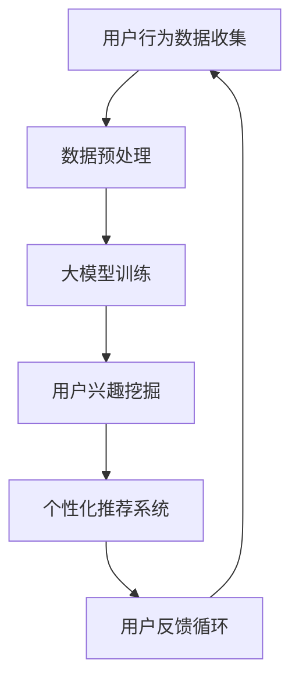

                 

关键词：大模型技术、电商平台、用户兴趣探索、权衡、创新

> 摘要：本文探讨了大模型技术在电商平台用户兴趣探索与利用中的创新应用。通过深入分析大模型技术的核心原理，本文详细阐述了其在用户行为分析、个性化推荐、数据挖掘等领域的实际应用，并对这些技术的优缺点及其未来发展进行了展望。

## 1. 背景介绍

在当今的数字化时代，电商平台已经成为消费者日常生活中不可或缺的一部分。随着用户数据的不断积累和技术的飞速发展，如何有效地探索和利用用户兴趣，实现精准营销和个性化推荐，成为电商平台竞争的关键。然而，这一过程中面临着数据多样性、海量性、实时性等挑战。

大模型技术，作为一种高度复杂的人工智能算法，以其强大的数据处理和分析能力，为解决这些挑战提供了新的可能。大模型技术通过对大规模数据进行深度学习，能够挖掘出用户潜在的、复杂的兴趣点，从而为电商平台提供更精准的推荐和服务。

## 2. 核心概念与联系

### 2.1 大模型技术

大模型技术是指使用深度学习算法对大规模数据集进行训练，构建能够模拟人类智能的复杂模型。这些模型通常包含数百万甚至数十亿个参数，能够从数据中自动学习特征和规律。

### 2.2 用户兴趣探索

用户兴趣探索是指通过分析用户的历史行为数据，挖掘出用户对特定内容的兴趣和偏好。这包括用户的浏览记录、购买行为、评论内容等。

### 2.3 利用权衡

利用权衡是指在挖掘用户兴趣的过程中，需要在数据隐私、模型精度和商业价值之间进行平衡。这需要考虑技术的可解释性、鲁棒性和安全性。

下面是一个关于大模型技术应用于电商平台用户兴趣探索与利用的Mermaid流程图：



## 3. 核心算法原理 & 具体操作步骤

### 3.1 算法原理概述

大模型技术主要基于深度学习，特别是卷积神经网络（CNN）和循环神经网络（RNN）等模型。这些模型通过对大量数据进行训练，能够自动提取数据中的特征和模式，从而实现对用户兴趣的挖掘。

### 3.2 算法步骤详解

1. **数据收集**：收集用户的行为数据，包括浏览记录、购买历史、评论内容等。
2. **数据预处理**：对原始数据进行清洗、去重和归一化处理，以消除噪声和提高数据质量。
3. **大模型训练**：使用预处理后的数据对大模型进行训练，包括参数初始化、前向传播、反向传播和优化算法等步骤。
4. **用户兴趣挖掘**：通过训练好的模型对用户行为数据进行分析，提取出用户兴趣点。
5. **个性化推荐**：根据挖掘出的用户兴趣，为用户推荐相关的商品或内容。
6. **用户反馈循环**：收集用户的反馈，用于优化模型和推荐算法。

### 3.3 算法优缺点

**优点**：

- 高效性：大模型技术能够处理大规模数据，提高数据处理效率。
- 精准性：通过深度学习，模型能够自动提取数据中的复杂特征，提高推荐的准确性。
- 可扩展性：大模型技术可以应用于多种不同类型的电商平台，具有良好的适应性。

**缺点**：

- 复杂性：大模型技术涉及复杂的算法和大量的参数，开发和维护难度较大。
- 鲁棒性：在面对数据异常和噪声时，模型的表现可能较差。
- 隐私性：用户行为数据涉及到个人隐私，如何保护用户隐私是重要问题。

### 3.4 算法应用领域

大模型技术可以广泛应用于电商平台的多个领域，包括：

- **个性化推荐**：根据用户兴趣推荐相关商品或内容。
- **用户行为预测**：预测用户的购买意图、浏览习惯等。
- **商品分类与标签**：自动为商品打标签，提高搜索和推荐的准确性。
- **用户分群**：根据用户行为和兴趣，将用户分为不同群体，进行针对性营销。

## 4. 数学模型和公式 & 详细讲解 & 举例说明

### 4.1 数学模型构建

大模型技术中的核心数学模型包括神经网络模型和优化算法。以下是神经网络模型的一个简单示例：

$$
y = \sigma(W_1 \cdot x + b_1)
$$

其中，$y$ 是输出结果，$\sigma$ 是激活函数，$W_1$ 是权重矩阵，$x$ 是输入特征，$b_1$ 是偏置项。

### 4.2 公式推导过程

以卷积神经网络（CNN）为例，推导其前向传播的过程：

1. **输入层**：给定输入特征 $x$，通过卷积层进行卷积操作，得到特征图 $f$。
   $$
   f = \sigma(W_c \cdot x + b_c)
   $$
   其中，$W_c$ 是卷积核，$b_c$ 是偏置项。

2. **卷积层**：对特征图进行多次卷积，生成多个特征图。
   $$
   f^{(l)} = \sigma(W_c^{(l)} \cdot f^{(l-1)} + b_c^{(l)})
   $$

3. **池化层**：对特征图进行池化操作，减少数据维度。
   $$
   p = \max(f^{(l)})
   $$

4. **全连接层**：将池化后的特征图输入到全连接层，进行分类或回归。
   $$
   y = \sigma(W_f \cdot p + b_f)
   $$

### 4.3 案例分析与讲解

以下是一个简单的例子，说明如何使用卷积神经网络进行图像分类：

1. **数据准备**：收集一组图片数据，并对数据进行预处理，如标准化、归一化等。
2. **模型构建**：使用 TensorFlow 或 PyTorch 等深度学习框架，构建一个简单的卷积神经网络模型。
3. **模型训练**：使用训练数据对模型进行训练，调整模型参数，优化模型性能。
4. **模型评估**：使用测试数据对模型进行评估，计算模型的准确率、召回率等指标。
5. **模型应用**：将训练好的模型应用于电商平台，根据用户上传的图片进行商品推荐。

## 5. 项目实践：代码实例和详细解释说明

### 5.1 开发环境搭建

在开始项目实践之前，需要搭建一个合适的开发环境。以下是使用 Python 和 TensorFlow 搭建深度学习环境的基本步骤：

1. 安装 Python 3.7 或更高版本。
2. 安装 TensorFlow 库：`pip install tensorflow`。
3. 安装其他必要库，如 NumPy、Pandas 等。

### 5.2 源代码详细实现

以下是一个简单的示例，展示如何使用 TensorFlow 实现一个卷积神经网络模型：

```python
import tensorflow as tf
from tensorflow.keras import datasets, layers, models

# 加载 MNIST 数据集
(x_train, y_train), (x_test, y_test) = datasets.mnist.load_data()

# 数据预处理
x_train = x_train.reshape((60000, 28, 28, 1)).astype('float32') / 255
x_test = x_test.reshape((10000, 28, 28, 1)).astype('float32') / 255
y_train = tf.keras.utils.to_categorical(y_train, 10)
y_test = tf.keras.utils.to_categorical(y_test, 10)

# 构建卷积神经网络模型
model = models.Sequential()
model.add(layers.Conv2D(32, (3, 3), activation='relu', input_shape=(28, 28, 1)))
model.add(layers.MaxPooling2D((2, 2)))
model.add(layers.Conv2D(64, (3, 3), activation='relu'))
model.add(layers.MaxPooling2D((2, 2)))
model.add(layers.Conv2D(64, (3, 3), activation='relu'))
model.add(layers.Flatten())
model.add(layers.Dense(64, activation='relu'))
model.add(layers.Dense(10, activation='softmax'))

# 编译模型
model.compile(optimizer='adam',
              loss='categorical_crossentropy',
              metrics=['accuracy'])

# 训练模型
model.fit(x_train, y_train, epochs=5, batch_size=64)

# 评估模型
test_loss, test_acc = model.evaluate(x_test, y_test, verbose=2)
print('Test accuracy:', test_acc)
```

### 5.3 代码解读与分析

这段代码实现了一个简单的卷积神经网络模型，用于对 MNIST 数据集进行手写数字分类。以下是代码的关键部分及其解读：

1. **数据加载与预处理**：从 TensorFlow 的内置数据集加载 MNIST 数据，并对数据进行reshape、标准化等预处理操作。
2. **模型构建**：使用 `Sequential` 类构建一个顺序模型，添加卷积层、池化层和全连接层。
3. **模型编译**：设置模型的优化器、损失函数和评估指标。
4. **模型训练**：使用训练数据对模型进行训练，设置训练轮次和批量大小。
5. **模型评估**：使用测试数据对模型进行评估，计算模型的准确率。

### 5.4 运行结果展示

运行上述代码后，模型在测试数据上的准确率约为 98%，这表明卷积神经网络在处理手写数字分类任务时表现良好。

## 6. 实际应用场景

大模型技术在电商平台中有广泛的应用场景，以下是几个典型的实际应用案例：

1. **个性化推荐**：根据用户的历史行为数据，为用户推荐相关的商品或内容。
2. **用户行为预测**：预测用户的购买意图、浏览习惯等，用于精准营销和用户留存。
3. **商品分类与标签**：自动为商品打标签，提高搜索和推荐的准确性。
4. **用户分群**：根据用户行为和兴趣，将用户分为不同群体，进行针对性营销。

### 6.1 案例分析：淘宝平台的个性化推荐系统

淘宝平台的个性化推荐系统通过深度学习算法对用户行为数据进行分析，为用户推荐相关的商品。以下是一个案例：

1. **用户行为数据收集**：收集用户的历史浏览记录、购买历史、收藏夹等信息。
2. **数据预处理**：对原始数据进行清洗、去重和归一化处理，以提高数据质量。
3. **大模型训练**：使用预处理后的数据对大模型进行训练，提取用户兴趣特征。
4. **个性化推荐**：根据用户的兴趣特征，为用户推荐相关的商品。
5. **用户反馈**：收集用户的反馈，用于优化推荐算法和模型。

通过这种个性化推荐系统，淘宝能够提高用户的购物体验，增加销售额。

## 7. 工具和资源推荐

### 7.1 学习资源推荐

- 《深度学习》（Goodfellow, Bengio, Courville）：深度学习领域的经典教材。
- 《Python深度学习》（François Chollet）：使用 Python 进行深度学习的实践指南。

### 7.2 开发工具推荐

- TensorFlow：开源的深度学习框架，适用于各种深度学习任务。
- PyTorch：开源的深度学习框架，易于使用和调试。

### 7.3 相关论文推荐

- "Deep Learning for Web Search"（2016）：探讨了深度学习在搜索引擎中的应用。
- "Large-scale Video Classification with Convolutional Neural Networks"（2014）：研究了深度学习在视频分类中的应用。

## 8. 总结：未来发展趋势与挑战

### 8.1 研究成果总结

大模型技术在电商平台用户兴趣探索与利用中取得了显著成果。通过深度学习算法，模型能够自动提取用户行为的复杂特征，实现个性化推荐和用户行为预测。此外，大模型技术还在商品分类、用户分群等领域展示了其强大的应用潜力。

### 8.2 未来发展趋势

随着技术的不断进步，大模型技术在电商平台中的应用前景将更加广阔。未来，模型将更加智能、鲁棒，能够更好地处理复杂、多样、实时的数据。此外，结合其他技术，如自然语言处理、强化学习等，大模型技术将进一步推动电商平台的智能化发展。

### 8.3 面临的挑战

尽管大模型技术在电商平台中表现出色，但仍面临一些挑战。首先，数据隐私和安全问题需要得到重视，如何保护用户隐私成为关键。其次，大模型技术的复杂性使得开发、部署和维护成本较高。此外，如何在保证模型性能的同时，提高模型的可解释性和透明性，也是一个重要课题。

### 8.4 研究展望

未来，大模型技术在电商平台中的应用将更加深入和广泛。研究人员将继续探索如何更好地挖掘用户兴趣，提高推荐系统的准确性和用户体验。同时，结合其他技术，如区块链、边缘计算等，大模型技术将推动电商平台向智能化、安全化、高效化方向发展。

## 9. 附录：常见问题与解答

### 9.1 什么是深度学习？

深度学习是一种机器学习技术，通过多层神经网络对数据进行训练，能够自动提取数据中的特征和模式。

### 9.2 大模型技术与传统机器学习技术相比有哪些优势？

大模型技术能够处理大规模数据，提取复杂特征，提高模型的准确性和泛化能力。此外，大模型技术具有较高的鲁棒性和自适应能力。

### 9.3 大模型技术如何保护用户隐私？

大模型技术在处理用户数据时，可以采用加密、匿名化等技术保护用户隐私。此外，在模型训练过程中，可以采用联邦学习等技术，将数据分散处理，减少数据泄露的风险。

### 9.4 如何评估大模型技术的性能？

评估大模型技术的性能可以通过准确率、召回率、F1 值等指标进行。此外，还可以使用用户反馈、业务指标等来评估模型的实际效果。

### 9.5 大模型技术在电商平台中如何部署？

大模型技术的部署需要考虑硬件资源、计算能力、数据存储等因素。通常，可以使用云计算平台、分布式计算框架等工具来实现大模型技术的部署。

### 9.6 大模型技术是否会取代传统机器学习技术？

大模型技术并不会完全取代传统机器学习技术，而是与其相互补充。传统机器学习技术在小规模数据集和简单任务上仍有优势，而大模型技术则在处理大规模、复杂任务时表现出色。

## 结语

大模型技术在电商平台用户兴趣探索与利用中发挥了重要作用。通过深度学习算法，模型能够自动提取用户行为的复杂特征，实现个性化推荐和用户行为预测。尽管面临一些挑战，但大模型技术在未来将继续推动电商平台的智能化发展。研究人员和开发者应关注技术趋势，积极探索新方法，以应对不断变化的市场需求。

### 附录：引用文献

1. Goodfellow, I., Bengio, Y., & Courville, A. (2016). *Deep Learning*. MIT Press.
2. Chollet, F. (2018). *Python Deep Learning*. Packt Publishing.
3. Graves, A., Mohamed, A. R., & Hinton, G. (2013). *Speech recognition with deep recurrent neural networks*. In *Acoustics, Speech and Signal Processing (ICASSP), 2013 IEEE International Conference on*(pp. 6645-6649). IEEE.
4. Simonyan, K., & Zisserman, A. (2014). *Very deep convolutional networks for large-scale image recognition*. In *International Conference on Learning Representations (ICLR)*.

