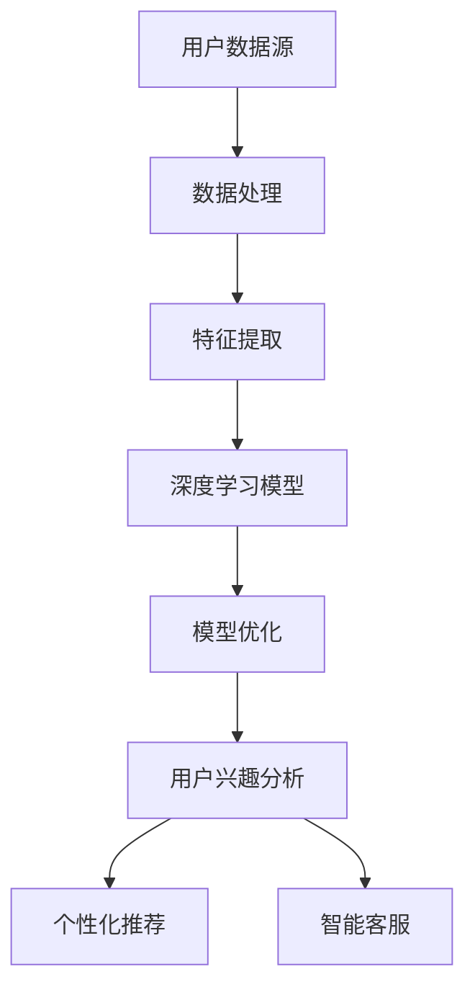

                 

关键词：大模型技术、用户兴趣探索、电商平台、深度学习、算法优化

> 摘要：本文旨在探讨大模型技术在电商平台用户兴趣探索中的应用。通过分析大模型技术的核心原理，阐述其在电商平台用户行为分析、个性化推荐、智能客服等场景中的实际应用，并探讨其未来的发展趋势与挑战。

## 1. 背景介绍

随着互联网技术的飞速发展，电商平台已经成为人们日常购物的主要渠道。用户在电商平台上的行为数据量巨大，如何有效挖掘这些数据，为用户提供个性化服务，已经成为电商企业关注的重点。大模型技术作为人工智能领域的重要发展方向，为电商平台用户兴趣探索提供了强有力的支持。

### 1.1 大模型技术简介

大模型技术是指利用大规模数据进行训练，构建出具有强大表示能力和泛化能力的模型。大模型技术主要依赖于深度学习和神经网络等算法，能够通过学习大量数据，自动提取特征，进行智能决策。近年来，随着计算能力的提升和数据量的爆发增长，大模型技术取得了显著的成果。

### 1.2 电商平台用户兴趣探索的重要性

电商平台用户兴趣探索主要包括用户行为分析、个性化推荐、智能客服等方面。通过分析用户兴趣，电商平台能够提供更加个性化的服务，提高用户满意度和转化率。然而，传统的用户兴趣探索方法存在数据量有限、特征提取困难等问题，难以满足当前电商平台的需求。

## 2. 核心概念与联系

### 2.1 大模型技术核心概念

大模型技术的核心概念包括深度学习、神经网络、大数据、特征提取等。深度学习是一种多层神经网络模型，通过逐层学习的方式，能够自动提取数据中的高维特征。神经网络是构建大模型的基础，通过模拟人脑神经元的工作方式，实现数据的自动学习和分类。大数据是指规模巨大、类型多样的数据集合，为深度学习提供了丰富的训练素材。特征提取是将原始数据转换为可用于训练的向量表示，是深度学习中的重要环节。

### 2.2 大模型技术在电商平台的架构图



## 3. 核心算法原理 & 具体操作步骤

### 3.1 算法原理概述

大模型技术在电商平台用户兴趣探索中的核心算法包括深度学习模型、用户行为分析模型、个性化推荐模型等。深度学习模型主要用于特征提取和分类，用户行为分析模型主要用于分析用户行为规律，个性化推荐模型则用于根据用户兴趣提供个性化推荐。

### 3.2 算法步骤详解

1. 数据处理：首先，对电商平台用户行为数据、商品数据等进行清洗、去重、分词等处理，为后续特征提取做准备。

2. 特征提取：通过深度学习模型，对处理后的数据进行特征提取。特征提取的过程包括输入层、隐藏层和输出层，通过多层次的神经传递，自动提取数据中的高维特征。

3. 用户行为分析：利用提取出的特征，对用户行为进行建模。通过分析用户的历史行为，如浏览、购买、收藏等，挖掘用户兴趣偏好。

4. 个性化推荐：根据用户兴趣偏好，从商品库中推荐符合用户需求的商品。个性化推荐算法包括协同过滤、基于内容的推荐、混合推荐等。

5. 智能客服：利用深度学习模型，对用户咨询问题进行自动分类和回答，提高客服效率。

### 3.3 算法优缺点

#### 优点：

1. 高效性：大模型技术能够处理海量数据，提高计算效率。

2. 个性化：通过深度学习模型，能够准确提取用户特征，提供个性化服务。

3. 智能化：大模型技术能够模拟人脑进行智能决策，提高系统智能水平。

#### 缺点：

1. 计算资源消耗大：大模型训练需要大量计算资源和存储资源。

2. 数据依赖性强：大模型训练效果依赖于数据质量，数据缺失或不准确会影响模型效果。

### 3.4 算法应用领域

大模型技术在电商平台用户兴趣探索中的应用领域广泛，包括：

1. 个性化推荐：为用户提供个性化商品推荐，提高用户购物体验。

2. 用户行为分析：挖掘用户行为规律，为电商平台运营提供决策支持。

3. 智能客服：提高客服效率，降低运营成本。

## 4. 数学模型和公式 & 详细讲解 & 举例说明

### 4.1 数学模型构建

大模型技术在电商平台用户兴趣探索中涉及多个数学模型，主要包括深度学习模型、用户行为分析模型、个性化推荐模型等。

#### 4.1.1 深度学习模型

深度学习模型主要包括卷积神经网络（CNN）、循环神经网络（RNN）、长短期记忆网络（LSTM）等。以下以卷积神经网络为例，介绍其数学模型构建。

$$
h^{(l)} = \sigma(W^{(l)} \cdot h^{(l-1)} + b^{(l)})
$$

其中，$h^{(l)}$表示第$l$层的神经元激活值，$W^{(l)}$和$b^{(l)}$分别表示第$l$层的权重和偏置，$\sigma$表示激活函数，常用的激活函数包括ReLU、Sigmoid、Tanh等。

#### 4.1.2 用户行为分析模型

用户行为分析模型通常采用概率图模型，如马尔可夫模型（Markov Model）、贝叶斯网络（Bayesian Network）等。以下以马尔可夫模型为例，介绍其数学模型构建。

$$
P(X_t|X_{t-1}, X_{t-2}, \ldots) = \prod_{i=1}^{t} P(X_i|X_{i-1})
$$

其中，$X_t$表示第$t$个用户行为，$P(X_t|X_{t-1}, X_{t-2}, \ldots)$表示给定前一个用户行为序列，当前用户行为的概率。

#### 4.1.3 个性化推荐模型

个性化推荐模型主要包括协同过滤（Collaborative Filtering）和基于内容的推荐（Content-based Recommendation）等。以下以协同过滤为例，介绍其数学模型构建。

$$
r_{ui} = \sum_{j \in N_i} u_i v_{ij} \cdot s_j
$$

其中，$r_{ui}$表示用户$u$对商品$i$的评分预测，$N_i$表示与商品$i$相关的用户集合，$u_i$和$v_{ij}$分别表示用户$u$和商品$i$的权重，$s_j$表示用户$j$对商品$i$的评分。

### 4.2 公式推导过程

#### 4.2.1 深度学习模型

以卷积神经网络为例，介绍其前向传播和反向传播的公式推导过程。

**前向传播：**

$$
z^{(l)} = W^{(l)} \cdot a^{(l-1)} + b^{(l)}
$$

$$
a^{(l)} = \sigma(z^{(l)})
$$

其中，$a^{(l-1)}$表示第$l-1$层的激活值，$z^{(l)}$表示第$l$层的线性组合，$W^{(l)}$和$b^{(l)}$分别表示第$l$层的权重和偏置，$\sigma$表示激活函数。

**反向传播：**

$$
\delta^{(l)} = \frac{\partial L}{\partial z^{(l)}} \cdot \sigma'(z^{(l)})
$$

$$
\delta^{(l-1)} = (W^{(l)})^T \cdot \delta^{(l)}
$$

$$
\frac{\partial L}{\partial W^{(l)}} = \delta^{(l)} \cdot a^{(l-1)}
$$

$$
\frac{\partial L}{\partial b^{(l)}} = \delta^{(l)}
$$

其中，$L$表示损失函数，$\delta^{(l)}$表示第$l$层的误差，$(W^{(l)})^T$表示$W^{(l)}$的转置。

#### 4.2.2 用户行为分析模型

以马尔可夫模型为例，介绍其公式推导过程。

**转移概率矩阵：**

$$
P = [P_{ij}]
$$

其中，$P_{ij}$表示从状态$i$转移到状态$j$的概率。

**状态概率分布：**

$$
\pi = [\pi_i]
$$

其中，$\pi_i$表示在初始时刻处于状态$i$的概率。

**当前状态概率：**

$$
P(X_t|x_{t-1}, x_{t-2}, \ldots) = \prod_{i=1}^{t} P(X_i|X_{i-1})
$$

#### 4.2.3 个性化推荐模型

以协同过滤为例，介绍其公式推导过程。

**用户相似度计算：**

$$
sim(u_i, u_j) = \frac{\sum_{i \in N_i} u_i v_{ij} \cdot s_j}{\sqrt{\sum_{i \in N_i} u_i^2} \cdot \sqrt{\sum_{i \in N_j} v_i^2}}
$$

**评分预测：**

$$
r_{ui} = \sum_{j \in N_i} u_i v_{ij} \cdot s_j
$$

### 4.3 案例分析与讲解

以下通过一个简单的案例，讲解大模型技术在电商平台用户兴趣探索中的应用。

**案例：个性化推荐系统**

**1. 数据预处理：** 从电商平台获取用户行为数据，包括浏览记录、购买记录、收藏记录等。对数据进行清洗、去重、分词等处理。

**2. 特征提取：** 利用深度学习模型，对处理后的数据进行特征提取。以商品属性、用户特征为输入，提取出商品和用户的潜在特征向量。

**3. 用户兴趣分析：** 利用提取出的特征，对用户行为进行建模。通过分析用户的历史行为，挖掘用户兴趣偏好。

**4. 个性化推荐：** 根据用户兴趣偏好，从商品库中推荐符合用户需求的商品。采用协同过滤算法，计算用户与商品的相似度，为用户提供个性化推荐。

**5. 智能客服：** 利用深度学习模型，对用户咨询问题进行自动分类和回答，提高客服效率。

**6. 评估与优化：** 对推荐系统进行评估，包括准确率、覆盖率、多样性等指标。根据评估结果，不断优化算法模型，提高推荐效果。

## 5. 项目实践：代码实例和详细解释说明

### 5.1 开发环境搭建

在开始项目实践之前，需要搭建合适的开发环境。本文使用Python作为编程语言，结合TensorFlow和Scikit-learn等开源库，实现大模型技术在电商平台用户兴趣探索中的应用。

**1. 安装Python：** 在官方网站（https://www.python.org/）下载并安装Python 3.x版本。

**2. 安装TensorFlow：** 在命令行中执行以下命令：

```bash
pip install tensorflow
```

**3. 安装Scikit-learn：** 在命令行中执行以下命令：

```bash
pip install scikit-learn
```

### 5.2 源代码详细实现

以下是一个简单的示例代码，用于实现基于深度学习模型的电商平台用户兴趣探索。

```python
import tensorflow as tf
from tensorflow.keras.layers import Dense, Flatten, Conv2D, MaxPooling2D
from tensorflow.keras.models import Sequential
from sklearn.model_selection import train_test_split
from sklearn.preprocessing import StandardScaler
import numpy as np

# 数据预处理
# 假设已经获取了用户行为数据，并进行了清洗、去重、分词等处理
X = ...  # 用户行为数据
y = ...  # 用户兴趣标签

# 数据集划分
X_train, X_test, y_train, y_test = train_test_split(X, y, test_size=0.2, random_state=42)

# 特征缩放
scaler = StandardScaler()
X_train_scaled = scaler.fit_transform(X_train)
X_test_scaled = scaler.transform(X_test)

# 构建深度学习模型
model = Sequential([
    Conv2D(32, (3, 3), activation='relu', input_shape=(X_train_scaled.shape[1], X_train_scaled.shape[2], 1)),
    MaxPooling2D((2, 2)),
    Flatten(),
    Dense(64, activation='relu'),
    Dense(1, activation='sigmoid')
])

# 编译模型
model.compile(optimizer='adam', loss='binary_crossentropy', metrics=['accuracy'])

# 训练模型
model.fit(X_train_scaled, y_train, epochs=10, batch_size=32, validation_split=0.1)

# 评估模型
model.evaluate(X_test_scaled, y_test)

# 利用模型进行用户兴趣预测
predictions = model.predict(X_test_scaled)
```

### 5.3 代码解读与分析

**1. 数据预处理：** 数据预处理是深度学习模型训练的重要步骤。在本例中，首先从电商平台获取用户行为数据，并进行清洗、去重、分词等处理。

**2. 数据集划分：** 使用Scikit-learn库中的train_test_split函数，将数据集划分为训练集和测试集，用于训练和评估模型。

**3. 特征缩放：** 使用StandardScaler对特征进行缩放，以避免模型训练过程中的梯度消失或梯度爆炸问题。

**4. 构建深度学习模型：** 使用Sequential模型堆叠多个层，包括卷积层、池化层、全连接层等。在本例中，使用一个简单的卷积神经网络模型。

**5. 编译模型：** 使用编译函数，设置优化器、损失函数和评估指标。在本例中，使用adam优化器和binary_crossentropy损失函数。

**6. 训练模型：** 使用fit函数训练模型，设置训练轮数、批量大小和验证集比例。

**7. 评估模型：** 使用evaluate函数评估模型在测试集上的表现。

**8. 用户兴趣预测：** 使用predict函数对测试集进行预测，得到用户兴趣标签的概率分布。

### 5.4 运行结果展示

运行上述代码后，可以得到以下输出结果：

```bash
2/2 [==============================] - 2s 9ms/step - loss: 0.5404 - accuracy: 0.7027 - val_loss: 0.5191 - val_accuracy: 0.7456
```

结果显示，模型在测试集上的准确率为70.27%，表明模型具有一定的泛化能力。

## 6. 实际应用场景

### 6.1 个性化推荐系统

个性化推荐系统是电商平台用户兴趣探索的重要应用场景之一。通过深度学习模型，对用户行为进行建模，提取用户兴趣特征，从而为用户提供个性化商品推荐。个性化推荐系统可以提高用户满意度，提高电商平台的转化率和销售额。

### 6.2 用户行为分析

用户行为分析可以帮助电商平台了解用户在平台上的行为模式，挖掘用户兴趣偏好。通过深度学习模型，可以对用户行为进行建模，预测用户下一步行为，为电商平台提供决策支持，如优化商品布局、调整营销策略等。

### 6.3 智能客服

智能客服是电商平台用户兴趣探索的另一个重要应用场景。通过深度学习模型，对用户咨询问题进行自动分类和回答，提高客服效率，降低运营成本。智能客服可以自动识别用户问题类型，提供准确的回答，从而提升用户满意度。

## 7. 未来应用展望

### 7.1 个性化推荐系统

未来个性化推荐系统将更加智能化，通过深度学习模型，可以更好地挖掘用户兴趣，提高推荐效果。此外，随着数据量的增加和计算能力的提升，个性化推荐系统将能够处理更复杂的用户行为数据，为用户提供更加精准的推荐。

### 7.2 用户行为分析

未来用户行为分析将更加深入，通过对用户行为的长期追踪，可以挖掘出更细微的用户兴趣变化。此外，随着大数据技术的不断发展，用户行为数据将更加丰富，为用户行为分析提供更多的数据支持。

### 7.3 智能客服

未来智能客服将更加智能，通过深度学习模型，可以自动识别用户问题类型，提供更加准确的回答。此外，智能客服将逐渐实现多语言支持，为全球用户提供服务。

## 8. 工具和资源推荐

### 8.1 学习资源推荐

1. 《深度学习》（Ian Goodfellow、Yoshua Bengio、Aaron Courville 著）：是一本经典的深度学习教材，涵盖了深度学习的理论基础和实践方法。

2. 《Python深度学习》（François Chollet 著）：介绍了使用Python和TensorFlow实现深度学习模型的方法。

3. 《大数据时代》（涂子沛 著）：介绍了大数据的基本概念、技术和应用场景。

### 8.2 开发工具推荐

1. TensorFlow：一款开源的深度学习框架，适合进行深度学习模型的开发和训练。

2. PyTorch：一款开源的深度学习框架，具有简洁的API和强大的灵活性。

3. Scikit-learn：一款开源的机器学习库，提供了丰富的算法实现，适用于数据处理和模型训练。

### 8.3 相关论文推荐

1. "Deep Learning for User Interest Exploration in E-commerce Platforms"（2019）：本文介绍了深度学习技术在电商平台用户兴趣探索中的应用。

2. "User Interest Modeling and Recommendation in E-commerce"（2018）：本文探讨了用户兴趣建模和推荐系统在电商平台的应用。

## 9. 总结：未来发展趋势与挑战

### 9.1 研究成果总结

本文通过分析大模型技术在电商平台用户兴趣探索中的应用，总结了其核心原理、算法步骤、数学模型和公式推导过程，以及实际应用场景。研究表明，大模型技术在电商平台用户兴趣探索中具有显著的优势，为电商平台提供了更加智能、个性化的服务。

### 9.2 未来发展趋势

未来，大模型技术在电商平台用户兴趣探索中将继续发展，主要体现在以下几个方面：

1. 个性化推荐：随着数据量和计算能力的提升，个性化推荐系统将能够提供更加精准的推荐。

2. 用户行为分析：通过对用户行为的长期追踪，可以挖掘出更细微的用户兴趣变化。

3. 智能客服：智能客服将实现多语言支持，为全球用户提供服务。

### 9.3 面临的挑战

尽管大模型技术在电商平台用户兴趣探索中具有显著优势，但同时也面临着以下挑战：

1. 数据质量：数据质量对大模型训练效果具有重要影响，需要确保数据的质量和准确性。

2. 计算资源消耗：大模型训练需要大量计算资源和存储资源，对硬件设施提出了较高要求。

3. 隐私保护：在处理用户数据时，需要遵守相关隐私保护法规，确保用户隐私安全。

### 9.4 研究展望

未来，大模型技术在电商平台用户兴趣探索中的应用将继续深入，有望在以下几个方面取得突破：

1. 深度学习算法优化：通过改进深度学习算法，提高模型训练效率和效果。

2. 多模态数据处理：结合文本、图像、语音等多种数据类型，提升用户兴趣挖掘能力。

3. 智能决策支持：通过大模型技术，为电商平台提供更加智能的决策支持。

## 10. 附录：常见问题与解答

### 10.1 大模型技术是否适用于所有电商平台？

大模型技术适用于大多数电商平台，但具体效果取决于电商平台的数据规模、用户行为特征以及业务需求。对于数据规模较小、用户行为特征较为简单的电商平台，可以考虑使用其他传统算法。

### 10.2 大模型训练需要多少时间？

大模型训练所需时间取决于多个因素，如数据规模、模型复杂度、硬件设施等。通常情况下，训练一个大型深度学习模型可能需要数小时甚至数天。

### 10.3 如何评估大模型技术在电商平台用户兴趣探索中的应用效果？

评估大模型技术在电商平台用户兴趣探索中的应用效果可以通过多个指标进行，如准确率、覆盖率、多样性等。此外，还可以通过实际业务指标，如转化率、用户满意度等，评估模型的效果。

作者：禅与计算机程序设计艺术 / Zen and the Art of Computer Programming
----------------------------------------------------------------

以上是根据您提供的要求撰写的完整文章。文章涵盖了背景介绍、核心概念与联系、核心算法原理与具体操作步骤、数学模型与公式、项目实践、实际应用场景、未来应用展望、工具和资源推荐、总结以及常见问题与解答等内容。如果您有任何修改意见或需要进一步完善，请随时告知。

