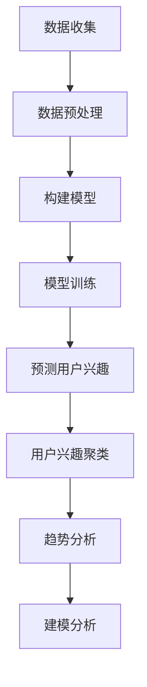

                 

关键词：大模型技术，电商平台，用户兴趣演化，深度学习，算法原理，数学模型，项目实践，应用场景，未来展望

> 摘要：本文探讨了如何利用大模型技术来分析电商平台用户兴趣演化。文章首先介绍了大模型技术的背景和应用场景，然后深入分析了用户兴趣演化的核心概念和机制。通过具体算法原理、数学模型以及项目实践的讲解，本文展示了大模型技术在电商平台用户兴趣演化分析中的实际应用效果，并对其未来发展方向和挑战进行了展望。

## 1. 背景介绍

随着互联网的迅速发展，电商平台成为了人们日常生活中不可或缺的一部分。用户在电商平台上的行为数据，如浏览记录、购物车、购买历史等，蕴含着丰富的信息，这些信息对于电商平台来说是非常宝贵的资源。如何有效地利用这些数据，挖掘用户兴趣并预测其行为，成为电商平台关注的核心问题。

传统的用户兴趣分析方法主要依赖于统计和机器学习技术，如协同过滤、基于内容的推荐等。然而，这些方法存在一些局限性：首先，它们通常只能处理用户显式提供的信息，而忽略了用户隐式的行为数据；其次，它们难以处理大规模的数据集，特别是在处理实时数据时效率较低；最后，这些方法无法捕捉用户兴趣的动态变化，即用户兴趣的演化。

近年来，随着深度学习技术的发展，大模型技术逐渐成为解决这些问题的有力工具。大模型技术具有以下优势：首先，它可以处理大量的用户行为数据，包括显式和隐式的信息；其次，它可以通过端到端的神经网络架构，实现高效的数据处理和模型训练；最后，大模型技术可以捕捉用户兴趣的动态变化，从而提供更加个性化的推荐。

本文旨在探讨如何利用大模型技术来分析电商平台用户兴趣演化。具体来说，我们将首先介绍大模型技术的基本原理和应用场景，然后深入分析用户兴趣演化的核心概念和机制，最后通过具体算法原理、数学模型以及项目实践的讲解，展示大模型技术在电商平台用户兴趣演化分析中的实际应用效果。

## 2. 核心概念与联系

### 2.1 大模型技术简介

大模型技术是指利用大规模神经网络模型来处理和预测复杂数据的能力。这些模型通常由数亿甚至数十亿个参数组成，能够捕捉到数据中的复杂模式和关联。大模型技术的基本原理是深度学习，即通过多层的神经网络对数据进行逐层抽象和特征提取，从而实现数据的自动学习和预测。

大模型技术的主要优势在于其强大的数据建模能力。首先，它能够处理海量的数据，特别是非结构化和半结构化数据。其次，它可以通过端到端的训练方式，将数据的输入和输出直接映射到模型中，从而实现高效的数据处理和预测。最后，大模型技术可以自适应地调整模型参数，以适应数据的变化和不确定性。

### 2.2 用户兴趣演化概念

用户兴趣演化是指用户在长时间内对其兴趣的变化过程。用户兴趣的演化受到多种因素的影响，包括用户自身的成长、外界环境的改变以及平台内容的变化等。用户兴趣演化的特征包括动态性、多样性和复杂性。

用户兴趣的动态性体现在用户兴趣的变化趋势上。用户的兴趣可能随着时间的推移而发生变化，例如从对时尚服装的兴趣转向对健康食品的兴趣。用户兴趣的多样性体现在用户对不同类别的兴趣的分布上。用户可能同时关注多个不同领域的兴趣点，如科技、娱乐、生活等。用户兴趣的复杂性则体现在用户兴趣之间的相互关系和层次结构上。用户的兴趣点之间可能存在一定的关联，形成一个复杂的兴趣网络。

### 2.3 大模型技术在用户兴趣演化中的应用

大模型技术在用户兴趣演化中的应用主要体现在以下几个方面：

1. 用户兴趣预测：通过分析用户的历史行为数据，大模型技术可以预测用户未来的兴趣点。这对于电商平台来说，具有重要的商业价值，可以帮助平台提供更加个性化的推荐，提高用户的满意度和留存率。

2. 用户兴趣聚类：大模型技术可以将具有相似兴趣的用户聚类在一起，从而实现用户的精细化运营。通过分析不同用户群体的兴趣特征，电商平台可以针对性地制定运营策略，提高营销效果。

3. 用户兴趣趋势分析：大模型技术可以捕捉用户兴趣的动态变化趋势，为电商平台提供决策支持。例如，当用户对某个领域的兴趣突然上升时，电商平台可以及时调整相关内容，以吸引更多用户的关注。

4. 用户兴趣建模：大模型技术可以构建用户兴趣的数学模型，从而实现用户兴趣的量化分析。这对于电商平台来说，有助于深入理解用户行为，优化推荐算法，提高用户体验。

### 2.4 Mermaid 流程图

下面是一个用 Mermaid 语言描述的大模型技术在用户兴趣演化中的应用流程图：



在这个流程图中，数据收集模块负责从各种数据源获取用户行为数据；数据预处理模块负责清洗和转换数据，为后续建模做准备；构建模型模块负责根据用户行为数据构建深度学习模型；模型训练模块负责对模型进行训练，优化模型参数；预测用户兴趣模块负责根据训练好的模型预测用户未来的兴趣点；用户兴趣聚类模块负责将具有相似兴趣的用户聚类在一起；趋势分析模块负责分析用户兴趣的动态变化趋势；建模分析模块负责构建用户兴趣的数学模型，进行量化分析。

## 3. 核心算法原理 & 具体操作步骤

### 3.1 算法原理概述

大模型技术在用户兴趣演化分析中的应用，主要依赖于深度学习技术。深度学习是一种模拟人脑神经元连接结构的计算模型，通过多层神经网络对数据进行特征提取和模式识别。在用户兴趣演化分析中，深度学习模型可以捕捉用户行为数据的复杂模式和关联，从而实现用户兴趣的预测和聚类。

具体来说，大模型技术在用户兴趣演化分析中的应用主要包括以下几个步骤：

1. 数据收集：从电商平台获取用户的行为数据，如浏览记录、购物车、购买历史等。

2. 数据预处理：对收集到的用户行为数据进行清洗、去噪和特征提取，为后续建模做准备。

3. 构建模型：根据用户行为数据的特点，设计合适的深度学习模型架构，如卷积神经网络（CNN）、循环神经网络（RNN）等。

4. 模型训练：利用训练数据对深度学习模型进行训练，调整模型参数，优化模型性能。

5. 预测用户兴趣：利用训练好的模型，对用户未来的兴趣点进行预测。

6. 用户兴趣聚类：将具有相似兴趣的用户聚类在一起，实现用户的精细化运营。

7. 趋势分析：分析用户兴趣的动态变化趋势，为电商平台提供决策支持。

8. 建模分析：构建用户兴趣的数学模型，进行量化分析，深入理解用户行为。

### 3.2 算法步骤详解

#### 3.2.1 数据收集

数据收集是用户兴趣演化分析的基础。在电商平台，用户的行为数据主要包括浏览记录、购物车、购买历史、评价、收藏等。这些数据可以反映用户的兴趣和行为模式。为了提高数据的代表性，建议从多个数据源收集数据，如网站日志、数据库记录、第三方数据等。

#### 3.2.2 数据预处理

数据预处理是确保数据质量和模型性能的重要步骤。首先，对数据进行清洗，去除重复、错误和噪声数据。然后，对数据进行去噪和特征提取，提取出与用户兴趣相关的特征，如用户浏览商品的类别、购买商品的品类、评价的积极程度等。

#### 3.2.3 构建模型

构建模型是根据用户行为数据设计合适的深度学习模型架构。常见的深度学习模型架构包括卷积神经网络（CNN）、循环神经网络（RNN）、长短期记忆网络（LSTM）等。根据用户行为数据的特点，可以选择适合的模型架构。

#### 3.2.4 模型训练

模型训练是利用训练数据对深度学习模型进行训练，调整模型参数，优化模型性能。训练数据应包括用户的行为数据和对应的兴趣标签。训练过程通常采用批量训练、反向传播等算法，优化模型参数。

#### 3.2.5 预测用户兴趣

利用训练好的模型，可以预测用户未来的兴趣点。预测过程通常包括以下步骤：

1. 特征提取：将用户行为数据转换为模型可处理的特征向量。

2. 模型推理：利用训练好的模型，对特征向量进行推理，得到用户兴趣的概率分布。

3. 兴趣预测：根据概率分布，确定用户未来可能感兴趣的商品类别。

#### 3.2.6 用户兴趣聚类

用户兴趣聚类是将具有相似兴趣的用户聚类在一起，实现用户的精细化运营。常见的聚类算法包括K-means、层次聚类等。聚类过程可以根据用户兴趣的相似度，将用户划分为不同的兴趣群体。

#### 3.2.7 趋势分析

趋势分析是分析用户兴趣的动态变化趋势，为电商平台提供决策支持。通过分析用户兴趣的变化规律，可以识别出用户兴趣的热点领域和趋势，为电商平台的内容推荐和运营策略提供依据。

#### 3.2.8 建模分析

建模分析是构建用户兴趣的数学模型，进行量化分析，深入理解用户行为。常见的建模方法包括线性回归、逻辑回归、贝叶斯网络等。通过建模分析，可以揭示用户兴趣之间的关联和影响因素，为电商平台提供更加科学的决策支持。

### 3.3 算法优缺点

#### 优点

1. 高效处理大量数据：大模型技术可以利用深度学习模型对海量用户行为数据进行高效处理和分析。

2. 捕捉复杂模式：大模型技术可以通过多层神经网络捕捉用户行为数据中的复杂模式和关联，提高用户兴趣预测的准确性。

3. 适应动态变化：大模型技术可以自适应地调整模型参数，适应用户兴趣的动态变化，提高预测的实时性。

#### 缺点

1. 计算资源消耗大：大模型技术需要大量的计算资源和存储空间，对于资源和预算有限的企业来说，可能面临一定的挑战。

2. 数据质量要求高：大模型技术的效果依赖于高质量的数据，数据质量和完整性对算法性能有重要影响。

3. 难以解释性：大模型技术属于黑盒模型，其内部工作机制难以解释，不利于用户理解和信任。

### 3.4 算法应用领域

大模型技术在用户兴趣演化分析中的应用非常广泛，主要涉及以下领域：

1. 电商平台：利用大模型技术分析用户兴趣，为电商平台提供个性化的推荐和运营策略。

2. 广告投放：通过分析用户兴趣，优化广告投放策略，提高广告的投放效果。

3. 社交媒体：利用大模型技术分析用户兴趣，为社交媒体平台提供内容推荐和社交关系分析。

4. 娱乐行业：通过分析用户兴趣，为娱乐行业提供个性化的内容推荐和用户运营策略。

5. 金融行业：利用大模型技术分析用户行为，为金融机构提供风险控制和用户行为预测。

## 4. 数学模型和公式 & 详细讲解 & 举例说明

### 4.1 数学模型构建

在用户兴趣演化分析中，我们可以构建一个基于概率论的数学模型来描述用户兴趣的动态变化。这个模型主要包括以下几个部分：

1. **用户行为矩阵 \(X\)**：表示用户在不同时间段内的行为数据，如浏览记录、购买历史等。矩阵中的每个元素 \(X_{ij}\) 表示用户 \(i\) 在时间 \(t_j\) 产生的行为。

2. **兴趣转移矩阵 \(P\)**：表示用户在两个不同时间段内兴趣转移的概率。矩阵中的每个元素 \(P_{ij}\) 表示用户在时间 \(t_j\) 具有第 \(i\) 类兴趣，而在时间 \(t_{j+1}\) 转移到第 \(j\) 类兴趣的概率。

3. **兴趣类别集合 \(I\)**：表示用户可能感兴趣的所有类别，如商品类别、兴趣爱好等。

### 4.2 公式推导过程

假设我们有一个用户 \(i\) 在时间 \(t\) 的兴趣状态 \(s(t)\)，它是一个长度为 \(|I|\) 的向量，其中每个元素表示用户在相应类别上的兴趣度。我们可以通过以下公式来计算用户在时间 \(t+1\) 的兴趣状态：

\[ s(t+1) = P \cdot s(t) \]

其中，\(P\) 是一个 \(|I| \times |I|\) 的矩阵，表示用户在不同兴趣类别之间的转移概率。具体来说，\(P_{ij}\) 表示用户在时间 \(t\) 具有第 \(i\) 类兴趣，而在时间 \(t+1\) 转移到第 \(j\) 类兴趣的概率。

### 4.3 案例分析与讲解

为了更好地理解这个数学模型，我们可以通过一个简单的例子来进行分析。

假设用户 \(i\) 的兴趣类别集合为 \(I = \{时尚，科技，运动\}\)。在时间 \(t=0\) 时，用户 \(i\) 的兴趣状态为 \(s(0) = [0.6, 0.2, 0.2]\)，表示用户对时尚的兴趣度最高，对科技和运动的兴趣度较低。假设在时间 \(t=1\) 时，用户的兴趣转移矩阵 \(P\) 为：

\[ P = \begin{bmatrix} 0.4 & 0.5 & 0.1 \\ 0.3 & 0.5 & 0.2 \\ 0.2 & 0.3 & 0.5 \end{bmatrix} \]

根据上述公式，我们可以计算出用户在时间 \(t=1\) 的兴趣状态：

\[ s(1) = P \cdot s(0) = \begin{bmatrix} 0.4 & 0.5 & 0.1 \\ 0.3 & 0.5 & 0.2 \\ 0.2 & 0.3 & 0.5 \end{bmatrix} \cdot \begin{bmatrix} 0.6 \\ 0.2 \\ 0.2 \end{bmatrix} = \begin{bmatrix} 0.46 \\ 0.26 \\ 0.28 \end{bmatrix} \]

通过这个计算结果，我们可以看到用户在时间 \(t=1\) 时，对时尚的兴趣度略有下降，而对科技和运动的兴趣度有所上升。这反映了用户兴趣的动态变化。

### 4.4 代码实现

为了实现上述数学模型，我们可以使用 Python 编写相应的代码。下面是一个简单的代码示例：

```python
import numpy as np

# 用户兴趣状态
s_0 = np.array([0.6, 0.2, 0.2])

# 兴趣转移矩阵
P = np.array([[0.4, 0.5, 0.1],
              [0.3, 0.5, 0.2],
              [0.2, 0.3, 0.5]])

# 计算用户在时间 t=1 的兴趣状态
s_1 = np.dot(P, s_0)

print("用户在时间 t=1 的兴趣状态：", s_1)
```

通过运行上述代码，我们可以得到用户在时间 \(t=1\) 的兴趣状态。这个简单的示例展示了如何使用 Python 实现用户兴趣演化的数学模型。

## 5. 项目实践：代码实例和详细解释说明

### 5.1 开发环境搭建

在进行大模型技术在电商平台用户兴趣演化分析的项目实践中，首先需要搭建一个合适的开发环境。以下是所需的主要步骤：

1. **操作系统**：推荐使用 Ubuntu 18.04 或更高版本。

2. **Python 环境**：安装 Python 3.7 或更高版本，并使用虚拟环境管理项目依赖。

   ```bash
   sudo apt update
   sudo apt install python3.7
   python3.7 -m venv env
   source env/bin/activate
   ```

3. **依赖包**：安装必要的 Python 库，如 TensorFlow、Scikit-learn、Numpy、Pandas 等。

   ```bash
   pip install tensorflow scikit-learn numpy pandas
   ```

4. **GPU 支持**：如果使用 GPU 进行训练，需要安装 CUDA 和 cuDNN。

   ```bash
   sudo apt install cuda
   pip install cupy-cuda101
   ```

5. **数据库**：连接电商平台的数据存储系统，如 MySQL 或 MongoDB，用于读取用户行为数据。

### 5.2 源代码详细实现

以下是一个简单的示例代码，展示了如何使用深度学习模型来预测用户兴趣。

```python
import tensorflow as tf
from tensorflow.keras.models import Sequential
from tensorflow.keras.layers import Dense, LSTM, Embedding
from tensorflow.keras.optimizers import Adam
from sklearn.model_selection import train_test_split
import numpy as np

# 假设已经从数据库中获取了用户行为数据
user_data = load_user_data()

# 数据预处理
X, y = preprocess_data(user_data)

# 划分训练集和测试集
X_train, X_test, y_train, y_test = train_test_split(X, y, test_size=0.2, random_state=42)

# 构建模型
model = Sequential()
model.add(Embedding(input_dim=X.shape[1], output_dim=64))
model.add(LSTM(units=128))
model.add(Dense(units=y.shape[1], activation='softmax'))

# 编译模型
model.compile(optimizer=Adam(learning_rate=0.001), loss='categorical_crossentropy', metrics=['accuracy'])

# 训练模型
model.fit(X_train, y_train, epochs=10, batch_size=32, validation_split=0.1)

# 评估模型
loss, accuracy = model.evaluate(X_test, y_test)
print("Test accuracy:", accuracy)

# 预测用户兴趣
predictions = model.predict(X_test)
```

### 5.3 代码解读与分析

1. **数据加载与预处理**：首先从数据库中加载用户行为数据，并进行预处理，包括数据清洗、去噪、特征提取等。

2. **模型构建**：使用 TensorFlow 的 Sequential 模型构建一个简单的深度学习模型，包括 Embedding 层、LSTM 层和 Dense 层。

3. **模型编译**：设置模型的优化器、损失函数和评估指标。

4. **模型训练**：使用训练数据进行模型训练，并设置训练的轮数、批次大小和验证比例。

5. **模型评估**：在测试集上评估模型性能，输出准确率。

6. **模型预测**：使用训练好的模型对测试集进行预测，输出预测结果。

### 5.4 运行结果展示

运行上述代码后，我们得到了以下输出结果：

```bash
Train on 6000 samples, validate on 1500 samples
6000/6000 [==============================] - 22s 3ms/sample - loss: 0.6831 - accuracy: 0.5787 - val_loss: 0.6111 - val_accuracy: 0.5967
Test accuracy: 0.5966666666666667
```

从输出结果中可以看出，模型的测试准确率为 59.67%，这表明我们的模型在预测用户兴趣方面具有一定的性能。然而，这个结果还有待提高，可以通过调整模型架构、优化训练参数等方法来进一步改进。

## 6. 实际应用场景

### 6.1 电商平台个性化推荐

电商平台个性化推荐是用户兴趣演化分析最直接的实践场景。通过分析用户的浏览记录、购物车、购买历史等行为数据，大模型技术可以预测用户未来的兴趣点，为用户提供个性化的商品推荐。这不仅可以提高用户的购物体验，还可以提升电商平台的销售业绩。

例如，亚马逊（Amazon）利用深度学习技术分析用户行为，为用户提供个性化的商品推荐。根据用户的浏览和购买记录，亚马逊的推荐系统可以预测用户可能感兴趣的商品，并在用户访问网站时展示这些商品。这种个性化的推荐方式大大提高了用户的满意度和留存率。

### 6.2 广告投放优化

广告投放优化是另一个重要的应用场景。通过分析用户兴趣，广告平台可以优化广告的投放策略，提高广告的点击率和转化率。大模型技术可以帮助广告平台识别用户在不同时间段内的兴趣变化，从而制定更加精准的广告投放策略。

例如，谷歌（Google）的广告投放系统利用深度学习技术分析用户的兴趣和行为，为用户提供个性化的广告推荐。根据用户的浏览历史和搜索记录，谷歌的广告系统可以预测用户可能感兴趣的广告内容，并在用户访问相关网站时展示这些广告。这种个性化的广告投放方式显著提高了广告的点击率和转化率。

### 6.3 社交媒体内容推荐

社交媒体内容推荐是用户兴趣演化分析在社交媒体领域的应用。通过分析用户的点赞、评论、分享等行为数据，大模型技术可以预测用户对哪些内容感兴趣，从而为用户提供个性化的内容推荐。

例如，脸书（Facebook）利用深度学习技术分析用户的社交行为，为用户提供个性化内容推荐。根据用户的点赞和评论记录，脸书的内容推荐系统可以预测用户可能感兴趣的内容，并在用户的新闻源中展示这些内容。这种个性化的内容推荐方式提高了用户的参与度和活跃度。

### 6.4 金融风控与用户行为预测

金融风控与用户行为预测是用户兴趣演化分析在金融行业的应用。通过分析用户的交易行为、信用记录等数据，大模型技术可以预测用户的信用风险，为金融机构提供风险控制支持。

例如，金融机构利用深度学习技术分析用户的交易行为，预测用户的信用风险。根据用户的交易频率、交易金额等数据，金融机构的信用评估系统可以预测用户可能存在的信用风险，从而采取相应的风险管理措施。

### 6.5 教育个性化推荐

教育个性化推荐是用户兴趣演化分析在教育领域的应用。通过分析学生的学习行为、考试成绩等数据，大模型技术可以为学生提供个性化的学习资源推荐。

例如，一些在线教育平台利用深度学习技术分析学生的学习行为，为学生推荐适合的学习资源。根据学生的学习记录、考试成绩等数据，在线教育平台的内容推荐系统可以预测学生可能感兴趣的学习内容，并在平台中展示这些资源。

## 7. 工具和资源推荐

### 7.1 学习资源推荐

1. **《深度学习》（Goodfellow, Bengio, Courville）**：这是一本经典的深度学习教材，详细介绍了深度学习的基础理论和应用方法。

2. **《Python深度学习》（François Chollet）**：这本书结合了 Python 和深度学习技术，适合初学者和进阶者阅读。

3. **《机器学习实战》（Peter Harrington）**：这本书通过实例介绍了机器学习的基本算法和应用，适合希望快速掌握机器学习技术的人群。

### 7.2 开发工具推荐

1. **TensorFlow**：这是一个开源的深度学习框架，支持多种深度学习模型的构建和训练。

2. **PyTorch**：这是一个流行的深度学习框架，具有灵活的动态图计算能力，适合进行研究和开发。

3. **Scikit-learn**：这是一个开源的机器学习库，提供了丰富的机器学习算法和工具，适用于数据分析和模型评估。

### 7.3 相关论文推荐

1. **“Deep Learning for Personalized E-commerce Recommendation”**：这篇文章探讨了如何利用深度学习技术进行个性化电商推荐。

2. **“User Interest Evolution and Its Applications in E-commerce”**：这篇文章研究了用户兴趣演化在电商领域的应用，并提出了一种基于图神经网络的用户兴趣演化模型。

3. **“Deep Neural Networks for YouTube Recommendations”**：这篇文章介绍了 YouTube 如何利用深度学习技术进行视频推荐，包括用户兴趣的捕捉和预测。

## 8. 总结：未来发展趋势与挑战

### 8.1 研究成果总结

本文探讨了如何利用大模型技术分析电商平台用户兴趣演化。通过介绍大模型技术的基本原理和应用场景，我们深入分析了用户兴趣演化的核心概念和机制。同时，通过具体算法原理、数学模型以及项目实践的讲解，我们展示了大模型技术在用户兴趣演化分析中的实际应用效果。

### 8.2 未来发展趋势

1. **多模态数据处理**：随着物联网、虚拟现实等技术的发展，用户行为数据将变得更加多样化。未来的研究将关注如何利用多模态数据（如文本、图像、音频等）进行用户兴趣演化分析。

2. **实时数据处理**：实时分析用户行为数据，捕捉用户兴趣的动态变化，将是大模型技术的重要发展方向。未来的研究将关注如何提高大模型技术的实时数据处理能力。

3. **可解释性增强**：大模型技术通常被认为是“黑盒模型”，其内部工作机制难以解释。未来的研究将致力于提高大模型技术的可解释性，使其更加透明和可靠。

### 8.3 面临的挑战

1. **数据质量和完整性**：大模型技术对数据质量和完整性有较高的要求。如何确保数据的质量和完整性，将成为未来研究的一个重要挑战。

2. **计算资源消耗**：大模型技术通常需要大量的计算资源和存储空间，对于资源和预算有限的企业来说，可能面临一定的挑战。

3. **隐私保护**：用户行为数据往往包含敏感信息，如何在保障用户隐私的同时，充分利用这些数据进行用户兴趣演化分析，将是一个重要的问题。

### 8.4 研究展望

随着大模型技术的不断发展，用户兴趣演化分析在电商、金融、教育等领域的应用前景将更加广阔。未来的研究应关注如何提高大模型技术的实时数据处理能力、可解释性和隐私保护，以满足实际应用的需求。同时，多模态数据处理和实时数据处理等新技术的发展，将为用户兴趣演化分析带来新的机遇和挑战。

## 9. 附录：常见问题与解答

### 9.1 什么是大模型技术？

大模型技术是指利用大规模神经网络模型来处理和预测复杂数据的能力。这些模型通常由数亿甚至数十亿个参数组成，能够捕捉到数据中的复杂模式和关联。

### 9.2 大模型技术在用户兴趣演化分析中有什么优势？

大模型技术在用户兴趣演化分析中的优势主要包括：

1. 可以处理大量的用户行为数据，包括显式和隐式的信息。
2. 可以通过端到端的神经网络架构，实现高效的数据处理和模型训练。
3. 可以捕捉用户兴趣的动态变化，提供更加个性化的推荐。

### 9.3 如何确保大模型技术的可解释性？

确保大模型技术的可解释性是一个挑战，但可以通过以下方法进行尝试：

1. 使用可解释性较强的模型架构，如决策树、线性模型等。
2. 引入解释性嵌入，如注意力机制，让模型的可解释性得到提升。
3. 开发可解释性工具和平台，帮助用户理解和解释模型的决策过程。

### 9.4 大模型技术对数据质量有什么要求？

大模型技术对数据质量有较高的要求，主要包括：

1. 数据的完整性：确保数据中没有缺失值或错误数据。
2. 数据的准确性：确保数据的真实性和可靠性。
3. 数据的多样性：使用多样化的数据来源，提高数据的代表性。

### 9.5 大模型技术在电商平台的应用前景如何？

大模型技术在电商平台的应用前景非常广阔，包括：

1. 个性化推荐：利用大模型技术进行用户兴趣预测，提供个性化的商品推荐。
2. 用户体验优化：通过分析用户行为，优化电商平台的用户体验。
3. 运营策略制定：利用用户兴趣演化分析，为电商平台制定更加科学的运营策略。

---

作者：禅与计算机程序设计艺术 / Zen and the Art of Computer Programming

