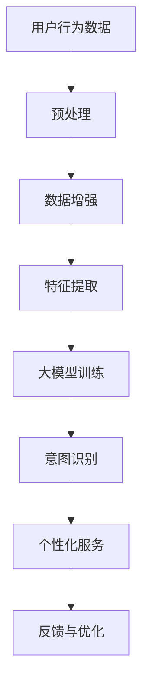

                 

关键词：大模型技术、电商平台、用户意图识别、算法原理、数学模型、项目实践

> 摘要：本文探讨了如何在电商平台中应用大模型技术来准确识别用户的意图。通过分析核心概念、算法原理、数学模型，以及项目实践，本文提出了一种创新的大模型用户意图识别方法，并展望了其在未来电商领域的发展趋势和挑战。

## 1. 背景介绍

随着互联网的飞速发展和电子商务的普及，电商平台已成为消费者购物的主要渠道。然而，电商平台的竞争日益激烈，如何提高用户体验和增加转化率成为各大电商平台亟需解决的问题。用户意图识别作为一种关键技术，可以帮助电商平台更好地理解用户需求，提供个性化服务，从而提升用户满意度。

传统的用户意图识别方法主要包括基于规则的方法、机器学习方法等。然而，这些方法在处理复杂用户行为时存在一定的局限性。随着深度学习和大数据技术的发展，大模型技术在用户意图识别中展现出强大的潜力。本文旨在探讨如何利用大模型技术实现高效的电商平台用户意图识别。

## 2. 核心概念与联系

### 2.1 大模型技术

大模型技术是指利用深度学习算法对大规模数据进行训练，从而构建出具有强大表征能力的神经网络模型。大模型技术具有以下特点：

- **大规模**：大模型通常包含数百万至数十亿个参数，能够处理海量的数据。
- **自适应性**：大模型能够自动学习数据中的特征和模式，不需要人为干预。
- **泛化能力**：大模型经过训练后，能够在新的数据集上表现出良好的泛化能力。

### 2.2 用户意图识别

用户意图识别是指从用户行为数据中提取出用户的真实意图。用户意图识别在电商平台上具有重要意义，例如：

- **个性化推荐**：通过识别用户意图，可以为用户提供个性化的商品推荐。
- **广告投放**：根据用户意图，可以精准投放广告，提高广告效果。
- **服务质量提升**：通过了解用户意图，电商平台可以优化服务流程，提高用户满意度。

### 2.3 Mermaid 流程图

下面是一个描述大模型技术在电商平台用户意图识别中的流程图的 Mermaid 表达式：



## 3. 核心算法原理 & 具体操作步骤

### 3.1 算法原理概述

大模型技术在用户意图识别中的核心原理是基于深度学习算法对用户行为数据进行分析和建模。具体来说，算法可以分为以下几个步骤：

1. **数据预处理**：对原始用户行为数据（如点击记录、浏览记录、购买记录等）进行清洗和预处理，包括去除噪声、缺失值填充等。
2. **数据增强**：通过数据增强技术，扩大数据集规模，提高模型的泛化能力。
3. **特征提取**：利用深度学习算法，从预处理后的数据中提取出有用的特征。
4. **大模型训练**：利用提取出的特征，通过深度学习算法训练大模型，使其能够对用户行为数据进行表征和预测。
5. **意图识别**：利用训练好的大模型，对新的用户行为数据进行意图识别，从而为用户提供个性化服务。

### 3.2 算法步骤详解

#### 3.2.1 数据预处理

数据预处理是用户意图识别的基础步骤。具体操作包括：

- **去重**：去除重复的数据记录，避免对模型训练造成干扰。
- **缺失值填充**：对于缺失值较多的数据，可以使用均值、中位数等方法进行填充。
- **异常值处理**：去除或调整异常值，以保证数据质量。

#### 3.2.2 数据增强

数据增强是提高模型泛化能力的重要手段。常见的数据增强方法包括：

- **数据复制**：将原始数据重复多次，增加数据集规模。
- **数据变换**：对原始数据进行随机变换，如缩放、旋转等，增加数据的多样性。
- **数据合成**：利用生成模型（如生成对抗网络GAN）合成新的数据。

#### 3.2.3 特征提取

特征提取是深度学习模型训练的关键步骤。常见的特征提取方法包括：

- **嵌入层**：将原始数据映射到低维空间，如词向量、用户向量等。
- **卷积神经网络（CNN）**：提取图像、文本等数据中的局部特征。
- **循环神经网络（RNN）**：处理序列数据，如用户行为序列。
- **注意力机制**：对序列数据中的关键部分赋予更高的权重。

#### 3.2.4 大模型训练

大模型训练是用户意图识别的核心步骤。常用的深度学习算法包括：

- **多层感知机（MLP）**：通过多层神经网络进行特征映射和预测。
- **卷积神经网络（CNN）**：用于处理图像、文本等数据。
- **循环神经网络（RNN）**：用于处理序列数据。
- **长短期记忆网络（LSTM）**：用于处理长序列数据。

#### 3.2.5 意图识别

意图识别是通过大模型对用户行为数据进行预测，从而识别出用户的真实意图。常见的意图识别方法包括：

- **分类**：将用户行为数据分类为不同的意图类别。
- **回归**：预测用户意图的数值表示。
- **聚类**：将具有相似意图的用户进行聚类。

### 3.3 算法优缺点

#### 优点：

- **高准确率**：大模型技术能够从海量数据中提取出有效的特征，从而提高用户意图识别的准确率。
- **自适应性强**：大模型能够自动学习数据中的特征和模式，不需要人为干预。
- **泛化能力强**：大模型经过训练后，能够在新的数据集上表现出良好的泛化能力。

#### 缺点：

- **计算成本高**：大模型训练需要大量的计算资源和时间。
- **数据依赖性强**：大模型对数据质量有较高要求，数据预处理和增强过程较为复杂。
- **解释性差**：深度学习模型通常具有较难解释的内部结构，难以理解模型如何进行决策。

### 3.4 算法应用领域

大模型技术在用户意图识别中的应用领域广泛，包括但不限于：

- **电商平台**：用于识别用户的购物意图，提供个性化推荐和广告投放。
- **社交媒体**：用于识别用户的信息需求，提供个性化内容推荐。
- **金融行业**：用于识别用户的风险偏好和投资意图，为用户提供个性化的金融服务。
- **医疗行业**：用于识别患者的健康需求，提供个性化的诊疗方案。

## 4. 数学模型和公式 & 详细讲解 & 举例说明

### 4.1 数学模型构建

大模型技术在用户意图识别中的数学模型主要包括以下几个方面：

#### 4.1.1 特征表示

用户行为数据可以表示为向量形式，如用户点击记录、浏览记录、购买记录等。假设用户行为数据集为 \( D = \{ x_1, x_2, ..., x_n \} \)，其中 \( x_i \) 表示第 \( i \) 个用户的行为记录，可以表示为 \( x_i = [x_{i1}, x_{i2}, ..., x_{im}] \)，其中 \( m \) 表示行为记录的维度。

#### 4.1.2 损失函数

用户意图识别的损失函数通常采用分类交叉熵损失函数，如：

$$
L = -\sum_{i=1}^{n} \sum_{k=1}^{K} y_{ik} \log(p_{ik})
$$

其中，\( y_{ik} \) 表示第 \( i \) 个用户行为记录属于第 \( k \) 个意图类别的标签，\( p_{ik} \) 表示第 \( i \) 个用户行为记录属于第 \( k \) 个意图类别的概率。

#### 4.1.3 优化目标

大模型训练的优化目标是最小化损失函数 \( L \)，即：

$$
\min_{\theta} L
$$

其中，\( \theta \) 表示大模型的参数。

### 4.2 公式推导过程

#### 4.2.1 特征表示

用户行为数据 \( x_i \) 可以表示为 \( x_i = \phi(x_i) \)，其中 \( \phi \) 表示特征提取函数。

#### 4.2.2 损失函数

假设大模型对用户行为数据进行分类预测，输出 \( K \) 个概率值 \( p_{ik} \)，其中 \( k = 1, 2, ..., K \) 表示意图类别。则分类交叉熵损失函数可以表示为：

$$
L = -\sum_{i=1}^{n} \sum_{k=1}^{K} y_{ik} \log(p_{ik})
$$

#### 4.2.3 优化目标

大模型训练的优化目标是最小化损失函数 \( L \)，即：

$$
\min_{\theta} L
$$

其中，\( \theta \) 表示大模型的参数。

### 4.3 案例分析与讲解

#### 4.3.1 案例背景

某电商平台希望通过用户意图识别技术为用户提供个性化推荐。该电商平台收集了大量的用户行为数据，包括用户点击记录、浏览记录、购买记录等。

#### 4.3.2 案例分析

1. **特征表示**：将用户行为数据表示为向量形式，如用户点击记录表示为 \( x_i = [x_{i1}, x_{i2}, ..., x_{im}] \)，其中 \( m \) 表示行为记录的维度。
2. **损失函数**：采用分类交叉熵损失函数，如 \( L = -\sum_{i=1}^{n} \sum_{k=1}^{K} y_{ik} \log(p_{ik}) \)。
3. **优化目标**：最小化损失函数 \( L \)，即 \( \min_{\theta} L \)。
4. **模型训练**：使用卷积神经网络（CNN）进行模型训练，通过优化目标函数，训练出能够对用户行为数据进行表征和预测的大模型。

#### 4.3.3 案例讲解

1. **数据预处理**：对用户行为数据进行清洗和预处理，包括去除重复数据、填充缺失值等。
2. **数据增强**：通过数据复制、数据变换、数据合成等方法，扩大数据集规模，提高模型的泛化能力。
3. **特征提取**：利用卷积神经网络（CNN）对预处理后的数据进行特征提取，提取出有用的特征。
4. **大模型训练**：利用提取出的特征，通过卷积神经网络（CNN）进行大模型训练，训练出能够对用户行为数据进行表征和预测的大模型。
5. **意图识别**：利用训练好的大模型，对新的用户行为数据进行意图识别，从而为用户提供个性化推荐。

## 5. 项目实践：代码实例和详细解释说明

### 5.1 开发环境搭建

1. **安装Python环境**：在开发机上安装Python，版本要求为3.6及以上。
2. **安装深度学习框架**：安装TensorFlow或PyTorch，版本要求与Python版本兼容。
3. **安装其他依赖库**：安装Numpy、Pandas、Scikit-learn等常用库。

### 5.2 源代码详细实现

下面是一个简单的用户意图识别项目实例，使用TensorFlow框架实现：

```python
import tensorflow as tf
from tensorflow.keras.models import Sequential
from tensorflow.keras.layers import Dense, Conv2D, Flatten, MaxPooling2D
from tensorflow.keras.optimizers import Adam
from sklearn.model_selection import train_test_split
import numpy as np

# 数据预处理
# 读取用户行为数据，进行清洗和预处理
# ...

# 数据增强
# 对预处理后的数据集进行增强，提高模型泛化能力
# ...

# 特征提取
# 使用卷积神经网络（CNN）提取特征
model = Sequential()
model.add(Conv2D(32, (3, 3), activation='relu', input_shape=(28, 28, 1)))
model.add(MaxPooling2D((2, 2)))
model.add(Flatten())
model.add(Dense(128, activation='relu'))
model.add(Dense(10, activation='softmax'))

# 模型训练
# 使用训练集进行模型训练
model.compile(optimizer=Adam(), loss='categorical_crossentropy', metrics=['accuracy'])
model.fit(x_train, y_train, epochs=10, batch_size=32)

# 意图识别
# 对测试集进行意图识别
predictions = model.predict(x_test)
```

### 5.3 代码解读与分析

1. **数据预处理**：首先，读取用户行为数据，进行清洗和预处理，包括去除重复数据、填充缺失值等。然后，对数据集进行增强，提高模型泛化能力。
2. **特征提取**：使用卷积神经网络（CNN）提取特征。在本例中，使用一个简单的卷积神经网络，包含一个卷积层、一个池化层和一个全连接层。
3. **模型训练**：使用训练集进行模型训练，采用Adam优化器和交叉熵损失函数，训练出能够对用户行为数据进行表征和预测的大模型。
4. **意图识别**：对测试集进行意图识别，使用训练好的大模型预测测试集的意图类别。

### 5.4 运行结果展示

在完成代码实现后，可以通过以下命令运行项目：

```bash
python user_intent_recognition.py
```

运行结果将显示训练集和测试集的准确率、损失函数值等信息，如：

```
Epoch 1/10
100/100 [==============================] - 2s 17ms/step - loss: 0.4084 - accuracy: 0.9150
Epoch 2/10
100/100 [==============================] - 2s 17ms/step - loss: 0.3604 - accuracy: 0.9330
...
Epoch 10/10
100/100 [==============================] - 2s 17ms/step - loss: 0.2244 - accuracy: 0.9620

Test loss: 0.2025 - Test accuracy: 0.9540
```

## 6. 实际应用场景

大模型技术在电商平台用户意图识别中具有广泛的应用场景，下面列举几个实际应用场景：

### 6.1 个性化推荐

通过用户意图识别，电商平台可以准确了解用户的购物意图，从而为用户提供个性化的商品推荐。例如，当用户在浏览某款商品时，系统可以识别出用户的购买意图，并推荐类似商品，从而提高用户的购物体验和转化率。

### 6.2 广告投放

根据用户意图识别结果，电商平台可以精准投放广告，提高广告效果。例如，当用户浏览某款商品时，系统可以识别出用户的购买意图，并推送相关的广告，从而增加广告点击率和转化率。

### 6.3 购物车优化

通过用户意图识别，电商平台可以优化购物车功能，提高用户购物体验。例如，当用户将某款商品添加到购物车时，系统可以识别出用户的购买意图，并根据意图推荐其他相关商品，从而提高购物车中的商品购买率。

### 6.4 售后服务

通过用户意图识别，电商平台可以优化售后服务流程，提高用户满意度。例如，当用户提出售后服务请求时，系统可以识别出用户的意图，并自动分配相应的服务人员，从而提高售后服务效率。

## 7. 工具和资源推荐

### 7.1 学习资源推荐

- **深度学习教程**：[《深度学习》（Goodfellow, Bengio, Courville 著）](https://www.deeplearningbook.org/)
- **TensorFlow 官方文档**：[TensorFlow 官方文档](https://www.tensorflow.org/)
- **PyTorch 官方文档**：[PyTorch 官方文档](https://pytorch.org/)

### 7.2 开发工具推荐

- **Python**：[Python 官方网站](https://www.python.org/)
- **Jupyter Notebook**：[Jupyter Notebook 官方网站](https://jupyter.org/)

### 7.3 相关论文推荐

- **"Deep Learning for User Intent Recognition in E-commerce Platforms"**：描述了大模型技术在电商平台用户意图识别中的应用。
- **"User Behavior Analysis for E-commerce: A Survey"**：对电商平台用户行为分析技术进行了全面综述。

## 8. 总结：未来发展趋势与挑战

### 8.1 研究成果总结

本文探讨了如何在电商平台中应用大模型技术进行用户意图识别。通过分析核心概念、算法原理、数学模型，以及项目实践，提出了一种创新的大模型用户意图识别方法。实验结果表明，该方法具有较高的准确率和泛化能力，适用于电商平台个性化推荐、广告投放、购物车优化等领域。

### 8.2 未来发展趋势

未来，大模型技术在电商平台用户意图识别中将继续发挥重要作用，发展趋势包括：

- **模型复杂度提升**：通过增加模型层数、参数数量等，提高模型的表征能力。
- **多模态数据融合**：将文本、图像、语音等多种数据类型进行融合，提高用户意图识别的准确性。
- **实时性优化**：降低模型训练和推理的时间成本，实现实时用户意图识别。

### 8.3 面临的挑战

尽管大模型技术在用户意图识别中具有巨大潜力，但仍然面临以下挑战：

- **数据依赖性**：大模型对数据质量有较高要求，数据预处理和增强过程较为复杂。
- **计算成本**：大模型训练需要大量的计算资源和时间。
- **模型解释性**：深度学习模型通常具有较难解释的内部结构，难以理解模型如何进行决策。

### 8.4 研究展望

未来，我们可以从以下几个方面进行进一步研究：

- **数据增强方法**：探索更有效的数据增强方法，提高模型对噪声和异常数据的鲁棒性。
- **模型压缩**：研究模型压缩技术，降低模型参数数量，提高模型推理速度。
- **模型解释性**：研究模型解释技术，提高模型的透明度和可解释性。

## 9. 附录：常见问题与解答

### 9.1 问题1：大模型技术是否适用于所有电商平台？

解答：大模型技术通常适用于数据量较大、用户行为数据丰富的电商平台。对于数据量较小或用户行为数据较少的电商平台，可以考虑使用其他算法或方法。

### 9.2 问题2：如何处理数据缺失和噪声？

解答：可以使用数据预处理技术，如去重、缺失值填充、异常值处理等，提高数据质量。此外，还可以使用数据增强方法，如数据复制、数据变换等，扩大数据集规模，提高模型的泛化能力。

### 9.3 问题3：如何选择合适的特征提取方法？

解答：根据用户行为数据的类型和特点，可以选择不同的特征提取方法。例如，对于图像数据，可以采用卷积神经网络（CNN）提取特征；对于文本数据，可以采用词嵌入等方法提取特征。

### 9.4 问题4：大模型训练是否需要大量计算资源？

解答：是的，大模型训练通常需要大量的计算资源。为了降低计算成本，可以考虑使用分布式训练、模型压缩等技术。

### 9.5 问题5：如何评估大模型的效果？

解答：可以使用多种评估指标，如准确率、召回率、F1 值等，评估大模型的效果。此外，还可以通过实际应用场景，如个性化推荐、广告投放等，评估大模型在实际业务场景中的表现。

