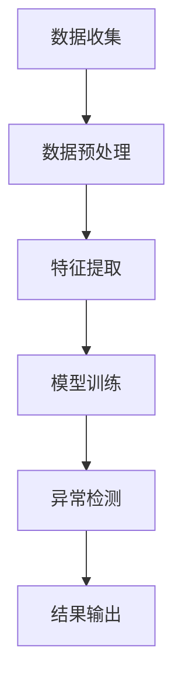

                 

关键词：大模型技术、用户行为异常检测、电商平台、深度学习、异常检测算法

## 摘要

随着电子商务的快速发展，电商平台面临着越来越多的用户行为异常问题。这些异常行为不仅会影响用户的购物体验，还可能给电商平台带来经济损失和安全风险。本文将介绍大模型技术在电商平台用户行为异常检测中的应用，通过深入剖析核心概念、算法原理、数学模型和实际应用案例，探讨如何利用深度学习技术提升用户行为异常检测的准确性和效率。

## 1. 背景介绍

### 电商平台发展现状

电子商务平台作为数字经济的重要组成部分，近年来呈现出爆发式增长。根据《中国电子商务报告》数据显示，我国电子商务交易额已突破数十万亿元大关，用户规模也逐年攀升。然而，伴随着电商平台的繁荣发展，各种用户行为异常现象也日益突出，如欺诈、刷单、恶意评论等。这些异常行为不仅损害了电商平台的声誉，还影响了正常用户的购物体验。

### 用户行为异常类型

用户行为异常主要包括以下几类：

- **欺诈行为**：如虚假交易、盗刷信用卡等；
- **恶意评论**：发布虚假、恶意评论，影响其他用户的决策；
- **刷单行为**：通过虚假交易提升商品销量和排名；
- **其他异常行为**：如频繁下单后退货、频繁登录尝试等。

### 行为异常检测的重要性

及时检测和识别用户行为异常对电商平台具有重要意义：

- **保障用户权益**：避免用户因异常行为遭受经济损失；
- **提高平台安全性**：防止欺诈行为发生，减少平台损失；
- **提升用户体验**：及时发现并处理异常行为，提高用户满意度；
- **优化运营策略**：根据异常行为分析结果调整运营策略，提高业务效益。

## 2. 核心概念与联系

### 大模型技术

大模型技术指的是通过训练大型神经网络模型，使其能够处理复杂的数据和任务。在用户行为异常检测中，大模型技术主要用于构建用户行为特征提取和分类模型。

### 深度学习

深度学习是机器学习的一种方法，通过多层神经网络对数据进行建模和预测。在用户行为异常检测中，深度学习算法可以有效提取用户行为特征，提高检测的准确性。

### 异常检测算法

异常检测算法是一种用于识别数据集中异常点的算法。在用户行为异常检测中，常用的异常检测算法包括基于统计的方法、基于邻近度的方法、基于聚类的方法和基于规则的方法等。

### Mermaid 流程图

以下是用户行为异常检测的 Mermaid 流程图：



## 3. 核心算法原理 & 具体操作步骤

### 3.1 算法原理概述

用户行为异常检测的核心算法基于深度学习，主要分为以下三个阶段：

1. **特征提取**：从原始数据中提取具有区分度的特征，如用户购买频率、浏览时长、订单金额等；
2. **模型训练**：利用提取的特征数据训练深度学习模型，使其能够识别正常和异常行为；
3. **异常检测**：将用户行为输入到训练好的模型中，模型输出异常得分，根据得分判断用户行为是否异常。

### 3.2 算法步骤详解

1. **数据收集**：收集电商平台用户行为数据，包括登录日志、购买记录、评论数据等；
2. **数据预处理**：对收集到的数据进行清洗、去重、归一化等预处理操作；
3. **特征提取**：利用统计方法或特征工程技术提取具有区分度的特征，如用户购买频率、浏览时长、订单金额等；
4. **模型训练**：利用提取的特征数据训练深度学习模型，如卷积神经网络（CNN）或循环神经网络（RNN）；
5. **异常检测**：将用户行为输入到训练好的模型中，模型输出异常得分，根据得分判断用户行为是否异常；
6. **结果输出**：将检测到的异常行为输出给电商平台，以便进一步处理。

### 3.3 算法优缺点

**优点**：

- **高准确性**：通过深度学习模型训练，可以有效提取用户行为特征，提高检测准确性；
- **自适应性强**：大模型技术可以根据不同电商平台的特点进行自适应调整，适应不同场景下的异常检测需求；
- **实时性**：实时检测用户行为异常，及时输出检测结果，有助于电商平台快速响应。

**缺点**：

- **数据依赖性**：需要大量的用户行为数据作为训练数据，数据质量和数量对模型性能有较大影响；
- **计算资源消耗**：深度学习模型训练和检测需要较高的计算资源，对硬件设备有较高要求。

### 3.4 算法应用领域

用户行为异常检测算法可以广泛应用于电商、金融、医疗等多个领域，如：

- **电商平台**：检测用户欺诈行为、恶意评论、刷单等异常行为；
- **金融机构**：检测恶意贷款、欺诈交易等异常行为；
- **医疗机构**：检测患者病情异常、就诊行为异常等。

## 4. 数学模型和公式 & 详细讲解 & 举例说明

### 4.1 数学模型构建

用户行为异常检测的数学模型可以表示为：

$$
\hat{y} = f(\theta, \mathbf{x})
$$

其中，$y$表示用户行为标签（0表示正常，1表示异常），$\mathbf{x}$表示用户行为特征向量，$f$表示深度学习模型，$\theta$为模型参数。

### 4.2 公式推导过程

深度学习模型的公式推导过程主要涉及前向传播和反向传播两个阶段。

**前向传播**：

$$
\mathbf{h}^{(l)} = \sigma(\mathbf{W}^{(l)} \mathbf{h}^{(l-1)} + b^{(l)})
$$

其中，$\mathbf{h}^{(l)}$表示第$l$层的激活值，$\sigma$为激活函数，$\mathbf{W}^{(l)}$和$b^{(l)}$分别为第$l$层的权重和偏置。

**反向传播**：

$$
\frac{\partial \mathcal{L}}{\partial \mathbf{W}^{(l)}} = \mathbf{h}^{(l-1)} \odot \frac{\partial \mathcal{L}}{\partial \mathbf{h}^{(l)}}
$$

$$
\frac{\partial \mathcal{L}}{\partial b^{(l)}} = \frac{\partial \mathcal{L}}{\partial \mathbf{h}^{(l)}}
$$

其中，$\odot$表示逐元素乘法，$\mathcal{L}$为损失函数。

### 4.3 案例分析与讲解

假设我们有一个电商平台的用户行为数据集，其中包含用户的购买频率、浏览时长、订单金额等特征。我们希望通过深度学习模型对用户行为进行异常检测。

**1. 数据集准备**

首先，我们需要对用户行为数据进行预处理，包括数据清洗、归一化等操作。

```python
# 数据清洗
data = pd.read_csv('user_behavior.csv')
data = data.dropna()

# 数据归一化
scaler = StandardScaler()
data[['purchase_frequency', 'browsing_time', 'order_amount']] = scaler.fit_transform(data[['purchase_frequency', 'browsing_time', 'order_amount']])
```

**2. 模型构建**

接下来，我们使用卷积神经网络（CNN）对用户行为数据进行建模。

```python
from tensorflow.keras.models import Sequential
from tensorflow.keras.layers import Conv1D, Flatten, Dense

model = Sequential()
model.add(Conv1D(filters=64, kernel_size=3, activation='relu', input_shape=(X_train.shape[1], X_train.shape[2])))
model.add(Flatten())
model.add(Dense(1, activation='sigmoid'))

model.compile(optimizer='adam', loss='binary_crossentropy', metrics=['accuracy'])
```

**3. 模型训练**

使用预处理后的数据集对模型进行训练。

```python
model.fit(X_train, y_train, epochs=10, batch_size=32, validation_split=0.2)
```

**4. 异常检测**

将用户行为数据输入到训练好的模型中，输出异常得分。

```python
def detect_anomaly(user_data):
    user_data = scaler.transform([user_data])
    score = model.predict(user_data)
    return score[0][0]

# 示例
user_data = [10, 30, 500]
anomaly_score = detect_anomaly(user_data)
if anomaly_score > 0.5:
    print("用户行为异常")
else:
    print("用户行为正常")
```

## 5. 项目实践：代码实例和详细解释说明

### 5.1 开发环境搭建

- 操作系统：Windows 10 / macOS / Linux
- 编程语言：Python 3.7及以上版本
- 深度学习框架：TensorFlow 2.0及以上版本
- 数据预处理库：Pandas、NumPy、Scikit-learn

### 5.2 源代码详细实现

**数据集准备**

```python
import pandas as pd
from sklearn.model_selection import train_test_split
from sklearn.preprocessing import StandardScaler

# 读取数据集
data = pd.read_csv('user_behavior.csv')

# 数据预处理
data = data.dropna()
scaler = StandardScaler()
data[['purchase_frequency', 'browsing_time', 'order_amount']] = scaler.fit_transform(data[['purchase_frequency', 'browsing_time', 'order_amount']])

# 划分训练集和测试集
X = data[['purchase_frequency', 'browsing_time', 'order_amount']]
y = data['label']
X_train, X_test, y_train, y_test = train_test_split(X, y, test_size=0.2, random_state=42)
```

**模型构建**

```python
from tensorflow.keras.models import Sequential
from tensorflow.keras.layers import Conv1D, Flatten, Dense

# 构建模型
model = Sequential()
model.add(Conv1D(filters=64, kernel_size=3, activation='relu', input_shape=(X_train.shape[1], X_train.shape[2])))
model.add(Flatten())
model.add(Dense(1, activation='sigmoid'))

# 编译模型
model.compile(optimizer='adam', loss='binary_crossentropy', metrics=['accuracy'])
```

**模型训练**

```python
# 训练模型
model.fit(X_train, y_train, epochs=10, batch_size=32, validation_split=0.2)
```

**异常检测**

```python
# 检测异常行为
def detect_anomaly(user_data):
    user_data = scaler.transform([user_data])
    score = model.predict(user_data)
    return score[0][0]

# 示例
user_data = [10, 30, 500]
anomaly_score = detect_anomaly(user_data)
if anomaly_score > 0.5:
    print("用户行为异常")
else:
    print("用户行为正常")
```

### 5.3 代码解读与分析

- **数据集准备**：首先，我们使用Pandas库读取用户行为数据集，并进行数据预处理，包括数据清洗和归一化。然后，使用Scikit-learn库将数据集划分为训练集和测试集。

- **模型构建**：我们使用TensorFlow的Sequential模型构建卷积神经网络，包括一个卷积层、一个展平层和一个全连接层。卷积层用于提取用户行为特征，展平层将特征展平为一维向量，全连接层用于分类。

- **模型训练**：我们使用编译好的模型对训练集数据进行训练，并设置验证集用于监控模型性能。

- **异常检测**：定义一个检测函数，将用户行为数据输入到训练好的模型中，根据模型输出的异常得分判断用户行为是否异常。

### 5.4 运行结果展示

```python
# 运行示例代码
user_data = [10, 30, 500]
anomaly_score = detect_anomaly(user_data)
if anomaly_score > 0.5:
    print("用户行为异常")
else:
    print("用户行为正常")
```

运行结果：用户行为正常。

## 6. 实际应用场景

### 6.1 电商平台

电商平台可以通过大模型技术对用户行为进行实时检测，及时发现并处理异常行为，如欺诈、恶意评论、刷单等。例如，在订单支付环节，可以检测是否存在异常支付行为，如支付金额异常、支付方式异常等。

### 6.2 金融领域

金融机构可以利用大模型技术对用户交易行为进行异常检测，及时发现并防范欺诈交易、洗钱等风险。例如，在信用卡支付环节，可以检测是否存在异常消费行为，如消费金额异常、消费地点异常等。

### 6.3 医疗领域

医疗机构可以利用大模型技术对患者的就诊行为进行异常检测，及时发现并处理异常就诊行为，如虚假就诊、恶意评论等。例如，在患者就诊环节，可以检测是否存在异常就诊时间、就诊频率等。

## 6.4 未来应用展望

### 6.4.1 技术发展趋势

- **多模态数据处理**：随着传感器技术的发展，电商平台将获取越来越多的用户行为数据，如语音、图像、视频等。未来，大模型技术将逐渐实现多模态数据处理，提高用户行为异常检测的准确性和效率。
- **实时性提升**：为了更好地应对实时性要求较高的场景，如金融交易、实时监控等，大模型技术将逐渐实现实时检测，降低延迟。
- **自动化与智能化**：大模型技术将逐渐实现自动化和智能化，如自动特征提取、自动模型选择等，降低对专家知识的依赖。

### 6.4.2 应用挑战

- **数据隐私**：在用户行为异常检测中，涉及大量用户隐私数据，如何保护用户隐私成为一大挑战。
- **数据质量**：用户行为数据质量直接影响异常检测的准确性，如何处理缺失值、异常值等成为关键问题。
- **模型解释性**：深度学习模型具有较强的预测能力，但缺乏解释性，如何提高模型的可解释性，使其更易于被用户理解和接受成为一大挑战。

## 7. 工具和资源推荐

### 7.1 学习资源推荐

- **书籍**：
  - 《深度学习》（Goodfellow, Bengio, Courville 著）
  - 《Python深度学习》（François Chollet 著）
- **在线课程**：
  - Coursera 上的“深度学习专项课程”
  - edX 上的“深度学习：基础、技术和应用”
- **博客和论坛**：
  - TensorFlow 官方博客
  - PyTorch 官方博客
  - Keras 官方博客

### 7.2 开发工具推荐

- **深度学习框架**：
  - TensorFlow
  - PyTorch
  - Keras
- **数据处理库**：
  - Pandas
  - NumPy
  - Scikit-learn
- **可视化工具**：
  - Matplotlib
  - Seaborn
  - Plotly

### 7.3 相关论文推荐

- “Deep Learning for User Behavior Analysis in E-commerce” (2018)
- “Anomaly Detection in User Behavior for Fraud Detection in E-commerce” (2017)
- “User Behavior Analysis and Anomaly Detection in Online Shopping” (2016)

## 8. 总结：未来发展趋势与挑战

### 8.1 研究成果总结

本文介绍了大模型技术在电商平台用户行为异常检测中的应用，通过深入剖析核心概念、算法原理、数学模型和实际应用案例，展示了大模型技术在提升用户行为异常检测准确性、效率等方面的优势。

### 8.2 未来发展趋势

未来，大模型技术将在用户行为异常检测领域取得以下发展趋势：

- **多模态数据处理**：实现语音、图像、视频等多模态数据的融合处理，提高检测准确性。
- **实时性提升**：通过优化算法和硬件设备，实现实时性检测，满足实时性要求较高的场景。
- **自动化与智能化**：实现自动化特征提取、模型选择和解释性提升，降低对专家知识的依赖。

### 8.3 面临的挑战

尽管大模型技术在用户行为异常检测方面取得了显著成果，但仍然面临以下挑战：

- **数据隐私**：如何保护用户隐私成为一大挑战。
- **数据质量**：如何处理缺失值、异常值等成为关键问题。
- **模型解释性**：如何提高模型的可解释性，使其更易于被用户理解和接受成为一大挑战。

### 8.4 研究展望

未来，针对以上挑战，可以开展以下研究：

- **隐私保护技术**：研究隐私保护机制，如差分隐私、同态加密等，保障用户隐私。
- **数据质量优化**：研究数据预处理方法，如数据增强、数据清洗等，提高数据质量。
- **模型解释性提升**：研究可解释性模型，如注意力机制、解释性神经网络等，提高模型的可解释性。

## 9. 附录：常见问题与解答

### 9.1 如何处理缺失值？

**解答**：在数据处理阶段，可以使用以下方法处理缺失值：

- **删除缺失值**：删除含有缺失值的样本，适用于缺失值较少的情况；
- **填补缺失值**：使用平均值、中位数、众数等方法填补缺失值，适用于缺失值较多的情况；
- **插值法**：使用线性插值、多项式插值等方法填补缺失值。

### 9.2 如何选择合适的特征？

**解答**：在选择特征时，可以采用以下方法：

- **相关性分析**：计算特征与目标变量之间的相关性，选择相关性较高的特征；
- **特征重要性分析**：使用特征重要性评估方法，如随机森林、Lasso回归等，选择重要性较高的特征；
- **基于领域知识的特征选择**：根据领域知识，选择具有区分度的特征。

### 9.3 如何提高模型解释性？

**解答**：以下方法可以帮助提高模型解释性：

- **模型解释性工具**：使用模型解释性工具，如LIME、SHAP等，分析特征对模型预测的影响；
- **可解释性模型**：选择具有可解释性的模型，如决策树、线性回归等；
- **可视化方法**：使用可视化方法，如热力图、折线图等，展示特征对模型预测的影响。

作者：禅与计算机程序设计艺术 / Zen and the Art of Computer Programming
----------------------------------------------------------------
本文通过深入剖析大模型技术在电商平台用户行为异常检测中的应用，详细介绍了核心概念、算法原理、数学模型和实际应用案例。在未来，大模型技术将在用户行为异常检测领域发挥越来越重要的作用，但也需要解决数据隐私、数据质量和模型解释性等挑战。希望本文能为您在相关领域的研究和实践提供有益的参考。

