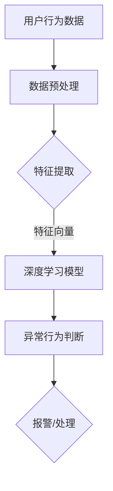

                 

关键词：大模型技术、用户行为异常检测、电商平台、机器学习、深度学习、数据处理、算法实现

> 摘要：本文旨在探讨大模型技术，特别是深度学习在电商平台用户行为异常检测中的应用。通过对大模型技术的原理、算法、数学模型及实践应用的详细分析，本文揭示了其在提升电商平台安全性和用户体验方面的潜力。

## 1. 背景介绍

随着互联网的迅猛发展，电商平台已经成为人们日常生活的重要组成部分。用户在平台上的行为数据量庞大，且日增速度快。这些数据中包含了大量有价值的信息，但同时也存在异常行为，如欺诈、垃圾信息等。传统的基于规则和统计模型的方法在处理复杂且多维的用户行为时存在很大的局限性，无法有效地识别出隐藏在大量正常行为中的异常行为。

近年来，大模型技术，特别是基于深度学习的模型，在处理复杂数据和模式识别方面展现出了强大的能力。大模型技术通过训练庞大的神经网络，可以从大量的数据中学习到复杂的模式，从而在用户行为异常检测领域展现出巨大的潜力。本文将围绕这一技术，探讨其在电商平台用户行为异常检测中的应用。

## 2. 核心概念与联系

### 2.1 大模型技术

大模型技术是指使用大规模的神经网络来处理复杂数据的一种机器学习方法。这些模型通常具有数百万到数十亿个参数，可以自动从数据中学习到复杂的模式。大模型技术主要包括深度神经网络（DNN）、卷积神经网络（CNN）和循环神经网络（RNN）等。

### 2.2 用户行为异常检测

用户行为异常检测是指通过分析用户在平台上的行为数据，识别出潜在的风险行为。这种行为可能是恶意攻击，也可能是用户误操作。异常检测的关键是区分正常行为和异常行为，从而及时采取措施。

### 2.3 Mermaid 流程图



## 3. 核心算法原理 & 具体操作步骤

### 3.1 算法原理概述

大模型技术在用户行为异常检测中的核心在于其强大的模式识别能力。通过训练，深度学习模型可以从历史数据中学习到正常用户行为的特点，并在新的数据中实时识别出异常行为。

### 3.2 算法步骤详解

1. **数据预处理**：对收集到的用户行为数据进行清洗和格式化，去除无效数据和噪声。
2. **特征提取**：从预处理后的数据中提取出能够反映用户行为特点的特征，如访问频率、购买频率、点击率等。
3. **模型训练**：使用提取的特征向量作为输入，训练深度学习模型。训练过程中，模型会不断优化参数，以达到更高的准确率。
4. **异常行为判断**：在模型训练完成后，使用训练好的模型对新数据进行判断。若判断为异常行为，则触发报警或处理机制。
5. **报警/处理**：对识别出的异常行为进行报警，并采取相应的处理措施，如锁定账号、删除恶意信息等。

### 3.3 算法优缺点

**优点**：
- **高效性**：大模型技术能够处理大规模的数据，且训练时间较短。
- **准确性**：通过学习大量的数据，模型可以更准确地识别异常行为。
- **灵活性**：模型可以根据不同的业务需求进行调整和优化。

**缺点**：
- **资源消耗**：大模型训练需要大量的计算资源和时间。
- **数据依赖**：模型的效果很大程度上依赖于数据的多样性和质量。

### 3.4 算法应用领域

除了电商平台，大模型技术还在金融风险控制、网络安全监控等领域有广泛的应用。随着技术的不断发展，其应用领域将会更加广泛。

## 4. 数学模型和公式 & 详细讲解 & 举例说明

### 4.1 数学模型构建

在用户行为异常检测中，常用的数学模型包括深度神经网络和循环神经网络。以下是一个简化的深度神经网络模型：

$$
y = \sigma(W \cdot x + b)
$$

其中，$y$ 为输出，$\sigma$ 为激活函数，$W$ 为权重矩阵，$x$ 为输入特征向量，$b$ 为偏置。

### 4.2 公式推导过程

以深度神经网络为例，模型的推导过程如下：

1. **输入层**：输入特征向量 $x$。
2. **隐藏层**：每个神经元接收输入，并计算加权求和。
3. **输出层**：输出层计算每个神经元的加权求和，并通过激活函数得到最终的输出 $y$。
4. **反向传播**：计算输出误差，并反向传播更新权重和偏置。

### 4.3 案例分析与讲解

假设我们有一个电商平台，需要检测用户的购买行为是否异常。我们收集了用户的购买历史数据，包括购买时间、购买金额、购买频率等。以下是特征提取和模型训练的步骤：

1. **特征提取**：将购买历史数据转化为特征向量，如 $[t_1, t_2, ..., t_n]$，其中 $t_i$ 表示用户在第 $i$ 次购买的金额。
2. **模型训练**：使用提取的特征向量训练深度神经网络模型，设定适当的激活函数和损失函数。
3. **异常行为判断**：在模型训练完成后，对新的用户购买行为进行判断。如果输出 $y$ 超过了设定的阈值，则判断为异常行为。

## 5. 项目实践：代码实例和详细解释说明

### 5.1 开发环境搭建

在开始项目实践之前，我们需要搭建一个合适的开发环境。以下是基本的步骤：

1. **安装 Python**：确保 Python 版本不低于 3.7。
2. **安装深度学习框架**：我们选择使用 PyTorch 作为深度学习框架，可以通过 pip 安装。
3. **数据预处理工具**：安装 Pandas 和 NumPy 等数据处理工具。

### 5.2 源代码详细实现

以下是一个简单的 PyTorch 深度学习模型的实现示例：

```python
import torch
import torch.nn as nn
import torch.optim as optim
import pandas as pd

# 数据预处理
data = pd.read_csv('user_behavior_data.csv')
X = data.iloc[:, :-1].values
y = data.iloc[:, -1].values

# 构建模型
class BehaviorModel(nn.Module):
    def __init__(self):
        super(BehaviorModel, self).__init__()
        self.fc1 = nn.Linear(10, 50)
        self.fc2 = nn.Linear(50, 1)
        self.sigmoid = nn.Sigmoid()

    def forward(self, x):
        x = self.fc1(x)
        x = self.fc2(x)
        x = self.sigmoid(x)
        return x

model = BehaviorModel()

# 损失函数和优化器
criterion = nn.BCELoss()
optimizer = optim.Adam(model.parameters(), lr=0.001)

# 训练模型
for epoch in range(100):
    model.train()
    optimizer.zero_grad()
    outputs = model(X)
    loss = criterion(outputs, y)
    loss.backward()
    optimizer.step()
    print(f'Epoch {epoch+1}, Loss: {loss.item()}')

# 判断异常行为
model.eval()
with torch.no_grad():
    outputs = model(X)
    predictions = outputs > 0.5
    print(predictions)
```

### 5.3 代码解读与分析

以上代码实现了一个简单的二分类深度学习模型，用于判断用户购买行为是否异常。代码分为以下几个部分：

1. **数据预处理**：从 CSV 文件中读取数据，并分割为特征和标签。
2. **模型构建**：定义一个简单的全连接神经网络，包括一个输入层、一个隐藏层和一个输出层。
3. **损失函数和优化器**：选择二分类问题常用的二进制交叉熵损失函数和 Adam 优化器。
4. **模型训练**：使用训练数据训练模型，并在每个epoch后打印损失值。
5. **异常行为判断**：在模型训练完成后，使用测试数据判断异常行为，并打印预测结果。

## 6. 实际应用场景

在电商平台上，用户行为异常检测的应用场景非常广泛：

- **欺诈检测**：通过检测异常的购买行为，识别并防范欺诈行为。
- **恶意评论检测**：识别并处理恶意评论，维护平台的正常秩序。
- **用户流失预测**：通过分析用户行为数据，预测可能流失的用户，并采取措施挽留。

## 7. 未来应用展望

随着大模型技术的不断发展，未来在用户行为异常检测领域将会有更多的创新和应用：

- **自适应异常检测**：通过不断学习用户行为，模型将能够更准确地识别异常行为。
- **多模态数据处理**：结合图像、语音等多模态数据，提升异常检测的准确率。
- **实时异常检测**：实现实时检测，提高响应速度。

## 8. 工具和资源推荐

为了更好地研究和实践大模型技术，以下是一些推荐的工具和资源：

- **学习资源**：[《深度学习》（Goodfellow, Bengio, Courville 著）]
- **开发工具**：[PyTorch 官网、TensorFlow 官网]
- **相关论文**：[《Deep Learning for Anomaly Detection》]

## 9. 总结：未来发展趋势与挑战

大模型技术在用户行为异常检测领域展现了巨大的潜力。然而，随着技术的不断发展，我们也面临着一些挑战：

- **数据隐私**：如何保护用户隐私，确保数据的合法使用，是当前研究的一个重要方向。
- **模型解释性**：如何提高模型的解释性，使得决策过程更加透明和可信，也是未来的研究热点。

在未来的发展中，我们需要持续关注这些挑战，并探索更加高效、安全的大模型技术。

## 10. 附录：常见问题与解答

### Q：大模型技术为什么能够有效识别异常行为？

A：大模型技术通过训练庞大的神经网络，可以从大量的数据中学习到复杂的模式。这些模式反映了正常用户行为的特点，使得模型能够更准确地识别出隐藏在正常行为中的异常行为。

### Q：如何处理数据隐私问题？

A：在处理用户行为数据时，可以采用数据加密、去标识化等技术，确保用户隐私不受侵犯。此外，还可以采用联邦学习等技术，在保护数据隐私的同时，实现模型的训练和优化。

### Q：大模型技术的计算资源消耗很大，如何优化？

A：可以通过优化算法、减少模型参数等方式来降低计算资源的消耗。此外，分布式计算和云计算技术也为大模型训练提供了更高效的解决方案。

### Q：如何在实践中应用大模型技术？

A：可以从以下几个步骤开始：

1. **数据收集和预处理**：收集并预处理用户行为数据。
2. **特征提取**：从数据中提取能够反映用户行为特点的特征。
3. **模型构建和训练**：使用提取的特征构建深度学习模型，并进行训练。
4. **异常行为检测**：使用训练好的模型对新数据进行异常行为判断。
5. **结果分析**：分析检测结果的准确率和效果，并进行相应的调整和优化。

## 11. 参考文献

- Goodfellow, I., Bengio, Y., & Courville, A. (2016). *Deep Learning*. MIT Press.
- Chollet, F. (2015). *Deep Learning with Python*. Manning Publications.
- Bengio, Y. (2009). *Learning Deep Architectures for AI*. Foundations and Trends in Machine Learning, 2(1), 1-127.

## 12. 作者署名

作者：禅与计算机程序设计艺术 / Zen and the Art of Computer Programming

----------------------------------------------------------------


