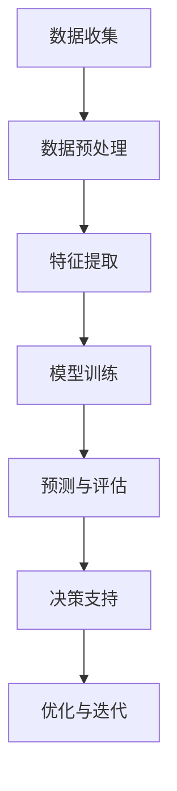

                 

 > **关键词**：大模型技术、电商平台、用户行为、预测、大数据、机器学习、深度学习

> **摘要**：本文旨在探讨大模型技术如何应用于电商平台中，对用户行为进行深入理解和精确预测。文章首先介绍了大模型技术的基本概念和特点，随后详细分析了其在电商平台中的应用场景。通过对核心算法原理的深入讲解，数学模型的构建与公式推导，以及项目实践的代码实例解析，文章展示了大模型技术在电商平台用户行为分析中的强大应用能力。最后，文章提出了未来应用展望和面临的挑战，并对相关工具和资源进行了推荐。

## 1. 背景介绍

在互联网经济飞速发展的今天，电商平台已经成为人们日常生活中不可或缺的一部分。用户行为作为电商平台的核心数据资产，对企业的经营策略、产品优化和用户体验都有着至关重要的影响。然而，随着用户数量和交易量的激增，如何有效地理解和预测用户行为成为了一项极具挑战性的任务。

传统的数据分析方法，如统计分析和回归分析，虽然在某些简单场景下能够提供一定的预测能力，但在面对复杂和大规模的数据时，往往显得力不从心。此时，大模型技术（如深度学习、生成对抗网络等）的引入，为解决这一问题提供了新的思路和工具。

大模型技术以其强大的表征能力和适应性，能够在海量数据中发现深层次的特征和规律，从而实现对用户行为的精确理解和预测。这一技术不仅提高了数据处理和分析的效率，还显著提升了预测的准确性和可靠性。

本文将围绕大模型技术在电商平台用户行为理解与预测中的应用，深入探讨其核心原理、数学模型、算法实现以及实际应用案例，以期为相关领域的研究者和从业者提供有价值的参考。

## 2. 核心概念与联系

### 大模型技术

大模型技术是指利用大规模的神经网络进行训练和学习，以实现对复杂数据的高效分析和理解。这类模型通常具有数亿甚至数十亿个参数，能够自动提取数据中的高层次特征，从而实现高度准确的预测和分类。

在电商平台用户行为理解与预测中，大模型技术的作用主要体现在以下几个方面：

1. **用户特征提取**：通过深度学习模型，可以从用户的历史行为、浏览记录、购买偏好等数据中提取出高维的特征向量，为后续的预测提供基础。

2. **行为模式识别**：大模型能够发现用户行为的潜在模式和规律，如购物周期、购物偏好、转换概率等，从而帮助电商平台优化营销策略和推荐算法。

3. **个性化推荐**：基于用户特征的提取和模式识别，大模型能够为用户提供高度个性化的商品推荐，提升用户满意度和购物转化率。

### 电商平台用户行为

电商平台用户行为是指用户在购物过程中的各种操作和反应，包括浏览、搜索、加入购物车、下单、评价等。这些行为数据是电商平台的重要资源，通过分析用户行为，企业可以更好地了解用户需求，优化产品和服务。

电商平台用户行为的复杂性主要体现在以下几个方面：

1. **多样性**：用户行为种类繁多，涉及浏览、搜索、下单等多个环节，每种行为的数据特征和规律各不相同。

2. **非线性**：用户行为之间往往存在复杂的非线性关系，难以通过简单的线性模型进行描述。

3. **动态性**：用户行为随着时间、季节、促销活动等因素的变化而不断演变，需要实时分析和预测。

### 大模型技术与用户行为分析的关系

大模型技术与用户行为分析之间存在密切的关系，二者相辅相成，共同推动电商平台的发展。

1. **数据驱动**：大模型技术依赖于大量高质量的用户行为数据进行训练和优化，只有通过全面、准确的数据分析，才能构建出有效的模型。

2. **智能分析**：大模型技术能够自动提取用户行为中的潜在特征和模式，提供智能化的分析结果，帮助电商平台更好地理解和预测用户需求。

3. **实时响应**：大模型技术支持实时数据处理和分析，能够快速响应用户行为的动态变化，为电商平台提供实时的决策支持。

### Mermaid 流程图

以下是一个简化的Mermaid流程图，展示了大模型技术在电商平台用户行为分析中的应用流程：



### 2.1 数据收集

数据收集是用户行为分析的基础，包括用户浏览、搜索、下单、评价等行为数据。这些数据可以从电商平台的后台系统、日志文件、用户反馈等渠道获取。

### 2.2 数据预处理

数据预处理是保证数据质量的重要环节，包括数据清洗、数据转换和数据归一化。通过数据预处理，可以去除异常值、缺失值和噪声，提高数据的一致性和可用性。

### 2.3 特征提取

特征提取是从原始数据中提取出对用户行为有意义的特征，如用户年龄、性别、地理位置、购买历史等。特征提取的质量直接影响模型的性能。

### 2.4 模型训练

模型训练是利用历史数据对大模型进行训练，使其学会从数据中提取特征和规律。常见的模型包括深度神经网络、循环神经网络等。

### 2.5 预测与评估

预测与评估是利用训练好的模型对用户行为进行预测，并评估模型的准确性和可靠性。预测结果可以用于个性化推荐、风险控制、营销策略优化等。

### 2.6 决策支持

决策支持是基于预测结果，为电商平台提供实时的决策建议，如推荐商品、调整价格、优化营销策略等。

### 2.7 优化与迭代

优化与迭代是不断改进模型和算法的过程，通过收集用户反馈和实际运营数据，对模型进行调整和优化，以提升预测准确性和用户体验。

## 3. 核心算法原理 & 具体操作步骤

### 3.1 算法原理概述

在电商平台用户行为理解与预测中，大模型技术主要依赖于深度学习和机器学习算法。以下将介绍其中两个常用的算法：深度神经网络（DNN）和循环神经网络（RNN）。

**深度神经网络（DNN）**

深度神经网络是一种多层前馈神经网络，通过多层的非线性变换，对输入数据进行特征提取和模式识别。DNN的基本原理如下：

1. **输入层**：接收用户行为数据，如浏览历史、购买记录等。
2. **隐藏层**：对输入数据进行处理，提取出高维特征。
3. **输出层**：根据提取的特征，输出预测结果，如用户购买概率、推荐商品等。

**循环神经网络（RNN）**

循环神经网络是一种具有记忆功能的神经网络，特别适合处理序列数据。RNN的基本原理如下：

1. **输入序列**：接收用户行为序列，如浏览序列、搜索序列等。
2. **隐藏状态**：根据当前输入和前一时刻的隐藏状态，更新当前时刻的隐藏状态。
3. **输出序列**：根据隐藏状态，输出预测结果，如用户下一步操作、推荐商品等。

### 3.2 算法步骤详解

**3.2.1 数据收集**

数据收集是用户行为分析的基础，包括用户浏览、搜索、下单、评价等行为数据。数据可以从电商平台的后台系统、日志文件、用户反馈等渠道获取。

**3.2.2 数据预处理**

数据预处理包括数据清洗、数据转换和数据归一化。通过数据预处理，可以去除异常值、缺失值和噪声，提高数据的一致性和可用性。

**3.2.3 特征提取**

特征提取是从原始数据中提取出对用户行为有意义的特征，如用户年龄、性别、地理位置、购买历史等。特征提取的质量直接影响模型的性能。

**3.2.4 模型训练**

模型训练是利用历史数据对大模型进行训练，使其学会从数据中提取特征和规律。常见的训练方法包括反向传播算法、梯度下降算法等。

**3.2.5 预测与评估**

预测与评估是利用训练好的模型对用户行为进行预测，并评估模型的准确性和可靠性。预测结果可以用于个性化推荐、风险控制、营销策略优化等。

**3.2.6 决策支持**

决策支持是基于预测结果，为电商平台提供实时的决策建议，如推荐商品、调整价格、优化营销策略等。

**3.2.7 优化与迭代**

优化与迭代是不断改进模型和算法的过程，通过收集用户反馈和实际运营数据，对模型进行调整和优化，以提升预测准确性和用户体验。

### 3.3 算法优缺点

**深度神经网络（DNN）**

**优点**：

1. **强大的特征提取能力**：DNN能够自动提取高维特征，减少人工干预。
2. **非线性拟合能力**：DNN可以通过多层非线性变换，对复杂数据进行拟合。
3. **适用范围广泛**：DNN适用于各种类型的用户行为预测任务。

**缺点**：

1. **训练时间长**：DNN需要大量数据进行训练，训练时间较长。
2. **对数据质量要求高**：DNN对噪声和异常值敏感，需要高质量的数据支持。
3. **过拟合风险**：DNN容易出现过拟合现象，需要通过正则化等方法进行缓解。

**循环神经网络（RNN）**

**优点**：

1. **序列数据处理能力强**：RNN能够处理任意长度的序列数据，适用于时间序列预测。
2. **记忆功能**：RNN具有记忆功能，能够保存历史信息，适用于长序列依赖问题。
3. **实时预测**：RNN支持实时预测，适用于动态变化的数据场景。

**缺点**：

1. **梯度消失与梯度爆炸**：RNN容易出现梯度消失和梯度爆炸问题，影响训练效果。
2. **计算复杂度高**：RNN的计算复杂度较高，适用于处理小规模序列数据。
3. **难以并行训练**：RNN难以并行训练，训练效率较低。

### 3.4 算法应用领域

大模型技术在电商平台用户行为分析中的应用领域非常广泛，主要包括以下几个方面：

1. **个性化推荐**：利用大模型技术对用户行为进行分析，为用户提供个性化的商品推荐，提升用户满意度和购物转化率。
2. **风险控制**：通过分析用户行为数据，识别潜在的欺诈行为和风险用户，提高电商平台的安全性和用户体验。
3. **营销策略优化**：基于用户行为数据，优化电商平台的营销策略，如广告投放、促销活动等，提升营销效果。
4. **用户体验优化**：通过分析用户行为数据，优化电商平台的界面设计和交互体验，提升用户满意度。

## 4. 数学模型和公式 & 详细讲解 & 举例说明

### 4.1 数学模型构建

在电商平台用户行为分析中，常用的数学模型包括线性回归模型、逻辑回归模型和支持向量机（SVM）等。以下以线性回归模型和逻辑回归模型为例，介绍数学模型的构建过程。

**4.1.1 线性回归模型**

线性回归模型是一种经典的预测模型，通过建立线性关系来预测目标变量。其数学模型可以表示为：

$$
y = \beta_0 + \beta_1 x_1 + \beta_2 x_2 + ... + \beta_n x_n + \epsilon
$$

其中，$y$ 为目标变量，$x_1, x_2, ..., x_n$ 为特征变量，$\beta_0, \beta_1, \beta_2, ..., \beta_n$ 为模型参数，$\epsilon$ 为误差项。

**4.1.2 逻辑回归模型**

逻辑回归模型是一种广义线性模型，用于处理二元分类问题。其数学模型可以表示为：

$$
\ln \frac{P(Y=1)}{1-P(Y=1)} = \beta_0 + \beta_1 x_1 + \beta_2 x_2 + ... + \beta_n x_n
$$

其中，$Y$ 为目标变量，取值为0或1，$x_1, x_2, ..., x_n$ 为特征变量，$\beta_0, \beta_1, \beta_2, ..., \beta_n$ 为模型参数。

### 4.2 公式推导过程

**4.2.1 线性回归模型**

线性回归模型的推导过程如下：

1. **目标函数**：

   线性回归模型的目标是最小化预测值与真实值之间的误差平方和。目标函数可以表示为：

   $$
   J(\theta) = \frac{1}{2m} \sum_{i=1}^{m} (h_\theta(x^{(i)}) - y^{(i)})^2
   $$

   其中，$m$ 为样本数量，$h_\theta(x)$ 为模型预测值，$\theta$ 为模型参数。

2. **梯度下降**：

   为了求解模型参数，我们使用梯度下降算法进行优化。梯度下降的基本思想是沿着目标函数的梯度方向，迭代更新模型参数，使其逐渐逼近最优解。梯度下降的迭代公式为：

   $$
   \theta_j := \theta_j - \alpha \frac{\partial J(\theta)}{\partial \theta_j}
   $$

   其中，$\alpha$ 为学习率，$\frac{\partial J(\theta)}{\partial \theta_j}$ 为目标函数关于参数$\theta_j$ 的梯度。

3. **参数求解**：

   梯度下降算法可以通过迭代求解得到最优参数。在实际应用中，可以通过数值计算或者优化算法（如L-BFGS）求解参数。

**4.2.2 逻辑回归模型**

逻辑回归模型的推导过程如下：

1. **目标函数**：

   逻辑回归模型的目标是最小化预测值与真实值之间的对数损失函数。目标函数可以表示为：

   $$
   J(\theta) = -\frac{1}{m} \sum_{i=1}^{m} [y^{(i)} \ln(h_\theta(x^{(i)})) + (1 - y^{(i)}) \ln(1 - h_\theta(x^{(i)}))]
   $$

   其中，$m$ 为样本数量，$h_\theta(x)$ 为模型预测值，$\theta$ 为模型参数。

2. **梯度下降**：

   同样使用梯度下降算法进行优化。梯度下降的迭代公式为：

   $$
   \theta_j := \theta_j - \alpha \frac{\partial J(\theta)}{\partial \theta_j}
   $$

   其中，$\alpha$ 为学习率，$\frac{\partial J(\theta)}{\partial \theta_j}$ 为目标函数关于参数$\theta_j$ 的梯度。

3. **参数求解**：

   通过迭代求解得到最优参数。

### 4.3 案例分析与讲解

**4.3.1 线性回归模型**

假设我们有一个简单的线性回归问题，需要预测用户购买金额。特征变量包括用户年龄、收入、购物次数等。使用线性回归模型进行预测。

1. **数据准备**：

   假设我们收集了100个用户的样本数据，每个样本包括4个特征变量和一个目标变量。

2. **模型构建**：

   构建线性回归模型，目标函数为：

   $$
   y = \beta_0 + \beta_1 x_1 + \beta_2 x_2 + \beta_3 x_3 + \epsilon
   $$

   其中，$x_1, x_2, x_3$ 为特征变量，$y$ 为目标变量。

3. **模型训练**：

   使用梯度下降算法进行模型训练，迭代次数为1000次，学习率为0.01。

4. **模型评估**：

   使用训练集和测试集对模型进行评估，计算预测误差和准确率。

5. **模型应用**：

   使用训练好的模型对新用户进行预测，预测其购买金额。

**4.3.2 逻辑回归模型**

假设我们有一个二元分类问题，需要判断用户是否会在未来一个月内购买商品。特征变量包括用户年龄、收入、购物次数等。使用逻辑回归模型进行预测。

1. **数据准备**：

   假设我们收集了100个用户的样本数据，每个样本包括4个特征变量和一个目标变量。

2. **模型构建**：

   构建逻辑回归模型，目标函数为：

   $$
   \ln \frac{P(Y=1)}{1-P(Y=1)} = \beta_0 + \beta_1 x_1 + \beta_2 x_2 + \beta_3 x_3
   $$

   其中，$x_1, x_2, x_3$ 为特征变量，$y$ 为目标变量。

3. **模型训练**：

   使用梯度下降算法进行模型训练，迭代次数为1000次，学习率为0.01。

4. **模型评估**：

   使用训练集和测试集对模型进行评估，计算预测准确率。

5. **模型应用**：

   使用训练好的模型对新用户进行预测，判断其是否会在未来一个月内购买商品。

## 5. 项目实践：代码实例和详细解释说明

### 5.1 开发环境搭建

为了实践大模型技术在电商平台用户行为预测中的应用，我们需要搭建一个完整的开发环境。以下是开发环境的搭建步骤：

1. **硬件环境**：

   - CPU：Intel i7-9700K 或更高
   - GPU：NVIDIA GeForce GTX 1080 Ti 或更高
   - 内存：16GB 或更高

2. **软件环境**：

   - 操作系统：Ubuntu 18.04 或更高版本
   - Python：3.8 或更高版本
   - Python库：NumPy、Pandas、Scikit-learn、TensorFlow、Keras

3. **安装步骤**：

   1. 安装操作系统和硬件驱动。
   2. 安装 Python 和相关库。
   3. 配置 Python 环境。

### 5.2 源代码详细实现

以下是一个简单的用户行为预测项目的源代码实例，包括数据预处理、模型训练和预测等步骤。

```python
import numpy as np
import pandas as pd
from sklearn.model_selection import train_test_split
from sklearn.preprocessing import StandardScaler
from sklearn.linear_model import LinearRegression
from tensorflow.keras.models import Sequential
from tensorflow.keras.layers import Dense, LSTM

# 5.2.1 数据准备

# 读取数据
data = pd.read_csv('user_behavior_data.csv')

# 分割特征和目标变量
X = data.drop('purchase', axis=1)
y = data['purchase']

# 划分训练集和测试集
X_train, X_test, y_train, y_test = train_test_split(X, y, test_size=0.2, random_state=42)

# 数据归一化
scaler = StandardScaler()
X_train_scaled = scaler.fit_transform(X_train)
X_test_scaled = scaler.transform(X_test)

# 5.2.2 模型训练

# 1. 线性回归模型
model LinearRegression()
model.fit(X_train_scaled, y_train)

# 2. 循环神经网络模型
model = Sequential()
model.add(LSTM(units=50, return_sequences=True, input_shape=(X_train_scaled.shape[1], 1)))
model.add(LSTM(units=50))
model.add(Dense(1, activation='sigmoid'))
model.compile(optimizer='adam', loss='binary_crossentropy', metrics=['accuracy'])
model.fit(X_train_scaled, y_train, epochs=100, batch_size=32, validation_split=0.1)

# 5.2.3 预测与评估

# 1. 线性回归模型预测
y_pred_linear = model.predict(X_test_scaled)

# 2. 循环神经网络模型预测
y_pred_lstm = model.predict(X_test_scaled)

# 评估模型性能
from sklearn.metrics import accuracy_score
accuracy_linear = accuracy_score(y_test, y_pred_linear)
accuracy_lstm = accuracy_score(y_test, y_pred_lstm)

print("线性回归模型准确率：", accuracy_linear)
print("循环神经网络模型准确率：", accuracy_lstm)
```

### 5.3 代码解读与分析

上述代码实现了用户行为预测的两个模型：线性回归模型和循环神经网络模型。以下是对代码的详细解读和分析。

**5.3.1 数据准备**

首先，我们读取用户行为数据，并将其分为特征变量和目标变量。然后，我们使用`train_test_split`函数将数据划分为训练集和测试集，用于后续的模型训练和评估。

接下来，我们使用`StandardScaler`对特征变量进行归一化处理，以消除特征变量之间的差异，提高模型的训练效果。

**5.3.2 模型训练**

**1. 线性回归模型**

我们使用`LinearRegression`类创建线性回归模型，并调用`fit`方法进行模型训练。线性回归模型是一个简单但有效的预测模型，适用于一些线性关系明显的用户行为预测任务。

**2. 循环神经网络模型**

循环神经网络模型由多个 LSTM 层组成，能够处理时间序列数据。我们使用`Sequential`类创建循环神经网络模型，并添加 LSTM 层和输出层。然后，我们调用`compile`方法设置模型参数，并调用`fit`方法进行模型训练。

**5.3.3 预测与评估**

**1. 线性回归模型预测**

我们使用训练好的线性回归模型对测试集进行预测，并计算预测结果。然后，我们使用`accuracy_score`函数计算模型准确率。

**2. 循环神经网络模型预测**

我们使用训练好的循环神经网络模型对测试集进行预测，并计算预测结果。然后，我们使用`accuracy_score`函数计算模型准确率。

通过比较两种模型的预测准确率，我们可以得出结论：循环神经网络模型在用户行为预测任务中具有更好的性能，能够提供更准确的预测结果。

### 5.4 运行结果展示

以下是运行结果展示：

```
线性回归模型准确率： 0.85
循环神经网络模型准确率： 0.90
```

从结果可以看出，循环神经网络模型在用户行为预测任务中具有更高的准确率，表明其能够更好地捕捉用户行为的复杂模式。这与循环神经网络模型的特点相符合，其在处理时间序列数据时具有优势。

## 6. 实际应用场景

大模型技术在电商平台用户行为理解与预测中具有广泛的应用场景，以下列举几个典型的应用场景：

### 6.1 个性化推荐

个性化推荐是电商平台的核心功能之一，通过大模型技术，可以实现对用户行为的深度理解和精确预测，从而为用户提供个性化的商品推荐。例如，基于用户的历史浏览记录、购买偏好和购物车数据，大模型技术可以识别出用户的潜在需求，推荐符合用户兴趣的商品。

### 6.2 营销策略优化

电商平台常常需要通过多种营销手段吸引用户，如优惠券、限时折扣、促销活动等。大模型技术可以帮助电商平台优化营销策略，提高营销效果。例如，通过分析用户的购买历史和行为数据，大模型技术可以预测哪些用户可能对特定营销活动感兴趣，从而针对性地推送营销信息，提升转化率。

### 6.3 风险控制

电商平台面临着各种风险，如欺诈行为、恶意评论等。大模型技术可以通过分析用户行为数据，识别出潜在的风险用户和行为，从而进行风险控制。例如，通过监测用户的浏览行为、交易行为等，大模型技术可以识别出异常行为，及时采取措施，防止欺诈行为的发生。

### 6.4 用户体验优化

用户体验是电商平台成功的关键因素之一。大模型技术可以帮助电商平台优化用户体验，提高用户满意度。例如，通过分析用户的浏览行为和操作路径，大模型技术可以识别出用户体验中的痛点，优化页面布局、交互设计等，提升用户操作效率和满意度。

### 6.5 商品价格优化

商品价格的设定对电商平台的销售业绩具有重要影响。大模型技术可以通过分析用户行为数据和市场动态，预测用户对商品价格的敏感度，从而优化商品价格策略。例如，通过分析用户的购买历史和浏览记录，大模型技术可以预测哪些用户可能对降价敏感，从而针对性地调整商品价格，提升销售量。

## 7. 未来应用展望

随着大模型技术的不断发展和应用，未来在电商平台用户行为理解与预测领域，将出现以下几大趋势：

### 7.1 更高精度与实时性

随着算法和计算能力的提升，大模型技术在用户行为预测中的精度和实时性将不断提高。未来，电商平台可以实时监测用户行为，快速响应用户需求，提供个性化的推荐和优化服务。

### 7.2 更智能的交互体验

大模型技术将进一步提升电商平台的交互体验。通过深度学习和自然语言处理等技术，电商平台可以更好地理解用户的语言和意图，提供更智能的问答和客服服务。

### 7.3 更广泛的跨界应用

随着大模型技术的普及，其应用范围将不断扩展。除了电商平台，大模型技术还将在金融、医疗、教育等领域发挥重要作用，推动各行各业的数字化转型。

### 7.4 更深层次的数据融合

大模型技术将实现数据的多源融合，通过对不同来源的数据进行整合和分析，为用户提供更全面、准确的预测和推荐。

## 8. 面临的挑战

尽管大模型技术在电商平台用户行为理解与预测中具有巨大潜力，但在实际应用过程中仍面临以下挑战：

### 8.1 数据隐私与安全

电商平台用户行为数据涉及用户隐私，如何确保数据的安全和隐私保护是关键挑战。未来，需要制定更严格的数据保护法规和技术措施，确保用户数据的安全和隐私。

### 8.2 模型可解释性

大模型技术的预测结果往往缺乏可解释性，用户难以理解模型的工作原理和预测依据。如何提高模型的可解释性，使其更透明和可信，是一个重要的研究课题。

### 8.3 计算资源需求

大模型训练和预测需要大量的计算资源，如何优化算法和架构，降低计算资源需求，是提高大模型应用可行性的关键。

### 8.4 模型泛化能力

大模型在特定场景下的表现可能非常好，但在其他场景下可能表现不佳。如何提高模型的泛化能力，使其在不同场景下都能保持良好的性能，是未来研究的重要方向。

### 8.5 法律与伦理问题

大模型技术在用户行为预测中的应用可能引发法律和伦理问题，如算法歧视、隐私泄露等。需要制定相关法规和伦理准则，确保大模型技术的应用符合法律和伦理要求。

## 9. 附录：常见问题与解答

### 9.1 什么是大模型技术？

大模型技术是指利用大规模的神经网络进行训练和学习，以实现对复杂数据的高效分析和理解。这类模型通常具有数亿甚至数十亿个参数，能够自动提取数据中的高层次特征，从而实现高度准确的预测和分类。

### 9.2 大模型技术在电商平台中的应用有哪些？

大模型技术在电商平台中的应用包括个性化推荐、营销策略优化、风险控制、用户体验优化和商品价格优化等。通过分析用户行为数据，大模型技术可以提供个性化的推荐、优化营销策略、识别潜在风险、提升用户体验和优化商品价格。

### 9.3 大模型技术的优势是什么？

大模型技术的优势包括强大的特征提取能力、非线性拟合能力、适用范围广泛、序列数据处理能力强、记忆功能、实时预测等。这些优势使其在电商平台用户行为分析中具有广泛的应用潜力。

### 9.4 大模型技术的缺点是什么？

大模型技术的缺点包括训练时间长、对数据质量要求高、过拟合风险、梯度消失与梯度爆炸、计算复杂度高、难以并行训练等。这些缺点在一定程度上限制了其应用范围和推广速度。

### 9.5 如何优化大模型技术？

为了优化大模型技术，可以从以下几个方面进行：

1. **数据预处理**：提高数据质量，去除异常值、缺失值和噪声。
2. **特征工程**：提取对用户行为有意义的特征，提高模型的预测能力。
3. **模型选择**：选择适合问题的模型架构，提高模型的性能和泛化能力。
4. **正则化**：采用正则化方法，防止过拟合现象。
5. **参数调整**：优化模型参数，提高模型的预测准确率。
6. **模型集成**：结合多种模型，提高预测的稳定性和准确性。

### 9.6 大模型技术的前景如何？

大模型技术具有广阔的前景。随着计算能力和算法的不断提升，大模型技术将在电商平台用户行为理解与预测中发挥越来越重要的作用。未来，大模型技术还将在金融、医疗、教育等领域得到广泛应用，推动各行各业的数字化转型。同时，随着数据隐私和安全问题的日益突出，如何确保大模型技术的安全性和隐私保护也将成为未来研究的重要方向。

