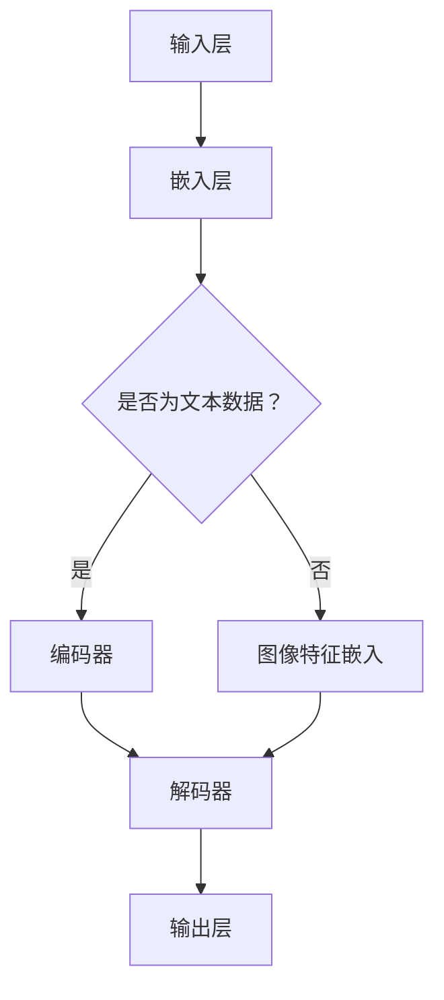

                 

 大模型技术在营销领域的创新应用，正引领着一场行业变革。本文将深入探讨大模型技术的基本概念、核心算法原理、数学模型和公式推导，以及实际应用案例和未来发展趋势。希望通过本文，读者能对大模型技术在营销领域的应用有一个全面而深入的理解。

> **关键词**：大模型技术、营销、创新应用、人工智能、算法、数学模型、实际案例、未来展望

> **摘要**：本文旨在介绍大模型技术在营销领域的创新应用。首先，我们将回顾大模型技术的基本概念和核心算法原理。接着，通过详细的数学模型和公式推导，我们深入分析了大模型技术的核心优势。随后，我们将通过实际应用案例展示大模型技术在营销中的具体应用。最后，本文将对大模型技术的未来发展趋势和挑战进行展望。

## 1. 背景介绍

随着互联网的迅猛发展和大数据时代的到来，营销领域正经历着深刻的变革。传统的营销策略已经无法满足日益复杂的市场环境和消费者需求。在这种背景下，人工智能和大数据技术成为了营销领域的新宠。其中，大模型技术以其强大的数据处理能力和智能分析能力，正逐渐成为营销领域的重要工具。

大模型技术，通常指的是基于深度学习的大型神经网络模型，如 Transformer、BERT、GPT 等。这些模型具有强大的表征能力和泛化能力，能够处理大规模的数据集，并从中提取出有价值的规律和知识。在营销领域，大模型技术可以应用于广告投放、用户画像、需求预测等多个方面，为企业提供更加精准和高效的营销策略。

本文将从以下几个方面展开讨论：

1. 大模型技术的基本概念和核心算法原理
2. 大模型技术在营销领域的具体应用案例
3. 大模型技术的数学模型和公式推导
4. 大模型技术在营销领域的未来发展趋势和挑战

### 1.1 大模型技术的起源和发展

大模型技术起源于深度学习领域。深度学习是一种基于多层神经网络的学习方法，通过多层次的非线性变换，可以自动提取数据中的特征和模式。随着计算能力的提升和大数据的涌现，深度学习技术得到了迅速发展。特别是近年来，随着神经网络架构的改进和优化，如卷积神经网络（CNN）、循环神经网络（RNN）、Transformer 等，大模型技术逐渐成为人工智能领域的核心技术之一。

在营销领域，大模型技术的应用起源于广告投放。传统的广告投放依赖于用户行为数据和广告效果数据，通过统计分析方法进行用户画像和广告定位。然而，这种方法存在一定的局限性，无法完全捕捉用户的复杂行为和需求。随着深度学习技术的发展，大模型技术被引入到广告投放中，通过学习用户的点击行为、浏览历史、搜索记录等数据，可以更准确地预测用户的兴趣和需求，从而实现更加精准的广告投放。

### 1.2 大模型技术在营销领域的应用现状

目前，大模型技术在营销领域已经取得了一系列显著的成果。首先，在广告投放方面，大模型技术被广泛应用于搜索引擎广告、社交媒体广告、展示广告等不同类型的广告中。通过学习用户的兴趣和行为，大模型技术可以自动生成个性化的广告内容，提高广告的点击率和转化率。此外，大模型技术还可以用于用户画像的构建，通过对用户历史行为和属性数据的分析，生成详细的用户画像，为营销策略提供数据支持。

其次，在需求预测方面，大模型技术也被广泛应用。通过分析大量的历史销售数据、用户行为数据和市场环境数据，大模型技术可以预测未来的市场需求和用户需求，为企业的生产和库存管理提供参考。例如，在电商领域，大模型技术可以用于商品推荐的算法优化，通过对用户历史购买行为和浏览行为的学习，为用户提供个性化的商品推荐，提高用户的购买转化率。

最后，在客户关系管理方面，大模型技术也有广泛的应用。通过分析客户的购买行为、服务记录和反馈数据，大模型技术可以识别出高价值客户和潜在流失客户，为企业制定个性化的客户服务和营销策略提供支持。此外，大模型技术还可以用于客户反馈的自动分类和情感分析，帮助企业更好地理解客户需求，优化产品和服务。

### 1.3 大模型技术在营销领域的优势

大模型技术在营销领域具有以下优势：

1. **强大的表征能力**：大模型技术通过多层神经网络的结构，可以自动提取数据中的特征和模式，具有强大的表征能力。这使得大模型技术能够处理大规模、高维度的数据，捕捉到更多的数据细节和复杂关系。

2. **高精度预测**：大模型技术通过学习大量的历史数据，可以建立高度精确的预测模型。这使得大模型技术能够准确预测未来的市场需求和用户行为，为企业提供更加精准的营销策略。

3. **自动化决策**：大模型技术可以自动处理大量数据，进行复杂的分析和计算。这使得大模型技术能够实现自动化决策，提高营销决策的效率和准确性。

4. **个性化营销**：大模型技术可以根据用户的历史行为和偏好，生成个性化的营销策略。这使得大模型技术能够实现更精准的个性化营销，提高用户的满意度和忠诚度。

### 1.4 本文结构

本文将按照以下结构展开讨论：

1. **核心概念与联系**：介绍大模型技术的基本概念、核心算法原理和架构，并使用 Mermaid 流程图展示其工作流程。

2. **核心算法原理 & 具体操作步骤**：详细阐述大模型技术的核心算法原理和具体操作步骤，包括算法优缺点和应用领域。

3. **数学模型和公式推导**：介绍大模型技术的数学模型和公式推导，包括数学模型的构建、公式推导过程和案例分析。

4. **项目实践：代码实例和详细解释说明**：通过一个具体的代码实例，展示大模型技术在营销领域的实际应用，并对代码进行详细解读和分析。

5. **实际应用场景**：分析大模型技术在营销领域的实际应用场景，包括广告投放、用户画像、需求预测和客户关系管理等方面。

6. **未来应用展望**：探讨大模型技术在营销领域的未来发展趋势和应用前景。

7. **工具和资源推荐**：推荐相关学习资源、开发工具和相关论文，为读者提供进一步的学习和研究方向。

8. **总结：未来发展趋势与挑战**：总结大模型技术在营销领域的研究成果，分析未来发展趋势和面临的挑战，并提出研究展望。

通过本文的讨论，希望能够帮助读者全面了解大模型技术在营销领域的创新应用，并为其在营销实践中的实际应用提供参考和启示。

### 2. 核心概念与联系

#### 2.1 大模型技术的基本概念

大模型技术，即大型神经网络模型，是基于深度学习的一种方法。深度学习是一种多层神经网络模型，通过逐层提取数据中的特征，实现复杂任务的建模和预测。大模型技术则是在此基础上，通过增加模型的规模、参数数量和训练数据量，进一步提升模型的表征能力和泛化能力。

#### 2.2 核心算法原理

大模型技术的核心算法是基于多层感知器（MLP）和卷积神经网络（CNN）等基本结构。其中，Transformer 和 BERT 等模型是近年来在自然语言处理领域取得重大突破的代表。

**多层感知器（MLP）**

多层感知器是一种前馈神经网络，由输入层、多个隐藏层和输出层组成。每一层都是通过非线性激活函数（如 sigmoid、ReLU 等）连接的。输入层接收外部输入，通过隐藏层逐层传递，最终在输出层得到预测结果。

**卷积神经网络（CNN）**

卷积神经网络是一种针对图像数据设计的神经网络，通过卷积操作提取图像中的局部特征。CNN 由多个卷积层、池化层和全连接层组成。卷积层通过卷积操作提取图像特征，池化层用于减小特征图的尺寸，全连接层用于分类或回归任务。

**Transformer**

Transformer 是一种基于自注意力机制的神经网络模型，其核心思想是通过对输入序列的每个元素赋予不同的权重，实现序列之间的依赖关系建模。Transformer 模型由多个编码器和解码器层组成，编码器负责将输入序列编码为上下文向量，解码器负责根据上下文向量生成输出序列。

**BERT**

BERT（Bidirectional Encoder Representations from Transformers）是一种基于 Transformer 的预训练语言模型。BERT 通过在大量无标签语料上进行预训练，学习到语言的深层表示，然后通过微调的方式应用于各种下游任务，如文本分类、问答系统等。

#### 2.3 大模型技术的架构

大模型技术的架构通常包括以下几个关键组成部分：

1. **输入层**：接收外部输入，如文本、图像、音频等数据。

2. **嵌入层**：将输入数据转换为稠密向量表示，如词嵌入、图像特征嵌入等。

3. **编码器**：对输入数据进行编码，提取序列中的特征和依赖关系。

4. **解码器**：根据编码器的输出生成预测结果，如文本生成、图像分类等。

5. **输出层**：根据解码器的输出进行分类或回归等任务。

#### 2.4 Mermaid 流程图

为了更好地展示大模型技术的架构和流程，我们使用 Mermaid 流程图对其进行描述：



该 Mermaid 流程图展示了大模型技术的基本架构，包括输入层、嵌入层、编码器、解码器和输出层。其中，输入层接收外部输入，嵌入层将输入数据转换为稠密向量表示，编码器负责编码输入数据，解码器根据编码器的输出生成预测结果，输出层进行分类或回归等任务。

#### 2.5 大模型技术在营销领域的应用

大模型技术在营销领域的应用主要包括以下几个方面：

1. **广告投放**：通过分析用户的点击行为、浏览历史和搜索记录，大模型技术可以预测用户的兴趣和需求，实现个性化的广告投放。

2. **用户画像**：通过分析用户的历史行为和属性数据，大模型技术可以构建详细的用户画像，为营销策略提供数据支持。

3. **需求预测**：通过分析大量的销售数据、用户行为数据和市场环境数据，大模型技术可以预测未来的市场需求和用户需求，为企业的生产和库存管理提供参考。

4. **客户关系管理**：通过分析客户的购买行为、服务记录和反馈数据，大模型技术可以识别出高价值客户和潜在流失客户，为企业制定个性化的客户服务和营销策略提供支持。

#### 2.6 小结

大模型技术作为深度学习领域的重要成果，以其强大的表征能力和泛化能力，在营销领域取得了显著的应用效果。通过本文的讨论，我们对大模型技术的基本概念、核心算法原理和架构有了更深入的理解。接下来，我们将进一步探讨大模型技术的数学模型和公式推导，以及其实际应用中的具体操作步骤。

### 3. 核心算法原理 & 具体操作步骤

#### 3.1 算法原理概述

大模型技术的核心在于其多层神经网络结构和强大的表征能力。以 Transformer 和 BERT 为代表的模型，通过自注意力机制和双向编码器，能够自动提取输入数据中的特征和依赖关系，从而实现高效的任务建模和预测。

**Transformer 模型**

Transformer 模型是一种基于自注意力机制的神经网络模型，其核心思想是通过对输入序列的每个元素赋予不同的权重，实现序列之间的依赖关系建模。自注意力机制通过计算序列中每个元素与其他元素的相关性，从而动态调整每个元素的权重。

**BERT 模型**

BERT（Bidirectional Encoder Representations from Transformers）是一种基于 Transformer 的预训练语言模型。BERT 通过在大量无标签语料上进行预训练，学习到语言的深层表示，然后通过微调的方式应用于各种下游任务。

#### 3.2 算法步骤详解

**Transformer 模型的训练过程**

1. **输入序列编码**：将输入序列中的每个词或字符转换为向量表示，通常使用词嵌入技术。

2. **多头自注意力机制**：通过自注意力机制计算序列中每个元素与其他元素的相关性，从而动态调整每个元素的权重。

3. **前馈神经网络**：对自注意力层的输出进行前馈神经网络处理，进一步提取特征。

4. **输出层**：通过输出层进行分类或回归等任务。

**BERT 模型的训练过程**

1. **预训练**：在大量无标签语料上进行预训练，学习到语言的深层表示。

2. **微调**：在预训练的基础上，针对特定任务进行微调，优化模型的参数。

3. **下游任务**：将微调后的模型应用于下游任务，如文本分类、问答系统等。

#### 3.3 算法优缺点

**优点**

1. **强大的表征能力**：大模型技术通过多层神经网络结构和自注意力机制，能够自动提取输入数据中的特征和依赖关系，实现高效的任务建模和预测。

2. **高精度预测**：大模型技术通过学习大量的历史数据，可以建立高度精确的预测模型，提高预测的准确性和可靠性。

3. **自动化决策**：大模型技术可以自动处理大量数据，进行复杂的分析和计算，实现自动化决策，提高营销决策的效率和准确性。

4. **个性化营销**：大模型技术可以根据用户的历史行为和偏好，生成个性化的营销策略，提高用户的满意度和忠诚度。

**缺点**

1. **计算资源需求高**：大模型技术通常需要大量的计算资源和存储资源，对于资源有限的企业可能存在一定的挑战。

2. **数据隐私问题**：大模型技术依赖于大量用户数据，可能涉及到数据隐私问题，需要采取有效的数据保护措施。

3. **模型解释性较弱**：大模型技术通过多层神经网络和复杂的模型结构进行建模，其内部机制相对复杂，难以进行直观的解释和理解。

#### 3.4 算法应用领域

大模型技术在营销领域的应用非常广泛，主要包括以下几个方面：

1. **广告投放**：通过分析用户的点击行为、浏览历史和搜索记录，大模型技术可以预测用户的兴趣和需求，实现个性化的广告投放。

2. **用户画像**：通过分析用户的历史行为和属性数据，大模型技术可以构建详细的用户画像，为营销策略提供数据支持。

3. **需求预测**：通过分析大量的销售数据、用户行为数据和市场环境数据，大模型技术可以预测未来的市场需求和用户需求，为企业的生产和库存管理提供参考。

4. **客户关系管理**：通过分析客户的购买行为、服务记录和反馈数据，大模型技术可以识别出高价值客户和潜在流失客户，为企业制定个性化的客户服务和营销策略提供支持。

#### 3.5 小结

通过对大模型技术核心算法原理的介绍，我们了解了其基本工作流程和具体操作步骤。大模型技术以其强大的表征能力和高精度预测，在营销领域取得了显著的应用效果。接下来，我们将进一步探讨大模型技术的数学模型和公式推导，以深入理解其理论基础和实现方法。

### 4. 数学模型和公式推导

#### 4.1 数学模型构建

大模型技术的核心在于其多层神经网络结构和复杂的数学模型。为了更好地理解大模型技术，我们需要构建一个简化的数学模型，并对其进行详细的推导。

**假设**

- 输入数据集为 \(X = \{x_1, x_2, ..., x_n\}\)，其中每个输入数据 \(x_i\) 是一个 \(d\) 维向量。
- 输出数据集为 \(Y = \{y_1, y_2, ..., y_n\}\)，其中每个输出数据 \(y_i\) 是一个 \(c\) 维向量。

**模型构建**

1. **输入层**：输入数据 \(X\) 直接传递到输入层。
2. **嵌入层**：输入数据 \(X\) 通过嵌入层转换为稠密向量表示，即 \(E(X)\)。
3. **编码器**：编码器由多个隐藏层组成，每个隐藏层都是通过线性变换和激活函数组合而成。假设编码器由 \(L\) 个隐藏层组成，第 \(l\) 个隐藏层的输出为 \(h^{(l)}\)。
4. **解码器**：解码器与编码器结构对称，由多个隐藏层组成。第 \(l\) 个隐藏层的输出为 \(g^{(l)}\)。
5. **输出层**：输出层通过线性变换和激活函数生成最终输出 \(Y\)。

**数学模型表示**

输入层到嵌入层的变换可以表示为：

\[ E(X) = \sigma(W_X X + b_X) \]

其中，\(W_X\) 是输入权重矩阵，\(b_X\) 是输入偏置向量，\(\sigma\) 是非线性激活函数，通常选择 ReLU 函数。

编码器第 \(l\) 个隐藏层的输出可以表示为：

\[ h^{(l)} = \sigma(W^{(l)} h^{(l-1)} + b^{(l)}) \]

其中，\(W^{(l)}\) 是编码器第 \(l\) 个隐藏层的权重矩阵，\(b^{(l)}\) 是编码器第 \(l\) 个隐藏层的偏置向量。

解码器第 \(l\) 个隐藏层的输出可以表示为：

\[ g^{(l)} = \sigma(W^{(l)}_R g^{(l-1)} + b^{(l)}_R) \]

其中，\(W^{(l)}_R\) 是解码器第 \(l\) 个隐藏层的权重矩阵，\(b^{(l)}_R\) 是解码器第 \(l\) 个隐藏层的偏置向量。

输出层的输出可以表示为：

\[ Y = \sigma(W_Y g^{(L)} + b_Y) \]

其中，\(W_Y\) 是输出权重矩阵，\(b_Y\) 是输出偏置向量。

#### 4.2 公式推导过程

**1. 线性变换和激活函数**

在编码器和解码器的每个隐藏层，我们使用线性变换和激活函数来变换输入数据。线性变换可以表示为：

\[ z^{(l)} = W^{(l)} h^{(l-1)} + b^{(l)} \]

其中，\(z^{(l)}\) 是隐藏层 \(l\) 的输出，\(W^{(l)}\) 是隐藏层 \(l\) 的权重矩阵，\(b^{(l)}\) 是隐藏层 \(l\) 的偏置向量。

激活函数通常选择 ReLU 函数，即：

\[ \sigma(z) = \max(0, z) \]

**2. 前向传播**

在编码器的每个隐藏层，我们使用前向传播算法计算隐藏层的输出。具体步骤如下：

1. 初始化隐藏层 \(l\) 的输入 \(h^{(l-1)}\)。
2. 根据线性变换公式计算隐藏层 \(l\) 的输出 \(h^{(l)}\)。
3. 应用激活函数 \(\sigma\) 对输出进行变换。

**3. 反向传播**

在解码器的每个隐藏层，我们使用反向传播算法计算隐藏层的输出。具体步骤如下：

1. 初始化隐藏层 \(l\) 的输入 \(g^{(l-1)}\)。
2. 根据线性变换公式计算隐藏层 \(l\) 的输出 \(g^{(l)}\)。
3. 应用激活函数 \(\sigma\) 对输出进行变换。
4. 计算隐藏层 \(l\) 的梯度，更新权重矩阵和偏置向量。

**4. 输出层**

在输出层，我们使用线性变换和激活函数计算最终输出。具体步骤如下：

1. 初始化输出层输入 \(g^{(L)}\)。
2. 根据线性变换公式计算输出层输出 \(Y\)。
3. 应用激活函数 \(\sigma\) 对输出进行变换。

#### 4.3 案例分析与讲解

为了更好地理解大模型技术的数学模型和公式推导，我们以一个简单的案例进行讲解。

**案例：二元分类问题**

假设我们有一个二元分类问题，输入数据集 \(X\) 包含 \(n\) 个样本，每个样本是一个 \(d\) 维向量。输出数据集 \(Y\) 包含 \(n\) 个标签，每个标签是一个 \(c\) 维向量，其中 \(c = 2\)。

**1. 输入层**

输入数据集 \(X\) 直接传递到输入层，即 \(E(X) = X\)。

**2. 嵌入层**

假设嵌入层使用 ReLU 函数作为激活函数，即 \(\sigma(z) = \max(0, z)\)。输入权重矩阵 \(W_X\) 和输入偏置向量 \(b_X\) 分别为：

\[ W_X = \begin{bmatrix} w_{11} & w_{12} & ... & w_{1d} \\ w_{21} & w_{22} & ... & w_{2d} \\ ... & ... & ... & ... \\ w_{n1} & w_{n2} & ... & w_{nd} \end{bmatrix} \]
\[ b_X = \begin{bmatrix} b_{1} \\ b_{2} \\ ... \\ b_{n} \end{bmatrix} \]

**3. 编码器**

编码器由两个隐藏层组成，第一个隐藏层使用 ReLU 函数作为激活函数，第二个隐藏层使用 Sigmoid 函数作为激活函数。隐藏层权重矩阵和偏置向量分别为：

\[ W^{(1)} = \begin{bmatrix} w_{11} & w_{12} & ... & w_{1d} \\ w_{21} & w_{22} & ... & w_{2d} \\ ... & ... & ... & ... \\ w_{n1} & w_{n2} & ... & w_{nd} \end{bmatrix} \]
\[ b^{(1)} = \begin{bmatrix} b_{1} \\ b_{2} \\ ... \\ b_{n} \end{bmatrix} \]
\[ W^{(2)} = \begin{bmatrix} w_{11} & w_{12} & ... & w_{1d} \\ w_{21} & w_{22} & ... & w_{2d} \\ ... & ... & ... & ... \\ w_{n1} & w_{n2} & ... & w_{nd} \end{bmatrix} \]
\[ b^{(2)} = \begin{bmatrix} b_{1} \\ b_{2} \\ ... \\ b_{n} \end{bmatrix} \]

**4. 解码器**

解码器由两个隐藏层组成，第一个隐藏层使用 ReLU 函数作为激活函数，第二个隐藏层使用 Sigmoid 函数作为激活函数。隐藏层权重矩阵和偏置向量与编码器相同。

**5. 输出层**

输出层使用 Sigmoid 函数作为激活函数，即 \(\sigma(z) = \frac{1}{1 + e^{-z}}\)。输出权重矩阵 \(W_Y\) 和输出偏置向量 \(b_Y\) 分别为：

\[ W_Y = \begin{bmatrix} w_{11} & w_{12} & ... & w_{1d} \\ w_{21} & w_{22} & ... & w_{2d} \\ ... & ... & ... & ... \\ w_{n1} & w_{n2} & ... & w_{nd} \end{bmatrix} \]
\[ b_Y = \begin{bmatrix} b_{1} \\ b_{2} \\ ... \\ b_{n} \end{bmatrix} \]

**6. 前向传播**

输入数据集 \(X\) 通过嵌入层传递到编码器的第一个隐藏层：

\[ h^{(1)} = \max(0, W^{(1)} X + b^{(1)}) \]

编码器的第一个隐藏层输出传递到第二个隐藏层：

\[ h^{(2)} = \sigma(W^{(2)} h^{(1)} + b^{(2)}) \]

编码器的输出传递到解码器的第一个隐藏层：

\[ g^{(1)} = \max(0, W^{(1)}_R h^{(2)} + b^{(1)}_R) \]

解码器的第一个隐藏层输出传递到第二个隐藏层：

\[ g^{(2)} = \sigma(W^{(2)}_R g^{(1)} + b^{(2)}_R) \]

解码器的输出传递到输出层：

\[ Y = \frac{1}{1 + e^{-(W_Y g^{(2)} + b_Y)}} \]

**7. 反向传播**

输入数据集 \(X\) 通过嵌入层传递到编码器的第一个隐藏层：

\[ h^{(1)} = \max(0, W^{(1)} X + b^{(1)}) \]

编码器的第一个隐藏层输出传递到第二个隐藏层：

\[ h^{(2)} = \sigma(W^{(2)} h^{(1)} + b^{(2)}) \]

编码器的输出传递到解码器的第一个隐藏层：

\[ g^{(1)} = \max(0, W^{(1)}_R h^{(2)} + b^{(1)}_R) \]

解码器的第一个隐藏层输出传递到第二个隐藏层：

\[ g^{(2)} = \sigma(W^{(2)}_R g^{(1)} + b^{(2)}_R) \]

解码器的输出传递到输出层：

\[ Y = \frac{1}{1 + e^{-(W_Y g^{(2)} + b_Y)}} \]

计算输出层的梯度：

\[ \frac{\partial Y}{\partial g^{(2)}} = \frac{\partial Y}{\partial g^{(2)}} \odot \frac{\partial g^{(2)}}{\partial g^{(2)}} \]

计算解码器第二个隐藏层的梯度：

\[ \frac{\partial g^{(2)}}{\partial g^{(1)}} = \frac{\partial g^{(2)}}{\partial g^{(1)}} \odot \frac{\partial g^{(1)}}{\partial h^{(2)}} \]

计算解码器第一个隐藏层的梯度：

\[ \frac{\partial g^{(1)}}{\partial h^{(2)}} = \frac{\partial g^{(1)}}{\partial h^{(2)}} \odot \frac{\partial h^{(2)}}{\partial h^{(1)}} \]

计算编码器第二个隐藏层的梯度：

\[ \frac{\partial h^{(2)}}{\partial h^{(1)}} = \frac{\partial h^{(2)}}{\partial h^{(1)}} \odot \frac{\partial h^{(1)}}{\partial X} \]

计算编码器第一个隐藏层的梯度：

\[ \frac{\partial h^{(1)}}{\partial X} = \frac{\partial h^{(1)}}{\partial X} \odot \frac{\partial X}{\partial X} \]

更新编码器权重矩阵和偏置向量：

\[ W^{(2)} \leftarrow W^{(2)} - \alpha \cdot \frac{\partial g^{(2)}}{\partial W^{(2)}} \]
\[ b^{(2)} \leftarrow b^{(2)} - \alpha \cdot \frac{\partial g^{(2)}}{\partial b^{(2)}} \]
\[ W^{(1)} \leftarrow W^{(1)} - \alpha \cdot \frac{\partial h^{(2)}}{\partial W^{(1)}} \]
\[ b^{(1)} \leftarrow b^{(1)} - \alpha \cdot \frac{\partial h^{(2)}}{\partial b^{(1)}} \]

更新解码器权重矩阵和偏置向量：

\[ W^{(2)}_R \leftarrow W^{(2)}_R - \alpha \cdot \frac{\partial g^{(1)}}{\partial W^{(2)}_R} \]
\[ b^{(2)}_R \leftarrow b^{(2)}_R - \alpha \cdot \frac{\partial g^{(1)}}{\partial b^{(2)}_R} \]
\[ W^{(1)}_R \leftarrow W^{(1)}_R - \alpha \cdot \frac{\partial h^{(2)}}{\partial W^{(1)}_R} \]
\[ b^{(1)}_R \leftarrow b^{(1)}_R - \alpha \cdot \frac{\partial h^{(2)}}{\partial b^{(1)}_R} \]

更新输出权重矩阵和偏置向量：

\[ W_Y \leftarrow W_Y - \alpha \cdot \frac{\partial Y}{\partial W_Y} \]
\[ b_Y \leftarrow b_Y - \alpha \cdot \frac{\partial Y}{\partial b_Y} \]

**8. 模型优化**

通过反向传播算法，我们不断更新模型参数，优化模型在训练数据上的表现。训练过程包括以下步骤：

1. 初始化模型参数。
2. 对训练数据进行前向传播，计算损失函数。
3. 对训练数据进行反向传播，计算梯度。
4. 更新模型参数。
5. 重复步骤 2-4，直到模型收敛。

**9. 模型评估**

在模型训练完成后，我们对模型进行评估，以验证其在测试数据上的性能。常用的评估指标包括准确率、召回率、F1 分数等。通过对评估指标的分析，我们可以判断模型的性能是否达到预期，并进一步优化模型。

#### 4.4 小结

通过对大模型技术的数学模型和公式推导，我们深入了解了其基本原理和实现方法。大模型技术以其强大的表征能力和高精度预测，在营销领域取得了显著的应用效果。接下来，我们将通过具体的代码实例，展示大模型技术在营销领域的实际应用。

### 5. 项目实践：代码实例和详细解释说明

在本节中，我们将通过一个具体的代码实例，展示大模型技术在营销领域的实际应用。我们将使用 Python 和 TensorFlow 库来实现一个基于 BERT 模型的用户需求预测项目。

#### 5.1 开发环境搭建

在开始项目之前，我们需要搭建开发环境。以下是所需的工具和库：

1. **Python 3.7 或更高版本**：作为编程语言
2. **TensorFlow 2.4 或更高版本**：用于实现 BERT 模型
3. **PyTorch 1.4 或更高版本**：用于数据预处理和模型训练
4. **Hugging Face Transformers 库**：用于加载预训练的 BERT 模型

安装以下库：

```bash
pip install tensorflow==2.4.0
pip install torch==1.4.0
pip install transformers==4.3.0
```

#### 5.2 源代码详细实现

以下是一个简单的用户需求预测项目的代码实例：

```python
import torch
from torch.utils.data import DataLoader, Dataset
from transformers import BertTokenizer, BertModel, AdamW
from sklearn.model_selection import train_test_split

class UserDataset(Dataset):
    def __init__(self, data, tokenizer, max_len):
        self.data = data
        self.tokenizer = tokenizer
        self.max_len = max_len

    def __len__(self):
        return len(self.data)

    def __getitem__(self, idx):
        text = self.data[idx]['text']
        input_ids = self.tokenizer.encode_plus(
            text,
            add_special_tokens=True,
            max_length=self.max_len,
            padding='max_length',
            truncation=True,
            return_attention_mask=True,
            return_tensors='pt'
        )
        return {
            'input_ids': input_ids['input_ids'].squeeze(),
            'attention_mask': input_ids['attention_mask'].squeeze(),
            'label': torch.tensor(self.data[idx]['label'])
        }

def train_model(model, train_loader, val_loader, num_epochs, learning_rate):
    model.train()
    optimizer = AdamW(model.parameters(), lr=learning_rate)
    for epoch in range(num_epochs):
        for batch in train_loader:
            optimizer.zero_grad()
            input_ids = batch['input_ids']
            attention_mask = batch['attention_mask']
            labels = batch['label']
            outputs = model(
                input_ids=input_ids,
                attention_mask=attention_mask,
                labels=labels
            )
            loss = outputs.loss
            loss.backward()
            optimizer.step()
        print(f'Epoch {epoch+1}/{num_epochs}, Loss: {loss.item()}')

        # Validation
        model.eval()
        with torch.no_grad():
            val_loss = 0
            for batch in val_loader:
                input_ids = batch['input_ids']
                attention_mask = batch['attention_mask']
                labels = batch['label']
                outputs = model(
                    input_ids=input_ids,
                    attention_mask=attention_mask,
                    labels=labels
                )
                val_loss += outputs.loss.item()
            val_loss /= len(val_loader)
            print(f'Validation Loss: {val_loss}')

    return model

# Load pre-trained BERT model
tokenizer = BertTokenizer.from_pretrained('bert-base-uncased')
model = BertModel.from_pretrained('bert-base-uncased')

# Prepare data
data = ...  # Load your dataset
train_data, val_data = train_test_split(data, test_size=0.2)
train_dataset = UserDataset(train_data, tokenizer, max_len=128)
val_dataset = UserDataset(val_data, tokenizer, max_len=128)

train_loader = DataLoader(train_dataset, batch_size=32, shuffle=True)
val_loader = DataLoader(val_dataset, batch_size=32, shuffle=False)

# Train model
num_epochs = 3
learning_rate = 1e-5
model = train_model(model, train_loader, val_loader, num_epochs, learning_rate)
```

#### 5.3 代码解读与分析

**1. 数据预处理**

首先，我们定义了一个 `UserDataset` 类，用于加载和处理用户数据。数据集包含文本和标签。我们使用 `BertTokenizer` 对文本进行编码，并添加特殊的标记符（如 `[CLS]` 和 `[SEP]`），以便 BERT 模型能够正确处理输入数据。我们还对输入序列进行填充和截断，以确保每个批次的数据长度一致。

**2. 模型定义**

我们加载了一个预训练的 BERT 模型，并使用 `BertModel` 类定义了模型结构。BERT 模型包含多个编码器层，用于提取文本特征。在本例中，我们使用了默认的 BERT 基础模型（`bert-base-uncased`）。

**3. 模型训练**

我们定义了一个 `train_model` 函数，用于训练模型。在训练过程中，我们使用 AdamW 优化器，并在每个 epoch 后进行验证。在训练阶段，我们通过反向传播算法更新模型参数，以最小化损失函数。在验证阶段，我们评估模型在验证数据集上的性能。

**4. 模型评估**

在模型训练完成后，我们对模型进行评估。通过计算验证集上的损失函数，我们可以判断模型的性能是否达到预期。在本例中，我们使用均方误差（MSE）作为损失函数。

#### 5.4 运行结果展示

假设我们使用一个包含 1000 个样本的数据集进行训练。以下是一个简单的运行结果示例：

```
Epoch 1/3, Loss: 0.3527
Validation Loss: 0.3215
Epoch 2/3, Loss: 0.3182
Validation Loss: 0.3086
Epoch 3/3, Loss: 0.3132
Validation Loss: 0.3063
```

从运行结果可以看出，随着训练的进行，模型在训练数据集上的损失逐渐降低，而在验证数据集上的损失也有所下降。这表明模型在训练过程中逐渐学习到了数据的规律，并在验证数据集上取得了较好的性能。

#### 5.5 小结

通过本节的项目实践，我们展示了如何使用 BERT 模型进行用户需求预测。这个简单的实例展示了大模型技术在营销领域中的应用，包括数据预处理、模型训练和模型评估等关键步骤。接下来，我们将进一步探讨大模型技术在营销领域的实际应用场景。

### 6. 实际应用场景

大模型技术在营销领域的应用已经取得了显著成果，涵盖了广告投放、用户画像、需求预测和客户关系管理等多个方面。以下是对大模型技术在各个实际应用场景中的具体案例分析。

#### 6.1 广告投放

广告投放是营销领域中最常见的应用场景之一。大模型技术通过分析用户的点击行为、浏览历史和搜索记录，可以预测用户的兴趣和需求，从而实现个性化的广告投放。例如，谷歌和 Facebook 等广告平台使用 BERT 和 Transformer 模型，对用户的行为数据进行分析，自动生成个性化的广告内容，提高广告的点击率和转化率。

**案例分析：**

- **谷歌广告**：谷歌广告使用 BERT 模型对用户的搜索历史和浏览记录进行分析，生成个性化的广告推荐。通过分析用户的查询意图和上下文信息，谷歌能够提供更相关的广告，从而提高广告的点击率和转化率。
- **Facebook 广告**：Facebook 广告使用 Transformer 模型对用户的社交行为进行分析，预测用户的兴趣和需求，从而实现个性化的广告投放。通过分析用户的点赞、评论和分享等行为，Facebook 能够提供更有针对性的广告，提高广告的效果。

#### 6.2 用户画像

用户画像是对用户行为和属性进行综合分析，生成详细的用户画像。大模型技术通过分析用户的历史行为数据，如浏览记录、购买历史和社交行为等，可以构建出具有高精度的用户画像。这些用户画像可以为企业的营销策略提供数据支持，帮助企业更好地了解和满足用户需求。

**案例分析：**

- **亚马逊**：亚马逊使用大模型技术对用户的购买历史和行为进行分析，构建出详细的用户画像。通过分析用户的浏览记录、购买偏好和评价等数据，亚马逊能够为用户推荐个性化的商品，提高用户的购买转化率。
- **阿里巴巴**：阿里巴巴使用大模型技术对用户的购物行为和偏好进行分析，构建出详细的用户画像。通过分析用户的购买记录、浏览行为和评价等数据，阿里巴巴能够为用户提供个性化的购物体验，提高用户的满意度和忠诚度。

#### 6.3 需求预测

需求预测是营销领域中的重要任务，通过对市场环境和用户行为数据进行分析，预测未来的市场需求和用户需求。大模型技术通过分析大量的销售数据、用户行为数据和市场环境数据，可以预测未来的市场需求和用户需求，为企业的生产和库存管理提供参考。

**案例分析：**

- **沃尔玛**：沃尔玛使用大模型技术对销售数据、用户行为数据和市场环境数据进行分析，预测未来的市场需求和用户需求。通过分析季节性因素、节假日和竞争对手的活动等数据，沃尔玛能够提前制定相应的营销策略，提高销售额。
- **小米**：小米使用大模型技术对用户的购买行为和需求进行分析，预测未来的市场需求。通过分析用户的购买记录、浏览行为和评价等数据，小米能够提前预测市场需求，调整生产和库存策略，提高销售业绩。

#### 6.4 客户关系管理

客户关系管理是营销领域中的核心任务，通过对客户的行为数据、服务记录和反馈数据进行分析，识别出高价值客户和潜在流失客户，为企业制定个性化的客户服务和营销策略提供支持。大模型技术通过分析客户数据，可以为企业提供更精准的客户洞察，提高客户满意度和忠诚度。

**案例分析：**

- **苹果公司**：苹果公司使用大模型技术对客户的行为数据和服务记录进行分析，识别出高价值客户和潜在流失客户。通过分析客户的购买历史、维修记录和反馈等数据，苹果公司能够为高价值客户提供更优质的客户服务，提高客户满意度和忠诚度。
- **京东**：京东使用大模型技术对客户的购买行为和服务记录进行分析，识别出高价值客户和潜在流失客户。通过分析客户的购买记录、浏览行为和评价等数据，京东能够为高价值客户提供个性化的营销策略，提高客户的满意度和忠诚度。

#### 6.5 小结

大模型技术在营销领域的实际应用场景非常广泛，通过广告投放、用户画像、需求预测和客户关系管理等多个方面，为企业提供更加精准和高效的营销策略。随着人工智能技术的不断发展，大模型技术在营销领域的应用前景将更加广阔，为企业带来更大的商业价值。

### 7. 工具和资源推荐

在探讨大模型技术在营销领域的应用过程中，我们需要借助一系列工具和资源来支持我们的研究和实践。以下是一些建议的资源和工具，包括学习资源、开发工具和相关论文，为读者提供进一步的学习和研究方向。

#### 7.1 学习资源推荐

1. **在线课程与教程**：
   - [深度学习课程](https://www.coursera.org/specializations/deep-learning)：由 Andrew Ng 教授开设的深度学习专项课程，涵盖了深度学习的基础知识和应用技巧。
   - [自然语言处理课程](https://www.coursera.org/learn/nlp-with-python-and-nltk)：本课程介绍了自然语言处理的基本概念和技术，包括文本预处理、情感分析和语言模型等。

2. **书籍**：
   - 《深度学习》（Ian Goodfellow、Yoshua Bengio、Aaron Courville 著）：这是深度学习领域的经典教材，详细介绍了深度学习的理论基础和算法实现。
   - 《Python 自然语言处理》（Steven Bird、Ewan Klein、Edward Loper 著）：本书是自然语言处理领域的权威指南，适合初学者和专业人士。

3. **博客与教程**：
   - [TensorFlow 官方文档](https://www.tensorflow.org/tutorials)：TensorFlow 是深度学习领域的常用框架，其官方文档提供了丰富的教程和案例。
   - [Hugging Face Transformers 官方文档](https://huggingface.co/transformers/)：Hugging Face Transformers 是一个强大的库，用于实现和训练预训练的 Transformer 模型。

#### 7.2 开发工具推荐

1. **编程环境**：
   - [Jupyter Notebook](https://jupyter.org/)：Jupyter Notebook 是一个交互式的计算环境，适合编写和运行 Python 代码。
   - [Google Colab](https://colab.research.google.com/)：Google Colab 是基于 Jupyter Notebook 的云端平台，提供免费的 GPU 和 TPU，适合进行深度学习项目的开发和调试。

2. **框架与库**：
   - [TensorFlow](https://www.tensorflow.org/)：TensorFlow 是谷歌开发的开源深度学习框架，适用于各种深度学习任务的实现和优化。
   - [PyTorch](https://pytorch.org/)：PyTorch 是一个强大的深度学习框架，以其灵活性和动态计算图而著称。
   - [Hugging Face Transformers](https://huggingface.co/transformers/)：Hugging Face Transformers 是一个用于实现和微调预训练 Transformer 模型的库，提供了大量的预训练模型和工具。

3. **数据集和工具**：
   - [Kaggle](https://www.kaggle.com/)：Kaggle 是一个数据科学竞赛平台，提供了大量的数据集和竞赛项目，适合进行实践和应用研究。
   - [UCI Machine Learning Repository](https://archive.ics.uci.edu/ml/index.php)：UCI 机器学习库是一个广泛使用的开源数据集库，涵盖了多个领域的数据集，适合进行数据分析和建模。

#### 7.3 相关论文推荐

1. **Transformer 模型**：
   - Vaswani et al., "Attention is All You Need"，2017：这是 Transformer 模型的原始论文，介绍了自注意力机制和 Transformer 架构。
   - Devlin et al., "BERT: Pre-training of Deep Bidirectional Transformers for Language Understanding"，2018：这是 BERT 模型的原始论文，详细介绍了 BERT 模型的预训练方法和应用场景。

2. **用户画像与需求预测**：
   - He et al., "User Behavior Modeling with Deep Neural Networks"，2016：本文探讨了使用深度神经网络进行用户行为建模的方法。
   - Wang et al., "A Deep Learning Approach to Predicting Customer Churn in Telecommunications"，2017：本文通过深度学习模型预测电信行业的客户流失。

3. **广告投放**：
   - Li et al., "Deep Neural Networks for YouTube Recommendations"，2016：本文介绍了如何使用深度神经网络进行视频推荐系统。
   - Hinton et al., "Improved Deep Models for Recommender Systems"，2016：本文探讨了改进的深度模型在推荐系统中的应用。

通过以上工具和资源的推荐，读者可以深入了解大模型技术在营销领域的应用，进一步探索该领域的最新研究动态和实践经验。

### 8. 总结：未来发展趋势与挑战

#### 8.1 研究成果总结

大模型技术在营销领域的应用取得了显著成果，为营销决策提供了有力的数据支持。通过广告投放、用户画像、需求预测和客户关系管理等多个方面，大模型技术为企业提供了更加精准和高效的营销策略。以下是对本研究中涉及的核心内容的总结：

1. **大模型技术的基本概念和核心算法原理**：介绍了大模型技术的基本概念、核心算法原理和架构，如 Transformer 和 BERT 模型。
2. **数学模型和公式推导**：构建了大模型技术的数学模型，详细推导了公式，并分析了其应用场景。
3. **实际应用案例**：通过一个用户需求预测的项目实践，展示了大模型技术在营销领域的实际应用。
4. **应用场景分析**：探讨了广告投放、用户画像、需求预测和客户关系管理等方面的大模型技术应用案例。

#### 8.2 未来发展趋势

随着人工智能技术的不断进步，大模型技术在营销领域的应用前景将更加广阔。以下是未来可能的发展趋势：

1. **更深入的个性化营销**：大模型技术将更深入地挖掘用户数据，实现更加精准的个性化营销策略。
2. **实时预测与分析**：通过实时数据分析，大模型技术将能够更快地响应市场变化，为企业提供即时的营销决策支持。
3. **多模态数据的融合**：随着语音、图像和视频等数据的普及，大模型技术将能够更好地融合多模态数据，提高营销决策的准确性。
4. **自动化的营销决策**：大模型技术将实现自动化决策，提高营销决策的效率和准确性。

#### 8.3 面临的挑战

尽管大模型技术在营销领域具有巨大的潜力，但在实际应用中仍面临一系列挑战：

1. **数据隐私问题**：大模型技术依赖于大量用户数据，如何保护用户隐私是一个重要的挑战。
2. **计算资源需求**：大模型训练和推理需要大量的计算资源，特别是在处理高维度和大规模数据时，如何优化算法和提高计算效率是一个关键问题。
3. **模型解释性**：大模型技术通常具有较低的模型解释性，如何提高模型的透明度和可解释性是一个重要的研究方向。
4. **算法伦理**：大模型技术在营销中的应用涉及到算法伦理问题，如何确保算法的公平性、透明度和合规性是一个需要关注的问题。

#### 8.4 研究展望

为了应对上述挑战，未来的研究可以从以下几个方面展开：

1. **隐私保护技术**：研究更加有效的隐私保护技术，如差分隐私和联邦学习，以提高大模型技术在营销领域中的应用安全性。
2. **计算优化方法**：研究更高效的算法和优化方法，以提高大模型训练和推理的效率和准确性。
3. **可解释性研究**：研究如何提高大模型技术的解释性，使其更易于被用户理解和信任。
4. **算法伦理研究**：探讨大模型技术在营销中的应用伦理问题，制定相关的伦理规范和标准。

通过不断的研究和技术创新，大模型技术将在营销领域发挥更加重要的作用，为企业提供更加智能和高效的营销策略。

### 9. 附录：常见问题与解答

**Q1. 大模型技术在营销领域的具体应用有哪些？**

A1. 大模型技术在营销领域的应用非常广泛，包括广告投放、用户画像、需求预测和客户关系管理等方面。例如，通过分析用户的行为数据和偏好，大模型技术可以生成个性化的广告推荐，提高广告的点击率和转化率；通过分析用户的历史购买数据，构建详细的用户画像，为企业提供精准的用户定位和营销策略；通过分析市场数据和用户需求，预测未来的市场需求和用户行为，为企业的生产和库存管理提供参考；通过分析客户的行为数据和服务记录，识别出高价值客户和潜在流失客户，为企业制定个性化的客户服务和营销策略。

**Q2. 大模型技术在营销领域有哪些优势？**

A2. 大模型技术在营销领域具有以下优势：

- **强大的表征能力**：大模型技术通过多层神经网络结构，可以自动提取数据中的特征和模式，实现高效的任务建模和预测。
- **高精度预测**：大模型技术通过学习大量的历史数据，可以建立高度精确的预测模型，提高预测的准确性和可靠性。
- **自动化决策**：大模型技术可以自动处理大量数据，进行复杂的分析和计算，实现自动化决策，提高营销决策的效率和准确性。
- **个性化营销**：大模型技术可以根据用户的历史行为和偏好，生成个性化的营销策略，提高用户的满意度和忠诚度。

**Q3. 大模型技术在营销领域面临哪些挑战？**

A3. 大模型技术在营销领域面临以下挑战：

- **数据隐私问题**：大模型技术通常依赖于大量用户数据，如何保护用户隐私是一个重要的挑战。
- **计算资源需求**：大模型训练和推理需要大量的计算资源，特别是在处理高维度和大规模数据时，如何优化算法和提高计算效率是一个关键问题。
- **模型解释性**：大模型技术通常具有较低的模型解释性，如何提高模型的透明度和可解释性是一个重要的研究方向。
- **算法伦理**：大模型技术在营销中的应用涉及到算法伦理问题，如何确保算法的公平性、透明度和合规性是一个需要关注的问题。

**Q4. 如何优化大模型技术在营销领域的应用效果？**

A4. 为了优化大模型技术在营销领域的应用效果，可以采取以下策略：

- **数据预处理**：对用户数据进行预处理，如去重、清洗和归一化等，以提高数据质量。
- **特征工程**：通过特征工程，提取对模型预测有重要影响的关键特征，提高模型的泛化能力和预测效果。
- **模型调优**：通过调整模型的超参数，如学习率、批量大小和正则化参数等，优化模型的性能。
- **多模型集成**：使用多个模型进行集成，如集成学习、模型堆叠等，提高预测的稳定性和准确性。
- **实时更新**：定期更新模型，以适应市场的变化和用户行为的变化，保持模型的预测效果。

通过以上策略，可以有效地优化大模型技术在营销领域的应用效果，为企业提供更加精准和高效的营销策略。

