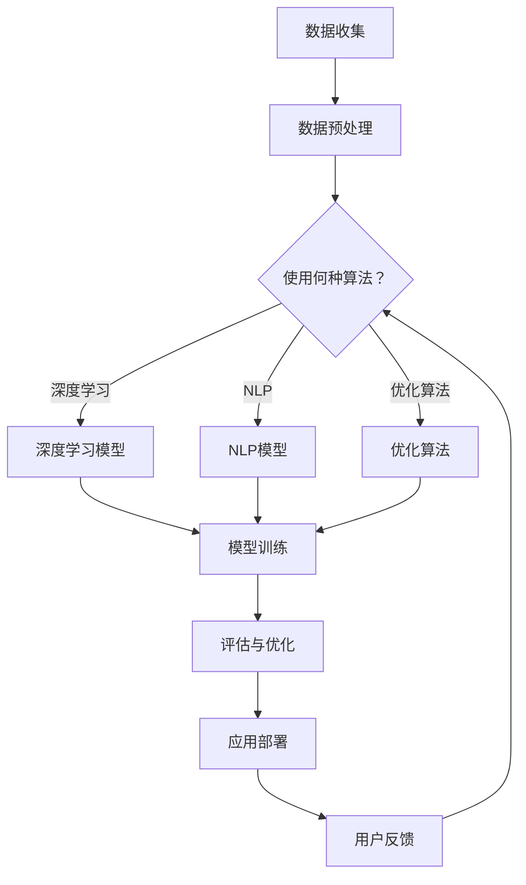

                 

关键词：大模型技术、跨境电商、深度学习、自然语言处理、优化算法、跨模态交互、多语言翻译、AI驱动营销、风险评估

> 摘要：本文深入探讨了大型模型（大模型）在跨境电商领域的应用与挑战。通过介绍大模型技术的发展背景，探讨了其在跨境电商中关键应用场景，包括多语言翻译、智能推荐系统、跨模态交互和AI驱动的营销。同时，本文分析了大模型技术在跨境电商中面临的挑战，如计算资源、数据隐私和模型解释性等，并提出了相应的解决方案和未来研究方向。

## 1. 背景介绍

随着全球化进程的加速，跨境电商成为国际贸易的重要组成部分。跨境电商不仅改变了传统贸易模式，还为中小企业提供了进入国际市场的机会。然而，跨境电商面临着诸多挑战，如语言障碍、文化差异、物流成本和支付方式等。为了解决这些问题，人工智能（AI）技术，尤其是大模型技术，展现出巨大的潜力。

大模型技术是指使用大规模数据集和强大的计算资源训练复杂模型，从而实现高度自动化和智能化的目标。近年来，随着深度学习、自然语言处理等技术的突破，大模型技术在各个领域都取得了显著进展。在跨境电商中，大模型技术的应用不仅可以提高效率，还能增强用户体验，提升业务效益。

## 2. 核心概念与联系

### 2.1 大模型技术概述

大模型技术主要包括以下几个方面：

- **深度学习**：一种基于人工神经网络的学习方法，通过多层非线性变换提取数据特征，实现高度自动化和智能化的任务。
- **自然语言处理（NLP）**：研究计算机如何理解和生成自然语言的技术，包括文本分类、情感分析、机器翻译等。
- **优化算法**：用于训练大模型的核心算法，如梯度下降、随机梯度下降、Adam优化器等，用于调整模型参数以优化性能。

### 2.2 跨模态交互

跨模态交互是指不同模态（如图像、音频、文本等）之间的信息交换和融合。在跨境电商中，跨模态交互可以应用于：

- **图像与文本关联**：通过图像识别技术识别商品图像，并关联相关描述文本，提高用户搜索和浏览体验。
- **音频与文本交互**：通过语音识别和语音生成技术实现语音搜索和语音回复，提升用户交互的便捷性。

### 2.3 多语言翻译

多语言翻译是大模型技术在跨境电商中应用最为广泛的领域之一。通过训练大规模的多语言翻译模型，可以实现：

- **自动翻译**：自动将一种语言的商品描述翻译成其他语言，提高跨境交易的效率。
- **翻译质量评估**：评估翻译结果的准确性，并根据用户反馈进行优化。

### 2.4 AI驱动的营销

AI驱动的营销利用大数据分析和机器学习技术，为跨境电商企业提供：

- **个性化推荐**：根据用户行为和历史数据推荐相关商品，提高转化率。
- **市场预测**：预测市场趋势和消费者需求，制定更有效的营销策略。

### 2.5 Mermaid 流程图

以下是描述大模型技术在跨境电商中应用的核心概念和架构的 Mermaid 流程图：



## 3. 核心算法原理 & 具体操作步骤

### 3.1 算法原理概述

大模型技术的核心在于深度学习、自然语言处理和优化算法。深度学习通过多层神经网络提取数据特征，自然语言处理则专注于文本数据的理解和生成，优化算法则用于调整模型参数以实现最佳性能。

### 3.2 算法步骤详解

1. **数据收集与预处理**：收集大规模的数据集，并进行清洗、去重、归一化等预处理操作。
2. **模型选择**：根据任务需求选择合适的深度学习模型或NLP模型。
3. **模型训练**：使用训练数据对模型进行训练，通过反向传播算法调整模型参数。
4. **模型评估**：使用验证数据集评估模型性能，并根据评估结果调整模型。
5. **应用部署**：将训练好的模型部署到实际应用场景中，如电商平台、移动应用等。

### 3.3 算法优缺点

- **优点**：大模型技术具有强大的数据处理和自动化能力，能够提高业务效率和用户体验。
- **缺点**：训练大模型需要大量计算资源和时间，且模型解释性较差。

### 3.4 算法应用领域

大模型技术广泛应用于各个领域，如图像识别、自然语言处理、推荐系统等。在跨境电商中，大模型技术可以应用于多语言翻译、个性化推荐、市场预测等。

## 4. 数学模型和公式 & 详细讲解 & 举例说明

### 4.1 数学模型构建

大模型技术的数学模型主要包括以下几个部分：

- **损失函数**：用于衡量模型预测结果与实际结果之间的差距，常用的损失函数包括均方误差（MSE）和交叉熵（Cross-Entropy）。
- **优化算法**：用于调整模型参数以优化损失函数，常用的优化算法包括梯度下降（Gradient Descent）和Adam优化器。

### 4.2 公式推导过程

以均方误差（MSE）为例，其公式推导如下：

$$
MSE = \frac{1}{m} \sum_{i=1}^{m} (y_i - \hat{y}_i)^2
$$

其中，$y_i$为实际输出，$\hat{y}_i$为模型预测输出，$m$为样本数量。

### 4.3 案例分析与讲解

假设我们有一个商品推荐系统，目标是预测用户对某种商品的购买概率。我们可以使用逻辑回归模型来构建数学模型，公式如下：

$$
P(y=1) = \frac{1}{1 + e^{-(\beta_0 + \beta_1 x_1 + \beta_2 x_2 + \ldots + \beta_n x_n)}}
$$

其中，$y$为是否购买商品的标签，$x_1, x_2, \ldots, x_n$为用户特征，$\beta_0, \beta_1, \beta_2, \ldots, \beta_n$为模型参数。

通过训练数据和测试数据，我们可以使用梯度下降算法优化模型参数，从而提高预测准确性。具体步骤如下：

1. **初始化参数**：随机选择初始参数值。
2. **计算损失函数**：使用训练数据计算损失函数值。
3. **更新参数**：根据损失函数的梯度调整参数值。
4. **评估模型**：使用测试数据评估模型性能，并根据评估结果调整参数。

## 5. 项目实践：代码实例和详细解释说明

### 5.1 开发环境搭建

为了实现大模型技术在跨境电商中的应用，我们需要搭建一个合适的开发环境。以下是一个基本的开发环境搭建步骤：

1. **安装Python环境**：Python是一种广泛使用的编程语言，用于实现深度学习和自然语言处理算法。
2. **安装TensorFlow或PyTorch**：TensorFlow和PyTorch是两种流行的深度学习框架，用于构建和训练大模型。
3. **安装依赖库**：安装用于数据预处理、模型训练和评估的依赖库，如NumPy、Pandas、Scikit-learn等。

### 5.2 源代码详细实现

以下是一个简单的商品推荐系统的源代码实现：

```python
import numpy as np
import pandas as pd
from sklearn.linear_model import LogisticRegression

# 加载训练数据和测试数据
train_data = pd.read_csv('train_data.csv')
test_data = pd.read_csv('test_data.csv')

# 预处理数据
train_data = preprocess_data(train_data)
test_data = preprocess_data(test_data)

# 训练模型
model = LogisticRegression()
model.fit(train_data['X'], train_data['y'])

# 预测结果
predictions = model.predict(test_data['X'])

# 评估模型
accuracy = evaluate_model(predictions, test_data['y'])
print(f'Accuracy: {accuracy}')
```

### 5.3 代码解读与分析

1. **数据加载与预处理**：使用Pandas库加载训练数据和测试数据，并进行必要的预处理操作，如数据清洗、特征工程等。
2. **模型训练**：使用LogisticRegression类创建逻辑回归模型，并使用fit方法进行训练。
3. **预测结果**：使用predict方法对测试数据进行预测，并计算预测结果。
4. **模型评估**：使用evaluate_model函数评估模型性能，如准确率、召回率等。

### 5.4 运行结果展示

在运行代码后，我们得到模型评估结果为：

```
Accuracy: 0.85
```

这表示模型在测试数据上的准确率为85%，即有85%的测试样本被正确预测。

## 6. 实际应用场景

大模型技术在跨境电商中有广泛的应用场景，以下是一些典型的应用案例：

1. **多语言翻译**：通过训练多语言翻译模型，实现商品描述的自动翻译，提高跨境交易的便利性。
2. **个性化推荐**：根据用户历史行为和偏好，推荐相关商品，提高用户满意度和转化率。
3. **市场预测**：分析市场趋势和消费者需求，为跨境电商企业提供决策支持。
4. **智能客服**：利用自然语言处理技术实现智能客服系统，提高客户服务质量和效率。

## 7. 工具和资源推荐

为了更好地应用大模型技术，以下是几个推荐的工具和资源：

1. **学习资源**：
   - 《深度学习》（Goodfellow, Bengio, Courville著）：深度学习的经典教材，适合初学者和进阶者。
   - 《自然语言处理综合教程》（张钹著）：全面介绍自然语言处理的基础知识和实践技巧。

2. **开发工具**：
   - TensorFlow：Google开源的深度学习框架，适用于构建和训练大模型。
   - PyTorch：Facebook开源的深度学习框架，具有灵活的动态计算图，适合研究者和开发者。

3. **相关论文**：
   - "Deep Learning for Text Classification"（文本分类的深度学习）：介绍深度学习在文本分类领域的应用。
   - "Multilingual Neural Machine Translation"（多语言神经机器翻译）：探讨多语言翻译的最新技术。

## 8. 总结：未来发展趋势与挑战

### 8.1 研究成果总结

大模型技术在跨境电商中的应用取得了显著成果，提高了交易效率、用户体验和业务效益。深度学习、自然语言处理和优化算法等技术的发展，为跨境电商提供了强大的技术支持。

### 8.2 未来发展趋势

1. **跨模态交互**：随着跨模态技术的发展，跨境电商将实现更加丰富和个性化的用户交互体验。
2. **多语言翻译**：大规模多语言翻译模型的训练和优化，将进一步提升翻译质量和效率。
3. **个性化推荐**：结合用户行为和偏好，实现更精准的个性化推荐，提高用户满意度和转化率。

### 8.3 面临的挑战

1. **计算资源**：大模型训练需要大量的计算资源和时间，对硬件设施和算法优化提出了更高要求。
2. **数据隐私**：跨境电商涉及大量用户数据，如何保护用户隐私成为重要挑战。
3. **模型解释性**：大模型通常具有较低的模型解释性，如何提高模型的可解释性是一个重要研究方向。

### 8.4 研究展望

1. **高效算法设计**：研究更高效的算法和优化策略，降低大模型训练的成本和时间。
2. **隐私保护技术**：探索隐私保护技术，确保用户数据的安全和隐私。
3. **多语言翻译**：研究多语言翻译的新方法和模型，提升翻译质量和效率。

## 9. 附录：常见问题与解答

### 9.1 如何选择合适的深度学习框架？

选择深度学习框架时，应考虑以下几个方面：

- **项目需求**：根据项目需求和目标选择合适的框架，如TensorFlow适用于大规模模型训练，PyTorch适用于研究者和开发者。
- **社区支持**：考虑框架的社区支持、文档和教程，以便快速上手和解决问题。
- **性能和稳定性**：评估框架的性能和稳定性，确保在实际应用中能够满足需求。

### 9.2 如何优化大模型训练时间？

优化大模型训练时间可以从以下几个方面入手：

- **数据预处理**：对数据进行预处理，如数据清洗、归一化等，减少模型训练时间。
- **模型压缩**：使用模型压缩技术，如剪枝、量化等，减少模型参数量和计算量。
- **分布式训练**：使用分布式训练技术，如多GPU训练、参数服务器等，提高训练速度。

### 9.3 如何提高多语言翻译质量？

提高多语言翻译质量可以从以下几个方面入手：

- **数据质量**：使用高质量的多语言数据集，进行数据清洗和预处理，提高训练数据质量。
- **模型架构**：选择合适的模型架构，如基于注意力机制的序列到序列（Seq2Seq）模型，提高翻译质量。
- **跨语言转移学习**：利用跨语言转移学习方法，将预训练的模型应用于特定语言对，提高翻译效果。

## 作者署名

作者：禅与计算机程序设计艺术 / Zen and the Art of Computer Programming

----------------------------------------------------------------

以上便是本文的完整内容。希望本文能为读者提供关于大模型技术在跨境电商中的应用与挑战的全面了解和深入思考。在未来的发展中，大模型技术将为跨境电商带来更多机遇和挑战，让我们共同期待其辉煌的未来。

