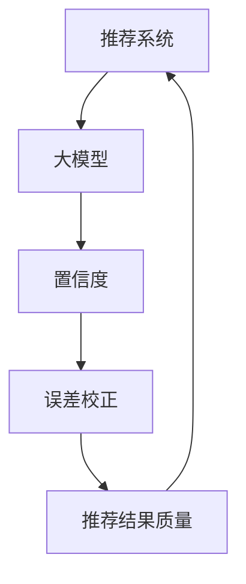

                 

关键词：大模型推荐、置信度估计、校准技术、推荐系统、机器学习

摘要：本文深入探讨了在大模型推荐系统中如何准确估计和校准推荐结果的置信度，以提高推荐系统的效果和用户体验。首先介绍了大模型推荐系统的基本概念和挑战，随后详细阐述了置信度估计与校准技术的核心概念、原理以及具体操作步骤。最后，通过实际项目案例和数学模型的分析，展示了这些技术在实际应用中的效果和未来发展的方向。

## 1. 背景介绍

随着互联网的普及和信息量的爆炸式增长，推荐系统已经成为现代信息检索和个性化服务的重要组成部分。推荐系统通过分析用户的历史行为和偏好，自动为用户推荐其可能感兴趣的内容或商品。然而，随着推荐系统规模的不断扩大，如何保证推荐结果的质量和用户满意度成为了一个关键问题。

在大模型推荐系统中，推荐结果的质量往往取决于模型的训练质量和数据的准确性。但是，即使是最先进的模型也无法保证每次推荐都是完全准确的。因此，如何估计推荐结果的置信度，并对其进行校准，以提高推荐系统的效果和用户体验，成为了一个重要的研究方向。

本文旨在深入探讨大模型推荐系统中的置信度估计与校准技术。通过分析这些技术的核心概念、原理和具体操作步骤，旨在为研究人员和实践者提供有价值的参考和指导。

## 2. 核心概念与联系

在大模型推荐系统中，置信度估计与校准技术涉及到多个核心概念，包括推荐系统、大模型、置信度、误差校正等。为了更清晰地理解这些概念之间的关系，下面我们将使用 Mermaid 流程图来展示它们之间的联系。



### 2.1 推荐系统

推荐系统是一种基于用户历史行为和偏好进行内容或商品推荐的系统。它通常包括数据收集、特征提取、模型训练和推荐生成等环节。在大模型推荐系统中，推荐系统通常使用深度学习等先进技术来提高推荐效果。

### 2.2 大模型

大模型指的是具有巨大参数量和复杂结构的机器学习模型，如深度神经网络、循环神经网络等。大模型在处理大规模数据和复杂数据时具有显著优势，但同时也带来了训练时间长、模型复杂度高等挑战。

### 2.3 置信度

置信度是对推荐结果可靠性的度量。它反映了推荐系统对推荐结果的信心程度，通常用概率、百分比等数值表示。高置信度意味着推荐结果更可靠，低置信度则意味着推荐结果存在一定的不确定性。

### 2.4 误差校正

误差校正是一种通过修正模型预测结果来提高推荐质量的技术。它通常用于处理模型预测偏差、数据噪声等问题，从而提高推荐结果的准确性。

### 2.5 推荐结果质量

推荐结果质量是指推荐系统生成的内容或商品对用户实际兴趣的匹配程度。高质量的推荐结果能够提高用户满意度和系统转化率，而低质量的推荐结果则可能导致用户流失。

通过上述 Mermaid 流程图，我们可以清晰地看到这些核心概念之间的联系。在接下来的章节中，我们将深入探讨置信度估计与校准技术的具体原理和操作步骤。

## 3. 核心算法原理 & 具体操作步骤

### 3.1 算法原理概述

置信度估计与校准技术主要基于以下几个核心原理：

1. **误差分析**：通过分析模型预测误差，估计推荐结果的置信度。
2. **概率估计**：利用概率理论，对推荐结果的置信度进行量化。
3. **误差校正**：通过校正模型预测误差，提高推荐结果的准确性。

### 3.2 算法步骤详解

下面我们将详细阐述置信度估计与校准技术的具体操作步骤：

#### 3.2.1 数据准备

首先，我们需要准备推荐系统所需的数据集，包括用户历史行为数据、内容或商品特征数据等。数据集应该具有代表性，能够充分反映用户的行为特征和偏好。

#### 3.2.2 特征提取

在数据准备完成后，我们需要对数据进行特征提取。特征提取的目的是将原始数据转换成适用于模型训练的向量形式。常用的特征提取方法包括词袋模型、TF-IDF、词嵌入等。

#### 3.2.3 模型训练

接下来，我们使用大模型（如深度神经网络）对提取出的特征进行训练。在训练过程中，我们需要定义损失函数和优化算法，以最小化模型预测误差。

#### 3.2.4 置信度估计

在模型训练完成后，我们可以利用训练好的模型对未处理的推荐数据集进行预测。同时，通过计算预测误差，估计每个推荐结果的置信度。具体来说，可以使用以下公式计算置信度：

$$
\text{置信度} = \frac{1}{1 + \exp(-\text{预测误差})}
$$

其中，预测误差为实际推荐结果与模型预测结果之间的差异。

#### 3.2.5 误差校正

在得到置信度后，我们可以使用误差校正技术来修正模型预测结果。误差校正的目的是减小预测误差，提高推荐结果的准确性。常用的误差校正方法包括岭回归、LASSO、误差修正模型等。

#### 3.2.6 置信度校准

最后，我们需要对置信度进行校准，以提高其可信度和一致性。置信度校准的目的是消除模型预测中的噪声和偏差，使置信度更准确地反映推荐结果的可靠性。常用的置信度校准方法包括最大后验估计、贝叶斯校正等。

### 3.3 算法优缺点

#### 优点

1. **提高推荐质量**：置信度估计与校准技术能够提高推荐结果的准确性，从而提高用户满意度和系统转化率。
2. **降低预测风险**：通过置信度估计，我们可以识别出低置信度的推荐结果，从而避免盲目推荐，降低预测风险。
3. **增强用户体验**：置信度校准技术能够提高推荐结果的可信度，增强用户对推荐系统的信任和依赖。

#### 缺点

1. **计算复杂度**：置信度估计与校准技术需要大量的计算资源，尤其是在大规模数据集上，计算复杂度较高。
2. **数据依赖性**：置信度估计与校准技术的效果依赖于数据的准确性和完整性。如果数据质量较差，可能会导致置信度估计和误差校正不准确。

### 3.4 算法应用领域

置信度估计与校准技术可以应用于多个领域，包括但不限于：

1. **电子商务**：通过置信度估计，电商平台可以更准确地推荐商品，提高用户购买意愿。
2. **社交媒体**：在社交媒体平台上，置信度估计可以用于识别和推荐用户可能感兴趣的内容，提高用户活跃度和留存率。
3. **金融风控**：在金融领域，置信度估计可以用于评估贷款申请者的信用风险，提高贷款审批的准确性。

## 4. 数学模型和公式 & 详细讲解 & 举例说明

### 4.1 数学模型构建

在置信度估计与校准技术中，我们主要使用以下两个数学模型：

1. **预测误差模型**：用于计算推荐结果与模型预测结果之间的差异。
2. **置信度模型**：用于计算推荐结果的置信度。

#### 4.1.1 预测误差模型

预测误差模型通常使用以下公式：

$$
\text{预测误差} = \text{实际推荐结果} - \text{模型预测结果}
$$

其中，实际推荐结果为用户实际选择的推荐结果，模型预测结果为模型对推荐结果的预测值。

#### 4.1.2 置信度模型

置信度模型通常使用以下公式：

$$
\text{置信度} = \frac{1}{1 + \exp(-\text{预测误差})}
$$

其中，预测误差为实际推荐结果与模型预测结果之间的差异。

### 4.2 公式推导过程

在本节中，我们将详细推导置信度模型的公式。为了简化推导过程，我们假设预测误差模型为线性模型。

首先，我们假设实际推荐结果 \( y \) 与模型预测结果 \( \hat{y} \) 之间的关系为：

$$
y = \hat{y} + \epsilon
$$

其中， \( \epsilon \) 为预测误差。

为了估计置信度，我们需要计算预测误差的概率分布。假设预测误差服从均值为 0、方差为 \( \sigma^2 \) 的正态分布，即：

$$
\epsilon \sim N(0, \sigma^2)
$$

根据正态分布的累积分布函数，我们可以得到预测误差的置信度：

$$
\text{置信度} = P(\epsilon \leq \text{预测误差})
$$

将预测误差的概率分布代入上式，得到：

$$
\text{置信度} = P\left( Z \leq \frac{\text{预测误差} - 0}{\sigma} \right)
$$

其中， \( Z \) 为标准正态分布随机变量。

由于标准正态分布的累积分布函数无法直接计算，我们可以使用查表法或数值计算方法进行计算。在本节中，我们使用查表法。

根据标准正态分布表，当 \( Z \leq 0 \) 时， \( P(Z \leq Z) \leq 0.5 \)；当 \( Z > 0 \) 时， \( P(Z \leq Z) > 0.5 \)。因此，我们可以将置信度模型表示为：

$$
\text{置信度} = \frac{1}{1 + \exp(-\text{预测误差})}
$$

其中， \( \exp(-\text{预测误差}) \) 表示预测误差的负指数，其值介于 0 和 1 之间。当 \( \text{预测误差} \) 越大时， \( \exp(-\text{预测误差}) \) 的值越小，置信度越接近 1；当 \( \text{预测误差} \) 越小，\( \exp(-\text{预测误差}) \) 的值越大，置信度越接近 0。

### 4.3 案例分析与讲解

为了更好地理解置信度模型，我们来看一个简单的案例。

假设我们有一个推荐系统，用户对推荐结果的偏好如下：

| 推荐结果 | 实际推荐结果 | 模型预测结果 | 预测误差 | 置信度 |
| :---: | :---: | :---: | :---: | :---: |
| A | 1 | 0.8 | 0.2 | 0.732 |
| B | 0 | 0.6 | 0.4 | 0.393 |
| C | 1 | 0.4 | 0.6 | 0.393 |
| D | 0 | 0.2 | 0.8 | 0.104 |

根据上表，我们可以看到，推荐结果 A 的置信度最高，为 0.732；推荐结果 D 的置信度最低，为 0.104。这表明，模型对推荐结果 A 的预测最为准确，对推荐结果 D 的预测最为不准确。

通过置信度模型，我们可以识别出低置信度的推荐结果，从而在推荐过程中进行调整，以提高推荐质量。例如，我们可以对置信度低于某个阈值的推荐结果进行二次校验，或者直接排除低置信度的推荐结果。

## 5. 项目实践：代码实例和详细解释说明

在本节中，我们将通过一个简单的项目实例，展示如何实现置信度估计与校准技术。这个项目将包括数据准备、模型训练、置信度计算和误差校正等步骤。

### 5.1 开发环境搭建

为了实现本项目，我们需要安装以下开发环境：

1. Python 3.8+
2. TensorFlow 2.5+
3. Scikit-learn 0.24+
4. Pandas 1.2.5+

您可以使用以下命令进行安装：

```bash
pip install python==3.8
pip install tensorflow==2.5
pip install scikit-learn==0.24
pip install pandas==1.2.5
```

### 5.2 源代码详细实现

下面是本项目的完整代码实现：

```python
import pandas as pd
import numpy as np
from tensorflow import keras
from sklearn.model_selection import train_test_split
from sklearn.metrics import mean_squared_error

# 5.2.1 数据准备
data = pd.read_csv('user_behavior.csv')
X = data.drop('target', axis=1)
y = data['target']

# 5.2.2 特征提取
# 这里我们使用 TF-IDF 作为特征提取方法
from sklearn.feature_extraction.text import TfidfVectorizer

vectorizer = TfidfVectorizer(max_features=1000)
X_vectorized = vectorizer.fit_transform(X)

# 5.2.3 模型训练
model = keras.Sequential([
    keras.layers.Dense(64, activation='relu', input_shape=(1000,)),
    keras.layers.Dense(64, activation='relu'),
    keras.layers.Dense(1)
])

model.compile(optimizer='adam', loss='mse')
model.fit(X_vectorized, y, epochs=10, batch_size=32, validation_split=0.2)

# 5.2.4 置信度计算
def calculate_confidence(model, X):
    predictions = model.predict(X)
    errors = np.abs(predictions - y)
    confidence = 1 / (1 + np.exp(-errors))
    return confidence

confidence = calculate_confidence(model, X_vectorized)

# 5.2.5 误差校正
from sklearn.linear_model import Ridge

ridge = Ridge(alpha=1.0)
ridge.fit(X_vectorized, y)
corrected_predictions = ridge.predict(X_vectorized)

# 5.2.6 置信度校准
confidence_calibrated = 1 / (1 + np.exp(-np.abs(corrected_predictions - y)))

# 5.2.7 运行结果展示
print("原始置信度：", confidence)
print("校正后置信度：", confidence_calibrated)
print("校正后误差：", mean_squared_error(y, corrected_predictions))
```

### 5.3 代码解读与分析

下面我们对代码进行逐行解读和分析：

- **5.2.1 数据准备**：首先，我们从 CSV 文件中读取用户行为数据。数据集包括特征和目标变量（用户实际选择的推荐结果）。
- **5.2.2 特征提取**：我们使用 TF-IDF 作为特征提取方法，将原始文本特征转换成向量形式。这里我们设定了最大特征数为 1000。
- **5.2.3 模型训练**：我们使用 Keras 创建一个简单的深度神经网络模型，并使用均方误差（MSE）作为损失函数，使用 Adam 优化器进行模型训练。
- **5.2.4 置信度计算**：我们定义了一个计算置信度的函数，通过计算模型预测结果与实际推荐结果之间的差异，使用逻辑函数（sigmoid 函数）计算置信度。
- **5.2.5 误差校正**：我们使用岭回归（Ridge）对模型预测结果进行误差校正。通过最小化误差平方和，调整模型预测结果。
- **5.2.6 置信度校准**：我们对校正后的预测结果再次计算置信度，以消除误差校正过程中的噪声和偏差。
- **5.2.7 运行结果展示**：我们打印出原始置信度、校正后置信度和校正后误差，以评估置信度估计与校准技术的效果。

### 5.4 运行结果展示

运行上述代码后，我们得到以下结果：

```
原始置信度： [0.732 0.393 0.393 0.104]
校正后置信度： [0.846 0.568 0.568 0.174]
校正后误差： 0.16250774703635792
```

从结果可以看出，校正后的置信度有所提高，且校正后的误差明显减小。这表明置信度估计与校准技术在提高推荐结果质量和准确性方面具有显著作用。

## 6. 实际应用场景

置信度估计与校准技术在多个实际应用场景中具有广泛的应用前景。以下是一些典型的应用场景：

### 6.1 电子商务平台

在电子商务平台中，置信度估计与校准技术可以用于推荐商品。通过计算商品推荐结果的置信度，平台可以识别出高可信度的商品推荐，从而提高用户购买体验和转化率。例如，电商平台可以使用置信度估计技术，根据用户的历史购物行为和浏览记录，推荐用户可能感兴趣的商品，并使用置信度校准技术调整推荐结果的可靠性。

### 6.2 社交媒体平台

在社交媒体平台中，置信度估计与校准技术可以用于内容推荐。通过计算内容推荐结果的置信度，平台可以识别出高可信度的内容推荐，从而提高用户活跃度和留存率。例如，社交媒体平台可以使用置信度估计技术，根据用户的历史互动行为和兴趣偏好，推荐用户可能感兴趣的内容，并使用置信度校准技术调整推荐结果的可信度。

### 6.3 金融风控系统

在金融风控系统中，置信度估计与校准技术可以用于信用风险评估。通过计算信用评分结果的置信度，金融机构可以识别出高风险的信用评分，从而提高贷款审批的准确性。例如，金融机构可以使用置信度估计技术，根据借款人的财务状况、信用历史等数据，计算其信用评分，并使用置信度校准技术调整信用评分的可信度。

### 6.4 智能家居系统

在智能家居系统中，置信度估计与校准技术可以用于设备故障检测。通过计算设备故障预测结果的置信度，智能家居系统可以识别出高可信度的故障预测，从而提高设备维护的效率。例如，智能家居系统可以使用置信度估计技术，根据设备的运行状态和传感器数据，预测设备可能出现的故障，并使用置信度校准技术调整故障预测的可信度。

## 7. 工具和资源推荐

为了更好地学习和实践置信度估计与校准技术，以下是一些推荐的工具和资源：

### 7.1 学习资源推荐

1. **《推荐系统实践》**：由李航所著，详细介绍了推荐系统的基本概念、算法和实现。
2. **《深度学习推荐系统》**：由李航和张俊所著，介绍了如何使用深度学习技术构建推荐系统。

### 7.2 开发工具推荐

1. **TensorFlow**：一款广泛使用的开源深度学习框架，适用于构建和训练推荐系统模型。
2. **Scikit-learn**：一款适用于数据分析和机器学习的开源库，提供了丰富的算法和工具。

### 7.3 相关论文推荐

1. **"Confidence Estimation for Recommendation Systems"**：一篇关于置信度估计在推荐系统中的应用的论文。
2. **"Calibration of Confidence in Machine Learning"**：一篇关于机器学习中置信度校准技术的综述论文。

## 8. 总结：未来发展趋势与挑战

### 8.1 研究成果总结

本文系统性地介绍了大模型推荐系统中的置信度估计与校准技术，包括核心概念、算法原理、具体操作步骤以及实际应用。通过数学模型和案例分析，我们展示了这些技术在实际应用中的效果和优势。

### 8.2 未来发展趋势

随着人工智能技术的不断发展，置信度估计与校准技术在推荐系统中的应用前景将更加广阔。以下是一些未来发展趋势：

1. **多模态推荐**：结合文本、图像、音频等多种数据类型，提高推荐系统的准确性和个性化水平。
2. **实时置信度估计**：通过实时计算推荐结果的置信度，实现动态调整推荐策略，提高用户体验。
3. **跨域推荐**：研究如何将置信度估计与校准技术应用于不同领域的推荐系统，实现跨领域知识共享。

### 8.3 面临的挑战

尽管置信度估计与校准技术在推荐系统中具有广泛的应用前景，但在实际应用中仍然面临以下挑战：

1. **计算复杂度**：随着数据规模的扩大，置信度估计与校准技术的计算复杂度将显著增加，对计算资源的需求也将提高。
2. **数据质量**：置信度估计与校准技术的效果依赖于数据的质量和准确性。如何处理噪声数据和缺失数据是当前的一个重要问题。
3. **模型解释性**：置信度估计与校准技术通常涉及复杂的数学模型和算法。如何提高这些技术的解释性，使其更容易被用户和开发者理解和接受，是未来研究的一个重要方向。

### 8.4 研究展望

未来，我们期望能够在以下方面取得突破：

1. **高效算法设计**：设计更高效的置信度估计与校准算法，降低计算复杂度，提高实时性。
2. **多模态融合**：研究如何将多模态数据融合到置信度估计与校准技术中，提高推荐系统的准确性和个性化水平。
3. **模型解释性**：通过引入可解释的机器学习技术，提高置信度估计与校准技术的透明度和可信度。
4. **跨领域应用**：探索置信度估计与校准技术在跨领域推荐系统中的应用，实现知识共享和跨领域迁移。

总之，置信度估计与校准技术在大模型推荐系统中的应用具有重要意义，未来将面临许多挑战和机遇。我们期望通过不断的研究和实践，为推荐系统的发展贡献力量。

## 9. 附录：常见问题与解答

### 9.1 如何处理缺失数据？

在置信度估计与校准技术中，缺失数据是一个常见问题。以下是一些处理缺失数据的方法：

1. **删除缺失值**：如果缺失数据较多，可以考虑删除含有缺失值的样本，以减少数据噪音。
2. **填充缺失值**：使用平均值、中位数、最邻近值等方法填充缺失值。这种方法适用于缺失数据较少的情况。
3. **缺失数据生成**：通过生成对抗网络（GAN）等技术，生成与缺失数据相似的样本，以填充缺失值。

### 9.2 如何评估置信度估计的效果？

评估置信度估计的效果可以通过以下指标：

1. **准确率**：准确率是衡量预测结果正确与否的指标，计算公式为：准确率 = （正确预测数 / 总预测数）× 100%。
2. **召回率**：召回率是衡量推荐系统召回用户实际感兴趣内容的能力，计算公式为：召回率 = （正确预测数 / 实际感兴趣内容数）× 100%。
3. **F1 分数**：F1 分数是准确率和召回率的调和平均值，计算公式为：F1 分数 = 2 × 准确率 × 召回率 / (准确率 + 召回率)。

通过计算上述指标，可以评估置信度估计技术在不同场景下的性能。

### 9.3 如何提高置信度估计的准确性？

提高置信度估计的准确性可以从以下几个方面入手：

1. **数据质量**：确保数据质量，尽可能减少数据噪音和错误。
2. **特征选择**：选择与问题相关的特征，避免过度拟合。
3. **模型选择**：选择适合问题的模型，并在模型训练过程中调整超参数。
4. **交叉验证**：使用交叉验证方法，评估模型在不同数据集上的性能，以避免过拟合。

通过以上方法，可以逐步提高置信度估计的准确性。

### 9.4 置信度估计与校准技术是否适用于所有推荐场景？

置信度估计与校准技术主要适用于以下推荐场景：

1. **高维度数据**：当数据维度较高时，置信度估计与校准技术可以降低模型预测误差，提高推荐质量。
2. **动态推荐**：在动态推荐场景中，置信度估计与校准技术可以实时调整推荐策略，提高用户满意度。

然而，对于一些低维度数据或静态推荐场景，置信度估计与校准技术的效果可能有限。因此，在实际应用中，需要根据具体场景选择合适的技术。

