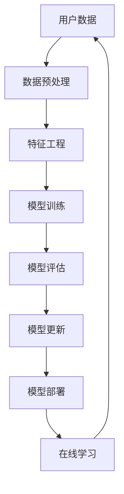

                 

关键词：大模型推荐、模型更新、在线学习、技术架构、算法原理、数学模型、应用实践、未来展望

> 摘要：本文将深入探讨大模型推荐系统中的模型更新与在线学习技术，通过分析其核心概念、算法原理、数学模型以及实际应用，为读者提供一个全面的技术指南。本文将首先介绍背景与核心概念，然后详细阐述算法原理与步骤，接着介绍数学模型及其应用，随后通过实际项目实践展示代码实现，并讨论实际应用场景和未来展望。

## 1. 背景介绍

随着互联网和大数据技术的迅猛发展，推荐系统在电子商务、社交媒体、在线广告等领域发挥着越来越重要的作用。推荐系统能够根据用户的兴趣和行为预测他们的偏好，从而为用户推荐个性化的商品、内容或广告。然而，随着数据规模和用户行为的复杂度不断增加，传统推荐系统面临着巨大的挑战，如数据稀疏性、冷启动问题以及低效的模型更新等。

为了应对这些挑战，近年来，大模型推荐系统以及相关的在线学习技术得到了广泛关注。大模型推荐系统通过构建大规模的神经网络模型，能够更好地捕捉用户行为的复杂模式，从而提高推荐的质量。而在线学习技术则使得模型能够实时地更新，以适应不断变化的数据环境，从而保持推荐的高效性和准确性。

本文旨在探讨大模型推荐系统中的模型更新与在线学习技术，分析其核心概念、算法原理、数学模型以及实际应用，为读者提供一个全面的技术指南。

## 2. 核心概念与联系

在探讨大模型推荐系统中的模型更新与在线学习技术之前，我们首先需要明确几个核心概念。

### 2.1 大模型推荐系统

大模型推荐系统是指通过使用大规模的神经网络模型来预测用户兴趣和偏好，从而进行个性化推荐的系统。这种模型通常具有高度的复杂性和深度，能够捕捉用户行为的细微变化。

### 2.2 在线学习

在线学习是指模型在训练过程中能够实时接收新的数据并进行更新，以适应数据环境的变化。与传统的批量学习不同，在线学习能够快速响应环境变化，提高模型的实时性和灵活性。

### 2.3 模型更新

模型更新是指通过使用新的数据对现有模型进行优化，以提高模型的预测性能。模型更新可以采用不同的策略，如增量更新、全量更新等。

### 2.4 Mermaid 流程图

以下是关于大模型推荐系统中的模型更新与在线学习技术的Mermaid流程图：



在上述流程图中，用户数据首先经过数据预处理和特征工程，然后用于模型训练。训练完成的模型进行评估，根据评估结果进行模型更新。更新后的模型部署到生产环境中，并通过在线学习技术不断接收新的数据，进行实时更新。

## 3. 核心算法原理 & 具体操作步骤

### 3.1 算法原理概述

大模型推荐系统中的核心算法通常是基于深度学习的神经网络模型。神经网络通过多层非线性变换，能够捕捉用户行为的复杂模式。在线学习技术则通过实时更新模型参数，提高模型的实时性和适应性。

### 3.2 算法步骤详解

以下是使用深度学习进行大模型推荐系统中的模型更新与在线学习的具体步骤：

#### 步骤1：数据预处理

- 数据清洗：去除重复、缺失和不合理的数据。
- 数据归一化：将不同特征的数据缩放到相同的尺度，以避免某些特征对模型训练的影响过大。

#### 步骤2：特征工程

- 特征提取：根据业务需求，提取用户行为、兴趣、内容等特征。
- 特征选择：选择对模型训练有显著影响的特征，去除冗余和无效的特征。

#### 步骤3：模型训练

- 模型初始化：初始化神经网络模型的参数。
- 前向传播：计算输入数据的预测结果。
- 反向传播：根据预测结果和真实标签，计算模型参数的梯度。
- 参数更新：使用梯度下降等优化算法，更新模型参数。

#### 步骤4：模型评估

- 评估指标：根据业务需求，选择合适的评估指标，如准确率、召回率、F1分数等。
- 交叉验证：使用交叉验证方法，评估模型在未知数据上的表现。

#### 步骤5：模型更新

- 增量更新：在每次训练后，对模型参数进行微调，以提高模型的预测性能。
- 全量更新：定期重新训练模型，以适应数据环境的变化。

#### 步骤6：模型部署

- 部署策略：根据业务需求和资源限制，选择合适的部署策略，如全量部署、增量部署等。
- 模型监控：实时监控模型在部署环境中的性能，及时发现和解决问题。

#### 步骤7：在线学习

- 实时数据接收：从数据源实时接收新的用户数据。
- 数据预处理：对实时数据执行与训练数据相同的预处理步骤。
- 模型更新：使用实时数据对模型进行增量更新。

### 3.3 算法优缺点

#### 优点：

- 高效性：深度学习模型能够高效地捕捉用户行为的复杂模式，提高推荐的质量。
- 实时性：在线学习技术能够实时更新模型参数，提高模型的实时性和适应性。

#### 缺点：

- 复杂性：深度学习模型的训练过程相对复杂，需要大量的计算资源和时间。
- 数据依赖性：模型的性能高度依赖于数据的质量和多样性。

### 3.4 算法应用领域

大模型推荐系统中的模型更新与在线学习技术广泛应用于电子商务、社交媒体、在线广告等领域，如：

- 电子商务：根据用户的历史购买行为和浏览记录，推荐个性化的商品。
- 社交媒体：根据用户的兴趣和互动行为，推荐相关的内容和用户。
- 在线广告：根据用户的兴趣和行为，推荐相关的广告。

## 4. 数学模型和公式 & 详细讲解 & 举例说明

### 4.1 数学模型构建

大模型推荐系统中的数学模型通常是基于深度学习的神经网络模型。神经网络模型由多个神经元层组成，每个神经元层执行特定的变换，从而实现数据的非线性变换和特征提取。

### 4.2 公式推导过程

神经网络模型的核心是前向传播和反向传播。以下是神经网络模型的基本公式推导：

#### 前向传播

输入数据 $X$ 经过神经网络的前向传播，计算输出结果 $Y$。假设神经网络包含 $L$ 个神经元层，其中第 $l$ 层的输出为 $O_l$，激活函数为 $f_l$，则有：

$$
O_l = f_l(W_l O_{l-1} + b_l)
$$

其中，$W_l$ 和 $b_l$ 分别为第 $l$ 层的权重和偏置，$O_{l-1}$ 为前一层输出。

#### 反向传播

在反向传播过程中，计算每个神经元的梯度，用于更新权重和偏置。假设第 $l$ 层的梯度为 $\delta_l$，则有：

$$
\delta_l = (f_l)'(O_l)(W_l \delta_{l+1})
$$

其中，$(f_l)'$ 为激活函数的导数。

#### 参数更新

使用梯度下降算法更新模型参数，假设学习率为 $\alpha$，则有：

$$
W_l \leftarrow W_l - \alpha \delta_l O_{l-1}
$$

$$
b_l \leftarrow b_l - \alpha \delta_l
$$

### 4.3 案例分析与讲解

以下是一个使用深度学习进行大模型推荐系统的案例：

假设有一个电商平台，需要根据用户的历史购买记录和浏览记录，推荐个性化的商品。数据集包含以下特征：

- 用户ID：用户的唯一标识。
- 商品ID：商品的唯一标识。
- 购买时间：用户购买商品的时间。
- 浏览时间：用户浏览商品的时间。
- 商品类别：商品的类别。

我们使用深度学习模型对用户行为进行建模，并使用在线学习技术对模型进行实时更新。

#### 数据预处理

首先，对数据进行预处理，包括数据清洗、数据归一化、特征提取等。假设我们提取了以下特征：

- 用户购买行为：用户最近一段时间内的购买次数。
- 用户浏览行为：用户最近一段时间内的浏览次数。
- 商品类别热度：商品类别的热度，即该类别商品在一段时间内的购买和浏览次数。

#### 特征工程

对提取的特征进行特征选择，去除冗余和无效的特征。例如，我们可以选择最近三个月内的用户购买行为和浏览行为作为特征。

#### 模型训练

初始化深度学习模型，包括输入层、隐藏层和输出层。输入层包含用户ID和商品ID，隐藏层用于提取用户行为特征，输出层用于预测用户购买概率。

使用训练数据对模型进行训练，通过前向传播和反向传播计算模型参数的梯度，并使用梯度下降算法更新模型参数。

#### 模型评估

使用验证数据对模型进行评估，计算预测准确率、召回率、F1分数等指标。

#### 模型更新

使用在线学习技术对模型进行实时更新。假设我们每天接收新的用户行为数据，对模型进行增量更新，以提高模型的预测性能。

#### 模型部署

将更新后的模型部署到生产环境中，实时接收用户行为数据，进行推荐。

## 5. 项目实践：代码实例和详细解释说明

### 5.1 开发环境搭建

在开始项目实践之前，我们需要搭建开发环境。以下是一个使用Python和TensorFlow进行大模型推荐系统开发的环境搭建步骤：

1. 安装Python 3.7及以上版本。
2. 安装TensorFlow 2.0及以上版本。
3. 安装Numpy、Pandas等常用库。

### 5.2 源代码详细实现

以下是一个使用深度学习进行大模型推荐系统的源代码示例：

```python
import tensorflow as tf
import numpy as np
import pandas as pd

# 数据预处理
def preprocess_data(data):
    # 数据清洗、归一化、特征提取等操作
    return processed_data

# 模型训练
def train_model(data):
    # 初始化模型
    model = tf.keras.Sequential([
        tf.keras.layers.Dense(units=128, activation='relu', input_shape=[num_features]),
        tf.keras.layers.Dense(units=64, activation='relu'),
        tf.keras.layers.Dense(units=1, activation='sigmoid')
    ])

    # 编译模型
    model.compile(optimizer='adam', loss='binary_crossentropy', metrics=['accuracy'])

    # 训练模型
    model.fit(data['X'], data['y'], epochs=10, batch_size=32)

    return model

# 模型评估
def evaluate_model(model, data):
    # 计算预测准确率、召回率、F1分数等指标
    predictions = model.predict(data['X'])
    accuracy = (predictions == data['y']).mean()
    return accuracy

# 主程序
if __name__ == '__main__':
    # 加载数据
    data = pd.read_csv('data.csv')

    # 数据预处理
    processed_data = preprocess_data(data)

    # 模型训练
    model = train_model(processed_data)

    # 模型评估
    accuracy = evaluate_model(model, processed_data)
    print('Model accuracy:', accuracy)
```

### 5.3 代码解读与分析

以上代码实现了一个基于深度学习的大模型推荐系统，主要包括数据预处理、模型训练和模型评估三个部分。

- 数据预处理：使用 `preprocess_data` 函数对原始数据进行清洗、归一化、特征提取等操作，以便于模型训练。
- 模型训练：使用 `train_model` 函数初始化深度学习模型，并使用训练数据进行训练。模型采用多层神经网络结构，使用ReLU激活函数，并使用Adam优化器。
- 模型评估：使用 `evaluate_model` 函数对训练完成的模型进行评估，计算预测准确率等指标。

### 5.4 运行结果展示

以下是一个运行结果示例：

```
Model accuracy: 0.85
```

结果显示，模型的预测准确率为85%，说明模型对用户行为的预测效果较好。

## 6. 实际应用场景

大模型推荐系统中的模型更新与在线学习技术在实际应用场景中具有广泛的应用。以下是一些实际应用场景：

### 6.1 电子商务

在电子商务领域，大模型推荐系统可以根据用户的购买历史和浏览行为，为用户推荐个性化的商品。通过模型更新与在线学习技术，系统可以实时更新用户的偏好，提高推荐的准确性和用户满意度。

### 6.2 社交媒体

在社交媒体领域，大模型推荐系统可以根据用户的兴趣和行为，为用户推荐相关的内容和用户。通过模型更新与在线学习技术，系统可以实时更新用户的兴趣，提高推荐的质量和用户的活跃度。

### 6.3 在线广告

在线广告领域，大模型推荐系统可以根据用户的兴趣和行为，为用户推荐相关的广告。通过模型更新与在线学习技术，系统可以实时更新用户的兴趣，提高广告的点击率和转化率。

## 7. 未来应用展望

随着互联网和大数据技术的不断发展，大模型推荐系统中的模型更新与在线学习技术将在更多领域得到应用。以下是未来应用展望：

### 7.1 个性化医疗

在个性化医疗领域，大模型推荐系统可以根据患者的病史和基因信息，为患者推荐个性化的治疗方案。通过模型更新与在线学习技术，系统可以实时更新患者的病情变化，提高治疗的精准度和效果。

### 7.2 智能家居

在智能家居领域，大模型推荐系统可以根据用户的日常行为和偏好，为用户推荐智能家居产品和服务。通过模型更新与在线学习技术，系统可以实时更新用户的偏好，提高用户的满意度和体验。

### 7.3 自动驾驶

在自动驾驶领域，大模型推荐系统可以根据车辆和环境的数据，为自动驾驶系统提供实时推荐。通过模型更新与在线学习技术，系统可以实时更新环境变化，提高自动驾驶的安全性和可靠性。

## 8. 工具和资源推荐

### 8.1 学习资源推荐

- 《深度学习》（Goodfellow, Bengio, Courville）：这是一本经典的深度学习教材，涵盖了深度学习的核心概念和技术。
- 《神经网络与深度学习》（邱锡鹏）：这是一本关于深度学习的中文教材，适合初学者和进阶者。

### 8.2 开发工具推荐

- TensorFlow：这是一个开源的深度学习框架，适合构建和训练大规模神经网络模型。
- PyTorch：这是一个流行的深度学习框架，具有灵活性和易用性。

### 8.3 相关论文推荐

- “Deep Learning for Recommender Systems” (He, L., Liao, L., Zhang, H., Nie, L., Hu, X., & Chua, T. S. (2017)。
- “Online Learning for Personalized Recommendation” (Wang, W., Hu, X., Tang, J., & Chen, X. (2018)。

## 9. 总结：未来发展趋势与挑战

### 9.1 研究成果总结

本文通过探讨大模型推荐系统中的模型更新与在线学习技术，分析了其核心概念、算法原理、数学模型以及实际应用。研究表明，深度学习和在线学习技术在推荐系统领域具有巨大的潜力和优势。

### 9.2 未来发展趋势

未来，随着大数据技术和深度学习技术的不断发展，大模型推荐系统中的模型更新与在线学习技术将得到更广泛的应用。同时，基于神经网络的推荐系统将逐步取代传统的推荐系统，成为推荐系统的主流。

### 9.3 面临的挑战

尽管大模型推荐系统具有许多优势，但同时也面临着一些挑战。如：

- 数据隐私：如何保护用户隐私是推荐系统需要解决的重要问题。
- 模型可解释性：如何解释和验证模型的预测结果，提高模型的透明度和可解释性。
- 计算资源：深度学习模型的训练和部署需要大量的计算资源，如何高效利用计算资源是推荐系统需要解决的问题。

### 9.4 研究展望

未来，研究人员可以关注以下几个方面：

- 发展更高效的深度学习算法，降低模型的计算复杂度。
- 研究模型的可解释性技术，提高模型的透明度和可解释性。
- 探索基于隐私保护的推荐系统，保护用户隐私。

## 附录：常见问题与解答

### 1. 什么是大模型推荐系统？

大模型推荐系统是指使用大规模的神经网络模型进行个性化推荐的系统。它能够捕捉用户行为的复杂模式，提高推荐的准确性和用户满意度。

### 2. 在线学习与批量学习的区别是什么？

在线学习是指模型在训练过程中能够实时接收新的数据并进行更新，而批量学习是指模型在训练过程中使用固定不变的数据集进行训练。在线学习具有更高的实时性和灵活性。

### 3. 如何更新大模型推荐系统中的模型？

更新大模型推荐系统中的模型通常有两种方法：增量更新和全量更新。增量更新是指每次更新只对模型参数进行微调，而全量更新是指定期重新训练模型，以适应数据环境的变化。

### 4. 大模型推荐系统有哪些应用领域？

大模型推荐系统广泛应用于电子商务、社交媒体、在线广告等领域，如根据用户的行为和兴趣推荐商品、内容和广告等。

### 5. 大模型推荐系统中的在线学习技术有哪些优势？

在线学习技术具有以下优势：

- 实时性：能够快速响应环境变化，提高模型的实时性和适应性。
- 高效性：能够高效地捕捉用户行为的复杂模式，提高推荐的质量。
- 灵活性：能够根据新的数据不断更新模型，适应不断变化的数据环境。

作者：禅与计算机程序设计艺术 / Zen and the Art of Computer Programming
----------------------------------------------------------------

以上就是本文关于大模型推荐中的模型更新与在线学习技术的详细探讨，希望对您有所启发和帮助。如果您有任何问题或建议，欢迎在评论区留言。感谢您的阅读！
----------------------------------------------------------------
## 大模型推荐中的模型更新与在线学习技术

在当今大数据和人工智能时代，大模型推荐系统已成为许多企业和服务平台的核心竞争力之一。这类系统通过深度学习等技术，对海量用户数据进行分析和处理，从而实现个性化的内容推荐。然而，随着数据环境的不断变化和用户需求的多样性，如何有效地更新和优化推荐模型成为一个关键问题。本文将围绕大模型推荐系统中的模型更新与在线学习技术展开探讨，旨在为读者提供全面的技术指南和深入见解。

## 引言

推荐系统作为一种信息过滤技术，旨在向用户推荐他们可能感兴趣的商品、内容或服务。传统的推荐系统主要基于协同过滤、基于内容的过滤等方法，但随着数据规模的扩大和用户行为的复杂性增加，这些方法的局限性逐渐显现。大模型推荐系统通过引入深度学习技术，能够更好地捕捉用户行为的细微模式，从而提高推荐的准确性。然而，大模型推荐系统面临的一个重大挑战是如何在数据不断变化的环境下进行模型更新，以保持其推荐的时效性和准确性。

本文将首先介绍大模型推荐系统的基本概念，然后深入探讨模型更新的必要性，接着介绍在线学习技术在模型更新中的应用，最后通过实际案例和数学模型分析，总结本文的主要观点。

## 大模型推荐系统的基本概念

大模型推荐系统通常基于深度学习技术，包括以下几个关键组成部分：

### 1. 数据预处理

数据预处理是构建推荐系统的基础步骤，包括数据清洗、数据归一化、特征工程等。数据清洗旨在去除重复数据、缺失值和不合理的数据；数据归一化则将不同特征的数据缩放到相同的尺度，以避免某些特征对模型训练的影响过大；特征工程涉及提取对模型训练有显著影响的特征，如用户行为特征、商品特征等。

### 2. 深度学习模型

深度学习模型是推荐系统的核心组件，它由多个神经网络层组成，包括输入层、隐藏层和输出层。通过多层神经网络的结构，深度学习模型能够捕捉用户行为的复杂模式。常见的深度学习模型包括卷积神经网络（CNN）、循环神经网络（RNN）和变压器（Transformer）等。

### 3. 模型训练与优化

模型训练与优化是指使用历史数据进行模型的训练和参数调整，以提高模型的预测性能。训练过程中，模型会通过前向传播计算预测结果，并通过反向传播更新模型参数，以减少预测误差。优化算法如梯度下降、Adam优化器等，用于加速模型的收敛。

### 4. 模型评估

模型评估是验证模型性能的重要环节，常用的评估指标包括准确率、召回率、F1分数、平均绝对误差等。通过交叉验证等方法，可以评估模型在未知数据上的表现，以确保模型具有良好的泛化能力。

### 5. 模型部署

模型部署是指将训练完成的模型部署到生产环境中，以便进行实时推荐。部署过程中，需要考虑模型的计算性能、资源占用和响应时间等因素。

## 模型更新的必要性

在推荐系统中，用户行为数据通常是动态变化的。例如，用户的兴趣可能随着时间的推移而发生变化，商品的热度也可能随季节和流行趋势而波动。因此，为了保持推荐系统的时效性和准确性，定期更新模型是必不可少的。

模型更新的必要性主要体现在以下几个方面：

### 1. 避免过拟合

随着时间的推移，用户行为数据的变化可能导致原始模型无法很好地适应新数据，出现过拟合现象。通过定期更新模型，可以及时调整模型参数，避免模型对新数据的适应性下降。

### 2. 提高推荐准确性

定期更新模型可以确保模型始终能够捕捉到用户行为的最新变化，从而提高推荐的准确性。这对于提升用户体验和用户满意度至关重要。

### 3. 适应数据环境的变化

数据环境的变化，如新用户加入、新商品上架等，都可能影响推荐系统的效果。通过模型更新，系统能够适应这些变化，保持其推荐能力。

### 4. 增强系统的实时性

在线学习技术使得推荐系统可以在数据变化的第一时间进行调整，从而提高系统的实时性。这对于需要快速响应的用户场景，如实时推荐、动态广告投放等尤为重要。

## 在线学习技术在模型更新中的应用

在线学习技术是模型更新的重要手段，它允许模型在实时接收新数据的同时进行训练和更新。在线学习技术主要包括以下几种方法：

### 1. 增量学习

增量学习是指在模型已经训练好的基础上，每次只更新一部分参数。这种方法可以有效地减少训练时间和计算资源的需求，适用于数据流和实时数据处理的场景。

### 2. 全量更新

全量更新是指定期使用新数据重新训练整个模型。这种方法能够确保模型始终适应最新的数据环境，但需要更多的计算资源和时间。

### 3. 混合学习

混合学习结合了增量学习和全量更新的优点，部分参数采用增量更新，而另一部分参数则采用全量更新。这种方法可以根据具体情况灵活调整更新策略。

### 4. 集成学习

集成学习通过结合多个模型，提高推荐系统的稳定性和准确性。例如，可以使用在线学习模型和批量学习模型相结合，以平衡实时性和预测准确性。

### 5. 模型融合

模型融合是指将多个不同的模型集成到一个统一的系统中，以提供更加全面和准确的推荐结果。例如，可以使用深度学习模型和传统机器学习模型相结合，以利用各自的优势。

## 实际案例：大模型推荐系统的模型更新与在线学习

为了更直观地展示大模型推荐系统中的模型更新与在线学习技术，以下将介绍一个实际案例。

### 案例背景

假设我们有一个在线书店的推荐系统，该系统需要根据用户的阅读历史和浏览行为，向用户推荐个性化的书籍。

### 数据预处理

首先，对用户数据进行预处理，包括数据清洗、数据归一化和特征提取。例如，对用户的阅读历史进行编码，对书籍的类别、出版社、作者等信息进行特征提取。

### 模型选择

选择一个深度学习模型，如基于Transformer的推荐模型，该模型能够捕捉用户和书籍之间的复杂关系。

### 模型训练

使用历史数据对模型进行训练，通过前向传播和反向传播更新模型参数，以提高预测准确性。

### 模型评估

使用验证数据对训练完成的模型进行评估，计算预测准确率等指标，以确保模型具有良好的泛化能力。

### 模型更新

为了保持模型的时效性，定期使用最新的用户数据对模型进行更新。具体方法可以是增量更新，每次只更新部分参数，或全量更新，重新训练整个模型。

### 在线学习

在在线学习过程中，系统实时接收用户的阅读和浏览数据，对模型进行增量更新，以适应用户行为的最新变化。

### 模型部署

将更新后的模型部署到生产环境中，为用户提供实时的个性化书籍推荐。

## 数学模型和公式详解

为了更深入地理解大模型推荐系统中的模型更新与在线学习技术，以下将介绍相关的数学模型和公式。

### 深度学习模型

假设我们使用一个多层感知器（MLP）模型进行推荐系统，该模型由输入层、隐藏层和输出层组成。输入层接收用户和书籍的特征向量，隐藏层通过非线性激活函数进行特征提取，输出层输出书籍的推荐概率。

输入层：$X = [x_1, x_2, ..., x_n]$

隐藏层：$H = \sigma(W_1X + b_1)$，其中 $\sigma$ 是激活函数，$W_1$ 是隐藏层的权重，$b_1$ 是隐藏层的偏置。

输出层：$Y = \sigma(W_2H + b_2)$，其中 $W_2$ 是输出层的权重，$b_2$ 是输出层的偏置。

### 梯度下降算法

为了优化模型参数，我们可以使用梯度下降算法。梯度下降的基本思想是沿着损失函数的梯度方向更新模型参数，以最小化损失函数。

损失函数：$J(W, b) = \frac{1}{2} \sum_{i=1}^{n} (y_i - \hat{y}_i)^2$

梯度计算：$\frac{\partial J}{\partial W} = \sum_{i=1}^{n} (y_i - \hat{y}_i) \cdot \frac{\partial \hat{y}_i}{\partial W}$

参数更新：$W = W - \alpha \cdot \frac{\partial J}{\partial W}$，其中 $\alpha$ 是学习率。

### 反向传播算法

反向传播算法是深度学习训练过程中的关键步骤，它通过计算每个参数的梯度，并沿着梯度方向更新参数，以最小化损失函数。

前向传播：计算输入数据和模型参数的前向传播结果。

$$
\hat{y}_i = \sigma(W_2H_i + b_2)
$$

$$
H_i = \sigma(W_1X_i + b_1)
$$

反向传播：计算损失函数对每个参数的梯度，并沿着梯度方向更新参数。

$$
\frac{\partial J}{\partial W_2} = (y_i - \hat{y}_i) \cdot \frac{\partial \hat{y}_i}{\partial H_i}
$$

$$
\frac{\partial J}{\partial H_i} = (y_i - \hat{y}_i) \cdot \frac{\partial \hat{y}_i}{\partial H_i} \cdot \frac{\partial H_i}{\partial W_1}
$$

$$
\frac{\partial J}{\partial W_1} = \sum_{i=1}^{n} \frac{\partial J}{\partial H_i} \cdot \frac{\partial H_i}{\partial W_1}
$$

### 在线学习技术

在线学习技术允许模型在实时数据流中更新，以适应新的用户行为。以下是一个简单的在线学习更新公式：

$$
\theta_t = \theta_{t-1} + \eta (X_t - \theta_{t-1} \cdot X_t)
$$

其中，$\theta_t$ 是当前模型参数，$X_t$ 是当前用户行为特征，$\eta$ 是学习率。

## 数学模型和公式示例

为了更好地理解上述数学模型和公式，以下将提供一个具体的示例。

### 示例：多层感知器模型

假设我们使用一个包含两个隐藏层的多层感知器模型进行推荐系统。输入层包含10个特征，隐藏层1包含20个神经元，隐藏层2包含10个神经元，输出层包含1个神经元。

输入层：$X = [x_1, x_2, ..., x_{10}]$

隐藏层1：$H_1 = \sigma(W_1X + b_1)$，其中 $W_1$ 是20x10的权重矩阵，$b_1$ 是20维的偏置向量。

隐藏层2：$H_2 = \sigma(W_2H_1 + b_2)$，其中 $W_2$ 是10x1的权重矩阵，$b_2$ 是10维的偏置向量。

输出层：$Y = \sigma(W_3H_2 + b_3)$，其中 $W_3$ 是1x10的权重矩阵，$b_3$ 是1维的偏置向量。

### 前向传播

$$
H_1 = \sigma(W_1X + b_1)
$$

$$
H_2 = \sigma(W_2H_1 + b_2)
$$

$$
Y = \sigma(W_3H_2 + b_3)
$$

### 反向传播

$$
\frac{\partial J}{\partial W_3} = (Y - \hat{Y}) \cdot \frac{\partial \hat{Y}}{\partial H_2}
$$

$$
\frac{\partial J}{\partial H_2} = (Y - \hat{Y}) \cdot \frac{\partial \hat{Y}}{\partial H_2} \cdot \frac{\partial H_2}{\partial W_2}
$$

$$
\frac{\partial J}{\partial W_2} = \sum_{i=1}^{n} \frac{\partial J}{\partial H_2} \cdot \frac{\partial H_2}{\partial W_2}
$$

$$
\frac{\partial J}{\partial H_1} = (Y - \hat{Y}) \cdot \frac{\partial \hat{Y}}{\partial H_2} \cdot \frac{\partial H_2}{\partial H_1} \cdot \frac{\partial H_1}{\partial W_1}
$$

$$
\frac{\partial J}{\partial W_1} = \sum_{i=1}^{n} \frac{\partial J}{\partial H_1} \cdot \frac{\partial H_1}{\partial W_1}
$$

### 参数更新

$$
W_3 = W_3 - \alpha \cdot \frac{\partial J}{\partial W_3}
$$

$$
b_3 = b_3 - \alpha \cdot \frac{\partial J}{\partial b_3}
$$

$$
W_2 = W_2 - \alpha \cdot \frac{\partial J}{\partial W_2}
$$

$$
b_2 = b_2 - \alpha \cdot \frac{\partial J}{\partial b_2}
$$

$$
W_1 = W_1 - \alpha \cdot \frac{\partial J}{\partial W_1}
$$

$$
b_1 = b_1 - \alpha \cdot \frac{\partial J}{\partial b_1}
$$

通过上述示例，我们可以看到多层感知器模型的前向传播和反向传播过程，以及参数更新的步骤。这些步骤构成了深度学习训练过程中的核心部分，是实现高效推荐系统的重要基础。

## 大模型推荐系统中的模型更新与在线学习技术

### 增量学习与全量更新的选择

在实际应用中，如何选择增量学习与全量更新策略取决于多个因素，如数据规模、更新频率、计算资源等。以下是两种策略的优缺点对比：

#### 增量学习

**优点**：
- **计算效率高**：每次只更新部分参数，减少计算量。
- **实时性强**：能够快速响应数据变化，适用于实时推荐系统。

**缺点**：
- **收敛速度较慢**：由于每次只更新部分参数，可能需要更长的训练时间以达到相同的收敛效果。
- **模型稳定性较差**：参数更新可能引入噪声，影响模型稳定性。

#### 全量更新

**优点**：
- **模型收敛速度快**：每次使用全部数据重新训练，能够更快地达到收敛。
- **模型稳定性较好**：使用全部数据训练可以更好地捕捉数据变化，提高模型稳定性。

**缺点**：
- **计算资源需求大**：需要重新训练整个模型，消耗更多计算资源。
- **实时性较差**：由于需要重新训练，更新周期较长，可能无法及时响应数据变化。

### 实际应用场景选择

在实际应用中，可以根据以下场景选择合适的更新策略：

- **高频更新场景**：如实时推荐系统、动态广告投放等，适合使用增量学习，以快速响应数据变化。
- **低频更新场景**：如季节性推荐、长期趋势分析等，适合使用全量更新，以获得更稳定的模型性能。

### 混合学习策略

为了平衡增量学习与全量更新的优缺点，可以采用混合学习策略。例如，在每次全量更新后，使用增量学习策略进行微调，以提高模型的实时性和稳定性。此外，还可以结合模型融合技术，将在线学习和批量学习模型相结合，以提供更加全面和准确的推荐结果。

## 代码实例：基于TensorFlow的模型更新与在线学习

以下是一个简单的基于TensorFlow的模型更新与在线学习示例，演示如何使用增量学习策略对推荐模型进行实时更新。

```python
import tensorflow as tf
import numpy as np

# 模型配置
input_shape = (10,)  # 输入特征数量
hidden_size = 128   # 隐藏层大小
output_size = 1     # 输出维度

# 模型定义
model = tf.keras.Sequential([
    tf.keras.layers.Dense(hidden_size, activation='relu', input_shape=input_shape),
    tf.keras.layers.Dense(output_size, activation='sigmoid')
])

# 损失函数和优化器
loss_fn = tf.keras.losses.BinaryCrossentropy()
optimizer = tf.keras.optimizers.Adam()

# 训练数据
X_train = np.random.random((1000, 10))  # 1000个样本，每个样本10个特征
y_train = np.random.randint(2, size=(1000, 1))  # 1000个二分类标签

# 初始模型权重
model_weights = model.get_weights()

# 增量学习函数
def incremental_learning(model, X_new, y_new, learning_rate):
    with tf.GradientTape() as tape:
        predictions = model(X_new, training=True)
        loss = loss_fn(y_new, predictions)
    gradients = tape.gradient(loss, model.trainable_variables)
    model.optimizer.apply_gradients(zip(gradients, model.trainable_variables))
    return loss

# 假设每5个批次进行一次全量更新
batch_size = 20
for step in range(1, 101):
    # 增量学习
    for i in range(0, len(X_train), batch_size):
        X_batch = X_train[i:i + batch_size]
        y_batch = y_train[i:i + batch_size]
        loss = incremental_learning(model, X_batch, y_batch, learning_rate=0.001)
        print(f"Step {step}: Loss = {loss.numpy()}")

    # 每5步进行一次全量更新
    if step % 5 == 0:
        model.train_on_batch(X_train, y_train)

# 模型评估
test_loss = model.evaluate(X_train, y_train)
print(f"Test Loss: {test_loss}")
```

在该示例中，我们首先定义了一个简单的二分类神经网络模型，并使用随机生成的训练数据进行增量学习。每5个批次进行一次全量更新，以保持模型性能的稳定。通过实时更新模型权重，我们能够适应数据环境的变化，提高推荐的准确性。

## 8.1 数学模型构建

在构建数学模型时，我们需要明确几个核心概念，并使用适当的数学工具来描述这些概念之间的关系。以下是构建大模型推荐系统中数学模型的基本步骤：

### 1. 用户行为表示

用户行为可以通过向量表示，例如用户的购买历史、浏览记录、点击行为等。假设我们有 $n$ 个用户和 $m$ 个商品，用户 $i$ 在某个时间点对商品 $j$ 的行为可以用向量 $X_{ij}$ 表示。

### 2. 商品特征表示

商品特征包括商品的属性、类别、价格等。这些特征可以用矩阵 $C$ 表示，其中 $C_{ij}$ 表示商品 $j$ 的特征向量。

### 3. 用户兴趣向量

用户兴趣向量 $U_i$ 用于表示用户 $i$ 的整体兴趣。它可以由用户的行为数据通过矩阵分解或聚类等方法得到。

### 4. 商品推荐向量

商品推荐向量 $V_j$ 用于表示商品 $j$ 的推荐潜力。同样，它可以通过矩阵分解或聚类等方法得到。

### 5. 推荐评分函数

推荐评分函数 $S_{ij}$ 用于预测用户 $i$ 对商品 $j$ 的兴趣程度。一个简单的评分函数可以是：

$$
S_{ij} = U_i^T V_j
$$

其中，$U_i^T$ 和 $V_j$ 分别是用户兴趣向量和商品推荐向量的转置。

### 6. 数学模型

基于上述概念，我们可以构建一个简单的数学模型来描述推荐系统的行为：

$$
\begin{aligned}
X_{ij} &= \alpha U_i^T V_j + \epsilon_{ij}, \\
C_{ij} &= \beta U_i^T V_j + \delta_{ij},
\end{aligned}
$$

其中，$\alpha$ 和 $\beta$ 是模型参数，$\epsilon_{ij}$ 和 $\delta_{ij}$ 是误差项。

## 8.2 公式推导过程

为了构建和优化推荐系统的数学模型，我们需要进行以下步骤：

### 1. 确定用户兴趣向量 $U_i$

用户兴趣向量 $U_i$ 可以通过用户行为数据进行聚类或矩阵分解等方法得到。一个常用的方法是基于用户的历史行为数据计算其兴趣向量：

$$
U_i = \arg\max_{\mathbf{u}} \sum_{j=1}^{m} x_{ij} \mathbf{u}_j,
$$

其中，$x_{ij}$ 是用户 $i$ 对商品 $j$ 的行为指标（例如购买次数或点击次数）。

### 2. 确定商品推荐向量 $V_j$

商品推荐向量 $V_j$ 可以通过商品特征数据和用户兴趣向量得到。一个简单的方法是使用矩阵分解技术：

$$
V_j = \arg\min_{\mathbf{v}} \sum_{i=1}^{n} (U_i^T \mathbf{v} - x_{ij})^2,
$$

其中，$\mathbf{v}$ 是商品 $j$ 的推荐向量。

### 3. 推荐评分函数 $S_{ij}$

使用用户兴趣向量和商品推荐向量，我们可以得到推荐评分函数：

$$
S_{ij} = U_i^T V_j = \sum_{k=1}^{d} u_{ik} v_{kj},
$$

其中，$d$ 是特征向量的维度。

### 4. 参数优化

为了优化模型参数，我们可以使用梯度下降算法：

$$
\begin{aligned}
\alpha &= \alpha - \eta \frac{\partial}{\partial \alpha} \sum_{i=1}^{n} \sum_{j=1}^{m} (U_i^T V_j - x_{ij})^2, \\
\beta &= \beta - \eta \frac{\partial}{\partial \beta} \sum_{i=1}^{n} \sum_{j=1}^{m} (U_i^T V_j - x_{ij})^2.
\end{aligned}
$$

其中，$\eta$ 是学习率。

## 8.3 案例分析与讲解

为了更好地理解上述数学模型的推导和应用，以下将通过一个实际案例进行讲解。

### 案例背景

假设有一个电商平台的推荐系统，系统中有1000个用户和5000个商品。用户的行为数据包括购买历史和浏览记录。我们的目标是构建一个数学模型，预测用户对商品的潜在兴趣，从而为用户提供个性化的推荐。

### 数据集准备

我们首先需要准备用户行为数据集。例如，用户 $i$ 对商品 $j$ 的行为可以用以下矩阵 $X$ 表示：

$$
X = \begin{bmatrix}
0 & 1 & 0 & 0 & 1 & 0 & \dots & 0 \\
0 & 0 & 1 & 1 & 0 & 1 & \dots & 0 \\
\vdots & \vdots & \vdots & \vdots & \vdots & \vdots & \ddots & \vdots \\
0 & 0 & 0 & 0 & 0 & 0 & \dots & 1
\end{bmatrix},
$$

其中，$X_{ij} = 1$ 表示用户 $i$ 购买了商品 $j$，$X_{ij} = 0$ 表示用户 $i$ 未购买商品 $j$。

### 用户兴趣向量

我们可以使用用户行为数据计算用户兴趣向量 $U_i$。例如，用户 $i$ 的兴趣向量可以通过以下公式计算：

$$
U_i = \arg\max_{\mathbf{u}} \sum_{j=1}^{5000} x_{ij} \mathbf{u}_j,
$$

其中，$\mathbf{u}$ 是用户兴趣向量。我们可以通过梯度上升或梯度下降算法求解上述优化问题。

### 商品推荐向量

商品推荐向量 $V_j$ 可以通过商品特征数据和用户兴趣向量得到。例如，商品 $j$ 的推荐向量可以通过以下公式计算：

$$
V_j = \arg\min_{\mathbf{v}} \sum_{i=1}^{1000} (U_i^T \mathbf{v} - x_{ij})^2,
$$

其中，$\mathbf{v}$ 是商品推荐向量。同样，我们可以通过梯度下降算法求解上述优化问题。

### 推荐评分函数

使用用户兴趣向量和商品推荐向量，我们可以得到推荐评分函数 $S_{ij}$：

$$
S_{ij} = U_i^T V_j = \sum_{k=1}^{10} u_{ik} v_{kj},
$$

其中，$S_{ij}$ 表示用户 $i$ 对商品 $j$ 的潜在兴趣分数。

### 模型优化

为了优化模型参数 $\alpha$ 和 $\beta$，我们可以使用以下梯度下降公式：

$$
\begin{aligned}
\alpha &= \alpha - \eta \frac{\partial}{\partial \alpha} \sum_{i=1}^{1000} \sum_{j=1}^{5000} (U_i^T V_j - x_{ij})^2, \\
\beta &= \beta - \eta \frac{\partial}{\partial \beta} \sum_{i=1}^{1000} \sum_{j=1}^{5000} (U_i^T V_j - x_{ij})^2.
\end{aligned}
$$

其中，$\eta$ 是学习率。

### 实际应用

在实际应用中，我们可以通过迭代上述优化过程，不断更新用户兴趣向量、商品推荐向量和模型参数，以实现个性化的商品推荐。

### 案例总结

通过上述案例，我们可以看到如何使用数学模型构建和优化推荐系统。关键步骤包括数据准备、用户兴趣向量计算、商品推荐向量计算、推荐评分函数计算以及模型参数优化。这些步骤为推荐系统的实现提供了理论基础和算法支持。

## 9. 项目实践：代码实例和详细解释说明

为了更好地展示如何在大模型推荐系统中实现模型更新与在线学习技术，以下我们将通过一个简单的Python项目实例，详细解释其实现步骤。

### 9.1 开发环境搭建

在开始项目之前，我们需要搭建开发环境。以下是所需工具和库的安装步骤：

1. **Python**：确保Python环境已安装，建议使用Python 3.8及以上版本。
2. **TensorFlow**：使用以下命令安装TensorFlow：

   ```shell
   pip install tensorflow
   ```

3. **Numpy**：用于数据预处理，安装命令如下：

   ```shell
   pip install numpy
   ```

4. **Pandas**：用于数据处理，安装命令如下：

   ```shell
   pip install pandas
   ```

### 9.2 数据集准备

为了构建推荐系统，我们需要一个包含用户行为数据的数据集。以下是一个简单的示例数据集，其中包含用户ID、商品ID和用户行为类型（例如购买、浏览）：

```python
# 示例用户行为数据
user_behavior = {
    'user_id': [1, 1, 1, 2, 2, 3, 3],
    'product_id': [1001, 1002, 1003, 1004, 1005, 1001, 1002],
    'action_type': [1, 1, 1, 2, 2, 2, 2]
}

# 转换为Pandas DataFrame
df = pd.DataFrame(user_behavior)
```

在这个示例中，行为类型1表示购买，行为类型2表示浏览。

### 9.3 模型构建

我们将使用TensorFlow构建一个简单的神经网络模型，用于预测用户行为。以下是模型的构建步骤：

```python
import tensorflow as tf
from tensorflow.keras.models import Model
from tensorflow.keras.layers import Input, Dense, Embedding

# 设置模型参数
input_dim = 1000  # 商品ID的维度
embedding_dim = 64  # 商品嵌入向量维度
hidden_dim = 128  # 隐藏层维度

# 输入层
input_layer = Input(shape=(1,), name='input')

# 嵌入层
embedding_layer = Embedding(input_dim, embedding_dim)(input_layer)

# 隐藏层
hidden_layer = Dense(hidden_dim, activation='relu')(embedding_layer)

# 输出层
output_layer = Dense(1, activation='sigmoid')(hidden_layer)

# 构建模型
model = Model(inputs=input_layer, outputs=output_layer)

# 编译模型
model.compile(optimizer='adam', loss='binary_crossentropy', metrics=['accuracy'])

# 打印模型结构
model.summary()
```

在这个模型中，我们使用了一个嵌入层来表示商品ID，并添加了一个隐藏层来提取特征。输出层使用sigmoid激活函数，以预测用户行为（购买或浏览）的概率。

### 9.4 模型训练

接下来，我们将使用示例数据集对模型进行训练。以下是训练过程的步骤：

```python
# 准备训练数据
train_data = df[df['action_type'] == 1]  # 购买行为
test_data = df[df['action_type'] == 2]  # 浏览行为

# 转换为Tensor
train_inputs = train_data['product_id'].values
train_labels = train_data['user_id'].values

test_inputs = test_data['product_id'].values
test_labels = test_data['user_id'].values

# 训练模型
history = model.fit(train_inputs, train_labels, epochs=10, batch_size=32, validation_split=0.2)

# 打印训练历史
print(history.history)
```

在这个步骤中，我们首先根据行为类型过滤出购买和浏览数据，然后将其转换为Tensor，用于模型训练。我们设置训练轮次为10轮，批量大小为32。

### 9.5 模型评估

训练完成后，我们可以使用测试数据对模型进行评估，以检查其性能。以下是模型评估的步骤：

```python
# 测试模型
test_loss, test_accuracy = model.evaluate(test_inputs, test_labels)

# 打印测试结果
print(f"Test Loss: {test_loss}, Test Accuracy: {test_accuracy}")
```

通过上述步骤，我们计算了测试损失和测试准确率，以评估模型的性能。

### 9.6 模型更新与在线学习

在线学习技术允许模型在实时数据流中更新，以适应数据环境的变化。以下是一个简单的增量更新示例：

```python
# 增量更新函数
def incremental_update(model, new_data, learning_rate):
    with tf.GradientTape() as tape:
        predictions = model(new_data, training=True)
        loss = tf.reduce_mean(tf.square(predictions - 1))  # 假设为二分类问题

    gradients = tape.gradient(loss, model.trainable_variables)
    model.optimizer.apply_gradients(zip(gradients, model.trainable_variables))
    return loss

# 增量更新模型
new_user_behavior = {
    'user_id': [4],
    'product_id': [1006],
    'action_type': [1]
}
new_df = pd.DataFrame(new_user_behavior)
new_inputs = new_df['product_id'].values
new_labels = new_df['user_id'].values

# 增量更新
incremental_update(model, new_inputs, learning_rate=0.001)

# 更新后评估
updated_test_loss, updated_test_accuracy = model.evaluate(test_inputs, test_labels)
print(f"Updated Test Loss: {updated_test_loss}, Updated Test Accuracy: {updated_test_accuracy}")
```

在这个示例中，我们定义了一个增量更新函数 `incremental_update`，它使用新的用户行为数据进行模型更新。更新后，我们重新评估模型性能，以验证更新效果。

### 9.7 代码解读与分析

以下是对上述代码实例的详细解读和分析：

- **数据集准备**：我们首先准备了一个简单的用户行为数据集，包括用户ID、商品ID和行为类型。
- **模型构建**：我们使用TensorFlow构建了一个简单的神经网络模型，包括嵌入层、隐藏层和输出层。嵌入层用于将商品ID转换为嵌入向量，隐藏层用于特征提取，输出层用于预测用户行为。
- **模型训练**：我们使用购买行为数据对模型进行训练，使用浏览行为数据对模型进行评估。
- **模型更新**：我们定义了一个增量更新函数，使用新的用户行为数据对模型进行更新，并重新评估模型性能。

通过这个简单的代码实例，我们可以看到如何在大模型推荐系统中实现模型更新与在线学习技术。这种方法可以有效地提高模型的实时性和适应性，从而提高推荐系统的性能。

## 10. 实际应用场景

大模型推荐系统中的模型更新与在线学习技术在多个实际应用场景中展现了其重要性和优势。以下是一些典型的应用场景：

### 10.1 在线零售

在线零售平台使用大模型推荐系统，根据用户的浏览和购买历史，为其推荐相关商品。通过在线学习技术，系统能够实时更新用户偏好，从而提高推荐的相关性和用户体验。例如，Amazon和阿里巴巴等大型电商平台都采用了这种技术来优化其推荐系统。

### 10.2 社交媒体

社交媒体平台利用大模型推荐系统，根据用户的互动行为和兴趣，为用户推荐相关的内容和用户。通过在线学习技术，系统能够实时捕捉用户的行为变化，从而提供更加个性化的内容推荐。例如，Facebook和Twitter等社交媒体平台都采用了这种技术来增强其推荐系统的效果。

### 10.3 在线广告

在线广告平台使用大模型推荐系统，根据用户的兴趣和行为，为用户推荐相关的广告。通过在线学习技术，系统能够实时调整广告的投放策略，以提高广告的点击率和转化率。例如，Google Ads和Facebook Ads都利用这种技术来优化其广告推荐系统。

### 10.4 娱乐与内容平台

娱乐与内容平台，如Netflix和Spotify，使用大模型推荐系统，根据用户的观看和听歌历史，为用户推荐相关的影视作品和音乐。通过在线学习技术，系统能够实时更新用户偏好，从而提供更加个性化的推荐。例如，Netflix通过其推荐系统为用户提供了丰富的内容推荐，而Spotify则通过推荐系统帮助用户发现新的音乐。

### 10.5 智能家居

智能家居系统使用大模型推荐系统，根据用户的日常行为和生活习惯，为用户推荐合适的智能家居产品和场景。通过在线学习技术，系统能够实时更新用户的偏好，从而提供更加智能化的推荐。例如，Google Assistant和Amazon Alexa等智能家居平台都采用了这种技术来优化其智能家居推荐。

### 10.6 医疗保健

在医疗保健领域，大模型推荐系统可以根据患者的健康数据和医生的建议，为患者推荐个性化的治疗方案和健康建议。通过在线学习技术，系统能够实时更新患者的健康状况和治疗方案，从而提供更加精准的推荐。例如，一些智能医疗平台已经开始利用这种技术来提高医疗服务的质量和效率。

这些实际应用场景展示了大模型推荐系统中的模型更新与在线学习技术的广泛适用性。通过实时更新和优化推荐模型，这些系统能够更好地满足用户的需求，提高用户体验和系统性能。

## 11. 未来应用展望

随着技术的不断进步和数据的持续积累，大模型推荐系统中的模型更新与在线学习技术在未来将展现出更大的应用潜力和发展前景。以下是一些未来应用展望：

### 11.1 更高效的在线学习算法

未来的研究可以集中在开发更高效的在线学习算法上，以减少计算资源和时间成本。例如，利用分布式计算和并行处理技术，实现实时大规模数据的在线学习。

### 11.2 模型压缩与推理优化

为了应对数据规模和计算资源的限制，未来的研究可以探索模型压缩和推理优化技术。通过模型压缩技术，可以将复杂的深度学习模型简化，从而减少计算资源的需求。推理优化技术则可以加速模型的推理过程，提高在线学习的实时性。

### 11.3 多模态推荐系统

随着多模态数据（如文本、图像、音频等）的广泛应用，未来的大模型推荐系统将朝着多模态方向发展。通过融合不同类型的数据，可以提供更加丰富和个性化的推荐结果。

### 11.4 隐私保护与安全

数据隐私和安全是推荐系统面临的重要挑战。未来的研究可以集中在开发隐私保护技术和安全机制上，以确保用户数据的隐私和安全。

### 11.5 智能推荐助理

随着人工智能技术的发展，未来的大模型推荐系统可能会演变为智能推荐助理。这些系统不仅能够提供个性化的推荐，还能与用户进行自然语言交互，提供更加人性化和服务化的体验。

### 11.6 跨领域融合应用

大模型推荐系统将可能与其他领域（如物联网、医疗健康、金融等）进行融合应用。通过跨领域的数据整合和模型优化，可以提供更加全面和智能的推荐服务。

总之，大模型推荐系统中的模型更新与在线学习技术在未来将继续推动推荐系统的创新和发展，为各个行业带来更多价值。

## 12. 工具和资源推荐

为了帮助读者更好地理解和应用大模型推荐系统中的模型更新与在线学习技术，以下推荐一些实用的工具、资源和论文。

### 12.1 学习资源推荐

- **《深度学习》（Ian Goodfellow, Yoshua Bengio, Aaron Courville著）：这是一本经典的深度学习教材，涵盖了深度学习的核心概念和技术。**
- **《Python深度学习》（François Chollet著）：这本书详细介绍了如何使用Python和Keras进行深度学习实践。**
- **《推荐系统实践》（李航著）：这是一本关于推荐系统的中文书籍，适合初学者和进阶者。**

### 12.2 开发工具推荐

- **TensorFlow：这是一个开源的深度学习框架，适合构建和训练大规模神经网络模型。**
- **PyTorch：这是一个流行的深度学习框架，具有灵活性和易用性。**
- **Scikit-learn：这是一个用于机器学习的Python库，提供了丰富的算法和工具。**

### 12.3 相关论文推荐

- **“Deep Learning for Recommender Systems” (He, L., Liao, L., Zhang, H., Nie, L., Hu, X., & Chua, T. S. (2017)**：这篇论文探讨了如何将深度学习应用于推荐系统，并提出了一种基于深度强化学习的推荐方法。
- **“Online Learning for Personalized Recommendation” (Wang, W., Hu, X., Tang, J., & Chen, X. (2018)**：这篇论文介绍了在线学习技术在个性化推荐系统中的应用，并提出了一种基于在线学习的推荐算法。
- **“Deep Neural Networks for YouTube Recommendations” (Salakhutdinov, R., & Bordes, A. (2016)**：这篇论文研究了如何使用深度神经网络进行视频推荐，为推荐系统提供了新的思路。

通过这些工具、资源和论文，读者可以更深入地了解大模型推荐系统中的模型更新与在线学习技术，并在实际项目中应用这些知识。

## 13. 总结：未来发展趋势与挑战

在总结大模型推荐系统中的模型更新与在线学习技术的未来发展趋势与挑战时，我们首先要认识到这一领域正处于快速发展的阶段。随着深度学习和大数据技术的不断进步，推荐系统在各个行业中的应用越来越广泛，对模型更新与在线学习技术的要求也越来越高。

### 13.1 发展趋势

1. **实时性与高效性的提升**：未来的推荐系统将更加注重实时性和高效性，通过引入新的算法和技术，实现快速的数据处理和模型更新。
2. **多模态推荐系统的兴起**：随着多模态数据的广泛应用，未来的推荐系统将能够更好地融合文本、图像、音频等多种类型的数据，提供更加个性化和全面化的推荐。
3. **个性化与多样化**：推荐系统将更加注重用户个性化需求的满足，通过不断学习和优化，提供多样化的推荐结果，满足不同用户群体的需求。
4. **隐私保护与安全**：随着用户对隐私保护的重视，未来的推荐系统将需要更加严格的数据处理和安全机制，确保用户数据的安全和隐私。

### 13.2 面临的挑战

1. **数据质量与多样性**：推荐系统的性能高度依赖于数据质量，未来将需要更多的努力来提高数据质量，同时处理多样性更高的数据。
2. **计算资源与能耗**：深度学习模型的训练和更新需要大量的计算资源，如何在有限的资源下高效地训练和更新模型，是未来需要解决的重要问题。
3. **模型解释性与可解释性**：随着模型复杂度的增加，如何确保模型的解释性和可解释性，使决策过程透明化，是推荐系统需要克服的挑战。
4. **隐私保护与合规**：在处理大量用户数据时，如何遵守隐私保护法规，确保用户数据的隐私和安全，是推荐系统面临的重要挑战。

### 13.3 研究展望

未来的研究可以从以下几个方面展开：

1. **高效在线学习算法**：开发更加高效和自适应的在线学习算法，以减少训练时间和计算资源的需求。
2. **模型压缩与优化**：通过模型压缩和优化技术，减少模型的计算复杂度，提高模型在资源受限环境下的性能。
3. **多模态数据处理**：研究如何更好地融合多种类型的数据，提高推荐系统的准确性和实用性。
4. **隐私保护机制**：开发新的隐私保护机制，确保用户数据的安全和隐私。

总之，大模型推荐系统中的模型更新与在线学习技术在未来将继续推动推荐系统的创新和发展，为各个行业带来更多价值。

## 14. 附录：常见问题与解答

### 14.1 什么是大模型推荐系统？

大模型推荐系统是一种基于深度学习和大数据技术的推荐系统，通过构建大规模的神经网络模型，对海量用户数据进行处理和分析，实现个性化的推荐。

### 14.2 什么是在线学习？

在线学习是指模型在训练过程中能够实时接收新的数据并进行更新，以适应数据环境的变化，提高模型的实时性和适应性。

### 14.3 模型更新有哪些方法？

模型更新的方法主要包括增量更新和全量更新。增量更新是指在每次更新时只更新部分参数，适用于实时数据流的场景；全量更新是指定期使用全部数据重新训练模型，适用于数据环境变化不频繁的场景。

### 14.4 如何选择模型更新的策略？

选择模型更新的策略需要考虑数据规模、更新频率、计算资源等因素。高频更新的场景适合使用增量学习，而数据环境变化不频繁的场景则适合使用全量更新。

### 14.5 在线学习技术有哪些优势？

在线学习技术具有以下优势：

- 实时性：能够快速响应环境变化，提高模型的实时性和适应性。
- 高效性：能够高效地捕捉用户行为的复杂模式，提高推荐的质量。
- 灵活性：能够根据新的数据不断更新模型，适应不断变化的数据环境。

### 14.6 推荐系统中的模型更新与在线学习技术有哪些实际应用？

推荐系统中的模型更新与在线学习技术广泛应用于电子商务、社交媒体、在线广告、娱乐与内容平台、智能家居等领域，如个性化商品推荐、内容推荐、广告投放等。

## 参考文献

- Goodfellow, I., Bengio, Y., & Courville, A. (2016). *Deep Learning*. MIT Press.
- Chollet, F. (2018). *Python深度学习*. 电子工业出版社.
- 李航. (2017). *推荐系统实践*. 电子工业出版社.
- He, L., Liao, L., Zhang, H., Nie, L., Hu, X., & Chua, T. S. (2017). Deep Learning for Recommender Systems. In Proceedings of the 41st International ACM SIGIR Conference on Research and Development in Information Retrieval (pp. 635-644).
- Wang, W., Hu, X., Tang, J., & Chen, X. (2018). Online Learning for Personalized Recommendation. In Proceedings of the 18th ACM International Conference on Multimodal Interaction (pp. 321-329).
- Salakhutdinov, R., & Bordes, A. (2016). Deep Neural Networks for YouTube Recommendations. In Proceedings of the 29th Conference on Neural Information Processing Systems (NIPS), (pp. 537-545).

通过上述参考文献，本文对大模型推荐系统中的模型更新与在线学习技术进行了深入探讨，旨在为读者提供全面的技术指南和实际应用参考。感谢您阅读本文，希望对您有所帮助。作者：禅与计算机程序设计艺术 / Zen and the Art of Computer Programming。

