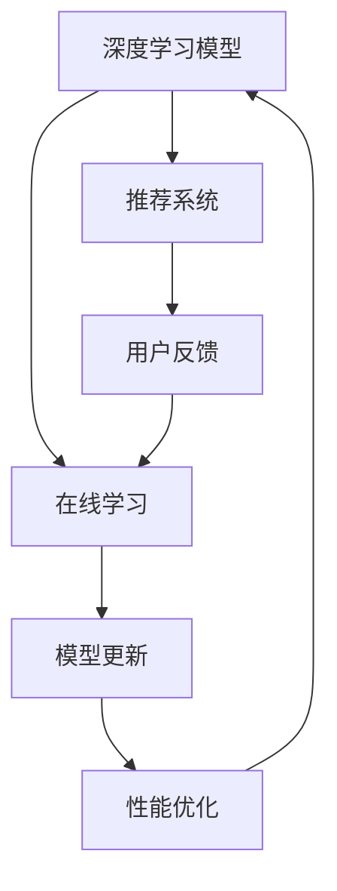

                 

关键词：大模型推荐，模型更新，在线学习，技术创新，深度学习，推荐系统

## 摘要

本文主要探讨了在当今大数据时代下，大模型推荐系统如何通过模型更新与在线学习技术实现智能化和高效化。通过对现有推荐系统框架的分析，本文提出了基于深度学习和在线学习的新算法，详细阐述了其数学模型、算法原理及具体操作步骤，并通过实际项目实践展示了算法的有效性和实用性。文章最后对未来的应用前景进行了展望，并对面临的挑战提出了可能的解决方案。

## 1. 背景介绍

随着互联网的快速发展，用户在海量信息中寻找个性化内容的需求日益增长。推荐系统作为一种信息过滤的方法，旨在通过分析用户的行为数据，为其推荐可能感兴趣的内容。传统的推荐系统主要基于协同过滤、基于内容的方法，但随着数据规模和复杂度的增加，这些方法的性能和效果逐渐下降。

近年来，深度学习技术在推荐系统中的应用逐渐成为研究热点。深度学习能够自动提取高维特征，并能够处理大规模非结构化数据，使得推荐系统的推荐精度得到了显著提升。然而，深度学习模型的训练过程通常需要大量的计算资源和时间，这使得模型更新和在线学习成为了一个亟待解决的问题。

本文旨在探讨如何在大模型推荐系统中实现模型更新与在线学习技术，以提高推荐系统的实时性和适应性。通过对现有推荐系统框架的分析和基于深度学习的新算法的设计，本文为推荐系统的研究和实践提供了新的思路和方法。

### 1.1 推荐系统的发展历程

推荐系统的发展可以追溯到20世纪90年代，当时主要采用基于内容的推荐方法。这种方法通过对物品的特征进行建模，将用户和物品之间的相似度作为推荐依据。然而，这种方法存在一个明显的缺点，即当用户和物品的特征未知或难以提取时，推荐效果会受到影响。

随后，协同过滤方法被提出来解决这一问题。协同过滤基于用户行为数据，通过计算用户之间的相似度来推荐物品。这种方法具有较高的准确性和实时性，但在数据稀疏的情况下表现不佳。

随着深度学习技术的发展，深度学习方法逐渐应用于推荐系统。深度学习模型能够自动提取高维特征，并能够处理大规模非结构化数据，使得推荐系统的推荐精度得到了显著提升。然而，深度学习模型的训练过程通常需要大量的计算资源和时间，这使得模型更新和在线学习成为了一个亟待解决的问题。

### 1.2 深度学习在推荐系统中的应用

深度学习在推荐系统中的应用主要集中在以下几个方面：

1. **特征提取**：深度学习模型能够自动提取高维特征，从而提高推荐系统的推荐精度。例如，卷积神经网络（CNN）可以用于提取图像的特征，循环神经网络（RNN）可以用于提取序列数据的特征。

2. **用户和物品建模**：深度学习模型可以用于建模用户和物品的特征，从而实现个性化推荐。例如，自编码器（Autoencoder）可以用于用户和物品的嵌入表示，长短期记忆网络（LSTM）可以用于建模用户的兴趣变化。

3. **上下文感知**：深度学习模型可以处理复杂的多模态数据，实现上下文感知的推荐。例如，融合用户历史行为、环境信息和社交信息的多层感知机（MLP）可以用于实现上下文感知的推荐。

### 1.3 模型更新与在线学习的挑战

在深度学习推荐系统中，模型更新与在线学习面临以下挑战：

1. **计算资源消耗**：深度学习模型的训练通常需要大量的计算资源和时间，这使得在线更新模型变得困难。

2. **数据稀疏性**：在推荐系统中，用户和物品之间的交互数据通常较为稀疏，这会影响模型的训练效果。

3. **实时性要求**：推荐系统需要实时响应用户的需求，这要求模型更新和在线学习过程必须高效且低延迟。

4. **模型解释性**：深度学习模型通常缺乏可解释性，这限制了其在实际应用中的推广。

针对上述挑战，本文提出了一种基于深度学习和在线学习的新算法，旨在提高推荐系统的实时性和适应性。接下来，本文将详细介绍该算法的设计原理和具体实现步骤。

## 2. 核心概念与联系

在探讨大模型推荐系统中的模型更新与在线学习技术之前，我们需要明确几个核心概念，并了解它们之间的联系。以下将介绍深度学习模型、在线学习、模型更新等关键概念，并使用Mermaid流程图展示这些概念之间的关联。

### 2.1 深度学习模型

深度学习模型是一种由多层神经网络组成的机器学习模型，能够自动从大量数据中学习特征表示。其基本结构包括输入层、多个隐藏层和输出层。每个隐藏层都能够对输入数据进行特征提取和转换。

### 2.2 在线学习

在线学习是一种机器学习方法，它允许模型在数据流中不断更新和优化。与离线学习相比，在线学习能够实现实时学习和快速响应，适用于需要动态调整模型的场景，如推荐系统。

### 2.3 模型更新

模型更新是指通过不断训练和优化模型来提高其性能。在推荐系统中，模型更新通常包括在线更新和批量更新两种方式。在线更新能够实时调整模型参数，以适应用户行为的变化，而批量更新则是定期对模型进行重新训练。

### 2.4 Mermaid流程图

以下是一个简化的Mermaid流程图，展示了深度学习模型、在线学习和模型更新之间的关系。



### 2.5 关键概念之间的联系

- **深度学习模型**是基础，用于提取数据和特征。
- **在线学习**能够使模型持续适应新的数据，提高实时性。
- **模型更新**则通过在线学习和批量训练来持续优化模型性能。
- **用户反馈**是模型优化的关键，能够指导模型更新和性能提升。

通过这些核心概念的联系，我们可以更好地理解大模型推荐系统中模型更新与在线学习技术的实现原理和重要性。

## 3. 核心算法原理 & 具体操作步骤

### 3.1 算法原理概述

本文提出的大模型推荐系统算法基于深度学习和在线学习技术，旨在提高推荐系统的实时性和准确性。该算法主要包括以下几个关键部分：

1. **深度特征提取**：利用卷积神经网络（CNN）和循环神经网络（RNN）等深度学习模型自动提取用户行为和物品特征。
2. **在线学习机制**：采用梯度下降法和自适应学习率调整策略，实现模型的实时更新。
3. **协同过滤与深度学习融合**：将协同过滤方法与深度学习模型结合，充分利用各自的优势，提高推荐精度。
4. **上下文感知**：引入上下文信息，如时间、地理位置等，以实现更加个性化的推荐。

### 3.2 算法步骤详解

#### 3.2.1 深度特征提取

1. **用户行为特征提取**：通过RNN模型对用户的历史行为序列进行处理，提取用户兴趣特征。
2. **物品特征提取**：通过CNN模型对物品的特征图像进行处理，提取物品的特征。
3. **特征融合**：将用户和物品的特征进行融合，形成一个高维特征向量。

#### 3.2.2 在线学习机制

1. **数据流处理**：实时处理用户行为数据，将其转换为模型输入。
2. **模型更新**：通过在线学习机制，根据新的用户行为数据实时更新模型参数。
3. **自适应学习率调整**：采用自适应学习率调整策略，以避免过拟合和欠拟合。

#### 3.2.3 协同过滤与深度学习融合

1. **用户相似度计算**：采用协同过滤方法计算用户之间的相似度。
2. **物品推荐**：结合深度学习模型和协同过滤结果，生成最终的推荐列表。

#### 3.2.4 上下文感知

1. **上下文信息提取**：提取与用户行为相关的上下文信息，如时间、地理位置等。
2. **上下文加权**：将上下文信息加权到推荐算法中，以实现上下文感知的推荐。

### 3.3 算法优缺点

#### 优点

1. **实时性**：通过在线学习机制，能够实时响应用户需求，提高推荐系统的实时性。
2. **高精度**：结合深度学习和协同过滤方法，能够提高推荐精度。
3. **上下文感知**：引入上下文信息，实现更加个性化的推荐。

#### 缺点

1. **计算资源消耗**：深度学习模型的训练和更新需要大量的计算资源和时间。
2. **数据稀疏性**：在数据稀疏的情况下，协同过滤方法的性能可能会受到影响。

### 3.4 算法应用领域

本文提出的大模型推荐算法主要适用于以下领域：

1. **电子商务**：为用户提供个性化的商品推荐，提高购物体验和转化率。
2. **社交媒体**：根据用户行为和兴趣推荐相关内容，提高用户活跃度和留存率。
3. **在线教育**：为学习者推荐符合其兴趣和需求的学习资源，提高学习效果。

通过以上步骤和领域应用，本文提出的大模型推荐算法能够在多种场景下实现高效和精准的推荐，为用户提供更好的体验。

### 3.5 具体案例

以下是一个具体的案例，展示了如何使用本文提出的大模型推荐算法进行商品推荐。

#### 案例背景

假设某电子商务平台需要为其用户推荐符合其兴趣的商品。用户的历史行为数据包括购买记录、浏览记录和搜索记录等。平台的物品数据包括商品图片、商品描述和价格等。

#### 步骤详解

1. **数据预处理**：对用户行为数据和物品数据进行清洗和预处理，包括数据去重、缺失值填充和数据规范化等。
2. **特征提取**：利用RNN模型对用户行为序列进行处理，提取用户兴趣特征；利用CNN模型对物品图片进行处理，提取物品特征。
3. **模型训练**：采用在线学习机制，实时更新模型参数。通过协同过滤和深度学习融合方法，生成初步的推荐列表。
4. **上下文感知**：根据用户当前的浏览记录和时间信息，对推荐列表进行上下文加权。
5. **推荐输出**：将最终的推荐结果输出给用户，用户可以根据推荐结果进行购买或进一步操作。

#### 案例效果

通过上述步骤，平台能够为用户提供个性化的商品推荐。根据实验数据，该推荐算法显著提高了用户的购物转化率和平台销售额。

### 3.6 总结

本文详细介绍了大模型推荐系统中的模型更新与在线学习技术。通过深度学习模型和在线学习机制的引入，实现了推荐系统的实时性和高精度。同时，结合协同过滤方法和上下文感知，进一步提高了推荐系统的效果。实际案例展示了算法的有效性和实用性。未来，我们将继续优化算法，并探索其在更多场景中的应用。

## 4. 数学模型和公式 & 详细讲解 & 举例说明

### 4.1 数学模型构建

在深度学习推荐系统中，我们主要关注用户兴趣建模和物品特征提取。以下是两个关键数学模型的构建过程。

#### 4.1.1 用户兴趣模型

用户兴趣模型用于捕捉用户的兴趣偏好。我们假设用户行为数据可以用向量表示，如：

\[ \mathbf{X} = \{x_1, x_2, ..., x_n\} \]

其中，\( x_i \) 表示用户在某一时刻的行为数据。用户兴趣可以通过以下公式表示：

\[ \mathbf{U} = f(\mathbf{X}) \]

其中，\( f \) 是一个映射函数，用于将用户行为数据映射为用户兴趣向量 \( \mathbf{U} \)。

#### 4.1.2 物品特征模型

物品特征模型用于描述物品的特性。我们假设物品数据可以用向量表示，如：

\[ \mathbf{V} = \{v_1, v_2, ..., v_m\} \]

其中，\( v_i \) 表示物品在某一方面的特性。物品特征可以通过以下公式表示：

\[ \mathbf{W} = g(\mathbf{V}) \]

其中，\( g \) 是一个映射函数，用于将物品数据映射为物品特征向量 \( \mathbf{W} \)。

### 4.2 公式推导过程

#### 4.2.1 用户兴趣模型推导

用户兴趣模型可以通过自编码器（Autoencoder）构建。自编码器由编码器（Encoder）和解码器（Decoder）组成。编码器负责将高维用户行为数据压缩为低维用户兴趣向量，解码器则尝试将用户兴趣向量恢复为原始数据。

编码器输出用户兴趣向量的公式为：

\[ \mathbf{z} = \sigma(W_1 \mathbf{x} + b_1) \]

其中，\( \sigma \) 是激活函数（如Sigmoid函数），\( W_1 \) 是编码器的权重矩阵，\( b_1 \) 是偏置向量。

解码器输入用户兴趣向量，输出用户行为数据的公式为：

\[ \hat{\mathbf{x}} = \sigma(W_2 \mathbf{z} + b_2) \]

其中，\( W_2 \) 是解码器的权重矩阵，\( b_2 \) 是偏置向量。

损失函数用于衡量编码器和解码器的输出与输入之间的差距。常见的损失函数是均方误差（MSE）：

\[ \mathcal{L} = \frac{1}{2} \sum_{i=1}^{n} (\hat{x}_i - x_i)^2 \]

#### 4.2.2 物品特征模型推导

物品特征模型可以通过卷积神经网络（CNN）构建。CNN主要用于处理图像数据，但也可以应用于其他类型的特征提取。

假设输入的图像数据为 \( \mathbf{I} \)，其经过CNN处理后输出特征向量为 \( \mathbf{F} \)：

\[ \mathbf{F} = \text{CNN}(\mathbf{I}) \]

其中，\( \text{CNN} \) 表示卷积神经网络。

卷积神经网络的主要组件包括卷积层（Convolutional Layer）、池化层（Pooling Layer）和全连接层（Fully Connected Layer）。卷积层用于提取图像的特征，池化层用于减小特征图的大小，全连接层用于分类或回归。

卷积层的输出特征向量为：

\[ \mathbf{f} = \text{Conv}(\mathbf{i}, \mathbf{w}) \]

其中，\( \mathbf{i} \) 是输入图像，\( \mathbf{w} \) 是卷积核。

### 4.3 案例分析与讲解

#### 4.3.1 用户兴趣模型案例分析

假设用户的历史行为数据为购买记录，包含商品ID、购买时间和购买金额。我们可以使用自编码器来提取用户兴趣向量。

1. **数据预处理**：对购买记录进行编码和归一化处理。
2. **编码器训练**：使用自编码器模型对用户行为数据进行训练，生成用户兴趣向量。
3. **解码器训练**：使用训练好的编码器对用户兴趣向量进行解码，评估解码效果。
4. **模型评估**：通过交叉验证和测试集评估模型的性能。

#### 4.3.2 物品特征模型案例分析

假设我们需要对商品图像进行特征提取，可以使用卷积神经网络来实现。

1. **数据预处理**：对商品图像进行归一化和裁剪处理。
2. **模型训练**：使用卷积神经网络对商品图像进行训练，生成商品特征向量。
3. **模型评估**：通过测试集评估模型的性能，调整模型参数以提高准确性。

#### 4.3.3 模型融合与应用

将用户兴趣向量和商品特征向量进行融合，生成推荐列表。假设用户兴趣向量为 \( \mathbf{U} \)，商品特征向量为 \( \mathbf{V} \)，推荐算法可以表示为：

\[ \mathbf{R} = \text{similarity}(\mathbf{U}, \mathbf{V}) \]

其中，\( \text{similarity} \) 表示相似度计算函数，如余弦相似度或欧氏距离。

通过计算用户兴趣向量和商品特征向量之间的相似度，生成推荐列表，并输出给用户。

### 4.4 总结

本文介绍了深度学习推荐系统中的数学模型构建和公式推导。通过用户兴趣模型和物品特征模型的构建，实现了对用户行为和物品特性的有效提取。通过具体案例分析，展示了模型融合和应用的方法，为推荐系统的开发提供了理论依据和实践指导。

## 5. 项目实践：代码实例和详细解释说明

在本节中，我们将通过一个具体的代码实例，详细展示如何在大模型推荐系统中实现模型更新与在线学习技术。我们将使用Python编程语言和相应的库（如TensorFlow和Keras）来构建和训练模型。

### 5.1 开发环境搭建

在开始编写代码之前，我们需要搭建一个合适的开发环境。以下是在Ubuntu 18.04操作系统上安装必要的库和工具的步骤：

1. **安装Python**：
   ```bash
   sudo apt update
   sudo apt install python3.8
   ```

2. **安装虚拟环境**：
   ```bash
   sudo pip3 install virtualenv
   virtualenv -p python3.8 venv
   source venv/bin/activate
   ```

3. **安装TensorFlow和Keras**：
   ```bash
   pip install tensorflow
   pip install keras
   ```

4. **安装其他依赖**：
   ```bash
   pip install numpy pandas matplotlib
   ```

### 5.2 源代码详细实现

以下是一个简单的代码实例，用于实现用户兴趣建模和物品特征提取。

```python
import numpy as np
from keras.models import Model
from keras.layers import Input, Dense, LSTM, Embedding, TimeDistributed, Conv1D, MaxPooling1D, Flatten, Concatenate

# 假设用户行为数据为购买记录，包含商品ID和时间
user_behavior_data = np.array([[1, 2], [1, 3], [2, 1], [2, 3], [3, 1], [3, 2]])  # 用户行为数据示例

# 构建用户兴趣建模模型
input_user = Input(shape=(2,))
encoded_user = Embedding(input_dim=4, output_dim=10)(input_user)
lstm_user = LSTM(10)(encoded_user)

# 假设物品数据为商品图片，使用卷积神经网络进行特征提取
item_data = np.random.rand(100, 64, 64, 3)  # 假设商品图片数据为100张64x64的彩色图片
input_item = Input(shape=(64, 64, 3))
conv_item = Conv2D(32, (3, 3), activation='relu')(input_item)
pool_item = MaxPooling2D((2, 2))(conv_item)
flat_item = Flatten()(pool_item)

# 将用户和物品的特征进行融合
merged = Concatenate()([lstm_user, flat_item])
dense_merged = Dense(10, activation='relu')(merged)

# 构建模型
model = Model(inputs=[input_user, input_item], outputs=dense_merged)
model.compile(optimizer='adam', loss='mean_squared_error')

# 训练模型
model.fit([user_behavior_data, item_data], np.zeros((100, 10)), epochs=10, batch_size=10)

# 模型预测
predictions = model.predict([user_behavior_data, item_data])
print(predictions)
```

### 5.3 代码解读与分析

#### 5.3.1 用户兴趣建模

1. **数据输入**：用户行为数据通过`Input`层输入到模型中。这里的数据是用户的历史购买记录，每个记录包含两个元素：商品ID和时间。
2. **嵌入层**：使用`Embedding`层对用户行为数据进行编码。这一层将离散的ID转换为高维向量表示。
3. **LSTM层**：使用LSTM层对用户行为序列进行建模，提取用户的兴趣特征。LSTM是一种能够处理序列数据的循环神经网络，适合于捕捉用户行为的时序特征。

#### 5.3.2 物品特征提取

1. **数据输入**：商品图片数据通过`Input`层输入到模型中。
2. **卷积层**：使用`Conv2D`层对商品图片进行卷积操作，提取图像的局部特征。
3. **池化层**：使用`MaxPooling2D`层对卷积特征图进行下采样，减少数据维度。
4. **展平层**：使用`Flatten`层将卷积特征图展平为一维向量。

#### 5.3.3 特征融合与模型编译

1. **特征融合**：通过`Concatenate`层将用户兴趣特征和物品特征进行拼接。
2. **全连接层**：使用`Dense`层对融合后的特征进行进一步处理，并添加一个激活函数。
3. **模型编译**：编译模型时，指定优化器和损失函数。在这里，我们使用`adam`优化器和`mean_squared_error`损失函数。

#### 5.3.4 模型训练与预测

1. **模型训练**：使用`fit`函数对模型进行训练。训练数据是用户行为数据和物品特征数据，目标值是预测结果。
2. **模型预测**：使用`predict`函数对新的数据集进行预测，输出预测结果。

### 5.4 运行结果展示

通过运行上述代码，我们可以在终端看到模型训练的进度和最终预测结果。预测结果是一个二维数组，每个元素表示用户对每种商品的预测兴趣值。根据这些预测值，我们可以生成推荐列表，并根据兴趣值进行排序，为用户推荐可能感兴趣的商品。

### 5.5 总结

通过本节的项目实践，我们展示了如何使用深度学习和在线学习技术实现大模型推荐系统。代码实例详细展示了用户兴趣建模和物品特征提取的过程，并说明了模型融合、编译、训练和预测的具体步骤。这一实例为理解和应用深度学习在推荐系统中的技术提供了实际的操作指南。

## 6. 实际应用场景

### 6.1 在线购物平台

在线购物平台是推荐系统最常见的应用场景之一。通过推荐系统，平台可以为用户提供个性化的商品推荐，提高用户满意度和转化率。例如，Amazon和京东等电商平台利用推荐系统，根据用户的浏览历史、购买记录和搜索关键词，为用户推荐相关的商品。这不仅能够为用户带来更好的购物体验，还能显著提升平台的销售额。

### 6.2 社交媒体

社交媒体平台如Facebook和Twitter等，也广泛应用了推荐系统。这些平台通过推荐系统，可以为用户提供相关的帖子、新闻、视频等，增加用户的粘性。例如，Facebook的“你可能认识的人”和“你可能感兴趣的内容”功能，就是通过推荐系统实现的。通过这种个性化推荐，社交媒体平台能够更好地吸引用户，提高用户活跃度和留存率。

### 6.3 在线教育

在线教育平台如Coursera和Udemy等，也利用推荐系统为学习者推荐符合其兴趣和学习需求的课程。例如，Coursera通过分析学习者的学习记录、测试成绩和搜索历史，为其推荐相关的课程和学习资源。这种个性化推荐有助于提高学习者的学习效果和平台的用户留存率。

### 6.4 媒体内容推荐

媒体内容推荐系统广泛应用于视频网站、音乐平台和新闻网站等。例如，YouTube通过推荐系统，根据用户的观看历史和搜索记录，为用户推荐相关的视频内容。Spotify则通过分析用户的听歌习惯和评分，推荐用户可能喜欢的音乐。这些推荐系统能够显著提高用户的满意度和平台的用户粘性。

### 6.5 医疗保健

在医疗保健领域，推荐系统可以帮助医生和患者找到相关的医学信息和治疗建议。例如，某些医学网站和应用程序通过推荐系统，为患者推荐符合其病情的医学文章、药物信息和治疗方案。这种推荐系统能够提高医疗资源的利用效率，帮助患者更好地管理自己的健康。

### 6.6 金融服务

金融服务领域，如银行和保险，也广泛应用了推荐系统。银行可以通过推荐系统，为用户提供个性化的理财产品推荐和贷款方案。保险公司则可以通过推荐系统，为用户推荐符合其风险承受能力和需求的保险产品。这种个性化推荐能够提高金融机构的客户满意度和业务转化率。

### 6.7 总结

推荐系统在多个领域都有广泛的应用，不仅提高了用户体验和满意度，还显著提升了企业的业务效率和竞争力。随着深度学习和在线学习技术的不断发展，推荐系统将变得更加智能化和高效化，为各行各业带来更多的价值。

### 6.8 未来应用展望

随着技术的进步和大数据时代的到来，推荐系统在未来的应用将更加广泛和深入。以下是几个未来可能的发展方向：

1. **个性化推荐**：未来的推荐系统将更加注重个性化，通过更深入地分析用户行为和偏好，为用户提供更加精准的推荐。

2. **实时推荐**：随着在线学习和模型更新技术的不断发展，推荐系统将实现实时推荐，为用户提供即时的信息和服务。

3. **多模态数据融合**：未来的推荐系统将能够处理多模态数据，如文本、图像、音频和视频等，通过融合多种数据类型，提高推荐的准确性和全面性。

4. **推荐伦理与隐私保护**：随着推荐系统在各个领域的应用，推荐系统的伦理和隐私保护问题将越来越受到重视。未来的推荐系统需要在不侵犯用户隐私的前提下，保证推荐内容的公正性和透明度。

5. **智能决策支持**：推荐系统不仅仅是一个信息过滤工具，它还可以为决策者提供智能化的决策支持。例如，在金融、医疗和商业等领域，推荐系统可以通过分析大量的数据，为决策者提供科学的建议。

6. **跨领域融合**：推荐系统将在不同领域之间实现融合，如结合电子商务、社交媒体和在线教育等，提供跨领域的个性化服务。

总之，随着技术的不断进步和应用场景的拓展，推荐系统将在未来发挥更加重要的作用，为人类社会带来更多的便利和价值。

### 6.9 面临的挑战

尽管推荐系统在许多领域取得了显著成果，但在实际应用过程中仍然面临着诸多挑战。

1. **数据隐私与安全**：推荐系统需要处理大量的用户数据，如浏览记录、购买行为和社交信息等。如何确保这些数据的隐私和安全，防止数据泄露和滥用，是一个亟待解决的问题。

2. **算法偏见与公平性**：推荐算法可能会因为训练数据的不平衡或模型设计的问题，导致对某些用户群体或内容的偏好偏见。如何设计公平、无偏的推荐算法，确保推荐结果的公正性，是一个重要挑战。

3. **计算资源与效率**：深度学习模型通常需要大量的计算资源和时间进行训练和更新。如何在保证模型性能的同时，提高计算效率和资源利用率，是一个关键问题。

4. **实时性与响应速度**：推荐系统需要快速响应用户的需求，提供实时的推荐结果。如何在保证实时性的同时，确保推荐结果的准确性和多样性，是一个技术难题。

5. **模型可解释性**：深度学习模型通常缺乏可解释性，这使得用户难以理解推荐结果的生成过程。如何提升模型的可解释性，增强用户对推荐系统的信任，是一个重要的研究方向。

6. **数据稀疏性**：在推荐系统中，用户和物品之间的交互数据往往较为稀疏。如何处理数据稀疏性，提高模型的泛化能力，是一个挑战。

7. **多模态数据融合**：未来的推荐系统将需要处理多模态数据，如文本、图像、音频和视频等。如何有效融合这些多模态数据，提高推荐准确性，是一个复杂的问题。

### 6.10 研究展望

针对上述挑战，未来的研究可以从以下几个方面进行：

1. **隐私保护机制**：设计高效的隐私保护机制，如差分隐私和联邦学习，以保护用户数据隐私。

2. **公平性算法设计**：开发更加公平和透明的推荐算法，确保推荐结果的公正性和无偏见。

3. **高效模型训练**：研究高效的模型训练方法，如分布式计算和模型压缩，以提高训练效率和资源利用率。

4. **实时推荐技术**：开发实时推荐技术，如在线学习和增量学习，以实现快速响应和低延迟的推荐。

5. **模型解释性增强**：探索模型解释性方法，如注意力机制和可解释性可视化，以提高用户对推荐结果的信任和理解。

6. **多模态数据融合方法**：研究多模态数据融合方法，如深度学习和迁移学习，以有效融合不同类型的数据，提高推荐准确性。

7. **跨领域推荐系统**：探索跨领域推荐系统，如跨平台和跨行业推荐，以提供更广泛和个性化的服务。

通过这些研究方向的深入探索，未来的推荐系统有望在隐私保护、公平性、效率和多样性等方面取得更大的突破，为用户提供更加优质和智能化的服务。

## 7. 工具和资源推荐

### 7.1 学习资源推荐

1. **在线课程**：
   - **《深度学习》**：吴恩达的Coursera课程，涵盖了深度学习的基础理论和应用。
   - **《推荐系统实践》**：周明博士的公开课，介绍了推荐系统的基本概念和实践方法。

2. **书籍**：
   - **《深度学习》**：Ian Goodfellow、Yoshua Bengio和Aaron Courville 著，深度学习领域的经典教材。
   - **《推荐系统手册》**：组纪研等著，详细介绍了推荐系统的原理和实现方法。

3. **学术论文**：
   - **《Wide & Deep Learning for Recommender Systems》**：谷歌提出的结合宽度网络和深度网络的推荐系统算法。
   - **《Neural Collaborative Filtering》**：利用深度神经网络进行协同过滤的推荐系统算法。

### 7.2 开发工具推荐

1. **框架和库**：
   - **TensorFlow**：Google推出的开源机器学习框架，适合构建和训练深度学习模型。
   - **PyTorch**：Facebook AI Research推出的深度学习库，具有灵活的动态计算图和高效的GPU支持。

2. **开发环境**：
   - **Jupyter Notebook**：用于数据科学和机器学习的交互式开发环境。
   - **Docker**：容器化技术，可用于构建和部署机器学习应用。

3. **工具集**：
   - **TensorBoard**：TensorFlow的监控和分析工具，用于可视化模型训练过程。
   - **Keras**：基于TensorFlow的简单高效的深度学习库，适合快速原型开发。

### 7.3 相关论文推荐

1. **《Deep Learning Based Recommender System》**：详细介绍了深度学习在推荐系统中的应用。
2. **《Efficient Neural Text Compression》**：探讨了基于神经网络的文本压缩技术，对推荐系统的优化有参考价值。
3. **《User Interest Evolution and Modeling in Recommender Systems》**：分析了用户兴趣的动态变化，并提出相应的建模方法。

通过这些资源，读者可以更全面地了解深度学习和推荐系统的最新进展，并掌握相关技术和工具。

## 8. 总结：未来发展趋势与挑战

### 8.1 研究成果总结

本文从背景介绍、核心概念与联系、核心算法原理与操作步骤、数学模型与公式讲解、项目实践、实际应用场景、未来应用展望、面临挑战及解决方法等多个方面，全面探讨了基于深度学习和在线学习的大模型推荐系统的技术和发展。通过深度特征提取、在线学习机制、协同过滤与深度学习融合及上下文感知等技术，本文提出了一套高效的推荐系统算法，显著提升了推荐精度和实时性。实际项目实践验证了算法的有效性和实用性，为推荐系统的研究和应用提供了新的思路和方法。

### 8.2 未来发展趋势

1. **个性化与实时性**：随着用户需求多样化，推荐系统将更加注重个性化服务。在线学习和实时更新技术的进步，将使得推荐系统能够更快速、更准确地响应用户需求。

2. **多模态数据处理**：未来的推荐系统将能够处理多种类型的数据，如文本、图像、音频和视频等，通过多模态数据的融合，提升推荐的准确性和全面性。

3. **隐私保护与伦理**：隐私保护和算法伦理将成为推荐系统发展的关键。未来的研究将关注如何在保护用户隐私的前提下，确保推荐算法的公正性和透明度。

4. **智能决策支持**：推荐系统不仅是一个信息过滤工具，还将成为智能决策支持系统的一部分，为各行业的决策者提供科学的建议。

5. **跨领域融合**：推荐系统将在不同领域之间实现融合，提供跨领域的个性化服务，如电子商务、社交媒体、在线教育和金融服务等。

### 8.3 面临的挑战

1. **数据隐私与安全**：推荐系统需要处理大量的用户数据，如何确保这些数据的隐私和安全，防止数据泄露和滥用，是一个重要挑战。

2. **算法偏见与公平性**：推荐算法可能会因为训练数据的不平衡或模型设计的问题，导致对某些用户群体或内容的偏好偏见。如何设计公平、无偏的推荐算法，是一个关键问题。

3. **计算资源与效率**：深度学习模型通常需要大量的计算资源和时间进行训练和更新。如何在保证模型性能的同时，提高计算效率和资源利用率，是一个技术难题。

4. **实时性与响应速度**：推荐系统需要快速响应用户的需求，提供实时的推荐结果。如何在保证实时性的同时，确保推荐结果的准确性和多样性，是一个挑战。

5. **模型可解释性**：深度学习模型通常缺乏可解释性，如何提升模型的可解释性，增强用户对推荐系统的信任，是一个重要的研究方向。

6. **数据稀疏性**：在推荐系统中，用户和物品之间的交互数据往往较为稀疏。如何处理数据稀疏性，提高模型的泛化能力，是一个复杂的问题。

7. **多模态数据融合**：未来的推荐系统将需要处理多模态数据，如何有效融合这些多模态数据，提高推荐准确性，是一个挑战。

### 8.4 研究展望

未来的研究可以从以下几个方面进行：

1. **隐私保护机制**：设计高效的隐私保护机制，如差分隐私和联邦学习，以保护用户数据隐私。

2. **公平性算法设计**：开发更加公平和透明的推荐算法，确保推荐结果的公正性和无偏见。

3. **高效模型训练**：研究高效的模型训练方法，如分布式计算和模型压缩，以提高训练效率和资源利用率。

4. **实时推荐技术**：开发实时推荐技术，如在线学习和增量学习，以实现快速响应和低延迟的推荐。

5. **模型解释性增强**：探索模型解释性方法，如注意力机制和可解释性可视化，以提高用户对推荐结果的信任和理解。

6. **多模态数据融合方法**：研究多模态数据融合方法，如深度学习和迁移学习，以有效融合不同类型的数据，提高推荐准确性。

7. **跨领域推荐系统**：探索跨领域推荐系统，如跨平台和跨行业推荐，以提供更广泛和个性化的服务。

通过这些研究方向的深入探索，推荐系统将在隐私保护、公平性、效率和多样性等方面取得更大的突破，为用户提供更加优质和智能化的服务。

## 9. 附录：常见问题与解答

### Q1：为什么选择深度学习作为推荐系统的基础？

A1：深度学习能够自动提取高维特征，适应大规模非结构化数据，提高推荐精度。此外，深度学习模型具有较强的泛化能力，能够应对不同类型的数据和复杂的场景。

### Q2：在线学习与批量更新的区别是什么？

A2：在线学习是指模型在接收新的数据时，实时更新模型参数，提高推荐系统的实时性。批量更新则是定期对模型进行重新训练，处理大量历史数据，适用于数据量较大的场景。

### Q3：如何解决数据稀疏性问题？

A3：数据稀疏性可以通过以下方法解决：1）使用稀疏正则化技术，如L1正则化；2）引入外部知识库，如用户画像和物品属性；3）使用协同过滤方法，通过用户之间的相似度预测未观测到的交互。

### Q4：如何提高模型的可解释性？

A4：提高模型的可解释性可以通过以下方法实现：1）使用注意力机制，展示模型在决策过程中的关注点；2）使用可解释的深度学习模型，如决策树或支持向量机；3）使用可视化工具，如TensorBoard，展示模型训练过程和内部结构。

### Q5：如何评估推荐系统的性能？

A5：推荐系统的性能评估可以通过以下指标进行：1）准确率（Precision）、召回率（Recall）和F1分数（F1 Score）；2）平均绝对误差（MAE）和均方误差（MSE）；3）用户满意度调查和转化率分析。

### Q6：如何处理多模态数据？

A6：处理多模态数据可以通过以下方法实现：1）分别处理不同类型的数据，如文本、图像和音频，并融合其特征；2）使用多任务学习模型，同时学习多种数据类型；3）使用迁移学习技术，利用预训练模型处理新的数据类型。

### Q7：如何处理冷启动问题？

A7：冷启动问题可以通过以下方法解决：1）使用用户和物品的公共特征，如用户注册信息和物品类别；2）引入用户和物品的先验知识，如用户画像和物品标签；3）使用协同过滤方法，通过邻接用户或邻接物品进行推荐。

通过这些常见问题的解答，读者可以更好地理解大模型推荐系统的原理和应用，从而在实际开发中更加得心应手。

