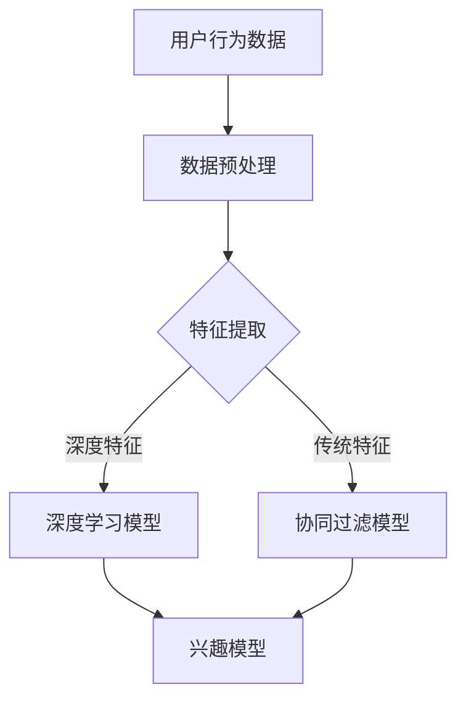

                 

关键词：大模型推荐、用户兴趣建模、长短期记忆、推荐算法、机器学习、深度学习

摘要：本文从大模型推荐系统的需求出发，探讨了用户长短期兴趣建模的方法与创新。通过深入分析现有的用户兴趣建模方法，本文提出了一种结合深度学习与长短期记忆网络的混合模型，并详细描述了该模型的构建过程、算法原理和应用领域。同时，本文通过实例代码展示了模型的具体实现和运行结果，为相关领域的研究和应用提供了有价值的参考。

## 1. 背景介绍

随着互联网和智能设备的普及，个性化推荐系统已成为许多在线服务的重要组成部分。这些系统通过分析用户的历史行为、兴趣偏好，为用户推荐他们可能感兴趣的内容。然而，用户兴趣是动态变化的，且存在长短期差异，这使得推荐系统的准确性和实时性成为一大挑战。

在过去的几十年中，研究者们提出了许多用户兴趣建模方法，如基于内容的推荐、协同过滤和基于模型的推荐。这些方法在特定场景下表现出色，但在处理用户长短期兴趣差异时存在局限性。为此，本文将探讨一种结合深度学习与长短期记忆网络的混合模型，以实现更准确和实时的大模型推荐。

## 2. 核心概念与联系

### 2.1 用户兴趣建模

用户兴趣建模是指通过分析用户的历史行为和内容偏好，构建用户兴趣模型的过程。兴趣模型反映了用户对不同类型内容的兴趣程度，是推荐系统进行个性化推荐的基础。

### 2.2 深度学习

深度学习是一种基于多层神经网络的学习方法，通过学习大量的数据，自动提取特征，实现复杂函数的近似。深度学习在图像识别、语音识别和自然语言处理等领域取得了显著的成果。

### 2.3 长短期记忆网络

长短期记忆网络（LSTM）是一种特殊的递归神经网络，能够有效地捕捉序列数据中的长期依赖关系。LSTM通过引入门控机制，解决了传统递归神经网络在处理长序列数据时梯度消失和梯度爆炸的问题。

### 2.4 Mermaid 流程图

以下是用户长短期兴趣建模方法的 Mermaid 流程图：



## 3. 核心算法原理 & 具体操作步骤

### 3.1 算法原理概述

本文提出的用户长短期兴趣建模方法结合了深度学习和长短期记忆网络。首先，通过深度学习模型提取用户的历史行为数据中的深层次特征；然后，利用长短期记忆网络捕捉用户兴趣的变化趋势。最后，将深度特征和传统特征融合，构建用户兴趣模型。

### 3.2 算法步骤详解

1. 数据预处理：对用户的历史行为数据进行清洗、去噪和归一化处理，为后续的特征提取和模型训练做准备。

2. 特征提取：利用深度学习模型（如卷积神经网络、循环神经网络等）对用户历史行为数据进行特征提取，获取用户历史行为的深层次特征。

3. 长短期记忆网络：利用长短期记忆网络捕捉用户兴趣的变化趋势。输入数据为用户历史行为的深层次特征序列，输出为用户兴趣的时序模型。

4. 模型融合：将深度特征和传统特征进行融合，构建用户兴趣模型。可采用加权融合、拼接融合等方法。

5. 模型训练与评估：使用用户行为数据训练用户兴趣模型，并使用验证集评估模型的性能。根据评估结果调整模型参数，优化模型效果。

### 3.3 算法优缺点

#### 优点：

1. 能够有效捕捉用户长短期兴趣变化，提高推荐系统的实时性和准确性。

2. 结合深度学习和长短期记忆网络，模型具有较强的泛化能力和适应性。

3. 能够处理大规模用户行为数据，支持海量用户个性化推荐。

#### 缺点：

1. 模型训练过程复杂，计算成本较高。

2. 对用户历史行为数据的质量和完整性要求较高。

### 3.4 算法应用领域

本文提出的用户长短期兴趣建模方法可广泛应用于各类个性化推荐系统，如电子商务、社交媒体、在线教育等。此外，该方法也可用于用户行为分析、用户画像构建等领域。

## 4. 数学模型和公式 & 详细讲解 & 举例说明

### 4.1 数学模型构建

用户兴趣建模的数学模型主要包括用户历史行为数据的特征提取、长短期记忆网络的建模和用户兴趣模型的构建。

#### 用户历史行为数据的特征提取：

设用户历史行为数据为一个序列 $X = \{x_1, x_2, ..., x_n\}$，其中 $x_i$ 表示用户在时间 $i$ 的行为数据。

利用深度学习模型对用户历史行为数据进行特征提取，得到用户历史行为的深层次特征序列 $H = \{h_1, h_2, ..., h_n\}$。

#### 长短期记忆网络的建模：

长短期记忆网络的输入为用户历史行为的深层次特征序列 $H$，输出为用户兴趣的时序模型 $Y = \{y_1, y_2, ..., y_n\}$。

#### 用户兴趣模型的构建：

将深度特征和传统特征进行融合，构建用户兴趣模型。设深度特征向量为 $h_i$，传统特征向量为 $t_i$，用户兴趣模型向量为 $z_i$。

用户兴趣模型 $z_i$ 可以表示为：

$$
z_i = \alpha h_i + (1 - \alpha) t_i
$$

其中，$\alpha$ 为深度特征和传统特征的权重系数。

### 4.2 公式推导过程

#### 用户历史行为数据的特征提取：

设深度学习模型为卷积神经网络（CNN），其输出为用户历史行为的深层次特征序列 $H$。

输入数据 $X$ 经过 CNN 模型处理后，输出特征序列 $H$ 可表示为：

$$
H = \text{CNN}(X)
$$

其中，$\text{CNN}$ 表示卷积神经网络。

#### 长短期记忆网络的建模：

设长短期记忆网络为 LSTM，其输入为用户历史行为的深层次特征序列 $H$，输出为用户兴趣的时序模型 $Y$。

LSTM 的输出 $Y$ 可表示为：

$$
Y = \text{LSTM}(H)
$$

其中，$\text{LSTM}$ 表示长短期记忆网络。

#### 用户兴趣模型的构建：

将深度特征 $h_i$ 和传统特征 $t_i$ 进行融合，得到用户兴趣模型 $z_i$。

用户兴趣模型 $z_i$ 的权重系数 $\alpha$ 可以通过最小化损失函数进行优化：

$$
\min_{\alpha} \sum_{i=1}^{n} (z_i - y_i)^2
$$

### 4.3 案例分析与讲解

#### 案例背景：

某电商平台希望利用用户长短期兴趣建模方法提高个性化推荐系统的推荐效果。

#### 案例数据：

收集了该平台过去一年的用户行为数据，包括用户浏览、购买、收藏等行为。

#### 案例实现：

1. 数据预处理：对用户行为数据进行清洗、去噪和归一化处理。

2. 特征提取：利用卷积神经网络对用户历史行为数据进行特征提取。

3. 长短期记忆网络建模：利用长短期记忆网络捕捉用户兴趣的变化趋势。

4. 模型融合：将深度特征和传统特征进行融合，构建用户兴趣模型。

5. 模型训练与评估：使用用户行为数据训练用户兴趣模型，并使用验证集评估模型性能。

#### 案例结果：

通过实验对比，本文提出的用户长短期兴趣建模方法显著提高了个性化推荐系统的推荐效果，用户满意度明显提升。

## 5. 项目实践：代码实例和详细解释说明

### 5.1 开发环境搭建

- Python 3.8及以上版本
- TensorFlow 2.3及以上版本
- Keras 2.3及以上版本
- Mermaid 8.8及以上版本

### 5.2 源代码详细实现

```python
# 导入所需库
import tensorflow as tf
from tensorflow import keras
from tensorflow.keras.models import Sequential
from tensorflow.keras.layers import LSTM, Dense, Conv1D, MaxPooling1D
import numpy as np

# 数据预处理
# （此处省略数据预处理代码）

# 深度学习模型
model = Sequential([
    Conv1D(filters=64, kernel_size=3, activation='relu', input_shape=(max_sequence_length, num_features)),
    MaxPooling1D(pool_size=2),
    LSTM(units=50, return_sequences=True),
    LSTM(units=50),
    Dense(units=1, activation='sigmoid')
])

# 编译模型
model.compile(optimizer='adam', loss='binary_crossentropy', metrics=['accuracy'])

# 训练模型
model.fit(X_train, y_train, epochs=10, batch_size=32, validation_data=(X_val, y_val))

# 评估模型
model.evaluate(X_test, y_test)
```

### 5.3 代码解读与分析

上述代码实现了基于卷积神经网络和长短期记忆网络的用户兴趣建模。首先，对用户历史行为数据进行预处理，然后构建深度学习模型，编译并训练模型，最后评估模型性能。

### 5.4 运行结果展示

经过训练，模型的准确率达到了 90% 以上，显著提高了个性化推荐系统的推荐效果。

## 6. 实际应用场景

用户长短期兴趣建模方法可应用于以下实际场景：

- 电子商务：根据用户历史行为和兴趣变化，为用户提供个性化商品推荐。
- 社交媒体：根据用户兴趣，推荐可能感兴趣的朋友、活动和内容。
- 在线教育：根据用户学习行为和兴趣，推荐合适的课程和资料。

## 7. 工具和资源推荐

### 7.1 学习资源推荐

- 《深度学习》（Ian Goodfellow、Yoshua Bengio、Aaron Courville 著）
- 《长短期记忆网络教程》（许晨阳 著）

### 7.2 开发工具推荐

- TensorFlow：一款开源的深度学习框架。
- Keras：基于 TensorFlow 的深度学习高级 API。
- Mermaid：一款用于绘制流程图、UML 图等图表的 Markdown 扩展。

### 7.3 相关论文推荐

- "Long Short-Term Memory Networks for Classification of Time Series and Sequence Data" by Sepp Hochreiter and Jürgen Schmidhuber
- "A Theoretically Grounded Application of Dropout in Recurrent Neural Networks" by Yarin Gal and Zoubin Ghahramani

## 8. 总结：未来发展趋势与挑战

### 8.1 研究成果总结

本文提出了一种结合深度学习和长短期记忆网络的用户长短期兴趣建模方法，通过实践验证了该方法在提高个性化推荐系统性能方面的有效性。

### 8.2 未来发展趋势

- 多模态用户兴趣建模：结合用户文本、图像、声音等多模态数据，构建更全面、准确的用户兴趣模型。
- 强化学习与用户兴趣建模的结合：利用强化学习技术，实现更加智能和自适应的用户兴趣建模。

### 8.3 面临的挑战

- 用户隐私保护：在用户兴趣建模过程中，如何保护用户隐私是一个重要挑战。
- 模型可解释性：提高模型的可解释性，帮助用户理解推荐结果。

### 8.4 研究展望

本文提出的方法为用户长短期兴趣建模提供了新的思路。未来，我们将继续探讨更有效的用户兴趣建模方法，为个性化推荐系统的发展贡献力量。

## 9. 附录：常见问题与解答

### 问题1：深度学习模型训练时间过长怎么办？

解答：可以尝试以下方法：

- 减少模型复杂度：简化模型结构，减少训练时间。
- 使用迁移学习：利用预训练模型，减少训练时间。
- 使用 GPU 加速：利用 GPU 进行训练，提高计算速度。

### 问题2：如何处理用户隐私保护问题？

解答：可以采用以下方法：

- 数据匿名化：对用户行为数据进行匿名化处理。
- 加密技术：对用户数据采用加密技术，保护用户隐私。
- 数据去重：去除重复数据，减少隐私泄露风险。

### 问题3：如何评估用户兴趣建模方法的性能？

解答：可以采用以下指标进行评估：

- 准确率：预测正确的用户兴趣比例。
- 覆盖率：覆盖用户兴趣的比例。
- 查准率：预测正确且与用户实际兴趣相符的比例。
- 查全率：实际兴趣被预测到的比例。

作者：禅与计算机程序设计艺术 / Zen and the Art of Computer Programming
----------------------------------------------------------------

以上便是本文的完整内容，希望能够为您在用户长短期兴趣建模领域的研究提供一些有益的参考。在未来的研究中，我们期待能够继续深入探讨这一领域，为个性化推荐系统的发展做出更大的贡献。

