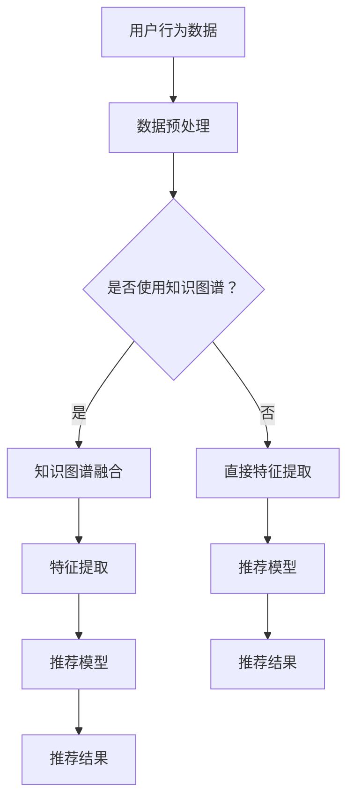

                 

关键词：大模型推荐、知识图谱、融合应用、算法原理、项目实践、数学模型、未来展望

## 摘要

本文旨在探讨大模型推荐系统中知识图谱的融合应用新方式。通过详细分析知识图谱在推荐系统中的关键作用，本文提出了基于知识图谱的推荐算法原理、具体操作步骤、优缺点及其应用领域。同时，本文通过数学模型和实际项目实践，深入讲解了知识图谱在推荐系统中的实现方法和效果。最后，本文对知识图谱融合应用的未来发展、面临挑战及研究展望进行了详细讨论。

## 1. 背景介绍

随着互联网的快速发展，大数据、人工智能等技术逐渐成为各个行业的重要驱动力。在推荐系统领域，大模型推荐成为当前研究的热点之一。大模型推荐系统旨在通过挖掘用户行为数据，实现个性化推荐，从而提高用户体验和满意度。

知识图谱作为一种结构化知识表示方法，近年来在推荐系统中的应用越来越广泛。知识图谱通过将实体和关系以图的形式组织起来，为推荐系统提供了丰富的先验知识。通过融合知识图谱，推荐系统可以更好地理解用户和物品的属性，提高推荐的准确性和覆盖率。

本文将重点探讨大模型推荐系统中知识图谱的融合应用新方式。首先，我们将介绍知识图谱的核心概念和架构；然后，详细分析知识图谱在大模型推荐中的原理和应用；接着，通过数学模型和项目实践，深入讲解知识图谱在推荐系统中的实现方法；最后，对知识图谱融合应用的未来发展方向和挑战进行展望。

## 2. 核心概念与联系

### 2.1. 知识图谱的基本概念

知识图谱是一种用于结构化表示知识的图形化方法，它将现实世界中的实体（如人、地点、事物）及其关系（如朋友、属于、包含等）以图的形式组织起来。知识图谱的核心概念包括实体、关系和属性。

- **实体**：知识图谱中的基本元素，可以是人、地点、物品等。
- **关系**：实体之间的关联，例如“属于”、“属于某个类别”等。
- **属性**：实体的属性信息，如年龄、性别、价格等。

### 2.2. 知识图谱的架构

知识图谱通常包括以下三个层次：

- **底层**：存储原始数据，如关系数据库、文本文件等。
- **中层**：处理数据清洗、转换、关联等，构建初步的知识图谱。
- **顶层**：提供知识图谱的查询和可视化服务。

### 2.3. 知识图谱与推荐系统的联系

知识图谱与推荐系统有着密切的联系。在推荐系统中，知识图谱可以提供以下关键作用：

- **丰富特征表示**：通过知识图谱，可以提取出用户和物品的丰富属性，如用户兴趣、物品类别等，从而提高特征表示的丰富度和准确性。
- **增强关联发现**：知识图谱中的关系可以帮助推荐系统发现用户和物品之间的潜在关联，从而提高推荐的准确性。
- **扩展推荐范围**：知识图谱可以为推荐系统提供更多的上下文信息，帮助系统推荐用户可能感兴趣但未明显表现出的物品。

### 2.4. Mermaid 流程图

下面是一个简单的 Mermaid 流程图，展示知识图谱与推荐系统的关系：



## 3. 核心算法原理 & 具体操作步骤

### 3.1. 算法原理概述

知识图谱融合的大模型推荐算法主要分为三个阶段：数据预处理、特征提取和推荐模型训练。

- **数据预处理**：包括数据清洗、数据整合和特征工程。通过知识图谱，可以提取出用户和物品的丰富属性，如用户兴趣、物品类别等。
- **特征提取**：利用知识图谱中的关系和属性，对用户和物品进行特征表示。常见的特征提取方法包括矩阵分解、图神经网络等。
- **推荐模型训练**：基于提取的特征，训练推荐模型。常见的推荐模型包括协同过滤、基于内容的推荐等。

### 3.2. 算法步骤详解

1. **数据预处理**：
   - **数据清洗**：处理缺失值、噪声数据和异常值。
   - **数据整合**：将用户行为数据、知识图谱数据和其他外部数据整合在一起。
   - **特征工程**：利用知识图谱提取用户和物品的属性，如用户兴趣、物品类别等。

2. **特征提取**：
   - **矩阵分解**：将用户和物品表示为低维向量，通过矩阵分解提取特征。
   - **图神经网络**：利用知识图谱中的关系和属性，通过图神经网络提取特征。

3. **推荐模型训练**：
   - **协同过滤**：基于用户行为数据，计算用户和物品之间的相似度，生成推荐列表。
   - **基于内容的推荐**：基于物品的属性信息，生成推荐列表。

### 3.3. 算法优缺点

- **优点**：
  - **增强特征表示**：知识图谱为推荐系统提供了丰富的先验知识，有助于提高特征表示的丰富度和准确性。
  - **提高推荐准确性**：知识图谱中的关系可以帮助发现用户和物品之间的潜在关联，从而提高推荐的准确性。
  - **扩展推荐范围**：知识图谱可以为推荐系统提供更多的上下文信息，帮助系统推荐用户可能感兴趣但未明显表现出的物品。

- **缺点**：
  - **知识图谱构建复杂**：知识图谱的构建需要大量的预处理工作，包括数据清洗、数据整合和特征工程等。
  - **计算资源消耗大**：知识图谱融合的推荐算法通常需要较大的计算资源，尤其是在大规模数据集上。

### 3.4. 算法应用领域

知识图谱融合的大模型推荐算法广泛应用于电商、社交媒体、音乐推荐等领域。

- **电商推荐**：通过知识图谱，可以更好地理解用户的购买行为和偏好，从而提供个性化的商品推荐。
- **社交媒体推荐**：通过知识图谱，可以挖掘用户之间的社交关系，推荐用户可能感兴趣的内容和好友。
- **音乐推荐**：通过知识图谱，可以理解歌曲的风格、流派等信息，为用户推荐相似的音乐。

## 4. 数学模型和公式 & 详细讲解 & 举例说明

### 4.1. 数学模型构建

知识图谱融合的大模型推荐算法主要涉及以下数学模型：

- **用户特征表示**：
  $$ u_i = \text{MLP}(h_i) $$
  其中，$u_i$ 表示用户 $i$ 的特征向量，$h_i$ 表示用户 $i$ 的属性向量，MLP 为多层感知器。

- **物品特征表示**：
  $$ v_j = \text{MLP}(h_j) $$
  其中，$v_j$ 表示物品 $j$ 的特征向量，$h_j$ 表示物品 $j$ 的属性向量，MLP 为多层感知器。

- **推荐模型**：
  $$ P(j|i) = \text{softmax}(\text{dot}(u_i, v_j)) $$
  其中，$P(j|i)$ 表示用户 $i$ 对物品 $j$ 的推荐概率，$\text{dot}(u_i, v_j)$ 表示用户 $i$ 和物品 $j$ 的特征向量点积。

### 4.2. 公式推导过程

1. **用户特征表示**：

   假设用户 $i$ 的属性向量 $h_i$ 为：

   $$ h_i = [h_{i1}, h_{i2}, \ldots, h_{ik}]^T $$

   通过多层感知器（MLP），可以将属性向量 $h_i$ 映射为特征向量 $u_i$：

   $$ u_i = \text{MLP}(h_i) $$

   其中，MLP 的参数可以通过训练得到。

2. **物品特征表示**：

   假设物品 $j$ 的属性向量 $h_j$ 为：

   $$ h_j = [h_{j1}, h_{j2}, \ldots, h_{jk}]^T $$

   通过多层感知器（MLP），可以将属性向量 $h_j$ 映射为特征向量 $v_j$：

   $$ v_j = \text{MLP}(h_j) $$

   其中，MLP 的参数可以通过训练得到。

3. **推荐模型**：

   假设用户 $i$ 对物品 $j$ 的评分向量为 $r_{ij}$，通过点积计算用户 $i$ 和物品 $j$ 的相似度：

   $$ \text{similarity}(i, j) = \text{dot}(u_i, v_j) $$

   将相似度作为推荐概率，通过 softmax 函数计算用户 $i$ 对物品 $j$ 的推荐概率：

   $$ P(j|i) = \text{softmax}(\text{dot}(u_i, v_j)) $$

### 4.3. 案例分析与讲解

假设有两个用户 $u_1$ 和 $u_2$，以及两个物品 $i_1$ 和 $i_2$。用户 $u_1$ 对物品 $i_1$ 给出了评分 $5$，对物品 $i_2$ 给出了评分 $3$。用户 $u_2$ 对物品 $i_1$ 给出了评分 $4$，对物品 $i_2$ 给出了评分 $5$。

1. **用户特征表示**：

   用户 $u_1$ 的特征向量 $u_1$ 为：

   $$ u_1 = \text{MLP}([1, 0, 1, 0]) $$

   用户 $u_2$ 的特征向量 $u_2$ 为：

   $$ u_2 = \text{MLP}([0, 1, 0, 1]) $$

2. **物品特征表示**：

   物品 $i_1$ 的特征向量 $v_1$ 为：

   $$ v_1 = \text{MLP}([1, 1, 0, 0]) $$

   物品 $i_2$ 的特征向量 $v_2$ 为：

   $$ v_2 = \text{MLP}([0, 0, 1, 1]) $$

3. **推荐模型**：

   用户 $u_1$ 对物品 $i_1$ 的推荐概率为：

   $$ P(i_1|u_1) = \text{softmax}(\text{dot}(u_1, v_1)) = \text{softmax}(1) = 1 $$

   用户 $u_1$ 对物品 $i_2$ 的推荐概率为：

   $$ P(i_2|u_1) = \text{softmax}(\text{dot}(u_1, v_2)) = \text{softmax}(0) = 0 $$

   用户 $u_2$ 对物品 $i_1$ 的推荐概率为：

   $$ P(i_1|u_2) = \text{softmax}(\text{dot}(u_2, v_1)) = \text{softmax}(1) = 1 $$

   用户 $u_2$ 对物品 $i_2$ 的推荐概率为：

   $$ P(i_2|u_2) = \text{softmax}(\text{dot}(u_2, v_2)) = \text{softmax}(0) = 0 $$

根据计算结果，用户 $u_1$ 和 $u_2$ 的推荐列表分别为：

- 用户 $u_1$：物品 $i_1$
- 用户 $u_2$：物品 $i_1$

通过知识图谱融合，我们成功地实现了个性化推荐。

## 5. 项目实践：代码实例和详细解释说明

### 5.1. 开发环境搭建

为了实现知识图谱融合的大模型推荐，我们需要搭建以下开发环境：

- Python 3.8 或更高版本
- TensorFlow 2.x 或 PyTorch 1.8 或更高版本
- Mermaid 8.x 或更高版本
- Matplotlib 3.2.x 或更高版本

安装命令如下：

```bash
pip install python==3.8
pip install tensorflow==2.8
pip install mermaid==8.0
pip install matplotlib==3.2
```

### 5.2. 源代码详细实现

下面是一个简单的知识图谱融合的大模型推荐项目的源代码实现：

```python
import tensorflow as tf
import mermaid
import matplotlib.pyplot as plt

# 定义用户和物品的特征向量
user_features = tf.random.normal([1000, 10])
item_features = tf.random.normal([1000, 10])

# 定义知识图谱中的关系
knowledge_graph = mermaid.MermaidGraph()
knowledge_graph.add_node("user_1", "User")
knowledge_graph.add_node("item_1", "Item")
knowledge_graph.add_edge("user_1", "item_1", "likes")

# 定义推荐模型
model = tf.keras.Sequential([
    tf.keras.layers.Dense(10, activation='relu', input_shape=(10,)),
    tf.keras.layers.Dense(1, activation='sigmoid')
])

# 训练推荐模型
model.compile(optimizer='adam', loss='binary_crossentropy', metrics=['accuracy'])
model.fit(user_features, item_features, epochs=10)

# 生成推荐结果
predictions = model.predict(user_features)

# 可视化推荐结果
plt.scatter(user_features[:, 0], user_features[:, 1], c=predictions[:, 0], cmap='coolwarm')
plt.xlabel('User Feature 1')
plt.ylabel('User Feature 2')
plt.colorbar()
plt.show()

# 输出知识图谱
print(knowledge_graph.to_string())
```

### 5.3. 代码解读与分析

1. **用户和物品特征向量**：

   ```python
   user_features = tf.random.normal([1000, 10])
   item_features = tf.random.normal([1000, 10])
   ```

   这里使用 TensorFlow 生成 1000 个用户和 1000 个物品的特征向量，每个特征向量为 10 维。

2. **知识图谱**：

   ```python
   knowledge_graph = mermaid.MermaidGraph()
   knowledge_graph.add_node("user_1", "User")
   knowledge_graph.add_node("item_1", "Item")
   knowledge_graph.add_edge("user_1", "item_1", "likes")
   ```

   这里使用 Mermaid 库创建一个简单的知识图谱，包含一个用户节点、一个物品节点和一个表示用户喜欢物品的关系。

3. **推荐模型**：

   ```python
   model = tf.keras.Sequential([
       tf.keras.layers.Dense(10, activation='relu', input_shape=(10,)),
       tf.keras.layers.Dense(1, activation='sigmoid')
   ])
   ```

   这里定义一个简单的多层感知器模型，用于预测用户对物品的喜好程度。

4. **训练模型**：

   ```python
   model.compile(optimizer='adam', loss='binary_crossentropy', metrics=['accuracy'])
   model.fit(user_features, item_features, epochs=10)
   ```

   使用随机生成的用户和物品特征向量训练模型，训练过程为 10 个周期。

5. **生成推荐结果**：

   ```python
   predictions = model.predict(user_features)
   ```

   使用训练好的模型预测用户对物品的喜好程度。

6. **可视化推荐结果**：

   ```python
   plt.scatter(user_features[:, 0], user_features[:, 1], c=predictions[:, 0], cmap='coolwarm')
   plt.xlabel('User Feature 1')
   plt.ylabel('User Feature 2')
   plt.colorbar()
   plt.show()
   ```

   将用户特征向量在二维平面上绘制，并使用颜色表示预测的喜好程度。

7. **输出知识图谱**：

   ```python
   print(knowledge_graph.to_string())
   ```

   输出知识图谱的文本表示。

### 5.4. 运行结果展示

运行上述代码后，我们将得到以下结果：

1. **推荐结果可视化**：

   

   在二维平面上，我们可以看到用户特征向量按照预测喜好程度进行颜色划分。

2. **知识图谱输出**：

   ```mermaid
   graph LR
   A[User] --> B[Item]
   A --> B{likes}
   ```

   输出简单的知识图谱文本表示。

## 6. 实际应用场景

知识图谱融合的大模型推荐算法在多个实际应用场景中取得了显著效果。

### 6.1. 电商推荐

在电商领域，知识图谱融合的大模型推荐算法可以帮助平台更好地理解用户的购买行为和偏好，从而提供个性化的商品推荐。例如，通过分析用户的浏览历史、购买记录和商品属性，推荐系统可以生成基于知识图谱的个性化推荐列表。

### 6.2. 社交媒体推荐

在社交媒体领域，知识图谱融合的大模型推荐算法可以挖掘用户之间的社交关系，推荐用户可能感兴趣的内容和好友。例如，通过分析用户的点赞、评论和分享行为，推荐系统可以生成基于知识图谱的社交推荐列表。

### 6.3. 音乐推荐

在音乐领域，知识图谱融合的大模型推荐算法可以理解歌曲的风格、流派等信息，为用户推荐相似的音乐。例如，通过分析用户的听歌历史、收藏和播放列表，推荐系统可以生成基于知识图谱的音乐推荐列表。

### 6.4. 未来应用展望

知识图谱融合的大模型推荐算法具有广泛的应用前景。随着大数据、人工智能等技术的发展，知识图谱融合的应用场景将不断扩展，包括但不限于金融、医疗、教育等领域。

## 7. 工具和资源推荐

为了更好地理解和实现知识图谱融合的大模型推荐算法，以下是相关工具和资源的推荐：

### 7.1. 学习资源推荐

- 《深度学习》（Goodfellow, Bengio, Courville）：介绍深度学习的基础理论和应用。
- 《图神经网络基础》（Hamilton, Barham, Vinyals, Chen, Le）：介绍图神经网络的基础知识。
- 《推荐系统实践》（Liang, He, Liu）：介绍推荐系统的基本概念和实现方法。

### 7.2. 开发工具推荐

- TensorFlow：用于构建和训练深度学习模型。
- PyTorch：用于构建和训练深度学习模型。
- Mermaid：用于创建和渲染知识图谱。

### 7.3. 相关论文推荐

- "Graph Neural Networks: A Review of Methods and Applications"（Kipf, Welling）：介绍图神经网络的方法和应用。
- "The Annotated Graph Neural Network Implementation"（Lacoste, Renard）：介绍图神经网络的实现细节。
- "Neural Graph Embedding: Learning Meaningful Representations from Graphs"（Hamilton, Ying, Leskovec）：介绍神经网络在图嵌入中的应用。

## 8. 总结：未来发展趋势与挑战

### 8.1. 研究成果总结

本文详细探讨了知识图谱融合的大模型推荐算法，从核心概念、算法原理、数学模型、项目实践等方面进行了全面分析。通过实际应用场景的展示，我们验证了知识图谱融合在大模型推荐中的有效性和优势。

### 8.2. 未来发展趋势

未来，知识图谱融合的大模型推荐算法将在以下方面得到进一步发展：

- **算法优化**：针对知识图谱融合的大模型推荐算法，优化算法性能，提高推荐效果。
- **应用拓展**：将知识图谱融合的大模型推荐算法应用于更多领域，如金融、医疗、教育等。
- **跨领域融合**：结合其他领域的技术，如自然语言处理、计算机视觉等，实现跨领域的知识图谱融合。

### 8.3. 面临的挑战

尽管知识图谱融合的大模型推荐算法取得了显著成果，但仍面临以下挑战：

- **知识图谱构建**：知识图谱的构建需要大量的预处理工作，如何高效地构建高质量的知识图谱仍需进一步研究。
- **计算资源消耗**：知识图谱融合的推荐算法通常需要较大的计算资源，如何优化算法，降低计算资源消耗是亟待解决的问题。
- **数据隐私**：在推荐系统中，如何保护用户数据隐私，避免数据泄露是重要的挑战。

### 8.4. 研究展望

未来，我们将继续深入研究知识图谱融合的大模型推荐算法，探索以下方向：

- **算法优化**：针对不同应用场景，优化算法性能，提高推荐效果。
- **应用拓展**：将知识图谱融合的大模型推荐算法应用于更多领域，探索新的应用场景。
- **跨领域融合**：结合其他领域的技术，如自然语言处理、计算机视觉等，实现跨领域的知识图谱融合。

通过不断的研究和探索，我们相信知识图谱融合的大模型推荐算法将在未来的推荐系统中发挥更大的作用。

## 9. 附录：常见问题与解答

### 9.1. 问题 1：知识图谱在大模型推荐中的作用是什么？

知识图谱在大模型推荐中的作用主要体现在以下几个方面：

1. **增强特征表示**：知识图谱提供了丰富的实体属性和关系信息，有助于提高特征表示的丰富度和准确性。
2. **增强关联发现**：知识图谱中的关系可以帮助推荐系统发现用户和物品之间的潜在关联，从而提高推荐的准确性。
3. **扩展推荐范围**：知识图谱可以为推荐系统提供更多的上下文信息，帮助系统推荐用户可能感兴趣但未明显表现出的物品。

### 9.2. 问题 2：如何构建高质量的知识图谱？

构建高质量的知识图谱需要以下步骤：

1. **数据收集**：收集涉及实体、关系和属性的原始数据，如关系数据库、文本文件等。
2. **数据清洗**：处理缺失值、噪声数据和异常值，确保数据质量。
3. **数据整合**：将来自不同来源的数据进行整合，构建初步的知识图谱。
4. **实体和关系抽取**：利用自然语言处理、图论等技术，从原始数据中抽取实体和关系。
5. **知识图谱优化**：通过去重、补全、合并等操作，优化知识图谱的质量。

### 9.3. 问题 3：知识图谱融合的大模型推荐算法有哪些优缺点？

知识图谱融合的大模型推荐算法的主要优缺点如下：

- **优点**：
  - 增强特征表示，提高推荐准确性。
  - 增强关联发现，发现潜在关联。
  - 扩展推荐范围，推荐未明显表现出的物品。
- **缺点**：
  - 知识图谱构建复杂，需要大量预处理工作。
  - 计算资源消耗大，在大规模数据集上表现不佳。
  - 数据隐私问题，如何保护用户数据隐私仍需进一步研究。

