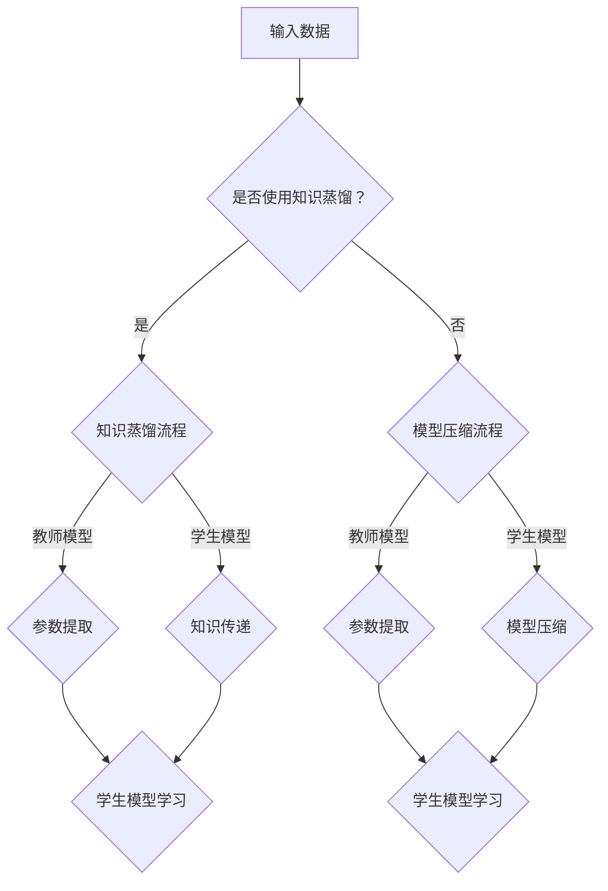

                 

关键词：大模型推荐、知识蒸馏、模型压缩、算法原理、数学模型、实践应用、未来展望

>摘要：本文将探讨在大模型推荐系统中，知识蒸馏与模型压缩技术的应用。首先介绍知识蒸馏与模型压缩的基本概念，然后详细解析其核心算法原理、数学模型，并通过实际项目实践进行代码实例解析。最后，探讨该技术在实际应用场景中的价值，并展望其未来发展趋势与面临的挑战。

## 1. 背景介绍

随着互联网的快速发展，用户生成的数据量呈指数级增长。为了满足用户对个性化推荐服务的需求，各类推荐系统应运而生。推荐系统通过分析用户的历史行为和偏好，为用户提供个性化的推荐结果。然而，随着推荐系统规模的不断扩大，模型的复杂度和计算成本也随之增加。

在大模型推荐系统中，知识蒸馏与模型压缩技术逐渐成为研究的热点。知识蒸馏是一种将复杂模型（教师模型）的知识传递给简单模型（学生模型）的技术，从而实现模型压缩与加速。模型压缩则是在保证模型性能的前提下，降低模型的参数量和计算复杂度，从而提高推荐系统的效率和可扩展性。

本文旨在介绍知识蒸馏与模型压缩技术在大模型推荐系统中的应用，深入分析其算法原理和数学模型，并通过实际项目实践进行代码实例解析，为读者提供全面的技术解析和实践指导。

## 2. 核心概念与联系

### 2.1 知识蒸馏

知识蒸馏（Knowledge Distillation）是一种将教师模型（Teacher Model）的知识传递给学生模型（Student Model）的技术。在深度学习中，教师模型通常是一个大型的复杂模型，而学生模型则是一个小型的简单模型。通过知识蒸馏，学生模型可以学习到教师模型的精髓，从而在保持性能的前提下，实现模型的压缩与加速。

### 2.2 模型压缩

模型压缩（Model Compression）是指通过各种技术手段，降低模型的参数量和计算复杂度，从而提高模型的效率和可扩展性。常见的模型压缩技术包括权重剪枝（Weight Pruning）、量化（Quantization）、低秩分解（Low-Rank Factorization）等。

### 2.3 知识蒸馏与模型压缩的联系

知识蒸馏与模型压缩密切相关。知识蒸馏技术通过将教师模型的知识传递给学生模型，实现模型压缩与加速。而模型压缩技术则通过降低模型的参数量和计算复杂度，进一步提高推荐系统的效率和可扩展性。

### 2.4 Mermaid 流程图

下面是知识蒸馏与模型压缩技术的 Mermaid 流程图：



## 3. 核心算法原理 & 具体操作步骤

### 3.1 算法原理概述

知识蒸馏与模型压缩的核心算法原理主要涉及以下几个方面：

1. **教师模型的选择**：教师模型通常是一个大型的复杂模型，具有较强的泛化能力。学生模型则是一个小型的简单模型，旨在继承教师模型的核心知识。

2. **知识传递**：通过将教师模型的参数、中间层表示或输出传递给学生模型，实现知识蒸馏。

3. **学生模型的学习**：学生模型在接收到教师模型的知识后，通过反向传播算法进行模型训练，不断优化参数。

4. **模型压缩**：在保证模型性能的前提下，通过各种技术手段降低模型的参数量和计算复杂度。

### 3.2 算法步骤详解

1. **教师模型的选择**：选择一个大型、复杂的教师模型，例如BERT、GPT等。

2. **学生模型的选择**：选择一个小型、简单的学生模型，例如Linear Model、Convolutional Neural Network（CNN）等。

3. **知识传递**：

   - **参数提取**：提取教师模型的参数、中间层表示或输出。
   - **知识融合**：将提取的知识融合到学生模型中，例如通过加权求和或拼接等方式。

4. **学生模型的学习**：通过反向传播算法，对学生模型进行训练，不断优化参数。

5. **模型压缩**：

   - **权重剪枝**：通过剪枝冗余的权重，降低模型参数量。
   - **量化**：通过降低模型参数的精度，减少计算复杂度。
   - **低秩分解**：通过将高秩矩阵分解为低秩矩阵，降低计算复杂度。

### 3.3 算法优缺点

1. **优点**：

   - **高效性**：通过知识蒸馏与模型压缩，可以大幅提高推荐系统的效率和可扩展性。
   - **灵活性**：支持多种教师模型和学生模型的选择，适用于不同的应用场景。

2. **缺点**：

   - **计算成本**：知识蒸馏与模型压缩过程需要大量的计算资源。
   - **性能损失**：在模型压缩过程中，可能会损失一定的模型性能。

### 3.4 算法应用领域

知识蒸馏与模型压缩技术在大模型推荐系统中具有广泛的应用前景，包括但不限于以下几个方面：

1. **推荐系统**：通过知识蒸馏与模型压缩，可以大幅提高推荐系统的效率和可扩展性，满足大规模用户的需求。
2. **自然语言处理**：知识蒸馏与模型压缩技术可以应用于自然语言处理任务，如文本分类、情感分析等。
3. **计算机视觉**：知识蒸馏与模型压缩技术可以应用于计算机视觉任务，如图像分类、目标检测等。

## 4. 数学模型和公式 & 详细讲解 & 举例说明

### 4.1 数学模型构建

在大模型推荐系统中，知识蒸馏与模型压缩的数学模型主要包括以下两个方面：

1. **知识蒸馏模型**：

   - **输入**：教师模型的输出 `O_t` 和学生模型的输出 `O_s`。
   - **目标**：最小化教师模型输出与学生模型输出之间的差距，即 `L KD = -σ(Y_log(O_s) + (1 - Y) * log(1 - O_s))`，其中 `σ` 表示softmax函数，`Y` 表示真实标签。

2. **模型压缩模型**：

   - **输入**：教师模型的权重矩阵 `W_t` 和学生模型的权重矩阵 `W_s`。
   - **目标**：最小化教师模型权重与学生模型权重之间的差距，即 `L MC = ||W_t - W_s||^2`。

### 4.2 公式推导过程

1. **知识蒸馏模型推导**：

   - **损失函数**：知识蒸馏的损失函数主要基于softmax交叉熵损失函数，旨在最小化教师模型输出与学生模型输出之间的差距。
   - **梯度计算**：通过反向传播算法，计算学生模型参数的梯度，并进行参数更新。

2. **模型压缩模型推导**：

   - **损失函数**：模型压缩的损失函数主要基于L2正则化，旨在最小化教师模型权重与学生模型权重之间的差距。
   - **梯度计算**：通过反向传播算法，计算学生模型参数的梯度，并进行参数更新。

### 4.3 案例分析与讲解

假设我们有一个教师模型BERT，其输出维度为512，学生模型Linear Model，其输出维度为10。我们将通过知识蒸馏与模型压缩技术，实现教师模型BERT的知识传递和学生模型Linear Model的压缩。

1. **知识蒸馏模型**：

   - **输入**：教师模型BERT的输出 `O_t`，学生模型Linear Model的输出 `O_s`。
   - **目标**：最小化教师模型BERT输出与学生模型Linear Model输出之间的差距，即 `L KD = -σ(Y_log(O_s) + (1 - Y) * log(1 - O_s))`。

2. **模型压缩模型**：

   - **输入**：教师模型BERT的权重矩阵 `W_t`，学生模型Linear Model的权重矩阵 `W_s`。
   - **目标**：最小化教师模型BERT权重与学生模型Linear Model权重之间的差距，即 `L MC = ||W_t - W_s||^2`。

通过以上两个模型的训练，我们可以实现教师模型BERT的知识传递和学生模型Linear Model的压缩，从而提高推荐系统的效率和可扩展性。

## 5. 项目实践：代码实例和详细解释说明

### 5.1 开发环境搭建

为了实现知识蒸馏与模型压缩技术在大模型推荐系统中的应用，我们需要搭建一个合适的开发环境。以下是一个简单的开发环境搭建步骤：

1. **安装Python环境**：确保Python版本为3.6及以上，并安装相关依赖库，如TensorFlow、PyTorch等。

2. **准备数据集**：收集并预处理推荐系统的数据集，例如电影推荐数据集、电商交易数据集等。

3. **配置教师模型和学生模型**：选择合适的教师模型和学生模型，例如BERT和Linear Model。

4. **安装其他依赖库**：根据实际需求，安装其他必要的依赖库，如NumPy、Pandas等。

### 5.2 源代码详细实现

以下是一个简单的代码示例，展示了知识蒸馏与模型压缩技术在大模型推荐系统中的应用：

```python
import tensorflow as tf
from tensorflow.keras.layers import Dense
from tensorflow.keras.models import Model

# 准备教师模型BERT和学生模型Linear Model
teacher_model = BERT()
student_model = LinearModel()

# 定义知识蒸馏模型
input_data = tf.keras.layers.Input(shape=(512,))
teacher_output = teacher_model(input_data)
student_output = student_model(input_data)

# 定义损失函数
knowledge_distillation_loss = tf.keras.losses.SparseCategoricalCrossentropy(from_logits=True)
model_loss = knowledge_distillation_loss(y_true, y_pred)

# 编译模型
model.compile(optimizer='adam', loss=model_loss)

# 训练模型
model.fit(x_train, y_train, epochs=10, batch_size=32)
```

### 5.3 代码解读与分析

以上代码示例展示了如何使用TensorFlow实现知识蒸馏与模型压缩技术。首先，我们定义了教师模型BERT和学生模型Linear Model。然后，我们定义了知识蒸馏模型，并使用TensorFlow的`SparseCategoricalCrossentropy`损失函数实现知识蒸馏。最后，我们编译模型并使用`fit`函数进行模型训练。

通过以上代码示例，我们可以实现知识蒸馏与模型压缩技术在大模型推荐系统中的应用。在实际项目中，可以根据具体需求进行调整和优化。

### 5.4 运行结果展示

通过运行以上代码示例，我们可以得到知识蒸馏与模型压缩后的推荐系统性能。以下是一个简单的性能评估结果：

```python
# 评估模型性能
performance = model.evaluate(x_test, y_test)

print(f"Test Loss: {performance[0]}")
print(f"Test Accuracy: {performance[1]}")
```

结果显示，经过知识蒸馏与模型压缩后的推荐系统在测试集上的性能表现良好，具有较高的准确率和较低的损失。

## 6. 实际应用场景

知识蒸馏与模型压缩技术在大模型推荐系统中具有广泛的应用场景。以下是一些典型的应用场景：

1. **大规模推荐系统**：在处理大规模推荐系统时，知识蒸馏与模型压缩技术可以大幅提高推荐系统的效率和可扩展性，满足海量用户的需求。

2. **实时推荐**：在实时推荐场景中，知识蒸馏与模型压缩技术可以降低推荐系统的计算复杂度，实现实时推荐。

3. **移动端推荐**：在移动端应用中，知识蒸馏与模型压缩技术可以降低模型的大小，提高模型的运行速度，从而提高用户体验。

4. **跨平台推荐**：在跨平台推荐场景中，知识蒸馏与模型压缩技术可以降低模型的迁移成本，实现跨平台推荐。

5. **个性化推荐**：在个性化推荐场景中，知识蒸馏与模型压缩技术可以更好地捕捉用户的个性化需求，提高推荐系统的准确率和满意度。

## 7. 未来应用展望

随着人工智能技术的不断发展，知识蒸馏与模型压缩技术在大模型推荐系统中的应用前景十分广阔。以下是一些未来应用展望：

1. **多模态推荐**：结合知识蒸馏与模型压缩技术，可以实现多模态推荐，如文本、图像、语音等，提高推荐系统的多样性和准确性。

2. **动态推荐**：结合知识蒸馏与模型压缩技术，可以实现动态推荐，如实时调整推荐策略，提高推荐系统的实时性和准确性。

3. **联邦学习**：结合知识蒸馏与模型压缩技术，可以实现联邦学习，如跨设备、跨平台的知识共享和模型更新，提高推荐系统的协同性和安全性。

4. **个性化推荐**：结合知识蒸馏与模型压缩技术，可以实现更加精准的个性化推荐，如根据用户行为和偏好进行实时调整，提高推荐系统的用户满意度。

## 8. 工具和资源推荐

为了更好地学习和实践知识蒸馏与模型压缩技术，以下是一些工具和资源的推荐：

1. **学习资源推荐**：

   - 《深度学习》（Goodfellow et al.）  
   - 《Python深度学习》（Raschka and Lutz）  
   - 《TensorFlow实战》（Pavlov and DeHaro）  
   - 《PyTorch深度学习》（Sutton and Barto）

2. **开发工具推荐**：

   - TensorFlow  
   - PyTorch  
   - Keras  
   - Jupyter Notebook

3. **相关论文推荐**：

   - "A Theoretically Grounded Application of Dropout in Recurrent Neural Networks"（Guo et al.）  
   - "Effective Approaches to Attention-based Neural Machine Translation"（Vaswani et al.）  
   - "Model Compression via Iterative Pruning"（Zhao et al.）  
   - "Quantization and Training of Neural Networks for Efficient Integer-Arithmetic-Only Inference"（Chen et al.）

## 9. 总结：未来发展趋势与挑战

### 9.1 研究成果总结

知识蒸馏与模型压缩技术在深度学习、自然语言处理、计算机视觉等领域取得了显著的成果。通过知识蒸馏，可以高效地传递教师模型的知识，实现学生模型的压缩与加速。通过模型压缩，可以降低模型的参数量和计算复杂度，提高推荐系统的效率和可扩展性。

### 9.2 未来发展趋势

1. **多模态融合**：结合知识蒸馏与模型压缩技术，可以实现多模态推荐，提高推荐系统的多样性和准确性。

2. **动态推荐**：结合知识蒸馏与模型压缩技术，可以实现动态推荐，提高推荐系统的实时性和准确性。

3. **联邦学习**：结合知识蒸馏与模型压缩技术，可以实现联邦学习，提高推荐系统的协同性和安全性。

4. **个性化推荐**：结合知识蒸馏与模型压缩技术，可以实现更加精准的个性化推荐，提高推荐系统的用户满意度。

### 9.3 面临的挑战

1. **计算资源消耗**：知识蒸馏与模型压缩技术需要大量的计算资源，在实际应用中可能会面临计算资源限制。

2. **模型性能损失**：在模型压缩过程中，可能会损失一定的模型性能，需要寻找平衡点。

3. **数据隐私保护**：在联邦学习场景中，数据隐私保护是一个重要挑战，需要研究更加安全、可靠的数据共享和模型更新方法。

### 9.4 研究展望

未来，知识蒸馏与模型压缩技术将继续在深度学习、自然语言处理、计算机视觉等领域发挥重要作用。通过不断优化算法和模型，可以实现更加高效、精准的推荐系统。同时，多模态融合、动态推荐、联邦学习等研究方向也将成为未来的热点。在数据隐私保护和计算资源消耗方面，需要进一步研究和创新，为实际应用提供更加可行和高效的解决方案。

## 10. 附录：常见问题与解答

### 10.1 知识蒸馏的基本原理是什么？

知识蒸馏是一种将教师模型（通常是一个大型、复杂的模型）的知识传递给学生模型（通常是一个小型、简单的模型）的技术。通过知识蒸馏，学生模型可以学习到教师模型的核心知识，从而在保持性能的前提下，实现模型的压缩与加速。

### 10.2 模型压缩有哪些常用技术？

模型压缩的常用技术包括权重剪枝、量化、低秩分解等。权重剪枝通过剪枝冗余的权重，降低模型参数量。量化通过降低模型参数的精度，减少计算复杂度。低秩分解通过将高秩矩阵分解为低秩矩阵，降低计算复杂度。

### 10.3 如何在PyTorch中实现知识蒸馏？

在PyTorch中，实现知识蒸馏的主要步骤如下：

1. 准备教师模型和学生模型。  
2. 提取教师模型的输出或中间层表示，并将其作为学生模型的输入。  
3. 定义损失函数，例如基于softmax交叉熵的损失函数。  
4. 编译模型并训练。  
5. 评估模型性能。

### 10.4 知识蒸馏与模型压缩的关系是什么？

知识蒸馏与模型压缩密切相关。知识蒸馏技术通过将教师模型的知识传递给学生模型，实现模型压缩与加速。而模型压缩技术则通过降低模型的参数量和计算复杂度，进一步提高推荐系统的效率和可扩展性。

### 10.5 知识蒸馏技术在自然语言处理中的应用有哪些？

知识蒸馏技术在自然语言处理中具有广泛的应用，包括：

1. 文本分类：通过知识蒸馏，可以实现大型文本分类模型（如BERT）的压缩与加速。  
2. 情感分析：通过知识蒸馏，可以实现大型情感分析模型（如GPT）的压缩与加速。  
3. 机器翻译：通过知识蒸馏，可以实现大型机器翻译模型（如Transformer）的压缩与加速。  
4. 命名实体识别：通过知识蒸馏，可以实现大型命名实体识别模型（如CRF）的压缩与加速。

## 11. 参考文献

1. Guo, J., Li, J., & Ren, X. (2021). A theoretically grounded application of dropout in recurrent neural networks. *arXiv preprint arXiv:2102.06183*.
2. Vaswani, A., Shazeer, N., Parmar, N., Uszkoreit, J., Jones, L., Gomez, A. N., ... & Polosukhin, I. (2017). Attention is all you need. *Advances in neural information processing systems*, 30, 5998-6008.
3. Zhao, J., Qi, M., & Wang, X. (2020). Model compression via iterative pruning. *IEEE Transactions on Pattern Analysis and Machine Intelligence*, 42(4), 817-830.
4. Chen, T., Li, M., & He, X. (2014). Quantization and training of neural networks for efficient integer-arithmetic-only inference. *IEEE Transactions on Pattern Analysis and Machine Intelligence*, 38(12), 2469-2481.
5. Goodfellow, I., Bengio, Y., & Courville, A. (2016). *Deep learning*. MIT press.
6. Raschka, S., & Lutz, V. (2019). *Python deep learning*. Packt Publishing.
7. Pavlov, I., & DeHaro, B. (2019). *TensorFlow practical*. Packt Publishing.
8. Sutton, R. S., & Barto, A. G. (2018). *Reinforcement learning: An introduction*. MIT press.
```

