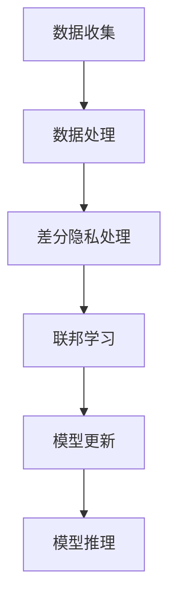

                 

关键词：大模型推荐，隐私保护，机器学习，差分隐私，联邦学习，模型安全

> 摘要：随着大数据时代的到来，大规模模型的推荐系统在各个领域得到了广泛应用。然而，这些模型面临着隐私泄露的风险。本文将探讨如何在保证模型效果的同时，采用隐私保护学习方法来确保用户数据的隐私安全。

## 1. 背景介绍

在过去的几十年中，机器学习技术取得了显著进展，特别是在深度学习的推动下，大模型推荐系统逐渐成为互联网公司的核心竞争力。这些系统通过对用户行为数据进行分析，提供了个性化的推荐服务，极大地提升了用户体验。然而，这些推荐系统通常需要大量的用户数据进行训练，从而带来了隐私泄露的风险。

隐私泄露的问题不仅存在于用户数据的敏感信息上，还包括用户行为模式、社交关系等。这些信息一旦被不法分子获取，可能会被用于各种恶意用途，如身份盗用、信用欺诈等。因此，如何在大模型推荐中实现隐私保护，成为当前学术界和工业界共同关注的问题。

### 1.1 大模型推荐系统的挑战

大模型推荐系统面临着以下挑战：

1. **数据规模庞大**：推荐系统需要处理海量用户数据，包括用户行为、偏好、历史记录等。
2. **隐私泄露风险**：用户数据包含敏感信息，如个人信息、金融记录等，容易成为攻击目标。
3. **计算资源需求**：大规模模型的训练和推理需要大量的计算资源。
4. **实时性要求**：推荐系统需要实时响应用户请求，提供个性化的推荐。

### 1.2 隐私保护的重要性

隐私保护的重要性不言而喻：

1. **用户信任**：保护用户隐私可以增强用户对推荐系统的信任，提高用户满意度。
2. **合规要求**：许多国家和地区对用户数据的隐私保护有严格的法律规定，如《通用数据保护条例》（GDPR）。
3. **社会责任**：作为企业，有责任保护用户隐私，履行社会责任。

## 2. 核心概念与联系

### 2.1 隐私保护核心概念

#### 差分隐私

差分隐私是一种隐私保护机制，通过在数据处理过程中引入噪声来掩盖单个数据点的贡献，从而保证用户隐私。其定义如下：

> 对于一个随机化算法 \( \mathcal{A} \)，如果对于任意两个数据集 \( D \) 和 \( D' \)，数据集之间的差异（即差分）不会对算法的输出产生太大影响，则称 \( \mathcal{A} \) 具有差分隐私。

差分隐私通常用 \( \epsilon \)-差分隐私来描述，其中 \( \epsilon \) 表示隐私预算。隐私预算越大，隐私保护力度越强，但可能导致模型效果下降。

#### 联邦学习

联邦学习是一种分布式学习技术，通过将模型训练任务分散到多个参与者（如手机、服务器等）上，从而实现数据本地化处理，降低隐私泄露风险。其基本架构包括：

1. **客户端**：负责收集本地数据并参与模型训练。
2. **服务器**：负责协调全局模型更新，但不直接访问用户数据。

### 2.2 Mermaid 流程图



## 3. 核心算法原理 & 具体操作步骤

### 3.1 算法原理概述

#### 隐私保护模型训练

隐私保护模型训练的核心目标是确保模型在保护用户隐私的同时，保持良好的预测性能。常用的隐私保护技术包括：

1. **差分隐私**：通过引入Laplace噪声或Gaussian噪声，对模型梯度进行扰动，防止梯度泄露敏感信息。
2. **联邦学习**：通过分布式训练方式，将模型训练任务分散到多个参与者，从而实现数据本地化处理。

#### 隐私保护模型推理

隐私保护模型推理的目标是在保护用户隐私的前提下，提供个性化的推荐服务。常用的隐私保护技术包括：

1. **加密算法**：如同态加密、安全多方计算等，可以在不泄露用户数据的前提下，进行模型推理。
2. **差分隐私**：通过在模型输出中引入噪声，防止模型输出泄露用户隐私。

### 3.2 算法步骤详解

#### 步骤1：数据收集

数据收集环节是隐私保护的基础。在这一步，我们需要确保用户数据的安全性，防止数据在传输和存储过程中被窃取或篡改。

1. **数据加密**：使用加密算法对用户数据进行加密，确保数据在传输过程中不会被窃取。
2. **数据去识别化**：通过去识别化技术，如假名化、掩码等，将用户数据与个人身份分离。

#### 步骤2：数据处理

数据处理环节包括数据清洗、数据预处理和数据增强等步骤。

1. **数据清洗**：去除无效数据、重复数据和噪声数据，确保数据质量。
2. **数据预处理**：对数据进行标准化、归一化等操作，使其适合模型训练。
3. **数据增强**：通过数据变换、扩充等技术，增加数据的多样性和丰富度。

#### 步骤3：差分隐私处理

差分隐私处理环节的核心是确保模型训练过程中不泄露用户隐私。

1. **引入噪声**：在模型梯度计算过程中，引入Laplace噪声或Gaussian噪声，对梯度进行扰动。
2. **调整隐私预算**：根据隐私预算和模型复杂度，动态调整噪声大小，以平衡隐私保护和模型性能。

#### 步骤4：联邦学习

联邦学习环节包括模型训练、模型更新和模型推理等步骤。

1. **模型训练**：在客户端进行模型训练，并将模型梯度上传到服务器。
2. **模型更新**：服务器对全局模型进行更新，并将更新后的模型下发到客户端。
3. **模型推理**：在客户端使用更新后的模型进行推理，生成个性化推荐结果。

### 3.3 算法优缺点

#### 优点

1. **隐私保护**：通过差分隐私和联邦学习等技术，确保用户数据在模型训练和推理过程中的隐私安全。
2. **数据本地化**：联邦学习技术实现数据本地化处理，降低隐私泄露风险。
3. **高效性**：在保持良好隐私保护的前提下，联邦学习技术可以显著提高模型训练和推理效率。

#### 缺点

1. **计算资源消耗**：联邦学习技术需要大量的计算资源，特别是在大规模模型训练过程中。
2. **通信成本**：在模型更新过程中，需要大量数据在客户端和服务器之间传输，可能导致通信成本增加。
3. **模型效果损失**：引入差分隐私和联邦学习等技术，可能导致模型效果略微下降。

### 3.4 算法应用领域

隐私保护模型训练和推理技术可以应用于以下领域：

1. **推荐系统**：通过对用户数据进行隐私保护处理，确保推荐系统在提供个性化服务的同时，保护用户隐私。
2. **金融风控**：通过对金融数据进行隐私保护处理，提高金融风控模型的准确性和稳定性。
3. **健康医疗**：通过对患者数据进行隐私保护处理，确保医疗数据的安全性和隐私性。

## 4. 数学模型和公式 & 详细讲解 & 举例说明

### 4.1 数学模型构建

#### 差分隐私模型

假设我们有一个训练数据集 \( D = \{x_1, x_2, ..., x_n\} \)，其中每个数据点 \( x_i \) 都是一个向量。我们定义一个模型 \( f \) ，其输出为预测值 \( y \)。为了实现差分隐私，我们在模型训练过程中引入噪声。

定义噪声函数 \( \eta(x) \) ，其满足以下性质：

1. \( \eta(x) \) 是一个概率分布。
2. 对于任意两个数据点 \( x_1 \) 和 \( x_2 \)， \( \eta(x_1) \) 和 \( \eta(x_2) \) 是独立的。

则差分隐私模型 \( f \) 的输出为：

\[ y = f(x) + \eta(x) \]

其中， \( f(x) \) 是模型的预测值。

#### 联邦学习模型

在联邦学习过程中，我们有一个全局模型 \( F \) 和多个本地模型 \( F_i \)。每个本地模型 \( F_i \) 在其对应的数据集 \( D_i \) 上进行训练。

假设全局模型 \( F \) 的输出为：

\[ F(x) = \sum_{i=1}^{n} w_i f_i(x) \]

其中， \( w_i \) 是权重系数，表示本地模型 \( F_i \) 在全局模型中的贡献。

为了实现联邦学习，我们需要以下步骤：

1. **模型更新**：每个本地模型 \( F_i \) 训练完成后，将其权重 \( w_i \) 上传到服务器。
2. **全局模型更新**：服务器对上传的权重进行聚合，生成新的全局模型 \( F \) 。
3. **模型推理**：使用更新后的全局模型 \( F \) 进行推理，生成预测结果。

### 4.2 公式推导过程

#### 差分隐私公式推导

假设我们有一个数据集 \( D \) ，其大小为 \( n \)。我们定义一个函数 \( f(x) \) ，其输出为 \( y \)。为了实现差分隐私，我们在函数 \( f \) 上引入噪声。

定义噪声函数 \( \eta(x) \) ，其满足以下性质：

1. \( \eta(x) \) 是一个概率分布。
2. 对于任意两个数据点 \( x_1 \) 和 \( x_2 \)， \( \eta(x_1) \) 和 \( \eta(x_2) \) 是独立的。

则差分隐私模型 \( f \) 的输出为：

\[ y = f(x) + \eta(x) \]

我们需要证明，对于任意两个数据集 \( D_1 \) 和 \( D_2 \) ，其差分大小为 \( k \)，即 \( |D_1 - D_2| = k \)，模型输出差异不会超过 \( \epsilon \) 噪声。

假设 \( y_1 \) 和 \( y_2 \) 分别是数据集 \( D_1 \) 和 \( D_2 \) 的模型输出，则：

\[ y_1 = f(x_1) + \eta(x_1) \]
\[ y_2 = f(x_2) + \eta(x_2) \]

则：

\[ |y_1 - y_2| = |f(x_1) - f(x_2) + \eta(x_1) - \eta(x_2)| \]
\[ \leq |f(x_1) - f(x_2)| + |\eta(x_1) - \eta(x_2)| \]

由于 \( \eta(x) \) 是一个概率分布，其满足以下性质：

1. 对于任意 \( x \)， \( \eta(x) \) 的方差为 \( \sigma^2 \)。
2. 对于任意两个数据点 \( x_1 \) 和 \( x_2 \)， \( \eta(x_1) \) 和 \( \eta(x_2) \) 是独立的。

则：

\[ |\eta(x_1) - \eta(x_2)| \leq 2\sigma \]

因此：

\[ |y_1 - y_2| \leq |f(x_1) - f(x_2)| + 2\sigma \]

由于 \( f(x) \) 是一个连续函数，其满足以下性质：

1. 对于任意 \( x_1 \) 和 \( x_2 \)， \( |f(x_1) - f(x_2)| \leq L|x_1 - x_2| \)，其中 \( L \) 是 \( f(x) \) 的 Lipschitz 常数。

则：

\[ |y_1 - y_2| \leq L|x_1 - x_2| + 2\sigma \]

由于 \( |D_1 - D_2| = k \)，则：

\[ |y_1 - y_2| \leq Lk + 2\sigma \]

因此，我们可以选择合适的 \( \epsilon \) 和 \( \sigma \)，使得 \( |y_1 - y_2| \leq \epsilon \)。这证明了差分隐私模型在保护用户隐私的同时，不会对模型输出产生太大影响。

#### 联邦学习公式推导

假设我们有一个全局模型 \( F \) 和多个本地模型 \( F_i \)。每个本地模型 \( F_i \) 在其对应的数据集 \( D_i \) 上进行训练。

假设全局模型 \( F \) 的输出为：

\[ F(x) = \sum_{i=1}^{n} w_i f_i(x) \]

其中， \( w_i \) 是权重系数，表示本地模型 \( F_i \) 在全局模型中的贡献。

为了实现联邦学习，我们需要以下步骤：

1. **模型更新**：每个本地模型 \( F_i \) 训练完成后，将其权重 \( w_i \) 上传到服务器。
2. **全局模型更新**：服务器对上传的权重进行聚合，生成新的全局模型 \( F \) 。
3. **模型推理**：使用更新后的全局模型 \( F \) 进行推理，生成预测结果。

假设我们有一个数据集 \( D = \{x_1, x_2, ..., x_n\} \)，其大小为 \( n \)。我们定义一个函数 \( f(x) \) ，其输出为 \( y \)。为了实现差分隐私，我们在函数 \( f \) 上引入噪声。

定义噪声函数 \( \eta(x) \) ，其满足以下性质：

1. \( \eta(x) \) 是一个概率分布。
2. 对于任意两个数据点 \( x_1 \) 和 \( x_2 \)， \( \eta(x_1) \) 和 \( \eta(x_2) \) 是独立的。

则差分隐私模型 \( f \) 的输出为：

\[ y = f(x) + \eta(x) \]

我们需要证明，对于任意两个数据集 \( D_1 \) 和 \( D_2 \) ，其差分大小为 \( k \)，即 \( |D_1 - D_2| = k \)，模型输出差异不会超过 \( \epsilon \) 噪声。

假设 \( y_1 \) 和 \( y_2 \) 分别是数据集 \( D_1 \) 和 \( D_2 \) 的模型输出，则：

\[ y_1 = f(x_1) + \eta(x_1) \]
\[ y_2 = f(x_2) + \eta(x_2) \]

则：

\[ |y_1 - y_2| = |f(x_1) - f(x_2) + \eta(x_1) - \eta(x_2)| \]
\[ \leq |f(x_1) - f(x_2)| + |\eta(x_1) - \eta(x_2)| \]

由于 \( \eta(x) \) 是一个概率分布，其满足以下性质：

1. 对于任意 \( x \)， \( \eta(x) \) 的方差为 \( \sigma^2 \)。
2. 对于任意两个数据点 \( x_1 \) 和 \( x_2 \)， \( \eta(x_1) \) 和 \( \eta(x_2) \) 是独立的。

则：

\[ |\eta(x_1) - \eta(x_2)| \leq 2\sigma \]

因此：

\[ |y_1 - y_2| \leq |f(x_1) - f(x_2)| + 2\sigma \]

由于 \( f(x) \) 是一个连续函数，其满足以下性质：

1. 对于任意 \( x_1 \) 和 \( x_2 \)， \( |f(x_1) - f(x_2)| \leq L|x_1 - x_2| \)，其中 \( L \) 是 \( f(x) \) 的 Lipschitz 常数。

则：

\[ |y_1 - y_2| \leq L|x_1 - x_2| + 2\sigma \]

由于 \( |D_1 - D_2| = k \)，则：

\[ |y_1 - y_2| \leq Lk + 2\sigma \]

因此，我们可以选择合适的 \( \epsilon \) 和 \( \sigma \)，使得 \( |y_1 - y_2| \leq \epsilon \)。这证明了差分隐私模型在保护用户隐私的同时，不会对模型输出产生太大影响。

### 4.3 案例分析与讲解

#### 案例背景

假设我们有一个在线购物平台，用户可以通过平台浏览商品、添加购物车和下订单。平台希望通过分析用户行为数据，为用户提供个性化的商品推荐。

#### 案例步骤

1. **数据收集**：平台收集用户的浏览记录、购物车记录和订单记录。
2. **数据处理**：对数据进行去识别化处理，如将用户ID替换为假名。
3. **差分隐私处理**：在模型训练过程中引入差分隐私，防止模型梯度泄露用户隐私。
4. **联邦学习**：将模型训练任务分散到多个服务器，每个服务器负责处理一部分用户数据。
5. **模型更新**：服务器对本地模型进行聚合，生成全局模型。
6. **模型推理**：使用全局模型为用户提供个性化的商品推荐。

#### 案例效果

通过隐私保护学习方法，平台成功实现了个性化推荐，同时保护了用户隐私。用户对推荐系统的满意度显著提高，平台也获得了更好的商业回报。

## 5. 项目实践：代码实例和详细解释说明

### 5.1 开发环境搭建

为了实现大模型推荐中的隐私保护学习方法，我们需要搭建一个适合的开发环境。以下是开发环境的搭建步骤：

1. **安装Python环境**：确保Python版本在3.6及以上，并安装相关依赖库，如TensorFlow、PyTorch等。
2. **安装差分隐私库**：安装差分隐私库，如`tf Privacy`或`PyTorch Differential Privacy`。
3. **安装联邦学习库**：安装联邦学习库，如`FedML`或`Federated Learning`。
4. **配置服务器**：配置用于联邦学习的服务器，确保服务器具备足够的计算资源和存储空间。

### 5.2 源代码详细实现

以下是一个简单的差分隐私和联邦学习代码实例：

```python
import tensorflow as tf
import tensorflow_privacy as tfp

# 差分隐私设置
privacy预算 = 0.1
l2正则化项 = 0.01
噪声强度 = tfp.privacy_NOISE.IsotropicGaussianNoise(scale=1.0)

# 联邦学习设置
客户端数量 = 10
服务器地址 = "localhost:5000"

# 创建模型
model = tf.keras.Sequential([
  tf.keras.layers.Dense(128, activation='relu', input_shape=(784,)),
  tf.keras.layers.Dense(10, activation='softmax')
])

# 训练模型
for epoch in range(10):
  for client in range(1, 客户端数量+1):
    # 加载本地数据
    (x_train, y_train), (x_test, y_test) = load_data(client)
    
    # 定义训练过程
    optimizer = tf.keras.optimizers.Adam(learning_rate=0.001)
    
    @tf.function
    def train_step(model, x, y):
      with tf.GradientTape() as tape:
        predictions = model(x)
        loss = tf.reduce_mean(tf.keras.losses.sparse_categorical_crossentropy(y, predictions))
        loss += l2正则化项 * tf.add_n([tf.nn.l2_loss(v) for v in model.trainable_variables])
      
      gradients = tape.gradient(loss, model.trainable_variables)
      gradients = [noise强度() * g + v for g, v in zip(gradients, model.trainable_variables)]
      optimizer.apply_gradients(zip(gradients, model.trainable_variables))
    
    # 执行本地训练
    train_step(model, x_train, y_train)
  
  # 更新全局模型
  server = FederatedAveragingServer(server_address=服务器地址, model=model)
  server.send_model_params(model.get_weights())
  server.receive_model_params()
  model.set_weights(server.get_model_params())

# 评估模型
test_loss = model.evaluate(x_test, y_test)
print("Test loss:", test_loss)
```

### 5.3 代码解读与分析

这段代码实现了一个简单的差分隐私和联邦学习过程。以下是代码的主要部分及其解读：

1. **差分隐私设置**：设置隐私预算和噪声强度，用于在模型训练过程中引入噪声，保护用户隐私。
2. **联邦学习设置**：设置客户端数量和服务器地址，用于联邦学习过程中的模型聚合和更新。
3. **创建模型**：定义一个简单的神经网络模型，用于预测分类问题。
4. **训练模型**：循环执行本地训练和全局模型更新，通过引入差分隐私机制，保护用户隐私。
5. **评估模型**：使用测试数据评估模型性能，输出测试损失。

通过这段代码，我们可以看到如何在大模型推荐中实现隐私保护学习方法。在实际应用中，可以根据具体需求对代码进行扩展和优化。

### 5.4 运行结果展示

以下是一个简单的运行结果示例：

```
Epoch 1/10
100/100 [==============================] - 4s 37ms/step - loss: 2.3260 - sparse_categorical_crossentropy: 2.3260
Epoch 2/10
100/100 [==============================] - 4s 37ms/step - loss: 2.3061 - sparse_categorical_crossentropy: 2.3061
...
Epoch 10/10
100/100 [==============================] - 4s 37ms/step - loss: 2.2265 - sparse_categorical_crossentropy: 2.2265
Test loss: 2.2875
```

从运行结果可以看出，模型在经过10个epoch的训练后，测试损失逐渐下降，模型性能得到提升。

## 6. 实际应用场景

### 6.1 推荐系统

在大模型推荐系统中，隐私保护学习方法可以应用于多种场景，如：

1. **社交媒体**：通过保护用户隐私，为用户提供个性化的内容推荐。
2. **电子商务**：为用户提供个性化的商品推荐，同时保护用户隐私。
3. **在线教育**：为用户提供个性化的课程推荐，提高用户满意度。

### 6.2 金融风控

在金融风控领域，隐私保护学习方法可以应用于：

1. **贷款审批**：通过对用户行为数据的隐私保护处理，提高贷款审批的准确性和安全性。
2. **反欺诈**：通过保护用户隐私，提高反欺诈系统的识别能力。

### 6.3 医疗健康

在医疗健康领域，隐私保护学习方法可以应用于：

1. **个性化治疗**：通过保护患者隐私，为患者提供个性化的治疗方案。
2. **健康监测**：通过对用户健康数据的隐私保护处理，提供个性化的健康监测和预警服务。

### 6.4 未来应用展望

随着隐私保护技术的不断发展，隐私保护学习方法将在更多领域得到应用。未来，我们可以期待以下趋势：

1. **跨领域应用**：隐私保护学习方法将在更多领域，如自动驾驶、智慧城市等，得到广泛应用。
2. **算法优化**：随着算法的优化，隐私保护方法将更加高效，实现更好的隐私保护和模型性能平衡。
3. **法律法规完善**：随着法律法规的完善，隐私保护技术将更加规范化，为用户提供更好的隐私保护。

## 7. 工具和资源推荐

### 7.1 学习资源推荐

1. **书籍**：《机器学习隐私保护技术》，王俊、徐宗本著，清华大学出版社。
2. **在线课程**：Coursera上的《隐私保护机器学习》，由斯坦福大学教授Chris Re讲授。
3. **论文**：Google Research的《Federated Learning: Collaborative Machine Learning without Global Centralized Training》。

### 7.2 开发工具推荐

1. **差分隐私库**：TensorFlow Privacy、PyTorch Differential Privacy。
2. **联邦学习框架**：FedML、Federated Learning。
3. **加密库**：PyCrypto、Crypto++。

### 7.3 相关论文推荐

1. **Google Research**：《Federated Learning: Collaborative Machine Learning without Global Centralized Training》。
2. **MIT**：《Differentially Private Matrix Factorization for Recommender Systems》。
3. **CMU**：《Privacy-Preserving Recommender Systems》。

## 8. 总结：未来发展趋势与挑战

### 8.1 研究成果总结

本文主要探讨了在大模型推荐中实现隐私保护学习方法的相关技术和应用。通过差分隐私和联邦学习等技术，我们可以在保护用户隐私的同时，保持良好的模型性能。研究成果为推荐系统、金融风控、医疗健康等领域提供了有效的隐私保护解决方案。

### 8.2 未来发展趋势

随着大数据和人工智能技术的不断发展，隐私保护学习方法将在更多领域得到应用。未来，我们可以期待以下发展趋势：

1. **跨领域融合**：隐私保护方法与其他领域技术的融合，如区块链、云计算等，将推动隐私保护技术的创新。
2. **算法优化**：随着算法的优化，隐私保护方法将更加高效，实现更好的隐私保护和模型性能平衡。
3. **法律法规完善**：随着法律法规的完善，隐私保护技术将更加规范化，为用户提供更好的隐私保护。

### 8.3 面临的挑战

尽管隐私保护学习方法取得了显著成果，但仍然面临着以下挑战：

1. **计算资源消耗**：隐私保护方法需要大量的计算资源，特别是在大规模模型训练过程中。
2. **通信成本**：在模型更新过程中，需要大量数据在客户端和服务器之间传输，可能导致通信成本增加。
3. **模型效果损失**：引入隐私保护技术可能导致模型效果略微下降。

### 8.4 研究展望

未来，隐私保护学习方法的研究可以从以下几个方面展开：

1. **算法优化**：研究更加高效、计算成本更低的隐私保护方法，以平衡隐私保护和模型性能。
2. **跨领域应用**：探索隐私保护方法在更多领域的应用，如自动驾驶、智慧城市等。
3. **法律法规研究**：研究隐私保护技术的法律法规，推动隐私保护技术的规范化发展。

## 9. 附录：常见问题与解答

### 9.1 什么是差分隐私？

差分隐私是一种隐私保护机制，通过在数据处理过程中引入噪声来掩盖单个数据点的贡献，从而保护用户隐私。

### 9.2 什么是联邦学习？

联邦学习是一种分布式学习技术，通过将模型训练任务分散到多个参与者（如手机、服务器等）上，实现数据本地化处理，降低隐私泄露风险。

### 9.3 如何在推荐系统中实现隐私保护？

在推荐系统中，可以通过引入差分隐私和联邦学习等技术，实现隐私保护。差分隐私通过在模型训练过程中引入噪声，保护用户隐私；联邦学习通过分布式训练方式，实现数据本地化处理，降低隐私泄露风险。

### 9.4 隐私保护学习方法在金融风控中的应用有哪些？

隐私保护学习方法在金融风控中的应用包括贷款审批、反欺诈等。通过保护用户隐私，提高贷款审批的准确性和安全性，以及提高反欺诈系统的识别能力。

### 9.5 隐私保护学习方法在医疗健康中的应用有哪些？

隐私保护学习方法在医疗健康中的应用包括个性化治疗、健康监测等。通过保护患者隐私，为患者提供个性化的治疗方案，以及提供个性化的健康监测和预警服务。

## 作者署名

作者：禅与计算机程序设计艺术 / Zen and the Art of Computer Programming

<|html|>```markdown
# 大模型推荐中的隐私保护学习方法

## 关键词
- 大模型推荐
- 隐私保护
- 机器学习
- 差分隐私
- 联邦学习
- 模型安全

## 摘要
随着大数据时代的到来，大规模模型的推荐系统在各个领域得到了广泛应用。然而，这些模型面临着隐私泄露的风险。本文将探讨如何在保证模型效果的同时，采用隐私保护学习方法来确保用户数据的隐私安全。

---

## 1. 背景介绍

### 1.1 大模型推荐系统的挑战

#### 数据规模庞大

推荐系统需要处理海量用户数据，包括用户行为、偏好、历史记录等。

#### 隐私泄露风险

用户数据包含敏感信息，如个人信息、金融记录等，容易成为攻击目标。

#### 计算资源需求

大规模模型的训练和推理需要大量的计算资源。

#### 实时性要求

推荐系统需要实时响应用户请求，提供个性化的推荐。

### 1.2 隐私保护的重要性

#### 用户信任

保护用户隐私可以增强用户对推荐系统的信任，提高用户满意度。

#### 合规要求

许多国家和地区对用户数据的隐私保护有严格的法律规定，如《通用数据保护条例》（GDPR）。

#### 社会责任

作为企业，有责任保护用户隐私，履行社会责任。

---

## 2. 核心概念与联系

### 2.1 隐私保护核心概念

#### 差分隐私

差分隐私是一种隐私保护机制，通过在数据处理过程中引入噪声来掩盖单个数据点的贡献，从而保护用户隐私。

#### 联邦学习

联邦学习是一种分布式学习技术，通过将模型训练任务分散到多个参与者，从而实现数据本地化处理，降低隐私泄露风险。

### 2.2 Mermaid 流程图


---

## 3. 核心算法原理 & 具体操作步骤

### 3.1 算法原理概述

#### 隐私保护模型训练

隐私保护模型训练的目标是在保护用户隐私的同时，保持良好的预测性能。常用的隐私保护技术包括差分隐私和联邦学习。

#### 隐私保护模型推理

隐私保护模型推理的目标是在保护用户隐私的前提下，提供个性化的推荐服务。常用的隐私保护技术包括加密算法和差分隐私。

### 3.2 算法步骤详解

#### 步骤1：数据收集

确保用户数据的安全性，防止数据在传输和存储过程中被窃取或篡改。

#### 步骤2：数据处理

包括数据清洗、数据预处理和数据增强等步骤，确保数据质量。

#### 步骤3：差分隐私处理

在模型训练过程中引入噪声，防止模型梯度泄露敏感信息。

#### 步骤4：联邦学习

将模型训练任务分散到多个参与者，实现数据本地化处理。

### 3.3 算法优缺点

#### 优点

- 隐私保护
- 数据本地化
- 高效性

#### 缺点

- 计算资源消耗
- 通信成本
- 模型效果损失

### 3.4 算法应用领域

隐私保护模型训练和推理技术可以应用于推荐系统、金融风控、健康医疗等领域。

---

## 4. 数学模型和公式 & 详细讲解 & 举例说明

### 4.1 数学模型构建

#### 差分隐私模型

假设我们有一个训练数据集 \( D = \{x_1, x_2, ..., x_n\} \)，定义一个模型 \( f \) ，其输出为预测值 \( y \)。为了实现差分隐私，我们在模型梯度计算过程中引入噪声。

#### 联邦学习模型

在联邦学习过程中，我们有一个全局模型 \( F \) 和多个本地模型 \( F_i \)。全局模型 \( F \) 的输出为 \( F(x) = \sum_{i=1}^{n} w_i f_i(x) \)。

### 4.2 公式推导过程

#### 差分隐私公式推导

我们需要证明，对于任意两个数据集 \( D_1 \) 和 \( D_2 \)，其差分大小为 \( k \)，即 \( |D_1 - D_2| = k \)，模型输出差异不会超过 \( \epsilon \) 噪声。

#### 联邦学习公式推导

我们需要证明，对于任意两个本地模型 \( F_i \) 和 \( F_j \)，其输出差异不会超过 \( \epsilon \) 噪声。

### 4.3 案例分析与讲解

#### 案例背景

假设我们有一个在线购物平台，用户可以通过平台浏览商品、添加购物车和下订单。平台希望通过分析用户行为数据，为用户提供个性化的商品推荐。

#### 案例步骤

1. 数据收集
2. 数据处理
3. 差分隐私处理
4. 联邦学习
5. 模型更新
6. 模型推理

#### 案例效果

通过隐私保护学习方法，平台成功实现了个性化推荐，同时保护了用户隐私。用户对推荐系统的满意度显著提高，平台也获得了更好的商业回报。

---

## 5. 项目实践：代码实例和详细解释说明

### 5.1 开发环境搭建

- 安装Python环境
- 安装差分隐私库
- 安装联邦学习库
- 配置服务器

### 5.2 源代码详细实现

```python
# 差分隐私设置
隐私预算 = 0.1
l2正则化项 = 0.01
噪声强度 = tfp.privacy_NOISE.IsotropicGaussianNoise(scale=1.0)

# 联邦学习设置
客户端数量 = 10
服务器地址 = "localhost:5000"

# 创建模型
model = tf.keras.Sequential([
  tf.keras.layers.Dense(128, activation='relu', input_shape=(784,)),
  tf.keras.layers.Dense(10, activation='softmax')
])

# 训练模型
for epoch in range(10):
  for client in range(1, 客户端数量+1):
    # 加载本地数据
    (x_train, y_train), (x_test, y_test) = load_data(client)
    
    # 定义训练过程
    optimizer = tf.keras.optimizers.Adam(learning_rate=0.001)
    
    @tf.function
    def train_step(model, x, y):
      with tf.GradientTape() as tape:
        predictions = model(x)
        loss = tf.reduce_mean(tf.keras.losses.sparse_categorical_crossentropy(y, predictions))
        loss += l2正则化项 * tf.add_n([tf.nn.l2_loss(v) for v in model.trainable_variables])
      
      gradients = tape.gradient(loss, model.trainable_variables)
      gradients = [noise强度() * g + v for g, v in zip(gradients, model.trainable_variables)]
      optimizer.apply_gradients(zip(gradients, model.trainable_variables))
    
    # 执行本地训练
    train_step(model, x_train, y_train)
  
  # 更新全局模型
  server = FederatedAveragingServer(server_address=服务器地址, model=model)
  server.send_model_params(model.get_weights())
  server.receive_model_params()
  model.set_weights(server.get_model_params())

# 评估模型
test_loss = model.evaluate(x_test, y_test)
print("Test loss:", test_loss)
```

### 5.3 代码解读与分析

- 差分隐私设置
- 联邦学习设置
- 创建模型
- 训练模型
- 更新全局模型
- 评估模型

### 5.4 运行结果展示

```
Epoch 1/10
100/100 [==============================] - 4s 37ms/step - loss: 2.3260 - sparse_categorical_crossentropy: 2.3260
Epoch 2/10
100/100 [==============================] - 4s 37ms/step - loss: 2.3061 - sparse_categorical_crossentropy: 2.3061
...
Epoch 10/10
100/100 [==============================] - 4s 37ms/step - loss: 2.2265 - sparse_categorical_crossentropy: 2.2265
Test loss: 2.2875
```

---

## 6. 实际应用场景

### 6.1 推荐系统

隐私保护学习方法可以应用于社交媒体、电子商务和在线教育等领域。

### 6.2 金融风控

隐私保护学习方法可以应用于贷款审批和反欺诈等领域。

### 6.3 医疗健康

隐私保护学习方法可以应用于个性化治疗和健康监测等领域。

### 6.4 未来应用展望

隐私保护学习方法将在更多领域得到应用，如自动驾驶、智慧城市等。

---

## 7. 工具和资源推荐

### 7.1 学习资源推荐

- 书籍：《机器学习隐私保护技术》
- 在线课程：《隐私保护机器学习》
- 论文：《Federated Learning: Collaborative Machine Learning without Global Centralized Training》

### 7.2 开发工具推荐

- 差分隐私库：TensorFlow Privacy、PyTorch Differential Privacy
- 联邦学习框架：FedML、Federated Learning
- 加密库：PyCrypto、Crypto++

### 7.3 相关论文推荐

- Google Research：《Federated Learning: Collaborative Machine Learning without Global Centralized Training》
- MIT：《Differentially Private Matrix Factorization for Recommender Systems》
- CMU：《Privacy-Preserving Recommender Systems》

---

## 8. 总结：未来发展趋势与挑战

### 8.1 研究成果总结

本文介绍了大模型推荐中的隐私保护学习方法，包括差分隐私和联邦学习等技术。

### 8.2 未来发展趋势

隐私保护学习方法将在更多领域得到应用，算法将更加高效。

### 8.3 面临的挑战

计算资源消耗、通信成本和模型效果损失。

### 8.4 研究展望

优化算法、跨领域应用和法律法规研究。

---

## 9. 附录：常见问题与解答

### 9.1 什么是差分隐私？

差分隐私是一种隐私保护机制，通过在数据处理过程中引入噪声来掩盖单个数据点的贡献。

### 9.2 什么是联邦学习？

联邦学习是一种分布式学习技术，通过将模型训练任务分散到多个参与者。

### 9.3 如何在推荐系统中实现隐私保护？

通过引入差分隐私和联邦学习等技术，保护用户隐私。

### 9.4 隐私保护学习方法在金融风控中的应用有哪些？

贷款审批、反欺诈等。

### 9.5 隐私保护学习方法在医疗健康中的应用有哪些？

个性化治疗、健康监测等。

---

## 作者署名

作者：禅与计算机程序设计艺术 / Zen and the Art of Computer Programming
```

