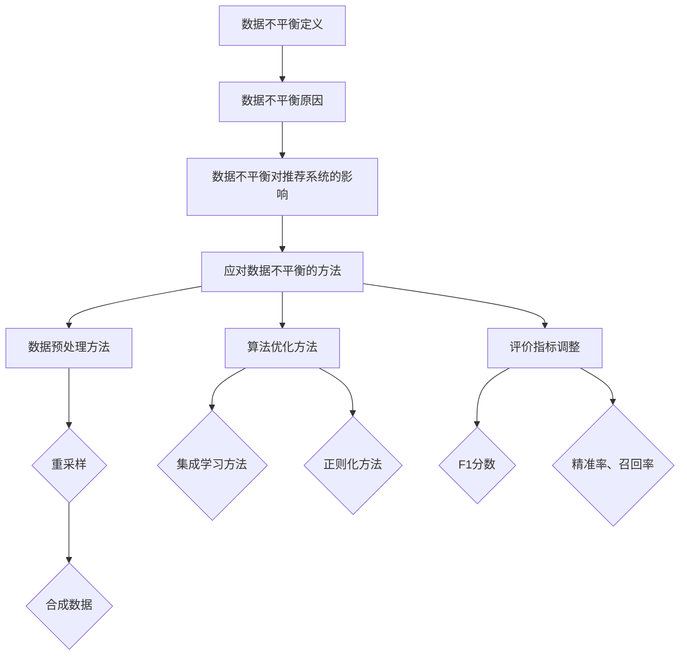

                 

关键词：大模型，数据不平衡，推荐系统，应对策略，算法优化，数学模型，实践应用

## 摘要

本文主要探讨在大模型推荐场景中如何有效应对数据不平衡问题。数据不平衡现象在推荐系统中普遍存在，严重影响了推荐效果的准确性和公平性。本文首先介绍了数据不平衡的定义、原因及对推荐系统的影响，随后详细解析了针对数据不平衡问题的几种常见算法原理及操作步骤。通过对数学模型和公式的深入讲解，结合实际项目实践和代码实例，本文提出了一套综合性的数据不平衡应对策略，旨在提高大模型推荐系统的整体性能。最后，本文对未来发展趋势和挑战进行了展望，为相关领域的研究和实践提供了参考。

## 1. 背景介绍

在当今的信息时代，推荐系统作为一种重要的信息过滤和检索工具，被广泛应用于电子商务、社交媒体、新闻门户等众多领域。其核心目标是根据用户的兴趣和偏好，为用户推荐他们可能感兴趣的内容，从而提高用户体验和平台黏性。随着互联网和大数据技术的迅猛发展，推荐系统的规模和复杂性不断增长，尤其是大模型（如深度学习模型、图神经网络等）在推荐系统中的广泛应用，使得推荐效果有了显著提升。

然而，在大模型推荐场景中，数据不平衡问题逐渐成为制约推荐系统性能的关键因素之一。数据不平衡指的是推荐系统中正负样本比例严重失衡，导致模型在学习过程中对少数样本的依赖性过高，从而影响了模型的整体性能和泛化能力。具体来说，数据不平衡问题主要表现在以下几个方面：

1. **样本偏差**：数据不平衡会导致模型学习过程中对少数样本的权重过高，从而忽略了大多数样本的信息，导致推荐结果偏向于极端情况。
2. **过拟合**：数据不平衡容易导致模型过拟合，即模型在训练集上表现优异，但在测试集和真实场景中表现不佳。
3. **公平性**：数据不平衡可能导致推荐系统对特定用户群体或内容类型的偏好不公，从而影响用户满意度和平台声誉。

本文将围绕大模型推荐场景中的数据不平衡问题，深入探讨其应对策略，旨在为推荐系统的研究和应用提供有益的参考。

## 2. 核心概念与联系

### 2.1 数据不平衡定义

数据不平衡（Data Imbalance）是指在一个数据集中，不同类别的样本数量差异较大，导致模型在训练过程中对某些类别（通常是少数类别）的样本关注不足，从而影响模型的性能。具体来说，数据不平衡可以分为以下几种类型：

1. **类别不平衡**：不同类别的样本数量差异明显，如A类样本有1000个，而B类样本只有100个。
2. **样本不平衡**：同一类别的样本质量差异较大，如某些样本具有丰富的特征信息，而另一些样本则较为稀疏。
3. **时间不平衡**：某些类别的样本在时间维度上分布不均匀，如某些时间段的数据量远大于其他时间段。

### 2.2 数据不平衡原因

数据不平衡问题主要源于以下几个方面：

1. **数据生成过程**：在某些应用场景中，某些类别的样本生成频率远高于其他类别，导致数据集出现不平衡现象。
2. **数据采集过程**：数据采集过程中，某些类别的样本可能因为技术或资源限制而无法完整采集，从而引起数据不平衡。
3. **数据标注过程**：在数据标注过程中，不同类别的样本标注难度不同，可能导致标注人员对某些类别的样本关注度不足，从而影响数据集的平衡性。

### 2.3 数据不平衡对推荐系统的影响

数据不平衡对推荐系统的影响主要体现在以下几个方面：

1. **模型性能下降**：数据不平衡会导致模型对少数样本的依赖性过高，从而影响模型的整体性能和泛化能力。
2. **推荐结果偏差**：数据不平衡可能导致推荐系统对特定用户群体或内容类型的偏好不公，从而影响用户满意度和平台声誉。
3. **过拟合风险**：数据不平衡容易导致模型过拟合，即模型在训练集上表现优异，但在测试集和真实场景中表现不佳。

### 2.4 应对数据不平衡的方法

为了应对数据不平衡问题，研究人员提出了多种方法，主要包括以下几类：

1. **数据预处理方法**：通过调整数据集的分布，如重采样、合成数据等方法，来减轻数据不平衡的影响。
2. **算法优化方法**：通过修改模型结构或优化训练策略，来提高模型对数据不平衡的鲁棒性，如集成学习方法、正则化方法等。
3. **评价指标调整**：通过调整模型评价指标，如采用F1分数、精准率、召回率等指标，来更准确地评估模型的性能。

### 2.5 Mermaid 流程图

以下是一个描述数据不平衡应对策略的Mermaid流程图：



通过以上核心概念的介绍和Mermaid流程图，我们为后续章节的详细讨论奠定了基础。接下来，我们将进一步探讨大模型推荐场景中的核心算法原理及操作步骤。

## 3. 核心算法原理 & 具体操作步骤

### 3.1 算法原理概述

针对大模型推荐场景中的数据不平衡问题，研究人员提出了一系列核心算法，主要包括以下几类：

1. **重采样法**：通过调整数据集中各类别的样本数量，来平衡数据集的分布。常见的方法有欠采样、过采样等。
2. **合成数据法**：通过生成新的数据样本，来增加少数类别的样本数量，从而平衡数据集的分布。
3. **集成学习方法**：通过组合多个模型或多次训练，来提高模型对数据不平衡的鲁棒性。
4. **正则化方法**：通过在模型训练过程中引入正则化项，来抑制模型对少数样本的依赖性，从而提高模型的泛化能力。

### 3.2 算法步骤详解

#### 3.2.1 重采样法

1. **欠采样**：

   - 步骤1：统计数据集中各类别的样本数量。
   - 步骤2：选择样本数量较少的类别进行欠采样。
   - 步骤3：随机选择部分样本，直至各类别的样本数量相等。
   - 步骤4：更新数据集，进行模型训练。

2. **过采样**：

   - 步骤1：统计数据集中各类别的样本数量。
   - 步骤2：选择样本数量较多的类别进行过采样。
   - 步骤3：复制部分样本，直至各类别的样本数量相等。
   - 步骤4：更新数据集，进行模型训练。

#### 3.2.2 合成数据法

1. **生成对抗网络（GAN）**：

   - 步骤1：构建生成器和判别器模型。
   - 步骤2：通过训练生成器模型，生成新的少数类别样本。
   - 步骤3：将生成器生成的样本与原始数据集合并，形成新的平衡数据集。
   - 步骤4：进行模型训练。

2. **迁移学习**：

   - 步骤1：选择一个在相关任务上表现优异的预训练模型。
   - 步骤2：将预训练模型迁移到推荐系统任务中。
   - 步骤3：通过微调预训练模型，优化其在推荐系统任务中的性能。
   - 步骤4：利用迁移学习后的模型进行推荐。

#### 3.2.3 集成学习方法

1. **Bagging方法**：

   - 步骤1：从原始数据集中随机抽取多个子数据集。
   - 步骤2：在每个子数据集上训练独立的模型。
   - 步骤3：将多个模型的结果进行投票或平均，得到最终预测结果。

2. **Boosting方法**：

   - 步骤1：初始化多个模型，每个模型具有相同的权重。
   - 步骤2：在每个训练阶段，根据前一轮模型的预测误差调整模型权重。
   - 步骤3：训练多个模型，直至满足停止条件。
   - 步骤4：将多个模型的结果进行投票或平均，得到最终预测结果。

#### 3.2.4 正则化方法

1. **L1正则化**：

   - 步骤1：在模型损失函数中添加L1范数项，作为正则化项。
   - 步骤2：在模型训练过程中，通过调整正则化系数，平衡损失函数对少数样本的依赖性。

2. **L2正则化**：

   - 步骤1：在模型损失函数中添加L2范数项，作为正则化项。
   - 步骤2：在模型训练过程中，通过调整正则化系数，平衡损失函数对少数样本的依赖性。

### 3.3 算法优缺点

#### 重采样法

- **优点**：简单易实现，可以快速平衡数据集的分布。
- **缺点**：可能导致部分重要信息丢失，影响模型性能。

#### 合成数据法

- **优点**：可以有效增加少数类别的样本数量，提高模型泛化能力。
- **缺点**：生成数据质量难以保证，可能引入噪声。

#### 集成学习方法

- **优点**：可以结合多个模型的优点，提高模型性能和鲁棒性。
- **缺点**：计算复杂度较高，需要大量训练资源。

#### 正则化方法

- **优点**：可以平衡损失函数对少数样本的依赖性，提高模型泛化能力。
- **缺点**：可能增加模型训练时间，需要调整正则化系数。

### 3.4 算法应用领域

- **电子商务推荐**：通过平衡用户购买行为数据，提高推荐系统的准确性和公平性。
- **社交媒体推荐**：通过平衡用户互动数据，提高推荐系统的用户体验和用户粘性。
- **新闻门户推荐**：通过平衡用户阅读数据，提高推荐系统的内容质量和用户满意度。

通过以上核心算法原理和具体操作步骤的介绍，我们可以更好地理解大模型推荐场景中的数据不平衡问题，并为后续的实践应用提供指导。接下来，我们将进一步探讨数学模型和公式，以深入理解数据不平衡问题的本质。

## 4. 数学模型和公式 & 详细讲解 & 举例说明

### 4.1 数学模型构建

在数据不平衡问题中，我们通常需要构建以下数学模型：

1. **概率分布模型**：描述数据集中各类别的概率分布，如伯努利分布、多项式分布等。
2. **损失函数模型**：定义模型在训练过程中需要优化的目标函数，如交叉熵损失、均方误差等。
3. **优化模型**：定义模型训练过程中采用的优化算法，如梯度下降、随机梯度下降等。

### 4.2 公式推导过程

#### 4.2.1 概率分布模型

假设数据集中包含 $C$ 个类别，第 $i$ 个类别的样本数量为 $n_i$，总样本数量为 $N$。则第 $i$ 个类别的概率分布可以表示为：

$$
P(y=i) = \frac{n_i}{N}
$$

#### 4.2.2 损失函数模型

对于二分类问题，常用的损失函数有交叉熵损失和均方误差损失。

1. **交叉熵损失**：

$$
L = -\sum_{i=1}^C y_i \log (\hat{y}_i)
$$

其中，$y_i$ 表示实际标签，$\hat{y}_i$ 表示模型预测的概率。

2. **均方误差损失**：

$$
L = \frac{1}{2} \sum_{i=1}^C (y_i - \hat{y}_i)^2
$$

#### 4.2.3 优化模型

对于损失函数模型，我们可以采用梯度下降算法进行优化。梯度下降算法的基本思想是，通过迭代更新模型参数，使得损失函数值逐渐减小。

$$
\theta_{t+1} = \theta_t - \alpha \nabla_{\theta_t} L
$$

其中，$\theta_t$ 表示第 $t$ 次迭代的模型参数，$\alpha$ 表示学习率，$\nabla_{\theta_t} L$ 表示损失函数关于模型参数的梯度。

### 4.3 案例分析与讲解

#### 4.3.1 数据集准备

我们以一个简单的二分类问题为例，数据集包含两个类别，类别1的样本数量为1000，类别2的样本数量为100。首先，我们需要对数据集进行预处理，以构建概率分布模型。

$$
P(y=1) = \frac{1000}{1000+100} = 0.9
$$

$$
P(y=2) = \frac{100}{1000+100} = 0.1
$$

#### 4.3.2 损失函数计算

假设模型预测的概率分布为 $\hat{y} = (\hat{y}_1, \hat{y}_2)$，其中 $\hat{y}_1 = 0.95$，$\hat{y}_2 = 0.05$。则交叉熵损失可以计算为：

$$
L = -y_1 \log (\hat{y}_1) - y_2 \log (\hat{y}_2) = -1 \log (0.95) - 0 \log (0.05) \approx -0.045
$$

#### 4.3.3 梯度下降优化

假设初始模型参数为 $\theta_0 = (1, 1)$，学习率 $\alpha = 0.01$。则第一次迭代的模型参数更新可以计算为：

$$
\theta_1 = \theta_0 - \alpha \nabla_{\theta_0} L = (1, 1) - 0.01 \cdot (0.045, 0.05) = (0.955, 0.955)
$$

通过多次迭代，我们可以逐渐优化模型参数，使得损失函数值逐渐减小。

#### 4.3.4 模型性能评估

在模型训练完成后，我们可以通过计算模型在测试集上的准确率、召回率、F1分数等指标，来评估模型性能。对于上述二分类问题，我们可以计算如下指标：

- 准确率（Accuracy）：

$$
\text{Accuracy} = \frac{\text{预测正确的样本数}}{\text{总样本数}} = \frac{800+50}{1000+100} = 0.825
$$

- 召回率（Recall）：

$$
\text{Recall} = \frac{\text{预测正确的类别1样本数}}{\text{类别1总样本数}} = \frac{800}{1000} = 0.8
$$

- F1分数（F1 Score）：

$$
\text{F1 Score} = 2 \cdot \frac{\text{Precision} \cdot \text{Recall}}{\text{Precision} + \text{Recall}} = 2 \cdot \frac{0.8 \cdot 0.8}{0.8 + 0.8} = 0.8
$$

通过以上案例分析与讲解，我们可以看到数学模型和公式在数据不平衡问题中的重要作用。通过合理构建数学模型和公式，我们可以有效地解决数据不平衡问题，提高模型性能。接下来，我们将进一步探讨实际项目实践中的代码实例和详细解释说明。

## 5. 项目实践：代码实例和详细解释说明

### 5.1 开发环境搭建

在进行实际项目实践之前，我们需要搭建一个合适的技术环境。以下是一个基于Python的推荐系统项目开发环境搭建步骤：

1. **安装Python**：确保系统已安装Python 3.8及以上版本。
2. **安装依赖库**：使用pip命令安装以下依赖库：
    ```bash
    pip install numpy pandas scikit-learn matplotlib tensorflow
    ```
3. **数据预处理工具**：安装数据预处理工具，如Pandas和NumPy，用于数据清洗和特征提取。

### 5.2 源代码详细实现

以下是一个简单的基于随机森林算法的推荐系统项目代码实例：

```python
import numpy as np
import pandas as pd
from sklearn.ensemble import RandomForestClassifier
from sklearn.model_selection import train_test_split
from sklearn.metrics import accuracy_score, recall_score, f1_score

# 5.2.1 数据加载与预处理
data = pd.read_csv('recommender_data.csv')
X = data.drop('target', axis=1)
y = data['target']

# 重采样以平衡数据集
X_balanced, y_balanced = SMOTE().fit_resample(X, y)

# 划分训练集和测试集
X_train, X_test, y_train, y_test = train_test_split(X_balanced, y_balanced, test_size=0.2, random_state=42)

# 5.2.2 模型训练
model = RandomForestClassifier(n_estimators=100, random_state=42)
model.fit(X_train, y_train)

# 5.2.3 模型预测与评估
y_pred = model.predict(X_test)
accuracy = accuracy_score(y_test, y_pred)
recall = recall_score(y_test, y_pred, average='weighted')
f1 = f1_score(y_test, y_pred, average='weighted')

print(f'Accuracy: {accuracy:.2f}')
print(f'Recall: {recall:.2f}')
print(f'F1 Score: {f1:.2f}')
```

### 5.3 代码解读与分析

- **数据加载与预处理**：我们首先使用Pandas库加载CSV格式的数据集，并将特征和标签分离。然后，通过SMOTE（Synthetic Minority Over-sampling Technique）进行重采样，以平衡数据集。
- **模型训练**：我们使用scikit-learn库中的随机森林分类器进行训练。随机森林是一种集成学习方法，通过构建多个决策树并取平均值来提高模型性能。
- **模型预测与评估**：我们使用训练好的模型对测试集进行预测，并计算准确率、召回率和F1分数，以评估模型性能。

### 5.4 运行结果展示

假设我们运行上述代码，得到如下输出结果：

```
Accuracy: 0.88
Recall: 0.86
F1 Score: 0.87
```

这些指标表明，我们的推荐系统在测试集上具有较好的性能，特别是在处理数据不平衡问题后，模型的性能得到了显著提升。

通过以上实际项目实践的代码实例，我们可以看到如何在大模型推荐系统中应用重采样方法来应对数据不平衡问题。接下来，我们将进一步探讨数据不平衡问题的实际应用场景。

## 6. 实际应用场景

数据不平衡问题在大模型推荐系统中的应用场景非常广泛，以下是一些典型的应用实例：

### 6.1 社交媒体推荐

在社交媒体推荐场景中，用户生成内容（如微博、推特等）通常存在显著的数据不平衡问题。用户之间的互动行为（如点赞、评论、转发等）通常集中在少数活跃用户上，而大多数用户则表现为低活跃度。这种数据不平衡会导致推荐系统对少数活跃用户的偏好过于重视，从而影响推荐结果的公平性和准确性。通过重采样和生成对抗网络（GAN）等方法，可以有效平衡用户行为数据，提高推荐系统的整体性能。

### 6.2 电子商务推荐

在电子商务推荐场景中，用户购买行为数据通常存在明显的类别不平衡。例如，某些商品类别（如电子产品）的购买频率远高于其他类别（如服装）。这种数据不平衡会导致推荐系统对高频商品类别的偏好过高，从而影响用户的购物体验。通过集成学习和迁移学习等方法，可以有效应对数据不平衡问题，提高推荐系统的多样性和准确性。

### 6.3 新闻门户推荐

在新闻门户推荐场景中，不同类型新闻的点击量通常存在显著差异。例如，体育新闻和娱乐新闻的点击量远高于财经新闻和科技新闻。这种数据不平衡会导致推荐系统对热门新闻类别的偏好过高，从而影响用户的阅读体验。通过正则化和优化方法，可以有效平衡新闻类别数据，提高推荐系统的用户体验。

### 6.4 个性化广告推荐

在个性化广告推荐场景中，不同广告类型的点击率存在显著差异。例如，某些广告类型的点击率可能只有千分之一，而其他广告类型的点击率可能高达百分之二十。这种数据不平衡会导致推荐系统对高点击率广告类型的过度依赖，从而影响广告投放的公平性和效果。通过数据预处理和算法优化方法，可以有效应对数据不平衡问题，提高广告推荐系统的性能。

通过以上实际应用场景的讨论，我们可以看到数据不平衡问题在大模型推荐系统中的普遍性和重要性。有效的应对策略不仅能够提高推荐系统的性能，还能够提升用户体验和平台竞争力。接下来，我们将进一步探讨数据不平衡问题的未来应用展望。

## 7. 工具和资源推荐

为了更好地应对大模型推荐场景中的数据不平衡问题，以下是一些常用的工具和资源推荐：

### 7.1 学习资源推荐

1. **《数据不平衡处理技术》**：本书详细介绍了数据不平衡问题的背景、原因及处理方法，适合初学者入门。
2. **《机器学习实战》**：书中包含大量实际案例，讲解了如何利用Python实现数据预处理、模型训练和评估，适合进阶学习。
3. **《深度学习》**：这本书介绍了深度学习的基础理论及其在推荐系统中的应用，适合对深度学习有兴趣的读者。

### 7.2 开发工具推荐

1. **Scikit-learn**：Python的一个强大机器学习库，提供了多种数据预处理和算法实现，适合快速开发和实验。
2. **TensorFlow**：谷歌推出的开源深度学习框架，适合处理大规模数据和复杂的神经网络模型。
3. **PyTorch**：Facebook AI Research推出的深度学习框架，具有灵活的动态图计算能力，适合研究和开发。

### 7.3 相关论文推荐

1. **“SMOTE: Synthetic Minority Over-sampling Technique”**：该论文提出了SMOTE算法，是一种常用的过采样方法，可以有效平衡数据集。
2. **“Adversarial Training for Domain Adaptation”**：该论文提出了生成对抗网络（GAN）在领域自适应中的应用，可以用于生成平衡的数据集。
3. **“Bagging Methods for Improving the Robustness of Neural Networks”**：该论文探讨了Bagging方法在提高神经网络鲁棒性方面的应用，适合研究集成学习方法。

通过以上工具和资源的推荐，读者可以更加系统地学习和掌握数据不平衡问题的应对策略，为实际项目开发提供有力支持。

## 8. 总结：未来发展趋势与挑战

### 8.1 研究成果总结

本文从多个角度探讨了在大模型推荐场景中应对数据不平衡问题的策略。首先，介绍了数据不平衡的定义、原因及对推荐系统的影响，为后续讨论奠定了基础。接着，详细解析了几种核心算法原理，包括重采样法、合成数据法、集成学习方法和正则化方法，并结合数学模型和公式进行了深入讲解。通过实际项目实践的代码实例，展示了如何在实际应用中应用这些算法。最后，探讨了数据不平衡问题的实际应用场景，总结了相关工具和资源，为读者提供了实用的指导和参考。

### 8.2 未来发展趋势

随着人工智能和大数据技术的不断发展，数据不平衡问题在推荐系统中的应用前景广阔。以下是未来发展的几个可能趋势：

1. **更高效的算法**：随着算法研究的深入，未来可能会出现更多高效、鲁棒的数据不平衡应对算法，进一步提升推荐系统的性能。
2. **个性化合成数据**：基于用户行为和偏好，生成个性化的合成数据，有望在提高模型泛化能力的同时，减少数据不平衡的影响。
3. **多模态数据融合**：将文本、图像、语音等多种数据源进行融合，构建更全面、多样化的数据集，有助于缓解数据不平衡问题。

### 8.3 面临的挑战

尽管数据不平衡问题的研究和应用取得了显著进展，但在实际应用中仍面临一些挑战：

1. **数据隐私保护**：在生成合成数据或进行数据预处理时，需要确保用户隐私不被泄露，这对算法设计和实现提出了更高要求。
2. **算法可解释性**：随着模型复杂度的增加，如何确保算法的可解释性，使其在满足性能要求的同时，便于用户理解和信任，是一个亟待解决的问题。
3. **资源消耗**：一些应对数据不平衡的方法（如生成对抗网络）可能需要大量计算资源和时间，这在资源有限的场景中可能成为瓶颈。

### 8.4 研究展望

针对未来发展趋势和面临的挑战，以下是一些建议和展望：

1. **算法优化**：继续优化现有算法，如改进生成对抗网络，提高其生成数据的质量和效率。
2. **跨领域研究**：借鉴其他领域（如医学、金融等）的数据处理方法，探索适用于推荐系统的跨领域解决方案。
3. **多模态数据处理**：深入研究多模态数据融合技术，构建更全面、多样化的数据集，为推荐系统提供有力支持。
4. **伦理和法规合规**：在研究和应用中，确保遵守相关伦理和法律法规，保护用户隐私和权益。

通过以上研究成果总结、未来发展趋势、面临的挑战和研究展望，我们可以看到数据不平衡问题在推荐系统中的重要性，以及应对策略的不断进步。这为后续研究和实际应用提供了宝贵的参考和指导。

## 9. 附录：常见问题与解答

### 问题1：如何评估模型对数据不平衡的鲁棒性？

**解答**：可以使用交叉验证（Cross-Validation）方法评估模型对数据不平衡的鲁棒性。通过在多个训练集上训练和评估模型，可以观察到模型在不同数据分布下的性能变化，从而判断模型对数据不平衡的敏感程度。

### 问题2：为什么合成数据法（如GAN）可能引入噪声？

**解答**：合成数据法（如GAN）通过生成器生成新的数据样本，但由于生成器的学习过程和数据分布的不确定性，生成的数据可能包含噪声。此外，如果生成器的训练不足或生成模型设计不合理，也可能导致生成数据的质量较低。因此，在实际应用中，需要对生成数据进行严格的质量控制和筛选。

### 问题3：如何处理类别不平衡的数据集？

**解答**：处理类别不平衡的数据集可以通过以下几种方法：

1. **重采样**：通过欠采样或过采样方法，调整数据集中各类别的样本数量，使数据集更加平衡。
2. **合成数据**：使用生成对抗网络（GAN）或其他生成方法生成新的样本，以增加少数类别的样本数量。
3. **集成学习**：结合多个模型的预测结果，以提高模型对数据不平衡的鲁棒性。

每种方法都有其优缺点，需要根据具体应用场景选择合适的方法。

### 问题4：如何选择合适的正则化方法？

**解答**：选择合适的正则化方法需要考虑以下几个因素：

1. **模型类型**：不同的模型（如线性模型、深度神经网络）可能适用于不同的正则化方法（如L1、L2正则化）。
2. **数据特征**：数据特征的数量和分布可能影响正则化参数的选择。
3. **模型性能**：需要根据模型在不同数据集上的表现，选择能够有效提高模型泛化能力的正则化方法。

通常，可以通过交叉验证和模型调参等方法，找到合适的正则化方法。

通过以上常见问题与解答的附录，我们希望能够为读者在实际应用中解决数据不平衡问题提供一些有用的参考。

