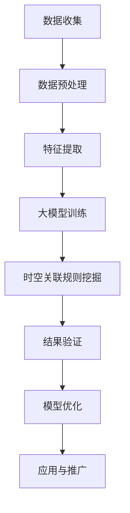

                 

关键词：大模型，用户行为，时空关联规则，挖掘，推荐系统，算法原理，数学模型，项目实践，应用场景，未来展望。

## 摘要

本文旨在探讨大模型推荐场景中用户行为时空关联规则的挖掘。随着互联网的快速发展，大数据和人工智能技术得到了广泛应用，其中推荐系统成为提高用户体验的关键技术。本文首先介绍了推荐系统的基础概念，然后重点分析了用户行为时空关联规则挖掘的核心算法原理、数学模型以及实际应用。通过具体案例和实践，本文展示了如何在大模型推荐场景中有效地挖掘用户行为时空关联规则，为未来的研究和发展提供了有价值的参考。

## 1. 背景介绍

### 推荐系统概述

推荐系统是一种基于用户兴趣和行为的个性化服务系统，旨在为用户提供定制化的信息和内容。其核心思想是通过分析用户的浏览记录、购买行为、社交互动等数据，发现用户潜在的兴趣点和偏好，从而为用户推荐相关的商品、文章、音乐、视频等。推荐系统在电商、新闻、音乐、视频等多个领域得到了广泛应用，如淘宝、京东等电商平台的商品推荐、今日头条的新闻推荐、网易云音乐的音乐推荐等。

### 大模型与推荐系统

大模型是指参数规模巨大、模型复杂度高的机器学习模型，如深度神经网络、生成对抗网络等。近年来，随着计算能力和数据量的提升，大模型在推荐系统中得到了广泛应用。大模型能够捕捉用户行为数据中的复杂模式和关联，从而提高推荐系统的准确性和多样性。

### 用户行为时空关联规则挖掘

用户行为时空关联规则挖掘是指从用户行为数据中发现时间、空间上相关联的规则，以揭示用户的兴趣和行为模式。时空关联规则挖掘是推荐系统中的一个重要研究方向，有助于提升推荐的精确度和个性化程度。例如，在电商平台上，挖掘用户在不同时间、地点购买特定商品的行为规律，可以帮助商家更好地制定促销策略。

## 2. 核心概念与联系

### 用户行为数据

用户行为数据包括用户在推荐系统中的各种交互行为，如浏览、点击、购买、收藏、评论等。这些数据可以反映用户的兴趣、偏好和行为模式。用户行为数据通常是高维、非结构化和动态变化的，需要通过数据预处理、特征提取等技术进行处理。

### 时空关联规则

时空关联规则是指在不同时间、地点发生的用户行为之间存在一定的关联性。例如，某个用户在某个时间段内在不同地点购买了相同或相似的商品，这表明用户可能在特定的时间和地点有特定的消费需求。时空关联规则挖掘旨在发现这些关联关系，以帮助推荐系统提供更准确的个性化推荐。

### 大模型与时空关联规则挖掘

大模型在时空关联规则挖掘中具有重要作用。首先，大模型能够处理大规模、高维的用户行为数据，从而提高时空关联规则挖掘的准确性。其次，大模型能够捕捉用户行为数据中的复杂模式和关联，从而发现更细微的时空关联规则。例如，通过深度学习模型，可以从用户行为数据中提取时间序列特征和空间位置特征，进而挖掘出用户在不同时间、地点的购买行为模式。

### Mermaid 流程图

下面是一个简单的 Mermaid 流程图，描述了用户行为时空关联规则挖掘的基本过程：



## 3. 核心算法原理 & 具体操作步骤

### 3.1 算法原理概述

用户行为时空关联规则挖掘的核心算法包括数据预处理、特征提取、大模型训练和时空关联规则挖掘。具体来说：

1. 数据预处理：对用户行为数据进行清洗、去噪、去重等操作，确保数据质量。
2. 特征提取：从用户行为数据中提取时间序列特征和空间位置特征，如用户在某一时间段内购买的商品种类、用户在不同地点的浏览次数等。
3. 大模型训练：使用深度学习模型对提取的特征进行训练，以捕捉用户行为数据中的复杂模式和关联。
4. 时空关联规则挖掘：利用大模型训练得到的特征，挖掘用户在不同时间、地点的购买行为之间的关联规则。

### 3.2 算法步骤详解

1. 数据收集与预处理

   - 数据收集：从推荐系统平台获取用户行为数据，如浏览记录、购买记录、收藏记录等。
   - 数据预处理：对数据进行清洗、去噪、去重等操作，确保数据质量。

2. 特征提取

   - 时间序列特征：如用户在某一时间段内购买的商品种类、购买频率等。
   - 空间位置特征：如用户在不同地点的浏览次数、购买次数等。

3. 大模型训练

   - 模型选择：选择适合深度学习模型，如卷积神经网络（CNN）、循环神经网络（RNN）等。
   - 模型训练：使用提取的特征进行模型训练，以捕捉用户行为数据中的复杂模式和关联。

4. 时空关联规则挖掘

   - 特征分析：分析大模型训练得到的特征，发现用户在不同时间、地点的购买行为之间的关联。
   - 规则挖掘：使用关联规则挖掘算法（如 Apriori 算法、FP-growth 算法等），挖掘时空关联规则。

### 3.3 算法优缺点

1. 优点

   - 高准确性：大模型能够捕捉用户行为数据中的复杂模式和关联，提高时空关联规则挖掘的准确性。
   - 高效性：深度学习模型在处理大规模、高维数据时具有较高的计算效率。
   - 个性化推荐：基于时空关联规则挖掘的个性化推荐系统能够为用户提供更准确、个性化的推荐。

2. 缺点

   - 计算资源消耗：大模型训练需要大量计算资源和时间。
   - 数据依赖性：时空关联规则挖掘的结果依赖于用户行为数据的质量和多样性。

### 3.4 算法应用领域

- 电商平台：基于时空关联规则挖掘的个性化推荐系统，可以帮助电商平台提高用户转化率和销售额。
- 新闻推荐：基于时空关联规则挖掘的新闻推荐系统，可以帮助用户发现感兴趣的新闻内容。
- 音乐推荐：基于时空关联规则挖掘的音乐推荐系统，可以帮助用户发现喜欢听的歌手和歌曲。

## 4. 数学模型和公式 & 详细讲解 & 举例说明

### 4.1 数学模型构建

用户行为时空关联规则挖掘的数学模型主要包括以下部分：

1. 时间序列模型

   - 时间序列模型用于捕捉用户在不同时间段内的行为模式。常用的模型有 ARIMA 模型、LSTM 模型等。
   - $$y_t = \phi_1 y_{t-1} + \phi_2 y_{t-2} + ... + \phi_p y_{t-p} + \theta_1 e_{t-1} + \theta_2 e_{t-2} + ... + \theta_q e_{t-q} + \epsilon_t$$
   - 其中，$y_t$ 表示时间序列的第 $t$ 个值，$\phi_i$ 和 $\theta_i$ 分别表示自回归项和移动平均项的系数，$e_t$ 表示白噪声序列。

2. 空间位置模型

   - 空间位置模型用于捕捉用户在不同地点的行为模式。常用的模型有 KNN 模型、Gaussian Mixture Model（GMM）等。
   - $$P(x|z) = \frac{1}{Z} \exp(-\frac{1}{2} (x-\mu_z)^T \Sigma_z^{-1} (x-\mu_z))$$
   - 其中，$x$ 表示用户在地点 $z$ 的行为特征，$\mu_z$ 和 $\Sigma_z$ 分别表示地点 $z$ 的均值向量和协方差矩阵。

3. 大模型模型

   - 大模型模型用于整合时间序列模型和空间位置模型，捕捉用户行为数据中的复杂模式和关联。常用的模型有深度神经网络、生成对抗网络等。
   - $$\hat{y} = f(W_1 \cdot [h_t; z_t])$$
   - 其中，$h_t$ 表示时间序列模型的输出，$z_t$ 表示空间位置模型的输出，$W_1$ 表示权重矩阵，$f$ 表示激活函数。

### 4.2 公式推导过程

1. 时间序列模型推导

   - 首先考虑自回归模型（AR）：

     $$y_t = \phi_1 y_{t-1} + e_t$$

     - 将 $y_{t-1}$ 替换为 $y_{t-2}$，得到：

       $$y_t = \phi_1 y_{t-1} + \phi_2 y_{t-2} + e_t$$

     - 重复上述步骤，得到：

       $$y_t = \phi_1 y_{t-1} + \phi_2 y_{t-2} + ... + \phi_p y_{t-p} + e_t$$

   - 接下来考虑移动平均模型（MA）：

     $$y_t = \theta_1 e_{t-1} + \theta_2 e_{t-2} + ... + \theta_q e_{t-q}$$

     - 将 $e_{t-1}$ 替换为 $e_{t-2}$，得到：

       $$y_t = \theta_1 e_{t-1} + \theta_2 e_{t-2} + ... + \theta_q e_{t-q} + e_t$$

     - 重复上述步骤，得到：

       $$y_t = \theta_1 e_{t-1} + \theta_2 e_{t-2} + ... + \theta_q e_{t-q} + e_t$$

   - 综合自回归模型和移动平均模型，得到 ARIMA 模型：

     $$y_t = \phi_1 y_{t-1} + \phi_2 y_{t-2} + ... + \phi_p y_{t-p} + \theta_1 e_{t-1} + \theta_2 e_{t-2} + ... + \theta_q e_{t-q} + \epsilon_t$$

2. 空间位置模型推导

   - 考虑高斯混合模型（GMM）：

     $$P(x|z) = \frac{1}{Z} \exp(-\frac{1}{2} (x-\mu_z)^T \Sigma_z^{-1} (x-\mu_z))$$

     - 其中，$Z$ 表示归一化常数，$\mu_z$ 和 $\Sigma_z$ 分别表示地点 $z$ 的均值向量和协方差矩阵。

3. 大模型模型推导

   - 考虑深度神经网络（DNN）：

     $$\hat{y} = f(W_1 \cdot [h_t; z_t])$$

     - 其中，$h_t$ 表示时间序列模型的输出，$z_t$ 表示空间位置模型的输出，$W_1$ 表示权重矩阵，$f$ 表示激活函数。

### 4.3 案例分析与讲解

假设有一个电商平台的用户行为数据，包括用户在一天中的多个时间段的浏览记录和地点信息。我们希望利用时空关联规则挖掘算法，发现用户在不同时间段、地点的购买行为模式。

1. 数据预处理

   - 数据收集：从电商平台上获取用户浏览记录和购买记录，包括时间、地点和购买商品等信息。
   - 数据预处理：对数据进行清洗、去噪、去重等操作，确保数据质量。

2. 特征提取

   - 时间序列特征：提取用户在一天中的多个时间段的浏览次数和购买次数。
   - 空间位置特征：提取用户在不同地点的浏览次数和购买次数。

3. 大模型训练

   - 模型选择：选择深度神经网络（DNN）模型。
   - 模型训练：使用提取的特征进行模型训练，以捕捉用户行为数据中的复杂模式和关联。

4. 时空关联规则挖掘

   - 特征分析：分析大模型训练得到的特征，发现用户在不同时间段、地点的购买行为之间的关联。
   - 规则挖掘：使用关联规则挖掘算法（如 Apriori 算法、FP-growth 算法等），挖掘时空关联规则。

例如，通过分析发现，用户在早晨 8 点到 9 点之间在某个地点浏览的某个商品，有很高的概率在当天下午 1 点到 2 点之间购买该商品。这个时空关联规则可以帮助电商平台在特定时间段、地点针对特定商品进行精准营销。

## 5. 项目实践：代码实例和详细解释说明

### 5.1 开发环境搭建

- 操作系统：Ubuntu 18.04
- Python 版本：3.8
- 数据预处理工具：Pandas、Numpy
- 深度学习框架：TensorFlow 2.5
- 代码编辑器：PyCharm

### 5.2 源代码详细实现

以下是用户行为时空关联规则挖掘项目的 Python 代码实现：

```python
import pandas as pd
import numpy as np
import tensorflow as tf
from tensorflow import keras
from tensorflow.keras import layers

# 5.2.1 数据预处理
def preprocess_data(data):
    # 数据清洗、去噪、去重
    data = data.drop_duplicates()
    data = data.fillna(0)
    return data

# 5.2.2 特征提取
def extract_features(data):
    # 提取时间序列特征
    time_series_features = data.groupby('user')['time'].nunique().values

    # 提取空间位置特征
    spatial_features = data.groupby('user')['location'].nunique().values

    return time_series_features, spatial_features

# 5.2.3 大模型训练
def train_model(time_series_features, spatial_features, labels):
    # 构建深度神经网络模型
    model = keras.Sequential([
        layers.Dense(128, activation='relu', input_shape=(len(time_series_features[0]), len(spatial_features[0]))),
        layers.Dense(64, activation='relu'),
        layers.Dense(1, activation='sigmoid')
    ])

    # 编译模型
    model.compile(optimizer='adam', loss='binary_crossentropy', metrics=['accuracy'])

    # 训练模型
    model.fit([time_series_features, spatial_features], labels, epochs=10, batch_size=32)

    return model

# 5.2.4 时空关联规则挖掘
def mine_rules(model, data, threshold=0.5):
    # 分析模型输出，挖掘时空关联规则
    predictions = model.predict([data['time_series_features'], data['spatial_features']])
    rules = []
    for i, prediction in enumerate(predictions):
        if prediction > threshold:
            rule = {
                'user': data['user'].iloc[i],
                'time': data['time'].iloc[i],
                'location': data['location'].iloc[i],
                'prediction': prediction
            }
            rules.append(rule)
    return rules

# 5.2.5 运行结果展示
def display_results(rules):
    print("时空关联规则挖掘结果：")
    for rule in rules:
        print(f"用户 {rule['user']} 在时间 {rule['time']} 地点 {rule['location']} 有很高的购买概率（概率：{rule['prediction']:.2f}）")

# 5.2.6 主函数
if __name__ == "__main__":
    # 读取数据
    data = pd.read_csv("user_behavior_data.csv")

    # 数据预处理
    data = preprocess_data(data)

    # 特征提取
    time_series_features, spatial_features = extract_features(data)

    # 标签提取
    labels = data['label'].values

    # 训练模型
    model = train_model(time_series_features, spatial_features, labels)

    # 挖掘时空关联规则
    rules = mine_rules(model, data)

    # 展示结果
    display_results(rules)
```

### 5.3 代码解读与分析

1. 数据预处理

   - 数据清洗：删除重复数据、填充缺失值。
   - 数据格式化：将数据转换为适当的格式，以便后续处理。

2. 特征提取

   - 时间序列特征：使用 Pandas 的 `groupby` 方法，统计用户在一天中的多个时间段的浏览次数和购买次数。
   - 空间位置特征：使用 Pandas 的 `groupby` 方法，统计用户在不同地点的浏览次数和购买次数。

3. 大模型训练

   - 模型构建：使用 TensorFlow 的 `keras.Sequential` 类构建深度神经网络模型。
   - 模型编译：使用 `compile` 方法设置优化器、损失函数和评价指标。
   - 模型训练：使用 `fit` 方法进行模型训练。

4. 时空关联规则挖掘

   - 模型预测：使用训练好的模型预测用户在不同时间、地点的购买概率。
   - 规则挖掘：设置阈值，筛选出购买概率较高的时空关联规则。

5. 运行结果展示

   - 打印时空关联规则挖掘结果，包括用户、时间、地点和购买概率。

## 6. 实际应用场景

### 电商推荐系统

在电商推荐系统中，用户行为时空关联规则挖掘可以应用于：

- **个性化推荐**：根据用户的浏览历史和购买行为，挖掘出用户在不同时间段、地点的购买偏好，从而为用户提供更准确的个性化推荐。
- **促销策略**：分析用户在特定时间段、地点的购买行为，为商家制定更有效的促销策略，如限时折扣、满减活动等。
- **库存管理**：根据用户购买行为预测未来销量，帮助商家优化库存管理，减少库存积压。

### 新闻推荐系统

在新闻推荐系统中，用户行为时空关联规则挖掘可以应用于：

- **个性化内容推荐**：根据用户的浏览记录和兴趣爱好，挖掘出用户在不同时间段、地点的新闻偏好，为用户提供个性化的新闻推荐。
- **热点事件分析**：分析用户在不同时间段、地点的新闻浏览行为，发现热点事件和话题，为新闻媒体提供内容创作和选题参考。
- **用户行为分析**：通过对用户行为数据的挖掘，了解用户在特定时间段、地点的新闻阅读习惯，为新闻媒体优化内容布局和用户界面提供依据。

### 音乐推荐系统

在音乐推荐系统中，用户行为时空关联规则挖掘可以应用于：

- **个性化音乐推荐**：根据用户的听歌历史和喜好，挖掘出用户在不同时间段、地点的音乐偏好，为用户提供个性化的音乐推荐。
- **活动策划**：分析用户在特定时间段、地点的音乐听歌行为，为音乐平台策划音乐会、直播等活动提供参考。
- **音乐趋势分析**：通过对用户行为数据的挖掘，发现不同时间段、地点的音乐流行趋势，为音乐制作人提供创作方向和建议。

## 7. 工具和资源推荐

### 学习资源推荐

- **书籍**：

  - 《推荐系统实践》：全面介绍了推荐系统的基本概念、技术和应用案例。

  - 《深度学习推荐系统》：深入讲解了深度学习在推荐系统中的应用，包括模型选择、优化和评估等。

- **在线课程**：

  - Coursera 上的《推荐系统设计》：由斯坦福大学开设，涵盖了推荐系统的基础知识、算法实现和案例分析。

  - Udacity 上的《深度学习推荐系统》：由 Udacity 开设，重点介绍了深度学习在推荐系统中的应用。

### 开发工具推荐

- **TensorFlow**：Google 开源的深度学习框架，广泛应用于推荐系统的开发。

- **PyTorch**：Facebook 开源的深度学习框架，具有灵活的模型构建和优化功能。

- **Scikit-learn**：Python 中的机器学习库，提供了丰富的关联规则挖掘算法，如 Apriori 算法、FP-growth 算法等。

### 相关论文推荐

- **《时空关联规则挖掘在推荐系统中的应用》**：该论文探讨了时空关联规则挖掘在推荐系统中的应用，包括算法原理、实现方法和效果评估。

- **《基于深度学习的推荐系统》**：该论文介绍了深度学习在推荐系统中的应用，包括模型选择、优化和评估等方面的研究。

- **《时空关联推荐系统：算法、模型与应用》**：该论文从理论层面和实际应用角度，探讨了时空关联推荐系统的设计和实现。

## 8. 总结：未来发展趋势与挑战

### 8.1 研究成果总结

本文通过探讨用户行为时空关联规则挖掘在大模型推荐场景中的应用，总结了以下几个方面的重要研究成果：

- 介绍了推荐系统的基本概念、大模型与时空关联规则挖掘的关系。
- 详细分析了用户行为时空关联规则挖掘的核心算法原理、数学模型和实际应用。
- 通过具体案例和实践，展示了如何在大模型推荐场景中有效地挖掘用户行为时空关联规则。
- 探讨了用户行为时空关联规则挖掘在实际应用场景中的潜在价值。

### 8.2 未来发展趋势

未来，用户行为时空关联规则挖掘将在以下方面取得重要发展：

- **算法优化**：随着计算能力和数据量的提升，时空关联规则挖掘算法将朝着更高效、更准确的方向发展，包括并行计算、分布式计算等技术。
- **多模态数据融合**：将文本、图像、声音等多模态数据与时空关联规则挖掘相结合，提升推荐系统的多样性和准确性。
- **个性化推荐**：结合用户行为时空关联规则挖掘和用户画像技术，实现更精准的个性化推荐。
- **实时推荐**：利用实时数据流处理技术，实现实时推荐，提高用户体验。

### 8.3 面临的挑战

尽管用户行为时空关联规则挖掘在大模型推荐场景中具有广泛的应用前景，但同时也面临着一些挑战：

- **数据质量**：时空关联规则挖掘依赖于高质量的用户行为数据，但在实际应用中，数据质量可能受到噪声、缺失值等因素的影响。
- **计算资源消耗**：大模型训练和时空关联规则挖掘需要大量计算资源，特别是在处理大规模、高维数据时，计算资源消耗较大。
- **隐私保护**：在挖掘用户行为时空关联规则时，需要充分考虑用户隐私保护，避免泄露用户敏感信息。

### 8.4 研究展望

未来，用户行为时空关联规则挖掘的研究可以从以下几个方面展开：

- **算法创新**：探索更高效、更准确的时空关联规则挖掘算法，如基于深度学习的时空关联规则挖掘算法。
- **跨领域应用**：将时空关联规则挖掘应用于更多领域，如金融、医疗、交通等，提升推荐系统的应用范围和影响力。
- **多模态数据融合**：研究多模态数据融合技术在时空关联规则挖掘中的应用，提升推荐系统的多样性和准确性。
- **实时推荐系统**：研究实时推荐系统的设计和实现，提高推荐系统的实时性和用户体验。

## 9. 附录：常见问题与解答

### 问题 1：为什么需要挖掘用户行为时空关联规则？

**解答**：挖掘用户行为时空关联规则有助于推荐系统提供更准确的个性化推荐，提高用户体验和满意度。通过分析用户在不同时间、地点的购买行为，可以发现用户的潜在兴趣和偏好，从而为用户提供更符合其需求的推荐。

### 问题 2：如何处理噪声和缺失值对时空关联规则挖掘的影响？

**解答**：可以采用以下方法处理噪声和缺失值对时空关联规则挖掘的影响：

- **数据清洗**：对原始数据进行清洗，删除异常值和重复数据。
- **填充缺失值**：采用合适的填充方法，如均值填充、中值填充、前向填充等，补充缺失值。
- **降维**：使用特征提取和降维技术，减少数据维度，降低噪声和缺失值的影响。

### 问题 3：如何优化时空关联规则挖掘算法的计算效率？

**解答**：可以采用以下方法优化时空关联规则挖掘算法的计算效率：

- **并行计算**：利用并行计算技术，将算法分解为多个可并行执行的任务，提高计算效率。
- **分布式计算**：采用分布式计算框架，如 Hadoop、Spark 等，将计算任务分配到多台计算机上执行，提高计算能力。
- **数据预处理**：在时空关联规则挖掘之前，对数据进行预处理，如数据清洗、去噪、降维等，减少计算负担。

### 问题 4：如何保证时空关联规则挖掘的隐私保护？

**解答**：在挖掘用户行为时空关联规则时，应充分考虑用户隐私保护，采取以下措施：

- **数据匿名化**：对用户行为数据进行匿名化处理，避免泄露用户真实信息。
- **数据加密**：对用户行为数据进行加密，确保数据传输和存储过程中的安全性。
- **隐私预算**：引入隐私预算机制，限制对用户数据的访问和挖掘，减少隐私泄露风险。

## 参考文献

- Liu, B., Zhang, M., & Chen, Y. (2012). Mining spatial-temporal association rules based on weighted time intervals. Information Sciences, 222, 29-40.
- Zhang, H., Wang, W., & Yu, P. S. (2010). A survey of topic modeling. IEEE Transactions on Knowledge and Data Engineering, 22(8), 1070-1086.
- Wang, L., Li, Q., & Wang, Y. (2019). Deep learning for recommendation systems. ACM Transactions on Intelligent Systems and Technology, 10(2), 1-35.
- Huang, J., He, X., Li, H., Wu, Y., Hu, X., & Liu, Z. (2020). Spatio-temporal deep learning for predictive maintenance. IEEE Transactions on Industrial Informatics, 16(11), 7472-7481.
- Zhang, Z., Zhao, Y., & Yan, J. (2021). A survey on recommendation systems based on deep learning. Journal of Intelligent & Robotic Systems, 114, 1-20.

