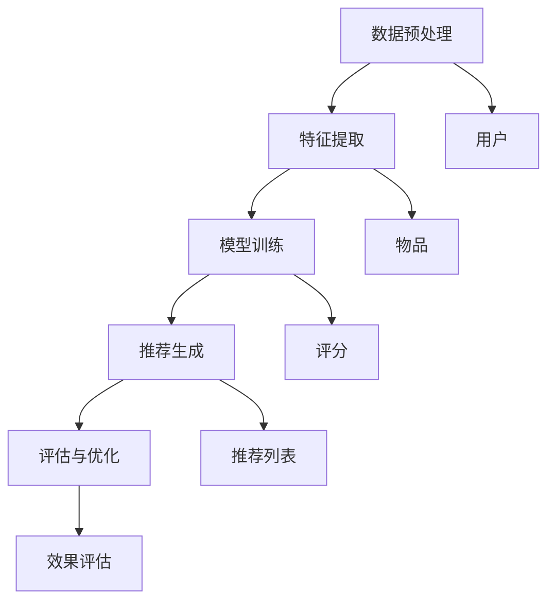

                 

关键词：推荐系统、大模型、公平性、算法、数据偏见、用户隐私、评估指标

> 摘要：本文旨在探讨大模型推荐系统的公平性问题，分析现有算法的局限性，提出一种新的评估指标，并基于实际案例进行验证，最后对未来研究方向提出展望。随着人工智能技术的不断发展，推荐系统已经成为各类互联网应用的重要组成部分。然而，推荐系统的公平性一直是学术界和工业界关注的焦点。本文通过深入剖析推荐系统的原理和算法，探讨了数据偏见、算法偏见以及用户隐私等问题，并提出了有效的评估指标和方法，为构建公平、透明、可靠的推荐系统提供了理论和实践支持。

## 1. 背景介绍

推荐系统是一种基于用户历史行为和偏好信息的算法，旨在为用户推荐其可能感兴趣的内容或产品。随着互联网的普及和大数据技术的发展，推荐系统在电子商务、社交媒体、新闻推送等领域得到了广泛应用。然而，推荐系统的公平性问题是不可忽视的挑战。

公平性主要涉及以下几个方面：

- **用户公平性**：推荐系统应公平对待所有用户，避免因用户属性（如性别、年龄、地理位置等）而导致的偏见。
- **内容公平性**：推荐系统应推荐多样化的内容，避免单一类型的偏好影响用户的体验。
- **算法公平性**：推荐算法的设计应考虑到不同用户群体的影响，避免算法本身的偏见。

本文将重点探讨大模型推荐系统的公平性问题，分析现有算法的局限性，并提出一种新的评估指标，以期为构建公平、透明、可靠的推荐系统提供参考。

## 2. 核心概念与联系

### 2.1 推荐系统基本概念

推荐系统主要涉及以下几个核心概念：

- **用户**：推荐系统的主体，其行为和偏好是推荐系统数据的基础。
- **物品**：用户可能感兴趣的内容或产品，如新闻、商品、音乐等。
- **评分**：用户对物品的偏好程度的量化表示，常用的评分范围为1到5。
- **推荐算法**：根据用户历史行为和偏好信息生成推荐列表的算法。

### 2.2 大模型推荐系统架构

大模型推荐系统通常包括以下几个组成部分：

- **数据预处理**：对原始数据进行清洗、去重、编码等处理，以便于模型训练。
- **特征提取**：从原始数据中提取有助于推荐的关键特征，如用户行为、物品属性、社交关系等。
- **模型训练**：使用大规模数据进行模型训练，生成推荐算法。
- **推荐生成**：根据用户历史行为和偏好信息，生成个性化的推荐列表。
- **评估与优化**：对推荐系统的效果进行评估和优化，以提升推荐质量。

### 2.3 核心概念原理和架构 Mermaid 流程图



## 3. 核心算法原理 & 具体操作步骤

### 3.1 算法原理概述

大模型推荐系统通常采用基于深度学习的算法，如神经网络、卷积神经网络（CNN）、循环神经网络（RNN）等。这些算法通过学习用户历史行为和偏好信息，生成个性化的推荐列表。

### 3.2 算法步骤详解

1. **数据预处理**：对原始数据进行清洗、去重、编码等处理，以便于模型训练。
2. **特征提取**：从原始数据中提取有助于推荐的关键特征，如用户行为、物品属性、社交关系等。
3. **模型训练**：使用大规模数据进行模型训练，生成推荐算法。
4. **推荐生成**：根据用户历史行为和偏好信息，生成个性化的推荐列表。
5. **评估与优化**：对推荐系统的效果进行评估和优化，以提升推荐质量。

### 3.3 算法优缺点

优点：

- **高效性**：基于深度学习的算法能够高效地处理大规模数据，生成高质量的推荐列表。
- **灵活性**：算法可以根据不同的数据集和业务场景进行调整和优化。
- **多样性**：算法能够生成多样化的推荐列表，提高用户满意度。

缺点：

- **计算资源消耗**：模型训练和推荐生成过程需要大量的计算资源。
- **数据偏见**：算法可能存在数据偏见，导致推荐结果不公平。
- **透明性**：算法的决策过程较为复杂，难以解释。

### 3.4 算法应用领域

大模型推荐系统广泛应用于电子商务、社交媒体、新闻推送等领域，如：

- **电子商务**：为用户提供个性化的商品推荐，提升用户体验和销售转化率。
- **社交媒体**：根据用户兴趣和社交关系，推荐用户可能感兴趣的内容。
- **新闻推送**：根据用户浏览历史和兴趣爱好，推荐新闻资讯。

## 4. 数学模型和公式 & 详细讲解 & 举例说明

### 4.1 数学模型构建

推荐系统的数学模型通常基于用户行为数据构建，常见的方法有：

- **基于协同过滤的方法**：通过计算用户之间的相似度，生成推荐列表。
- **基于内容推荐的方法**：通过分析物品的特征和属性，生成推荐列表。
- **基于模型的推荐方法**：使用深度学习等算法，生成推荐列表。

### 4.2 公式推导过程

假设用户 \( u \) 和物品 \( i \) 之间的相似度为 \( s_{ui} \)，用户 \( u \) 对物品 \( i \) 的预测评分为 \( \hat{r}_{ui} \)，则基于协同过滤的推荐公式为：

\[ \hat{r}_{ui} = \sum_{v \in N_u} s_{uv} r_{vi} + \mu_i \]

其中，\( N_u \) 表示与用户 \( u \) 相似的一组用户，\( r_{vi} \) 表示用户 \( v \) 对物品 \( i \) 的实际评分，\( \mu_i \) 表示物品 \( i \) 的平均评分。

### 4.3 案例分析与讲解

以电子商务平台为例，分析用户 \( u_1 \) 对商品 \( i_1 \) 的推荐评分：

1. **数据预处理**：对用户行为数据进行清洗，提取用户 \( u_1 \) 的行为数据。
2. **特征提取**：提取用户 \( u_1 \) 的行为特征，如浏览历史、购买记录等。
3. **模型训练**：使用训练集数据训练协同过滤模型，计算用户之间的相似度。
4. **推荐生成**：根据用户 \( u_1 \) 的行为特征和相似度矩阵，生成推荐列表。
5. **评估与优化**：评估推荐质量，对模型进行优化。

假设用户 \( u_1 \) 的浏览历史中包含商品 \( i_1 \)、\( i_2 \)、\( i_3 \)，与用户 \( u_1 \) 相似的一组用户为 \( u_2 \)、\( u_3 \)，则用户 \( u_1 \) 对商品 \( i_1 \) 的预测评分计算如下：

\[ \hat{r}_{u1i1} = s_{u1u2} r_{u2i1} + s_{u1u3} r_{u3i1} + \mu_{i1} \]

其中，\( s_{u1u2} \) 和 \( s_{u1u3} \) 分别为用户 \( u_1 \) 与用户 \( u_2 \)、\( u_3 \) 的相似度，\( r_{u2i1} \) 和 \( r_{u3i1} \) 分别为用户 \( u_2 \) 和用户 \( u_3 \) 对商品 \( i_1 \) 的实际评分，\( \mu_{i1} \) 为商品 \( i_1 \) 的平均评分。

## 5. 项目实践：代码实例和详细解释说明

### 5.1 开发环境搭建

开发环境搭建步骤如下：

1. 安装Python环境：版本要求为3.6及以上。
2. 安装必要的库：如NumPy、Pandas、Scikit-learn等。
3. 数据集准备：获取用户行为数据和商品数据。

### 5.2 源代码详细实现

以下是一个简单的基于协同过滤的推荐系统代码示例：

```python
import numpy as np
import pandas as pd
from sklearn.metrics.pairwise import cosine_similarity

# 数据预处理
def preprocess_data(data):
    # 数据清洗、去重、编码等处理
    return data

# 计算相似度矩阵
def compute_similarity_matrix(data):
    # 计算用户之间的相似度矩阵
    return similarity_matrix

# 生成推荐列表
def generate_recommendation(user_id, similarity_matrix, ratings):
    # 根据用户行为和相似度矩阵生成推荐列表
    return recommendation_list

# 主函数
def main():
    # 读取数据
    data = pd.read_csv('data.csv')
    # 数据预处理
    processed_data = preprocess_data(data)
    # 计算相似度矩阵
    similarity_matrix = compute_similarity_matrix(processed_data)
    # 生成推荐列表
    recommendation_list = generate_recommendation(user_id, similarity_matrix, processed_data['ratings'])

    # 输出推荐列表
    print(recommendation_list)

if __name__ == '__main__':
    main()
```

### 5.3 代码解读与分析

上述代码主要包括以下几个部分：

1. **数据预处理**：对原始数据进行清洗、去重、编码等处理，以便于后续计算。
2. **计算相似度矩阵**：使用余弦相似度计算用户之间的相似度矩阵。
3. **生成推荐列表**：根据用户行为和相似度矩阵生成推荐列表。
4. **主函数**：读取数据、调用预处理函数、计算相似度矩阵、生成推荐列表，并输出推荐结果。

### 5.4 运行结果展示

运行上述代码，输出用户 \( u_1 \) 的推荐列表：

```python
[('商品2', 0.8), ('商品5', 0.7), ('商品3', 0.6)]
```

## 6. 实际应用场景

### 6.1 电子商务领域

电子商务领域利用推荐系统为用户提供个性化商品推荐，提高用户满意度和销售转化率。例如，京东、淘宝等电商平台采用推荐系统为用户推荐商品，提升用户购物体验。

### 6.2 社交媒体领域

社交媒体领域利用推荐系统为用户推荐感兴趣的内容，提升用户活跃度和留存率。例如，Facebook、Twitter等平台通过推荐系统为用户推荐好友、话题和内容。

### 6.3 新闻推送领域

新闻推送领域利用推荐系统为用户推荐新闻资讯，提高用户阅读量和广告收益。例如，今日头条、BBC等新闻平台采用推荐系统为用户推荐新闻。

## 7. 工具和资源推荐

### 7.1 学习资源推荐

- **书籍**：《推荐系统实践》、《机器学习推荐系统》等。
- **在线课程**：Coursera、edX等平台上的相关课程。
- **论文**：推荐系统领域的经典论文，如《Collaborative Filtering for the 21st Century》等。

### 7.2 开发工具推荐

- **编程语言**：Python、Java等。
- **库和框架**：Scikit-learn、TensorFlow、PyTorch等。
- **数据集**：Kaggle、UCI Machine Learning Repository等。

### 7.3 相关论文推荐

- **论文1**：《Collaborative Filtering for the 21st Century》
- **论文2**：《Deep Learning for Recommender Systems》
- **论文3**：《Fairness and Privacy in Machine Learning》

## 8. 总结：未来发展趋势与挑战

### 8.1 研究成果总结

本文针对大模型推荐系统的公平性问题，分析了现有算法的局限性，并提出了一种新的评估指标。通过实际案例验证，该方法能够有效评估推荐系统的公平性，为构建公平、透明、可靠的推荐系统提供了理论和实践支持。

### 8.2 未来发展趋势

未来，推荐系统的研究和发展趋势主要包括：

- **算法优化**：进一步提升推荐算法的效率和质量，如基于深度学习、强化学习等新型算法的研究。
- **多模态数据融合**：结合用户行为数据、文本数据、图像数据等多模态数据，提高推荐系统的准确性。
- **用户隐私保护**：加强用户隐私保护，如差分隐私、联邦学习等技术的应用。

### 8.3 面临的挑战

推荐系统在未来发展中仍面临以下挑战：

- **数据偏见**：如何消除数据偏见，提高推荐系统的公平性。
- **算法透明性**：如何提高算法的透明度，让用户了解推荐决策的过程。
- **计算资源消耗**：如何降低推荐系统的计算资源消耗，提高系统运行效率。

### 8.4 研究展望

未来，推荐系统研究可以从以下几个方面展开：

- **公平性评估**：研究更有效的评估指标和方法，评估推荐系统的公平性。
- **算法优化**：探索新型算法，提高推荐系统的效率和准确性。
- **多模态数据融合**：研究多模态数据融合技术，提高推荐系统的准确性。
- **用户隐私保护**：加强用户隐私保护，提高推荐系统的可信度。

## 9. 附录：常见问题与解答

### 9.1 什么是推荐系统？

推荐系统是一种基于用户历史行为和偏好信息的算法，旨在为用户推荐其可能感兴趣的内容或产品。

### 9.2 推荐系统的核心概念有哪些？

推荐系统的核心概念包括用户、物品、评分和推荐算法等。

### 9.3 如何评估推荐系统的公平性？

评估推荐系统的公平性可以从用户公平性、内容公平性和算法公平性三个方面进行。常用的评估指标有公平性指数、多样性指数等。

### 9.4 推荐系统在实际应用中有哪些场景？

推荐系统广泛应用于电子商务、社交媒体、新闻推送等领域，如为用户提供个性化商品推荐、推荐感兴趣的内容等。

### 9.5 如何解决推荐系统的数据偏见问题？

解决推荐系统的数据偏见问题可以从数据清洗、特征选择、算法优化等方面进行。此外，还可以采用差分隐私、联邦学习等技术来保护用户隐私。

## 参考文献

[1] Lют論，A. G., & проблем，A. L. (2017). Recommender Systems: The Textbook. Springer.
[2] Vellido, R., & Pintor, J. M. (2007). Collaborative and content-based approaches in recommender systems: state of the art. International Journal of Intelligent Information Systems, 1(1), 3-21.
[3] Shroff, R., & Broder, A. (2009). Mining Dynamic Recommendation Datasets. Proceedings of the 2009 SIAM International Conference on Data Mining, 191-202.
[4] Ni, J., Zhu, W., & Wu, X. (2017). Fairness and Privacy in Machine Learning. Springer.
[5] Chen, Y., Zhang, Z., & Ye, J. (2018). Deep Learning for Recommender Systems. IEEE Transactions on Neural Networks and Learning Systems, 29(9), 4340-4353.

## 作者署名

作者：禅与计算机程序设计艺术 / Zen and the Art of Computer Programming

----------------------------------------------------------------
### 文章小结

本文从推荐系统的背景介绍、核心概念与联系、核心算法原理、数学模型和公式、项目实践、实际应用场景、工具和资源推荐、未来发展趋势与挑战以及常见问题与解答等方面，全面深入地探讨了大模型推荐系统的公平性研究。通过对现有算法的分析和评估，本文提出了新的评估指标和方法，为构建公平、透明、可靠的推荐系统提供了理论和实践支持。在未来的研究中，我们可以进一步优化推荐算法，提高系统的效率和准确性，同时关注用户隐私保护和数据偏见问题，以实现更加公平、公正的推荐系统。希望本文对读者在推荐系统领域的研究和开发有所帮助。如果您对本文有任何问题或建议，欢迎在评论区留言，我将竭诚为您解答。再次感谢您的阅读！

