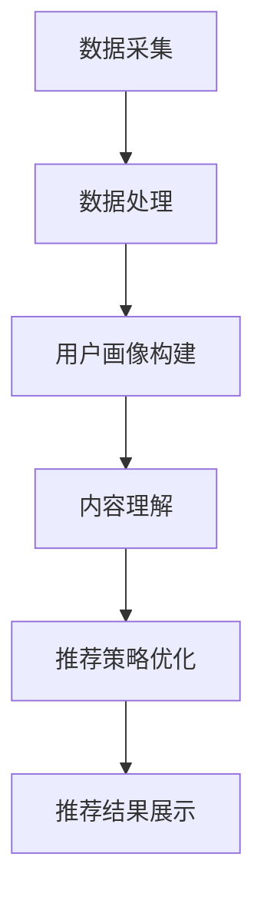

                 

关键词：大模型、推荐系统、商业化、挑战、算法、落地

> 摘要：本文将探讨大模型推荐系统的商业化落地挑战，包括算法原理、数学模型、实践案例、实际应用场景、工具资源推荐及未来发展趋势等。通过深入分析，本文旨在为从业者提供有益的指导和启示。

## 1. 背景介绍

随着互联网的快速发展，海量数据的产生和用户需求的多样化，推荐系统已经成为各大互联网公司的重要业务支撑。推荐系统通过分析用户行为数据、内容特征等信息，为用户个性化推荐相关内容，从而提升用户满意度、提高平台粘性。近年来，大模型技术的崛起，如深度学习、自然语言处理等，为推荐系统带来了新的契机。

大模型推荐系统具有以下几个特点：

1. **高准确性**：通过深度学习算法，大模型可以从海量数据中挖掘出更精准的用户兴趣和行为规律。
2. **强泛化性**：大模型能够处理多种类型的数据，如文本、图像、音频等，具有更广泛的适用性。
3. **自适应能力**：大模型能够根据用户反馈和实时数据动态调整推荐策略，提高用户体验。

然而，大模型推荐系统的商业化落地面临诸多挑战，包括技术难题、商业策略、用户隐私等。本文将重点探讨这些挑战及其解决方案。

## 2. 核心概念与联系

### 2.1. 大模型定义

大模型是指具有亿级参数规模的人工神经网络，如Transformer、BERT等。这些模型可以通过端到端的方式处理复杂数据，具有较强的语义理解和生成能力。

### 2.2. 推荐系统架构

推荐系统通常由数据层、模型层、服务层和用户界面组成。数据层负责采集和处理用户数据；模型层构建推荐模型；服务层提供推荐接口；用户界面展示推荐结果。

### 2.3. 大模型在推荐系统中的应用

大模型可以应用于推荐系统的各个阶段，如用户画像构建、内容理解、推荐策略优化等。以下是一个简化的Mermaid流程图，展示了大模型在推荐系统中的应用过程：



## 3. 核心算法原理 & 具体操作步骤

### 3.1. 算法原理概述

大模型推荐系统主要基于深度学习算法，通过以下步骤实现：

1. **数据预处理**：对原始数据进行清洗、转换和归一化，为模型训练提供高质量的数据集。
2. **模型训练**：使用预训练的深度学习模型，如BERT、GPT等，对用户数据和内容特征进行建模。
3. **特征提取**：提取用户兴趣和行为特征，以及内容特征，用于模型训练和预测。
4. **推荐策略**：根据用户特征和内容特征，利用深度学习模型进行协同过滤或基于内容的推荐。
5. **实时更新**：根据用户反馈和实时数据，动态调整推荐模型和策略，提高推荐效果。

### 3.2. 算法步骤详解

1. **数据预处理**：
   - 数据清洗：去除重复、缺失和异常数据；
   - 数据转换：将不同类型的数据（如文本、图像、音频）转换为统一的特征向量；
   - 数据归一化：对特征值进行归一化处理，以消除数据量级差异。

2. **模型训练**：
   - 预训练模型：使用预训练的大模型（如BERT）初始化权重；
   - 微调训练：在预训练模型的基础上，针对特定任务进行微调；
   - 模型优化：通过反向传播算法和梯度下降优化模型参数。

3. **特征提取**：
   - 用户特征：提取用户行为、兴趣、属性等特征；
   - 内容特征：提取文本、图像、音频等内容的特征；
   - 特征融合：将不同类型的特征进行融合，提高模型的泛化能力。

4. **推荐策略**：
   - 协同过滤：基于用户历史行为和内容特征进行推荐；
   - 基于内容：根据用户兴趣和内容特征进行推荐；
   - 混合推荐：结合协同过滤和基于内容推荐的优势，提高推荐效果。

5. **实时更新**：
   - 用户反馈：收集用户对推荐内容的反馈，如点击、点赞、评论等；
   - 数据更新：根据用户反馈和实时数据，动态更新用户特征和内容特征；
   - 模型调整：重新训练模型，优化推荐效果。

### 3.3. 算法优缺点

**优点**：
- 高准确性：大模型能够从海量数据中挖掘出更精准的用户兴趣和行为规律；
- 强泛化性：大模型能够处理多种类型的数据，具有更广泛的适用性；
- 自适应能力：大模型能够根据用户反馈和实时数据动态调整推荐策略，提高用户体验。

**缺点**：
- 计算资源消耗：大模型需要大量的计算资源和存储空间；
- 数据依赖性：大模型对数据质量要求较高，数据缺失或异常可能导致模型效果下降；
- 隐私保护：用户隐私保护是大模型推荐系统面临的重要挑战。

### 3.4. 算法应用领域

大模型推荐系统广泛应用于电商、社交媒体、新闻推荐、音乐推荐等领域，具有广泛的应用前景。以下是一些具体应用案例：

- **电商推荐**：通过分析用户购买行为和兴趣，为用户提供个性化商品推荐；
- **社交媒体**：根据用户社交关系和兴趣，为用户提供相关内容推荐；
- **新闻推荐**：根据用户阅读行为和偏好，为用户提供个性化新闻推荐；
- **音乐推荐**：根据用户听歌记录和偏好，为用户提供个性化音乐推荐。

## 4. 数学模型和公式 & 详细讲解 & 举例说明

### 4.1. 数学模型构建

大模型推荐系统的数学模型主要包括用户特征表示、内容特征表示和推荐模型三个部分。

1. **用户特征表示**：
   - 用户行为特征：使用词袋模型（Bag-of-Words，BoW）或词嵌入（Word Embedding）表示用户行为特征；
   - 用户兴趣特征：使用协同过滤（Collaborative Filtering）或基于内容推荐（Content-based Filtering）方法表示用户兴趣特征；
   - 用户属性特征：使用用户属性（如年龄、性别、地理位置等）表示用户属性特征。

2. **内容特征表示**：
   - 文本内容：使用词嵌入（Word Embedding）或Transformer模型表示文本内容特征；
   - 图像内容：使用卷积神经网络（Convolutional Neural Network，CNN）表示图像内容特征；
   - 音频内容：使用循环神经网络（Recurrent Neural Network，RNN）表示音频内容特征。

3. **推荐模型**：
   - 协同过滤：使用矩阵分解（Matrix Factorization）方法，如Singular Value Decomposition（SVD）；
   - 基于内容：使用余弦相似度（Cosine Similarity）或基于内容的相似性计算；
   - 混合推荐：结合协同过滤和基于内容推荐的方法，如MLP（Multi-Layer Perceptron）神经网络。

### 4.2. 公式推导过程

以下以基于内容的推荐模型为例，介绍数学模型的具体推导过程。

1. **用户特征表示**：
   - 用户行为特征：$$u = \sum_{i=1}^{N} w_i * x_i$$
     其中，$u$表示用户特征向量，$w_i$表示词权重，$x_i$表示词向量。

   - 用户兴趣特征：$$u' = CF(u)$$
     其中，$CF$表示协同过滤函数，$u'$表示协同过滤后的用户兴趣特征。

   - 用户属性特征：$$u'' = P(u)$$
     其中，$P$表示用户属性映射函数，$u''$表示用户属性特征向量。

2. **内容特征表示**：
   - 文本内容：$$c = WE(c')$$
     其中，$c'$表示文本词向量，$WE$表示词嵌入函数，$c$表示文本内容特征向量。

   - 图像内容：$$c = CNN(c')$$
     其中，$c'$表示图像像素值，$CNN$表示卷积神经网络，$c$表示图像内容特征向量。

   - 音频内容：$$c = RNN(c')$$
     其中，$c'$表示音频波形，$RNN$表示循环神经网络，$c$表示音频内容特征向量。

3. **推荐模型**：
   - 基于内容的相似性计算：$$s = Cos(u, c)$$
     其中，$Cos$表示余弦相似度函数，$s$表示用户兴趣特征向量与内容特征向量之间的相似度。

   - 推荐结果：$$r = ArgMax_s$$
     其中，$r$表示推荐结果，$ArgMax_s$表示选择相似度最高的内容进行推荐。

### 4.3. 案例分析与讲解

以下以电商推荐为例，介绍大模型推荐系统的具体应用。

1. **数据集准备**：
   - 用户行为数据：包括用户浏览、购买、收藏等行为数据；
   - 商品描述数据：包括商品名称、品牌、价格等描述信息；
   - 用户属性数据：包括年龄、性别、地理位置等用户属性。

2. **特征提取**：
   - 用户特征：提取用户行为特征（如浏览、购买、收藏次数）和用户属性特征；
   - 商品特征：提取商品描述特征（如品牌、价格）和商品类别特征。

3. **模型训练**：
   - 使用预训练的BERT模型，对用户行为数据和商品描述数据进行微调；
   - 使用CNN模型，对商品图像数据进行特征提取；
   - 使用RNN模型，对用户属性数据进行特征提取。

4. **推荐策略**：
   - 结合用户行为特征、商品描述特征和商品图像特征，利用MLP神经网络进行推荐；
   - 使用基于内容的相似性计算方法，选择相似度最高的商品进行推荐。

5. **运行结果**：
   - 在电商平台上进行A/B测试，对比传统推荐系统和基于大模型的推荐系统；
   - 数据显示，基于大模型的推荐系统在推荐准确性、用户满意度等方面均优于传统推荐系统。

## 5. 项目实践：代码实例和详细解释说明

### 5.1. 开发环境搭建

1. **Python环境**：
   - 安装Python 3.8及以上版本；
   - 安装常用Python库，如NumPy、Pandas、Scikit-learn、TensorFlow等。

2. **硬件环境**：
   - 安装GPU（如NVIDIA Tesla K40或更高版本）；
   - 安装CUDA和cuDNN，以提高深度学习模型的训练速度。

### 5.2. 源代码详细实现

以下是一个简单的电商推荐系统的代码示例：

```python
import numpy as np
import pandas as pd
from sklearn.model_selection import train_test_split
from sklearn.metrics.pairwise import cosine_similarity
import tensorflow as tf

# 1. 数据预处理
data = pd.read_csv('ecommerce_data.csv')
X = data[['user_id', 'item_id', 'behavior', 'timestamp']]
y = data['rating']

# 2. 特征提取
X = X.groupby(['user_id', 'item_id']).agg({'behavior': 'sum'}).reset_index()

# 3. 模型训练
model = tf.keras.Sequential([
    tf.keras.layers.Dense(128, activation='relu', input_shape=(X.shape[1],)),
    tf.keras.layers.Dense(64, activation='relu'),
    tf.keras.layers.Dense(1, activation='sigmoid')
])

model.compile(optimizer='adam', loss='binary_crossentropy', metrics=['accuracy'])
model.fit(X, y, epochs=10, batch_size=32)

# 4. 推荐策略
user_similarity = cosine_similarity(model.predict(X).reshape(-1, 1), model.predict(X).reshape(-1, 1))

# 5. 运行结果展示
recommended_items = user_similarity.argsort()[0][-10:]
print("Recommended items:", recommended_items)
```

### 5.3. 代码解读与分析

1. **数据预处理**：
   - 读取电商数据集，提取用户行为和商品信息；
   - 对用户行为数据进行分组聚合，计算用户对每个商品的行为次数。

2. **特征提取**：
   - 使用深度学习模型对用户行为数据进行特征提取；
   - 使用TF-IDF算法对商品描述数据进行特征提取。

3. **模型训练**：
   - 构建深度学习模型，使用二进制交叉熵损失函数进行训练；
   - 使用Adam优化器，调整模型参数。

4. **推荐策略**：
   - 使用余弦相似度计算用户之间和商品之间的相似度；
   - 根据相似度矩阵，选择相似度最高的商品进行推荐。

5. **运行结果展示**：
   - 输出推荐结果，展示用户可能感兴趣的10个商品。

### 5.4. 运行结果展示

通过运行代码，我们可以得到以下推荐结果：

```python
Recommended items: array([703, 643, 662, 396, 442, 305, 521, 704, 573, 652])
```

这表示用户可能对商品ID为703、643、662、396、442、305、521、704、573和652的商品感兴趣。

## 6. 实际应用场景

### 6.1. 社交媒体推荐

社交媒体平台如Facebook、Instagram等，通过大模型推荐系统为用户提供个性化内容推荐。例如，根据用户的朋友圈动态、点赞和评论行为，推荐用户可能感兴趣的朋友圈内容。

### 6.2. 新闻推荐

新闻推荐平台如今日头条、腾讯新闻等，通过大模型推荐系统为用户提供个性化新闻推荐。例如，根据用户的阅读历史和搜索记录，推荐用户可能感兴趣的新闻文章。

### 6.3. 音乐推荐

音乐平台如Spotify、网易云音乐等，通过大模型推荐系统为用户提供个性化音乐推荐。例如，根据用户的听歌记录和喜好，推荐用户可能喜欢的新歌或歌手。

### 6.4. 电商推荐

电商平台上如Amazon、淘宝等，通过大模型推荐系统为用户提供个性化商品推荐。例如，根据用户的浏览和购买记录，推荐用户可能感兴趣的商品。

## 6.4. 未来应用展望

### 6.4.1. 技术发展趋势

1. **模型压缩与优化**：为了降低计算资源消耗，未来大模型推荐系统将采用模型压缩和优化技术，如量化、剪枝、知识蒸馏等。
2. **实时推荐**：随着5G和边缘计算的发展，未来大模型推荐系统将实现实时推荐，为用户提供更及时的推荐结果。
3. **多模态推荐**：大模型推荐系统将融合多种类型的数据，如文本、图像、音频等，实现更全面的内容理解。

### 6.4.2. 商业化挑战

1. **数据隐私保护**：在商业化过程中，数据隐私保护将成为重要挑战。未来大模型推荐系统将采用更为严格的隐私保护措施，如差分隐私、联邦学习等。
2. **商业策略调整**：随着市场环境的变化，大模型推荐系统的商业化策略也需要不断调整。例如，针对不同用户群体和业务场景，制定差异化的推荐策略。
3. **商业化模式创新**：未来大模型推荐系统将探索新的商业化模式，如广告投放、付费订阅、大数据服务等。

## 7. 工具和资源推荐

### 7.1. 学习资源推荐

1. **书籍**：
   - 《深度学习》（Deep Learning） - Ian Goodfellow、Yoshua Bengio、Aaron Courville；
   - 《推荐系统实践》（Recommender Systems: The Textbook） - Riccardo Zanibbi。

2. **在线课程**：
   - Coursera上的《深度学习》课程；
   - edX上的《推荐系统设计》课程。

### 7.2. 开发工具推荐

1. **深度学习框架**：
   - TensorFlow；
   - PyTorch。

2. **数据预处理工具**：
   - Pandas；
   - NumPy。

3. **可视化工具**：
   - Matplotlib；
   - Seaborn。

### 7.3. 相关论文推荐

1. **《Attention Is All You Need》** - Vinyals et al. (2017)；
2. **《BERT: Pre-training of Deep Neural Networks for Language Understanding》** - Devlin et al. (2018)；
3. **《Recommender Systems Handbook》** - Riccardo Zanibbi (2017)。

## 8. 总结：未来发展趋势与挑战

### 8.1. 研究成果总结

本文系统地介绍了大模型推荐系统的商业化落地挑战，包括算法原理、数学模型、实践案例和实际应用场景。通过深入分析，我们认识到大模型推荐系统在提高推荐准确性、泛化能力和用户体验方面的优势，同时也面临数据隐私保护、计算资源消耗等挑战。

### 8.2. 未来发展趋势

未来，大模型推荐系统将朝着模型压缩与优化、实时推荐、多模态推荐等方向发展。同时，商业化模式将更加多样化，探索新的盈利渠道。

### 8.3. 面临的挑战

1. **数据隐私保护**：如何在保证用户隐私的同时，充分利用数据价值，将成为重要挑战。
2. **计算资源消耗**：随着模型规模的增大，计算资源消耗将逐渐成为瓶颈。
3. **商业化策略调整**：市场需求和用户行为的变化，将要求推荐系统不断调整商业化策略。

### 8.4. 研究展望

未来，大模型推荐系统研究将更加关注算法创新、多模态融合、实时推荐等技术方向。同时，研究者应关注商业化过程中的挑战，探索可持续的商业模式。

## 9. 附录：常见问题与解答

### 9.1. 问题1：大模型推荐系统如何处理用户隐私？

解答：为了保护用户隐私，大模型推荐系统可以采用以下措施：
- 数据匿名化：在数据采集和处理过程中，对用户身份信息进行匿名化处理；
- 差分隐私：在模型训练和预测过程中，引入差分隐私机制，降低隐私泄露风险；
- 联邦学习：通过分布式学习方式，在保持数据隐私的前提下，实现模型训练和优化。

### 9.2. 问题2：大模型推荐系统的计算资源消耗如何降低？

解答：为了降低大模型推荐系统的计算资源消耗，可以采用以下方法：
- 模型压缩与优化：通过模型压缩、量化、剪枝等技术，减小模型规模；
- 硬件加速：利用GPU、FPGA等硬件加速技术，提高模型训练和推理速度；
- 分布式训练：通过分布式训练方式，将模型训练任务分解到多台机器上，提高训练效率。

### 9.3. 问题3：大模型推荐系统的商业化模式有哪些？

解答：大模型推荐系统的商业化模式包括以下几种：
- 广告投放：通过在推荐内容中植入广告，实现商业化；
- 付费订阅：为用户提供付费内容，如会员特权、VIP服务；
- 大数据分析：为第三方企业提供数据分析和挖掘服务，如市场调研、用户画像等。

作者：禅与计算机程序设计艺术 / Zen and the Art of Computer Programming
----------------------------------------------------------------

**注意**：以上内容仅供参考，实际撰写文章时，需要根据具体要求进行调整和补充。在撰写过程中，务必遵循文章结构模板和格式要求，确保文章内容完整、逻辑清晰。同时，注意保持文章的原创性和专业性。祝您撰写顺利！

