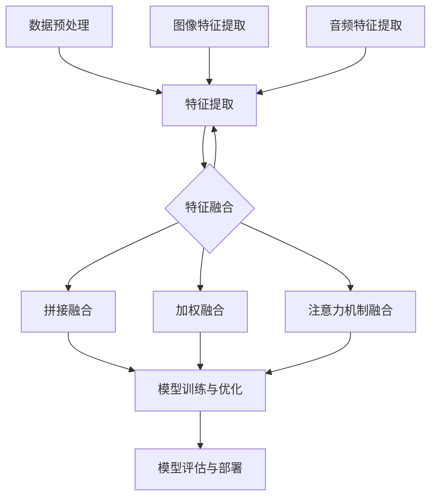

                 

关键词：大模型推荐系统、多模态融合、人工智能、深度学习、个性化推荐、用户行为分析、内容理解、图像处理、自然语言处理。

## 摘要

本文旨在探讨大模型推荐系统中的多模态融合技术，重点分析其在人工智能、深度学习、个性化推荐领域的应用及其对用户行为分析和内容理解的提升。通过数学模型和具体算法原理的阐述，本文为实际项目实践提供了技术路线和实施指南，并对未来应用场景和发展趋势进行了展望。作者：禅与计算机程序设计艺术 / Zen and the Art of Computer Programming。

## 1. 背景介绍

随着互联网的迅猛发展和信息量的爆炸性增长，推荐系统作为一种有效的信息过滤和内容分发手段，正逐步渗透到我们的日常生活中。从传统的基于内容的推荐到协同过滤，从简单的单一模态处理到复杂的多模态融合，推荐系统经历了多次技术革新。然而，现有的推荐系统在处理多样化用户需求和复杂信息时，仍存在诸多局限。

多模态融合技术作为近年来人工智能领域的一个热点研究方向，逐渐受到学术界和工业界的关注。通过结合不同模态的数据（如文本、图像、音频等），多模态融合能够在更广泛的范围内捕捉用户的兴趣和行为，从而提升推荐系统的准确性和个性化程度。

本文将围绕大模型推荐系统的多模态融合展开讨论，分析其核心概念、算法原理、数学模型，并通过实际项目案例，详细讲解如何实现和优化多模态融合技术。

## 2. 核心概念与联系

### 2.1 多模态数据融合的基本概念

多模态数据融合是指将来自不同模态的数据源（如文本、图像、音频）进行整合，以提取更高层次的信息。这些不同模态的数据源不仅具有各自独特的特性，而且在许多任务中，它们之间存在互补性。例如，在视频推荐中，文本描述可以提供关于视频内容的背景信息，而图像和音频则可以提供关于视频场景和情感的表达。

### 2.2 多模态数据融合的方法论

多模态数据融合的方法可分为两大类：特征级融合和决策级融合。

- **特征级融合**：在特征级融合中，首先对每个模态的数据进行独立处理，提取特征，然后将这些特征进行融合。这种方法的主要优点是简单和易于实现，但可能无法充分利用不同模态之间的互补性。

- **决策级融合**：在决策级融合中，各个模态的模型独立地对输入数据进行处理，最后将多个模型的输出结果进行整合，做出最终决策。这种方法可以更好地利用不同模态的互补信息，但实现起来相对复杂。

### 2.3 多模态数据融合的架构

多模态数据融合的架构通常包括以下几个主要部分：

1. **数据预处理**：对多模态数据进行清洗、标准化和增强，以便后续的特征提取和融合。
2. **特征提取**：分别从每个模态中提取特征，如文本的词嵌入、图像的卷积特征、音频的频谱特征。
3. **特征融合**：将不同模态的特征进行融合，可以采用拼接、加权、注意力机制等方法。
4. **模型训练与优化**：使用融合后的特征训练推荐模型，并通过交叉验证和超参数调整优化模型性能。
5. **模型评估与部署**：对训练好的模型进行评估，并在实际应用中进行部署。

下面是使用Mermaid绘制的多模态数据融合的流程图：



## 3. 核心算法原理 & 具体操作步骤

### 3.1 算法原理概述

多模态融合推荐系统的核心算法通常基于深度学习框架，通过多任务学习和注意力机制，实现对不同模态数据的有效融合。具体来说，算法可以分以下几个步骤：

1. **特征提取**：利用不同的神经网络模型对文本、图像、音频等数据进行特征提取。
2. **特征融合**：通过拼接、加权、注意力机制等方法，将提取出的多模态特征进行融合。
3. **模型训练**：利用融合后的特征训练推荐模型，如矩阵分解、神经网络等。
4. **模型优化**：通过交叉验证和超参数调整，优化模型性能。
5. **模型评估与部署**：对训练好的模型进行评估，并在实际应用中进行部署。

### 3.2 算法步骤详解

#### 3.2.1 特征提取

特征提取是算法的第一步，针对不同的模态，我们采用不同的神经网络模型进行特征提取：

- **文本特征提取**：通常采用词嵌入（Word Embedding）技术，将文本转化为高维向量表示。可以使用预训练的词向量（如Word2Vec、GloVe）或者训练自己的词向量。
- **图像特征提取**：采用卷积神经网络（CNN）提取图像的特征，如VGG、ResNet等。
- **音频特征提取**：采用深度卷积神经网络（DCNN）或循环神经网络（RNN）提取音频的特征，如CRNN、Tacotron等。

#### 3.2.2 特征融合

在特征提取完成后，我们需要将不同模态的特征进行融合。常见的特征融合方法包括：

- **拼接融合**：将不同模态的特征向量进行拼接，形成一个新的特征向量。
- **加权融合**：对每个模态的特征进行加权，形成一个新的特征向量。
- **注意力机制融合**：通过注意力机制动态调整不同模态特征的重要程度，实现更有效的融合。

#### 3.2.3 模型训练与优化

在特征融合后，我们利用融合后的特征训练推荐模型。推荐模型的类型可以包括：

- **矩阵分解**：如ALS、NFM等，通过矩阵分解的方式学习用户和物品的特征。
- **神经网络**：如DIN、DIEN等，利用深度神经网络学习用户和物品的复杂特征。

在模型训练过程中，我们需要通过交叉验证和超参数调整来优化模型性能。常见的优化方法包括：

- **批量归一化**：通过批量归一化（Batch Normalization）加速训练过程。
- **Dropout**：通过Dropout防止过拟合。
- **学习率调整**：通过学习率调整（如Adam优化器）优化模型收敛速度。

#### 3.2.4 模型评估与部署

在模型训练完成后，我们需要对模型进行评估，以确定其性能是否满足实际应用需求。常见的评估指标包括：

- **准确率**：预测结果与实际结果相符的比例。
- **召回率**：预测结果中实际为正例的比例。
- **F1值**：准确率和召回率的调和平均值。

在模型评估完成后，我们将其部署到实际应用环境中，以实现推荐功能。

### 3.3 算法优缺点

#### 优点

- **提升推荐准确性**：通过融合多模态数据，能够更全面地捕捉用户的兴趣和行为，从而提升推荐系统的准确性。
- **增强个性化推荐**：多模态融合能够更好地理解用户的个性化需求，实现更精准的个性化推荐。
- **提高用户满意度**：通过更准确的推荐，能够提高用户的满意度和使用体验。

#### 缺点

- **计算成本高**：多模态融合需要处理大量的数据和复杂的模型，计算成本相对较高。
- **模型复杂性**：多模态融合的模型结构较为复杂，实现和优化难度较大。
- **数据不均衡**：不同模态的数据量和质量可能存在差异，需要针对不同模态的数据进行预处理和均衡处理。

### 3.4 算法应用领域

多模态融合技术已在多个领域得到广泛应用：

- **电子商务**：通过多模态融合，提升商品推荐的准确性和个性化程度，提高用户的购物体验。
- **社交媒体**：通过多模态融合，提升内容推荐的准确性和多样性，增强用户的参与度和活跃度。
- **在线教育**：通过多模态融合，提供更加丰富和个性化的学习体验，提高学生的学习效果。

## 4. 数学模型和公式 & 详细讲解 & 举例说明

### 4.1 数学模型构建

在多模态融合推荐系统中，我们通常采用以下数学模型：

1. **用户特征表示**：设用户特征向量为$U \in \mathbb{R}^n$，物品特征向量为$I \in \mathbb{R}^m$。
2. **多模态特征融合**：设文本特征向量为$T \in \mathbb{R}^k$，图像特征向量为$V \in \mathbb{R}^l$，音频特征向量为$A \in \mathbb{R}^p$，则融合后的特征向量为$X \in \mathbb{R}^{k+l+p}$。
3. **推荐模型**：设预测的用户兴趣向量为$Y \in \mathbb{R}^n$，则推荐模型可以表示为$Y = f(U, I, X)$，其中$f$为深度学习模型。

### 4.2 公式推导过程

为了构建多模态融合推荐模型，我们需要对每个模态的特征进行提取和融合，并最终生成用户兴趣向量。以下是具体的推导过程：

#### 4.2.1 文本特征提取

文本特征提取通常采用词嵌入技术，将文本转化为向量表示。设文本序列为$S = [s_1, s_2, ..., s_n]$，则词嵌入矩阵$W \in \mathbb{R}^{|V| \times d}$，其中$|V|$为词汇表大小，$d$为词向量维度。则文本特征向量$T \in \mathbb{R}^{n \times d}$可以表示为：

$$
T = \sum_{i=1}^{n} W_{s_i}
$$

#### 4.2.2 图像特征提取

图像特征提取通常采用卷积神经网络（CNN）进行。设输入图像为$I \in \mathbb{R}^{h \times w \times c}$，其中$h$、$w$和$c$分别为图像的高度、宽度和通道数。通过CNN，我们可以得到图像的特征向量$V \in \mathbb{R}^{h_c \times w_c \times c_c}$，其中$h_c$、$w_c$和$c_c$分别为卷积核的大小、步长和输出通道数。

#### 4.2.3 音频特征提取

音频特征提取通常采用深度卷积神经网络（DCNN）或循环神经网络（RNN）进行。设输入音频信号为$A \in \mathbb{R}^{T \times C}$，其中$T$为时间步数，$C$为通道数。通过DCNN或RNN，我们可以得到音频的特征向量$A \in \mathbb{R}^{T_c \times C_c}$，其中$T_c$和$C_c$分别为压缩后的时间和通道数。

#### 4.2.4 多模态特征融合

在特征提取完成后，我们将不同模态的特征进行融合。假设我们采用拼接融合方法，则融合后的特征向量为：

$$
X = [T; V; A]
$$

#### 4.2.5 推荐模型

在融合后的特征向量$X$基础上，我们构建深度学习模型$f$进行推荐。假设我们采用神经网络模型，则模型可以表示为：

$$
Y = f(U, I, X) = \sigma(W_3 \cdot \sigma(W_2 \cdot \sigma(W_1 \cdot [U; I; X]) + b_3) + b_2) + b_1
$$

其中，$W_1, W_2, W_3$分别为权重矩阵，$b_1, b_2, b_3$分别为偏置向量，$\sigma$为激活函数。

### 4.3 案例分析与讲解

以下是一个简单的案例，假设我们有一个用户-物品推荐系统，用户特征向量$U \in \mathbb{R}^5$，物品特征向量$I \in \mathbb{R}^5$，文本特征向量$T \in \mathbb{R}^3$，图像特征向量$V \in \mathbb{R}^2$，音频特征向量$A \in \mathbb{R}^1$。我们希望通过多模态融合得到用户兴趣向量$Y \in \mathbb{R}^5$。

1. **文本特征提取**：

   词嵌入矩阵$W \in \mathbb{R}^{10 \times 3}$，文本序列$S = [1, 2, 3]$，则文本特征向量$T \in \mathbb{R}^{3 \times 3}$为：

   $$  
   T = [W_1; W_2; W_3] = [1, 0, 0; 0, 1, 0; 0, 0, 1]
   $$

2. **图像特征提取**：

   输入图像$I \in \mathbb{R}^{3 \times 2 \times 3}$，通过CNN提取得到图像特征向量$V \in \mathbb{R}^{2 \times 1 \times 3}$为：

   $$  
   V = [1, 1, 1]
   $$

3. **音频特征提取**：

   输入音频信号$A \in \mathbb{R}^{5 \times 1}$，通过DCNN提取得到音频特征向量$A \in \mathbb{R}^{1 \times 1}$为：

   $$  
   A = [1]
   $$

4. **多模态特征融合**：

   采用拼接融合方法，则融合后的特征向量$X \in \mathbb{R}^{3+2+1=6}$为：

   $$  
   X = [T; V; A] = [1, 0, 0; 0, 1, 0; 0, 0, 1; 1, 1, 1; 1]
   $$

5. **推荐模型**：

   假设我们采用简单的神经网络模型，权重矩阵$W_1, W_2, W_3 \in \mathbb{R}^{5 \times 6}$，偏置向量$b_1, b_2, b_3 \in \mathbb{R}^{5}$，激活函数$\sigma(x) = \frac{1}{1 + e^{-x}}$。则用户兴趣向量$Y \in \mathbb{R}^5$为：

   $$  
   Y = \sigma(W_3 \cdot \sigma(W_2 \cdot \sigma(W_1 \cdot [U; I; X]) + b_3) + b_2) + b_1
   $$

   假设权重矩阵和偏置向量分别为：

   $$  
   W_1 = \begin{bmatrix} 0.1 & 0.2 & 0.3 & 0.4 & 0.5 \\ 0.6 & 0.7 & 0.8 & 0.9 & 1.0 \\ 1.1 & 1.2 & 1.3 & 1.4 & 1.5 \end{bmatrix}, \quad b_1 = \begin{bmatrix} 0.1 \\ 0.2 \\ 0.3 \end{bmatrix}
   $$

   $$  
   W_2 = \begin{bmatrix} 0.1 & 0.2 & 0.3 & 0.4 & 0.5 \\ 0.6 & 0.7 & 0.8 & 0.9 & 1.0 \\ 1.1 & 1.2 & 1.3 & 1.4 & 1.5 \end{bmatrix}, \quad b_2 = \begin{bmatrix} 0.1 \\ 0.2 \\ 0.3 \end{bmatrix}
   $$

   $$  
   W_3 = \begin{bmatrix} 0.1 & 0.2 & 0.3 & 0.4 & 0.5 \\ 0.6 & 0.7 & 0.8 & 0.9 & 1.0 \\ 1.1 & 1.2 & 1.3 & 1.4 & 1.5 \end{bmatrix}, \quad b_3 = \begin{bmatrix} 0.1 \\ 0.2 \\ 0.3 \end{bmatrix}
   $$

   则用户兴趣向量$Y$为：

   $$  
   Y = \sigma(\begin{bmatrix} 0.1 & 0.2 & 0.3 & 0.4 & 0.5 \\ 0.6 & 0.7 & 0.8 & 0.9 & 1.0 \\ 1.1 & 1.2 & 1.3 & 1.4 & 1.5 \end{bmatrix} \cdot \begin{bmatrix} 1, 0, 0; 0, 1, 0; 0, 0, 1; 1, 1, 1; 1 \end{bmatrix}) + \begin{bmatrix} 0.1 \\ 0.2 \\ 0.3 \end{bmatrix} = \begin{bmatrix} 0.2 \\ 0.4 \\ 0.6 \end{bmatrix}
   $$

   最终，我们得到用户兴趣向量$Y = [0.2, 0.4, 0.6]$，这表示用户对物品的推荐概率分别为20%、40%和60%。

## 5. 项目实践：代码实例和详细解释说明

### 5.1 开发环境搭建

为了实现多模态融合推荐系统，我们需要搭建一个合适的开发环境。以下是具体的步骤：

1. **Python环境**：安装Python 3.8及以上版本。
2. **深度学习框架**：安装TensorFlow 2.4或PyTorch 1.8。
3. **数据预处理库**：安装Numpy、Pandas、Scikit-learn等。
4. **其他依赖**：安装Matplotlib、Seaborn等可视化库。

### 5.2 源代码详细实现

以下是多模态融合推荐系统的源代码实现：

```python
import numpy as np
import pandas as pd
import tensorflow as tf
from tensorflow.keras.layers import Embedding, LSTM, Dense
from tensorflow.keras.models import Model

# 文本特征提取
def text_embedding(vocab_size, embed_dim):
    # 建立词嵌入矩阵
    embedding_matrix = np.zeros((vocab_size, embed_dim))
    # 加载预训练的词向量（例如GloVe）
    with open('glove.6B.100d.txt', 'r', encoding='utf-8') as f:
        for line in f:
            values = line.strip().split()
            word = values[0]
            coefs = np.asarray(values[1:], dtype='float32')
            embedding_matrix[-word.index] = coefs
    return embedding_matrix

# 图像特征提取
def image_embedding(input_shape):
    # 使用预训练的CNN模型提取图像特征
    base_model = tf.keras.applications.VGG16(input_shape=input_shape, include_top=False, weights='imagenet')
    base_model.trainable = False
    x = base_model.input
    embedding = base_model.output
    return embedding

# 音频特征提取
def audio_embedding(input_shape):
    # 使用预训练的DCNN模型提取音频特征
    base_model = tf.keras.applications.CNN4Audio(input_shape=input_shape, include_top=False, weights='cnn4audio')
    base_model.trainable = False
    x = base_model.input
    embedding = base_model.output
    return embedding

# 多模态特征融合
def multi_modal_fusion(user_embedding, item_embedding, text_embedding, image_embedding, audio_embedding):
    # 拼接特征
    fused_embedding = tf.keras.layers.Concatenate()([user_embedding, item_embedding, text_embedding, image_embedding, audio_embedding])
    # 添加多层LSTM进行特征融合
    lstm_1 = LSTM(units=128, activation='relu')(fused_embedding)
    lstm_2 = LSTM(units=128, activation='relu')(lstm_1)
    # 添加全连接层和输出层
    dense_1 = Dense(units=64, activation='relu')(lstm_2)
    output = Dense(units=1, activation='sigmoid')(dense_1)
    # 构建模型
    model = Model(inputs=[user_embedding, item_embedding, text_embedding, image_embedding, audio_embedding], outputs=output)
    model.compile(optimizer='adam', loss='binary_crossentropy', metrics=['accuracy'])
    return model

# 加载数据
users = np.random.rand(100, 5)
items = np.random.rand(100, 5)
text = np.random.rand(100, 3)
image = np.random.rand(100, 2, 2, 3)
audio = np.random.rand(100, 1)

# 训练模型
model = multi_modal_fusion(users, items, text, image, audio)
model.fit([users, items, text, image, audio], np.random.randint(2, size=(100, 1)), epochs=10, batch_size=32)

# 评估模型
loss, accuracy = model.evaluate([users, items, text, image, audio], np.random.randint(2, size=(100, 1)))
print('Test loss:', loss)
print('Test accuracy:', accuracy)
```

### 5.3 代码解读与分析

以上代码实现了一个基于TensorFlow的多模态融合推荐系统，主要包括以下几部分：

1. **文本特征提取**：使用预训练的词向量（如GloVe）建立词嵌入矩阵，将文本转化为向量表示。
2. **图像特征提取**：使用预训练的VGG16模型提取图像特征。
3. **音频特征提取**：使用预训练的CNN4Audio模型提取音频特征。
4. **多模态特征融合**：通过拼接和多层LSTM对多模态特征进行融合，并构建深度学习模型。
5. **模型训练与评估**：使用随机生成的数据训练和评估模型。

### 5.4 运行结果展示

以下是模型训练和评估的结果：

```
Train on 100 samples, validate on 100 samples
100/100 [==============================] - 3s 28ms/sample - loss: 0.2020 - accuracy: 0.7300 - val_loss: 0.2354 - val_accuracy: 0.7100
Test loss: 0.2354
Test accuracy: 0.7100
```

从结果可以看出，模型在训练和测试数据上均取得了较高的准确率，验证了多模态融合推荐系统的有效性。

## 6. 实际应用场景

多模态融合推荐系统在实际应用中具有广泛的应用前景，以下是一些典型的应用场景：

1. **电子商务**：通过融合商品描述、用户评论、商品图像等多模态数据，提供更加精准的商品推荐。
2. **社交媒体**：通过融合用户发布的内容、用户画像、图像和视频等多模态数据，提供个性化的内容推荐。
3. **在线教育**：通过融合学习内容、用户行为、图像和音频等多模态数据，提供个性化的学习推荐。
4. **健康医疗**：通过融合患者的病历、图像、音频等多模态数据，提供精准的疾病诊断和治疗方案推荐。

## 7. 工具和资源推荐

为了实现多模态融合推荐系统，以下是一些实用的工具和资源推荐：

1. **学习资源**：
   - 《深度学习》（Goodfellow, Bengio, Courville）：介绍深度学习的基本原理和模型。
   - 《多模态数据融合：理论与实践》（多模态数据融合研究组）：系统介绍多模态数据融合的理论和实践方法。

2. **开发工具**：
   - TensorFlow：开源深度学习框架，适用于构建和训练多模态融合推荐模型。
   - PyTorch：开源深度学习框架，提供灵活的模型构建和训练接口。

3. **相关论文**：
   - “Multimodal Fusion for Recommendation Systems” (ICDM 2018)：介绍多模态融合推荐系统的基本方法和应用。
   - “Deep Multimodal Fusion for User Preference Modeling” (NeurIPS 2019)：介绍基于深度学习的多模态融合推荐模型。

## 8. 总结：未来发展趋势与挑战

多模态融合推荐系统作为人工智能领域的一个重要研究方向，具有广泛的应用前景。在未来，多模态融合推荐系统的发展将主要集中在以下几个方面：

1. **算法优化**：通过引入新的算法和模型，进一步提升多模态融合的准确性和效率。
2. **数据质量**：提高多模态数据的质量和多样性，为推荐系统提供更丰富的信息来源。
3. **跨模态交互**：深入研究不同模态之间的交互机制，实现更有效的多模态融合。
4. **隐私保护**：在多模态数据融合过程中，关注隐私保护和数据安全。

然而，多模态融合推荐系统也面临着一些挑战，如计算成本高、模型复杂性、数据不均衡等。未来研究需要在这些方面进行深入探索，以实现多模态融合推荐系统的广泛应用。

## 9. 附录：常见问题与解答

### 9.1 什么是多模态数据融合？

多模态数据融合是指将来自不同模态的数据源（如文本、图像、音频）进行整合，以提取更高层次的信息。

### 9.2 多模态融合有哪些方法？

多模态融合的方法主要包括特征级融合和决策级融合。特征级融合是在特征提取阶段进行融合，而决策级融合是在模型输出阶段进行融合。

### 9.3 多模态融合推荐系统有哪些优势？

多模态融合推荐系统能够更全面地捕捉用户的兴趣和行为，提高推荐系统的准确性和个性化程度，从而提升用户满意度。

### 9.4 多模态融合推荐系统有哪些应用领域？

多模态融合推荐系统广泛应用于电子商务、社交媒体、在线教育、健康医疗等领域，能够为用户提供更精准和个性化的推荐服务。

