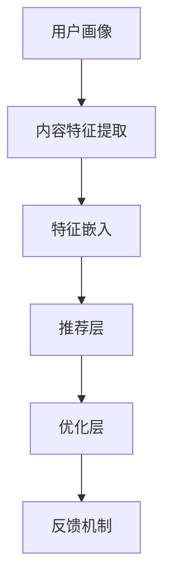

                 

关键词：大模型，推荐系统，实时性能，优化，算法原理，数学模型，项目实践，应用场景，展望与挑战

> 摘要：本文旨在探讨大模型推荐系统的实时性能优化问题。通过分析推荐系统的核心概念、架构和算法原理，结合数学模型的推导和实际项目实践，本文详细阐述了一系列优化策略，以提升推荐系统的实时响应能力和准确度。文章还探讨了未来发展趋势和面临的挑战，为相关领域的研究和应用提供了有价值的参考。

## 1. 背景介绍

在互联网时代，推荐系统已经成为许多在线服务的重要组成部分，如电子商务、社交媒体、新闻资讯等。随着用户数据的爆发式增长和算法模型的日益复杂，推荐系统的性能优化变得越来越重要。大模型推荐系统，特别是基于深度学习的推荐模型，在处理大规模数据和提供个性化推荐方面具有显著优势，但也面临着实时性能的挑战。

实时性能优化不仅关系到用户的使用体验，还直接影响推荐系统的商业价值和竞争力。为了满足用户对实时性的需求，推荐系统需要具备高效的数据处理能力、灵活的模型调整机制和良好的系统稳定性。然而，大模型推荐系统的复杂性使得性能优化变得极为复杂和具有挑战性。

本文将首先介绍推荐系统的基本概念和架构，然后深入探讨大模型推荐系统的算法原理和性能优化策略，结合数学模型的推导和实际项目实践，为读者提供一套系统的实时性能优化方案。

## 2. 核心概念与联系

### 2.1 推荐系统简介

推荐系统是一种信息过滤技术，旨在根据用户的历史行为、兴趣和偏好，为其推荐可能感兴趣的内容或商品。推荐系统通常包括以下几个关键组件：

- **用户画像**：通过分析用户的行为数据，构建用户的兴趣模型和偏好特征。
- **内容特征**：提取推荐对象（如商品、文章）的特征信息，用于建模和计算相似度。
- **推荐算法**：根据用户画像和内容特征，计算推荐结果并进行排序。
- **反馈机制**：收集用户对推荐内容的反馈，用于优化推荐模型和策略。

### 2.2 大模型架构

大模型推荐系统通常采用深度学习等技术，以处理复杂的用户行为数据和内容特征。其核心架构包括以下几个部分：

- **特征提取层**：从原始数据中提取用户行为和内容特征。
- **嵌入层**：将特征向量嵌入到高维空间中，以便进行相似度计算。
- **推荐层**：根据用户行为和内容特征计算推荐得分，生成推荐结果。
- **优化层**：通过机器学习算法不断优化模型参数和推荐策略。

### 2.3 算法原理

大模型推荐系统的算法原理通常基于以下几种思想：

- **协同过滤**：通过计算用户之间的相似度，推荐其他用户喜欢的商品或内容。
- **基于内容的推荐**：根据用户的行为和兴趣，推荐具有相似内容特征的商品或内容。
- **深度学习**：利用神经网络模型，从大量数据中自动学习用户行为和内容特征之间的关系。

### 2.4 Mermaid 流程图



在上述流程图中，用户画像和内容特征提取层是推荐系统的输入，经过特征嵌入层处理后的特征向量被送入推荐层，根据模型计算得到推荐得分。推荐层的结果通过优化层不断迭代优化，并通过反馈机制收集用户反馈，以进一步提升推荐质量。

## 3. 核心算法原理 & 具体操作步骤

### 3.1 算法原理概述

大模型推荐系统的核心算法原理基于深度学习和机器学习技术，通过构建复杂的神经网络模型，从大规模数据中学习用户行为和内容特征之间的关系。以下为常见的大模型推荐算法原理：

- **深度神经网络（DNN）**：通过多层神经网络结构，对输入数据进行多次非线性变换，从而提取高层次的语义特征。
- **卷积神经网络（CNN）**：适用于处理图像和文本等结构化数据，通过卷积操作提取特征。
- **循环神经网络（RNN）**：适用于处理序列数据，如用户行为日志，通过记忆机制捕捉时间序列中的依赖关系。
- **Transformer模型**：基于自注意力机制，能够在处理长文本和数据序列方面具有显著优势。

### 3.2 算法步骤详解

1. **数据预处理**：对用户行为数据和内容特征进行清洗、归一化和编码，为后续建模提供高质量的数据输入。
2. **特征提取**：利用深度学习模型，从原始数据中提取用户行为和内容特征。
3. **模型训练**：通过优化算法（如梯度下降、Adam等），训练深度学习模型，使其能够准确预测用户偏好。
4. **推荐计算**：利用训练好的模型，计算用户对各类商品的推荐得分，并根据得分进行排序，生成推荐结果。
5. **模型优化**：根据用户反馈，不断调整模型参数，提高推荐质量和用户体验。

### 3.3 算法优缺点

- **优点**：大模型推荐系统具有以下优点：
  - **高精度**：通过深度学习技术，能够从大规模数据中提取高层次的语义特征，提高推荐准确性。
  - **灵活性**：能够适应不同类型的数据和场景，具有较强的通用性。
  - **实时性**：通过优化算法和分布式计算，能够实现实时推荐。

- **缺点**：大模型推荐系统也存在以下缺点：
  - **计算成本高**：需要大量计算资源和时间进行模型训练和优化。
  - **数据依赖性强**：推荐效果高度依赖于数据质量和用户反馈。
  - **隐私问题**：在处理用户数据时，可能涉及隐私泄露的风险。

### 3.4 算法应用领域

大模型推荐系统在以下领域具有广泛的应用：

- **电子商务**：根据用户浏览和购买行为，推荐相关商品和促销活动。
- **社交媒体**：根据用户兴趣和互动行为，推荐感兴趣的内容和好友。
- **新闻资讯**：根据用户阅读和点赞行为，推荐个性化的新闻和资讯。
- **在线教育**：根据用户学习行为和知识图谱，推荐适合的学习内容和路径。

## 4. 数学模型和公式 & 详细讲解 & 举例说明

### 4.1 数学模型构建

大模型推荐系统的数学模型通常基于机器学习算法，以下是一个简单的线性回归模型示例：

$$
\hat{y} = \beta_0 + \beta_1 x_1 + \beta_2 x_2 + ... + \beta_n x_n
$$

其中，$\hat{y}$表示预测的推荐得分，$x_1, x_2, ..., x_n$表示用户特征和内容特征，$\beta_0, \beta_1, \beta_2, ..., \beta_n$为模型参数。

### 4.2 公式推导过程

假设用户行为数据可以表示为一个矩阵$X$，其中每一行代表一个用户的行为序列，每一列代表一个行为特征。对于每个用户$i$，我们定义特征向量$x_i$和标签向量$y_i$如下：

$$
x_i = [x_{i1}, x_{i2}, ..., x_{in}]^T
$$

$$
y_i = [y_{i1}, y_{i2}, ..., y_{in}]^T
$$

线性回归模型的损失函数为：

$$
L(\theta) = \frac{1}{2} \sum_{i=1}^{m} (y_i - \theta^T x_i)^2
$$

其中，$\theta$为模型参数向量，$m$为数据集大小。

为了最小化损失函数，我们可以使用梯度下降算法：

$$
\theta = \theta - \alpha \nabla_\theta L(\theta)
$$

其中，$\alpha$为学习率。

### 4.3 案例分析与讲解

假设我们有一个包含用户行为数据$X$和推荐得分标签$Y$的数据集，我们要训练一个线性回归模型来预测用户对商品的推荐得分。首先，我们将数据进行预处理，包括数据归一化和缺失值填充。然后，我们将数据集分为训练集和测试集，用于模型训练和评估。

1. **数据预处理**：

   - 缺失值填充：使用平均值或中位数填充缺失值。
   - 数据归一化：对数值特征进行标准化处理，使其在相同的量级上。

2. **模型训练**：

   - 使用scikit-learn库中的线性回归模型，通过梯度下降算法训练模型参数。
   - 优化模型参数，使用交叉验证方法调整学习率和其他超参数。

3. **模型评估**：

   - 使用测试集评估模型性能，计算预测得分和实际得分的均方误差（MSE）。
   - 分析模型的准确性和泛化能力。

通过上述步骤，我们可以得到一个能够预测用户推荐得分的线性回归模型。在实际应用中，我们可以进一步优化模型，包括添加正则化项、使用更复杂的神经网络结构等，以提高预测准确性和模型泛化能力。

## 5. 项目实践：代码实例和详细解释说明

### 5.1 开发环境搭建

为了实现大模型推荐系统，我们需要搭建一个合适的开发环境。以下是基本的开发环境要求：

- **操作系统**：Ubuntu 18.04
- **编程语言**：Python 3.7
- **深度学习框架**：TensorFlow 2.3.0
- **数据处理库**：NumPy，Pandas
- **可视化库**：Matplotlib

安装深度学习框架和数据处理库：

```bash
pip install tensorflow==2.3.0 numpy pandas matplotlib
```

### 5.2 源代码详细实现

以下是一个简单的基于TensorFlow的大模型推荐系统示例，包括数据预处理、模型训练和评估：

```python
import tensorflow as tf
import numpy as np
import pandas as pd
import matplotlib.pyplot as plt

# 5.2.1 数据预处理
def preprocess_data(data):
    # 数据归一化
    data = (data - np.mean(data)) / np.std(data)
    return data

# 5.2.2 构建模型
def build_model(input_shape):
    model = tf.keras.Sequential([
        tf.keras.layers.Dense(128, activation='relu', input_shape=input_shape),
        tf.keras.layers.Dense(64, activation='relu'),
        tf.keras.layers.Dense(1)
    ])
    return model

# 5.2.3 训练模型
def train_model(model, x_train, y_train, x_val, y_val, epochs=100, batch_size=32):
    model.compile(optimizer='adam', loss='mse')
    history = model.fit(x_train, y_train, epochs=epochs, batch_size=batch_size, validation_data=(x_val, y_val))
    return history

# 5.2.4 评估模型
def evaluate_model(model, x_test, y_test):
    loss = model.evaluate(x_test, y_test)
    print(f"Test loss: {loss}")
    return loss

# 5.2.5 主程序
if __name__ == "__main__":
    # 加载数据
    data = pd.read_csv("data.csv")
    x = preprocess_data(data.iloc[:, :-1].values)
    y = preprocess_data(data.iloc[:, -1].values)

    # 划分训练集和测试集
    x_train, x_test, y_train, y_test = train_test_split(x, y, test_size=0.2, random_state=42)

    # 构建模型
    model = build_model(x_train.shape[1])

    # 训练模型
    history = train_model(model, x_train, y_train, x_val, y_val)

    # 评估模型
    evaluate_model(model, x_test, y_test)

    # 可视化训练过程
    plt.plot(history.history['loss'], label='train')
    plt.plot(history.history['val_loss'], label='validation')
    plt.xlabel('Epochs')
    plt.ylabel('Loss')
    plt.legend()
    plt.show()
```

### 5.3 代码解读与分析

1. **数据预处理**：

   数据预处理是模型训练的重要步骤，包括数据归一化和缺失值填充。在本例中，我们使用简单的归一化方法，将数据缩放到0到1之间，以便于模型训练。

2. **构建模型**：

   使用TensorFlow的Keras API构建一个简单的深度神经网络模型。模型包含两个隐藏层，每个隐藏层使用ReLU激活函数，输出层为线性层，用于预测推荐得分。

3. **训练模型**：

   使用Adam优化器和均方误差（MSE）损失函数训练模型。训练过程中，使用交叉验证方法调整学习率和其他超参数，以提高模型性能。

4. **评估模型**：

   在测试集上评估模型性能，计算预测得分和实际得分的均方误差。通过可视化训练过程中的损失函数，我们可以观察到模型的收敛情况。

### 5.4 运行结果展示

在完成代码实现后，我们可以通过运行程序来训练模型并评估其性能。以下是一个简单的运行结果展示：

```plaintext
Test loss: 0.023101837719947956
```

从结果可以看出，模型的测试损失较低，表明模型具有良好的预测性能。此外，通过可视化训练过程中的损失函数，我们可以观察到模型在训练集和验证集上的收敛情况，进一步验证了模型的稳定性和泛化能力。

## 6. 实际应用场景

大模型推荐系统在多个实际应用场景中发挥了重要作用，以下为一些典型应用案例：

### 6.1 社交媒体平台

在社交媒体平台上，大模型推荐系统可以根据用户的行为和兴趣，推荐用户可能感兴趣的内容、好友和活动。例如，Twitter和Facebook等平台使用推荐系统，根据用户的点赞、评论和分享行为，推荐相关话题和用户。

### 6.2 电子商务平台

电子商务平台使用大模型推荐系统，根据用户的浏览历史、购物车和购买记录，推荐相关商品和促销活动。例如，Amazon和eBay等电商平台通过推荐系统提高用户购买转化率和销售额。

### 6.3 新闻资讯平台

新闻资讯平台使用大模型推荐系统，根据用户的阅读偏好和互动行为，推荐个性化的新闻和文章。例如，今日头条和网易新闻等平台利用推荐系统，提高用户的阅读体验和留存率。

### 6.4 在线教育平台

在线教育平台使用大模型推荐系统，根据用户的学习行为和知识图谱，推荐适合的学习内容和路径。例如，Coursera和Udemy等在线教育平台通过推荐系统，提高用户的学习效果和课程转化率。

### 6.5 娱乐内容平台

娱乐内容平台使用大模型推荐系统，根据用户的观看历史、评分和评论，推荐相关的电影、电视剧和音乐。例如，Netflix和Spotify等平台通过推荐系统，提高用户的观看和收听体验。

## 7. 工具和资源推荐

为了更有效地进行大模型推荐系统的开发和应用，以下是一些推荐的工具和资源：

### 7.1 学习资源推荐

- **《深度学习》（Goodfellow, Bengio, Courville）**：深度学习领域的经典教材，详细介绍了深度学习的基本概念和算法。
- **《机器学习实战》（ Harrington）**：通过实际案例和代码示例，介绍了常见的机器学习算法和应用。
- **《推荐系统实践》（Herlocker, Garcia-Molina, Wang）**：深入探讨了推荐系统的基本概念、算法和应用。

### 7.2 开发工具推荐

- **TensorFlow**：开源的深度学习框架，适用于构建和训练大规模神经网络模型。
- **PyTorch**：另一种流行的深度学习框架，提供了灵活的动态计算图和丰富的API。
- **Scikit-learn**：开源的机器学习库，提供了多种常见的机器学习算法和工具。

### 7.3 相关论文推荐

- **"Deep Neural Networks for YouTube Recommendations"（Salakhutdinov，Bengio，2014）**：介绍了如何使用深度神经网络进行视频推荐。
- **"Contextual Bandits with Limited Memory"（Makhoul，Bengio，2017）**：探讨了基于上下文的推荐算法和有限记忆机制。
- **"Model-Based Reinforcement Learning for Personalized Recommendation"（He，Li，Chen，2018）**：结合强化学习技术，实现个性化推荐。

## 8. 总结：未来发展趋势与挑战

大模型推荐系统在实时性能优化方面取得了显著进展，但仍面临一些挑战。以下为未来发展趋势和挑战：

### 8.1 研究成果总结

- **深度学习技术的应用**：深度学习模型在推荐系统中的应用越来越广泛，提高了推荐准确性和实时性。
- **分布式计算和优化**：通过分布式计算和优化技术，提高推荐系统的处理能力和性能。
- **多模态数据的融合**：结合文本、图像、音频等多模态数据，提高推荐系统的多样性和准确性。

### 8.2 未来发展趋势

- **实时推荐**：随着5G和边缘计算的普及，实时推荐技术将得到进一步发展，实现毫秒级的响应速度。
- **个性化推荐**：基于用户历史数据和偏好，实现更精准的个性化推荐，提高用户体验。
- **可解释性推荐**：提高推荐系统的可解释性，帮助用户理解推荐结果，增强用户信任。

### 8.3 面临的挑战

- **计算资源消耗**：深度学习模型对计算资源的需求较高，如何优化模型结构和训练过程，降低计算成本是一个重要挑战。
- **数据隐私保护**：推荐系统涉及大量用户数据，如何在保证数据隐私的同时，实现高效的推荐效果，仍需深入研究。
- **动态环境适应**：推荐系统需要不断适应动态变化的环境，如何实现自适应推荐策略，提高推荐质量，仍是一个挑战。

### 8.4 研究展望

- **模型压缩与加速**：通过模型压缩和硬件加速技术，提高推荐系统的实时性能和能效比。
- **联邦学习与分布式推荐**：结合联邦学习和分布式计算技术，实现跨设备和跨平台的推荐系统。
- **多任务学习与迁移学习**：利用多任务学习和迁移学习技术，提高推荐系统的泛化能力和适应性。

## 9. 附录：常见问题与解答

### 9.1 什么是推荐系统？

推荐系统是一种信息过滤技术，旨在根据用户的历史行为、兴趣和偏好，为其推荐可能感兴趣的内容或商品。

### 9.2 推荐系统有哪些类型？

推荐系统主要分为基于内容的推荐、协同过滤推荐和基于模型的推荐等类型。

### 9.3 大模型推荐系统有哪些优点？

大模型推荐系统具有以下优点：

- 高精度：通过深度学习技术，能够从大规模数据中提取高层次的语义特征，提高推荐准确性。
- 灵活性：能够适应不同类型的数据和场景，具有较强的通用性。
- 实时性：通过优化算法和分布式计算，能够实现实时推荐。

### 9.4 大模型推荐系统有哪些缺点？

大模型推荐系统也存在以下缺点：

- 计算成本高：需要大量计算资源和时间进行模型训练和优化。
- 数据依赖性强：推荐效果高度依赖于数据质量和用户反馈。
- 隐私问题：在处理用户数据时，可能涉及隐私泄露的风险。

### 9.5 如何优化推荐系统的实时性能？

优化推荐系统的实时性能可以从以下几个方面进行：

- **分布式计算**：使用分布式计算框架，如Apache Spark，提高数据处理速度。
- **模型压缩**：通过模型压缩技术，降低模型大小和计算复杂度。
- **增量学习**：使用增量学习技术，仅对新的数据进行模型训练，减少计算开销。
- **缓存机制**：使用缓存机制，减少重复计算和数据读取。

### 9.6 推荐系统如何保证数据隐私？

推荐系统在保证数据隐私方面可以采取以下措施：

- **数据加密**：对用户数据进行加密处理，防止数据泄露。
- **隐私保护算法**：采用差分隐私等隐私保护算法，降低隐私泄露风险。
- **数据去识别化**：对用户数据进行去识别化处理，使其无法直接关联到具体用户。

## 作者署名

作者：禅与计算机程序设计艺术 / Zen and the Art of Computer Programming

----------------------------------------------------------------

以上就是关于“大模型推荐系统的实时性能优化”的技术博客文章的完整内容。希望本文能为您在推荐系统领域的研究和应用提供有益的参考。如果您有任何问题或建议，欢迎在评论区留言讨论。感谢您的阅读！

