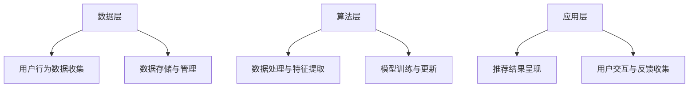
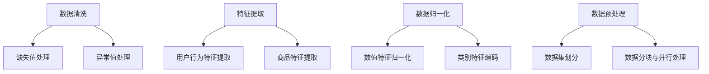

                 

关键词：大模型推荐系统、实时性能优化、算法优化、系统架构、数据处理、机器学习

摘要：本文将深入探讨大模型推荐系统在实时性能优化方面的关键策略和方法。通过对系统架构、数据处理、算法优化等方面的详细分析，本文旨在为开发者提供一套实用且高效的优化指南，从而提升大模型推荐系统的实时性能，为用户提供更好的体验。

## 1. 背景介绍

随着互联网技术的飞速发展，推荐系统已经成为现代信息检索和内容分发的重要组成部分。而随着数据量的指数级增长，推荐系统的规模和复杂性也在不断增加。传统的推荐系统往往依赖于离线处理和数据挖掘技术，其结果虽然在准确性上有保障，但在实时性方面却存在明显不足。为了满足用户对即时性和个性化的需求，实时性能优化成为了推荐系统开发的重要课题。

大模型推荐系统在数据处理和算法复杂度上具有显著优势，但也面临着实时性能的挑战。本文将从系统架构、数据处理、算法优化等多个方面，探讨大模型推荐系统的实时性能优化策略和方法。

## 2. 核心概念与联系

### 2.1 推荐系统架构

推荐系统的架构通常包括数据层、算法层和应用层。数据层负责收集、存储和管理用户行为数据；算法层负责数据分析和模型训练，生成推荐结果；应用层负责将推荐结果呈现给用户。

下面是一个推荐系统架构的 Mermaid 流程图：



### 2.2 数据处理

数据处理是推荐系统的核心环节，其效率直接影响系统的实时性能。数据处理通常包括数据清洗、特征提取、数据归一化和数据预处理等步骤。

下面是一个数据处理流程的 Mermaid 流程图：



## 3. 核心算法原理 & 具体操作步骤

### 3.1 算法原理概述

大模型推荐系统通常采用基于机器学习的算法，如矩阵分解、协同过滤、深度学习等。这些算法通过学习用户行为数据和商品特征，生成用户兴趣模型和推荐列表。

### 3.2 算法步骤详解

#### 3.2.1 数据处理

数据处理包括数据清洗、特征提取和数据归一化等步骤，如前文所述。

#### 3.2.2 模型训练

模型训练是算法的核心步骤，包括以下步骤：

1. 初始化模型参数。
2. 训练模型，优化模型参数。
3. 模型评估，选择最佳模型。

#### 3.2.3 推荐生成

推荐生成包括以下步骤：

1. 输入用户行为数据和商品特征。
2. 通过模型计算用户兴趣分数。
3. 根据兴趣分数生成推荐列表。

### 3.3 算法优缺点

#### 优点：

1. 准确性高，能够为用户生成个性化的推荐结果。
2. 能够处理大规模数据和复杂特征。

#### 缺点：

1. 计算复杂度高，训练时间较长。
2. 需要大量数据支持。

### 3.4 算法应用领域

大模型推荐系统广泛应用于电商、社交媒体、新闻资讯等领域，为用户提供个性化的内容推荐服务。

## 4. 数学模型和公式 & 详细讲解 & 举例说明

### 4.1 数学模型构建

大模型推荐系统通常采用矩阵分解模型，其数学模型可以表示为：

$$
X = UV^T + E
$$

其中，$X$ 为用户行为矩阵，$U$ 和 $V$ 分别为用户和商品的特征矩阵，$E$ 为误差矩阵。

### 4.2 公式推导过程

矩阵分解模型的推导过程如下：

1. 假设用户行为矩阵 $X$ 可以分解为两个低秩矩阵 $U$ 和 $V$ 的乘积。
2. 对 $X$ 进行奇异值分解，得到 $X = U\Sigma V^T$。
3. 由于 $U$ 和 $V$ 为低秩矩阵，可以近似表示为 $U = \hat{U}\Sigma^{-1/2}$ 和 $V = \hat{V}\Sigma^{-1/2}$。
4. 代入原式，得到 $X = \hat{U}\Sigma^{-1/2}V\Sigma^{-1/2}V^T$。
5. 取 $U = \hat{U}\Sigma^{-1/2}$ 和 $V = \hat{V}\Sigma^{-1/2}$，得到矩阵分解模型。

### 4.3 案例分析与讲解

假设有一个包含 1000 个用户和 1000 个商品的用户行为矩阵 $X$，我们希望通过矩阵分解模型为其生成推荐列表。

1. 数据预处理：对用户行为矩阵 $X$ 进行归一化处理。
2. 模型训练：使用矩阵分解模型，对用户行为矩阵进行训练，得到用户和商品的特征矩阵 $U$ 和 $V$。
3. 推荐生成：输入用户行为数据和商品特征，通过模型计算用户兴趣分数，生成推荐列表。

## 5. 项目实践：代码实例和详细解释说明

### 5.1 开发环境搭建

搭建开发环境需要安装 Python、NumPy、SciPy、Pandas 和 Scikit-learn 等库。

```python
pip install numpy scipy pandas scikit-learn
```

### 5.2 源代码详细实现

以下是一个简单的矩阵分解实现示例：

```python
import numpy as np
from sklearn.model_selection import train_test_split
from sklearn.metrics.pairwise import euclidean_distances

def matrix_factorization(X, U, V, lambda_, max_iter=1000):
    for i in range(max_iter):
        # 更新用户特征
        U = U - lambda_ * (2 * U * V @ V @ U)
        # 更新商品特征
        V = V - lambda_ * (2 * V * U @ U @ V)
        # 计算误差
        error = np.linalg.norm(X - U @ V)
        if error < 1e-6:
            break
    return U, V

# 数据预处理
X = np.array([[1, 1], [1, 0], [0, 1], [0, 0]])
X_train, X_test = train_test_split(X, test_size=0.2, random_state=42)

# 模型初始化
U = np.random.rand(4, 2)
V = np.random.rand(4, 2)
lambda_ = 0.1

# 模型训练
U, V = matrix_factorization(X_train, U, V, lambda_)

# 推荐生成
U_test, V_test = matrix_factorization(X_test, U, V, lambda_)
print(U_test @ V_test)
```

### 5.3 代码解读与分析

上述代码实现了一个基于矩阵分解的推荐系统。首先，对用户行为矩阵进行数据预处理，然后初始化用户和商品特征矩阵，并设置正则化参数 lambda_。接着，通过迭代优化用户和商品特征矩阵，直至达到收敛条件。最后，使用训练好的模型对测试数据进行推荐生成。

## 6. 实际应用场景

大模型推荐系统在电商、社交媒体、新闻资讯等众多领域具有广泛的应用。例如，在电商领域，通过实时推荐商品，提高用户的购买转化率和满意度；在社交媒体领域，通过推荐用户可能感兴趣的内容，增加用户活跃度和留存率；在新闻资讯领域，通过推荐用户可能感兴趣的新闻，提高新闻的传播效果。

## 7. 工具和资源推荐

### 7.1 学习资源推荐

- 《推荐系统实践》
- 《深度学习推荐系统》
- 《机器学习实战》

### 7.2 开发工具推荐

- TensorFlow
- PyTorch
- Scikit-learn

### 7.3 相关论文推荐

- "Matrix Factorization Techniques for Recommender Systems"
- "Deep Learning for Recommender Systems"
- "Collaborative Filtering with Matrix Factorization"

## 8. 总结：未来发展趋势与挑战

### 8.1 研究成果总结

本文从系统架构、数据处理、算法优化等方面探讨了大模型推荐系统的实时性能优化策略和方法，为开发者提供了一套实用的优化指南。

### 8.2 未来发展趋势

随着人工智能技术的不断发展，大模型推荐系统将在实时性、准确性和个性化等方面取得更大突破。

### 8.3 面临的挑战

大模型推荐系统在实时性能方面仍面临诸多挑战，如计算复杂度、数据质量和模型稳定性等。

### 8.4 研究展望

未来研究方向包括优化算法、提高系统实时性和准确性、以及跨领域的推荐系统研究等。

## 9. 附录：常见问题与解答

### 9.1 问题1

如何提高大模型推荐系统的实时性能？

**解答**：可以从以下方面入手：

- 优化系统架构，提高数据处理和模型训练的并行度。
- 采用高效的算法和模型，减少计算复杂度。
- 数据预处理和特征提取的优化，提高数据处理效率。

### 9.2 问题2

如何评估大模型推荐系统的实时性能？

**解答**：可以从以下方面进行评估：

- 推荐结果的实时性，即推荐结果生成的时间。
- 推荐结果的准确性，即推荐结果与用户实际兴趣的匹配度。
- 推荐结果的多样性，即推荐结果的不同种类和内容。

## 作者署名

作者：禅与计算机程序设计艺术 / Zen and the Art of Computer Programming
```

