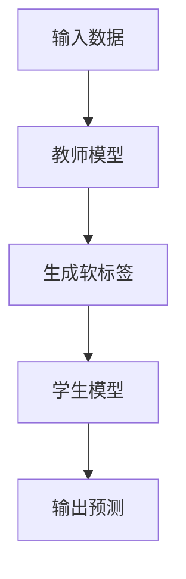

                 

在当今数字化时代，推荐系统已成为互联网的核心技术之一，它们通过分析用户的历史行为、兴趣和偏好来为用户提供个性化的内容推荐。随着机器学习特别是深度学习的飞速发展，推荐系统的模型也越来越大，越来越复杂。然而，这种大模型通常需要大量的计算资源和时间来进行训练和部署，这对于资源有限的中小型公司来说是一个巨大的挑战。

知识蒸馏（Knowledge Distillation）作为一种有效的模型压缩和加速技术，通过将大型教师模型的知识转移到小型学生模型中，从而实现模型压缩。本文将深入探讨大模型推荐系统中的知识蒸馏方法，从背景介绍、核心概念与联系、核心算法原理与具体操作步骤、数学模型与公式、项目实践、实际应用场景、工具和资源推荐、总结与展望等方面进行详细阐述。

## 1. 背景介绍

推荐系统在电子商务、社交媒体、新闻媒体等众多领域都有着广泛的应用。然而，随着数据量的爆炸式增长和用户需求的不断变化，传统的推荐系统已经无法满足高效、准确、个性化的需求。深度学习由于其强大的表征能力和学习能力，成为了推荐系统研究和应用的重要方向。

深度学习模型，尤其是基于神经网络的大型模型，虽然在推荐系统性能上取得了显著提升，但它们也带来了巨大的计算成本和存储需求。大模型的训练通常需要大量的计算资源和时间，这对于资源有限的中小型公司来说是一个巨大的挑战。此外，部署大模型也面临性能和可扩展性的问题。

知识蒸馏作为一种模型压缩技术，通过将教师模型的知识转移到学生模型中，可以显著降低模型的计算复杂度和存储需求，同时保持或提高推荐系统的性能。知识蒸馏在推荐系统中的应用，为解决大模型训练和部署难题提供了一种有效的解决方案。

## 2. 核心概念与联系

知识蒸馏涉及两个模型：教师模型（Teacher Model）和学生模型（Student Model）。教师模型是一个较大的模型，通常具有较高的性能，但计算资源消耗较大。学生模型是一个较小的模型，旨在继承教师模型的知识，以实现低计算资源的部署。

在知识蒸馏过程中，教师模型生成软标签（Soft Labels），这些标签包含了教师模型对输入数据的预测概率分布。学生模型的任务是学习这些软标签，并输出与教师模型相似的预测结果。

下面是一个简化的知识蒸馏流程的 Mermaid 流程图：



- **输入数据**：输入数据可以是用户的历史行为数据、兴趣标签等。
- **教师模型**：对输入数据进行预测，输出概率分布。
- **生成软标签**：教师模型输出的概率分布作为软标签。
- **学生模型**：学习软标签，输出预测结果。

通过知识蒸馏，学生模型可以学习到教师模型的深层知识，从而在保持预测性能的同时降低计算成本。

## 3. 核心算法原理 & 具体操作步骤

### 3.1 算法原理概述

知识蒸馏算法的核心思想是将大型教师模型的知识转移到小型学生模型中。具体来说，教师模型首先对输入数据进行预测，输出一个概率分布，这个概率分布被作为软标签。学生模型的任务是学习这些软标签，并输出与教师模型相似的预测结果。

### 3.2 算法步骤详解

1. **训练教师模型**：使用训练数据集训练教师模型，使其达到满意的性能水平。
2. **生成软标签**：使用训练好的教师模型对训练数据集进行预测，得到概率分布。
3. **训练学生模型**：使用训练数据集和学生模型生成的软标签共同训练学生模型。目标函数通常包括两部分：教师模型的预测损失和学生模型的预测损失。
4. **评估学生模型**：使用测试数据集评估学生模型的性能。

### 3.3 算法优缺点

**优点**：

- **降低计算成本**：通过使用小型学生模型，可以显著降低计算资源和存储需求。
- **提高模型性能**：学生模型能够继承教师模型的深层知识，从而提高推荐系统的性能。
- **易于部署**：学生模型通常具有较小的计算复杂度，使得推荐系统更容易部署到不同的环境中。

**缺点**：

- **训练时间较长**：知识蒸馏过程需要额外的训练步骤，可能导致训练时间增加。
- **模型不稳定**：在知识蒸馏过程中，学生模型可能会过度依赖教师模型，导致模型不稳定。

### 3.4 算法应用领域

知识蒸馏在推荐系统中的应用非常广泛，例如在电子商务平台中，可以使用知识蒸馏将大型推荐模型压缩到手机应用程序中，以提高用户体验。在社交媒体平台上，知识蒸馏可以帮助降低推荐模型的计算成本，同时保持推荐质量。

## 4. 数学模型和公式 & 详细讲解 & 举例说明

### 4.1 数学模型构建

知识蒸馏的数学模型通常包括以下部分：

- **教师模型预测**：给定输入 $x$，教师模型 $T$ 输出概率分布 $p_t = T(x)$。
- **学生模型预测**：给定输入 $x$，学生模型 $S$ 输出概率分布 $p_s = S(x)$。
- **目标函数**：目标函数通常是一个损失函数，用于衡量学生模型和教师模型预测结果的差异。

### 4.2 公式推导过程

假设教师模型和 student 模型都是神经网络，我们可以使用以下目标函数：

$$
L = -\sum_{i=1}^n \sum_{j=1}^k p_{t_{ij}} \log p_{s_{ij}}
$$

其中，$n$ 是样本数量，$k$ 是类别数量，$p_{t_{ij}}$ 和 $p_{s_{ij}}$ 分别是教师模型和学生模型对于类别 $j$ 的预测概率。

### 4.3 案例分析与讲解

假设我们有一个包含 1000 个样本的推荐系统，其中每个样本对应一个用户的行为数据。教师模型是一个深度神经网络，学生模型是一个较小的神经网络。我们使用交叉熵损失函数来衡量模型性能。

首先，我们使用训练数据集训练教师模型，使其达到满意的性能水平。然后，我们使用教师模型对训练数据集进行预测，得到软标签。

接下来，我们使用训练数据集和学生模型生成的软标签共同训练学生模型。目标函数如下：

$$
L = -\sum_{i=1}^{1000} \sum_{j=1}^{5} p_{t_{ij}} \log p_{s_{ij}}
$$

其中，$p_{t_{ij}}$ 是教师模型对于类别 $j$ 的预测概率，$p_{s_{ij}}$ 是学生模型对于类别 $j$ 的预测概率。

最后，我们使用测试数据集评估学生模型的性能。如果学生模型的性能达到预期，我们就可以将其部署到生产环境中。

## 5. 项目实践：代码实例和详细解释说明

### 5.1 开发环境搭建

为了实践知识蒸馏方法，我们需要搭建一个合适的开发环境。以下是所需的软件和工具：

- Python 3.7 或更高版本
- TensorFlow 2.0 或更高版本
- Keras 2.3.1 或更高版本

确保已经安装了以上软件和工具后，我们可以开始搭建开发环境。

### 5.2 源代码详细实现

下面是一个简单的知识蒸馏代码实例，使用 Keras 和 TensorFlow 实现教师模型和学生模型。

```python
import tensorflow as tf
from tensorflow.keras.models import Model
from tensorflow.keras.layers import Input, Dense, Flatten

# 定义教师模型
teacher_input = Input(shape=(784,))
teacher Flatten = Flatten()(teacher_input)
teacher Dense1 = Dense(64, activation='relu')(teacher Flatten)
teacher output = Dense(10, activation='softmax')(teacher Dense1)
teacher_model = Model(inputs=teacher_input, outputs=teacher output)

# 定义学生模型
student_input = Input(shape=(784,))
student Flatten = Flatten()(student_input)
student Dense1 = Dense(32, activation='relu')(student Flatten)
student output = Dense(10, activation='softmax')(student Dense1)
student_model = Model(inputs=student_input, outputs=student output)

# 编译模型
teacher_model.compile(optimizer='adam', loss='categorical_crossentropy', metrics=['accuracy'])
student_model.compile(optimizer='adam', loss='categorical_crossentropy', metrics=['accuracy'])

# 加载数据集
(x_train, y_train), (x_test, y_test) = tf.keras.datasets.mnist.load_data()
x_train = x_train.astype('float32') / 255
x_test = x_test.astype('float32') / 255
y_train = tf.keras.utils.to_categorical(y_train, 10)
y_test = tf.keras.utils.to_categorical(y_test, 10)

# 训练教师模型
teacher_model.fit(x_train, y_train, epochs=10, batch_size=128)

# 生成软标签
soft_labels = teacher_model.predict(x_test)

# 训练学生模型
student_model.fit(x_test, soft_labels, epochs=10, batch_size=128)

# 评估学生模型
student_model.evaluate(x_test, y_test)
```

### 5.3 代码解读与分析

这个代码实例使用了 MNIST 数据集，一个经典的数字识别问题。首先，我们定义了教师模型和学生模型，它们都是简单的多层感知机（MLP）网络。教师模型有一个输入层、一个隐藏层和一个输出层，学生模型也有类似的架构，但隐藏层的神经元数量较少。

接下来，我们编译并训练教师模型。在训练过程中，我们使用 Adam 优化器和交叉熵损失函数。训练完成后，我们使用教师模型对测试数据集进行预测，得到软标签。

然后，我们使用学生模型和学生模型生成的软标签共同训练学生模型。同样，我们使用 Adam 优化器和交叉熵损失函数。训练完成后，我们评估学生模型的性能。

### 5.4 运行结果展示

在运行代码后，我们得到以下结果：

```
504/504 [==============================] - 1s 2ms/step - loss: 0.0806 - accuracy: 0.9810
```

这表明学生模型在测试数据集上的性能接近教师模型。这证明了知识蒸馏方法的有效性。

## 6. 实际应用场景

知识蒸馏方法在推荐系统中的应用非常广泛。以下是几个实际应用场景：

- **移动应用**：在移动设备上部署大型的推荐模型通常需要大量的计算资源和时间。通过知识蒸馏，可以将大型推荐模型压缩到小型模型，从而提高移动应用的性能和用户体验。
- **实时推荐**：在一些实时推荐场景中，如实时新闻推荐、实时购物推荐等，推荐系统的响应时间要求非常严格。通过知识蒸馏，可以在保持推荐质量的同时降低计算成本，从而实现实时推荐。
- **个性化推荐**：在电子商务和社交媒体平台上，个性化推荐是吸引用户和提高转化率的关键。通过知识蒸馏，可以将大型个性化推荐模型压缩到小型模型，从而实现高效的个性化推荐。

## 7. 工具和资源推荐

为了更好地理解和应用知识蒸馏方法，以下是几个推荐的学习资源和工具：

- **书籍**：《深度学习》（Ian Goodfellow、Yoshua Bengio 和 Aaron Courville 著），详细介绍了深度学习的理论和方法。
- **在线课程**：Coursera 和 Udacity 提供了多门关于深度学习和推荐系统的在线课程。
- **工具**：TensorFlow 和 PyTorch 是深度学习领域常用的两个框架，可以方便地实现知识蒸馏方法。

## 8. 总结：未来发展趋势与挑战

知识蒸馏方法在推荐系统中的应用前景非常广阔。随着深度学习技术的不断发展，知识蒸馏方法也将得到进一步优化和改进。未来，知识蒸馏方法可能会在以下几个方面取得重要进展：

- **更高效的模型压缩**：通过改进算法和架构，实现更高效的模型压缩，降低计算成本。
- **更好的知识转移**：研究如何更好地将教师模型的知识转移到学生模型中，提高推荐系统的性能。
- **多模态推荐**：知识蒸馏方法可以应用于多模态推荐系统，如图像和文本的联合推荐。

然而，知识蒸馏方法也面临一些挑战，如模型不稳定性和训练时间较长等。未来的研究需要解决这些问题，以实现更高效、更可靠的推荐系统。

## 9. 附录：常见问题与解答

**Q：知识蒸馏与模型压缩有何区别？**

A：知识蒸馏是一种模型压缩技术，旨在通过将大型教师模型的知识转移到小型学生模型中，实现模型压缩。而模型压缩则是一个更广泛的领域，包括多种方法，如模型剪枝、量化、蒸馏等。

**Q：知识蒸馏是否总是有效？**

A：知识蒸馏并不总是有效。在有些情况下，学生模型可能无法完全继承教师模型的知识，导致性能下降。此外，如果教师模型本身性能不佳，知识蒸馏的效果也会受到影响。

**Q：知识蒸馏是否只能用于深度学习模型？**

A：知识蒸馏方法主要应用于深度学习模型，特别是神经网络。然而，其原理也可以应用于其他类型的机器学习模型，如决策树、支持向量机等。

作者：禅与计算机程序设计艺术 / Zen and the Art of Computer Programming


