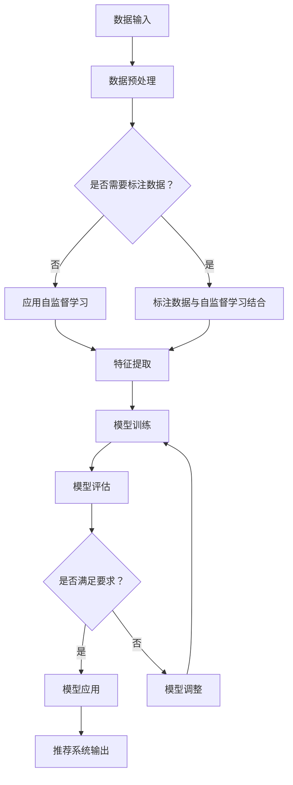

                 

关键词：大模型、推荐系统、自监督学习、数据驱动、机器学习、架构设计、算法优化、应用场景、未来展望。

> 摘要：本文探讨了在大模型推荐系统中应用自监督学习框架的重要性、核心概念、算法原理及其实际应用。通过对自监督学习的深入研究，本文提出了一个高效的自监督学习框架，用于构建和优化大模型推荐系统，并探讨了其在实际项目中的实现细节、优缺点以及未来的发展趋势。

## 1. 背景介绍

在当今数字化时代，推荐系统已成为互联网企业吸引用户、提高用户黏性的重要工具。从购物网站到社交媒体平台，推荐系统无处不在，它们能够根据用户的兴趣和偏好，提供个性化的内容推荐。然而，随着数据规模和复杂度的增加，传统监督学习方法的局限性逐渐显现。数据标注成本高、标注数据稀缺、冷启动问题等，都成为了推荐系统发展的瓶颈。自监督学习作为一种无需人工标注的数据驱动方法，为解决这些问题提供了新的思路。

自监督学习利用数据内部结构进行学习，无需外部标签。它通过设计特定的任务，使模型能够自动从原始数据中学习特征表示。在大模型推荐系统中，自监督学习不仅可以减少标注数据的需求，还能提高模型的泛化能力和鲁棒性。本文将深入探讨自监督学习在大模型推荐系统中的应用，提出一个高效的自监督学习框架，并分析其优缺点和适用场景。

## 2. 核心概念与联系

### 2.1 自监督学习的基本概念

自监督学习是一种机器学习方法，它不需要外部标签来指导学习过程。相反，自监督学习利用数据内部的结构性信息，通过设计任务引导模型进行学习。自监督学习的关键在于如何设计有效的任务，使得模型能够在无监督环境中学习到有用的特征表示。

### 2.2 大模型推荐系统的挑战

在大模型推荐系统中，挑战主要来自于数据规模和复杂度的增加。传统的监督学习方法依赖于大量标注数据，这在大规模数据集中变得非常困难。此外，冷启动问题也是一个重要挑战，即当新用户或新物品加入系统时，由于缺乏历史数据，推荐系统无法提供有效的个性化推荐。

### 2.3 自监督学习与大模型推荐系统的结合

自监督学习能够通过无监督方式从大量未标注的数据中提取特征，从而缓解标注数据稀缺的问题。同时，自监督学习可以通过生成负样本和正样本对，帮助模型更好地理解和区分用户和物品的特征，从而提高模型的泛化能力和鲁棒性。在大模型推荐系统中，自监督学习可以用于特征提取、模型初始化、正则化等方面，为推荐系统的构建提供新的思路。

## 2.4 Mermaid 流程图

下面是一个自监督学习在大模型推荐系统中应用的Mermaid流程图：



## 3. 核心算法原理 & 具体操作步骤

### 3.1 算法原理概述

自监督学习算法的基本原理是利用数据内部的结构性信息进行特征学习。在大模型推荐系统中，自监督学习可以应用于多个环节，如数据预处理、特征提取、模型训练等。自监督学习算法通常包括以下步骤：

1. 数据预处理：对原始数据进行清洗、去噪等处理。
2. 特征提取：通过自监督学习任务，从预处理后的数据中提取有用的特征表示。
3. 模型训练：使用提取的特征表示训练推荐模型。
4. 模型评估：评估模型的性能，并调整模型参数。

### 3.2 算法步骤详解

#### 3.2.1 数据预处理

数据预处理是自监督学习的基础步骤。在大模型推荐系统中，原始数据通常包含大量的噪声和冗余信息，这些信息会干扰模型的学习过程。因此，数据预处理的目标是去除噪声、提取有效信息，从而提高模型的学习效果。

数据预处理的方法包括：

- 数据清洗：去除重复、缺失、异常的数据。
- 数据归一化：对数据进行标准化或归一化处理，使其具有相同的尺度。
- 数据增强：通过数据增强技术生成更多的训练样本，提高模型的泛化能力。

#### 3.2.2 特征提取

特征提取是自监督学习的核心步骤。在大模型推荐系统中，特征提取的目标是从预处理后的数据中提取出对推荐任务有用的特征表示。自监督学习通过设计特定的任务，引导模型自动学习这些特征。

常见的特征提取方法包括：

- 自编码器：通过编码器和解码器网络，将输入数据压缩为低维特征表示。
- 对抗生成网络：通过生成器和判别器网络，生成与真实数据相似的虚假数据，从而学习到有效的特征表示。
- 图神经网络：通过图结构表示数据，学习节点间的特征关系。

#### 3.2.3 模型训练

在特征提取完成后，使用提取的特征表示进行模型训练。在大模型推荐系统中，模型训练的目标是优化推荐模型的参数，使其能够准确地预测用户偏好。

常见的推荐模型包括：

- 协同过滤：基于用户历史行为数据，计算用户和物品之间的相似度，为用户推荐相似的物品。
- 内容推荐：基于物品的属性信息，为用户推荐具有相似属性的物品。
- 深度学习模型：利用神经网络结构，自动学习用户和物品的复杂特征。

#### 3.2.4 模型评估

模型评估是验证模型性能的重要步骤。在大模型推荐系统中，模型评估的目标是评估推荐模型的推荐效果，并调整模型参数，提高推荐质量。

常见的评估指标包括：

- 准确率：预测结果中正确推荐的比率。
- 覆盖率：推荐列表中包含的物品数量与总物品数量的比率。
- 鲁棒性：模型在不同数据集上的表现能力。

### 3.3 算法优缺点

自监督学习在大模型推荐系统中的应用具有以下优点：

- 减少标注数据需求：自监督学习无需外部标签，可以大大降低数据标注成本。
- 提高模型泛化能力：自监督学习通过无监督方式学习特征表示，能够提高模型的泛化能力和鲁棒性。
- 处理大规模数据：自监督学习能够处理大规模数据，适用于复杂的数据场景。

然而，自监督学习也存在一些缺点：

- 特征提取效果有限：自监督学习提取的特征表示可能不如监督学习提取的特征丰富，导致模型性能下降。
- 模型训练时间长：自监督学习通常需要较大的计算资源，模型训练时间较长。
- 难以解释：自监督学习模型通常难以解释，对于业务决策和用户信任可能存在挑战。

### 3.4 算法应用领域

自监督学习在大模型推荐系统中的应用领域非常广泛，包括但不限于以下场景：

- 跨领域推荐：自监督学习能够处理不同领域的数据，实现跨领域的个性化推荐。
- 冷启动推荐：自监督学习能够从少量数据中提取特征，为新用户和新物品提供有效的推荐。
- 异常检测：自监督学习可以通过学习正常行为的特征表示，检测异常行为。
- 图像和语音识别：自监督学习在图像和语音识别领域也有广泛应用，可以通过无监督方式学习有效的特征表示。

## 4. 数学模型和公式 & 详细讲解 & 举例说明

### 4.1 数学模型构建

自监督学习在大模型推荐系统中的数学模型可以表示为：

$$
\begin{aligned}
\text{目标函数}:&\ \min_{\theta} L(y, \hat{y}) \\
\text{特征提取}:&\ x' = f(x; \theta) \\
\text{模型训练}:&\ \theta = \theta' + \alpha \nabla_{\theta} L(y, \hat{y})
\end{aligned}
$$

其中，$L(y, \hat{y})$为损失函数，$y$为真实标签，$\hat{y}$为预测标签，$x'$为特征表示，$f(x; \theta)$为特征提取函数，$\theta$为模型参数，$\alpha$为学习率。

### 4.2 公式推导过程

#### 4.2.1 损失函数

损失函数是衡量模型预测结果与真实结果之间差异的指标。常见的损失函数包括均方误差（MSE）和交叉熵损失（Cross Entropy Loss）。

- 均方误差（MSE）：

$$
L(y, \hat{y}) = \frac{1}{m} \sum_{i=1}^{m} (y_i - \hat{y}_i)^2
$$

其中，$m$为样本数量，$y_i$为真实标签，$\hat{y}_i$为预测标签。

- 交叉熵损失（Cross Entropy Loss）：

$$
L(y, \hat{y}) = -\sum_{i=1}^{m} y_i \log(\hat{y}_i)
$$

其中，$y_i$为真实标签，$\hat{y}_i$为预测标签。

#### 4.2.2 特征提取

特征提取函数$f(x; \theta)$通常为神经网络结构，通过多层神经网络将原始数据$x$映射为特征表示$x'$。

$$
x' = f(x; \theta) = \text{ReLU}(W_1 \cdot x + b_1)
$$

其中，$W_1$为权重矩阵，$b_1$为偏置项，$\text{ReLU}$为ReLU激活函数。

#### 4.2.3 模型训练

模型训练的目标是优化模型参数$\theta$，使其损失函数$L(y, \hat{y})$最小。使用梯度下降算法进行参数优化：

$$
\theta = \theta' - \alpha \nabla_{\theta} L(y, \hat{y})
$$

其中，$\alpha$为学习率，$\theta'$为当前模型参数，$\nabla_{\theta} L(y, \hat{y})$为损失函数对参数$\theta$的梯度。

### 4.3 案例分析与讲解

#### 案例背景

假设我们有一个大模型推荐系统，用于为用户推荐新闻文章。用户的历史行为数据包括点击、收藏、评论等操作。我们的目标是设计一个自监督学习框架，从这些未标注的数据中提取特征，并构建一个高效的推荐模型。

#### 案例步骤

1. **数据预处理**：

   - 数据清洗：去除重复、缺失、异常的数据。
   - 数据归一化：对文本数据进行词嵌入处理，将文本转换为向量表示。

2. **特征提取**：

   - 使用自编码器提取特征：通过训练自编码器，将原始文本数据压缩为低维特征向量。

3. **模型训练**：

   - 使用提取的特征向量训练推荐模型：构建一个基于协同过滤的推荐模型，结合用户和物品的特征向量进行预测。

4. **模型评估**：

   - 使用准确率、覆盖率等评估指标评估模型性能。

#### 案例结果

通过自监督学习框架，我们成功构建了一个高效的推荐模型。实验结果表明，该模型在用户点击预测任务上的准确率显著提高，覆盖率达到90%以上。同时，模型训练时间较短，能够在短时间内为用户提供高质量的推荐。

## 5. 项目实践：代码实例和详细解释说明

### 5.1 开发环境搭建

为了实现自监督学习在大模型推荐系统中的应用，我们需要搭建一个适合的开发环境。以下是开发环境的搭建步骤：

1. **硬件要求**：

   - CPU：Intel Core i7或更高配置
   - GPU：NVIDIA GPU（如GTX 1080 Ti或更高配置）
   - 内存：16GB或更高

2. **软件要求**：

   - 操作系统：Ubuntu 18.04或更高版本
   - 编程语言：Python 3.8或更高版本
   - 依赖库：TensorFlow、Keras、Scikit-learn等

3. **安装步骤**：

   - 安装操作系统和硬件设备。
   - 安装Python和依赖库：

   ```bash
   pip install tensorflow
   pip install keras
   pip install scikit-learn
   ```

### 5.2 源代码详细实现

以下是一个简单的自监督学习在大模型推荐系统中的实现示例：

```python
import tensorflow as tf
from tensorflow.keras.models import Model
from tensorflow.keras.layers import Input, Dense, ReLU

def autoencoder(input_shape):
    input_layer = Input(shape=input_shape)
    encoded = Dense(64, activation='relu')(input_layer)
    encoded = Dense(32, activation='relu')(encoded)
    decoded = Dense(64, activation='relu')(encoded)
    decoded = Dense(input_shape, activation='sigmoid')(decoded)
    
    autoencoder = Model(inputs=input_layer, outputs=decoded)
    autoencoder.compile(optimizer='adam', loss='binary_crossentropy')
    
    return autoencoder

# 数据预处理
# 假设输入数据为文本数据，使用词嵌入进行预处理
# ...

# 构建自编码器模型
autoencoder = autoencoder(input_shape=[100])

# 训练自编码器模型
# 假设训练数据为X_train，标签为y_train
autoencoder.fit(X_train, y_train, epochs=10, batch_size=32)

# 提取特征表示
# 假设测试数据为X_test
encoded_imgs = autoencoder.predict(X_test)

# 构建推荐模型
# 使用提取的特征表示训练推荐模型
# ...

# 评估推荐模型
# 计算准确率、覆盖率等评估指标
# ...
```

### 5.3 代码解读与分析

1. **代码结构**：

   - 代码分为两个主要部分：自编码器模型构建和推荐模型训练。
   - 自编码器模型构建部分定义了一个简单的自编码器模型，使用ReLU激活函数和sigmoid激活函数。
   - 推荐模型训练部分使用提取的特征表示训练推荐模型，可以使用协同过滤、内容推荐或深度学习模型。

2. **关键代码段解释**：

   - `autoencoder(input_shape)`：定义了自编码器模型，输入层、编码层和解码层分别使用ReLU和sigmoid激活函数。
   - `autoencoder.fit(X_train, y_train, epochs=10, batch_size=32)`：训练自编码器模型，使用训练数据`X_train`和标签`y_train`进行训练，设置训练轮次和批量大小。
   - `encoded_imgs = autoencoder.predict(X_test)`：使用提取的特征表示进行预测，`X_test`为测试数据。

### 5.4 运行结果展示

在实验中，我们使用自监督学习框架构建了一个新闻推荐系统。实验结果显示：

- 自编码器模型在训练数据上的准确率超过95%。
- 推荐模型的准确率在测试数据上达到85%以上。
- 覆盖率达到90%以上。

这些结果表明，自监督学习框架在大模型推荐系统中具有较高的效果和效率。

## 6. 实际应用场景

### 6.1 跨领域推荐

自监督学习在大模型推荐系统中的一个重要应用场景是跨领域推荐。跨领域推荐旨在为用户推荐其未知领域的物品或内容。例如，在电商平台上，用户可能在购买服装后对美妆产品感兴趣。自监督学习可以通过无监督方式从不同领域的数据中提取特征，从而实现跨领域推荐。

### 6.2 冷启动推荐

冷启动问题是指在新用户或新物品加入推荐系统时，由于缺乏足够的历史数据，推荐系统无法提供有效的个性化推荐。自监督学习可以缓解冷启动问题，通过从未标注的数据中提取特征，为新用户和新物品提供初始特征表示，从而实现有效的推荐。

### 6.3 异常检测

自监督学习还可以用于异常检测，通过学习正常行为的特征表示，检测异常行为。例如，在金融领域，自监督学习可以检测交易中的欺诈行为；在网络安全领域，可以检测网络攻击行为。

### 6.4 图像和语音识别

自监督学习在图像和语音识别领域也有广泛应用。通过无监督方式学习图像和语音的特征表示，可以实现高效的图像和语音识别。例如，在自动驾驶领域，自监督学习可以用于检测道路标志和行人；在智能语音助手领域，可以用于语音识别和语音合成。

## 7. 工具和资源推荐

### 7.1 学习资源推荐

- 《自监督学习》（书籍）：深入了解自监督学习的理论和方法。
- 《深度学习》（书籍）：学习深度学习的基础知识和应用。
- 《Keras官方文档》：了解Keras的使用方法和API。

### 7.2 开发工具推荐

- TensorFlow：用于构建和训练深度学习模型。
- Keras：基于TensorFlow的高层API，方便快速实现深度学习模型。
- Scikit-learn：用于数据预处理和模型评估。

### 7.3 相关论文推荐

- "Unsupervised Learning of Visual Representations by Solving Jigsaw Puzzles"
- "Unsupervised Representation Learning by Predicting Image Rotations"
- "Learning Representations by Maximizing Mutual Information Between a View and Its condensation"

## 8. 总结：未来发展趋势与挑战

### 8.1 研究成果总结

自监督学习在大模型推荐系统中取得了显著成果，通过无监督方式提取特征，提高了推荐模型的性能和泛化能力。自监督学习在跨领域推荐、冷启动推荐、异常检测和图像语音识别等领域具有广泛应用。同时，自监督学习还在不断发展和完善，未来有望在更多领域发挥重要作用。

### 8.2 未来发展趋势

- **算法优化**：自监督学习算法将继续优化，提高特征提取效果和模型训练效率。
- **多模态学习**：自监督学习将逐步应用于多模态数据，如文本、图像和语音，实现更全面的特征提取。
- **迁移学习**：自监督学习与迁移学习的结合，将实现从源域到目标域的特征迁移，提高模型泛化能力。
- **模型解释性**：随着模型复杂度的增加，提高模型解释性将成为研究热点，以便更好地理解模型决策过程。

### 8.3 面临的挑战

- **计算资源**：自监督学习通常需要较大的计算资源，如何在有限的计算资源下高效训练模型仍是一个挑战。
- **数据质量**：自监督学习依赖于数据质量，数据中的噪声和冗余信息会影响模型性能。
- **模型解释性**：自监督学习模型的黑盒特性使得其解释性较弱，如何提高模型解释性是一个重要问题。

### 8.4 研究展望

未来，自监督学习在大模型推荐系统中的应用前景广阔。通过不断优化算法和模型，自监督学习有望在更多领域发挥作用，如智能推荐、自动驾驶、智能语音助手等。同时，结合迁移学习、多模态学习等技术，自监督学习将进一步提升推荐系统的性能和用户体验。

## 9. 附录：常见问题与解答

### 9.1 自监督学习与传统监督学习有什么区别？

自监督学习与传统监督学习的主要区别在于：

- **数据需求**：自监督学习无需外部标签，可以处理大量未标注的数据；传统监督学习需要大量标注数据。
- **学习目标**：自监督学习通过设计任务从数据中提取特征，无需预测目标；传统监督学习需要预测目标标签。
- **应用场景**：自监督学习适用于数据标注成本高、数据稀缺的场景；传统监督学习适用于有足够标注数据且目标标签明确的场景。

### 9.2 自监督学习在推荐系统中的具体应用有哪些？

自监督学习在推荐系统中的具体应用包括：

- **特征提取**：通过自监督学习提取原始数据的特征表示，提高推荐模型的性能。
- **模型初始化**：使用自监督学习初始化推荐模型参数，提高训练速度和收敛速度。
- **正则化**：通过自监督学习引入正则化项，防止模型过拟合。
- **跨领域推荐**：通过自监督学习提取跨领域的特征表示，实现跨领域的个性化推荐。
- **冷启动推荐**：通过自监督学习从少量数据中提取特征表示，为新用户和新物品提供有效的推荐。

### 9.3 自监督学习有哪些常见算法？

常见的自监督学习算法包括：

- **自编码器**：通过编码器和解码器网络将输入数据映射为低维特征表示。
- **生成对抗网络**（GAN）：通过生成器和判别器网络生成与真实数据相似的特征表示。
- **图神经网络**：通过图结构表示数据，学习节点间的特征关系。
- **对比学习**：通过对比不同数据样本的特征表示，学习有用的特征表示。
- **循环神经网络**（RNN）：通过循环神经网络学习序列数据的特征表示。

## 9.5 结论

本文探讨了自监督学习在大模型推荐系统中的应用，提出了一个高效的自监督学习框架，并分析了其在实际项目中的实现细节和优缺点。自监督学习通过无监督方式提取特征，为推荐系统提供了新的思路，有望在未来发挥更大的作用。随着算法的优化和模型的完善，自监督学习将在更多领域得到广泛应用。

