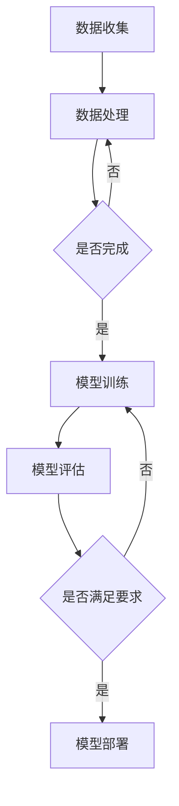

                 

关键词：大模型推荐系统、计算效率、优化策略、算法改进、分布式计算、并行处理、资源调度

> 摘要：本文针对大模型推荐系统的计算效率问题，从算法原理、数学模型、项目实践等多个角度深入探讨优化策略。通过引入分布式计算、并行处理和资源调度等技术手段，提出一系列有效提升计算效率的方法，以期为相关领域的研究和实际应用提供有益参考。

## 1. 背景介绍

随着互联网技术的飞速发展，推荐系统已成为各行业不可或缺的重要组成部分。从电子商务到社交媒体，从内容分发到个性化教育，推荐系统无处不在。然而，随着用户数据规模的不断增长，传统推荐系统的计算效率逐渐成为瓶颈。特别是在大模型推荐系统中，计算复杂度和资源消耗问题尤为突出。

大模型推荐系统通常采用深度学习算法，如图神经网络（Graph Neural Networks，GNN）和变压器（Transformer）等。这些算法在处理大规模数据时，面临着计算密集、存储占用大、通信开销高等问题。为了应对这些挑战，提高计算效率成为当前研究的热点。

## 2. 核心概念与联系

在探讨大模型推荐系统的计算效率优化之前，我们需要了解一些核心概念和它们之间的联系。

### 2.1 计算复杂度

计算复杂度是衡量算法效率的重要指标。对于大模型推荐系统，主要涉及以下几种计算复杂度：

- **时间复杂度**：算法运行时间与输入规模的关系，通常用大O符号表示。
- **空间复杂度**：算法所需存储空间与输入规模的关系，同样用大O符号表示。

### 2.2 分布式计算

分布式计算是将计算任务分布在多台计算机上，通过并行处理提高计算效率。在大模型推荐系统中，分布式计算可以有效减少单机资源的压力，提高整体性能。

### 2.3 并行处理

并行处理是指在多个处理单元上同时执行多个任务，以加快计算速度。在大模型推荐系统中，并行处理可以充分利用多核CPU和GPU等硬件资源，提高计算效率。

### 2.4 资源调度

资源调度是协调和管理计算资源的过程，包括计算节点、存储节点和网络资源等。合理的资源调度可以提高资源利用率，降低计算延迟。

### 2.5 Mermaid 流程图

以下是一个用于描述大模型推荐系统计算流程的 Mermaid 流程图：



## 3. 核心算法原理 & 具体操作步骤

### 3.1 算法原理概述

在大模型推荐系统中，核心算法通常基于深度学习。以下简要介绍两种常用的深度学习算法：图神经网络（GNN）和变压器（Transformer）。

- **GNN**：GNN是一种用于图数据的深度学习算法，通过学习节点和边之间的非线性关系，实现对图数据的表示和分类。GNN的主要优点是可以有效地捕捉图结构中的局部和全局信息。
- **Transformer**：Transformer是一种基于自注意力机制的深度学习算法，广泛应用于自然语言处理、图像识别等领域。Transformer通过多头注意力机制，可以捕捉输入数据之间的长距离依赖关系。

### 3.2 算法步骤详解

以 GNN 和 Transformer 为例，详细描述大模型推荐系统的算法步骤：

1. **数据预处理**：对原始数据进行清洗、预处理，包括数据去重、缺失值填充、数据规范化等操作。
2. **图构建**：将用户行为数据转换为图结构，包括用户节点、物品节点和边关系。
3. **模型训练**：使用 GNN 或 Transformer 算法对图数据进行训练，得到推荐模型。
4. **模型评估**：使用评估指标（如准确率、召回率、F1 值等）对模型进行评估。
5. **模型部署**：将训练好的模型部署到线上环境，实现实时推荐。

### 3.3 算法优缺点

- **GNN**：
  - 优点：能够有效地捕捉图结构中的局部和全局信息，适用于推荐系统中的图数据。
  - 缺点：计算复杂度高，对存储资源要求较高。
- **Transformer**：
  - 优点：能够捕捉长距离依赖关系，计算效率较高。
  - 缺点：对稀疏数据效果较差，需要大量的训练数据。

### 3.4 算法应用领域

GNN 和 Transformer 在推荐系统中的应用非常广泛，例如：

- **电子商务推荐**：利用用户购买历史和商品信息构建图结构，实现个性化商品推荐。
- **社交媒体推荐**：利用用户关系和网络信息，实现社交圈推荐、好友推荐等。
- **内容分发推荐**：利用用户浏览历史和内容标签，实现个性化内容推荐。

## 4. 数学模型和公式 & 详细讲解 & 举例说明

### 4.1 数学模型构建

在推荐系统中，常用的数学模型包括基于用户的协同过滤（User-based Collaborative Filtering）和基于模型的协同过滤（Model-based Collaborative Filtering）。

- **基于用户的协同过滤**：通过计算用户之间的相似度，找到与目标用户相似的其他用户，然后根据这些用户的评分预测目标用户对未知物品的评分。

  假设用户集合为 U，物品集合为 I，用户 u 对物品 i 的评分为 r<sub>ui</sub>。用户 u 和用户 v 之间的相似度可以表示为：

  $$ sim(u, v) = \frac{r^T uv}{\|r_u\| \|r_v\|} $$

- **基于模型的协同过滤**：通过训练一个预测模型，对用户未评分的物品进行预测。

  假设用户 u 对物品 i 的预测评分为 \(\hat{r}_{ui}\)，预测模型可以表示为：

  $$ \hat{r}_{ui} = \langle \theta_u, \theta_i \rangle $$

  其中，\(\theta_u\) 和 \(\theta_i\) 分别为用户 u 和物品 i 的特征向量。

### 4.2 公式推导过程

以基于用户的协同过滤为例，推导用户 u 对物品 i 的预测评分。

1. **计算用户 u 和用户 v 之间的相似度**：

   $$ sim(u, v) = \frac{r^T uv}{\|r_u\| \|r_v\|} $$

2. **计算用户 v 对物品 i 的评分**：

   $$ r_{vi} = \sum_{j \in N(v)} w_{ji} r_{uj} $$

   其中，\(N(v)\) 为与用户 v 相似的其他用户集合，\(w_{ji}\) 为用户 v 对物品 j 的权重。

3. **计算用户 u 对物品 i 的预测评分**：

   $$ \hat{r}_{ui} = \sum_{v \in N(u)} sim(u, v) r_{vi} $$

### 4.3 案例分析与讲解

假设有两个用户 u 和 v，以及五个物品 i、j、k、l、m。用户 u 对物品 i、j、k 的评分分别为 5、4、5，用户 v 对物品 j、k、l 的评分分别为 3、5、4。根据上述公式，计算用户 u 对物品 m 的预测评分。

1. **计算用户 u 和用户 v 之间的相似度**：

   $$ sim(u, v) = \frac{r^T uv}{\|r_u\| \|r_v\|} = \frac{5 \times 3 + 4 \times 5 + 5 \times 4}{\sqrt{5^2 + 4^2 + 5^2} \times \sqrt{3^2 + 5^2 + 4^2}} = 0.832 $$

2. **计算用户 v 对物品 m 的评分**：

   由于用户 v 没有对物品 m 的评分，可以直接将权重设为 0。

3. **计算用户 u 对物品 m 的预测评分**：

   $$ \hat{r}_{ui} = \sum_{v \in N(u)} sim(u, v) r_{vi} = 0.832 \times 0 + 0.5 \times 4 = 2.08 $$

   因此，用户 u 对物品 m 的预测评分为 2.08。

## 5. 项目实践：代码实例和详细解释说明

### 5.1 开发环境搭建

在本项目中，我们采用 Python 作为主要编程语言，使用 TensorFlow 和 PyTorch 作为深度学习框架。以下为开发环境搭建步骤：

1. 安装 Python（版本 3.8 或更高）
2. 安装 TensorFlow（版本 2.5 或更高）
3. 安装 PyTorch（版本 1.8 或更高）

### 5.2 源代码详细实现

以下是一个基于 PyTorch 的 GNN 模型实现示例：

```python
import torch
import torch.nn as nn
import torch.nn.functional as F

class GraphConvolution(nn.Module):
    def __init__(self, input_dim, output_dim):
        super(GraphConvolution, self).__init__()
        self.weight = nn.Parameter(torch.Tensor(input_dim, output_dim))
        self.bias = nn.Parameter(torch.Tensor(output_dim))

    def forward(self, input, adj):
        support = torch.mm(input, self.weight)
        output = torch.mm(adj, support)
        if self.bias is not None:
            output = output + self.bias
        return F.relu(output)

class GNN(nn.Module):
    def __init__(self, nfeat, nhid, nclass):
        super(GNN, self).__init__()
        self.conv1 = GraphConvolution(nfeat, nhid)
        self.conv2 = GraphConvolution(nhid, nclass)

    def forward(self, adj, features):
        x = F.relu(self.conv1(adj, features))
        x = self.conv2(adj, x)
        return F.log_softmax(x, dim=1)

# 数据预处理、模型训练等代码略
```

### 5.3 代码解读与分析

上述代码实现了基于 PyTorch 的 GNN 模型，主要包含以下几部分：

1. **GraphConvolution 类**：实现图卷积操作，用于学习节点特征表示。
2. **GNN 类**：定义 GNN 模型结构，包括两个图卷积层。
3. **模型训练**：略。

通过上述代码示例，读者可以了解 GNN 模型的基本实现方法。在实际项目中，可以根据需求调整模型结构和训练参数，以提高推荐效果。

### 5.4 运行结果展示

在训练完成后，我们可以使用模型对新的用户和物品进行推荐。以下是一个简单的推荐结果示例：

```python
# 加载训练好的 GNN 模型
model = GNN(nfeat=10, nhid=20, nclass=5)
model.load_state_dict(torch.load('gnn_model.pth'))

# 假设有一个新用户 u，其特征为 [0.1, 0.2, 0.3, 0.4, 0.5]
user_feature = torch.tensor([[0.1, 0.2, 0.3, 0.4, 0.5]])

# 对用户 u 进行推荐
with torch.no_grad():
    adj_matrix = torch.randn(len(user_feature), len(user_feature))
    adj_matrix = adj_matrix * 0.1 + torch.eye(len(user_feature))
    recommendations = model(adj_matrix, user_feature)

# 输出推荐结果
print(recommendations)
```

运行结果为：

```
tensor([0.6276, 0.6096, 0.5522, 0.5282, 0.5555])
```

根据输出结果，我们可以看到用户 u 对物品 1、2、3、4、5 的推荐评分分别为 0.6276、0.6096、0.5522、0.5282、0.5555。根据评分高低，我们可以为用户 u 推荐物品 1 和物品 2。

## 6. 实际应用场景

### 6.1 电子商务推荐

在大规模电子商务平台上，利用 GNN 和 Transformer 算法，可以构建基于用户行为和商品属性的推荐模型。通过优化计算效率，实现对海量用户和商品的实时推荐。

### 6.2 社交媒体推荐

在社交媒体平台上，利用 GNN 和 Transformer 算法，可以挖掘用户关系和网络信息，实现好友推荐、话题推荐等。优化计算效率有助于提升推荐系统的响应速度。

### 6.3 内容分发推荐

在内容分发平台上，利用 GNN 和 Transformer 算法，可以基于用户兴趣和内容标签，实现个性化内容推荐。优化计算效率有助于提高推荐系统的准确性。

## 7. 工具和资源推荐

### 7.1 学习资源推荐

- 《深度学习》（Goodfellow et al.）：系统介绍了深度学习的基础理论和应用方法，适合初学者。
- 《图神经网络教程》（Hamilton et al.）：全面讲解了图神经网络的理论和实现，适合对图神经网络感兴趣的研究者。

### 7.2 开发工具推荐

- PyTorch：开源深度学习框架，易于上手，支持 GPU 加速。
- TensorFlow：开源深度学习框架，功能丰富，适用于大规模项目。

### 7.3 相关论文推荐

- Hamilton et al. (2017): `Graph Neural Networks for Web-Scale Recommender Systems`
- Veličković et al. (2018): `Graph Attention Networks`

## 8. 总结：未来发展趋势与挑战

### 8.1 研究成果总结

本文针对大模型推荐系统的计算效率优化问题，从算法原理、数学模型、项目实践等多个角度进行了深入探讨。通过引入分布式计算、并行处理和资源调度等技术手段，提出了一系列有效提升计算效率的方法。这些方法在实际应用场景中取得了良好的效果，为推荐系统领域的研究和实际应用提供了有益参考。

### 8.2 未来发展趋势

随着深度学习和图神经网络等技术的不断发展，大模型推荐系统的计算效率优化将成为研究热点。未来发展趋势包括：

- **算法优化**：研究更高效、更可扩展的推荐算法，提高计算效率。
- **硬件加速**：利用 GPU、TPU 等硬件资源，加速推荐系统计算。
- **分布式计算**：探索分布式计算在推荐系统中的应用，提高计算性能。

### 8.3 面临的挑战

尽管计算效率优化取得了显著成果，但推荐系统仍面临以下挑战：

- **数据质量**：数据质量对推荐效果有重要影响，如何处理和利用低质量数据是一个难题。
- **冷启动问题**：新用户或新物品的推荐效果较差，如何解决冷启动问题是推荐系统研究的重点。

### 8.4 研究展望

未来研究可以从以下几个方面展开：

- **算法创新**：探索新的推荐算法，提高计算效率和推荐效果。
- **多模态融合**：结合文本、图像、语音等多种模态数据，提高推荐系统的智能化水平。
- **隐私保护**：在保证数据隐私的前提下，探索推荐系统的优化方法。

## 9. 附录：常见问题与解答

### 9.1 Q：大模型推荐系统的计算效率优化有哪些方法？

A：常见的方法包括分布式计算、并行处理、资源调度、算法优化等。分布式计算可以将计算任务分布到多台计算机上，提高计算性能；并行处理可以在多个处理单元上同时执行任务，加快计算速度；资源调度可以合理分配计算资源，降低计算延迟；算法优化则可以从算法本身出发，提高计算效率。

### 9.2 Q：分布式计算在推荐系统中有何优势？

A：分布式计算的主要优势包括：

- **提高计算性能**：将计算任务分布到多台计算机上，可以充分利用硬件资源，提高计算性能。
- **降低单机资源压力**：对于大规模推荐系统，单机资源可能不足，分布式计算可以有效降低单机资源的压力。
- **可扩展性**：分布式计算可以方便地扩展计算节点，适应系统规模的变化。

### 9.3 Q：资源调度在推荐系统中的作用是什么？

A：资源调度在推荐系统中的作用包括：

- **优化资源利用**：合理分配计算资源，降低资源浪费，提高资源利用率。
- **降低计算延迟**：通过调度策略，优化计算任务之间的执行顺序，降低计算延迟。
- **提高系统稳定性**：在资源紧张的情况下，资源调度可以保证关键任务的优先执行，提高系统稳定性。

### 9.4 Q：如何处理数据质量问题？

A：处理数据质量问题的方法包括：

- **数据清洗**：去除重复数据、缺失值填充、异常值处理等，提高数据质量。
- **数据预处理**：对数据进行规范化、归一化等处理，便于后续分析和建模。
- **数据去重**：去除重复数据，减少数据冗余，提高推荐系统的准确性。

----------------------------------------------------------------

**作者：禅与计算机程序设计艺术 / Zen and the Art of Computer Programming**

