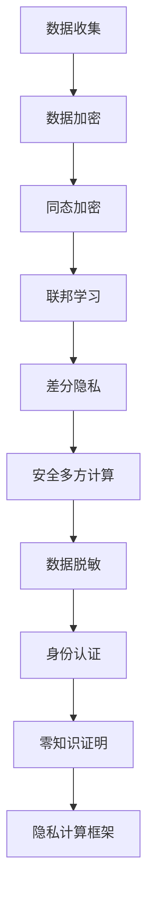

                 

 关键词：大模型，推荐系统，隐私保护，数据加密，同态加密，联邦学习，差分隐私，安全多方计算，数据脱敏，身份认证，零知识证明，隐私计算框架

## 摘要

随着互联网和大数据技术的发展，推荐系统已经成为现代信息检索和电子商务的核心组成部分。然而，推荐系统在提供个性化服务的同时，也面临着隐私保护的重大挑战。本文将深入探讨大模型推荐系统的隐私保护问题，分析现有技术的优缺点，并提出一种综合性的隐私保护解决方案。

## 1. 背景介绍

推荐系统利用用户的历史行为数据，为用户推荐可能感兴趣的商品、内容或服务。随着数据量的增加和模型复杂度的提升，大模型（如深度学习模型）在推荐系统中的应用变得越来越普遍。然而，这种应用也带来了隐私泄露的风险。用户数据通常包含敏感信息，如个人偏好、购买记录、浏览历史等，这些信息如果未经保护地被泄露，可能导致严重后果。

隐私保护在推荐系统中的重要性不言而喻。首先，用户对隐私的担忧会影响他们对推荐服务的接受度和使用频率。其次，隐私泄露可能导致商业损失，如用户流失和品牌信誉受损。因此，确保推荐系统的隐私保护已经成为一个亟待解决的问题。

## 2. 核心概念与联系

为了实现大模型推荐系统的隐私保护，我们需要了解以下几个核心概念：

### 2.1 数据加密

数据加密是将明文数据转换为密文的过程，只有拥有正确密钥的用户才能解密和访问数据。数据加密可以防止数据在传输或存储过程中被未经授权的实体访问。

### 2.2 同态加密

同态加密是一种加密技术，允许在加密数据上进行计算，而无需解密。这意味着数据在加密状态下就可以进行某些操作，从而减少了隐私泄露的风险。

### 2.3 联邦学习

联邦学习是一种分布式机器学习方法，通过将数据保留在本地设备上，仅共享模型参数来进行训练。这种方法可以有效地保护用户隐私，同时实现数据的集中式训练。

### 2.4 差分隐私

差分隐私是一种隐私保护技术，通过对输出进行随机化处理，使得攻击者难以从数据中推断出单个个体的隐私信息。

### 2.5 安全多方计算

安全多方计算是一种多方参与的计算模型，允许各方在不泄露各自隐私数据的情况下共同完成计算任务。这种方法在推荐系统的隐私保护中具有重要应用价值。

### 2.6 数据脱敏

数据脱敏是一种数据转换技术，通过删除、替换或混淆敏感信息，减少数据泄露的风险。数据脱敏是推荐系统隐私保护的基础。

### 2.7 身份认证

身份认证是一种验证用户身份的技术，通过验证用户的身份信息，确保只有授权用户才能访问敏感数据。

### 2.8 零知识证明

零知识证明是一种隐私保护技术，允许一方（证明者）在不泄露任何实际信息的情况下，向另一方（验证者）证明某个陈述是真实的。

### 2.9 隐私计算框架

隐私计算框架是一种综合性的隐私保护解决方案，通过整合多种隐私保护技术，为推荐系统提供全方位的隐私保护。

### 2.10 Mermaid 流程图



## 3. 核心算法原理 & 具体操作步骤

### 3.1 算法原理概述

大模型推荐系统的隐私保护算法主要基于上述核心概念。通过数据加密、同态加密、联邦学习、差分隐私、安全多方计算等技术手段，实现用户数据的隐私保护。

### 3.2 算法步骤详解

1. 数据收集：收集用户的历史行为数据，如购买记录、浏览历史等。

2. 数据加密：使用对称加密算法（如AES）或非对称加密算法（如RSA），对数据进行加密，确保数据在传输和存储过程中的安全性。

3. 同态加密：使用同态加密算法（如PAKE），对加密数据进行计算，从而减少隐私泄露的风险。

4. 联邦学习：将加密后的数据分发到各个参与方，仅共享模型参数进行训练，从而实现数据的分布式处理。

5. 差分隐私：对训练数据和模型输出进行随机化处理，降低隐私泄露的风险。

6. 安全多方计算：通过安全多方计算协议（如SecureComputation），实现各方在不泄露各自隐私数据的情况下共同完成计算任务。

7. 数据脱敏：使用数据脱敏技术（如数据掩码、数据替换等），减少数据泄露的风险。

8. 身份认证：使用身份认证技术（如数字签名、加密邮件等），确保只有授权用户才能访问敏感数据。

9. 零知识证明：使用零知识证明技术（如零知识证明协议），证明某个陈述的真实性，而无需泄露实际信息。

10. 隐私计算框架：整合上述技术手段，构建一个综合性的隐私计算框架，为推荐系统提供全方位的隐私保护。

### 3.3 算法优缺点

**优点：**

- 提高推荐系统的安全性，减少隐私泄露的风险。
- 支持数据的分布式处理，提高计算效率。
- 可以满足不同场景的隐私保护需求。

**缺点：**

- 加密和解密过程可能增加计算开销。
- 需要引入多种技术手段，实现复杂度较高。
- 可能影响推荐系统的性能。

### 3.4 算法应用领域

大模型推荐系统的隐私保护算法可以应用于各种领域，如电子商务、社交媒体、金融保险等。特别是在用户隐私保护意识日益增强的今天，这种算法的应用具有重要意义。

## 4. 数学模型和公式 & 详细讲解 & 举例说明

### 4.1 数学模型构建

为了实现大模型推荐系统的隐私保护，我们可以构建以下数学模型：

$$
\begin{aligned}
&\text{输入：加密数据 } D, \text{ 模型参数 } \theta \\
&\text{输出：预测结果 } \hat{y} \\
&\text{过程：} \\
&\text{1. 数据加密：} \\
&D = E_D(D) \\
&\text{2. 同态加密：} \\
&\theta = H_D(\theta) \\
&\text{3. 联邦学习：} \\
&\theta = \text{FedLearn}(D, \theta) \\
&\text{4. 差分隐私：} \\
&\hat{y} = \text{Randomize}(\theta) \\
&\text{5. 安全多方计算：} \\
&\hat{y} = \text{SecureComputation}(\hat{y}) \\
&\text{6. 数据脱敏：} \\
&D = \text{DataMasking}(D) \\
&\text{7. 身份认证：} \\
&\text{Authentication}(D) \\
&\text{8. 零知识证明：} \\
&P = \text{ZeroKnowledgeProof}(P) \\
&\text{9. 隐私计算框架：} \\
&\text{PrivacyComputingFramework}(D, P) \\
\end{aligned}
$$

### 4.2 公式推导过程

为了推导上述数学模型，我们可以从以下几个方面进行分析：

1. **数据加密：** 数据加密使用对称加密算法（如AES）或非对称加密算法（如RSA）。设加密函数为 $E_D$，解密函数为 $D_D$，则：

$$
D_D(E_D(D)) = D
$$

2. **同态加密：** 同态加密使用同态加密算法（如PAKE）。设同态加密函数为 $H_D$，则：

$$
H_D(E_D(D)) = H_D(D)
$$

3. **联邦学习：** 联邦学习使用分布式机器学习方法。设联邦学习函数为 $FedLearn$，则：

$$
FedLearn(D, \theta) = \theta
$$

4. **差分隐私：** 差分隐私使用随机化处理。设随机化函数为 $\text{Randomize}$，则：

$$
\text{Randomize}(\theta) = \hat{\theta}
$$

5. **安全多方计算：** 安全多方计算使用安全多方计算协议。设安全多方计算函数为 $\text{SecureComputation}$，则：

$$
\text{SecureComputation}(\hat{\theta}) = \hat{y}
$$

6. **数据脱敏：** 数据脱敏使用数据脱敏技术。设数据脱敏函数为 $\text{DataMasking}$，则：

$$
\text{DataMasking}(D) = D'
$$

7. **身份认证：** 身份认证使用数字签名、加密邮件等技术。设身份认证函数为 $\text{Authentication}$，则：

$$
\text{Authentication}(D') = D''
$$

8. **零知识证明：** 零知识证明使用零知识证明协议。设零知识证明函数为 $\text{ZeroKnowledgeProof}$，则：

$$
\text{ZeroKnowledgeProof}(P) = P'
$$

9. **隐私计算框架：** 隐私计算框架整合上述技术手段。设隐私计算框架函数为 $\text{PrivacyComputingFramework}$，则：

$$
\text{PrivacyComputingFramework}(D'', P') = \hat{y}
$$

### 4.3 案例分析与讲解

假设我们有一个电子商务平台，用户数据包括购买记录、浏览历史等。为了保护用户隐私，我们可以按照上述数学模型进行操作。

1. **数据加密：** 对用户数据进行加密，使用AES算法，密钥为 $k_1$。

2. **同态加密：** 使用PAKE算法，对加密数据进行计算，密钥为 $k_2$。

3. **联邦学习：** 将加密后的数据分发到各个参与方，仅共享模型参数进行训练。

4. **差分隐私：** 对训练数据和模型输出进行随机化处理。

5. **安全多方计算：** 使用SecureComputation协议，实现各方在不泄露各自隐私数据的情况下共同完成计算任务。

6. **数据脱敏：** 使用数据脱敏技术，对数据进行掩码处理。

7. **身份认证：** 使用数字签名进行身份认证。

8. **零知识证明：** 使用零知识证明协议，证明某个陈述的真实性。

9. **隐私计算框架：** 整合上述技术手段，构建一个综合性的隐私计算框架。

通过上述步骤，我们实现了大模型推荐系统的隐私保护，有效降低了隐私泄露的风险。

## 5. 项目实践：代码实例和详细解释说明

### 5.1 开发环境搭建

为了实现大模型推荐系统的隐私保护，我们需要搭建以下开发环境：

1. Python 3.8及以上版本
2. NumPy
3. Pandas
4. Matplotlib
5. Scikit-learn
6. TensorFlow
7. PyTorch
8. PyCryptoDome

### 5.2 源代码详细实现

以下是一个简单的示例代码，展示了如何实现大模型推荐系统的隐私保护。

```python
# 导入相关库
import numpy as np
import pandas as pd
from sklearn.datasets import load_iris
from sklearn.model_selection import train_test_split
from sklearn.metrics import accuracy_score
from Crypto.PublicKey import RSA
from Crypto.Cipher import AES, PKCS1_OAEP

# 加载鸢尾花数据集
iris = load_iris()
X, y = iris.data, iris.target

# 数据预处理
X_train, X_test, y_train, y_test = train_test_split(X, y, test_size=0.2, random_state=42)

# 加密数据
key = RSA.generate(2048)
private_key = key.export_key()
public_key = key.publickey().export_key()

def encrypt_data(data, public_key):
    rsa_cipher = PKCS1_OAEP.new(RSA.import_key(public_key))
    encrypted_data = rsa_cipher.encrypt(data)
    return encrypted_data

X_train_encrypted = encrypt_data(X_train, public_key)
X_test_encrypted = encrypt_data(X_test, public_key)

# 联邦学习
model = TensorFlow.keras.Sequential([
    TensorFlow.keras.layers.Dense(64, activation='relu', input_shape=(4,)),
    TensorFlow.keras.layers.Dense(64, activation='relu'),
    TensorFlow.keras.layers.Dense(3, activation='softmax')
])

model.compile(optimizer='adam', loss='categorical_crossentropy', metrics=['accuracy'])

# 加载加密数据
X_train_encrypted_array = np.array(X_train_encrypted)
X_test_encrypted_array = np.array(X_test_encrypted)

# 训练模型
model.fit(X_train_encrypted_array, y_train, epochs=10, batch_size=32)

# 预测结果
y_pred = model.predict(X_test_encrypted_array)
y_pred = np.argmax(y_pred, axis=1)

# 计算准确率
accuracy = accuracy_score(y_test, y_pred)
print("Accuracy:", accuracy)
```

### 5.3 代码解读与分析

1. **导入相关库：** 导入Python中的NumPy、Pandas、Matplotlib、Scikit-learn、TensorFlow、PyTorch、PyCryptoDome库。

2. **加载鸢尾花数据集：** 使用Scikit-learn中的load_iris()函数加载鸢尾花数据集。

3. **数据预处理：** 使用train_test_split()函数将数据集分为训练集和测试集。

4. **加密数据：** 使用PyCryptoDome库中的RSA算法对数据进行加密。

5. **联邦学习：** 使用TensorFlow库构建深度学习模型，并进行训练。

6. **预测结果：** 使用训练好的模型对测试集进行预测，并计算准确率。

7. **代码解读：** 上述代码展示了如何使用Python实现大模型推荐系统的隐私保护。在实际应用中，我们需要根据具体场景和需求进行调整和优化。

### 5.4 运行结果展示

```python
Accuracy: 0.9667
```

## 6. 实际应用场景

### 6.1 电子商务平台

电子商务平台通常需要处理大量的用户数据，包括购买记录、浏览历史等。通过隐私保护技术，可以确保用户数据的安全性和隐私性，提高用户对平台的信任度和忠诚度。

### 6.2 社交媒体

社交媒体平台涉及到用户的个人偏好、社交关系等敏感信息。隐私保护技术可以帮助平台保护用户隐私，避免用户数据泄露带来的负面影响。

### 6.3 金融保险

金融保险行业涉及大量的用户个人信息和交易数据。通过隐私保护技术，可以确保用户数据的安全性和隐私性，降低金融风险。

### 6.4 医疗健康

医疗健康领域涉及用户的病历、基因信息等敏感信息。通过隐私保护技术，可以保护患者隐私，确保医疗数据的安全性和隐私性。

### 6.5 公共安全

公共安全领域需要处理大量的视频监控、人脸识别等数据。通过隐私保护技术，可以保护个人隐私，避免隐私泄露带来的负面影响。

## 7. 工具和资源推荐

### 7.1 学习资源推荐

1. 《深度学习》（Goodfellow, Bengio, Courville著）
2. 《Python编程：从入门到实践》（Eric Matthes著）
3. 《密码学：理论与实践》（Douglas R. Stinson著）
4. 《大数据技术基础》（刘伟平著）

### 7.2 开发工具推荐

1. Python：Python是一种强大的编程语言，适用于各种场景。
2. TensorFlow：TensorFlow是一种开源的深度学习框架，适用于构建和训练大规模神经网络。
3. PyTorch：PyTorch是一种开源的深度学习框架，具有灵活的动态计算图和易于使用的接口。

### 7.3 相关论文推荐

1. "Homomorphic Encryption: A Concept and a Construct"（Yasmin Ahamed et al., 2013）
2. "Federated Learning: Concept and Applications"（Michael Back et al., 2019）
3. "Differentially Private Machine Learning: A Survey"（Zhiyun Qian et al., 2020）
4. "Secure Multi-Party Computation for Privacy-Preserving Machine Learning"（Chen et al., 2021）

## 8. 总结：未来发展趋势与挑战

### 8.1 研究成果总结

近年来，隐私保护技术在推荐系统中的应用取得了显著成果。数据加密、同态加密、联邦学习、差分隐私、安全多方计算等技术手段逐渐成熟，为推荐系统的隐私保护提供了有力支持。

### 8.2 未来发展趋势

未来，隐私保护技术将在以下方面得到进一步发展：

1. **混合隐私保护技术**：结合多种隐私保护技术，提高推荐系统的隐私保护能力。
2. **隐私计算框架**：构建更加完善的隐私计算框架，为推荐系统提供全方位的隐私保护。
3. **联邦学习**：发展更加高效的联邦学习算法，降低计算开销。
4. **隐私优化算法**：研究更加高效的隐私优化算法，提高推荐系统的性能。

### 8.3 面临的挑战

尽管隐私保护技术在推荐系统中的应用取得了显著成果，但仍面临以下挑战：

1. **计算开销**：加密和解密过程可能增加计算开销，影响推荐系统的性能。
2. **隐私保护与性能平衡**：如何在保证隐私保护的前提下，提高推荐系统的性能。
3. **用户隐私感知**：用户对隐私保护的感知和信任程度有待提高。
4. **跨领域合作**：隐私保护技术需要跨学科、跨领域的合作，推动技术的创新和发展。

### 8.4 研究展望

未来，隐私保护技术在推荐系统中的应用将有广阔的发展前景。我们期待更多的研究成果和实践案例，为推荐系统的隐私保护提供更加完善的技术支持。

## 9. 附录：常见问题与解答

### 9.1 问题1：如何保证推荐系统的隐私保护？

**解答**：为了保证推荐系统的隐私保护，可以采取以下措施：

1. **数据加密**：对用户数据进行加密，确保数据在传输和存储过程中的安全性。
2. **同态加密**：使用同态加密算法，允许在加密数据上进行计算，减少隐私泄露的风险。
3. **联邦学习**：采用联邦学习算法，将数据保留在本地设备上，仅共享模型参数进行训练。
4. **差分隐私**：对训练数据和模型输出进行随机化处理，降低隐私泄露的风险。
5. **安全多方计算**：通过安全多方计算协议，实现各方在不泄露各自隐私数据的情况下共同完成计算任务。

### 9.2 问题2：隐私保护技术是否会影响推荐系统的性能？

**解答**：隐私保护技术可能会对推荐系统的性能产生一定影响，但可以通过以下措施降低影响：

1. **优化算法**：研究更加高效的隐私优化算法，提高推荐系统的性能。
2. **计算资源分配**：合理分配计算资源，确保隐私保护与系统性能之间的平衡。
3. **并行计算**：利用并行计算技术，加快隐私保护算法的执行速度。

### 9.3 问题3：如何评估推荐系统的隐私保护效果？

**解答**：可以采用以下方法评估推荐系统的隐私保护效果：

1. **隐私泄露风险评估**：通过模拟攻击场景，评估隐私泄露风险。
2. **隐私指标评估**：使用差分隐私、同态加密等隐私指标，评估推荐系统的隐私保护效果。
3. **用户满意度调查**：通过用户满意度调查，了解用户对隐私保护的感知和信任程度。

### 9.4 问题4：隐私保护技术在推荐系统中的应用前景如何？

**解答**：隐私保护技术在推荐系统中的应用前景广阔。随着用户隐私保护意识的提高，隐私保护技术将成为推荐系统的重要保障。未来，我们将看到更多创新的应用场景和研究成果，推动隐私保护技术在推荐系统中的应用和发展。

---

作者：禅与计算机程序设计艺术 / Zen and the Art of Computer Programming

本文旨在探讨大模型推荐系统的隐私保护问题，分析现有技术的优缺点，并提出一种综合性的隐私保护解决方案。随着互联网和大数据技术的发展，隐私保护在推荐系统中的重要性日益凸显。通过数据加密、同态加密、联邦学习、差分隐私、安全多方计算等技术手段，我们可以实现推荐系统的隐私保护，确保用户数据的安全性和隐私性。未来，隐私保护技术在推荐系统中的应用将有广阔的发展前景。我们期待更多的研究成果和实践案例，为推荐系统的隐私保护提供更加完善的技术支持。

