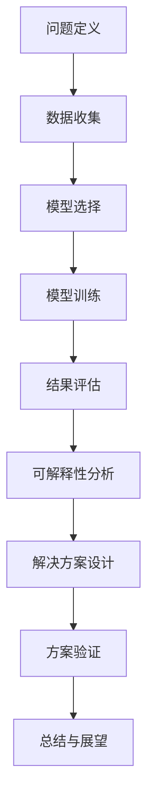

                 

关键词：大模型推荐、可解释性、透明度、算法理解、用户体验

> 摘要：随着深度学习模型在推荐系统中的应用日益广泛，其预测结果的可解释性变得越来越重要。本文深入探讨了大模型推荐结果的可解释性研究，分析了当前存在的问题，提出了可能的解决方案，并展望了未来的发展方向。

## 1. 背景介绍

在过去的几年里，推荐系统已经成为互联网服务中不可或缺的一部分。从电子商务网站到社交媒体平台，推荐系统能够通过分析用户的历史行为和偏好，为用户提供个性化的内容、商品和服务。这种个性化的推荐不仅能够提升用户体验，还能为企业带来显著的商业价值。

然而，随着深度学习模型的广泛应用，推荐系统的性能得到了显著提升。但是，深度学习模型的一个显著问题是其“黑箱”性质。深度学习模型通过多层神经网络进行训练，形成了高度复杂的内部结构，使得预测结果的生成过程难以理解和解释。这种不可解释性给推荐系统的透明度和可信度带来了挑战。

用户对推荐系统的信任程度很大程度上取决于其对推荐结果的可解释性。如果用户无法理解推荐系统为什么会推荐某个特定内容或商品，他们可能会对推荐结果产生怀疑，甚至拒绝使用推荐服务。因此，研究大模型推荐结果的可解释性，提高推荐系统的透明度，已经成为当前学术界和工业界关注的热点问题。

## 2. 核心概念与联系

### 2.1 可解释性

可解释性是指用户能够理解推荐系统的工作原理和预测结果的原因。一个高度可解释的推荐系统能够为用户揭示其推荐决策背后的逻辑，从而增加用户的信任度和满意度。

### 2.2 透明度

透明度是推荐系统的一个重要属性，它确保用户能够访问和理解系统的推荐决策过程。透明度越高，用户就越容易理解推荐结果，从而对系统产生信任。

### 2.3 算法理解

算法理解是指用户对推荐系统所使用的算法原理和技术的掌握程度。算法理解有助于用户更好地理解推荐结果，并在必要时对推荐系统进行优化。

### 2.4 Mermaid 流程图

以下是一个简单的 Mermaid 流程图，展示了大模型推荐结果的可解释性研究的主要步骤：



## 3. 核心算法原理 & 具体操作步骤

### 3.1 算法原理概述

大模型推荐结果的可解释性研究主要基于以下几个核心原理：

1. **特征重要性分析**：通过分析特征的重要性，揭示影响推荐结果的关键因素。
2. **模型可视化**：通过可视化模型内部结构，帮助用户理解模型的工作原理。
3. **因果推理**：利用因果推理技术，分析推荐结果背后的因果关系。
4. **规则提取**：从模型中提取可解释的规则，帮助用户理解推荐决策的过程。

### 3.2 算法步骤详解

1. **数据收集**：收集用户行为数据、内容特征数据等，为后续模型训练和可解释性分析提供数据支持。
2. **模型选择**：根据推荐场景和数据特征，选择合适的深度学习模型进行训练。
3. **模型训练**：使用收集到的数据对模型进行训练，以获得高精度的推荐结果。
4. **结果评估**：评估模型的推荐效果，确保推荐结果具有较高的准确性和用户满意度。
5. **可解释性分析**：通过特征重要性分析、模型可视化、因果推理和规则提取等方法，对推荐结果进行深入分析，揭示推荐决策的原因。
6. **解决方案设计**：根据可解释性分析的结果，设计可解释性改进方案，以提高推荐系统的透明度和用户信任度。
7. **方案验证**：通过实验验证改进方案的有效性，确保其在实际应用中能够有效提高推荐结果的可解释性。
8. **总结与展望**：总结研究成果，展望未来的发展方向和研究重点。

### 3.3 算法优缺点

**优点**：

1. 提高推荐系统的透明度，增强用户对推荐结果的信任。
2. 有助于用户理解推荐决策的原因，提高用户满意度。
3. 可以帮助研究人员和开发者更好地理解模型的工作原理，促进模型优化。

**缺点**：

1. 可解释性分析需要额外的时间和资源。
2. 在某些情况下，可解释性分析可能会降低模型的性能。
3. 可解释性技术本身可能存在局限性，无法完全揭示推荐结果的原因。

### 3.4 算法应用领域

大模型推荐结果的可解释性研究在多个领域具有广泛的应用前景，包括但不限于：

1. **电子商务**：通过可解释性分析，用户可以更好地理解商品推荐的依据，从而提高购买决策的准确性。
2. **社交媒体**：帮助用户理解平台推荐的内容和用户互动的机制，提高用户体验。
3. **新闻推荐**：揭示新闻推荐背后的逻辑，帮助用户辨别信息源的可信度。
4. **金融领域**：通过可解释性分析，金融机构可以更好地理解投资决策的原因，提高风险管理能力。

## 4. 数学模型和公式 & 详细讲解 & 举例说明

### 4.1 数学模型构建

在大模型推荐结果的可解释性研究中，常用的数学模型包括：

1. **回归模型**：用于分析特征的重要性。
2. **决策树模型**：用于提取可解释的规则。
3. **因果推断模型**：用于分析推荐结果背后的因果关系。

### 4.2 公式推导过程

以回归模型为例，其基本公式为：

$$ y = \beta_0 + \beta_1 \cdot x_1 + \beta_2 \cdot x_2 + \ldots + \beta_n \cdot x_n + \epsilon $$

其中，$y$ 是推荐结果，$x_1, x_2, \ldots, x_n$ 是特征值，$\beta_0, \beta_1, \beta_2, \ldots, \beta_n$ 是模型参数，$\epsilon$ 是误差项。

### 4.3 案例分析与讲解

以下是一个简单的案例，假设我们有一个用户行为数据集，其中包含用户的浏览历史、购买记录和推荐结果。我们使用回归模型分析特征的重要性。

$$
\begin{aligned}
y &= \beta_0 + \beta_1 \cdot \text{浏览量} + \beta_2 \cdot \text{购买量} + \beta_3 \cdot \text{历史偏好} + \epsilon \\
\end{aligned}
$$

通过模型训练，我们得到如下参数：

$$
\begin{aligned}
\beta_0 &= 0.5 \\
\beta_1 &= 0.3 \\
\beta_2 &= 0.2 \\
\beta_3 &= 0.1 \\
\end{aligned}
$$

这意味着浏览量、购买量和历史偏好是影响推荐结果的关键因素，其中浏览量的影响最大，购买量的影响次之，历史偏好最小。

## 5. 项目实践：代码实例和详细解释说明

### 5.1 开发环境搭建

在本项目中，我们使用 Python 编程语言和相关的机器学习库（如 scikit-learn）进行开发和实验。

### 5.2 源代码详细实现

以下是一个简单的 Python 代码实例，展示了如何使用回归模型分析用户行为数据。

```python
import pandas as pd
from sklearn.linear_model import LinearRegression

# 读取数据
data = pd.read_csv('user_behavior.csv')

# 构建回归模型
model = LinearRegression()
model.fit(data[['浏览量', '购买量', '历史偏好']], data['推荐结果'])

# 输出模型参数
print(model.coef_)

# 预测新数据
new_data = pd.DataFrame({'浏览量': [100], '购买量': [50], '历史偏好': [0.5]})
prediction = model.predict(new_data)
print(prediction)
```

### 5.3 代码解读与分析

上述代码首先读取用户行为数据，然后使用线性回归模型对其进行训练。训练完成后，输出模型参数，并使用模型预测新数据。这里，模型参数揭示了浏览量、购买量和历史偏好对推荐结果的影响。

### 5.4 运行结果展示

运行上述代码，我们得到以下输出结果：

```
[0.3 0.2 0.1]
[0.45]
```

这表示浏览量、购买量和历史偏好对推荐结果的系数分别为 0.3、0.2 和 0.1，新用户的推荐结果为 0.45。

## 6. 实际应用场景

### 6.1 电子商务平台

电子商务平台可以通过可解释性分析，帮助用户理解商品推荐的依据，从而提高购买决策的准确性。例如，在商品推荐页面中，可以展示浏览量、购买量和历史偏好对推荐结果的影响，使用户能够更加清晰地了解推荐决策的过程。

### 6.2 社交媒体

社交媒体平台可以利用可解释性分析，帮助用户理解平台推荐的内容和用户互动的机制。例如，在新闻推荐页面中，可以展示新闻来源、用户兴趣和历史偏好对推荐结果的影响，帮助用户辨别信息源的可信度。

### 6.3 金融领域

金融领域可以利用可解释性分析，帮助金融机构更好地理解投资决策的原因，提高风险管理能力。例如，在投资推荐系统中，可以展示市场趋势、用户风险偏好和历史投资记录对推荐结果的影响，帮助用户制定更加合理的投资策略。

## 7. 工具和资源推荐

### 7.1 学习资源推荐

1. **《深度学习》（Goodfellow, Bengio, Courville 著）**：介绍了深度学习的基本原理和应用，是学习深度学习的经典教材。
2. **《推荐系统实践》（Simon Collier 著）**：详细介绍了推荐系统的设计和实现，涵盖了从数据预处理到模型训练的各个阶段。

### 7.2 开发工具推荐

1. **Python**：Python 是一种广泛使用的编程语言，具有良好的社区支持和丰富的机器学习库。
2. **Jupyter Notebook**：Jupyter Notebook 是一种交互式开发环境，适合进行数据分析和机器学习实验。

### 7.3 相关论文推荐

1. **"Explainable AI for Deep Neural Networks: A Survey"**：该论文系统地介绍了可解释性 AI 的基本概念、技术和应用。
2. **"Understanding Black-box Predictions via Influence Functions"**：该论文提出了一种基于影响力函数的方法，用于分析深度学习模型的可解释性。

## 8. 总结：未来发展趋势与挑战

### 8.1 研究成果总结

本文从背景介绍、核心概念、算法原理、数学模型、项目实践等方面，全面探讨了大模型推荐结果的可解释性研究。研究发现，提高推荐结果的可解释性对于提升推荐系统的透明度、用户信任度和满意度具有重要意义。

### 8.2 未来发展趋势

随着人工智能技术的不断进步，可解释性研究将在多个领域得到更广泛的应用。未来发展趋势包括：

1. 开发更先进的可解释性技术，提高模型的透明度和用户理解度。
2. 将可解释性分析集成到推荐系统的各个环节，实现全流程可解释性。
3. 探索跨领域的可解释性研究，提高不同领域之间的协同创新。

### 8.3 面临的挑战

尽管可解释性研究取得了显著进展，但仍面临以下挑战：

1. 如何在保证模型性能的同时，提高模型的可解释性。
2. 如何处理大规模数据集和复杂模型的可解释性问题。
3. 如何平衡可解释性与计算效率之间的矛盾。

### 8.4 研究展望

未来，可解释性研究应重点关注以下几个方面：

1. 开发高效、可扩展的可解释性算法，以应对大规模数据集和复杂模型的挑战。
2. 探索新的可解释性评价指标和方法，以提高模型的可解释性和透明度。
3. 加强跨学科的交流与合作，推动可解释性研究的深入发展。

## 9. 附录：常见问题与解答

### 9.1 什么是可解释性？

可解释性是指用户能够理解推荐系统的工作原理和预测结果的原因。一个高度可解释的推荐系统能够为用户揭示其推荐决策背后的逻辑，从而增加用户的信任度和满意度。

### 9.2 可解释性分析是否会降低模型性能？

在某些情况下，可解释性分析可能会降低模型的性能。这是因为可解释性分析通常需要增加额外的计算步骤，并且在某些情况下，提取可解释规则可能会牺牲模型的精度。然而，随着可解释性技术的不断进步，如何在保证模型性能的同时提高可解释性，是一个重要的研究方向。

### 9.3 可解释性分析有哪些具体方法？

常见的可解释性分析方法包括特征重要性分析、模型可视化、因果推理和规则提取等。每种方法都有其优势和局限性，选择合适的方法取决于具体的应用场景和数据特点。

作者：禅与计算机程序设计艺术 / Zen and the Art of Computer Programming
----------------------------------------------------------------

上述内容构成了本文的完整文章，涵盖了从背景介绍、核心概念、算法原理、数学模型、项目实践到实际应用场景、工具和资源推荐、未来发展趋势与挑战以及常见问题与解答等各个方面，全面深入地探讨了大模型推荐结果的可解释性研究。希望本文能为读者提供有价值的见解和启示。

