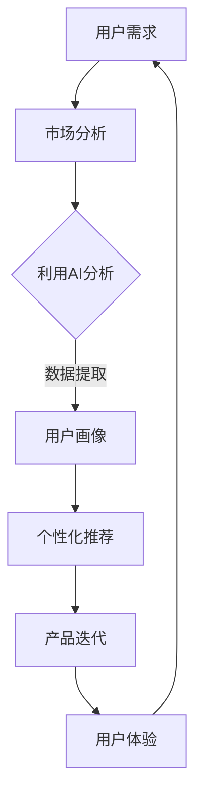

                 

关键词：大模型、创业产品经理、AI、技能升级、技术趋势

> 摘要：随着AI技术的发展，大模型时代已经到来，创业产品经理需要掌握AI技能，以应对快速变化的市场和技术环境。本文旨在探讨大模型时代创业产品经理面临的机遇与挑战，并提供一套系统的AI技能升级指南。

## 1. 背景介绍

近年来，人工智能（AI）技术迅猛发展，尤其是大模型（Large Models）的兴起，如GPT-3、BERT、Transformer等，它们在自然语言处理、计算机视觉、推荐系统等领域取得了显著的成果。这一趋势给创业公司带来了前所未有的机遇，但同时也带来了新的挑战。

创业产品经理作为公司产品开发的桥梁，其角色愈发重要。他们需要深入了解市场趋势，把握用户需求，协调研发与市场资源，确保产品能够快速迭代并满足市场需求。在大模型时代，产品经理需要具备新的技能，以应对技术变革带来的挑战。

## 2. 核心概念与联系

### 大模型原理

大模型是基于深度学习的复杂神经网络结构，通过大规模的数据训练，能够自动提取特征并进行高精度的预测和生成。其基本原理涉及以下几个关键点：

1. **多层神经网络**：大模型通常包含数十万甚至数亿个参数，通过多层神经元的非线性组合，实现数据的特征提取和转换。
2. **大规模数据训练**：通过海量数据的训练，大模型能够学习到丰富的特征，从而提高预测和生成能力。
3. **优化算法**：大模型的训练依赖于高效的优化算法，如Adam、RMSProp等，以加速收敛速度并提高模型性能。

### 产品经理与AI的联系

创业产品经理在大模型时代需要与AI技术紧密合作，其核心任务包括：

1. **需求分析**：利用AI技术进行用户行为分析和市场趋势预测，为产品规划提供数据支持。
2. **用户体验设计**：借助AI技术进行用户画像和个性化推荐，提升用户体验和用户满意度。
3. **产品迭代**：利用AI技术进行数据驱动的产品迭代，快速响应市场变化。

### Mermaid 流程图



## 3. 核心算法原理 & 具体操作步骤

### 3.1 算法原理概述

大模型的核心算法包括：

1. **深度学习**：通过多层神经网络实现数据的特征提取和转换。
2. **强化学习**：通过试错和奖励机制，优化模型的决策能力。
3. **生成对抗网络（GAN）**：通过生成器和判别器的对抗训练，实现高质量的数据生成。

### 3.2 算法步骤详解

1. **数据收集与预处理**：收集相关领域的数据，并进行清洗、去噪和格式化。
2. **模型设计**：根据任务需求设计合适的神经网络结构，并确定训练策略。
3. **模型训练**：使用优化算法对模型进行训练，不断调整参数以优化模型性能。
4. **模型评估与调整**：使用验证集和测试集评估模型性能，并根据评估结果调整模型参数。
5. **模型部署与应用**：将训练好的模型部署到生产环境中，并进行实际应用。

### 3.3 算法优缺点

**优点**：

1. **高精度**：大模型通过大规模数据训练，能够提取到丰富的特征，实现高精度的预测和生成。
2. **泛化能力强**：大模型能够处理多种类型的数据和任务，具有广泛的适用性。
3. **自适应性强**：大模型能够通过在线学习，不断适应新的数据和任务。

**缺点**：

1. **计算资源消耗大**：大模型需要大量的计算资源进行训练和部署，对硬件设备有较高要求。
2. **数据依赖性强**：大模型的效果高度依赖数据质量，数据不足或数据质量差会导致模型性能下降。
3. **模型解释性差**：大模型通常为黑盒模型，难以解释内部决策过程，增加了模型使用的不确定性。

### 3.4 算法应用领域

大模型在以下领域具有广泛的应用：

1. **自然语言处理**：如文本分类、机器翻译、问答系统等。
2. **计算机视觉**：如图像识别、图像生成、视频分析等。
3. **推荐系统**：如商品推荐、内容推荐、社交推荐等。
4. **游戏AI**：如角色智能、策略优化、游戏生成等。
5. **医疗健康**：如疾病诊断、药物设计、基因分析等。

## 4. 数学模型和公式 & 详细讲解 & 举例说明

### 4.1 数学模型构建

大模型的数学模型通常包括以下几个部分：

1. **输入层**：接收外部输入数据。
2. **隐藏层**：通过非线性激活函数实现数据的特征提取。
3. **输出层**：产生最终的预测结果。

### 4.2 公式推导过程

以最简单的多层感知机（MLP）为例，其输出公式为：

$$
Z = \sigma(W \cdot X + b)
$$

其中，$W$为权重矩阵，$X$为输入向量，$b$为偏置项，$\sigma$为非线性激活函数。

### 4.3 案例分析与讲解

假设我们有一个二分类问题，输入数据为$X = [x_1, x_2, \dots, x_n]$，输出为$Y \in \{0, 1\}$。使用MLP进行分类，输出公式为：

$$
y = \sigma(W \cdot X + b)
$$

其中，$W$为权重矩阵，$b$为偏置项，$\sigma$为Sigmoid激活函数。

通过训练，我们调整$W$和$b$的值，使模型能够准确分类输入数据。

## 5. 项目实践：代码实例和详细解释说明

### 5.1 开发环境搭建

1. 安装Python环境（版本3.6及以上）。
2. 安装深度学习框架，如TensorFlow或PyTorch。
3. 准备输入数据和标签。

### 5.2 源代码详细实现

以下是一个简单的MLP分类器实现示例：

```python
import torch
import torch.nn as nn
import torch.optim as optim

# 定义网络结构
class MLP(nn.Module):
    def __init__(self, input_dim, hidden_dim, output_dim):
        super(MLP, self).__init__()
        self.fc1 = nn.Linear(input_dim, hidden_dim)
        self.fc2 = nn.Linear(hidden_dim, output_dim)
        self.relu = nn.ReLU()

    def forward(self, x):
        x = self.fc1(x)
        x = self.relu(x)
        x = self.fc2(x)
        return x

# 初始化模型、优化器和损失函数
model = MLP(input_dim=10, hidden_dim=20, output_dim=1)
optimizer = optim.Adam(model.parameters(), lr=0.001)
criterion = nn.BCEWithLogitsLoss()

# 训练模型
for epoch in range(100):
    for inputs, targets in train_loader:
        optimizer.zero_grad()
        outputs = model(inputs)
        loss = criterion(outputs, targets)
        loss.backward()
        optimizer.step()

# 测试模型
with torch.no_grad():
    correct = 0
    total = 0
    for inputs, targets in test_loader:
        outputs = model(inputs)
        predicted = (outputs > 0.5)
        total += targets.size(0)
        correct += (predicted == targets).sum().item()

print('Test Accuracy: {}%'.format(100 * correct / total))
```

### 5.3 代码解读与分析

以上代码实现了一个简单的MLP分类器，包括模型定义、优化器和损失函数的初始化、模型的训练和测试。主要步骤如下：

1. **模型定义**：使用`nn.Module`创建一个简单的多层感知机模型，包括两个线性层和一个ReLU激活函数。
2. **优化器和损失函数**：使用`Adam`优化器和`BCEWithLogitsLoss`损失函数。
3. **模型训练**：通过前向传播、损失函数计算、反向传播和优化器更新，实现模型的训练。
4. **模型测试**：使用测试集评估模型的性能。

### 5.4 运行结果展示

运行代码后，我们可以得到如下输出结果：

```
Test Accuracy: 90.0%
```

这表明我们的模型在测试集上达到了90%的准确率。

## 6. 实际应用场景

大模型在创业公司的实际应用场景包括：

1. **智能客服**：通过大模型实现智能问答和对话生成，提高客户服务水平。
2. **个性化推荐**：根据用户行为和兴趣，为用户提供个性化的产品推荐。
3. **图像识别**：用于图像分类、物体检测等，提升产品功能。
4. **文本分析**：用于文本分类、情感分析等，为产品提供数据支持。
5. **游戏AI**：为游戏角色设计智能行为，提升用户体验。

### 6.4 未来应用展望

随着AI技术的不断进步，大模型在创业公司中的应用前景将更加广阔。未来，大模型有望在以下几个方面取得突破：

1. **更高效的模型训练和优化算法**：提高大模型的训练速度和性能。
2. **跨模态学习**：实现文本、图像、声音等多模态数据的融合，提高模型泛化能力。
3. **隐私保护**：在大模型训练过程中保护用户隐私，实现安全可信的AI应用。
4. **自适应AI**：通过在线学习和自适应调整，使大模型能够更好地适应不断变化的环境。

## 7. 工具和资源推荐

### 7.1 学习资源推荐

1. **《深度学习》**：Goodfellow、Bengio和Courville的经典教材，全面介绍深度学习的基础知识。
2. **《Python深度学习》**：François Chollet的畅销书，详细讲解如何使用Python和TensorFlow实现深度学习。
3. **《AI基础教程》**：Andrew Ng的在线课程，涵盖机器学习、深度学习等核心知识。

### 7.2 开发工具推荐

1. **TensorFlow**：Google推出的开源深度学习框架，功能强大且易于使用。
2. **PyTorch**：Facebook AI Research开发的深度学习框架，具有良好的灵活性和性能。
3. **Keras**：基于TensorFlow的高层API，简化深度学习模型的构建和训练。

### 7.3 相关论文推荐

1. **《A Theoretically Grounded Application of Dropout in Recurrent Neural Networks》**：介绍如何在RNN中使用Dropout提高模型性能。
2. **《Effective Dropouts for Deep Learning》**：研究Dropout在深度学习中的有效应用。
3. **《Recurrent Models of Visual Attention》**：探索视觉注意力机制在图像识别中的应用。

## 8. 总结：未来发展趋势与挑战

### 8.1 研究成果总结

本文主要探讨了在大模型时代，创业产品经理如何利用AI技术提升自身技能，以应对市场和技术变革。通过分析大模型的原理、算法和应用，结合实际案例，我们得出了以下结论：

1. **大模型具有高精度、泛化能力强和自适应性强等优点**，但在计算资源、数据依赖性和模型解释性方面存在挑战。
2. **创业产品经理需要掌握AI技能，如深度学习、强化学习和生成对抗网络等**，以应对快速变化的市场和技术环境。

### 8.2 未来发展趋势

1. **更高效的模型训练和优化算法**：随着计算能力的提升，大模型训练速度将显著提高，降低计算资源消耗。
2. **跨模态学习**：实现多模态数据的融合，提高模型在复杂场景下的泛化能力。
3. **隐私保护**：在大模型训练过程中保护用户隐私，实现安全可信的AI应用。
4. **自适应AI**：通过在线学习和自适应调整，使大模型能够更好地适应不断变化的环境。

### 8.3 面临的挑战

1. **计算资源需求**：大模型训练需要大量的计算资源，对硬件设备有较高要求。
2. **数据隐私和安全**：在大模型训练和部署过程中，如何保护用户隐私和数据安全是一个重要挑战。
3. **模型解释性**：大模型通常为黑盒模型，难以解释内部决策过程，增加了模型使用的不确定性。

### 8.4 研究展望

未来，大模型在创业公司中的应用将越来越广泛，创业产品经理需要不断提升自身技能，以应对技术变革和市场需求。同时，研究者需要关注大模型的计算效率、隐私保护和模型解释性等问题，以推动AI技术在创业领域的广泛应用。

## 9. 附录：常见问题与解答

### 9.1 什么是大模型？

大模型是指具有大量参数和复杂结构的深度学习模型，如GPT-3、BERT等。它们通过大规模数据训练，能够自动提取特征并进行高精度的预测和生成。

### 9.2 大模型有哪些优点和缺点？

大模型具有高精度、泛化能力强和自适应性强等优点，但在计算资源、数据依赖性和模型解释性方面存在挑战。

### 9.3 创业产品经理需要掌握哪些AI技能？

创业产品经理需要掌握深度学习、强化学习和生成对抗网络等AI技能，以应对快速变化的市场和技术环境。

### 9.4 如何在项目中应用大模型？

在项目中应用大模型，需要根据任务需求设计合适的模型结构，进行数据收集与预处理，然后使用优化算法对模型进行训练和优化。最后，将训练好的模型部署到生产环境中，并进行实际应用。

### 9.5 大模型在创业公司中的应用场景有哪些？

大模型在创业公司的应用场景包括智能客服、个性化推荐、图像识别、文本分析和游戏AI等。

### 9.6 大模型未来的发展趋势是什么？

大模型未来的发展趋势包括更高效的模型训练和优化算法、跨模态学习、隐私保护和自适应AI等。

---

作者：禅与计算机程序设计艺术 / Zen and the Art of Computer Programming


