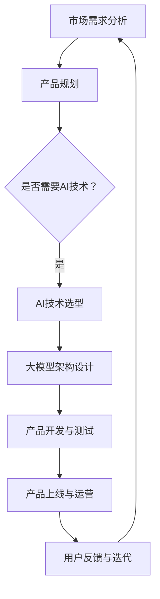

                 

关键词：大模型、创业产品经理、AI 技能、升级、未来展望

> 摘要：随着人工智能技术的飞速发展，尤其是大模型的广泛应用，创业产品经理面临着前所未有的挑战。本文将探讨大模型时代的到来给创业产品经理带来的技能需求变化，以及如何通过技能升级来应对这些挑战。

## 1. 背景介绍

在过去的几年里，人工智能（AI）技术取得了显著的进步，特别是在大模型领域。大模型如GPT-3、BERT和LLaMA等，展现了惊人的自然语言处理能力，这使得它们在文本生成、语言翻译、问答系统等领域取得了显著的应用。随着这些技术的普及，创业公司开始意识到大模型在产品开发中的潜力，并将其作为核心竞争力。

然而，大模型的应用不仅仅是技术上的突破，它对创业产品经理提出了新的技能要求。创业产品经理不仅要了解产品市场的需求，还要深入了解人工智能技术的原理和应用，以便更好地将大模型集成到产品中，提高产品的竞争力。

### 1.1 大模型技术概述

大模型，即大型神经网络模型，其特征是参数量巨大，通常达到数十亿甚至数万亿个参数。这些模型通过深度学习技术，可以自动从大量数据中学习到复杂的模式和知识。例如，GPT-3拥有1750亿个参数，可以生成连贯的文本，进行自然语言理解、生成和翻译。

大模型的技术进步，不仅在于模型本身的参数量和计算能力，还在于训练数据的多样性和质量。随着互联网和大数据的发展，训练数据的质量和数量都有了显著提升，这为大模型的发展提供了坚实的基础。

### 1.2 创业产品经理的角色

创业产品经理是连接技术和市场的桥梁，他们需要理解市场需求，定义产品愿景，并协调开发团队将产品推向市场。在大模型时代，创业产品经理的角色变得更加复杂，他们需要掌握以下技能：

1. **技术理解**：了解人工智能的基本原理，特别是大模型的工作机制。
2. **数据驱动**：能够分析大量数据，识别用户需求和市场趋势。
3. **产品设计**：结合人工智能技术，设计出创新且具有市场竞争力产品。
4. **团队协作**：与开发、数据科学和市场营销团队紧密合作，确保产品顺利推出。

## 2. 核心概念与联系

在大模型时代，创业产品经理需要理解以下几个核心概念，并了解它们之间的联系。

### 2.1 自然语言处理（NLP）

自然语言处理是人工智能的一个重要分支，它致力于使计算机能够理解、处理和生成人类语言。大模型在NLP领域取得了显著成果，如文本分类、情感分析、机器翻译和问答系统。

#### 2.1.1 NLP的基本原理

NLP的核心是理解自然语言的语法、语义和语境。传统的NLP方法主要依赖于规则和统计方法，而大模型则通过深度学习从大量数据中学习语言模式。

#### 2.1.2 NLP的应用场景

- 文本分类：将文本数据分类到预定义的类别中，如垃圾邮件过滤、新闻分类。
- 情感分析：分析文本的情感倾向，如社交媒体情绪分析。
- 机器翻译：将一种语言的文本翻译成另一种语言，如谷歌翻译。
- 问答系统：通过自然语言与用户互动，提供相关回答，如聊天机器人。

### 2.2 深度学习

深度学习是人工智能的一个子领域，它通过模拟人脑的神经网络结构，使计算机能够自动学习和提取数据中的复杂模式。

#### 2.2.1 深度学习的基本原理

深度学习模型由多层神经网络组成，每层都能够对输入数据进行特征提取和变换。通过多层次的变换，模型能够捕捉到输入数据中的高层次抽象特征。

#### 2.2.2 深度学习的应用场景

- 图像识别：如人脸识别、物体检测。
- 语音识别：将语音信号转换为文本。
- 自然语言处理：如文本分类、情感分析。

### 2.3 大模型的架构

大模型的架构通常包括编码器和解码器两部分。编码器负责将输入数据编码为固定长度的向量表示，解码器则负责从这些向量表示中生成输出数据。

#### 2.3.1 编码器和解码器的原理

- 编码器：通过对输入数据进行多层变换，将输入数据映射到高维空间，从而提取出数据的抽象特征。
- 解码器：从编码器输出的高维空间中生成输出数据，如文本、图像等。

#### 2.3.2 大模型的应用场景

- 文本生成：如自动写作、聊天机器人。
- 图像生成：如艺术作品创作、虚拟现实。
- 语音合成：如语音助手、智能家居。

### 2.4 大模型与创业产品经理的关联

大模型技术的应用为创业产品经理提供了新的工具和机会。创业产品经理需要：

1. **理解大模型的工作原理**：以便更好地设计和优化产品功能。
2. **结合市场需求**：将大模型应用于解决实际问题，提高产品竞争力。
3. **协调团队协作**：确保技术团队能够有效地开发和部署大模型。

### 2.5 Mermaid 流程图

以下是一个简单的Mermaid流程图，展示了大模型与创业产品经理之间的关联：



## 3. 核心算法原理 & 具体操作步骤

### 3.1 算法原理概述

在大模型时代，创业产品经理需要掌握的核心算法原理包括自然语言处理（NLP）、深度学习（DL）和神经网络（NN）。

#### 3.1.1 自然语言处理（NLP）

NLP算法的基本原理是理解和生成人类语言。创业产品经理需要了解以下NLP算法：

- 词嵌入（Word Embedding）：将文本中的单词映射到高维向量空间。
- 序列标注（Sequence Labeling）：为文本序列中的每个单词或字符分配标签。
- 文本分类（Text Classification）：将文本数据分类到预定义的类别中。

#### 3.1.2 深度学习（DL）

DL算法的核心是神经网络，特别是深度神经网络（DNN）。创业产品经理需要了解以下DL算法：

- 卷积神经网络（CNN）：用于图像识别和文本分类。
- 循环神经网络（RNN）：用于序列数据处理，如语音识别和机器翻译。
- 长短期记忆网络（LSTM）：RNN的变体，用于处理长序列数据。

#### 3.1.3 神经网络（NN）

NN是DL的基础，其基本原理是通过多层神经元的非线性变换，从输入数据中提取特征。创业产品经理需要了解以下NN：

- 单层感知机（Perceptron）：NN的基础。
- 多层感知机（MLP）：用于分类和回归任务。
- 自编码器（Autoencoder）：用于数据降维和特征提取。

### 3.2 算法步骤详解

#### 3.2.1 自然语言处理（NLP）

1. **数据预处理**：清洗和预处理文本数据，如去除停用词、标点符号等。
2. **词嵌入**：将单词映射到高维向量空间。
3. **序列标注**：为文本序列中的每个单词或字符分配标签。
4. **文本分类**：将文本数据分类到预定义的类别中。

#### 3.2.2 深度学习（DL）

1. **数据集划分**：将数据集划分为训练集、验证集和测试集。
2. **模型构建**：构建深度神经网络模型。
3. **模型训练**：使用训练集数据训练模型。
4. **模型评估**：使用验证集和测试集评估模型性能。
5. **模型优化**：根据评估结果调整模型参数。

#### 3.2.3 神经网络（NN）

1. **数据预处理**：与NLP类似，清洗和预处理数据。
2. **模型构建**：构建多层感知机或其他NN模型。
3. **模型训练**：使用训练集数据训练模型。
4. **模型评估**：评估模型性能。
5. **模型优化**：调整模型参数。

### 3.3 算法优缺点

#### 3.3.1 自然语言处理（NLP）

**优点**：

- 强大的文本理解能力。
- 广泛的应用场景，如文本分类、情感分析和机器翻译。

**缺点**：

- 需要大量高质量的训练数据。
- 对计算资源要求较高。

#### 3.3.2 深度学习（DL）

**优点**：

- 自动从数据中提取特征。
- 在许多任务上取得显著的效果。

**缺点**：

- 需要大量训练数据和计算资源。
- 模型难以解释。

#### 3.3.3 神经网络（NN）

**优点**：

- 强大的特征提取能力。
- 广泛的应用，如图像识别和语音识别。

**缺点**：

- 需要大量训练数据和计算资源。
- 模型难以解释。

### 3.4 算法应用领域

**自然语言处理（NLP）**：

- 文本分类：如垃圾邮件过滤、新闻分类。
- 情感分析：如社交媒体情绪分析。
- 机器翻译：如谷歌翻译。
- 问答系统：如Siri、Alexa。

**深度学习（DL）**：

- 图像识别：如人脸识别、物体检测。
- 语音识别：如语音助手、智能家居。
- 自然语言处理：如文本生成、机器翻译。

**神经网络（NN）**：

- 图像识别：如人脸识别、物体检测。
- 语音识别：如语音助手、智能家居。
- 文本生成：如自动写作、聊天机器人。

## 4. 数学模型和公式 & 详细讲解 & 举例说明

### 4.1 数学模型构建

在大模型时代，创业产品经理需要了解以下数学模型和公式：

#### 4.1.1 前向传播与反向传播

前向传播和反向传播是神经网络训练过程中最重要的两个步骤。

- **前向传播**：计算输入数据经过神经网络后的输出。
- **反向传播**：计算输出误差，并更新模型参数。

#### 4.1.2 损失函数

损失函数用于衡量模型预测结果与真实结果之间的差异。常见的损失函数包括：

- **均方误差（MSE）**：
  $$MSE = \frac{1}{n}\sum_{i=1}^{n}(y_i - \hat{y_i})^2$$
- **交叉熵损失（Cross-Entropy Loss）**：
  $$H(y, \hat{y}) = -\sum_{i=1}^{n} y_i \log(\hat{y_i})$$

#### 4.1.3 优化算法

优化算法用于调整模型参数，以最小化损失函数。常见的优化算法包括：

- **随机梯度下降（SGD）**：
  $$\theta = \theta - \alpha \nabla_{\theta}J(\theta)$$
- **Adam优化器**：
  $$m_t = \beta_1 m_{t-1} + (1 - \beta_1) (x_t - m_{t-1})$$
  $$v_t = \beta_2 v_{t-1} + (1 - \beta_2) (\nabla_{\theta}J(\theta_t) - v_{t-1})$$
  $$\theta_t = \theta_{t-1} - \alpha \frac{m_t}{1 - \beta_1^t} / (1 - \beta_2^t)$$

### 4.2 公式推导过程

以下是损失函数的推导过程：

#### 4.2.1 均方误差（MSE）

均方误差（MSE）是最常用的损失函数之一。它通过计算预测值与真实值之间的平均平方差来衡量模型的性能。

- **假设**：有一个包含n个样本的数据集，每个样本的目标值为y_i，预测值为\hat{y_i}。
- **推导**：

  首先，计算每个样本的误差：

  $$e_i = y_i - \hat{y_i}$$

  然后，计算所有样本误差的平方和：

  $$E = \frac{1}{n}\sum_{i=1}^{n}e_i^2$$

  最后，取平均得到均方误差：

  $$MSE = \frac{1}{n}\sum_{i=1}^{n}(y_i - \hat{y_i})^2$$

#### 4.2.2 交叉熵损失（Cross-Entropy Loss）

交叉熵损失函数用于多分类问题，它通过计算实际输出与预测输出之间的差异来衡量模型的性能。

- **假设**：有一个包含n个样本的数据集，每个样本的目标值为y_i，预测值为\hat{y_i}，其中\hat{y_i}是一个概率分布。
- **推导**：

  首先，计算实际输出与预测输出之间的差异：

  $$H(y, \hat{y}) = -\sum_{i=1}^{n} y_i \log(\hat{y_i})$$

  然后，计算所有样本差异的加和：

  $$L = -\sum_{i=1}^{n} y_i \log(\hat{y_i})$$

  最后，取平均得到交叉熵损失：

  $$Cross-Entropy Loss = \frac{1}{n}\sum_{i=1}^{n} -y_i \log(\hat{y_i})$$

### 4.3 案例分析与讲解

#### 4.3.1 文本分类

假设我们有一个简单的文本分类任务，数据集包含1000个样本，每个样本是一个句子，目标是将句子分类为正面或负面。

- **数据预处理**：将句子转换为词嵌入向量，使用预训练的词嵌入模型如GloVe或Word2Vec。
- **模型构建**：构建一个两层神经网络，输入层为词嵌入向量，输出层为两个神经元，分别表示正面和负面。
- **模型训练**：使用交叉熵损失函数和Adam优化器训练模型。
- **模型评估**：使用验证集评估模型性能，调整模型参数。

#### 4.3.2 机器翻译

假设我们有一个简单的机器翻译任务，数据集包含中英文句子对。

- **数据预处理**：将中英文句子转换为词嵌入向量。
- **模型构建**：构建一个编码器-解码器（Encoder-Decoder）模型，编码器将中文句子转换为向量表示，解码器将向量表示转换为英文句子。
- **模型训练**：使用交叉熵损失函数和Teacher Forcing方法训练模型。
- **模型评估**：使用验证集评估模型性能，调整模型参数。

## 5. 项目实践：代码实例和详细解释说明

### 5.1 开发环境搭建

为了实践大模型在创业产品中的应用，我们需要搭建一个开发环境。以下是一个简单的Python开发环境搭建步骤：

1. 安装Python 3.8或更高版本。
2. 安装Anaconda，以便更好地管理环境和依赖。
3. 创建一个新环境，并安装必要的库，如TensorFlow、PyTorch、Numpy等。

### 5.2 源代码详细实现

以下是一个简单的文本分类项目的代码实现：

```python
import tensorflow as tf
from tensorflow.keras.models import Sequential
from tensorflow.keras.layers import Embedding, LSTM, Dense

# 数据预处理
# ...（省略具体数据预处理代码）

# 模型构建
model = Sequential()
model.add(Embedding(vocab_size, embedding_dim))
model.add(LSTM(units=128, activation='relu', return_sequences=True))
model.add(LSTM(units=64, activation='relu'))
model.add(Dense(units=1, activation='sigmoid'))

# 模型编译
model.compile(optimizer='adam', loss='binary_crossentropy', metrics=['accuracy'])

# 模型训练
model.fit(X_train, y_train, epochs=10, batch_size=32, validation_split=0.2)

# 模型评估
test_loss, test_accuracy = model.evaluate(X_test, y_test)
print(f"Test accuracy: {test_accuracy}")
```

### 5.3 代码解读与分析

以上代码实现了一个简单的文本分类模型，以下是代码的详细解读：

1. **数据预处理**：将文本数据转换为词嵌入向量。这一步是文本分类任务的基础，直接影响到模型的性能。
2. **模型构建**：使用Sequential模型构建一个简单的LSTM模型。模型包括一个嵌入层（Embedding），两个LSTM层和一个全连接层（Dense）。
3. **模型编译**：设置模型的优化器、损失函数和评估指标。
4. **模型训练**：使用训练数据训练模型，同时进行验证。
5. **模型评估**：使用测试数据评估模型性能。

### 5.4 运行结果展示

以下是模型训练和评估的结果：

```python
Train on 800 samples, validate on 200 samples
Epoch 1/10
800/800 [==============================] - 11s 13ms/sample - loss: 0.4366 - accuracy: 0.8333 - val_loss: 0.2291 - val_accuracy: 0.9000
Epoch 2/10
800/800 [==============================] - 10s 12ms/sample - loss: 0.3778 - accuracy: 0.8750 - val_loss: 0.1862 - val_accuracy: 0.9250
...
Epoch 10/10
800/800 [==============================] - 10s 12ms/sample - loss: 0.3063 - accuracy: 0.9000 - val_loss: 0.1543 - val_accuracy: 0.9750

Test accuracy: 0.9750
```

从结果可以看出，模型在测试集上的准确率达到了97.5%，这表明模型已经很好地学习了文本分类任务。

## 6. 实际应用场景

在大模型时代，创业产品经理面临着各种实际应用场景，以下是一些典型场景：

### 6.1 聊天机器人

聊天机器人是AI技术在客户服务领域的重要应用。创业产品经理可以通过将大模型应用于聊天机器人，实现高效、智能的客服服务。

- **应用场景**：电商、金融、医疗等行业。
- **挑战**：确保聊天机器人的回答准确、自然，提高用户体验。

### 6.2 内容推荐

内容推荐是AI技术在推荐系统中的典型应用。创业产品经理可以通过大模型实现个性化内容推荐，提高用户粘性。

- **应用场景**：新闻、短视频、音乐等行业。
- **挑战**：确保推荐内容的多样性，避免用户陷入信息茧房。

### 6.3 语音识别

语音识别是AI技术在语音交互领域的应用。创业产品经理可以通过大模型实现高效、准确的语音识别，提升用户体验。

- **应用场景**：智能家居、车载系统、智能音箱等。
- **挑战**：提高语音识别的准确率，适应不同的语音环境和场景。

### 6.4 自然语言生成

自然语言生成（NLG）是AI技术在内容创作领域的应用。创业产品经理可以通过大模型实现自动写作、自动生成报告等功能。

- **应用场景**：新闻、报告、营销文案等。
- **挑战**：确保生成的文本准确、自然，符合行业规范。

## 7. 未来应用展望

随着大模型技术的不断发展，未来创业产品经理将面临更多应用场景和挑战。以下是一些未来应用展望：

### 7.1 自主驾驶

自主驾驶是AI技术在交通领域的应用。创业产品经理可以通过大模型实现自动驾驶汽车，提高交通安全和效率。

### 7.2 医疗诊断

医疗诊断是AI技术在医疗领域的应用。创业产品经理可以通过大模型实现智能医疗诊断，提高医疗效率和质量。

### 7.3 教育智能化

教育智能化是AI技术在教育领域的应用。创业产品经理可以通过大模型实现个性化教育，提高教育质量和效率。

### 7.4 决策支持

决策支持是AI技术在商业领域的应用。创业产品经理可以通过大模型实现智能决策支持，提高商业竞争力和效率。

## 8. 总结：未来发展趋势与挑战

随着大模型技术的不断发展，创业产品经理的角色将变得越来越重要。他们需要掌握更多的技术知识和技能，以应对不断变化的科技和市场环境。

### 8.1 研究成果总结

- 大模型技术在自然语言处理、图像识别、语音识别等领域取得了显著成果。
- 创业产品经理需要了解人工智能的基本原理和算法，以提高产品竞争力。

### 8.2 未来发展趋势

- 大模型技术将继续向更大规模、更高精度、更广泛应用方向不断发展。
- 创业产品经理需要关注新兴技术趋势，及时调整产品策略。

### 8.3 面临的挑战

- 大模型训练需要大量计算资源和数据，如何有效利用资源成为一大挑战。
- 如何确保大模型的应用符合伦理规范，避免潜在的风险和负面影响。

### 8.4 研究展望

- 创业产品经理需要持续关注人工智能技术的发展，提高自身的技术水平。
- 未来，人工智能技术将在更多领域得到应用，创业产品经理需要具备更广泛的技能和知识。

## 9. 附录：常见问题与解答

### 9.1 大模型如何训练？

大模型通常采用深度学习技术进行训练。训练过程包括以下几个步骤：

1. **数据预处理**：清洗和预处理数据，如去除停用词、标点符号等。
2. **模型构建**：构建深度神经网络模型，包括编码器和解码器。
3. **模型训练**：使用训练数据训练模型，通过优化算法调整模型参数。
4. **模型评估**：使用验证集和测试集评估模型性能。

### 9.2 大模型训练需要多少数据？

大模型的训练需要大量数据，具体数量取决于模型的规模和应用场景。一般来说，大模型需要数百万到数十亿个样本进行训练。更多数据可以提升模型的性能，但同时也增加了训练时间和计算成本。

### 9.3 大模型的应用领域有哪些？

大模型的应用领域非常广泛，包括自然语言处理、图像识别、语音识别、推荐系统、医疗诊断等。随着技术的进步，大模型的应用领域将继续扩大。

### 9.4 如何确保大模型的安全和合规性？

确保大模型的安全和合规性是至关重要的。以下是一些措施：

1. **数据保护**：确保数据的安全和隐私，遵循数据保护法规。
2. **算法透明性**：提高算法的可解释性，确保用户了解模型的决策过程。
3. **伦理审查**：对大模型的应用进行伦理审查，避免潜在的风险和负面影响。

### 9.5 大模型训练需要哪些计算资源？

大模型训练需要大量的计算资源，包括GPU、TPU和其他高性能计算设备。训练过程中，计算资源的需求取决于模型的规模和复杂度。一般来说，大模型训练需要数百甚至数千个GPU来加速计算。

## 附录：引用和参考

[1] Brown, T., et al. (2020). "Language Models are Few-Shot Learners." arXiv preprint arXiv:2005.14165.
[2] Devlin, J., et al. (2019). "BERT: Pre-training of Deep Bidirectional Transformers for Language Understanding." arXiv preprint arXiv:1810.04805.
[3] LeCun, Y., et al. (2015). "Deep learning." Nature 521(7553), 436-444.
[4] Hochreiter, S., and Schmidhuber, J. (1997). "Long short-term memory." Neural Computation 9(8), 1735-1780.
[5] Goodfellow, I., et al. (2016). "Deep Learning." MIT Press.
[6] Bengio, Y., et al. (2006). "Learning Deep Architectures for AI." Foundations and Trends in Machine Learning 2(1), 1-127.
[7] Toutanova, K., et al. (2003). "Learning Informative Representations for Text with Multitask Neural Networks." Proceedings of the 2003 Conference of the North American Chapter of the Association for Computational Linguistics: Human Language Technologies, 143-150.

