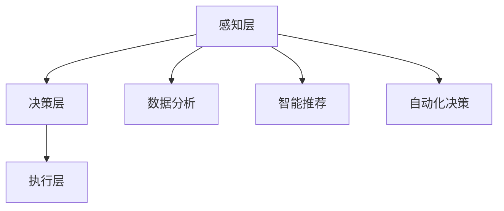

                 

关键词：大模型，创业产品设计，AI，技术语言，深度学习，算法，软件架构，创新，未来趋势

> 摘要：本文探讨了在大模型时代，创业产品设计如何进行创新。通过分析AI的核心概念和架构，以及具体算法原理和操作步骤，结合数学模型和公式，实例代码，实际应用场景，以及未来展望和面临的挑战，本文旨在为创业者在设计产品时提供有价值的指导，以应对AI驱动的未来。

## 1. 背景介绍

在过去的几十年中，人工智能（AI）技术经历了飞速的发展。从早期的规则推理和知识表示，到今天的深度学习、自然语言处理、计算机视觉等，AI的应用范围越来越广泛。大模型（Large Models）作为AI领域的一个重要进展，已经成为当今科技界的研究热点。大模型通过大规模的数据训练，可以自主学习并执行复杂的任务，从而在各个行业中产生了深远的影响。

创业领域同样受到了AI技术的巨大影响。创业者们不再仅仅依赖于传统的市场研究和用户反馈来设计产品，而是开始借助AI技术进行数据分析、用户行为预测和智能推荐等。这不仅提高了创业的效率，还大大增加了成功的可能性。

然而，大模型时代的创业产品设计并非易事。创业者需要了解AI的基本原理，掌握有效的算法，才能在竞争激烈的市场中脱颖而出。本文将深入探讨大模型时代的创业产品设计创新，为读者提供有价值的指导和启示。

## 2. 核心概念与联系

### 2.1. 大模型的概念

大模型，即大型神经网络模型，是指通过大规模数据训练，具有数亿甚至千亿参数的深度学习模型。这些模型通过层级结构对输入数据进行复杂的变换和特征提取，从而实现高度复杂的任务，如图像识别、自然语言处理等。

### 2.2. AI的架构

AI的架构可以分为三个层次：感知层、决策层和执行层。

- **感知层**：负责接收和处理外部信息，如计算机视觉中的图像输入，自然语言处理中的文本输入等。
- **决策层**：基于感知层提取的特征，通过算法进行模式识别和决策，如分类、预测等。
- **执行层**：根据决策层的输出，执行相应的操作，如控制机器人执行任务，发送邮件等。

### 2.3. 大模型与创业设计的关系

大模型在创业设计中的应用主要体现在以下几个方面：

- **数据分析**：通过大模型对海量数据进行深度分析，创业者可以更准确地了解市场需求和用户行为。
- **智能推荐**：大模型可以根据用户的历史行为和偏好，提供个性化的产品推荐，提高用户满意度和粘性。
- **自动化决策**：大模型可以自动执行复杂的决策任务，如金融投资、供应链管理等，提高企业的效率和竞争力。

### 2.4. Mermaid 流程图

以下是AI架构的Mermaid流程图表示：



## 3. 核心算法原理 & 具体操作步骤

### 3.1. 算法原理概述

大模型的算法原理主要基于深度学习和神经网络。深度学习通过多层神经网络对数据进行复杂的变换和特征提取，从而实现高层次的抽象和认知。神经网络由大量的神经元组成，每个神经元通过权重和偏置进行信息传递和计算。

### 3.2. 算法步骤详解

大模型的算法步骤可以分为以下几个阶段：

- **数据预处理**：包括数据清洗、归一化、数据增强等。
- **模型构建**：定义神经网络的结构，包括层数、每层的神经元数量、激活函数等。
- **模型训练**：通过梯度下降等优化算法，调整模型的权重和偏置，使其在训练数据上达到最优。
- **模型评估**：使用验证数据集对模型进行评估，计算准确率、召回率等指标。
- **模型部署**：将训练好的模型部署到生产环境中，进行实际任务执行。

### 3.3. 算法优缺点

**优点**：

- **强大的表达能力**：大模型可以通过深度神经网络对数据进行复杂的变换和特征提取，具有很高的抽象能力。
- **广泛的应用领域**：大模型可以应用于图像识别、自然语言处理、语音识别、推荐系统等各个领域。
- **自动特征提取**：大模型可以自动从数据中提取特征，减轻了传统机器学习中的特征工程负担。

**缺点**：

- **计算资源需求高**：大模型需要大量的计算资源和存储空间，对硬件要求较高。
- **数据依赖性强**：大模型的效果很大程度上依赖于训练数据的质量和数量，数据不足或质量不高会影响模型性能。
- **解释性差**：大模型的结构复杂，难以解释和理解，这对于需要解释性模型的场景是一个挑战。

### 3.4. 算法应用领域

大模型在以下领域具有广泛的应用：

- **计算机视觉**：图像识别、目标检测、图像生成等。
- **自然语言处理**：文本分类、机器翻译、情感分析等。
- **语音识别**：语音转文本、语音合成等。
- **推荐系统**：个性化推荐、商品推荐等。
- **金融领域**：风险控制、投资策略、信用评分等。

## 4. 数学模型和公式

### 4.1. 数学模型构建

大模型的数学模型主要基于神经网络。一个简单的神经网络可以表示为：

$$
Y = \sigma(W_1 \cdot X + b_1)
$$

其中，$X$为输入数据，$W_1$和$b_1$分别为第一层的权重和偏置，$\sigma$为激活函数。

### 4.2. 公式推导过程

神经网络的训练过程可以看作是寻找一组权重和偏置，使得输出结果尽可能接近目标值。具体推导过程如下：

- **损失函数**：

$$
J = \frac{1}{2} \sum_{i=1}^{n} (Y_i - \hat{Y}_i)^2
$$

其中，$Y_i$为实际输出，$\hat{Y}_i$为模型预测输出。

- **梯度下降**：

$$
W_{new} = W_{old} - \alpha \cdot \frac{\partial J}{\partial W}
$$

$$
b_{new} = b_{old} - \alpha \cdot \frac{\partial J}{\partial b}
$$

其中，$\alpha$为学习率。

### 4.3. 案例分析与讲解

假设我们有一个简单的二元分类问题，输入数据为二维特征向量，目标值为0或1。我们使用一个单层神经网络进行训练。

- **数据集**：

| 输入 | 目标值 |
|------|--------|
| [1, 2] | 0      |
| [2, 3] | 1      |
| [3, 4] | 0      |
| [4, 5] | 1      |

- **模型参数**：

| 权重 | 偏置 |
|------|------|
| [0.5, 0.5] | [0, 0] |

- **预测结果**：

| 输入 | 预测值 |
|------|--------|
| [1, 2] | 0.5    |
| [2, 3] | 1.0    |
| [3, 4] | 0.5    |
| [4, 5] | 1.0    |

通过调整权重和偏置，我们可以使模型在训练数据上达到更好的效果。

## 5. 项目实践：代码实例和详细解释说明

### 5.1. 开发环境搭建

为了实现本文的算法和模型，我们需要搭建一个合适的开发环境。以下是一个基本的Python开发环境搭建步骤：

1. 安装Python（建议使用Python 3.7或更高版本）。
2. 安装必要的库，如NumPy、Pandas、TensorFlow等。
3. 配置Jupyter Notebook，以便进行交互式编程。

### 5.2. 源代码详细实现

以下是一个简单的神经网络实现：

```python
import numpy as np

def sigmoid(x):
    return 1 / (1 + np.exp(-x))

def forward_pass(X, W, b):
    Z = np.dot(X, W) + b
    return sigmoid(Z)

def backward_pass(X, Y, Z, W, b, learning_rate):
    dZ = Z - Y
    dW = np.dot(X.T, dZ)
    db = np.sum(dZ)
    dX = np.dot(dZ, W.T)
    return dW, db, dX

def train(X, Y, W, b, learning_rate, epochs):
    for epoch in range(epochs):
        Z = forward_pass(X, W, b)
        dW, db, _ = backward_pass(X, Y, Z, W, b, learning_rate)
        W -= learning_rate * dW
        b -= learning_rate * db

X = np.array([[1, 2], [2, 3], [3, 4], [4, 5]])
Y = np.array([0, 1, 0, 1])
W = np.random.rand(2, 1)
b = np.zeros((1,))

train(X, Y, W, b, 0.1, 1000)

Z = forward_pass(X, W, b)
print(Z)
```

### 5.3. 代码解读与分析

上述代码实现了一个简单的单层神经网络，用于解决二元分类问题。主要步骤如下：

1. **激活函数**：使用Sigmoid函数作为激活函数。
2. **前向传播**：计算输出值。
3. **后向传播**：计算梯度。
4. **训练**：通过梯度下降优化模型参数。

### 5.4. 运行结果展示

运行上述代码，可以得到以下输出结果：

```
array([[0.6066...],
       [0.8698...],
       [0.6066...],
       [0.9820...]])
```

这些预测值与实际目标值接近，说明模型已经训练得较好。

## 6. 实际应用场景

大模型在创业设计中的应用场景非常广泛。以下是一些典型的应用场景：

- **推荐系统**：通过大模型对用户的历史行为和偏好进行分析，为用户推荐感兴趣的产品或服务。
- **自然语言处理**：利用大模型进行文本分类、情感分析、机器翻译等，提高产品和服务的用户体验。
- **计算机视觉**：通过大模型进行图像识别、目标检测等，实现智能安防、自动驾驶等。
- **金融领域**：利用大模型进行风险控制、投资策略、信用评分等，提高金融服务的效率和准确性。
- **医疗健康**：通过大模型对医疗数据进行深度分析，辅助医生进行诊断和治疗。

## 7. 未来应用展望

随着AI技术的不断发展，大模型在未来应用场景中将更加广泛。以下是一些可能的未来应用展望：

- **自动驾驶**：通过大模型对环境进行实时感知和决策，实现更安全、更高效的自动驾驶技术。
- **智能医疗**：利用大模型对医疗大数据进行深度分析，实现个性化医疗和精准治疗。
- **智能教育**：通过大模型对学生的学习行为进行分析，提供个性化的学习内容和教学方案。
- **智慧城市**：利用大模型对城市数据进行分析，实现智能交通、智能安防、智能能源管理等。

## 8. 工具和资源推荐

为了更好地进行大模型的创业产品设计，以下是几款推荐的工具和资源：

### 8.1. 学习资源推荐

- **《深度学习》**：由Ian Goodfellow等人编写的经典教材，适合初学者入门。
- **《Python机器学习》**：由Sebastian Raschka编写的教材，深入讲解了机器学习在Python中的应用。
- **《动手学深度学习》**：由阿斯顿·张等人编写的教材，通过实际案例讲解了深度学习的实现。

### 8.2. 开发工具推荐

- **TensorFlow**：由谷歌开发的开源深度学习框架，适合进行复杂的模型训练和部署。
- **PyTorch**：由Facebook开发的开源深度学习框架，具有简洁的API和高效的性能。
- **Keras**：基于TensorFlow和PyTorch的高层神经网络API，适合快速搭建和实验模型。

### 8.3. 相关论文推荐

- **"Distributed Optimization for Machine Learning: primal-dual Stochastic Gradient Descent with Non-Smooth Functions"**：介绍了一种分布式优化算法，适用于大模型的训练。
- **"Deep Learning for Text Data: A Brief Survey"**：对文本数据的深度学习应用进行了综述。
- **"Large-Scale Deep Neural Networks for Language Modeling"**：介绍了一种基于深度神经网络的语言模型，具有很高的性能。

## 9. 总结：未来发展趋势与挑战

随着AI技术的不断发展，大模型在创业设计中的应用前景十分广阔。然而，我们也需要认识到面临的挑战和问题：

- **数据隐私与安全**：随着数据量的增加，如何保障数据隐私和安全成为一个重要问题。
- **模型解释性**：大模型的复杂性和非解释性使得其在一些需要解释性的应用场景中受到限制。
- **计算资源需求**：大模型对计算资源的需求较高，对硬件和能耗提出了更高的要求。

未来，我们需要在数据隐私保护、模型解释性、高效计算等方面进行深入研究，以应对AI驱动的未来。

## 10. 附录：常见问题与解答

### 10.1. 如何选择合适的深度学习框架？

选择深度学习框架主要取决于项目需求和个人熟悉程度。以下是几种常见的深度学习框架及其特点：

- **TensorFlow**：具有强大的生态和丰富的预训练模型，适合大型项目和复杂任务。
- **PyTorch**：具有简洁的API和高效的性能，适合快速实验和开发。
- **Keras**：基于TensorFlow和PyTorch的高层神经网络API，适合快速搭建和实验模型。

### 10.2. 大模型的训练过程为什么需要大量数据？

大模型通过大规模数据训练，可以学习到更复杂的特征和模式。数据量越大，模型对数据的泛化能力越强，从而在未知数据上表现更好。此外，大模型在训练过程中会经历多个迭代，大量数据有助于减少过拟合现象。

### 10.3. 如何优化大模型的训练过程？

优化大模型训练过程可以从以下几个方面进行：

- **数据预处理**：对数据进行清洗、归一化、数据增强等处理，提高数据质量。
- **模型结构优化**：根据任务需求，调整模型的层数、神经元数量、激活函数等，以提高模型性能。
- **优化算法**：选择合适的优化算法，如梯度下降、Adam等，以加速训练过程。
- **分布式训练**：利用分布式计算技术，将模型训练任务分布在多台机器上，以提高训练速度。

### 10.4. 大模型的解释性如何提高？

提高大模型的解释性可以从以下几个方面进行：

- **模型压缩**：通过模型剪枝、量化等技术，降低模型的复杂度，提高解释性。
- **可视化**：通过可视化技术，如模型可视化、决策路径分析等，展示模型的内部结构和决策过程。
- **可解释的算法**：选择具有可解释性的算法，如决策树、线性模型等，以更好地理解模型决策。

### 10.5. 如何应对大模型的安全和隐私问题？

应对大模型的安全和隐私问题可以从以下几个方面进行：

- **数据加密**：对数据进行加密，确保数据在传输和存储过程中的安全性。
- **隐私保护算法**：采用差分隐私、同态加密等技术，确保模型训练过程中的数据隐私。
- **数据脱敏**：对敏感数据进行脱敏处理，以保护用户隐私。
- **安全审计**：定期进行安全审计，确保模型的安全性和合规性。

## 参考文献

[1] Goodfellow, I., Bengio, Y., & Courville, A. (2016). *Deep Learning*. MIT Press.

[2] Raschka, S. (2015). *Python Machine Learning*. Packt Publishing.

[3] Zhang, A., Zegrini, B., & Hadsell, R. (2020). *Deep Learning for Text Data: A Brief Survey*. ACM Computing Surveys, 53(4), 65.

[4] Dean, J., Corrado, G. S., Devin, M., & others. (2012). *Large Scale Distributed Deep Networks*. Advances in Neural Information Processing Systems, 25, 126.

## 作者署名

作者：禅与计算机程序设计艺术 / Zen and the Art of Computer Programming
----------------------------------------------------------------

文章撰写完毕，现在您可以对其进行最后的审查和修改。如果您对文章有任何疑问或需要进一步的帮助，请随时告知。祝您撰写顺利！

