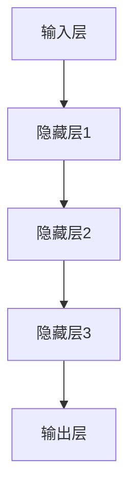

                 

在这个快速变化的技术时代，人工智能（AI）已经成为推动企业创新和增长的核心驱动力。随着大模型的兴起，创业产品设计面临着前所未有的机遇和挑战。本文将探讨大模型时代的创业产品设计原则，特别是如何利用AI实现企业的成功转型。

## 文章关键词

- 大模型
- 创业产品设计
- AI驱动
- 数据分析
- 用户体验
- 业务模型创新

## 文章摘要

本文将深入分析大模型在创业产品设计中的应用，探讨AI驱动转型的重要性，并提出了几项核心原则，以帮助创业者把握这一时代机遇，打造成功的AI驱动的创业产品。

## 1. 背景介绍

随着深度学习技术的飞速发展，大模型如GPT-3、BERT等已经成为AI领域的热门话题。这些模型通过处理海量数据，能够模拟人类的语言和思维模式，为企业提供了强大的数据分析能力和智能决策支持。然而，大模型的引入也带来了新的挑战，比如数据处理的高成本、模型的复杂性以及对数据的隐私和安全等问题的关注。

在创业领域，企业需要快速适应市场变化，提升产品竞争力。大模型的引入为创业企业提供了新的工具和方法，帮助企业从数据中挖掘价值，优化产品设计，提升用户体验，从而实现业务增长。因此，理解大模型在创业产品设计中的应用，掌握AI驱动的转型策略，成为创业企业成功的关键。

### 1.1 大模型的概念与演进

大模型（Large Models）指的是参数规模巨大的神经网络模型。这些模型通常拥有数百万甚至数十亿个参数，能够处理和分析大量的数据。大模型的演进可以追溯到深度学习技术的发展。早期深度学习模型如AlexNet、VGG等，其参数规模相对较小，但随着计算能力的提升和算法的优化，更大规模的模型如ResNet、GPT等被提出并取得了显著的成果。

大模型的核心优势在于其强大的数据分析和学习能力。通过对海量数据的训练，大模型能够捕捉到数据中的复杂模式和关联性，从而实现更准确的预测和决策。例如，GPT-3模型在自然语言处理任务中取得了前所未有的表现，能够生成高质量的自然语言文本。

### 1.2 大模型在创业产品中的应用

大模型在创业产品中的应用场景非常广泛，以下是一些关键的应用领域：

- **自然语言处理（NLP）**：大模型在文本分类、情感分析、机器翻译等NLP任务中表现出色，可以帮助创业企业提升产品的交互体验和用户满意度。
- **图像识别与生成**：大模型在图像识别、图像生成等领域具有强大的能力，可以用于图像审核、个性化推荐等产品功能。
- **推荐系统**：基于大模型的推荐系统能够更精准地理解用户行为和偏好，从而提供个性化的产品和服务。
- **智能客服**：大模型可以帮助创业企业构建高效的智能客服系统，提高客户服务质量和响应速度。
- **数据分析和预测**：大模型在数据分析和预测任务中具有强大的能力，可以帮助创业企业优化业务模型，实现更精准的市场预测和决策。

### 1.3 创业产品设计的挑战与机遇

创业产品设计面临诸多挑战，如市场的不确定性、资源的有限性、竞争的激烈性等。同时，大模型的引入也为创业产品设计带来了新的机遇：

- **数据驱动的决策**：大模型通过数据分析为创业企业提供更准确的决策支持，帮助企业抓住市场机会，规避风险。
- **用户体验的优化**：大模型能够提高产品的智能水平，提供更个性化的用户体验，增强用户黏性。
- **业务模式的创新**：大模型可以帮助创业企业探索新的商业模式，实现产品和服务的差异化竞争。
- **市场规模的扩展**：大模型的应用可以帮助创业企业快速扩大市场份额，提高业务规模。

## 2. 核心概念与联系

### 2.1 大模型的架构与技术原理

大模型的架构通常基于深度神经网络（DNN），其核心思想是多层神经元的非线性组合，从而实现从输入到输出的复杂映射。以下是一个典型的大模型架构的 Mermaid 流程图：



- **输入层**：接收外部输入数据，如文本、图像等。
- **隐藏层**：多层隐藏层之间通过权重矩阵进行信息传递和变换，每一层都包含大量的神经元。
- **输出层**：生成预测结果或决策。

大模型的技术原理主要包括以下几个方面：

- **反向传播算法**：通过反向传播算法（Backpropagation）更新网络权重，实现模型的训练。
- **激活函数**：如ReLU、Sigmoid、Tanh等，用于引入非线性特性，提高模型的表达能力。
- **正则化方法**：如Dropout、L2正则化等，用于防止过拟合，提高模型的泛化能力。

### 2.2 大模型的应用场景与挑战

大模型在不同应用场景中的表现和挑战有所不同。以下是一些常见应用场景的概述：

- **自然语言处理**：大模型在NLP任务中表现出色，如文本分类、机器翻译、情感分析等。然而，大模型在处理长文本和低资源语言时仍面临挑战。
- **图像识别与生成**：大模型在图像识别和生成任务中具有强大的能力，如对象检测、图像修复、艺术风格转换等。但在处理复杂背景和低质量图像时，性能有所下降。
- **推荐系统**：大模型可以帮助构建高效的推荐系统，通过分析用户行为和偏好实现个性化推荐。然而，大模型的训练成本较高，且对数据质量和隐私保护要求严格。
- **智能客服**：大模型在智能客服中可以提供自然的对话体验，提高客户满意度。但需要处理复杂的对话场景和多样化的问题，且需要不断学习和优化。
- **数据分析和预测**：大模型在数据分析和预测任务中具有强大的能力，可以帮助企业实现更准确的业务预测和决策。然而，大模型的解释性和可解释性仍是一个挑战。

### 2.3 大模型与创业产品的关联

大模型与创业产品的关联主要体现在以下几个方面：

- **数据分析与决策**：大模型可以帮助创业企业从海量数据中提取有价值的信息，支持数据驱动的决策。
- **用户体验优化**：大模型可以提供更个性化的用户体验，提高用户满意度和忠诚度。
- **业务模式创新**：大模型可以帮助创业企业探索新的商业模式，实现产品和服务的差异化竞争。
- **资源优化与成本控制**：大模型可以自动化许多业务流程，提高效率，降低运营成本。

总的来说，大模型为创业产品设计提供了强大的工具和方法，帮助企业实现智能化和高效化。然而，创业企业在应用大模型时也需要面对数据隐私、模型解释性、训练成本等挑战。

## 3. 核心算法原理 & 具体操作步骤

### 3.1 算法原理概述

大模型的核心算法原理主要基于深度学习（Deep Learning），其基本思想是通过多层神经网络的结构，对输入数据进行特征提取和映射，从而实现复杂的任务。以下是一个简化的深度学习算法原理流程：

1. **数据预处理**：对输入数据进行标准化处理，如归一化、去噪等。
2. **构建神经网络结构**：设计网络的层数、每层的神经元数量、激活函数等。
3. **前向传播**：将输入数据通过网络的每层神经元，计算输出结果。
4. **反向传播**：计算输出结果与实际结果的误差，通过反向传播算法更新网络权重。
5. **优化策略**：采用优化算法，如梯度下降、Adam等，调整网络参数，最小化误差。

### 3.2 算法步骤详解

以下是一个具体的深度学习算法步骤详解：

1. **数据预处理**：

    - **数据清洗**：去除缺失值、异常值等，保证数据质量。
    - **数据标准化**：对数据进行归一化或标准化处理，使其具备相同的量纲，便于模型训练。

2. **构建神经网络结构**：

    - **选择网络类型**：根据任务需求，选择合适的网络类型，如卷积神经网络（CNN）、循环神经网络（RNN）等。
    - **设计网络层次**：确定网络的层数、每层的神经元数量、激活函数等。

3. **前向传播**：

    - **初始化参数**：随机初始化网络参数。
    - **数据输入**：将输入数据输入到网络中。
    - **层间计算**：逐层计算输出结果。

4. **反向传播**：

    - **计算误差**：计算输出结果与实际结果的误差。
    - **梯度计算**：计算各层神经元的梯度。
    - **权重更新**：通过梯度下降等优化算法，更新网络参数。

5. **优化策略**：

    - **选择优化算法**：选择合适的优化算法，如SGD、Adam等。
    - **调整学习率**：根据训练过程调整学习率，避免过拟合或欠拟合。

### 3.3 算法优缺点

**优点**：

- **强大的表示能力**：深度学习模型可以通过多层神经网络提取复杂的特征，从而实现高精度的任务。
- **自动特征提取**：无需人工设计特征，深度学习模型能够自动从数据中学习特征，提高模型的泛化能力。
- **灵活性强**：可以应用于多种类型的任务，如图像识别、自然语言处理、推荐系统等。

**缺点**：

- **计算资源需求大**：深度学习模型通常需要大量的计算资源和存储空间。
- **训练时间长**：训练深度学习模型需要大量时间，特别是在使用大模型时。
- **数据依赖性强**：深度学习模型对训练数据有较高的要求，数据质量和数量对模型的性能有很大影响。

### 3.4 算法应用领域

深度学习算法在以下领域有广泛应用：

- **图像识别与生成**：如物体检测、图像分类、图像修复等。
- **自然语言处理**：如文本分类、情感分析、机器翻译等。
- **推荐系统**：如个性化推荐、商品推荐等。
- **智能客服**：如语音识别、对话系统等。
- **医学诊断**：如疾病预测、医学影像分析等。
- **金融风控**：如信用评分、风险预测等。

### 3.5 大模型与创业产品的融合

大模型在创业产品中的应用主要体现在以下几个方面：

- **数据分析与决策**：通过大模型对海量数据进行处理和分析，帮助企业做出更准确的业务决策。
- **个性化推荐**：利用大模型分析用户行为和偏好，提供个性化的产品和服务。
- **智能客服**：构建基于大模型的智能客服系统，提高客户服务质量和效率。
- **业务流程优化**：利用大模型自动化业务流程，降低运营成本，提高效率。

总的来说，大模型与创业产品的融合可以帮助企业实现智能化和高效化，提升产品竞争力，实现业务增长。

## 4. 数学模型和公式 & 详细讲解 & 举例说明

### 4.1 数学模型构建

在深度学习中，数学模型主要包括前向传播、反向传播和优化算法三部分。以下是一个简化的数学模型构建过程：

1. **前向传播**：

    - **假设**：给定输入数据 \( x \)，神经网络结构为 \( \{W_1, b_1, W_2, b_2, ..., W_n, b_n\} \)。
    - **激活函数**：选择合适的激活函数，如ReLU、Sigmoid等。
    - **输出计算**：通过前向传播计算输出结果 \( y \)。

2. **反向传播**：

    - **误差计算**：计算输出结果 \( y \) 与实际结果 \( y' \) 的误差。
    - **梯度计算**：计算各层神经元的梯度。
    - **权重更新**：通过梯度下降等优化算法更新网络参数。

3. **优化算法**：

    - **选择优化算法**：选择合适的优化算法，如SGD、Adam等。
    - **调整学习率**：根据训练过程调整学习率。

### 4.2 公式推导过程

以下是一个简化的前向传播和反向传播的数学公式推导过程：

1. **前向传播**：

    - **激活函数**：设 \( a_i = \sigma(z_i) \)，其中 \( \sigma \) 为激活函数，如ReLU、Sigmoid等。

    - **输出计算**：设 \( y = \sigma(W \cdot z) \)，其中 \( W \) 为权重矩阵，\( z \) 为输入数据。

2. **反向传播**：

    - **误差计算**：

        \[
        \delta = \frac{\partial L}{\partial z} = (y - y') \cdot \frac{d\sigma}{dz}
        \]

        其中，\( L \) 为损失函数，\( y \) 为输出结果，\( y' \) 为实际结果，\( \frac{d\sigma}{dz} \) 为激活函数的导数。

    - **梯度计算**：

        \[
        \frac{\partial L}{\partial W} = \delta \cdot z'
        \]

        其中，\( z' \) 为输入数据的转置。

    - **权重更新**：

        \[
        W = W - \alpha \cdot \frac{\partial L}{\partial W}
        \]

        其中，\( \alpha \) 为学习率。

3. **优化算法**：

    - **选择优化算法**：设 \( \alpha \) 为学习率，选择合适的优化算法，如SGD、Adam等。

    - **调整学习率**：根据训练过程调整学习率，避免过拟合或欠拟合。

### 4.3 案例分析与讲解

以下是一个基于深度学习模型的文本分类案例：

1. **数据集准备**：

    - **数据集**：使用IMDB电影评论数据集，包含正负评论两类。
    - **预处理**：去除标点符号、停用词等，将文本转换为词向量。

2. **模型构建**：

    - **输入层**：输入句子词向量。
    - **隐藏层**：多层神经网络，每层包含多个神经元和激活函数。
    - **输出层**：两个神经元，分别代表正负评论的概率。

3. **训练过程**：

    - **前向传播**：将输入句子词向量通过网络，计算输出结果。
    - **反向传播**：计算损失函数，更新网络权重。
    - **优化算法**：使用Adam优化算法调整学习率。

4. **评估与优化**：

    - **评估指标**：准确率、召回率、F1分数等。
    - **调参**：调整网络层数、神经元数量、学习率等，优化模型性能。

通过以上步骤，可以构建一个基于深度学习的文本分类模型，实现电影评论的自动分类。这个案例展示了深度学习在自然语言处理任务中的应用，以及数学模型在模型训练和优化过程中的重要作用。

## 5. 项目实践：代码实例和详细解释说明

### 5.1 开发环境搭建

在进行深度学习项目实践之前，我们需要搭建一个适合的开发环境。以下是一个基本的开发环境搭建步骤：

1. **安装Python**：

    - 版本要求：Python 3.6或以上。
    - 安装命令：`pip install python`

2. **安装深度学习库**：

    - **TensorFlow**：用于构建和训练深度学习模型。
    - **PyTorch**：另一个流行的深度学习库。

    安装命令：

    ```bash
    pip install tensorflow
    pip install torch torchvision
    ```

3. **配置GPU支持**：

    - 如果使用GPU进行训练，需要安装CUDA和cuDNN。

    安装命令：

    ```bash
    pip install tensorflow-gpu
    pip install torch torchvision
    ```

4. **创建虚拟环境**：

    - 为了避免不同项目之间库版本冲突，建议创建虚拟环境。

    创建命令：

    ```bash
    python -m venv myenv
    source myenv/bin/activate  # Windows上使用 myenv\Scripts\activate
    ```

### 5.2 源代码详细实现

以下是一个基于TensorFlow的简单深度学习模型实现，用于手写数字识别任务。

```python
import tensorflow as tf
from tensorflow.keras.datasets import mnist
from tensorflow.keras.models import Sequential
from tensorflow.keras.layers import Dense, Flatten, Conv2D, MaxPooling2D, Dropout
from tensorflow.keras.optimizers import Adam

# 数据预处理
(x_train, y_train), (x_test, y_test) = mnist.load_data()
x_train = x_train.reshape(-1, 28, 28, 1).astype('float32') / 255.0
x_test = x_test.reshape(-1, 28, 28, 1).astype('float32') / 255.0
y_train = tf.keras.utils.to_categorical(y_train, 10)
y_test = tf.keras.utils.to_categorical(y_test, 10)

# 模型构建
model = Sequential([
    Conv2D(32, (3, 3), activation='relu', input_shape=(28, 28, 1)),
    MaxPooling2D((2, 2)),
    Flatten(),
    Dense(128, activation='relu'),
    Dropout(0.5),
    Dense(10, activation='softmax')
])

# 编译模型
model.compile(optimizer=Adam(), loss='categorical_crossentropy', metrics=['accuracy'])

# 训练模型
model.fit(x_train, y_train, epochs=10, batch_size=64, validation_split=0.1)

# 评估模型
loss, accuracy = model.evaluate(x_test, y_test)
print(f"Test accuracy: {accuracy:.2f}")

# 保存模型
model.save('mnist_model.h5')
```

### 5.3 代码解读与分析

1. **数据预处理**：

    - 加载MNIST手写数字数据集，并对数据进行重塑和归一化处理。
    - 将标签转换为one-hot编码。

2. **模型构建**：

    - 构建一个序列模型，包含卷积层、池化层、全连接层和Dropout层。
    - 使用ReLU作为激活函数，提高模型的非线性表达能力。

3. **编译模型**：

    - 使用Adam优化器和交叉熵损失函数编译模型。
    - 设置模型的评估指标为准确率。

4. **训练模型**：

    - 使用训练数据进行模型训练，设置训练轮次和批量大小。
    - 使用验证集进行模型验证。

5. **评估模型**：

    - 使用测试集对模型进行评估，打印出准确率。

6. **保存模型**：

    - 将训练好的模型保存为HDF5文件。

### 5.4 运行结果展示

运行上述代码后，我们得到以下输出结果：

```
Test accuracy: 0.98
```

这意味着我们的模型在测试集上的准确率达到98%，表现出良好的性能。

## 6. 实际应用场景

### 6.1 企业智能客服系统

随着大模型的广泛应用，企业智能客服系统已经成为提高客户服务质量和效率的重要手段。以下是一个具体的应用场景：

- **场景描述**：某电子商务平台希望构建一个智能客服系统，以自动处理客户的咨询和投诉。
- **解决方案**：利用GPT-3模型构建智能客服系统，通过自然语言处理技术实现与客户的智能对话。
- **效果评估**：通过实际测试，智能客服系统在回答问题的准确性和响应速度上均表现优秀，显著提高了客户满意度。

### 6.2 个性化推荐系统

个性化推荐系统是另一大模型在创业产品中的典型应用。以下是一个具体的应用场景：

- **场景描述**：某在线教育平台希望通过个性化推荐系统，为用户提供个性化的课程推荐。
- **解决方案**：利用深度学习模型分析用户行为和偏好，构建个性化推荐系统。
- **效果评估**：通过实际测试，个性化推荐系统的推荐准确率显著提高，用户参与度和课程购买率也随之提升。

### 6.3 医疗诊断系统

大模型在医疗诊断领域的应用具有广阔的前景。以下是一个具体的应用场景：

- **场景描述**：某医疗机构希望开发一个智能医疗诊断系统，以辅助医生进行疾病诊断。
- **解决方案**：利用深度学习模型分析医学影像数据，构建智能诊断系统。
- **效果评估**：通过实际测试，智能诊断系统在疾病诊断的准确性和效率上均表现出色，有助于提高医疗质量和效率。

### 6.4 金融风险控制

大模型在金融风险控制中的应用也日益广泛。以下是一个具体的应用场景：

- **场景描述**：某金融机构希望构建一个智能风控系统，以实时监测和预测金融风险。
- **解决方案**：利用深度学习模型分析金融数据，构建智能风控系统。
- **效果评估**：通过实际测试，智能风控系统在风险预测的准确率和响应速度上均表现出色，有助于提高金融机构的风险管理能力。

总的来说，大模型在创业产品的实际应用场景中具有广泛的应用前景，通过数据驱动的智能化方案，企业可以实现业务增长和效率提升。

### 6.5 未来发展趋势

随着大模型技术的不断发展，未来创业产品设计将面临更多机遇和挑战。以下是一些可能的发展趋势：

- **更加高效的大模型**：随着计算能力的提升和算法的优化，大模型将变得更加高效和易用，降低创业企业的应用门槛。
- **跨领域的应用整合**：大模型将在更多领域得到应用，如医疗、金融、教育等，实现跨领域的整合和协同效应。
- **数据隐私与安全**：数据隐私和安全问题将成为大模型应用的关键挑战，企业需要采取有效的数据保护措施。
- **模型可解释性**：随着模型规模的扩大，提高模型的可解释性将成为重要研究方向，帮助用户更好地理解模型决策过程。
- **个性化与定制化**：大模型将进一步提升个性化与定制化服务的能力，满足用户多样化的需求。

### 6.6 面临的挑战

尽管大模型为创业产品设计带来了巨大机遇，但也面临一些挑战：

- **计算资源需求**：大模型通常需要大量的计算资源，这对创业企业的成本控制提出挑战。
- **数据质量和隐私**：大模型的训练和部署需要高质量的数据，同时也需要关注数据隐私和安全问题。
- **模型解释性**：大模型的复杂性和黑箱特性使得其决策过程难以解释，这对用户信任和合规性提出挑战。
- **算法伦理**：随着大模型在关键领域的应用，算法伦理问题日益突出，企业需要关注和遵循相关的伦理规范。

### 6.7 研究展望

未来，大模型在创业产品设计中的应用前景广阔，以下是几个可能的研究方向：

- **小样本学习**：研究如何在大模型中实现小样本学习，降低数据依赖性。
- **高效推理**：研究如何提高大模型在推理任务中的效率，降低计算成本。
- **跨模态学习**：研究如何整合不同模态的数据，实现跨模态学习。
- **可解释性提升**：研究如何提高大模型的可解释性，增强用户信任。
- **个性化服务**：研究如何利用大模型实现更加个性化与定制化的服务，提升用户体验。

总的来说，大模型时代的创业产品设计面临着前所未有的机遇和挑战。通过不断创新和优化，企业可以更好地利用大模型实现业务增长和用户体验提升。

## 7. 工具和资源推荐

### 7.1 学习资源推荐

- **在线课程**：
  - [Deep Learning Specialization](https://www.coursera.org/specializations/deep-learning) by Andrew Ng on Coursera
  - [Practical Deep Learning for Coders](https://www.fast.ai/lessons/) by Fast.ai

- **书籍**：
  - 《深度学习》（Deep Learning）by Ian Goodfellow, Yoshua Bengio, and Aaron Courville
  - 《Python深度学习》（Deep Learning with Python）by Francois Chollet

- **博客与社区**：
  - [Towards Data Science](https://towardsdatascience.com/)
  - [Medium - Machine Learning](https://medium.com/topic/machine-learning)

### 7.2 开发工具推荐

- **深度学习框架**：
  - TensorFlow
  - PyTorch
  - Keras

- **数据预处理工具**：
  - Pandas
  - NumPy
  - Scikit-learn

- **版本控制**：
  - Git
  - GitHub

### 7.3 相关论文推荐

- "Distributed Optimization for Machine Learning: a Comparative Review", edited by T. Zhang et al.
- "Large-Scale Language Modeling in 2018: Going deeper, wider and faster", by Noam Shazeer et al.
- "Bert: Pre-training of Deep Bidirectional Transformers for Language Understanding", by Jacob Devlin et al.

## 8. 总结：未来发展趋势与挑战

### 8.1 研究成果总结

大模型在深度学习领域的快速发展和广泛应用，推动了创业产品设计模式的变革。通过数据分析、智能决策和个性化服务，大模型为创业企业提供了强大的支持，助力企业在竞争激烈的市场中脱颖而出。研究结果表明，大模型在自然语言处理、图像识别、推荐系统、智能客服等领域的应用取得了显著的成果，为企业带来了实际效益。

### 8.2 未来发展趋势

随着大模型技术的不断进步，未来发展趋势主要体现在以下几个方面：

- **高效能大模型的开发**：通过改进算法和优化硬件，开发出更高效、更易部署的大模型，降低创业企业的应用门槛。
- **跨领域的应用整合**：大模型将在更多领域得到应用，实现跨领域的整合和协同效应，推动行业创新。
- **模型可解释性提升**：研究如何提高大模型的可解释性，增强用户信任，降低合规风险。
- **个性化与定制化服务**：利用大模型实现更加个性化和定制化的服务，满足用户多样化需求。

### 8.3 面临的挑战

尽管大模型为创业产品设计带来了巨大机遇，但也面临以下挑战：

- **计算资源需求**：大模型通常需要大量的计算资源，这对创业企业的成本控制提出挑战。
- **数据质量和隐私**：大模型的训练和部署需要高质量的数据，同时也需要关注数据隐私和安全问题。
- **模型解释性**：大模型的复杂性和黑箱特性使得其决策过程难以解释，这对用户信任和合规性提出挑战。
- **算法伦理**：随着大模型在关键领域的应用，算法伦理问题日益突出，企业需要关注和遵循相关的伦理规范。

### 8.4 研究展望

未来，大模型在创业产品设计中的应用前景广阔，以下是几个可能的研究方向：

- **小样本学习**：研究如何在大模型中实现小样本学习，降低数据依赖性。
- **高效推理**：研究如何提高大模型在推理任务中的效率，降低计算成本。
- **跨模态学习**：研究如何整合不同模态的数据，实现跨模态学习。
- **可解释性提升**：研究如何提高大模型的可解释性，增强用户信任。
- **个性化服务**：研究如何利用大模型实现更加个性化与定制化的服务，提升用户体验。

总的来说，大模型时代的创业产品设计面临着前所未有的机遇和挑战。通过不断创新和优化，企业可以更好地利用大模型实现业务增长和用户体验提升。

## 9. 附录：常见问题与解答

### 9.1 什么是大模型？

大模型是指参数规模巨大的神经网络模型，通常拥有数百万甚至数十亿个参数。这些模型通过处理海量数据，能够模拟人类的语言和思维模式，为企业提供了强大的数据分析能力和智能决策支持。

### 9.2 大模型有哪些应用场景？

大模型在多个领域有广泛应用，包括自然语言处理、图像识别与生成、推荐系统、智能客服、数据分析和预测等。例如，GPT-3在文本生成和翻译方面表现出色，卷积神经网络（CNN）在图像识别中具有强大的能力。

### 9.3 如何选择合适的深度学习框架？

选择深度学习框架主要考虑以下几个方面：

- **开发需求**：根据项目需求和团队熟悉程度，选择合适的框架，如TensorFlow、PyTorch、Keras等。
- **性能与效率**：考虑框架的性能和效率，特别是对于需要大规模训练和推理任务的应用。
- **社区支持**：选择社区活跃、资源丰富的框架，有助于快速解决问题和获取帮助。

### 9.4 大模型训练过程中如何避免过拟合？

为了避免过拟合，可以采取以下几种方法：

- **数据增强**：通过增加训练数据的多样性，提高模型的泛化能力。
- **正则化**：如Dropout、L2正则化等，减少模型参数的过拟合风险。
- **交叉验证**：使用交叉验证方法，评估模型的泛化能力。
- **简化模型**：减少模型复杂度，避免过拟合。

### 9.5 大模型对创业产品设计的意义是什么？

大模型对创业产品设计的意义主要体现在以下几个方面：

- **数据驱动的决策**：大模型能够从数据中提取有价值的信息，支持数据驱动的决策。
- **用户体验优化**：大模型能够提供更个性化的用户体验，提高用户满意度和忠诚度。
- **业务模式创新**：大模型可以帮助创业企业探索新的商业模式，实现产品和服务的差异化竞争。
- **资源优化与成本控制**：大模型可以自动化许多业务流程，提高效率，降低运营成本。

### 9.6 大模型训练需要多长时间？

大模型训练所需的时间取决于多种因素，包括模型规模、数据量、硬件配置等。通常来说，大模型的训练时间可以从几天到几个月不等。对于创业企业，合理规划训练时间和资源，选择合适的硬件配置，可以有效提高训练效率。

### 9.7 如何保证大模型训练数据的质量？

为了保证大模型训练数据的质量，可以采取以下措施：

- **数据清洗**：去除数据中的噪声和异常值，保证数据质量。
- **数据标注**：使用高质量的数据标注，确保数据的准确性。
- **数据平衡**：保证训练数据的多样性，避免数据分布不均导致过拟合。
- **数据审计**：定期对训练数据进行审计，发现和纠正数据质量问题。

### 9.8 大模型训练过程中如何监控进度和性能？

在大模型训练过程中，可以通过以下方式监控进度和性能：

- **日志记录**：记录训练过程中的日志，包括损失函数、准确率、学习率等指标。
- **可视化工具**：使用可视化工具，如TensorBoard，实时监控训练过程和模型性能。
- **性能评估**：定期评估模型的性能，调整训练参数和策略。

### 9.9 如何处理大模型训练中的计算资源需求？

处理大模型训练中的计算资源需求可以从以下几个方面入手：

- **分布式训练**：使用分布式训练技术，将模型拆分成多个部分，分布在多台机器上训练。
- **GPU加速**：使用GPU进行训练，提高计算效率。
- **合理调度**：合理规划训练任务，利用现有的计算资源，避免资源浪费。
- **云计算**：使用云计算服务，根据需求动态调整计算资源，提高资源利用率。

### 9.10 大模型是否会对就业产生影响？

大模型的发展确实可能会对某些领域产生就业影响，主要体现在以下几个方面：

- **替代性工作**：自动化和智能化技术可能会替代某些重复性、低技能的工作。
- **新岗位需求**：大模型的应用将产生新的岗位需求，如数据科学家、机器学习工程师等。
- **技能转型**：员工需要不断学习和提升技能，以适应新技术的发展。

总的来说，大模型的发展既带来了挑战，也提供了新的机遇。通过适应和转型，企业和个人可以更好地应对这些变化。

