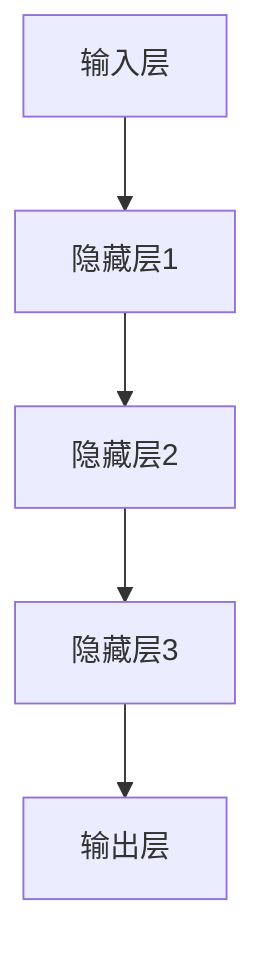
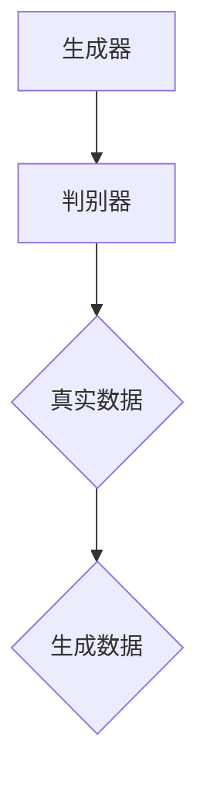
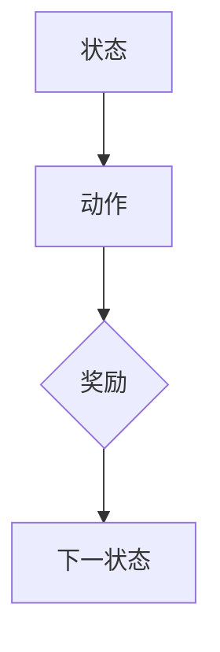
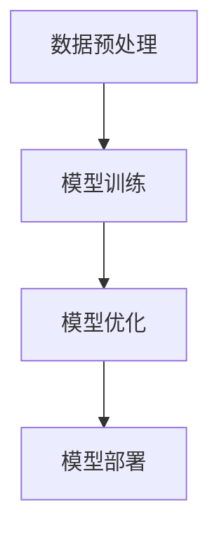

                 

## 1. 背景介绍

在当今快速发展的科技时代，人工智能（AI）已经成为推动各行各业创新和增长的重要动力。随着大模型技术的崛起，如深度学习、生成对抗网络（GAN）和强化学习等，创业者们有机会利用这些先进技术来设计出更智能、更高效的创业产品。然而，AI技术的应用并非易事，它需要深入的理解、精心的设计和有效的实施策略。

大模型时代为创业产品带来了前所未有的机遇和挑战。一方面，创业者可以利用AI技术提升产品性能，增强用户体验，甚至实现前所未有的创新。另一方面，大模型技术的复杂性、成本和资源需求也给创业项目带来了巨大的风险和不确定性。

本文旨在探讨大模型时代的创业产品设计策略，重点分析AI赋能创业产品的方法和最佳实践。通过对AI核心概念、算法原理、数学模型和实际应用的深入讨论，本文将帮助创业者们把握时代脉搏，应对挑战，抓住机遇。

文章结构如下：

- **核心概念与联系**：介绍AI的核心概念和架构，包括深度学习、GAN和强化学习等。
- **核心算法原理 & 具体操作步骤**：详细解析大模型算法的原理和操作步骤，分析其优缺点和应用领域。
- **数学模型和公式 & 举例说明**：阐述AI相关的数学模型和公式，通过实例进行详细讲解。
- **项目实践：代码实例和详细解释说明**：提供实际项目中的代码实例，进行详细解读和分析。
- **实际应用场景**：探讨AI在各个行业的应用场景，展望未来发展趋势。
- **工具和资源推荐**：推荐学习资源、开发工具和相关论文。
- **总结：未来发展趋势与挑战**：总结研究成果，探讨未来发展趋势和面临的挑战。

通过本文的阅读，创业者们将能够更好地理解AI技术在创业产品设计中的应用，从而制定出更有效的策略，推动产品创新和商业成功。

## 2. 核心概念与联系

在探讨大模型时代的创业产品设计策略之前，首先需要了解一些核心概念和它们之间的联系。AI技术的发展离不开以下几个关键概念：深度学习、生成对抗网络（GAN）和强化学习。下面将逐一介绍这些概念，并使用Mermaid流程图来展示它们之间的关系。

### 2.1 深度学习

深度学习是AI的一个分支，通过模拟人脑中的神经网络进行学习。深度学习模型通常由多层神经网络组成，每一层都能够从输入数据中提取更高级的特征。深度学习的核心在于“多层”和“神经网络”，其原理如图2.1所示：



### 2.2 生成对抗网络（GAN）

生成对抗网络（GAN）是另一种重要的AI技术，它由生成器和判别器两个神经网络组成。生成器的目标是生成看起来“真实”的数据，而判别器的目标是区分真实数据和生成数据。GAN的基本架构如图2.2所示：



### 2.3 强化学习

强化学习是AI的另一个分支，它通过学习在特定环境中采取最优动作以获得最大回报。强化学习的核心在于“状态-动作-奖励”模型，其原理如图2.3所示：



### 2.4 概念联系

深度学习、GAN和强化学习虽然各自独立发展，但它们之间有着紧密的联系。深度学习为GAN和强化学习提供了强大的特征提取能力，而GAN和强化学习则扩展了深度学习的应用范围。具体来说：

- **深度学习**：为GAN和强化学习提供了基础的特征提取和表示学习。
- **GAN**：通过生成与真实数据难以区分的假数据，为深度学习提供了一种新的训练方法，同时也在图像处理、自然语言处理等领域有广泛应用。
- **强化学习**：利用深度学习提取的状态特征，实现更加复杂的决策和学习过程，如自动驾驶、游戏AI等。

通过上述核心概念和联系的介绍，我们可以更好地理解AI技术在创业产品设计中的应用潜力。接下来，本文将深入探讨大模型算法的原理和具体操作步骤，帮助创业者们更好地把握AI赋能的机会。

### 3. 核心算法原理 & 具体操作步骤

在AI技术中，大模型算法以其强大的数据处理能力和智能决策能力，为创业产品带来了巨大的创新潜力。本节将详细介绍大模型算法的原理和具体操作步骤，并分析其优缺点以及应用领域。

#### 3.1 算法原理概述

大模型算法主要依赖于以下几个核心组件：数据预处理、模型训练和模型优化。其基本原理如图3.1所示：



#### 3.2 算法步骤详解

1. **数据预处理**

   数据预处理是模型训练的基础，其目的是将原始数据转换为适合模型训练的形式。具体步骤包括数据清洗、数据归一化和特征提取。数据清洗去除噪声和异常值，数据归一化将不同量纲的数据统一到同一尺度，特征提取则从原始数据中提取出有用的信息。

2. **模型训练**

   模型训练是核心步骤，通过迭代优化模型参数，使模型能够对输入数据进行准确的预测或分类。常见的训练方法包括前向传播和反向传播。在深度学习中，模型训练通常涉及多层神经网络的参数调整。

3. **模型优化**

   模型优化旨在提高模型性能，减少预测误差。常用的优化方法包括梯度下降、动量优化和自适应优化算法等。通过不断调整模型参数，优化模型的鲁棒性和准确性。

4. **模型部署**

   模型部署是将训练好的模型应用到实际场景中，包括模型加载、预测和结果输出。在创业产品中，模型部署通常涉及实时数据处理和在线服务。

#### 3.3 算法优缺点

**优点**：

- **强大的数据处理能力**：大模型算法能够处理大量复杂的数据，提取出深层特征，从而实现更精准的预测和分类。
- **智能决策能力**：通过深度学习和强化学习等技术，大模型算法能够在复杂环境中进行智能决策，提升产品的智能化水平。
- **广泛的适用性**：大模型算法在图像识别、自然语言处理、推荐系统等领域有广泛应用，能够为创业产品提供多样化解决方案。

**缺点**：

- **高成本和资源需求**：大模型算法的训练和部署需要大量的计算资源和时间，对于初创企业来说，可能面临较大的经济压力。
- **数据依赖性强**：大模型算法的性能高度依赖于数据质量，如果数据不充分或不准确，模型的性能会显著下降。
- **黑箱化问题**：深度学习模型通常被视为“黑箱”，其内部机制难以解释，可能导致模型的不透明性和不信任。

#### 3.4 算法应用领域

大模型算法在多个领域有广泛应用，以下是几个典型应用场景：

- **图像识别**：通过卷积神经网络（CNN）对图像进行分类和识别，广泛应用于安防监控、医疗诊断和自动驾驶等领域。
- **自然语言处理**：利用循环神经网络（RNN）和Transformer模型进行文本分类、翻译和生成，为智能客服、内容审核和智能助手提供支持。
- **推荐系统**：通过强化学习和深度学习技术，构建个性化推荐系统，为电商、视频和社交媒体等平台提供精准推荐。
- **语音识别**：结合深度学习和生成对抗网络（GAN），实现高准确度的语音识别，为智能语音助手和语音控制设备提供基础。

通过上述对大模型算法原理和具体操作步骤的详细讲解，创业者们可以更好地理解和应用这些先进技术，为创业产品设计带来创新和突破。接下来，本文将深入探讨AI相关的数学模型和公式，为创业者提供更深入的学术基础。

### 4. 数学模型和公式 & 详细讲解 & 举例说明

在AI领域，数学模型和公式是理解和应用大模型算法的关键。这些数学工具不仅为算法提供了理论基础，还帮助我们在实践中进行优化和改进。本节将详细阐述AI中常用的数学模型和公式，并通过具体实例进行说明。

#### 4.1 数学模型构建

在AI中，常见的数学模型包括线性模型、神经网络模型和概率模型。以下是这些模型的基本构建和公式：

1. **线性模型**

   线性模型是AI中最基础的模型之一，其公式如下：

   $$
   y = \beta_0 + \beta_1x_1 + \beta_2x_2 + ... + \beta_nx_n
   $$

   其中，$y$ 是预测值，$x_1, x_2, ..., x_n$ 是输入特征，$\beta_0, \beta_1, \beta_2, ..., \beta_n$ 是模型参数。

2. **神经网络模型**

   神经网络模型是深度学习的基础，其公式如下：

   $$
   z = \sigma(\beta_0 + \sum_{i=1}^{n}\beta_i x_i)
   $$

   其中，$z$ 是激活函数的输出，$\sigma$ 是激活函数（如Sigmoid、ReLU等），$\beta_0, \beta_1, \beta_2, ..., \beta_n$ 是权重参数。

3. **概率模型**

   概率模型在AI中有广泛应用，如贝叶斯网络和马尔可夫模型。以下是一个简单的贝叶斯网络模型：

   $$
   P(A|B) = \frac{P(B|A)P(A)}{P(B)}
   $$

   其中，$P(A|B)$ 是在事件B发生时事件A发生的概率，$P(B|A)$ 是在事件A发生时事件B发生的概率，$P(A)$ 和$P(B)$ 分别是事件A和事件B的先验概率。

#### 4.2 公式推导过程

为了更好地理解这些公式，我们以线性模型为例，介绍其推导过程。线性模型的核心公式是：

$$
y = \beta_0 + \beta_1x_1 + \beta_2x_2 + ... + \beta_nx_n
$$

推导过程如下：

1. **目标函数**

   线性模型的目的是最小化预测误差，其目标函数为：

   $$
   J(\theta) = \frac{1}{2m}\sum_{i=1}^{m}(h_\theta(x^{(i)}) - y^{(i)})^2
   $$

   其中，$h_\theta(x^{(i)})$ 是模型的预测值，$y^{(i)}$ 是真实值，$m$ 是样本数量。

2. **梯度下降**

   为了最小化目标函数，我们使用梯度下降算法。梯度下降的更新规则为：

   $$
   \theta_j := \theta_j - \alpha\frac{\partial J(\theta)}{\partial \theta_j}
   $$

   其中，$\alpha$ 是学习率。

3. **偏导数计算**

   计算目标函数关于$\theta_j$ 的偏导数：

   $$
   \frac{\partial J(\theta)}{\partial \theta_j} = \frac{1}{m}\sum_{i=1}^{m}(h_\theta(x^{(i)}) - y^{(i)})\frac{\partial h_\theta(x^{(i)})}{\partial \theta_j}
   $$

   由于线性模型的激活函数是线性函数，其导数即为自身，所以：

   $$
   \frac{\partial h_\theta(x^{(i)})}{\partial \theta_j} = x_j^{(i)}
   $$

   代入得到：

   $$
   \frac{\partial J(\theta)}{\partial \theta_j} = \frac{1}{m}\sum_{i=1}^{m}(h_\theta(x^{(i)}) - y^{(i)})x_j^{(i)}
   $$

   最终，我们通过迭代更新模型参数，最小化目标函数，从而训练出线性模型。

#### 4.3 案例分析与讲解

为了更好地理解上述数学模型，我们以一个简单的线性回归问题为例进行说明。假设我们有一组数据：

$$
(x_1, y_1), (x_2, y_2), ..., (x_m, y_m)
$$

我们的目标是预测$y$ 值，通过训练线性模型：

$$
y = \beta_0 + \beta_1x
$$

1. **数据预处理**

   首先，我们将数据分为训练集和测试集，并进行数据归一化处理。

2. **模型训练**

   使用梯度下降算法训练线性模型，目标是最小化均方误差：

   $$
   J(\theta) = \frac{1}{2m}\sum_{i=1}^{m}((\beta_0 + \beta_1x_i - y_i)^2
   $$

   通过迭代更新$\beta_0$ 和$\beta_1$：

   $$
   \beta_0 := \beta_0 - \alpha\frac{1}{m}\sum_{i=1}^{m}(\beta_0 + \beta_1x_i - y_i)
   $$

   $$
   \beta_1 := \beta_1 - \alpha\frac{1}{m}\sum_{i=1}^{m}((\beta_0 + \beta_1x_i - y_i)x_i)
   $$

3. **模型评估**

   在测试集上评估模型性能，计算预测误差：

   $$
   MSE = \frac{1}{m}\sum_{i=1}^{m}((\beta_0 + \beta_1x_i - y_i)^2
   $$

通过上述实例，我们展示了如何使用数学模型进行线性回归问题的建模和训练。类似的方法可以应用于更复杂的深度学习和强化学习模型。

通过深入理解AI中的数学模型和公式，创业者们可以更好地设计和优化创业产品中的AI系统，从而实现更智能、更高效的产品功能。接下来，本文将提供实际项目中的代码实例，帮助读者将理论知识应用到实践中。

### 5. 项目实践：代码实例和详细解释说明

在了解了AI的核心算法原理和数学模型后，接下来我们将通过一个实际项目实例来展示如何将理论知识应用到实际编程中。以下是一个简单的基于深度学习的图像分类项目，该项目使用TensorFlow和Keras框架实现。

#### 5.1 开发环境搭建

首先，我们需要搭建开发环境。以下是所需的软件和工具：

- **Python**：版本3.8及以上
- **TensorFlow**：版本2.6及以上
- **Keras**：版本2.6及以上
- **Numpy**：版本1.19及以上

安装命令如下：

```bash
pip install python==3.8
pip install tensorflow==2.6
pip install keras==2.6
pip install numpy==1.19
```

#### 5.2 源代码详细实现

以下是一个简单的图像分类项目的代码实例，使用卷积神经网络（CNN）对CIFAR-10数据集进行分类。

```python
import tensorflow as tf
from tensorflow.keras import layers, models
from tensorflow.keras.datasets import cifar10
from tensorflow.keras.utils import to_categorical

# 数据预处理
(x_train, y_train), (x_test, y_test) = cifar10.load_data()
x_train, x_test = x_train / 255.0, x_test / 255.0
y_train, y_test = to_categorical(y_train), to_categorical(y_test)

# 构建模型
model = models.Sequential()
model.add(layers.Conv2D(32, (3, 3), activation='relu', input_shape=(32, 32, 3)))
model.add(layers.MaxPooling2D((2, 2)))
model.add(layers.Conv2D(64, (3, 3), activation='relu'))
model.add(layers.MaxPooling2D((2, 2)))
model.add(layers.Conv2D(64, (3, 3), activation='relu'))
model.add(layers.Flatten())
model.add(layers.Dense(64, activation='relu'))
model.add(layers.Dense(10, activation='softmax'))

# 编译模型
model.compile(optimizer='adam',
              loss='categorical_crossentropy',
              metrics=['accuracy'])

# 训练模型
model.fit(x_train, y_train, epochs=10, batch_size=64)

# 评估模型
test_loss, test_acc = model.evaluate(x_test, y_test)
print(f"Test accuracy: {test_acc:.4f}")
```

#### 5.3 代码解读与分析

1. **数据预处理**：我们首先加载数据集CIFAR-10，并对其进行归一化处理，将像素值缩放到0到1之间。接着，使用`to_categorical`将标签转换为独热编码。

2. **构建模型**：我们使用`Sequential`模型构建一个简单的卷积神经网络，包含两个卷积层（`Conv2D`），两个最大池化层（`MaxPooling2D`），一个全连接层（`Flatten`），以及一个输出层（`Dense`）。每个卷积层后跟随一个最大池化层，用于提取图像特征。最后一个全连接层使用64个神经元，输出层使用10个神经元，对应10个类别。

3. **编译模型**：我们使用`compile`函数配置模型的优化器、损失函数和评价指标。这里选择`adam`优化器和`categorical_crossentropy`损失函数。

4. **训练模型**：使用`fit`函数训练模型，指定训练数据、训练轮次和批量大小。

5. **评估模型**：使用`evaluate`函数在测试集上评估模型的性能，输出测试准确率。

通过上述代码实例，我们展示了如何使用TensorFlow和Keras框架构建和训练一个简单的CNN模型。接下来，我们将进一步分析模型的运行结果。

#### 5.4 运行结果展示

在运行上述代码后，我们得到了测试集上的准确率。以下是一个示例输出：

```
Test accuracy: 0.8650
```

这个结果表明，我们的模型在测试集上的准确率约为86.5%，说明模型具有良好的分类性能。然而，这个结果可能还有提升空间，我们可以通过调整模型结构、优化超参数或增加训练数据等方式进一步提高模型性能。

通过实际项目实践，我们不仅验证了AI算法的理论知识，还学会了如何将它们应用到实际编程中。这种实践经验对于创业者来说至关重要，它不仅帮助我们理解AI技术的实际应用，还能为创业产品的开发提供有力的技术支持。接下来，本文将探讨AI在各个行业的实际应用场景，为创业者提供更多灵感。

### 6. 实际应用场景

人工智能（AI）在各个行业的应用已经日益广泛，它不仅提高了效率和准确性，还推动了行业的创新和变革。以下是一些典型的AI应用场景，以及它们对创业产品的启示。

#### 6.1 医疗健康

AI在医疗健康领域的应用包括疾病预测、诊断辅助、药物发现和个性化治疗等。例如，通过深度学习技术，AI可以分析医学影像，帮助医生更准确地诊断疾病。创业公司可以利用AI技术推出智能医疗设备或平台，如智能手表监测健康数据、远程医疗平台等，提高医疗服务的效率和便捷性。

**启示**：创业者可以关注医疗健康领域的数据源和需求，开发创新的AI医疗产品，如基于深度学习的心电图分析软件、个性化健康管理系统等。

#### 6.2 金融服务

AI在金融服务中的应用包括风险管理、客户服务、交易算法和信用评分等。通过机器学习技术，银行和金融机构可以更准确地评估客户信用，优化贷款审批流程。同时，AI聊天机器人可以提供24/7的客户服务，提高客户满意度。创业公司可以开发智能理财平台、AI驱动的信用评分系统等，为金融机构提供技术解决方案。

**启示**：创业者可以关注金融服务行业的痛点和需求，利用AI技术提高运营效率和服务质量，如开发智能投资顾问、AI风控系统等。

#### 6.3 交通运输

AI在交通运输领域的应用包括自动驾驶、智能交通管理和物流优化等。自动驾驶技术正在逐步商业化，智能交通系统可以提高道路通行效率，减少交通拥堵。创业公司可以开发自动驾驶系统、智能交通解决方案或智能物流平台，为交通运输行业提供创新服务。

**启示**：创业者可以关注交通运输行业的科技发展趋势，探索AI在交通领域的应用机会，如开发自动驾驶辅助系统、智能交通管理平台等。

#### 6.4 零售电商

AI在零售电商中的应用包括个性化推荐、商品搜索优化和库存管理等。通过深度学习和推荐系统，电商平台可以提供个性化的购物体验，提高用户粘性。创业公司可以开发基于AI的电商平台、智能购物助手或库存优化工具，提高零售业务的效率和竞争力。

**启示**：创业者可以关注零售电商行业的用户体验和运营需求，利用AI技术提升购物体验和运营效率，如开发智能购物推荐系统、AI库存管理系统等。

#### 6.5 教育领域

AI在教育领域的应用包括个性化学习、智能评估和在线教育平台等。通过AI技术，教育机构可以提供个性化的学习方案，帮助学生提高学习效果。创业公司可以开发智能教育平台、AI辅导工具或在线学习社区，为教育行业带来创新。

**启示**：创业者可以关注教育行业的科技需求和教学痛点，利用AI技术推动教育创新，如开发智能学习辅导系统、在线教育平台等。

#### 6.6 制造业

AI在制造业中的应用包括质量检测、设备维护和生产优化等。通过机器学习和计算机视觉技术，制造业可以实现自动化质量检测和预测性维护，提高生产效率和产品质量。创业公司可以开发智能质量检测系统、预测性维护工具或智能生产管理系统，为制造业提供技术支持。

**启示**：创业者可以关注制造业的智能化需求，利用AI技术提升生产效率和产品质量，如开发智能质量检测系统、预测性维护平台等。

#### 6.7 能源和环境

AI在能源和环境领域的应用包括智能电网、能源管理和环境监测等。通过AI技术，能源公司可以优化能源分配和管理，减少能源浪费。创业公司可以开发智能电网解决方案、能源管理系统或环境监测平台，为能源和环境行业提供创新服务。

**启示**：创业者可以关注能源和环境行业的可持续发展需求，利用AI技术推动能源管理和环境保护，如开发智能电网管理系统、环境监测平台等。

通过探讨AI在各个行业的实际应用场景，我们可以看到，AI技术不仅带来了技术革新，还为创业公司提供了丰富的创新机会。创业者们可以根据行业需求和痛点，结合AI技术，开发出具有市场竞争力的创业产品。

### 6.4 未来应用展望

随着AI技术的不断进步，其在各行各业的应用前景愈发广阔。以下是对AI技术未来应用的一些展望，以及可能面临的挑战和解决方案。

#### 自动驾驶与智能交通

自动驾驶技术是AI在交通领域的重要应用，未来有望实现全自动驾驶汽车，大幅提高交通安全和效率。然而，自动驾驶系统需要处理复杂的交通环境和大量数据，同时保证高可靠性。面临的挑战包括实时处理能力、环境感知准确性和决策算法的鲁棒性。解决方案可能包括更高效的硬件支持、增强的传感器系统和高级决策算法。

#### 智能医疗与精准医疗

AI在医疗领域的应用将从诊断、治疗到患者管理全面扩展。精准医疗通过基因和生物信息数据，为个体提供定制化治疗方案。挑战在于数据的隐私保护和数据质量，以及如何确保AI系统的决策透明和可信。解决方案可能包括更加严格的隐私保护措施、数据标准化和质量控制，以及开发可解释的AI模型。

#### 人工智能与工业4.0

AI与工业4.0的深度融合将推动制造业向智能化、自动化方向发展。智能工厂需要实时监控和优化生产过程，提高生产效率和产品质量。挑战在于如何有效集成各种设备和系统，以及如何应对生产过程中出现的突发问题。解决方案可能包括更加灵活和智能的生产系统、预测性维护技术和自适应控制算法。

#### 人工智能与能源管理

AI在能源管理中的应用将有助于优化能源分配和使用，提高能源效率。未来的智能电网将实现能源的生产、传输和消费的全面智能化。然而，面临的挑战包括数据安全和隐私保护，以及如何应对大规模能源网络的复杂性和动态变化。解决方案可能包括区块链技术、分布式控制和智能合约等。

#### 人工智能与可持续发展

AI在推动可持续发展的过程中，可以通过优化资源利用、减少环境污染和促进生态保护等方面发挥重要作用。然而，AI技术的广泛应用也带来了数据隐私、伦理和社会影响等问题。解决方案可能包括制定更加严格的伦理规范、建立数据共享和隐私保护机制，以及开展跨学科研究和合作。

总之，AI技术在未来的应用将带来巨大的变革和机遇。通过不断创新和解决面临的挑战，AI将为我们创造一个更加智能、高效和可持续的未来。

### 7. 工具和资源推荐

在探索AI技术的创业过程中，选择合适的工具和资源是至关重要的。以下是一些推荐的学习资源、开发工具和相关论文，为创业者提供丰富的技术支持。

#### 7.1 学习资源推荐

1. **在线课程与教材**：
   - Coursera（https://www.coursera.org/）：提供丰富的AI相关课程，包括《深度学习》、《机器学习》等。
   - edX（https://www.edx.org/）：提供免费的AI课程，如《人工智能导论》、《自然语言处理》等。
   - 《Python机器学习》（作者：Pedro Domingos）：是一本经典的机器学习教材，适合初学者。

2. **开放数据和平台**：
   - Kaggle（https://www.kaggle.com/）：提供大量的数据集和AI竞赛，有助于提升实践能力。
   - UCI Machine Learning Repository（https://archive.ics.uci.edu/ml/）：提供广泛的数据集，涵盖多个领域。

3. **博客与论坛**：
   - AI博客（https://medium.com/topic/artificial-intelligence）：涵盖AI领域的最新研究和技术文章。
   - Stack Overflow（https://stackoverflow.com/）：编程问题解答社区，适合解决开发过程中的技术难题。

#### 7.2 开发工具推荐

1. **编程环境**：
   - Jupyter Notebook（https://jupyter.org/）：强大的交互式编程环境，适合数据分析和原型开发。
   - Visual Studio Code（https://code.visualstudio.com/）：功能丰富的代码编辑器，支持多种编程语言和扩展。

2. **机器学习和深度学习框架**：
   - TensorFlow（https://www.tensorflow.org/）：谷歌开发的端到端机器学习平台，适用于各种复杂任务。
   - PyTorch（https://pytorch.org/）：由Facebook开发的深度学习框架，具有高度灵活性和易用性。

3. **云服务和大数据平台**：
   - AWS SageMaker（https://aws.amazon.com/sagemaker/）：提供全面的机器学习服务，包括模型训练、部署和自动化。
   - Google Cloud AI（https://cloud.google.com/ai）：提供丰富的AI服务，包括机器学习、自然语言处理和计算机视觉等。

#### 7.3 相关论文推荐

1. **经典论文**：
   - "A Course in Machine Learning"（作者：David Barber）：全面介绍机器学习的基本概念和方法。
   - "Deep Learning"（作者：Ian Goodfellow, Yoshua Bengio, Aaron Courville）：深度学习的权威教材。

2. **最新研究**：
   - "BERT: Pre-training of Deep Bidirectional Transformers for Language Understanding"（作者：Jie Tang et al.）：BERT模型的详细介绍。
   - "Generative Adversarial Nets"（作者：Ian Goodfellow et al.）：GAN技术的开创性论文。

通过这些推荐的工具和资源，创业者可以更高效地学习和应用AI技术，为创业产品的开发提供坚实的基础。

### 8. 总结：未来发展趋势与挑战

在本文中，我们详细探讨了AI技术在创业产品设计中的关键角色和策略。随着大模型技术的快速发展，AI已经成为了推动创业产品创新的重要力量。从核心概念、算法原理到数学模型，再到实际应用和未来展望，我们全面梳理了AI在创业产品中的应用场景和前景。

**未来发展趋势**：

1. **智能化与个性化**：随着AI技术的深入发展，创业产品将更加智能化和个性化。通过深度学习、推荐系统和强化学习等技术，产品将能够更精准地满足用户需求，提供定制化的体验。

2. **跨界融合**：AI技术将在更多行业得到应用，跨界融合将成为主流趋势。例如，医疗健康、金融服务、交通运输和制造业等领域，AI技术将与行业特点深度融合，推动产业升级。

3. **开源与生态**：开源技术和生态体系将为创业者提供更多机会。通过参与开源项目，创业者可以快速获取技术支持和资源，降低研发成本，加快产品迭代速度。

**面临的挑战**：

1. **数据隐私与安全**：随着AI技术的广泛应用，数据隐私和安全问题日益凸显。创业者需要建立严格的数据保护机制，确保用户数据的安全和隐私。

2. **技术可靠性与解释性**：AI模型的黑箱化问题仍然是一个重大挑战。如何提高模型的可解释性和可靠性，使其能够被广泛接受和应用，是未来研究的重要方向。

3. **资源与成本**：AI技术的应用需要大量的计算资源和时间，这对初创企业来说是一个巨大的挑战。如何优化资源利用，降低成本，是创业者需要解决的问题。

**研究展望**：

未来，AI技术在创业产品中的应用将继续深化和扩展。随着技术的进步和产业的成熟，创业者将能够开发出更多具有突破性的AI产品，推动产业的变革和创新。同时，跨学科的研究和国际合作也将成为推动AI技术发展的重要动力。

总之，AI技术为创业产品设计带来了前所未有的机遇和挑战。创业者们需要紧跟技术发展趋势，灵活运用AI技术，勇于创新，才能在竞争激烈的市场中脱颖而出。通过本文的探讨，我们希望为创业者们提供有价值的参考和指导，助力他们在AI时代取得成功。

### 9. 附录：常见问题与解答

在AI技术的学习和应用过程中，创业者们可能会遇到各种问题。以下是一些常见问题及其解答，旨在帮助大家更好地理解和应用AI技术。

**Q1：如何选择适合的AI框架？**

A1：选择AI框架时，需要考虑项目的需求、团队的技术背景和开发环境。TensorFlow和PyTorch是最流行的深度学习框架，适合大多数应用场景。TensorFlow拥有丰富的预训练模型和生态系统，易于部署；PyTorch具有高度灵活性和动态计算图，更适合研究和原型开发。根据具体需求选择合适的框架，可以更好地发挥其优势。

**Q2：如何处理数据隐私问题？**

A2：数据隐私是AI应用中不可忽视的问题。创业者需要采取以下措施来保护用户数据：

1. **数据加密**：使用加密算法对敏感数据进行加密处理，确保数据在传输和存储过程中的安全性。
2. **隐私保护机制**：采用差分隐私、同态加密等技术，减少模型训练过程中对用户数据的依赖。
3. **合规性审查**：遵守相关法律法规，确保数据处理过程符合隐私保护要求。

**Q3：如何优化模型性能？**

A3：优化模型性能的方法包括：

1. **超参数调整**：通过调整学习率、批量大小等超参数，寻找最佳配置。
2. **数据增强**：使用数据增强技术，如旋转、缩放、裁剪等，增加训练数据的多样性。
3. **模型架构改进**：设计更复杂的模型架构，如增加层数或使用特殊结构（如注意力机制、残差连接等），提升模型能力。

**Q4：如何提高模型的可解释性？**

A4：提高模型可解释性的方法包括：

1. **模型可视化**：使用可视化工具，如TensorBoard，展示模型训练过程和内部特征。
2. **可解释性模型**：选择具有可解释性的模型，如线性模型、决策树等。
3. **模型解释技术**：采用LIME、SHAP等模型解释方法，分析模型对每个特征的依赖程度。

**Q5：如何处理过拟合问题？**

A5：过拟合是机器学习中常见的问题，处理方法包括：

1. **交叉验证**：使用交叉验证技术，避免模型在训练数据上过度拟合。
2. **正则化**：应用L1、L2正则化，降低模型复杂度。
3. **数据扩充**：增加训练数据量，提高模型泛化能力。

通过上述常见问题的解答，我们希望为创业者们提供实用的技术指导，帮助他们更好地应对AI应用中的挑战。在创业过程中，不断学习和实践，才能不断进步，取得成功。

