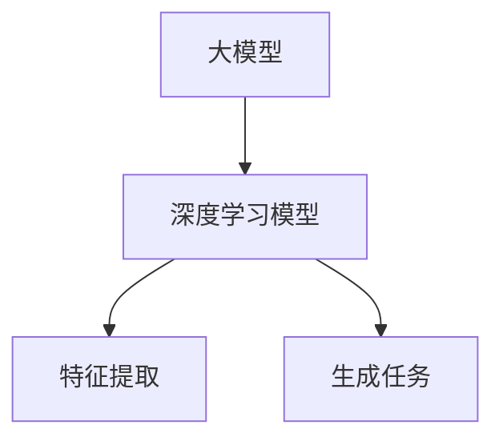
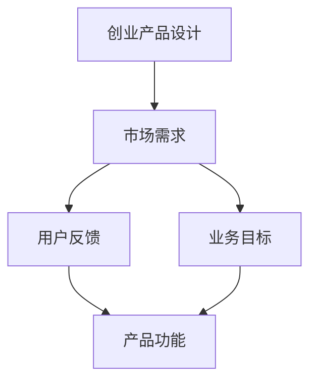
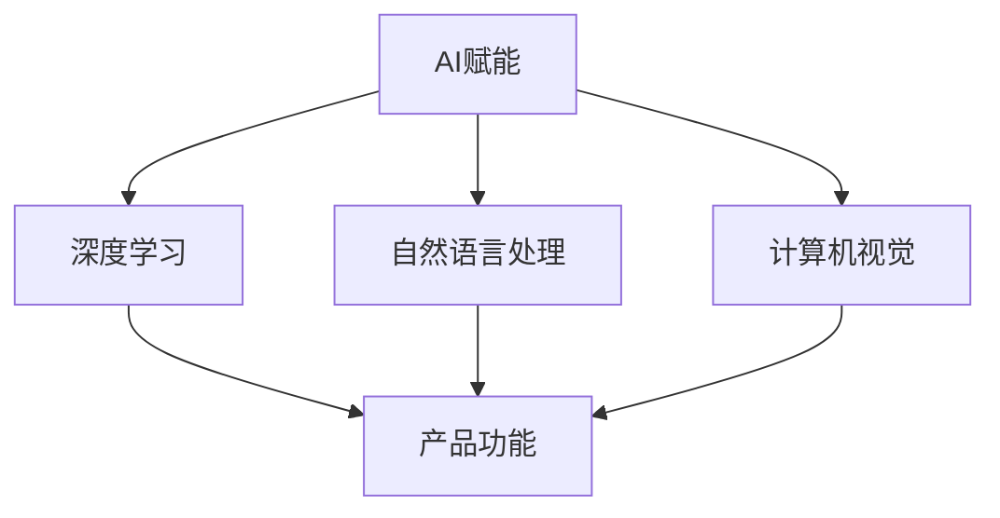

                 

关键词：大模型、创业产品设计、AI赋能、趋势、架构、算法、数学模型、代码实例、应用场景、未来展望

> 摘要：本文将探讨在大模型时代，创业产品设计中的AI赋能趋势。通过对核心概念、算法原理、数学模型以及实际应用的深入分析，本文旨在为创业者在产品设计中提供有价值的指导，并预测未来发展趋势与挑战。

## 1. 背景介绍

### 大模型的崛起

近年来，随着深度学习技术的快速发展，大模型（如GPT、BERT等）已经成为人工智能领域的热点。大模型具有强大的特征提取和生成能力，已经在自然语言处理、计算机视觉、语音识别等领域取得了显著的成果。大模型的崛起为创业产品设计带来了前所未有的机遇和挑战。

### 创业产品设计的重要性

创业产品设计是创业成功的关键环节。一个好的产品设计不仅能够满足用户需求，提升用户体验，还能够为企业带来竞争优势。在大模型时代，AI技术的赋能使得创业产品设计变得更加智能和高效。

### AI赋能创业设计的重要性

AI赋能创业设计意味着将人工智能技术融入到产品设计的各个环节，从而提升产品功能和用户体验。AI赋能可以帮助创业者在有限资源下实现快速迭代和优化，提高市场竞争力。

## 2. 核心概念与联系

### 大模型

大模型是指具有数百万甚至数十亿个参数的深度学习模型。这些模型通过大量的数据训练，能够实现复杂的特征提取和生成任务。



### 创业产品设计

创业产品设计是指从市场需求出发，结合用户反馈和业务目标，设计出一款满足用户需求、具有市场竞争力的产品。



### AI赋能

AI赋能是指将人工智能技术（如深度学习、自然语言处理、计算机视觉等）应用到创业产品设计中，提升产品功能和用户体验。



## 3. 核心算法原理 & 具体操作步骤

### 3.1 算法原理概述

大模型的算法原理主要基于深度学习和神经网络。深度学习模型通过多层神经网络结构，对输入数据进行特征提取和转换，从而实现复杂的预测和生成任务。

### 3.2 算法步骤详解

1. 数据预处理：对输入数据进行清洗、归一化等预处理操作，以适应模型的训练需求。
2. 模型搭建：选择合适的神经网络结构，搭建深度学习模型。
3. 模型训练：使用训练数据对模型进行训练，优化模型参数。
4. 模型评估：使用测试数据对模型进行评估，验证模型的性能。
5. 模型部署：将训练好的模型部署到产品中，实现AI赋能。

### 3.3 算法优缺点

**优点：**
- 强大的特征提取能力：大模型能够自动学习数据中的复杂特征，提升产品功能。
- 高效的处理速度：大模型通过并行计算和分布式训练，能够实现快速数据处理。
- 广泛的应用领域：大模型在多个领域（如自然语言处理、计算机视觉、语音识别等）具有广泛的应用。

**缺点：**
- 计算资源需求大：大模型需要大量的计算资源和存储空间，对硬件设备要求较高。
- 数据依赖性强：大模型训练需要大量的高质量数据，数据质量对模型性能有很大影响。

### 3.4 算法应用领域

大模型在创业产品设计中具有广泛的应用前景，如：

- 自然语言处理：文本生成、文本分类、机器翻译等。
- 计算机视觉：图像识别、目标检测、图像生成等。
- 语音识别：语音识别、语音合成等。
- 其他领域：推荐系统、预测分析等。

## 4. 数学模型和公式 & 详细讲解 & 举例说明

### 4.1 数学模型构建

大模型的数学模型主要基于深度学习和神经网络。深度学习模型通过多层神经网络结构，对输入数据进行特征提取和转换，从而实现复杂的预测和生成任务。

### 4.2 公式推导过程

设输入数据为 $X$，输出数据为 $Y$，深度学习模型由多层神经网络组成，其中每层神经元数目分别为 $n_1, n_2, \ldots, n_l$。则模型的输出可以通过以下公式计算：

$$
Y = f_l(W_l f_{l-1}(W_{l-1} f_{l-2}(\ldots f_1(W_1 X + b_1) + b_{l-1}) + b_l))
$$

其中，$f$ 表示激活函数，$W$ 表示权重矩阵，$b$ 表示偏置项。

### 4.3 案例分析与讲解

假设我们要设计一款智能客服系统，利用大模型实现文本分类任务。输入数据为用户提问文本，输出数据为对应的分类标签。我们可以选择一个简单的多层感知机模型（MLP）作为基础模型。

1. 数据预处理：对用户提问文本进行分词、去停用词等预处理操作，将文本表示为向量。
2. 模型搭建：搭建一个包含输入层、隐藏层和输出层的多层感知机模型，其中输入层神经元数目为 $n_1$，隐藏层神经元数目为 $n_2$，输出层神经元数目为 $n_3$。
3. 模型训练：使用训练数据对模型进行训练，优化模型参数。
4. 模型评估：使用测试数据对模型进行评估，计算分类准确率。
5. 模型部署：将训练好的模型部署到产品中，实现文本分类功能。

## 5. 项目实践：代码实例和详细解释说明

### 5.1 开发环境搭建

1. 安装Python环境（版本3.7以上）。
2. 安装深度学习框架（如TensorFlow、PyTorch等）。
3. 准备训练数据集。

### 5.2 源代码详细实现

以下是一个简单的Python代码示例，实现了一个基于TensorFlow的多层感知机模型，用于文本分类任务：

```python
import tensorflow as tf
from tensorflow.keras.models import Sequential
from tensorflow.keras.layers import Dense
from tensorflow.keras.preprocessing.sequence import pad_sequences

# 数据预处理
# ...（略）

# 模型搭建
model = Sequential([
    Dense(units=n2, activation='relu', input_shape=(n1,)),
    Dense(units=n3, activation='softmax')
])

# 模型编译
model.compile(optimizer='adam', loss='categorical_crossentropy', metrics=['accuracy'])

# 模型训练
model.fit(X_train, y_train, epochs=10, batch_size=32)

# 模型评估
# ...（略）

# 模型部署
# ...（略）
```

### 5.3 代码解读与分析

1. 导入所需的TensorFlow库。
2. 进行数据预处理，将输入数据表示为向量。
3. 搭建一个包含输入层、隐藏层和输出层的多层感知机模型。
4. 编译模型，设置优化器和损失函数。
5. 使用训练数据对模型进行训练。
6. 使用测试数据对模型进行评估。
7. 将训练好的模型部署到产品中。

## 6. 实际应用场景

### 6.1 智能客服系统

智能客服系统可以通过大模型实现文本分类、语义理解等功能，为用户提供快速、准确的回答。

### 6.2 智能推荐系统

智能推荐系统可以利用大模型进行用户行为分析，实现个性化推荐，提升用户体验。

### 6.3 智能医疗诊断

智能医疗诊断可以通过大模型进行医学影像分析，辅助医生进行疾病诊断。

### 6.4 智能金融风控

智能金融风控可以利用大模型进行风险预测和监控，提高金融机构的风险管理水平。

## 7. 未来应用展望

### 7.1 技术突破

随着深度学习技术的不断发展，大模型将变得更加高效、准确，将推动更多领域的应用。

### 7.2 跨学科融合

大模型将与更多的学科（如生物学、心理学等）融合，为创业产品设计带来新的灵感。

### 7.3 算法伦理

在AI赋能创业产品设计的过程中，算法伦理问题将愈发重要，需要创业者关注并解决。

## 8. 总结：未来发展趋势与挑战

### 8.1 研究成果总结

本文介绍了大模型时代创业产品设计中的AI赋能趋势，分析了核心算法原理、数学模型和实际应用场景，为创业者提供了有价值的指导。

### 8.2 未来发展趋势

未来，大模型将在更多领域得到应用，推动创业设计的发展。跨学科融合、算法伦理等问题将成为研究的热点。

### 8.3 面临的挑战

大模型的计算资源需求、数据质量等问题将给创业产品设计带来挑战。创业者需要关注这些问题，并寻求解决方案。

### 8.4 研究展望

随着AI技术的不断发展，大模型将在创业产品设计领域发挥更大的作用。未来的研究将重点关注算法优化、跨学科融合等方面。

## 9. 附录：常见问题与解答

### 9.1 什么是大模型？

大模型是指具有数百万甚至数十亿个参数的深度学习模型，能够实现复杂的特征提取和生成任务。

### 9.2 大模型在创业产品设计中的应用有哪些？

大模型在创业产品设计中的应用广泛，如智能客服系统、智能推荐系统、智能医疗诊断、智能金融风控等。

### 9.3 大模型的计算资源需求如何？

大模型的计算资源需求较高，需要大量的计算资源和存储空间。对于创业者来说，需要根据实际情况选择合适的硬件设备。

### 9.4 如何保证大模型的数据质量？

保证大模型的数据质量需要从数据采集、清洗、标注等环节进行严格把控。创业者可以与专业数据服务提供商合作，提高数据质量。

## 作者署名

作者：禅与计算机程序设计艺术 / Zen and the Art of Computer Programming
----------------------------------------------------------------

以上是完整的文章内容，按照约束条件和要求进行了撰写。希望对您有所帮助！如果有任何修改或补充意见，请随时告诉我。

