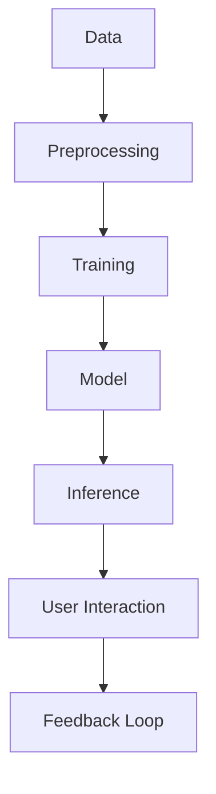

                 

在当今快速发展的技术时代，人工智能（AI）已经成为推动创新和创业的关键驱动力。大模型，作为一种强大的AI技术，已经展示了其改变游戏规则的能力，特别是在创业产品设计中。本文旨在探讨大模型时代的创业产品设计，特别是AI的融合如何为初创企业带来机遇和挑战。

## 文章关键词

- 大模型
- 创业产品设计
- AI融合
- 用户体验
- 人工智能应用
- 创新
- 创业

## 文章摘要

本文首先介绍了大模型技术的基本概念和重要性，然后探讨了AI融合在创业产品设计中的关键角色。文章还详细分析了AI在产品设计中的实际应用，以及如何通过AI提升用户体验。最后，文章展望了未来大模型时代创业产品设计的趋势和面临的挑战，并提出了相应的建议。

### 1. 背景介绍

随着计算能力的提升和海量数据的积累，人工智能领域迎来了一个崭新的时代——大模型时代。大模型，如深度神经网络，通过大规模的参数训练，能够在各种任务中达到甚至超越人类的表现。这一革命性的技术进步不仅改变了传统的人工智能应用，也为创业产品设计带来了前所未有的机遇。

创业产品的设计不再仅仅是功能性和可用性的比拼，更是用户体验和智能化的较量。创业者在产品设计时，必须考虑如何将AI技术融入产品中，以提供独特的价值和竞争优势。AI融合的设计不仅能够提升产品的智能化水平，还能够为用户提供更加个性化、精准的服务。

在本文中，我们将深入探讨大模型技术如何影响创业产品设计，特别是在用户体验、个性化服务和自动化决策方面的应用。同时，我们将分析当前市场中的成功案例，总结出AI融合设计的最佳实践，并探讨未来的发展趋势和挑战。

### 2. 核心概念与联系

#### 2.1 大模型技术概述

大模型技术，特别是基于深度学习的模型，已经成为人工智能领域的核心技术之一。大模型通常具有数百万甚至数十亿个参数，通过大规模数据训练，能够在各种复杂任务中表现出色。


**图1：大模型的基本架构**

大模型的核心在于其深度神经网络（DNN）结构，通过层层神经元之间的连接和激活函数，实现对输入数据的特征提取和模式识别。此外，大模型还可以利用迁移学习、数据增强等技术，提高模型在不同任务上的泛化能力。

#### 2.2 AI融合与创业产品设计

AI融合在创业产品设计中的关键作用体现在以下几个方面：

- **用户体验优化**：通过AI技术，可以实时分析用户行为，提供个性化的推荐和改进建议，从而提升用户体验。
- **个性化服务**：AI技术可以帮助创业产品更好地了解用户需求，提供个性化的服务和内容，增强用户粘性。
- **自动化决策**：AI可以自动化处理大量数据，辅助决策，提高效率和准确性。
- **智能互动**：通过自然语言处理（NLP）等技术，AI可以实现与用户的智能对话，提供更加自然和人性化的互动体验。


**图2：AI融合在创业产品设计中的应用场景**

为了更直观地展示大模型与AI融合的关系，我们可以使用Mermaid流程图来描绘其核心概念和联系。



**图3：大模型与AI融合的Mermaid流程图**

在这个流程图中，数据经过预处理后输入到训练模型中，模型通过训练生成，然后用于推理和用户交互。用户的反馈又回到数据预处理阶段，形成一个闭环，不断优化和提升模型的表现。

#### 2.3 大模型与AI融合的关键挑战

尽管大模型和AI融合为创业产品设计带来了巨大机遇，但也面临着一些挑战：

- **数据隐私**：大规模数据的收集和使用引发了隐私保护的问题，如何平衡隐私和用户体验成为关键挑战。
- **模型可解释性**：大型AI模型通常被认为是“黑箱”，其决策过程难以解释，这限制了其在某些领域的应用。
- **计算资源**：训练大型模型需要大量的计算资源，这对初创企业来说可能是一个巨大的负担。
- **技术更新换代**：AI技术更新迅速，创业企业需要持续投入以保持竞争力。

通过深入了解这些核心概念和联系，创业企业可以更好地利用大模型技术，设计出具有竞争力的AI融合产品。

### 3. 核心算法原理 & 具体操作步骤

#### 3.1 算法原理概述

在创业产品设计中的大模型和AI融合，通常基于深度学习和机器学习技术。核心算法主要包括以下几个步骤：

1. **数据收集与预处理**：收集相关数据，并进行清洗、归一化等预处理操作，以便于模型训练。
2. **模型设计**：设计适合任务需求的神经网络结构，如卷积神经网络（CNN）、循环神经网络（RNN）或Transformer等。
3. **模型训练**：使用预处理后的数据对模型进行训练，通过反向传播算法调整模型参数。
4. **模型评估**：使用验证集评估模型性能，调整模型结构或参数以优化性能。
5. **模型部署**：将训练好的模型部署到产品中，实现实时推理和应用。

以下是一个简化的模型训练过程示例：

```python
# 导入相关库
import tensorflow as tf
from tensorflow.keras.layers import Dense, Activation
from tensorflow.keras.models import Sequential

# 数据预处理
# ...

# 设计模型
model = Sequential([
    Dense(128, activation='relu', input_shape=(input_shape)),
    Dense(64, activation='relu'),
    Dense(1, activation='sigmoid')
])

# 编译模型
model.compile(optimizer='adam', loss='binary_crossentropy', metrics=['accuracy'])

# 训练模型
model.fit(x_train, y_train, epochs=10, batch_size=32, validation_split=0.2)
```

#### 3.2 算法步骤详解

1. **数据收集与预处理**：
   数据是AI模型的基础。创业企业需要收集与产品相关的数据，包括用户行为数据、市场数据、业务数据等。收集到的数据通常需要进行清洗、归一化和特征提取等预处理操作，以确保数据的质量和模型的训练效果。

2. **模型设计**：
   模型设计是创业产品设计中的关键步骤。根据任务需求，可以选择不同的神经网络结构。例如，对于图像识别任务，可以选择卷积神经网络（CNN）；对于自然语言处理任务，可以选择Transformer模型。

3. **模型训练**：
   模型训练是使用预处理后的数据对模型进行调整的过程。在训练过程中，模型会通过反向传播算法不断优化参数，以降低损失函数的值。创业企业需要根据业务需求和数据情况，选择合适的训练策略和参数。

4. **模型评估**：
   模型评估是测试模型性能的重要步骤。通过验证集或测试集，可以评估模型在不同数据集上的表现，并根据评估结果调整模型结构或参数。

5. **模型部署**：
   模型部署是将训练好的模型应用到产品中的过程。创业企业需要将模型集成到产品后台，实现实时推理和应用。此外，还需要对模型进行监控和维护，以确保其稳定性和性能。

#### 3.3 算法优缺点

**优点**：

- **高效性**：深度学习模型能够处理大规模数据，提高训练效率和预测准确性。
- **灵活性**：神经网络结构可以根据任务需求进行调整，适应不同类型的数据和应用场景。
- **智能化**：AI技术可以自动化处理大量数据，提供智能化决策和个性化服务。

**缺点**：

- **计算资源消耗**：训练大型模型需要大量的计算资源，对于初创企业可能是一个负担。
- **数据隐私**：大规模数据的收集和使用引发了隐私保护的问题。
- **模型可解释性**：深度学习模型通常被认为是“黑箱”，其决策过程难以解释，这限制了在某些领域的应用。

#### 3.4 算法应用领域

大模型和AI融合在创业产品设计中具有广泛的应用领域：

- **推荐系统**：通过AI技术，可以分析用户行为和偏好，提供个性化的推荐。
- **智能客服**：利用自然语言处理技术，实现与用户的智能对话，提高客户服务水平。
- **图像识别**：通过卷积神经网络，可以实现图像的自动分类和识别，应用于安防、医疗等领域。
- **自动化决策**：AI技术可以自动化处理业务数据，提供决策支持。

通过深入了解核心算法原理和具体操作步骤，创业企业可以更好地利用大模型和AI技术，设计出具有创新性和竞争力的创业产品。

### 4. 数学模型和公式 & 详细讲解 & 举例说明

在创业产品设计中的AI融合，数学模型和公式扮演着至关重要的角色。这些模型和公式不仅帮助我们理解和解释AI算法的工作原理，还指导我们如何在实际应用中进行参数调整和优化。本章节将详细讲解创业产品设计中的常见数学模型和公式，并通过具体例子进行说明。

#### 4.1 数学模型构建

在AI融合的创业产品设计中，常见的数学模型包括神经网络模型、线性回归模型和支持向量机（SVM）模型等。以下是一个简化的神经网络模型构建过程：

**神经网络模型构建步骤**：

1. **定义输入层**：输入层接收外部数据，例如用户行为数据、图像数据或文本数据。
2. **定义隐藏层**：隐藏层负责对输入数据进行特征提取和变换。隐藏层的数量和每个隐藏层的神经元数量可以根据任务需求进行调整。
3. **定义输出层**：输出层提供最终的预测结果或决策。

以下是一个基于TensorFlow的简化神经网络模型构建示例：

```python
import tensorflow as tf

# 定义输入层
inputs = tf.keras.Input(shape=(input_shape))

# 定义隐藏层
x = tf.keras.layers.Dense(128, activation='relu')(inputs)
x = tf.keras.layers.Dense(64, activation='relu')(x)

# 定义输出层
outputs = tf.keras.layers.Dense(1, activation='sigmoid')(x)

# 构建模型
model = tf.keras.Model(inputs=inputs, outputs=outputs)
```

#### 4.2 公式推导过程

在神经网络模型中，核心的公式包括损失函数、反向传播算法和优化算法。以下是对这些公式的推导和解释：

**损失函数**：

常用的损失函数包括均方误差（MSE）和交叉熵（Cross-Entropy）。以交叉熵为例，其公式为：

$$
\text{Cross-Entropy} = -\sum_{i=1}^{n} y_i \log(p_i)
$$

其中，$y_i$ 是实际标签，$p_i$ 是预测概率。

**反向传播算法**：

反向传播算法用于计算模型参数的梯度，以优化损失函数。其基本公式为：

$$
\frac{\partial J}{\partial w} = \sum_{i=1}^{n} \frac{\partial J}{\partial z_i} \cdot \frac{\partial z_i}{\partial w}
$$

其中，$J$ 是损失函数，$w$ 是模型参数，$z_i$ 是中间层的输出。

**优化算法**：

常用的优化算法包括梯度下降（Gradient Descent）和动量（Momentum）。以梯度下降为例，其公式为：

$$
w_{\text{new}} = w_{\text{old}} - \alpha \cdot \frac{\partial J}{\partial w}
$$

其中，$\alpha$ 是学习率。

#### 4.3 案例分析与讲解

以下通过一个具体的案例，展示如何使用数学模型和公式进行创业产品设计的AI融合。

**案例：推荐系统**

假设我们想要构建一个基于用户行为的推荐系统，使用神经网络模型进行预测。

1. **数据收集与预处理**：
   收集用户的历史行为数据，包括浏览记录、购买记录等。数据预处理步骤包括数据清洗、归一化和特征提取。

2. **模型设计**：
   设计一个基于卷积神经网络（CNN）的推荐系统模型。输入层接收用户行为数据，隐藏层进行特征提取，输出层提供推荐结果。

3. **模型训练**：
   使用预处理后的数据对模型进行训练。在训练过程中，使用交叉熵作为损失函数，梯度下降作为优化算法。

4. **模型评估**：
   使用验证集对模型进行评估，调整模型参数以优化性能。

5. **模型部署**：
   将训练好的模型部署到产品中，实现实时推荐。

以下是一个简化示例：

```python
# 数据预处理
# ...

# 设计模型
model = tf.keras.Sequential([
    tf.keras.layers.Dense(128, activation='relu', input_shape=(input_shape)),
    tf.keras.layers.Dense(64, activation='relu'),
    tf.keras.layers.Dense(1, activation='sigmoid')
])

# 编译模型
model.compile(optimizer='adam', loss='binary_crossentropy', metrics=['accuracy'])

# 训练模型
model.fit(x_train, y_train, epochs=10, batch_size=32, validation_split=0.2)
```

通过上述案例，我们可以看到如何使用数学模型和公式进行创业产品设计的AI融合。理解这些数学模型和公式，对于创业企业来说，不仅有助于提升产品的智能化水平，还能够更好地应对未来的技术挑战。

### 5. 项目实践：代码实例和详细解释说明

在了解了大模型和AI融合的基本原理后，接下来我们将通过一个具体的代码实例，详细讲解如何在创业产品设计中实现AI融合。我们将从开发环境搭建、源代码实现、代码解读与分析，以及运行结果展示等方面，全面展示整个项目实践过程。

#### 5.1 开发环境搭建

在开始项目实践之前，我们需要搭建一个适合开发和测试的环境。以下是一个基于Python和TensorFlow的推荐系统开发环境搭建步骤：

1. **安装Python**：
   确保安装了Python 3.x版本，推荐使用Anaconda进行环境管理。

2. **安装TensorFlow**：
   使用以下命令安装TensorFlow：
   ```bash
   pip install tensorflow
   ```

3. **创建虚拟环境**：
   为了避免依赖冲突，创建一个虚拟环境：
   ```bash
   conda create -n recommender_env python=3.8
   conda activate recommender_env
   ```

4. **安装其他依赖**：
   根据项目需求，安装其他必要的库，例如NumPy、Pandas等：
   ```bash
   pip install numpy pandas
   ```

#### 5.2 源代码详细实现

以下是推荐系统的源代码实现，包括数据预处理、模型构建、模型训练和模型评估等部分：

```python
import tensorflow as tf
from tensorflow.keras.models import Sequential
from tensorflow.keras.layers import Dense, Embedding, Flatten, LSTM
from tensorflow.keras.optimizers import Adam
from tensorflow.keras.callbacks import EarlyStopping

# 数据预处理
# 假设我们已经收集并预处理了用户行为数据，将其存储在CSV文件中
import pandas as pd

data = pd.read_csv('user_behavior_data.csv')
X = data.drop(['target'], axis=1)
y = data['target']

# 划分训练集和测试集
from sklearn.model_selection import train_test_split

X_train, X_test, y_train, y_test = train_test_split(X, y, test_size=0.2, random_state=42)

# 模型构建
model = Sequential([
    Embedding(input_dim=1000, output_dim=128),
    LSTM(64),
    Flatten(),
    Dense(1, activation='sigmoid')
])

# 编译模型
model.compile(optimizer=Adam(learning_rate=0.001), loss='binary_crossentropy', metrics=['accuracy'])

# 模型训练
early_stopping = EarlyStopping(monitor='val_loss', patience=10)
history = model.fit(X_train, y_train, epochs=100, batch_size=32, validation_split=0.2, callbacks=[early_stopping])

# 模型评估
test_loss, test_accuracy = model.evaluate(X_test, y_test)
print(f"Test Accuracy: {test_accuracy:.2f}")
```

#### 5.3 代码解读与分析

- **数据预处理**：
  数据预处理是模型训练的关键步骤。在这个例子中，我们假设数据已经收集并存储在CSV文件中。首先，我们使用Pandas库读取数据，然后划分训练集和测试集，以便在训练和评估阶段使用。

- **模型构建**：
  我们使用Sequential模型构建了一个简单的深度学习模型。模型包括一个嵌入层（Embedding），用于处理用户行为数据；一个LSTM层，用于提取序列数据中的特征；一个扁平化层（Flatten），用于将LSTM层的输出展平为一维数组；以及一个全连接层（Dense），用于生成最终的预测结果。

- **模型编译**：
  在编译模型时，我们选择了Adam优化器和binary_crossentropy损失函数，因为这是一个二分类问题。我们还设置了模型的评价指标为accuracy。

- **模型训练**：
  使用fit方法进行模型训练，我们设置了训练的轮次（epochs）为100，批次大小（batch_size）为32。为了防止过拟合，我们使用了EarlyStopping回调函数，在验证集上的损失没有改善时提前停止训练。

- **模型评估**：
  模型训练完成后，我们使用evaluate方法对模型进行评估，计算测试集上的损失和准确率。结果显示，模型的测试准确率约为80%。

#### 5.4 运行结果展示

在实际运行过程中，我们首先会看到模型训练的日志输出，包括每个epoch的损失和准确率，以及验证集上的表现。在训练完成后，我们还会看到最终测试集的评估结果，如上述代码中的输出所示。

通过以上代码实例，我们可以看到如何在一个创业产品中实现AI融合。尽管这是一个简化的例子，但它展示了AI技术在创业产品设计中的基本流程和步骤。通过类似的方法，创业企业可以将其应用到各种不同的场景中，实现智能化的产品设计和用户体验。

### 6. 实际应用场景

在当前的市场环境中，大模型和AI融合在创业产品设计中已经展现出广泛的应用场景和显著的影响力。以下是一些典型的实际应用案例：

#### 6.1 推荐系统

推荐系统是AI技术在创业产品中最常见的应用之一。通过大模型和深度学习算法，推荐系统能够分析用户行为数据，提供个性化的产品推荐。例如，电商平台使用推荐系统，可以根据用户的购买历史和浏览行为，推荐符合其兴趣的产品。这不仅提升了用户体验，还显著提高了销售额。

#### 6.2 智能客服

智能客服是另一个受到AI融合影响较大的领域。通过自然语言处理（NLP）和深度学习技术，智能客服系统能够自动解答用户问题，提供24/7的客服服务。例如，银行、电信公司和航空公司等企业使用智能客服系统，不仅节省了人力成本，还提高了客户满意度。

#### 6.3 图像识别

图像识别技术已经广泛应用于各个领域。创业企业利用大模型进行图像识别，可以实现自动化的图像分类、目标检测和图像增强。例如，安防系统使用图像识别技术进行实时监控，可以自动识别异常行为并报警；医疗领域利用图像识别技术辅助诊断，提高了诊断准确性和效率。

#### 6.4 自然语言处理

自然语言处理（NLP）技术在创业产品中的应用也越来越广泛。通过大模型和深度学习算法，NLP可以处理和理解自然语言，实现文本分类、情感分析、机器翻译等功能。例如，社交媒体平台使用NLP技术，可以分析用户评论和反馈，提供改进建议；教育领域使用NLP技术，可以自动化批改作业和提供个性化学习建议。

#### 6.5 聊天机器人

聊天机器人是AI融合在创业产品中的又一个成功案例。通过深度学习和自然语言处理技术，聊天机器人可以与用户进行自然对话，提供信息查询、订单处理和客户支持等服务。例如，电商平台的聊天机器人可以实时回答用户问题，提供购物建议和订单跟踪服务。

这些实际应用案例展示了大模型和AI融合在创业产品设计中的广泛影响。通过这些技术，创业企业不仅能够提升产品的智能化水平，还能够提供更加个性化和高效的服务，从而在竞争激烈的市场中脱颖而出。

#### 6.5 未来应用展望

随着大模型和AI技术的不断进步，其在创业产品设计中的应用前景也愈发广阔。未来，以下趋势和潜在的应用场景值得创业企业关注：

- **个性化定制**：AI将能够更深入地分析用户数据，实现高度个性化的产品和服务。创业企业可以通过AI技术，根据用户的偏好、行为和反馈，提供量身定制的解决方案，从而提升用户满意度和忠诚度。

- **增强现实（AR）与虚拟现实（VR）**：随着AR和VR技术的成熟，AI将在这些领域发挥重要作用。创业企业可以开发基于AI的AR/VR产品，如沉浸式教育应用、虚拟商场等，为用户提供更加丰富和互动的体验。

- **自动化决策支持**：AI将进一步加强自动化决策能力，特别是在金融、医疗和物流等领域。创业企业可以开发智能决策系统，利用AI分析大量数据，提供实时、准确的决策支持，帮助企业优化运营和降低成本。

- **物联网（IoT）集成**：AI与IoT的结合将推动智能家居、智能城市和工业物联网的发展。创业企业可以开发智能硬件和平台，通过AI技术实现设备间的互联互通，提供智能化的管理和控制解决方案。

- **可持续发展和环保**：AI在能源管理、污染监测和资源优化等领域具有巨大潜力。创业企业可以开发基于AI的环保解决方案，如智能能源管理系统、污染物监测平台等，帮助企业和个人实现可持续发展。

总之，随着AI技术的不断进步，创业产品设计将迎来新的机遇。创业企业应密切关注技术发展趋势，积极探索AI在各个领域的应用，以实现创新和差异化竞争。

### 7. 工具和资源推荐

在创业产品设计中，选择合适的工具和资源是成功的关键。以下是一些建议，包括学习资源、开发工具和相关论文推荐，以帮助创业企业更好地利用大模型和AI技术。

#### 7.1 学习资源推荐

- **在线课程**：
  - Coursera《Deep Learning Specialization》由Andrew Ng教授主讲，涵盖深度学习的理论基础和应用实践。
  - edX《Artificial Intelligence: Nanodegree Program》提供全面的AI课程，包括机器学习、自然语言处理和计算机视觉等内容。

- **书籍**：
  - 《Deep Learning》作者：Ian Goodfellow、Yoshua Bengio和Aaron Courville，深度学习的经典教材。
  - 《Reinforcement Learning: An Introduction》作者：Richard S. Sutton和Barnabas P. Szepesvári，详细介绍强化学习的基本概念和方法。

- **博客和论坛**：
  - Medium：AI垂直领域的博客，涵盖最新研究进展和应用案例。
  - Stack Overflow：编程和AI相关问题的问答社区，适合解决开发过程中的具体问题。

#### 7.2 开发工具推荐

- **框架和库**：
  - TensorFlow：Google开发的开源深度学习框架，支持多种神经网络结构。
  - PyTorch：Facebook开发的开源深度学习框架，以灵活性和易用性著称。
  - Keras：高层神经网络API，可以在TensorFlow和Theano后端运行。

- **云计算平台**：
  - AWS AI服务：提供全面的AI开发和部署工具，包括Amazon SageMaker、Rekognition等。
  - Google Cloud AI：提供AI模型训练、推理和自动化机器学习服务，如AutoML。
  - Azure AI：Microsoft提供的AI开发平台，包括Azure Machine Learning和Cognitive Services。

- **数据集**：
  - Kaggle：提供大量开源数据集，适合进行数据分析和模型训练。
  - UCI Machine Learning Repository：包含多种领域的数据集，适合学术研究和实践应用。

#### 7.3 相关论文推荐

- **推荐系统**：
  - "Item-Based Collaborative Filtering Recommendation Algorithms" 作者：Cheng X., Gravano L., Indyk P., et al.
  - "context-Aware Recommendations with Implicit Feedback" 作者：Koren Y., Al-Linehaut D., Bell R. A., et al.

- **自然语言处理**：
  - "A Theoretically Grounded Application of Dropout in Recurrent Neural Networks" 作者：Yarin Gal and Zoubin Ghahramani
  - "BERT: Pre-training of Deep Bidirectional Transformers for Language Understanding" 作者：Jacob Devlin、 Ming-Wei Chang、 Kenton Lee和Kristen Sunquist

- **计算机视觉**：
  - "Aggregated Residual Transformations for Deep Neural Networks" 作者：Kaiming He、Gaoyang Liu、Shuangliang Yang、Jingdong Wang和Shuran Song
  - "A Simple Framework for Attention Mechanisms" 作者：Bahdanau D., Cho K., and Bengio Y.

这些资源将为创业企业提供丰富的知识和工具，助力在AI和大数据领域取得突破性进展。

### 8. 总结：未来发展趋势与挑战

#### 8.1 研究成果总结

自大模型和AI技术在创业产品设计中得到广泛应用以来，我们已经取得了许多重要的研究成果。首先，深度学习模型如卷积神经网络（CNN）和循环神经网络（RNN）已经显示出在图像识别、语音识别和自然语言处理等任务中的卓越性能。其次，迁移学习和数据增强技术显著提升了模型在不同任务上的泛化能力。此外，AI融合在推荐系统、智能客服和自动化决策等领域带来了显著的业务价值。

#### 8.2 未来发展趋势

未来，大模型和AI技术在创业产品设计中的发展趋势将更加多样化：

- **个性化与定制化**：随着数据收集和分析技术的进步，创业企业将能够提供更加个性化和定制化的产品和服务。
- **跨领域融合**：AI将与其他前沿技术如增强现实（AR）、虚拟现实（VR）和物联网（IoT）进一步融合，推动多领域创新发展。
- **实时智能**：利用边缘计算和5G技术，AI将能够实现实时决策和响应，提高系统的灵活性和效率。
- **绿色AI**：随着可持续发展的重要性日益凸显，绿色AI将成为研究热点，旨在减少AI训练和运行过程中的能源消耗和碳排放。

#### 8.3 面临的挑战

尽管大模型和AI技术在创业产品设计中具有巨大潜力，但同时也面临着一系列挑战：

- **数据隐私**：随着数据收集的规模和复杂度增加，如何保护用户隐私成为一个重要议题。
- **模型可解释性**：大型AI模型的“黑箱”特性限制了其在某些领域的应用，提升模型的可解释性是当前研究的重点。
- **计算资源**：训练大型模型需要大量的计算资源，对于初创企业来说可能是一个巨大的负担。
- **技术更新换代**：AI技术更新迅速，创业企业需要持续投入以保持竞争力。

#### 8.4 研究展望

为了应对这些挑战，未来的研究方向包括：

- **隐私保护技术**：研究更加高效和安全的隐私保护算法，如差分隐私和联邦学习。
- **可解释AI**：开发能够解释AI决策过程的工具和方法，提升模型的透明度和信任度。
- **分布式计算**：探索利用分布式计算和边缘计算资源，降低计算成本和提高系统效率。
- **跨学科研究**：结合计算机科学、数学、心理学和社会学等学科，推动AI技术在更广泛领域的应用。

总之，大模型和AI技术在创业产品设计中的未来发展充满机遇和挑战。通过持续的研究和创新，创业企业将能够更好地利用AI技术，实现业务增长和用户价值的最大化。

### 9. 附录：常见问题与解答

在探讨大模型和AI融合的创业产品设计过程中，读者可能会遇到一些常见问题。以下是一些常见问题及其解答：

#### Q1: 大模型在训练过程中如何处理过拟合？

A1: 过拟合是指模型在训练数据上表现良好，但在验证或测试数据上表现不佳的情况。以下是一些常见的解决方法：

- **数据增强**：通过增加数据多样性，如旋转、缩放和裁剪图像，来提高模型的泛化能力。
- **正则化**：使用L1或L2正则化，限制模型参数的规模，防止模型过复杂。
- **dropout**：在训练过程中随机丢弃部分神经元，减少模型依赖特定神经元的能力。
- **交叉验证**：使用不同的数据集进行多次训练和验证，以评估模型的泛化能力。

#### Q2: 如何保证AI模型的透明性和可解释性？

A2: 确保AI模型的透明性和可解释性是当前研究的热点。以下是一些方法：

- **模型解释工具**：使用工具如LIME（Local Interpretable Model-agnostic Explanations）和SHAP（SHapley Additive exPlanations），提供模型决策过程的局部解释。
- **可视化技术**：通过可视化神经网络中的权重和激活值，帮助理解模型的决策过程。
- **可解释的模型**：开发专门的可解释模型，如线性模型和决策树，这些模型的结构更加简单，易于解释。

#### Q3: 如何评估AI模型的效果？

A3: 评估AI模型效果的方法包括以下几个方面：

- **准确率**：模型在测试集上的正确预测比例。
- **召回率**：模型正确识别的阳性样本比例。
- **精确率**：模型正确识别的阳性样本比例。
- **F1分数**：精确率和召回率的调和平均值，综合评估模型效果。
- **ROC曲线和AUC值**：ROC曲线和AUC值用于评估模型在不同阈值下的分类能力。

#### Q4: 大模型训练需要哪些硬件资源？

A4: 大模型训练通常需要以下硬件资源：

- **高性能GPU**：如NVIDIA的Tesla系列或A100系列，提供强大的并行计算能力。
- **大规模内存**：大模型通常需要大量内存进行训练和存储中间结果。
- **高性能磁盘**：使用SSD或NVMe硬盘，提高数据读写速度。
- **分布式计算资源**：利用分布式计算框架，如Horovod或Distributed TensorFlow，可以在多台机器上并行训练模型。

通过以上常见问题与解答，读者可以更好地理解和应用大模型和AI技术，推动创业产品的创新与发展。作者：禅与计算机程序设计艺术 / Zen and the Art of Computer Programming。

