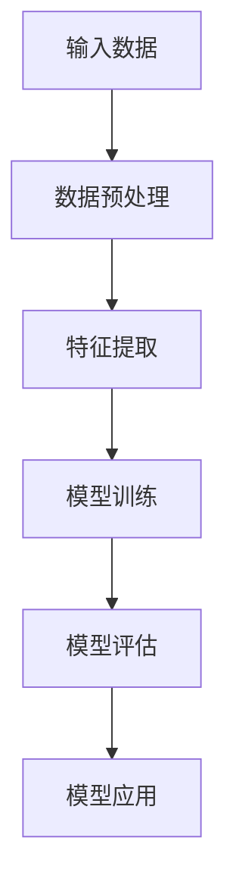

                 

随着人工智能技术的飞速发展，大模型（Large-scale Models）逐渐成为技术领域中的明星，它们凭借强大的计算能力和处理海量数据的能力，为各个行业的创新和变革提供了新的动力。对于创业者而言，掌握大模型的应用，将其融入创业产品设计之中，将有望在竞争激烈的市场中脱颖而出。本文旨在探讨大模型在创业产品设计中的应用，分析其优势、挑战及未来的发展方向。

## 关键词

- 大模型
- 创业产品设计
- AI 融合
- 人工智能应用
- 技术创新

## 摘要

本文首先介绍了大模型的基本概念、发展历程及其在技术领域的重要地位。随后，分析了大模型在创业产品设计中的优势，包括提升数据处理效率、增强决策能力和降低研发成本等。接着，本文探讨了将大模型融入创业产品设计可能面临的挑战，如数据隐私、算法透明度和安全性等问题。最后，对大模型未来的发展趋势进行了展望，并提出了创业者在应用大模型时的一些建议。

## 1. 背景介绍

### 1.1 大模型的概念与发展历程

大模型，顾名思义，指的是具有海量参数、能够处理大规模数据的人工智能模型。与传统的小型模型相比，大模型具有更强的表示能力和计算效率。大模型的概念起源于深度学习领域，随着计算能力的提升和海量数据的积累，大模型逐渐成为研究的焦点。

大模型的发展历程可以分为以下几个阶段：

1. **早期探索（2006-2012）**：深度学习开始崭露头角，一些经典的深度神经网络如AlexNet在图像识别领域取得了突破性成果。
2. **快速增长（2012-2017）**：随着GPU等硬件设备的普及，深度学习迎来了快速增长期，许多大型神经网络模型如VGG、ResNet等被提出。
3. **大规模应用（2017至今）**：随着Transformer架构的提出，BERT、GPT等大模型逐渐成为研究热点，它们在自然语言处理、计算机视觉等领域取得了显著的成果。

### 1.2 大模型在技术领域的重要地位

大模型在技术领域具有重要地位，主要体现在以下几个方面：

1. **提升数据处理效率**：大模型能够高效地处理海量数据，这对于需要处理大量数据的行业，如金融、医疗等具有重要意义。
2. **增强决策能力**：大模型通过学习大量的数据，能够提取出有用的信息，从而为决策提供有力的支持。
3. **推动技术创新**：大模型的出现推动了人工智能技术的快速发展，许多新的算法和模型也因此被提出。

## 2. 核心概念与联系

### 2.1 大模型的基本原理

大模型的基本原理主要基于深度学习，深度学习是一种模仿人脑神经网络结构和功能的人工智能方法。大模型通过多层神经网络的堆叠，实现对数据的层次化表示和特征提取。

### 2.2 大模型架构的 Mermaid 流程图



### 2.3 大模型与创业产品设计的关系

大模型在创业产品设计中的应用主要体现在以下几个方面：

1. **数据分析与挖掘**：通过大模型，创业公司能够从大量数据中提取有价值的信息，为产品优化和决策提供依据。
2. **智能推荐系统**：大模型可以帮助创业公司构建智能推荐系统，提升用户体验和满意度。
3. **自动化决策支持**：大模型能够为创业公司提供自动化决策支持，降低人力成本，提高运营效率。

## 3. 核心算法原理 & 具体操作步骤

### 3.1 算法原理概述

大模型的算法原理主要基于深度学习和自然语言处理（NLP）领域，其中最经典的代表是Transformer模型和GPT系列模型。

### 3.2 算法步骤详解

1. **数据收集与预处理**：收集大量的文本数据，并进行清洗和预处理，如去除噪声、分词等。
2. **模型构建**：构建基于Transformer或GPT的神经网络模型，包括嵌入层、编码器和解码器等。
3. **模型训练**：使用训练数据对模型进行训练，调整模型参数，使其能够准确预测目标输出。
4. **模型评估**：使用测试数据对模型进行评估，评估指标包括准确率、召回率等。
5. **模型应用**：将训练好的模型应用到实际场景中，如智能问答、文本生成等。

### 3.3 算法优缺点

**优点**：

1. **强大的表示能力**：大模型能够提取出数据中的深层特征，具有强大的表示能力。
2. **高效的处理能力**：大模型能够快速处理大规模数据，提高数据处理效率。

**缺点**：

1. **计算资源需求高**：大模型需要大量的计算资源，对硬件设备的要求较高。
2. **训练时间较长**：大模型的训练时间较长，对开发者和运营团队的时间成本较高。

### 3.4 算法应用领域

大模型的应用领域广泛，包括但不限于以下领域：

1. **自然语言处理**：如智能问答、机器翻译、文本生成等。
2. **计算机视觉**：如图像识别、物体检测、图像生成等。
3. **推荐系统**：如商品推荐、内容推荐等。
4. **金融领域**：如风险控制、量化交易等。

## 4. 数学模型和公式 & 详细讲解 & 举例说明

### 4.1 数学模型构建

大模型的数学模型主要基于深度学习中的神经网络，其核心思想是通过多层神经网络的堆叠，实现对数据的层次化表示和特征提取。以下是一个简化的神经网络模型：

$$
y = f(z) = \sigma(W \cdot x + b)
$$

其中，$x$ 为输入数据，$W$ 为权重矩阵，$b$ 为偏置项，$f$ 为激活函数，$\sigma$ 表示sigmoid函数。

### 4.2 公式推导过程

以一个简单的多层感知机（MLP）为例，其数学推导过程如下：

1. **输入层到隐藏层的推导**：

$$
z^{(1)} = W^{(1)} \cdot x + b^{(1)}
$$

$$
a^{(1)} = \sigma(z^{(1)})
$$

2. **隐藏层到输出层的推导**：

$$
z^{(2)} = W^{(2)} \cdot a^{(1)} + b^{(2)}
$$

$$
y = \sigma(z^{(2)})
$$

### 4.3 案例分析与讲解

假设一个简单的分类问题，使用多层感知机（MLP）进行模型构建。以下是一个简化的模型：

1. **输入层**：包含10个特征。
2. **隐藏层**：包含5个神经元。
3. **输出层**：包含2个神经元，用于分类。

$$
\begin{align*}
z^{(1)} &= W^{(1)} \cdot x + b^{(1)} \\
a^{(1)} &= \sigma(z^{(1)}) \\
z^{(2)} &= W^{(2)} \cdot a^{(1)} + b^{(2)} \\
y &= \sigma(z^{(2)})
\end{align*}
$$

其中，$x$ 为输入特征向量，$W^{(1)}$ 和 $W^{(2)}$ 分别为输入层到隐藏层和隐藏层到输出层的权重矩阵，$b^{(1)}$ 和 $b^{(2)}$ 分别为输入层到隐藏层和隐藏层到输出层的偏置项，$\sigma$ 表示sigmoid函数。

通过梯度下降等优化算法，不断调整权重矩阵和偏置项，使得模型能够准确预测输出。

## 5. 项目实践：代码实例和详细解释说明

### 5.1 开发环境搭建

在本案例中，我们使用Python作为主要编程语言，利用TensorFlow框架进行模型构建和训练。以下为开发环境的搭建步骤：

1. 安装Python：版本要求3.6及以上。
2. 安装TensorFlow：使用pip命令安装`pip install tensorflow`。
3. 配置GPU支持（可选）：若使用GPU进行训练，需要安装CUDA和cuDNN。

### 5.2 源代码详细实现

以下是一个简单的多层感知机（MLP）模型实现：

```python
import tensorflow as tf
from tensorflow.keras.layers import Dense
from tensorflow.keras.models import Sequential

# 构建模型
model = Sequential([
    Dense(units=5, activation='sigmoid', input_shape=(10,)),
    Dense(units=2, activation='sigmoid')
])

# 编译模型
model.compile(optimizer='adam', loss='binary_crossentropy', metrics=['accuracy'])

# 模型训练
model.fit(x_train, y_train, epochs=10, batch_size=32)
```

### 5.3 代码解读与分析

1. **模型构建**：使用`Sequential`模型，依次添加`Dense`层，定义神经元的数量和激活函数。
2. **模型编译**：选择优化器、损失函数和评估指标。
3. **模型训练**：使用训练数据对模型进行训练，指定训练轮数和批量大小。

### 5.4 运行结果展示

训练完成后，可以使用测试数据进行评估：

```python
loss, accuracy = model.evaluate(x_test, y_test)
print(f"Test accuracy: {accuracy:.4f}")
```

输出结果为测试数据的准确率。

## 6. 实际应用场景

### 6.1 创业公司的产品应用

大模型在创业公司的产品中具有广泛的应用，以下是一些典型的应用场景：

1. **智能推荐系统**：利用大模型构建个性化推荐系统，提升用户体验和满意度。
2. **自动化客服**：使用大模型实现智能客服，提高客服效率和用户满意度。
3. **文本分析**：利用大模型进行文本分类、情感分析等，为产品提供数据支持。

### 6.2 行业应用案例

大模型在多个行业领域取得了显著的成果，以下是一些典型的行业应用案例：

1. **金融行业**：利用大模型进行风险控制、量化交易等，提高金融机构的运营效率。
2. **医疗行业**：利用大模型进行疾病预测、诊断辅助等，为医疗机构提供智能支持。
3. **电商行业**：利用大模型进行商品推荐、用户行为分析等，提升电商平台的竞争力。

### 6.3 未来应用展望

随着大模型技术的不断发展，未来将在更多领域得到应用，以下是一些展望：

1. **自动驾驶**：利用大模型进行自动驾驶算法的研究和开发，推动自动驾驶技术的发展。
2. **智能制造**：利用大模型进行智能监控、故障预测等，提升制造行业的智能化水平。
3. **智慧城市**：利用大模型进行城市管理、环境监测等，提升城市管理的智能化水平。

## 7. 工具和资源推荐

### 7.1 学习资源推荐

1. **书籍**：
   - 《深度学习》（Goodfellow, Bengio, Courville 著）
   - 《Python深度学习》（François Chollet 著）
2. **在线课程**：
   - Coursera上的《深度学习》课程（吴恩达教授）
   - Udacity的《深度学习工程师纳米学位》
3. **技术博客**：
   - TensorFlow官方博客
   - PyTorch官方博客

### 7.2 开发工具推荐

1. **编程环境**：Jupyter Notebook、Google Colab
2. **框架**：TensorFlow、PyTorch、Keras
3. **数据处理**：Pandas、NumPy、Scikit-learn

### 7.3 相关论文推荐

1. **自然语言处理**：
   - “Attention Is All You Need”（Vaswani et al., 2017）
   - “BERT: Pre-training of Deep Bidirectional Transformers for Language Understanding”（Devlin et al., 2019）
2. **计算机视觉**：
   - “Convolutional Neural Networks for Visual Recognition”（Krizhevsky et al., 2012）
   - “ResNet: Training Deep Neural Networks for Image Recognition”（He et al., 2016）

## 8. 总结：未来发展趋势与挑战

### 8.1 研究成果总结

大模型技术的发展取得了显著成果，其在数据处理、智能决策和自动化应用等方面展示了强大的潜力。通过大模型，创业公司可以更加高效地处理数据，提升产品的竞争力。

### 8.2 未来发展趋势

未来，大模型技术将在多个领域得到更广泛的应用，如自动驾驶、智能制造和智慧城市等。同时，随着计算能力的提升和算法的优化，大模型的规模和性能将进一步提升。

### 8.3 面临的挑战

尽管大模型技术具有广阔的应用前景，但同时也面临着一系列挑战，包括数据隐私、算法透明度和安全性等问题。如何解决这些问题，确保大模型技术的可持续发展，是未来研究的重要方向。

### 8.4 研究展望

展望未来，大模型技术将在人工智能领域发挥更加重要的作用。创业者应积极拥抱这一技术，将其融入到产品设计中，推动产业的创新和变革。

## 9. 附录：常见问题与解答

### 9.1 大模型与深度学习的区别

**问题**：大模型和深度学习是什么关系？它们之间有什么区别？

**解答**：大模型是一种基于深度学习的模型，其核心思想是通过多层神经网络的堆叠，实现对数据的层次化表示和特征提取。深度学习是一种人工智能方法，它通过模拟人脑神经网络结构和功能，实现对数据的自动学习和处理。大模型是深度学习的一个分支，特别强调模型规模和计算能力。

### 9.2 大模型的计算资源需求

**问题**：大模型的训练和推理需要多少计算资源？

**解答**：大模型的训练和推理对计算资源的需求很高。训练阶段通常需要使用高性能的GPU或TPU进行加速，推理阶段则需要相应的硬件设备支持。具体资源需求取决于模型的规模和复杂度，以及训练和推理的任务类型。

### 9.3 大模型的应用领域

**问题**：大模型在哪些领域具有广泛的应用？

**解答**：大模型在多个领域具有广泛的应用，包括自然语言处理、计算机视觉、推荐系统、金融、医疗、电商等。随着技术的不断发展，大模型的应用领域将不断拓展，未来有望在更多领域发挥重要作用。

## 参考文献

- Goodfellow, I., Bengio, Y., & Courville, A. (2016). *Deep Learning*.
- Chollet, F. (2017). *Python Deep Learning*.
- Vaswani, A., Shazeer, N., Parmar, N., Uszkoreit, J., Jones, L., Gomez, A. N., ... & Polosukhin, I. (2017). *Attention is all you need*. In Advances in Neural Information Processing Systems (pp. 5998-6008).
- Devlin, J., Chang, M. W., Lee, K., & Toutanova, K. (2019). *BERT: Pre-training of deep bidirectional transformers for language understanding*. In Proceedings of the 2019 Conference of the North American Chapter of the Association for Computational Linguistics: Human Language Technologies, Volume 1 (Long and Short Papers) (pp. 4171-4186).
- Krizhevsky, A., Sutskever, I., & Hinton, G. E. (2012). *ImageNet classification with deep convolutional neural networks*. In Advances in Neural Information Processing Systems (pp. 1097-1105).
- He, K., Zhang, X., Ren, S., & Sun, J. (2016). *Deep residual learning for image recognition*. In Proceedings of the IEEE conference on computer vision and pattern recognition (pp. 770-778).

