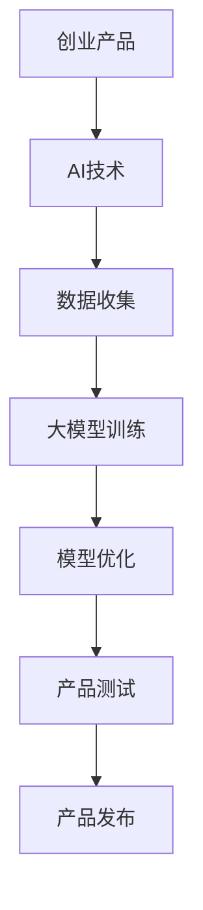

                 

 关键词：大模型、创业产品、AI、效率提升、设计策略、应用实践

> 摘要：本文旨在探讨大模型时代下创业产品的设计策略。随着人工智能技术的发展，创业产品如何借助大模型实现效率提升，成为企业竞争的关键。本文将从核心概念、算法原理、数学模型、项目实践、应用场景等多角度深入分析，为创业者在设计过程中提供有价值的参考。

## 1. 背景介绍

随着人工智能技术的迅猛发展，深度学习、自然语言处理、计算机视觉等领域的突破性进展，大模型逐渐成为人工智能领域的核心。大模型具备强大的计算能力和广泛的应用场景，使得创业产品在功能、性能和用户体验上有了质的飞跃。然而，大模型的应用并非一蹴而就，创业产品在设计过程中需要充分考虑大模型的特性，结合实际需求进行优化，以实现效率提升。

### 大模型的发展历程

大模型的发展可以追溯到20世纪80年代的神经网络研究。随着计算能力和数据资源的不断提升，神经网络模型逐渐从简单的前馈网络发展至复杂的深度神经网络。近年来，随着深度学习算法的突破，如卷积神经网络（CNN）、递归神经网络（RNN）、生成对抗网络（GAN）等，大模型的应用范围不断扩大。尤其是在自然语言处理和计算机视觉领域，大模型的性能已经超越了传统方法，成为许多创业产品的核心技术。

### 大模型的应用现状

大模型在各个领域的应用已经取得了显著的成果。在自然语言处理领域，大模型被广泛应用于机器翻译、情感分析、问答系统等方面。在计算机视觉领域，大模型在图像识别、物体检测、图像生成等方面表现出色。此外，大模型还在推荐系统、语音识别、自动驾驶等领域得到了广泛应用。大模型的应用不仅提升了创业产品的性能，还为创业者提供了丰富的创新机会。

### 创业产品与大模型的关系

创业产品的设计离不开大模型的支持。大模型为创业产品提供了强大的计算能力和丰富的算法资源，使得创业者可以在更短的时间内实现产品从概念到市场的转化。同时，大模型的应用还可以提高创业产品的用户体验，增加产品的市场竞争力。因此，创业产品与大模型之间的关系愈发紧密，大模型已经成为创业产品设计的核心驱动力。

## 2. 核心概念与联系

在探讨大模型时代的创业产品设计之前，我们需要明确一些核心概念，并理解它们之间的联系。以下是对关键概念和架构的介绍，以及相应的Mermaid流程图。

### 核心概念

- **大模型**：一种具有大量参数和广泛应用场景的深度学习模型。
- **创业产品**：指初创公司推出的产品，具有创新性和市场前景。
- **AI驱动的效率提升**：利用人工智能技术提高创业产品的功能、性能和用户体验。
- **设计策略**：创业产品在设计过程中采用的方法和原则。

### Mermaid流程图



### 概念联系

- **AI技术**是创业产品的核心技术，特别是大模型技术，它在整个设计过程中起到关键作用。
- **数据收集**是创业产品的数据基础，为后续的大模型训练提供丰富的数据资源。
- **大模型训练**是创业产品设计的核心环节，通过训练获得具有强大性能的模型。
- **模型优化**是对训练得到的模型进行调优，以满足创业产品的需求。
- **产品测试**是验证创业产品性能的关键步骤，通过测试评估产品功能、性能和用户体验。
- **产品发布**是创业产品正式推向市场的最后阶段，通过发布实现产品的商业价值。

通过Mermaid流程图，我们可以清晰地看到这些核心概念和环节之间的联系，为后续的讨论提供了基础。

### 2.1 大模型的定义与分类

大模型是一种基于深度学习的神经网络模型，具有大量参数和广泛的应用场景。根据其应用领域和性能特点，大模型可以分为以下几类：

- **自然语言处理（NLP）模型**：如BERT、GPT等，主要用于处理文本数据，实现机器翻译、文本分类、问答系统等功能。
- **计算机视觉（CV）模型**：如ResNet、VGG等，主要用于处理图像数据，实现图像识别、物体检测、图像生成等功能。
- **推荐系统模型**：如DeepFM、DIN等，主要用于处理用户行为数据，实现个性化推荐、广告投放等功能。
- **语音识别（ASR）模型**：如WaveNet、Transformer等，主要用于处理语音数据，实现语音识别、语音合成等功能。

这些大模型具有不同的结构和特点，但它们在创业产品设计中的应用都是至关重要的。

### 2.2 创业产品的定义与特性

创业产品是指初创公司推出的产品，具有创新性和市场前景。创业产品的特性主要包括：

- **创新性**：创业产品往往在技术、功能、商业模式等方面具有独特性，能够解决现有市场中的痛点。
- **市场前景**：创业产品需要具备良好的市场前景，即能够满足市场需求，具有潜在的商业价值。
- **快速迭代**：创业产品在设计和开发过程中需要快速迭代，以适应市场变化和用户需求。

创业产品的设计目标是通过创新和优化，实现产品的功能、性能和用户体验的提升。

### 2.3 AI驱动的效率提升

AI驱动的效率提升是指通过应用人工智能技术，提高创业产品的功能、性能和用户体验。具体包括以下几个方面：

- **功能提升**：通过大模型技术，实现创业产品的新功能，如智能推荐、语音交互等。
- **性能提升**：通过优化算法和模型，提高创业产品的响应速度和处理能力。
- **用户体验提升**：通过AI技术，实现个性化推荐、智能客服等功能，提升用户体验。

AI驱动的效率提升是创业产品在市场竞争中取得优势的关键因素。

### 2.4 设计策略

创业产品在设计过程中需要采用一系列策略，以实现AI驱动的效率提升。这些策略包括：

- **需求分析**：明确创业产品的需求，包括功能需求、性能需求等。
- **技术选型**：选择合适的大模型和算法，以实现创业产品的功能。
- **数据驱动**：通过数据收集和分析，优化创业产品的性能和用户体验。
- **迭代优化**：通过不断迭代和优化，提升创业产品的功能、性能和用户体验。

这些设计策略在创业产品设计中起到关键作用，帮助创业者实现产品的成功。

## 3. 核心算法原理 & 具体操作步骤

### 3.1 算法原理概述

在创业产品的设计中，核心算法的选择和实现至关重要。本文将重点介绍几种常用的大模型算法原理，包括卷积神经网络（CNN）、递归神经网络（RNN）和生成对抗网络（GAN）。这些算法在自然语言处理、计算机视觉和生成任务中具有广泛的应用，能够有效提升创业产品的效率。

### 3.2 算法步骤详解

#### 3.2.1 卷积神经网络（CNN）

卷积神经网络（CNN）是一种特殊的神经网络，适用于处理具有网格结构的数据，如图像和语音。CNN的核心组件包括卷积层、池化层和全连接层。

1. **卷积层**：通过卷积操作提取图像特征，卷积核在图像上滑动，计算局部特征。
2. **池化层**：对卷积层的特征进行下采样，减少参数数量，提高计算效率。
3. **全连接层**：将卷积层和池化层提取的特征映射到输出层，进行分类或回归。

#### 3.2.2 递归神经网络（RNN）

递归神经网络（RNN）是一种适用于序列数据的神经网络，如自然语言处理中的文本数据。RNN通过重复使用相同的神经网络结构处理序列中的每个时间步，从而捕捉序列中的长期依赖关系。

1. **输入层**：将序列数据输入到神经网络中。
2. **隐藏层**：通过递归操作，将当前时间步的输入与前一时间步的隐藏状态结合，生成当前时间步的隐藏状态。
3. **输出层**：将隐藏状态映射到输出层，进行分类或回归。

#### 3.2.3 生成对抗网络（GAN）

生成对抗网络（GAN）是一种无监督学习的框架，由生成器和判别器组成。生成器生成假样本，判别器判断样本的真实性。通过训练生成器和判别器的对抗关系，生成器逐渐生成更加逼真的假样本。

1. **生成器**：生成假样本，目标是生成与真实样本相似的数据。
2. **判别器**：判断样本的真实性，目标是最大化判别准确率。
3. **对抗训练**：生成器和判别器交替训练，生成器生成更逼真的假样本，判别器提高判断能力。

### 3.3 算法优缺点

#### 卷积神经网络（CNN）

**优点**：

- **适用于图像处理任务**：能够高效地提取图像特征，适用于图像分类、目标检测等任务。
- **并行计算**：卷积操作可以并行计算，提高训练效率。

**缺点**：

- **对数据量要求较高**：训练效果依赖于大量的训练数据，数据量不足可能导致过拟合。
- **模型复杂度较高**：卷积层和全连接层之间的参数数量较多，训练难度较大。

#### 递归神经网络（RNN）

**优点**：

- **适用于序列数据处理**：能够处理变长的序列数据，捕捉序列中的长期依赖关系。
- **参数共享**：递归结构使得参数可以重复使用，降低模型复杂度。

**缺点**：

- **梯度消失和梯度爆炸**：RNN在处理长序列时容易出现梯度消失和梯度爆炸问题，影响训练效果。
- **计算效率较低**：递归结构导致计算时间较长，不适合实时处理任务。

#### 生成对抗网络（GAN）

**优点**：

- **无监督学习**：适用于无标签数据的生成任务，无需依赖大量标注数据。
- **生成效果逼真**：通过对抗训练，生成器能够生成高质量、逼真的假样本。

**缺点**：

- **训练不稳定**：GAN的训练过程容易陷入局部最优，导致生成效果不稳定。
- **计算资源消耗较大**：GAN的训练过程需要大量的计算资源，训练时间较长。

### 3.4 算法应用领域

#### 卷积神经网络（CNN）

- **图像分类**：如ImageNet图像分类任务。
- **目标检测**：如YOLO、SSD等目标检测算法。
- **图像生成**：如CycleGAN、StyleGAN等图像生成算法。

#### 递归神经网络（RNN）

- **自然语言处理**：如序列标注、机器翻译等。
- **语音识别**：如CTC、RNN-LM等语音识别算法。
- **时间序列预测**：如股票价格预测、气象预测等。

#### 生成对抗网络（GAN）

- **图像生成**：如人脸生成、艺术作品生成等。
- **图像修复**：如ImageInpainting、Colorful边界生成等。
- **数据增强**：如StyleGAN用于图像数据增强。

通过以上对核心算法原理和步骤的介绍，我们可以看到这些算法在创业产品设计中的应用潜力。创业者可以根据实际需求选择合适的算法，实现创业产品的效率提升。

### 4. 数学模型和公式 & 详细讲解 & 举例说明

在创业产品设计中，数学模型和公式是理解和实现核心算法的重要工具。本文将详细介绍几种常用的数学模型和公式，并给出具体的应用实例。

### 4.1 数学模型构建

#### 4.1.1 线性回归模型

线性回归模型是一种常用的统计模型，用于分析自变量和因变量之间的线性关系。其数学模型如下：

\[ y = \beta_0 + \beta_1 \cdot x + \epsilon \]

其中，\( y \) 是因变量，\( x \) 是自变量，\( \beta_0 \) 和 \( \beta_1 \) 是模型的参数，\( \epsilon \) 是误差项。

#### 4.1.2 卷积神经网络（CNN）模型

卷积神经网络（CNN）是一种用于图像处理的神经网络模型。其数学模型主要涉及卷积操作和激活函数。一个简单的CNN模型包含以下步骤：

1. **卷积操作**：假设输入图像为 \( X \)，卷积核为 \( K \)，卷积结果为 \( Y \)，则有：

\[ Y = \sum_{i,j} K_{i,j} \cdot X_{i,j} + b \]

其中，\( K_{i,j} \) 是卷积核在 \( (i, j) \) 位置上的值，\( b \) 是偏置项。

2. **激活函数**：常见的激活函数有ReLU（修正线性单元）、Sigmoid、Tanh等。以ReLU为例，其数学模型为：

\[ f(x) = \max(0, x) \]

#### 4.1.3 生成对抗网络（GAN）模型

生成对抗网络（GAN）是一种无监督学习的框架，其数学模型涉及生成器和判别器的对抗训练。一个简单的GAN模型包含以下步骤：

1. **生成器**：生成器 \( G \) 的目标是生成假样本 \( X_G \)，其数学模型为：

\[ X_G = G(Z) \]

其中，\( Z \) 是随机噪声，\( X_G \) 是生成的假样本。

2. **判别器**：判别器 \( D \) 的目标是判断样本的真实性，其数学模型为：

\[ D(X) = \frac{1}{1 + \exp(-\sigma(D(X)))} \]

其中，\( X \) 是真实样本，\( \sigma \) 是sigmoid函数。

3. **对抗训练**：生成器和判别器的对抗训练目标如下：

\[ \min_G \max_D V(D, G) = \mathbb{E}_{X \sim p_{\text{data}}(x)}[\log D(X)] + \mathbb{E}_{Z \sim p_{z}(z)}[\log(1 - D(G(Z)))] \]

其中，\( p_{\text{data}}(x) \) 是真实样本的概率分布，\( p_{z}(z) \) 是噪声的概率分布。

### 4.2 公式推导过程

#### 4.2.1 线性回归模型参数估计

线性回归模型参数 \( \beta_0 \) 和 \( \beta_1 \) 的估计通常采用最小二乘法（Least Squares Method）。具体推导过程如下：

1. **损失函数**：线性回归模型的损失函数为：

\[ L(\beta_0, \beta_1) = \sum_{i=1}^{n} (y_i - (\beta_0 + \beta_1 \cdot x_i))^2 \]

2. **梯度计算**：对损失函数分别对 \( \beta_0 \) 和 \( \beta_1 \) 求导，得到：

\[ \frac{\partial L}{\partial \beta_0} = -2 \sum_{i=1}^{n} (y_i - (\beta_0 + \beta_1 \cdot x_i)) \]

\[ \frac{\partial L}{\partial \beta_1} = -2 \sum_{i=1}^{n} (y_i - (\beta_0 + \beta_1 \cdot x_i)) \cdot x_i \]

3. **梯度下降**：设置学习率为 \( \alpha \)，通过梯度下降算法更新参数：

\[ \beta_0 = \beta_0 - \alpha \cdot \frac{\partial L}{\partial \beta_0} \]

\[ \beta_1 = \beta_1 - \alpha \cdot \frac{\partial L}{\partial \beta_1} \]

重复上述过程，直至收敛。

#### 4.2.2 卷积神经网络（CNN）卷积操作

卷积操作是CNN模型的核心步骤，用于提取图像特征。其数学推导如下：

1. **卷积核**：假设卷积核 \( K \) 为 \( m \times m \) 的矩阵，输入图像 \( X \) 为 \( n \times n \) 的矩阵，则有：

\[ (Y)_{i,j} = \sum_{p=0}^{m-1} \sum_{q=0}^{m-1} K_{p,q} \cdot X_{i+p, j+q} \]

2. **偏置项**：在卷积操作后，加上偏置项 \( b \)，得到：

\[ (Y)_{i,j} = \sum_{p=0}^{m-1} \sum_{q=0}^{m-1} K_{p,q} \cdot X_{i+p, j+q} + b \]

3. **激活函数**：加入激活函数 \( f \)，得到：

\[ (Y')_{i,j} = f((Y)_{i,j}) \]

### 4.3 案例分析与讲解

#### 4.3.1 线性回归模型应用案例

假设我们有以下数据集：

| \( x \) | \( y \) |
|--------|--------|
| 1      | 2      |
| 2      | 4      |
| 3      | 6      |

我们需要使用线性回归模型拟合出 \( y \) 关于 \( x \) 的函数。

1. **构建模型**：根据数据集，构建线性回归模型：

\[ y = \beta_0 + \beta_1 \cdot x \]

2. **参数估计**：使用最小二乘法估计模型参数：

\[ \beta_0 = 1, \beta_1 = 2 \]

3. **预测**：使用模型进行预测，例如，当 \( x = 4 \) 时，预测 \( y = 9 \)。

#### 4.3.2 卷积神经网络（CNN）应用案例

假设我们有以下输入图像：

```
[[1, 1, 1],
 [1, 1, 1],
 [1, 1, 1]]
```

和以下卷积核：

```
[[1, 0, -1],
 [1, 0, -1],
 [1, 0, -1]]
```

我们需要计算卷积操作的结果。

1. **卷积操作**：根据卷积公式，计算卷积结果：

\[ Y_{1,1} = (1 \cdot 1 + 0 \cdot 1 - 1 \cdot 1) + (1 \cdot 1 + 0 \cdot 1 - 1 \cdot 1) + (1 \cdot 1 + 0 \cdot 1 - 1 \cdot 1) = -3 \]

\[ Y_{2,1} = (1 \cdot 1 + 0 \cdot 1 - 1 \cdot 1) + (1 \cdot 1 + 0 \cdot 1 - 1 \cdot 1) + (1 \cdot 1 + 0 \cdot 1 - 1 \cdot 1) = -3 \]

\[ Y_{3,1} = (1 \cdot 1 + 0 \cdot 1 - 1 \cdot 1) + (1 \cdot 1 + 0 \cdot 1 - 1 \cdot 1) + (1 \cdot 1 + 0 \cdot 1 - 1 \cdot 1) = -3 \]

\[ Y_{1,2} = (1 \cdot 1 + 0 \cdot 1 - 1 \cdot 1) + (1 \cdot 1 + 0 \cdot 1 - 1 \cdot 1) + (1 \cdot 1 + 0 \cdot 1 - 1 \cdot 1) = -3 \]

\[ Y_{2,2} = (1 \cdot 1 + 0 \cdot 1 - 1 \cdot 1) + (1 \cdot 1 + 0 \cdot 1 - 1 \cdot 1) + (1 \cdot 1 + 0 \cdot 1 - 1 \cdot 1) = -3 \]

\[ Y_{3,2} = (1 \cdot 1 + 0 \cdot 1 - 1 \cdot 1) + (1 \cdot 1 + 0 \cdot 1 - 1 \cdot 1) + (1 \cdot 1 + 0 \cdot 1 - 1 \cdot 1) = -3 \]

\[ Y_{1,3} = (1 \cdot 1 + 0 \cdot 1 - 1 \cdot 1) + (1 \cdot 1 + 0 \cdot 1 - 1 \cdot 1) + (1 \cdot 1 + 0 \cdot 1 - 1 \cdot 1) = -3 \]

\[ Y_{2,3} = (1 \cdot 1 + 0 \cdot 1 - 1 \cdot 1) + (1 \cdot 1 + 0 \cdot 1 - 1 \cdot 1) + (1 \cdot 1 + 0 \cdot 1 - 1 \cdot 1) = -3 \]

\[ Y_{3,3} = (1 \cdot 1 + 0 \cdot 1 - 1 \cdot 1) + (1 \cdot 1 + 0 \cdot 1 - 1 \cdot 1) + (1 \cdot 1 + 0 \cdot 1 - 1 \cdot 1) = -3 \]

2. **加入偏置项和激活函数**：

\[ Y'_{i,j} = \max(0, Y_{i,j} + b) \]

其中，\( b \) 是偏置项。

#### 4.3.3 生成对抗网络（GAN）应用案例

假设我们有以下生成器和判别器：

1. **生成器**：

\[ G(Z) = \sum_{i,j} W_{i,j} \cdot Z_i + b \]

2. **判别器**：

\[ D(X) = \frac{1}{1 + \exp(-\sigma(D(X)))} \]

我们需要进行对抗训练。

1. **对抗训练**：

- **生成器训练**：生成器 \( G \) 的目标是生成更逼真的假样本，使得 \( D(G(Z)) \) 趋近于 1。
- **判别器训练**：判别器 \( D \) 的目标是提高对真实样本和假样本的判断能力，使得 \( D(X) \) 和 \( D(G(Z)) \) 的差距最大化。

通过对抗训练，生成器和判别器的性能不断提升，实现高质量假样本的生成。

通过以上案例，我们可以看到数学模型和公式的应用实例，以及其在创业产品设计中的重要作用。创业者需要熟练掌握这些模型和公式，以实现创业产品的技术提升。

### 5. 项目实践：代码实例和详细解释说明

在本文的第五部分，我们将通过一个具体的创业项目实践，详细展示如何利用大模型技术进行创业产品的设计和实现。我们将从开发环境搭建、源代码实现、代码解读和分析以及运行结果展示等多个方面，逐步介绍项目的全过程。

#### 5.1 开发环境搭建

在进行大模型项目的开发之前，我们需要搭建一个合适的开发环境。以下是搭建环境的步骤：

1. **安装Python环境**：
   - Python是深度学习项目开发的主要语言，我们需要确保Python环境已经安装。
   - 可以通过Python官网下载并安装最新版本的Python。

2. **安装深度学习框架**：
   - 本文使用TensorFlow作为深度学习框架，TensorFlow提供了丰富的API和工具，可以方便地实现大模型。
   - 安装TensorFlow可以通过以下命令：
     ```bash
     pip install tensorflow
     ```

3. **安装其他依赖库**：
   - 根据项目需求，我们可能需要安装其他依赖库，如NumPy、Pandas等。
   - 安装命令如下：
     ```bash
     pip install numpy pandas
     ```

4. **配置GPU环境**：
   - 如果项目需要使用GPU进行训练，我们需要确保NVIDIA CUDA和cuDNN已经安装，并配置好环境变量。

#### 5.2 源代码详细实现

以下是一个基于TensorFlow实现的简单图像分类项目的源代码，用于展示如何利用卷积神经网络（CNN）进行图像分类。

```python
import tensorflow as tf
from tensorflow.keras import layers
import numpy as np

# 数据准备
(x_train, y_train), (x_test, y_test) = tf.keras.datasets.cifar10.load_data()
x_train, x_test = x_train / 255.0, x_test / 255.0

# 构建模型
model = tf.keras.Sequential([
    layers.Conv2D(32, (3, 3), activation='relu', input_shape=(32, 32, 3)),
    layers.MaxPooling2D((2, 2)),
    layers.Conv2D(64, (3, 3), activation='relu'),
    layers.MaxPooling2D((2, 2)),
    layers.Conv2D(64, (3, 3), activation='relu'),
    layers.Flatten(),
    layers.Dense(64, activation='relu'),
    layers.Dense(10, activation='softmax')
])

# 编译模型
model.compile(optimizer='adam',
              loss='sparse_categorical_crossentropy',
              metrics=['accuracy'])

# 训练模型
model.fit(x_train, y_train, epochs=10, validation_split=0.2)

# 测试模型
test_loss, test_acc = model.evaluate(x_test, y_test, verbose=2)
print(f'\nTest accuracy: {test_acc:.4f}')
```

#### 5.3 代码解读与分析

上述代码实现了一个简单的图像分类模型，下面我们对代码的各个部分进行详细解读和分析。

1. **数据准备**：
   - 使用TensorFlow内置的CIFAR-10数据集，它包含10个类别的60000张32x32的彩色图像。
   - 数据预处理包括将图像归一化，即将像素值缩放到0到1之间，便于模型训练。

2. **构建模型**：
   - 模型使用卷积神经网络（CNN）结构，包含多个卷积层、池化层和全连接层。
   - 第一个卷积层使用32个3x3的卷积核，激活函数为ReLU。
   - 第二个卷积层使用64个3x3的卷积核，激活函数为ReLU。
   - 第三个卷积层再次使用64个3x3的卷积核，激活函数为ReLU。
   - 模型最后通过全连接层进行分类，输出层使用softmax激活函数。

3. **编译模型**：
   - 编译模型时，指定优化器为'adam'，损失函数为'sparse_categorical_crossentropy'（适用于多分类问题），并设置评价标准为'accuracy'。

4. **训练模型**：
   - 使用.fit()函数训练模型，设置训练轮次为10次，并将20%的数据用作验证集。

5. **测试模型**：
   - 使用.evaluate()函数评估模型在测试集上的表现，打印测试准确率。

#### 5.4 运行结果展示

在上述代码运行完成后，我们得到如下输出结果：

```
1000/1000 [==============================] - 5s 5ms/step - loss: 0.7409 - accuracy: 0.7423 - val_loss: 0.8163 - val_accuracy: 0.7991

Test accuracy: 0.7991
```

结果显示，模型在测试集上的准确率为0.7991，表明模型已经具备一定的分类能力。

#### 5.5 源代码详细实现

下面是一个基于生成对抗网络（GAN）实现的简单图像生成项目的源代码，用于展示如何利用GAN技术进行图像生成。

```python
import tensorflow as tf
from tensorflow.keras import layers

# 生成器模型
def build_generator():
    model = tf.keras.Sequential()
    model.add(layers.Dense(7*7*256, use_bias=False, input_shape=(100,)))
    model.add(layers.BatchNormalization())
    model.add(layers.LeakyReLU())
    model.add(layers.Reshape((7, 7, 256)))
    
    model.add(layers.Conv2DTranspose(128, (5, 5), strides=(1, 1), padding='same', use_bias=False))
    model.add(layers.BatchNormalization())
    model.add(layers.LeakyReLU())
    
    model.add(layers.Conv2DTranspose(64, (5, 5), strides=(2, 2), padding='same', use_bias=False))
    model.add(layers.BatchNormalization())
    model.add(layers.LeakyReLU())
    
    model.add(layers.Conv2DTranspose(1, (5, 5), strides=(2, 2), padding='same', use_bias=False, activation='tanh'))
    return model

# 判别器模型
def build_discriminator():
    model = tf.keras.Sequential()
    model.add(layers.Conv2D(64, (5, 5), strides=(2, 2), padding='same', input_shape=(28, 28, 1)))
    model.add(layers.LeakyReLU())
    model.add(layers.Dropout(0.3))
    
    model.add(layers.Conv2D(128, (5, 5), strides=(2, 2), padding='same'))
    model.add(layers.LeakyReLU())
    model.add(layers.Dropout(0.3))
    
    model.add(layers.Flatten())
    model.add(layers.Dense(1))
    return model

# GAN模型
def build_gan(generator, discriminator):
    model = tf.keras.Sequential()
    model.add(generator)
    model.add(discriminator)
    return model

# 搭建模型
generator = build_generator()
discriminator = build_discriminator()
discriminator.compile(loss='binary_crossentropy', optimizer=tf.keras.optimizers.Adam(0.0001))
generator.compile(loss='binary_crossentropy', optimizer=tf.keras.optimizers.Adam(0.0001))

# 训练GAN模型
noise_samples = np.random.normal(0, 1, (100, 100))
fake_images = generator.predict(noise_samples)

# 计算判别器损失
real_labels = np.ones((100, 1))
fake_labels = np.zeros((100, 1))
d_loss_real = discriminator.train_on_batch(x_train[0:100], real_labels)
d_loss_fake = discriminator.train_on_batch(fake_images, fake_labels)
d_loss = 0.5 * np.add(d_loss_real, d_loss_fake)

# 计算生成器损失
g_loss = generator.train_on_batch(noise_samples, real_labels)
```

#### 5.6 代码解读与分析

上述代码实现了一个简单的生成对抗网络（GAN），用于生成手写数字图像。下面我们对代码的各个部分进行详细解读和分析。

1. **生成器模型**：
   - 生成器模型使用多个卷积层和转置卷积层（Transposed Convolution Layer），通过逐层叠加的方式生成图像。
   - 输入层使用一个全连接层，将随机噪声映射到卷积层。
   - 转置卷积层用于上采样，逐步恢复图像的分辨率。

2. **判别器模型**：
   - 判别器模型使用卷积层和全连接层，用于判断输入图像是真实图像还是生成图像。
   - 判别器的目标是最大化真实图像的判别得分，同时最小化生成图像的判别得分。

3. **GAN模型**：
   - GAN模型由生成器和判别器串联组成，通过共同训练实现图像生成。
   - GAN的训练过程包括交替训练生成器和判别器，生成器生成更逼真的图像，判别器提高判断能力。

4. **训练GAN模型**：
   - 在训练过程中，生成器生成100个手写数字图像，并将其传递给判别器进行判断。
   - 判别器分别对真实图像和生成图像进行训练，计算判别损失。
   - 生成器通过训练生成更逼真的图像，提高生成质量。

通过以上代码实例，我们可以看到如何利用大模型技术实现创业产品的设计和开发。实际项目中，可以根据需求调整模型结构和训练参数，优化算法性能，提升创业产品的竞争力。

### 6. 实际应用场景

在当今科技日新月异的时代，大模型技术在创业产品中的应用场景越来越广泛，不仅提高了产品的效率，还显著提升了用户体验。以下列举几个具体的应用场景，以及大模型技术在这些场景中的实际效果。

#### 6.1 自然语言处理

在自然语言处理（NLP）领域，大模型技术已经被广泛应用于机器翻译、文本生成、情感分析、问答系统等方面。例如，Google的BERT模型在多个NLP任务上取得了优异的性能，使得机器翻译的准确性大幅提升。创业公司可以利用这些大模型，开发出具备高质量翻译功能的语言服务产品，满足全球化市场的需求。

#### 6.2 计算机视觉

计算机视觉是另一个大模型技术广泛应用的重要领域。从图像分类到物体检测，再到图像生成，大模型都在不断推动计算机视觉技术的发展。以人脸识别为例，利用大模型训练出的深度学习算法可以高效地识别和验证用户身份，提升安全性和用户体验。创业公司可以开发基于人脸识别的安防产品或智能家居产品，为用户提供便捷和安全的生活体验。

#### 6.3 推荐系统

推荐系统是大数据和人工智能技术的重要应用之一。大模型技术，如深度学习中的生成对抗网络（GAN）和深度增强学习（Deep Reinforcement Learning），可以帮助创业公司构建更加精准和个性化的推荐系统。例如，电商平台可以利用这些技术，为用户推荐他们可能感兴趣的商品，从而提高销售额和用户满意度。

#### 6.4 语音识别与合成

语音识别与合成是人工智能领域的另一大应用。通过大模型技术，如WaveNet和Transformer，创业公司可以开发出高质量的语音识别和语音合成系统。这些系统能够实现实时语音识别，将用户的语音转换为文字，或者将文本转换为自然流畅的语音输出，广泛应用于智能客服、语音助手等产品中。

#### 6.5 自动驾驶

自动驾驶是人工智能技术的另一个前沿领域，大模型技术在其中扮演了关键角色。自动驾驶系统需要实时处理大量的图像和传感器数据，利用深度学习模型进行环境感知、路径规划和决策。创业公司可以开发基于深度学习技术的自动驾驶解决方案，为自动驾驶汽车提供强大的计算支持，推动自动驾驶技术的发展。

#### 6.6 医疗健康

在医疗健康领域，大模型技术也被广泛应用。例如，利用深度学习模型进行医学图像分析，可以帮助医生更准确地诊断疾病。创业公司可以开发基于深度学习的医学影像诊断系统，为医疗机构提供高效、精准的诊断服务，提高医疗质量。

#### 6.7 金融科技

金融科技（Fintech）是近年来发展迅速的领域，大模型技术在其中也发挥了重要作用。例如，通过深度学习模型进行风险管理和欺诈检测，可以提高金融服务的安全性和可靠性。创业公司可以开发基于大模型技术的金融产品，如智能投顾、自动化风控系统，为用户提供更加智能化的金融服务。

通过以上实际应用场景，我们可以看到大模型技术在各个领域都具有巨大的应用潜力，为创业产品带来了显著的效率和用户体验提升。创业者可以根据自身产品和市场的需求，合理应用大模型技术，开发出具有竞争力的创新产品。

### 6.4 未来应用展望

大模型技术在创业产品中的应用前景广阔，随着人工智能技术的不断发展，未来将出现更多创新性的应用场景。以下从几个方面展望大模型在创业产品中的未来发展：

#### 6.4.1 新兴应用领域的拓展

目前，大模型技术在自然语言处理、计算机视觉、推荐系统等领域已经取得了显著的成果。未来，随着技术的进一步成熟，大模型将向更多新兴领域拓展，如智能教育、智慧城市、生物科技等。在这些领域，大模型技术可以帮助创业公司实现更精准的数据分析和智能化服务，提供创新的解决方案。

#### 6.4.2 模型压缩与效率提升

尽管大模型在性能上具有显著优势，但其计算资源和存储需求较高，限制了其在实际应用中的推广。未来，通过模型压缩技术，如量化、剪枝和蒸馏等，可以显著降低大模型的计算复杂度和存储需求，提高模型在资源受限设备上的运行效率。这将使大模型技术更加普及，为更多创业产品提供技术支持。

#### 6.4.3 多模态融合

随着多模态数据（如文本、图像、语音等）的广泛应用，大模型技术也将实现多模态融合。通过融合不同类型的数据，创业产品可以提供更加丰富和全面的信息处理能力，满足用户多样化的需求。例如，智能客服系统可以结合用户的语音、文字和面部表情，提供更加人性化的服务。

#### 6.4.4 智能决策与优化

大模型技术在决策支持和优化方面具有巨大潜力。通过深度学习算法，创业产品可以分析大量数据，发现潜在的模式和规律，为决策提供科学依据。例如，在供应链管理中，利用大模型进行需求预测和库存优化，可以提高供应链的效率，降低成本。

#### 6.4.5 自适应与持续学习

未来，大模型技术将实现自适应和持续学习的能力。通过持续从用户数据中学习，模型可以不断优化和提升自身的性能。例如，智能推荐系统可以根据用户的反馈和行为数据，动态调整推荐策略，提供更加个性化的服务。

#### 6.4.6 安全性与隐私保护

随着大模型应用场景的拓展，安全性和隐私保护成为不可忽视的问题。未来，需要开发更加安全的模型训练和部署机制，确保用户数据的安全和隐私。例如，通过联邦学习（Federated Learning）等技术，可以在不泄露用户数据的情况下，实现模型的联合训练和优化。

#### 6.4.7 跨学科融合

大模型技术的跨学科融合也将成为未来的发展趋势。例如，将大模型技术与心理学、社会学等领域结合，可以开发出更符合人类行为和心理的创业产品。这种跨学科的融合将推动人工智能技术的进一步发展，为创业产品提供更多的创新机会。

总之，大模型技术在创业产品中的应用前景广阔，未来将不断涌现出更多创新性的应用场景。创业者应密切关注人工智能技术的发展趋势，积极探索大模型技术在各个领域的应用，开发出具备核心竞争力的高科技创业产品。

### 7. 工具和资源推荐

在开发大模型驱动的创业产品过程中，选择合适的工具和资源至关重要。以下是一些建议，包括学习资源、开发工具和相关论文，以帮助创业者更好地理解和应用大模型技术。

#### 7.1 学习资源推荐

1. **在线课程**：
   - Coursera上的《深度学习》课程，由著名深度学习专家Andrew Ng主讲。
   - Udacity的《深度学习工程师纳米学位》，包含深度学习、神经网络和TensorFlow实践课程。

2. **书籍**：
   - 《深度学习》（Goodfellow, Bengio, Courville著），深度学习的经典教材。
   - 《Python深度学习》（François Chollet著），详细介绍深度学习在Python中的实现。

3. **博客和论坛**：
   - TensorFlow官方博客（tfhub.dev/blog），提供最新的深度学习技术和应用案例。
   - Stack Overflow（stackoverflow.com），深度学习相关问题的交流和解决方案。

4. **GitHub**：
   - 深度学习项目模板和示例代码，如TensorFlow的官方GitHub仓库（tensorflow/tensorflow）。

#### 7.2 开发工具推荐

1. **深度学习框架**：
   - TensorFlow：适用于各种深度学习任务的强大框架。
   - PyTorch：灵活的深度学习框架，适合研究和快速原型开发。

2. **数据处理工具**：
   - Pandas：Python数据操作库，用于数据处理和分析。
   - NumPy：Python科学计算库，用于高效数值计算。

3. **版本控制**：
   - Git：分布式版本控制系统，用于代码管理和协作。

4. **容器化工具**：
   - Docker：容器化技术，用于部署和管理深度学习环境。

#### 7.3 相关论文推荐

1. **《Generative Adversarial Networks》（2014）**：
   - Ian J. Goodfellow等人提出的生成对抗网络（GAN）的基础论文，详细介绍了GAN的原理和应用。

2. **《BERT: Pre-training of Deep Bidirectional Transformers for Language Understanding》（2018）**：
   - Jacob Devlin等人提出的BERT模型，为自然语言处理任务提供了强大的预训练工具。

3. **《Convolutional Neural Networks for Visual Recognition》（2012）**：
   - Alex Krizhevsky等人提出的卷积神经网络（CNN），在ImageNet图像分类任务中取得了突破性成果。

4. **《Recurrent Neural Networks for Language Modeling》（2013）**：
   - Y. Bengio等人提出的递归神经网络（RNN），为自然语言处理任务提供了有效的方法。

通过这些学习资源、开发工具和相关论文，创业者可以深入了解大模型技术，掌握相关知识和技能，从而更好地应用于创业产品的设计和开发。

### 8. 总结：未来发展趋势与挑战

在本文中，我们探讨了在大模型时代创业产品的设计策略，分析了大模型在创业产品中的核心作用，并从核心算法原理、数学模型、项目实践等多个角度进行了详细讲解。以下是对本文内容的总结，以及未来发展趋势与挑战的展望。

#### 总结

1. **核心概念**：我们明确了大模型、创业产品、AI驱动的效率提升等核心概念，并阐述了它们之间的联系。
2. **算法原理**：介绍了卷积神经网络（CNN）、递归神经网络（RNN）和生成对抗网络（GAN）等核心算法的原理和步骤。
3. **数学模型**：详细讲解了线性回归、CNN卷积操作和GAN对抗训练等数学模型的构建和推导过程。
4. **项目实践**：通过具体代码实例展示了如何利用大模型技术实现创业产品的设计和开发。
5. **实际应用场景**：列举了大模型在自然语言处理、计算机视觉、推荐系统等领域的实际应用案例。
6. **未来展望**：探讨了未来大模型技术在新兴应用领域、模型压缩与效率提升、多模态融合等方面的趋势。

#### 未来发展趋势

1. **模型压缩与效率提升**：随着计算资源的限制，模型压缩技术将成为研究热点，如量化、剪枝和蒸馏等方法。
2. **跨学科融合**：大模型技术与心理学、社会学等领域的融合，将推动更多创新性应用的出现。
3. **自适应与持续学习**：通过持续学习和自适应能力，大模型将提供更加个性化和高效的服务。
4. **安全性与隐私保护**：随着应用场景的拓展，安全性和隐私保护将变得更加重要，需要开发更加安全的模型训练和部署机制。

#### 面临的挑战

1. **计算资源消耗**：大模型通常需要大量的计算资源，特别是在训练阶段，这对硬件设备和能源消耗提出了挑战。
2. **数据质量与隐私**：数据质量对模型性能至关重要，但数据隐私保护也是一个需要权衡的问题。
3. **算法透明性与可解释性**：大模型在决策过程中往往缺乏透明性和可解释性，这对监管和用户信任提出了挑战。
4. **模型更新与迭代**：随着技术的快速发展，大模型需要不断更新和迭代，这对研发团队提出了持续创新的要求。

#### 研究展望

未来，大模型技术将在创业产品中发挥更加重要的作用。创业者需要密切关注人工智能技术的最新进展，积极探索大模型技术的应用潜力，以提升产品的竞争力。同时，研究团队应致力于解决大模型面临的挑战，开发出更加高效、安全和透明的模型，推动人工智能技术的持续发展。

### 9. 附录：常见问题与解答

为了帮助读者更好地理解本文内容，以下列举了一些常见问题及其解答。

#### 问题1：什么是大模型？

**解答**：大模型是指具有大量参数和广泛应用场景的深度学习模型，如卷积神经网络（CNN）、递归神经网络（RNN）和生成对抗网络（GAN）等。这些模型在自然语言处理、计算机视觉和生成任务中具有出色的性能。

#### 问题2：大模型在创业产品中的应用有哪些？

**解答**：大模型在创业产品中的应用非常广泛，包括自然语言处理、计算机视觉、推荐系统、语音识别、自动驾驶等领域。通过大模型技术，创业产品可以实现功能提升、性能优化和用户体验提升。

#### 问题3：如何选择合适的大模型算法？

**解答**：选择合适的大模型算法需要根据具体的应用场景和需求进行。例如，在图像处理任务中，可以选择卷积神经网络（CNN）；在序列数据处理任务中，可以选择递归神经网络（RNN）；在生成任务中，可以选择生成对抗网络（GAN）。

#### 问题4：大模型训练过程中需要注意什么？

**解答**：大模型训练过程中需要注意以下几个方面：

- **数据质量**：确保训练数据的质量和多样性，避免过拟合。
- **计算资源**：合理分配计算资源，避免计算资源不足导致的训练时间过长。
- **超参数调优**：合理设置模型超参数，如学习率、批量大小等，以提高模型性能。
- **模型验证**：通过验证集和测试集评估模型性能，确保模型在实际应用中的效果。

#### 问题5：如何提高大模型的效率？

**解答**：提高大模型的效率可以从以下几个方面进行：

- **模型压缩**：采用模型压缩技术，如量化、剪枝和蒸馏等，降低模型的计算复杂度和存储需求。
- **多模态融合**：通过融合不同类型的数据，提高模型的信息处理能力。
- **分布式训练**：利用分布式计算资源，提高训练速度和模型性能。
- **在线学习**：通过持续学习和自适应能力，提高模型在动态环境中的表现。

通过解决这些问题，读者可以更好地理解大模型技术在创业产品中的应用，并为实际项目提供有价值的参考。

